= Радио Аэростат
:toc: left

> link:aerostat.html[<Home>]
> link:toc.html[<Contents>]
> link:lyrics.html[<Lyrics>]

++++

++++

                                                                          
== 39.

=== Лунасса, 28 июля 2024
<https://aerostatbg.ru/release/998>

.Archie Fisher – The Cruel Brother

[%hardbreaks]
Lumiere – Fair And Tender Ladies
Lúnasa – The Wounded Hussar
Dick Gaughan – The Snow They Melt The Soonest
Bothy Band – The Butterfly
Lumiere – The Streets Of Derry
Ruth Notman – The Bonny Boy
Robin Williamson – I'll Mak' Ye Fain to Follow Me
Van Morrison & The Chieftains – Tá Mo Chleamhnas Déanta

++++
 
++++

=== Новые Имена, 21 июля 2024
<https://aerostatbg.ru/release/998>

[%hardbreaks]
Units – High Pressure Days
VOCES8 – Pyramid Song
Tony Rice – Last Thing On My Mind
Peter Murphy – Cuts You Up
Anna Bon – Piano Sonata Op.2 No.2 Andante (Ivana Francisci)
Paul Clayton – Who’s Gonna Buy You Ribbons (When I’m Gone)
Ani DiFranco – Virus
Cal Tjader – Soul Bird (Tin Tin Deo)
Bizhiki – Gigawaabamin (Come Through)
Jan Pieterszoon Sweelinck – Pavana Lachrimae (Christopher Herrick)
Kedar Pandit & Sanjeev Abhyankar – Gayatri Invocation... Vakratunda Mahakaya

++++
 
++++

=== Шопенгауэр и Другие, 14 июля 2024
<https://aerostatbg.ru/release/997>

.Eels – Time

[%hardbreaks]
Sandy Denny & The Strawbs – Nothing Else Will Do
Sam Cooke & René Hall's Orchestra – I'll Come Running Back To You
Kunihiko Ryo – Emma
Hemant Kumar & Lata Mangeshkar – Tomar Holo Shuru Amar Holo Sara
Lucky Dube – The Way It Is
George Harrison – Beautiful Girl
Edvard Grieg – From Holberg's Time, Op. 40: II. Sarabande
Eels – We Won't See Her Like Again
Jimi Hendrix – Golden Rose
Tony Rice – Church Street Blues
Idle Race – The End Of The Road

++++
 
++++

=== Ambient, 7 июля 2024
<https://aerostatbg.ru/release/996>

.Brian Eno – By This River
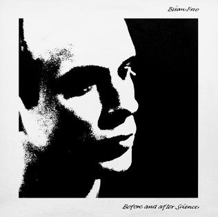

.Brian Eno – 2/1
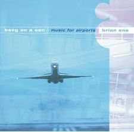

.Roger Eno – Deep Blue Day (Piano Version)
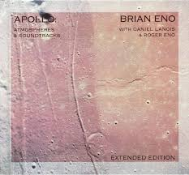

.Aphex Twin – #17 (Z Twig)
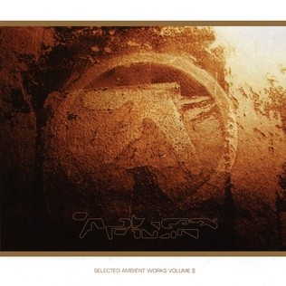

++++
 
++++

.Erik Satie – Gymnopédie No. 2
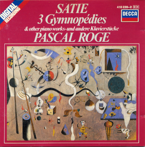

[%hardbreaks]
Clive Wright & Harold Budd – Of Many Mirrors
Daniel Lanois – Little Mustang (Gold Top Edition)
David Bowie – Sense Of Doubt
Hans Zimmer – Day One (Interstellar Theme)
Linda Long – Clover (Trifolium repens) cyanogenic β-glucosidase

++++
 
++++

=== Новые песни июля, 30 июня 2024
<https://aerostatbg.ru/release/995>

.Iron & Wine feat. Fiona Apple – All In Good Time
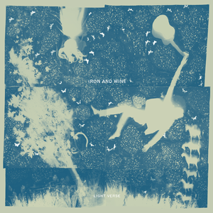

.A Lily – Flimkien Ngħaddu Mill-Bieb

[%hardbreaks]
Zawose Queens – Maisha
Nick Cave & The Bad Seeds – Frogs
Landless – Lúireach Bhríde
Mysterines – Stray
Graham Gouldman – We're Alive
F.Y.A.H. – Cool Down
Luke Combs – The Man He Sees In Me
Ringo Starr – Crooked Boy

++++
 
++++

=== То да Сё №37, 23 июня 2024
<https://aerostatbg.ru/release/994>

.Leon Redbone – Sweet Sue (Just You)
image:LEON REDBONE/Champagne Charlie/cover.jpg[Champagne Charlie,200,200,role="thumb left"]

.Electric Light Orchestra – Strange Magic
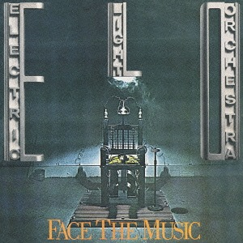

.Judy Collins – Hey, That's No Way To Say Goodbye
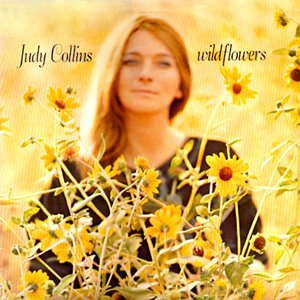

.Paul McCartney & The Wings – I'll Give You A Ring
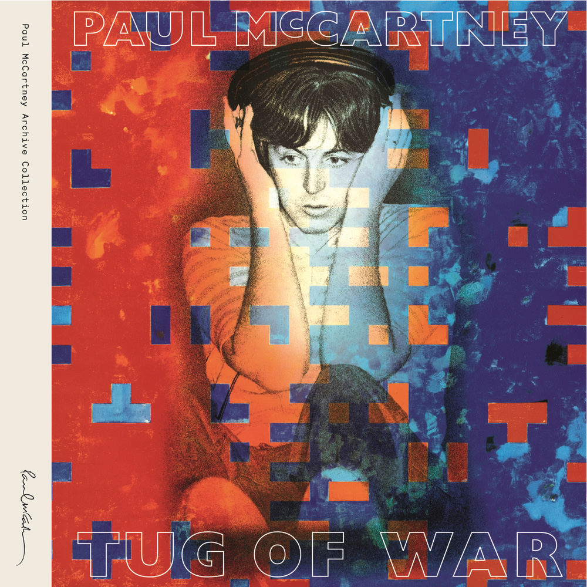

++++
 
++++

[%hardbreaks]
Paul McCartney & The Wings – All Of You
Iron Butterfly – In The Crowds
Sam Lee – Bushes And Briars
Ralph McTell – Mrs Adlam's Angels
Françoise Hardy – Tous les garçons et les filles
Landless – The Trees They Grow Tall
Сплин – Древний грек

++++
 
++++

=== Country, 16 июня 2024
<https://aerostatbg.ru/release/993>

.Taylor Swift – Nothing New
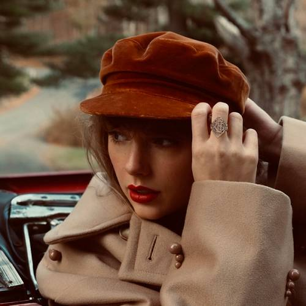

[%hardbreaks]
George Jones – You're Still On My Mind
Waylon Jennings & Willie Nelson – Mammas Don't Let Your Babies Grow Up To Be Cowboys
Eck Robertson & Family – Brilliancy Medley
Jimmie Rodgers – The Soldier's Sweetheart
Hank Williams – Hey, Good Lookin'
Bill Monroe & The Bluegrass Boys – Footprints In The Snow
Gene Vincent & His Blue Caps – Be-Bop-a-Lula
Johnny Cash & The Tennessee Two – I Walk The Line
Dolly Parton – Jolene
Byrds – You Ain't Goin' Nowhere
Kris Kristofferson – Sunday Morning Coming Down
Willie Nelson & Ray Charles – Seven Spanish Angels
Everly Brothers – I'm So Lonesome I Could Cry

++++
 
++++

=== Ютори, 9 июня 2024
<https://aerostatbg.ru/release/992>

.Mark Knopfler – Bad Day A Knife Thrower
image:MARK KNOPFLER/2024 - The Boy/cover.jpg[The Boy,200,200,role="thumb left"]

[%hardbreaks]
Mills Brothers – Tiger Rag
Harold Budd – The Room Of Secondary Light
George Jones – If Drinking Don't Kill Me (Her Memory Will)
Four Tet – Watersynth
Кино – Дерево
Free – Wishing Well
Huun-Huur-Tu, Carmen Rizzo, Dhani Harrison – Mazhalyk
Mantra Of The Cosmos – Gorilla Guerilla
Ricky Nelson – Hello, Mary Lou

++++
 
++++

=== Новые Песни. Июнь, 2 июня 2024
<https://aerostatbg.ru/release/991>

.Mark Knopfler – Mr. Solomons Said
image:MARK KNOPFLER/2024 - The Boy/cover.jpg[The Boy,200,200,role="thumb left"]

[%hardbreaks]
Seasick Steve – Internet Cowboys
Bat For Lashes – The Dream Of Delphi
Mdou Moctar – Imouhar
Guided By Voices – Cavemen Running Naked
Beth Gibbons – Floating On A Moment
Einstürzende Neubauten – Isso Isso
William Elliott Whitmore – Be Still
Slowdive – Alife

++++
 
++++

=== Австралия, 26 мая 2024
<https://aerostatbg.ru/release/990>

.Nick Cave & The Bad Seeds – Girl In Amber
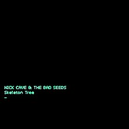

[%hardbreaks]
Lucksmiths – Synchronised Sinking
King Gizzard & The Lizard Wizard – Nuclear Fusion
Lazy Harry – Wild Colonial Boy
Easybeats – Friday On My Mind
AC/DC – Back In Black
Midnight Oil – Beds Are Burning
Men At Work – Who Can It Be Now?
Rolf Harris – Tie Me Kangaroo Down, Sport
Lucksmiths – The Great Dividing Range

++++
 
++++

=== Новые Имена, 19 мая 2024
<https://aerostatbg.ru/release/989>

[%hardbreaks]
Knack – My Sharona
Asa Tone – Perpetual Motion Via Jungle Transport
T Bone Burnett feat. Steven Soles – Hawaiian Blue Songs
Slowdive – Slomo
Louise Ferrenc – Quintet for Piano and Winds, Op. 8: III. Scherzo
Maya Ongaku – Something In Morning Rain
Avett Brothers – Live And Die
Stephen Marley feat. Ziggy Marley – There's A Reward
Séamus Ennis – A Little Bench Of Rushes

++++
 
++++

=== Боги и Тату, 12 мая 2024
<https://aerostatbg.ru/release/988>

.King Creosote – I Des

.Beck – Turn Away
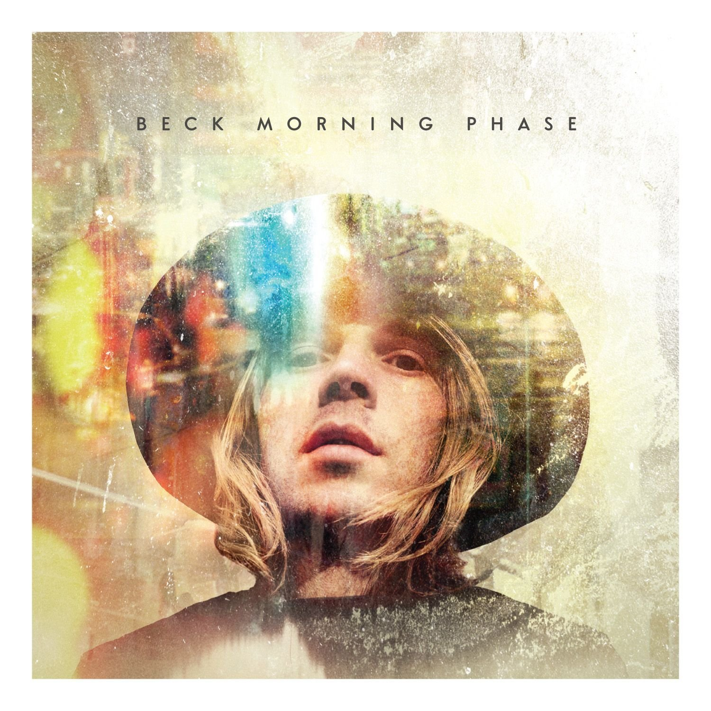

.Talking Heads – This Must Be the Place (Naïve Melody)
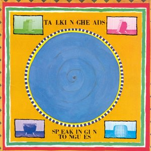

.Steve Jansen – Ballad Of A Deadman
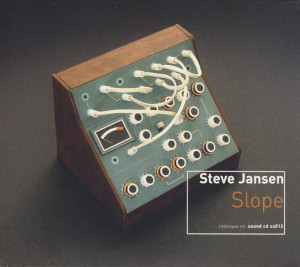

++++
 
++++

.Sufjan Stevens – Futile Devices
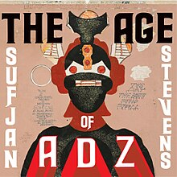

[%hardbreaks]
King Creosote – Love Is A Curse
БГ+ – Не убивает
Who – Tattoo
Stella Jang – Walking Down The Road
Lei Qiang – Crescent Moon Before Dawn
King Creosote – Walter de la Nightmare

++++
 
++++

=== Новые песни мая. Пасха, 5 мая 2024
<https://aerostatbg.ru/release/987>

.Bonnie 'Prince' Billy – Like It Or Not
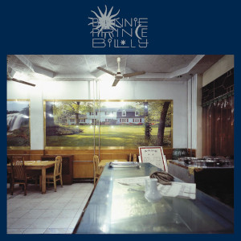

.George Harrison - link:GEORGE%20HARRISON/George%20Harrison%20-%20Best%20Of%20Dark%20Horse%201976-1989/lyrics/darkhorse.html#_blow_away[Blow Away]
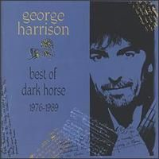

[%hardbreaks]
David Gilmour – The Piper's Call
Brad Mehldau – Between Bach
Thom Yorke – Knife Edge
Johnny Cash – Well Alright
Brian Eno feat. Leo Abrahams, Jon Hopkins – Emerald And Lime
UB40 – Home
Yard Act – The Undertow

++++
 
++++

=== Beltain Красота, 28 апреля 2024
<https://aerostatbg.ru/release/986>

.Planxty – 'P' Stands For Paddy, I Suppose
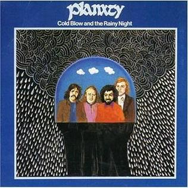

[%hardbreaks]
Chieftains – An Dhruimfhionn Donn Dílis (Slow Air)
Tannas – Sabhal Ia'n 'ic Uisdean
Old Blind Dogs – Johnny O' Braidislee
Guidewires, Pádraig Rynne, Tóla Custy, Sylvain Barou, Karol Lynch & Paul McSherry (feat. Mike Shimmin) – Caoimhín
Silly Sisters – How Shall I Your True Love Know?
Silly Wizard – Tha Mi Sgith (Strathspey) / Eck Stewart's March / MacKenzie's Fancy (Marches)
Dick Gaughan – The Recruited Collier
Anna Mhoireach – Tìr nan Òg
High Level Ranters – Fortune Turns The Wheel

++++
 
++++

=== То да Сё №35, 21 апреля 2024
<https://aerostatbg.ru/release/985>

.Jimmy Page & Robert Plant - link:ROBERT%20PLANT/Robert%20Plant%20-%20Sixty%20Six%20To%20Timbuktu%20(Disc%201)/lyrics/timbuktu.html#_rude_world[Rude World]
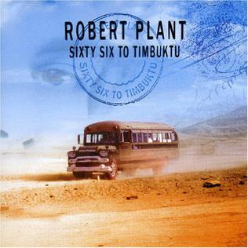

.Cat Stevens – Angelsea
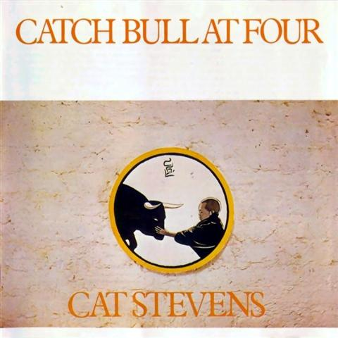

.Beatles – Keep Your Hands Off My Baby
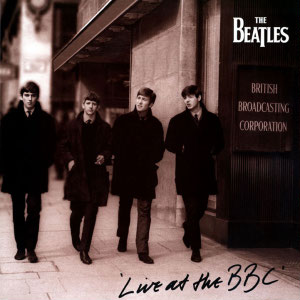

[%hardbreaks]
Buddy Greco – The Lady Is A Tramp
James McCartney – Primrose Hill
Kraftwerk – The Hall of Mirrors
Jimmy Page & Robert Plant – Most High
Antonio Cece, Ludovica Bastianini & Nico Sommese – Seikilos Epitaph
Paul McCartney – Yvonne's The One

++++
 
++++

=== Новые Имена, 14 апреля 2024
<https://aerostatbg.ru/release/984>

[%hardbreaks]
Pietro Mascagni – Cavalleria Rusticana: Intermezzo
Noga Erez feat. Reo Cragun & Rousso – Views
Ruhollâh Khâleqi feat. Gholâm-Hoseyn Banân – Shab-e Javâni
Limp Bizkit – My Way
High Level Ranters – Fortune Turns The Wheel
Marie Laforêt – Mon amour, mon ami
Bothy Band – Fionnghuala
Erroll Garner – Misty
Fungus – Farewell To Tarwathie
António Carreira – Canção a quatro glosada
Bothy Band – Calum Sgaire

++++
 
++++

=== Новые Песни Апреля, 7 апреля 2024
<https://aerostatbg.ru/release/983>

.Black Keys – Beautiful People (Stay High)
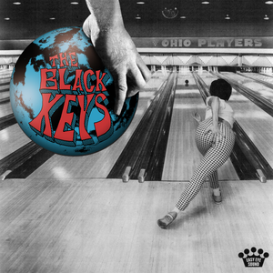

.Shabaka Hutchings – End Of Innocence
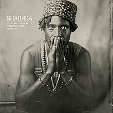

[%hardbreaks]
Waxahatchee – 365
Pearl Jam – Dark Matter
Katherine Priddy – Selah
MC5 – Kick Out The Jams
Blitzen Trapper – Hello Hallelujah
Sahra Halgan – Laga
Chris Brain – Now Westlin Winds
Cast – Faraway

++++
 
++++

=== То да Сё №34, 31 марта 2024
<https://aerostatbg.ru/release/982>

.Theo Travis & Robert Fripp – The Power To Believe / Pastorale
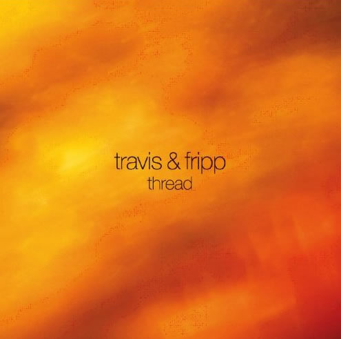

.Johann Sebastian Bach – Orchestral Suite No. 3 in D major: I. Overture

.Can – Sing Swan Song
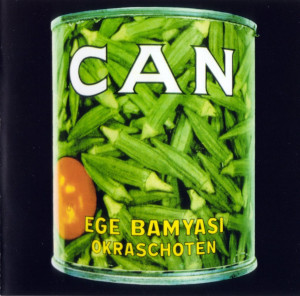

.Melanie – The Good Guys
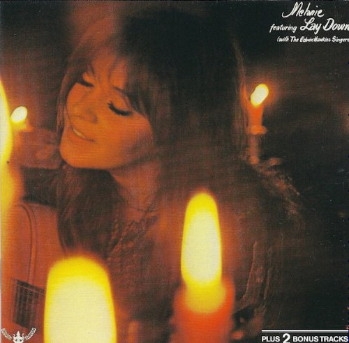

++++
 
++++

[%hardbreaks]
World Party – Is It Like Today?
Paul McCartney & Wings – Mama's Little Girl
БГ+ – На берегу пруда

++++
 
++++

=== Свадьба Культур, 24 марта 2024
<https://aerostatbg.ru/release/981>

.Jimmy Page & Robert Plant – Friends
image:LED ZEPPELIN/Led Zeppelin - III/III.jpg[Led Zeppelin,200,200,role="thumb left"]

.Beatles – Within You Without You
image:THE BEATLES/1967a - Sgt Peppers Lonely Hearts Club Band/cover.jpg[Sgt Peppers Lonely Hearts Club Band,200,200,role="thumb left"]

.Astrud Gilberto – The Girl From Ipanema

.Paul Simon – Diamonds On The Soles Of Her Shoes
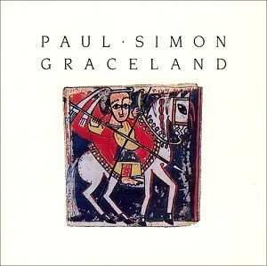

++++
 
++++

.Beatles – The Inner Light

.Silly Wizard – Highland Clearances

[%hardbreaks]
Specials – Stupid Marriage
George Harrison – Singing Om
Rolling Stones – Little Red Rooster
Борис Гребенщиков – Голубиное слово

++++
 
++++

=== Nu March Songs, 17 марта 2024
<https://aerostatbg.ru/release/980>

.Richard Thompson – Singapore Sadie
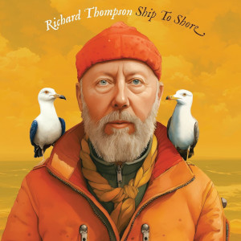

.Smile – Read The Room
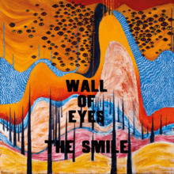

.Crowded House – Oh Hi
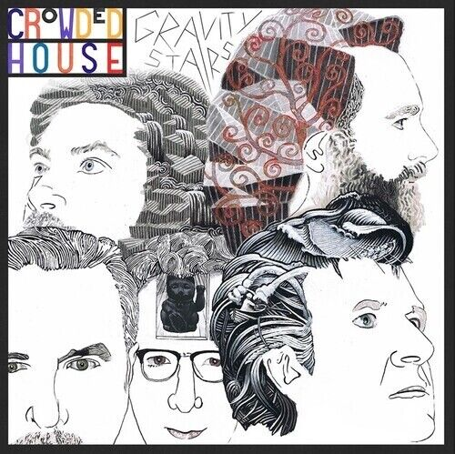

[%hardbreaks]
БГ+ – Текила, виски и джин
Eels – Time
Pet Shop Boys – Loneliness
Liam Gallagher & John Squire – Mars To Liverpool
Kacey Musgraves – Too Good To Be True
Richard Hawley – Two For His Heels
Keith Richards – I'm Waiting For The Man

++++
 
++++

=== Ответы на Ваши Вопросы, 10 марта 2024
<https://aerostatbg.ru/release/979>

.Jethro Tull – Slipstream
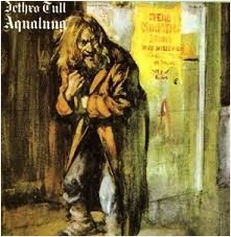

.Donovan – The Little Tin Soldier
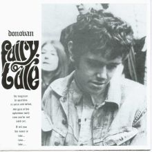

[%hardbreaks]
Roxy Music – Over You
Séamus Begley – Will You Go To Flanders
Searchers – Someday We're Gonna Love Again
Claude Le Jeune – Un gentil amoureux
Jimi Hendrix – One Rainy Wish
Deep Purple – Black Night
Аквариум – Нога судьбы
State of Bengal & Paban Das Baul – Moner Manush
Martin Carthy & Family – Hog-Eye Man

++++
 
++++

=== New Имена, 3 марта 2024
<https://aerostatbg.ru/release/978>

[%hardbreaks]
Adama Koita – Fantainfalla Toyi Bolo
Them Crooked Vultures – Gunman
Amistat – Seasons
Kaleo – Way Down We Go
Mississippi Fred McDowell – You Gotta Move
Vieux Farka Touré & Julia Easterlin – A'Bashiye
McDonald & Giles – Is She Waiting?
Barbara Strozzi – Che si può fare
Ariel Kalma, Jeremiah Chiu & Marta Sofia Honer – A Treasure Chest
Bereket Getachew – Afzeza

++++
 
++++

=== Кодекс Джедая, 25 февраля 2024 
<https://aerostatbg.ru/release/977>

.King Creosote – Love Is A Curse

.King Crimson feat. Keith Tippett – Prince Rupert Awakes
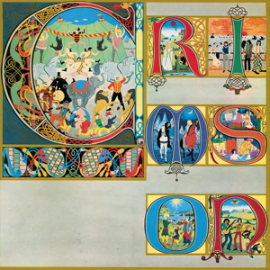

[%hardbreaks]
Jack Bruce – There's A Forest
Rhythms del Mundo feat. Jack Johnson – Better Together
Thomas Mapfumo & The Blacks Unlimited – Tombi Wachena
Jack Hylton & His Orchestra – Happy Days Are Here Again
Japan – Taking Islands In Africa
Kevin Ayers – The Confessions of Doctor Dream, Part 1: Irreversible Neural Damage
Terakaft – Alghalem
Eno Moebius Roedelius – Broken Head

++++
 
++++

=== О Чём Ваши Песни? 18 февраля 2024 
<https://aerostatbg.ru/release/976>

.Robert Plant – Falling In Love Again
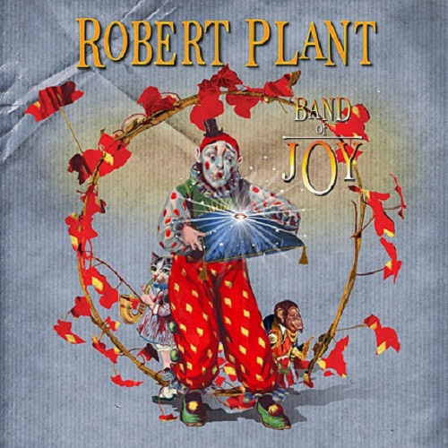

.Richard Thompson – Ghost Of You Walks
image:RICHARD THOMPSON/2001 - Action Packed - The Best of the Capitol Years/cover.jpg[Action Packed - The Best of the Capitol Years,200,200,role="thumb left"]

.Leonard Cohen - link:LEONARD%20COHEN/Leonard%20Cohen%20-%20Ten%20New%20Songs/lyrics/ten.html#_by_the_rivers_dark[By The Rivers Dark]

.Steeleye Span – Little Sir Hugh
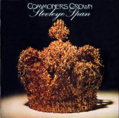

++++
 
++++

.Damian Marley – Time Travel

[%hardbreaks]
Tony Scott – Za-Zen (Meditation)
Bob Marley & The Wailers – Ride Natty Ride
Rolling Stones – Angie
David Bowie – Because You're Young
БГ+ – Bernie & Ciaran

++++
 
++++

=== День Серебра, 11 февраля 2024 
<https://aerostatbg.ru/release/975>

[%hardbreaks]
Аквариум – Сидя На Красивом Холме
Аквариум – Иван Бодхидхарма
Аквариум – Дело Мастера Бо
Аквариум – Выстрелы С Той Стороны
Аквариум – Двигаться Дальше
Аквариум – Она не знает, что это (Сны)
Аквариум – Электричество
Аквариум – Глаз
Аквариум – Здравствуй, Моя Смерть
Аквариум – Колыбельная
Аквариум – Пока Не Начался Джаз

++++
 
++++

=== New February Songs, 4 февраля 2024 
<https://aerostatbg.ru/release/974>

[%hardbreaks]
Vaccines – Lunar Eclipse
Cosmo Sheldrake – Stop The Music
Ambrose Akinmusire feat. Bill Frisell & Herlin Riley – Weighted Corners
Solomon – Bloom
Jesus and Mary Chain – Chemical Animal
Hans-Joachim Roedelius & Arnold Kasar – Wordless
Castellows – I Know It'll Never End
Villagers – That Golden Time
Les Amazones d'Afrique – Kuma Fo
Malice K – Radio
Noah Kahan – Stick Season

++++
 
++++

=== Химолк 2024, 28 января 2024
<https://aerostatbg.ru/release/973>

.Flook – Ellie Goes West
image:Flook 2019 - Ancora/cover.jpg[Ancora,200,200,role="thumb left"]

[%hardbreaks]
Martin Carthy feat. Dave Swarbrick – And A-Begging I Will Go
Richard Thompson – Light Bob's Lassie
Watersons – The Greenland Whale Fishery
Lumiere – Edward On Loch Erne's Shore
Nic Jones – The Little Pot Stove
Kate Rusby – Broken-Hearted I Will Wander
Andy M. Stewart – I'd Cross The Wild Atlantic
Chieftains & The Low Anthem – School Days Over

++++
 
++++

=== Коммерция и Му, 21 января 2024
<https://aerostatbg.ru/release/972>

.Planxty – Sí bheag, Sí mhór
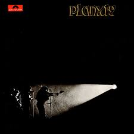

[%hardbreaks]
Русско-Абиссинский оркестр – Zarn Hlar
Аквариум – Иван-чай
ABBA – The Winner Takes It All
Afro Celt Sound System feat. Sinéad O'Connor – Release
Beatles – There's A Place
Brian Setzer – Let's Shake
Weepies, Deb Talan & Steve Tannen – Gotta Have You
Phil Cunningham & Aly Bain – Spring The Summer Long
Bryan Ferry – I'll See You Again

++++
 
++++

=== New January songs, 14 января 2024
<https://aerostatbg.ru/release/971>

[%hardbreaks]
Grandaddy – Watercooler
Joe Jackson & Max Champion – The Bishop And The Actress
Dead South – A Little Devil
Lee Scratch Perry feat. Greentea Peng – 100lbs Of Summer
БГ – Saraswati
Bill Ryder-Jones – If Tomorrow Starts Without Me
Ty Segall – My Best Friend
Joni Mitchell – Like Veils Said Lorraine
Cast – Faraway

++++
 
++++

---

> link:aerostat.html[<Home>]
> link:toc.html[<Contents>]
> link:lyrics.html[<Lyrics>]