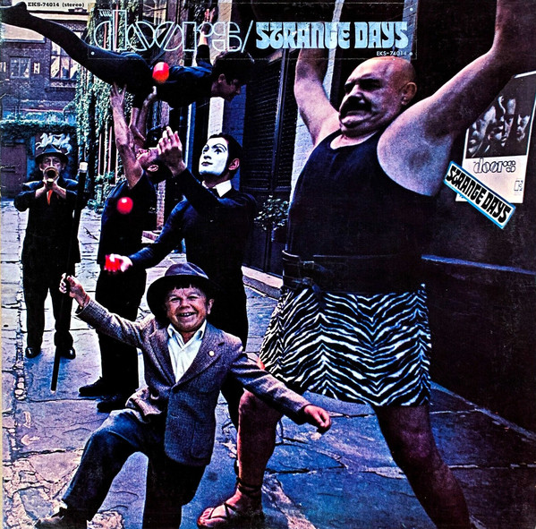
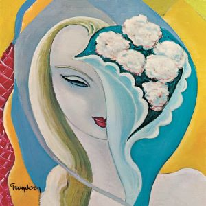

= Радио Аэростат
:toc: left

> link:aerostat.html[<Home>]
> link:toc.html[<Contents>]
> link:lyrics.html[<Lyrics>]

++++

++++

                                                                          
== 42.

=== То да Cё (к Первому сентября), 31 августа 2025
<https://aerostatbg.ru/release/1054>

.Beatles – Baby, You're A Rich Man
image:THE BEATLES/1967b - Magical Mystery Tour/cover.jpg[Magical Mystery Tour,200,200,role="thumb left"]

.Doors – My Eyes Have Seen You

[%hardbreaks]
Alice Cooper – School's Out
Yeule – Electric
Аквариум – Лебединая сталь
Iron Butterfly – Belda-Beast
Gentle Giant – Schooldays
Strawberry Alarm Clock – Incense And Peppermints
Turtles – Happy Together

++++
 
++++

=== Сага об Иннокентии, 24 августа 2025
<https://aerostatbg.ru/release/1053>

.Crosby, Stills & Nash – Wasted On The Way

[%hardbreaks]
Yardbirds – For Your Love
Yes – I've Seen All Good People
Yusuf / Cat Stevens – I Think I See The Light
YG Marley – Praise Jah In The Moonlight
Frank Zappa – The Legend Of Golden Arches
Young Dubliners – (I Don't Think I'll) Love Anymore
Ye Vagabonds – On Yonder Hill
Yusuf / Cat Stevens – Greenfields, Golden Sands

++++
 
++++

=== Ответы на Вопросы, 17 августа 2025
<https://aerostatbg.ru/release/1052>

.Derek & The Dominoes – Bell Bottom Blues

.Idle Race – A Better Life (The Weather Man Knows)
image:Idle Race/Idle Race/Idle_Race_(album).jpeg[Idle Race,200,200,role="thumb left"]

[%hardbreaks]
Борис Гребенщиков – Прощание с новогодней ёлкой (Б. Окуджава)
George Frideric Handel – Oboe Concerto No. 1 in B-flat major: I. Adagio
Shirley & Dolly Collins – Over The Hills And Far Away
Frank Zappa & The Mothers Of Invention – Dirty Love
Free – Wild Indian Woman
Johann Sebastian Bach – Trio Sonata No. 1 in E-flat major: II. Adagio
Incredible String Band – Gently Tender

++++
 
++++

---

> link:aerostat.html[<Home>]
> link:toc.html[<Contents>]
> link:lyrics.html[<Lyrics>]