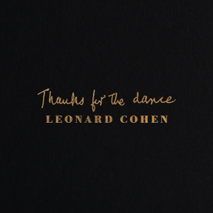
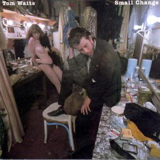
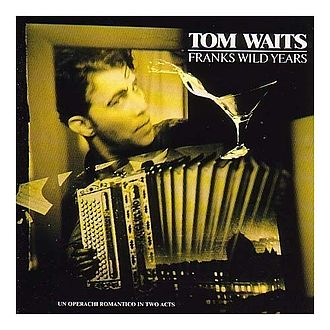
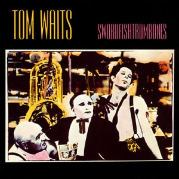
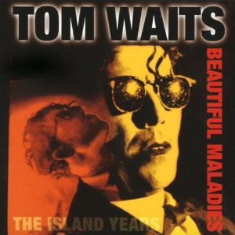
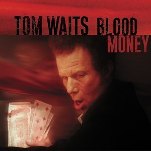

= Радио Аэростат
:toc: left

- link:aerostat30.html[`Глава XXX.    28.04.2018 - 20.10.2019`]
- link:aerostat29.html[`Глава XXIX.   14.10.2018 - 21.04.2019`]
- link:aerostat28.html[`Глава XXVIII.  8.04.2018 -  7.10.2018`]
- link:aerostat27.html[`Глава XXVII.  10.09.2017 -  1.04.2018`]
- link:aerostat26.html[`Глава XXVI.    5.03.2017 -  3.09.2017`]
- link:aerostat25.html[`Глава XXV.    28.08.2016 - 26.02.2017`]
- link:aerostat24.html[`Глава XXIV.   16.02.2016 - 21.08.2016`]
- link:aerostat23.html[`Глава XXIII.  30.08.2015 - 21.02.2016`]
- link:aerostat22.html[`Глава XXII.    1.03.2015 - 23.08.2015`]
- link:aerostat21.html[`Глава XXI.    31.08.2014 - 22.02.2015`]
- link:aerostat20.html[`Глава XX.      2.03.2014 - 24.08.2014`]
- link:aerostat19.html[`Глава XIX.    15.09.2013 - 23.02.2014`]

...

- link:aerostat05.html[`Глава V.      25.03.2006 -  9.09.2007`]
- link:aerostat04.html[`Глава IV.      8.10.2006 - 18.03.2007`]
- link:aerostat03.html[`Глава III.    23.04.2006 -  1.10.2006`]
- link:aerostat02.html[`Глава II.      6.11.2005 - 16.04.2006`]
- link:aerostat01.html[`Глава I.      22.05.2005 - 30.10.2005`]

++++
 
++++

> link:lyrics.html[Lyrics]

++++

++++

<<<

== 31.

<http://www.aquarium.ru/misc/aerostat/index.html>

=== Рождество, 22 декабря 2019

<http://www.radiorus.ru/brand/57083/episode/2231513>

[%hardbreaks]
Nat King Cole - Adeste Fideles
Seamus Kennedy - Shepherds Arise
Charles Trenet - Chanson Pour Noel
Rustavi - Rachuli Alilo
Donavon Steele - Christmas In Jamaica
Arspop & Sergio Palumbo - Noel Malekramba Zogd-Y Noogo
Die Flippers - O Tannenbaum
Karl Lundeberg - Bombay Bells
Edith Piaf - Le Noel De La Rue
Kate Rusby - Hippo For Christmas
Skylark Vocal Ensemble - Jesus Refulsit Omnium
Mary Hopkin - Mary Had A Baby
Bing Crosby - White Christmas

=== Сила музыки, 15 декабря 2019

<http://www.radiorus.ru/brand/57083/episode/2229234>

[%hardbreaks]
Te Vaka - Taka Uo Pele
Nass El Ghiwane - Allah Ya Moulana
Dr. John - Same Old Same Old
Dr. John - Mama Roux
Strokes - You Only Live Once
Bing Crosby - True Love
Gene Austin - Ain't She Sweet
Beatles - Ain't She Sweet
Peter & Gordon - I Don't Want To See You Again
Albinoni - Trumpet Concerto In D-Min. Adagio
Lei Qiang - Liu Yang River
Bitw - Poen Tyfiant

=== Новые песни декабря, 8 декабря 2019

<http://www.radiorus.ru/brand/57083/episode/2226836>

[%hardbreaks]
Pet Shop Boys - Burning The Heather
Ozzy Osbourne - Under The Graveyard
Kate Rusby - Salute The Morn
Beck - Die Waiting
Junius Paul - Baker's Dozen
Omar Souleiman - Shi Tridin
Rod Stewart - I Don't Want To Talk About It
Paul McCartney - Home Tonight

=== То да сё #5, 1 декабря 2019

<http://www.radiorus.ru/brand/57083/episode/2223937>

[%hardbreaks]
High Llamas - Island People
J S Bach - Herz Und Mund
Elvis Costello - Accidents Will Happen
Electric Light Orchestra - Ordinary Dream
Cars - My Best Friend's Girl
Gia Kancheli - Theme From King Lear
Coldcut & On-U Sound - Divide And Rule
King Crimson - Level 5
Sergio Mendes - Night And Day

=== "From Out Of Nowhere", 24 ноября 2019

<http://www.radiorus.ru/brand/57083/episode/2222868>

[%hardbreaks]
Electric Light Orchestra - Help Yourself
Electric Light Orchestra - 10538 Overture (40th Anniversary Edition)
Electric Light Orchestra - Sci Fi Woman
Electric Light Orchestra - One More Time
Electric Light Orchestra - Songbird
Electric Light Orchestra - Time Of Our Life
Electric Light Orchestra - Goin' Out On Me
Electric Light Orchestra - All My Love
Electric Light Orchestra - Down Came The Rain
Electric Light Orchestra - Losing You
Electric Light Orchestra - From Out Of Nowhere

=== Новые песни ноября, 17 ноября 2019

<http://www.radiorus.ru/brand/57083/episode/2220587>

.Leonard Cohen - What Happened To The Heart

[%hardbreaks]
The New York Renaissance Band - Le Triory De Bretaigne
Ringo Starr - Grow Old With Me
Winged Victory For The Sullen - The Haunted V Pencil
Elbow - Dexter & Sinister
Battles - Juice B Crypts
Lightning Dust - A Pretty Picture
Richard Taha - Je Suis Africain
Penguin Cafe - Chinstrap
Angel Olson - New Love Cassette

=== Преобразование Тома Уэйтса, 10 ноября 2019

<http://www.radiorus.ru/brand/57083/episode/2217965>

.Tom Waits - The Piano Has Been Drinking

.Tom Waits - Downtown
image:TOM WAITS/Tom Waits 1980 - Heartattack And Vine/cover.jpg[Heartattack And Vine,200,200,role="thumb left"]

.Tom Waits - link:TOM%20WAITS/Tom%20Waits%201987%20-%20Franks%20Wild%20Years/lyrics/franks.html#_more_than_rain[More Than Rain]

.Tom Waits - Underground

++++
 
++++

.Tom Waits - link:TOM%20WAITS/Tom%20Waits%201985%20-%20Rain%20Dogs%20-%20part%201/lyrics/raindogs.html#_anywhere_i_lay_my_head[Anywhere I Lay My Head]
image:TOM WAITS/Tom Waits 1985 - Rain Dogs - part 1/raindogs.png[Rain Dogs - part 1,200,200,role="thumb left"]

.Tom Waits - Downtown Train

.Tom Waits - A Good Man Is Hard To Find

[%hardbreaks]
Tom Waits - Saving All My Love For You
Tom Waits - Blow Wind Blow
Tom Waits - Big Black Maria

++++
 
++++

=== Samhain 2019, 3 ноября 2019

<https://www.radiorus.ru/brand/57083/episode/2216411>

[%hardbreaks]
Trials Of Cato - Tom Paine's Bones
Jim Moray - Bold Lowell
Lost Words - Blessing
Ye Vagabonds - On Yonder Hill
Julie Fowlis - Dh'eirich
Lankum - The Wild Rover
Manran - Thugainn
Rachel Newton - Here's My Heart Come Take It
Talisk - Cabot Trail

=== Новые имена, 27 октября 2019

<https://www.radiorus.ru/brand/57083/episode/2213755>

[%hardbreaks]
Matshikos - New South Africa
Chris Forsyth - Tomorrow Might As Well Be Today
Glen Hansard - Falling Slowly
Chihei Hatakeyama - Treads Echoing Far Away
Jim Croce - Time In A Bottle
Balkan Boom Box - Adir Adirim
Gilbert Becaud - Natalie
Вероника Долина - Любите Меня
Rakesh Chaurasia - Mane To Manavi Lejo
Supergrass - Alright

