= Радио Аэростат
:toc: left

> link:aerostat.html[<Home>]
> link:toc.html[<Contents>]
> link:lyrics.html[<Lyrics>]

++++

++++

                                                                          
== 37.

=== Венец Творения, 16 апреля 2023
<https://aerostatbg.ru/release/932>

.Cocteau Twins – Serpentskirt
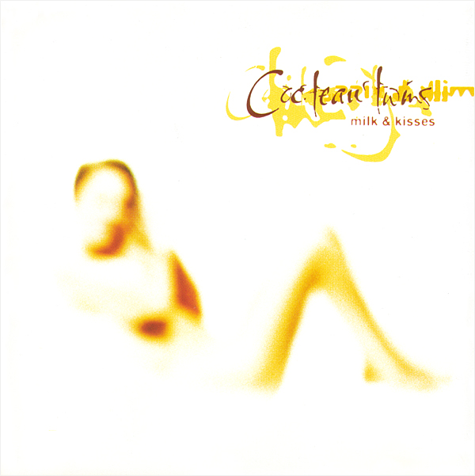

.Tommy Sands – Don't Call Me Early In The Morning
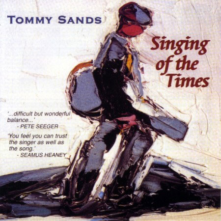

.REM - link:REM/REM%20-%20Up/lyrics/up.html#_falls_to_climb[Falls To Climb]

.Jethro Tull - link:JETHRO%20TULL/1972%20%20Living%20In%20The%20Past/lyrics/past.html#_nursie[Nursie]
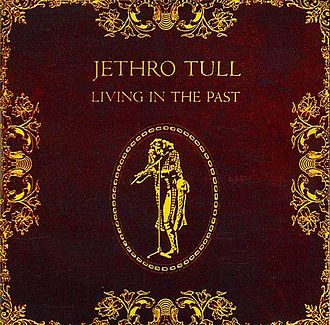

++++
 
++++ 

.Jethro Tull - link:JETHRO%20TULL/Jethro%20Tull%20-%20Heavy%20Horses/lyrics/horses.html#_weathercock[Weathercock]
image:JETHRO TULL/Jethro Tull - Heavy Horses/cover.jpg[Heavy Horses,200,200,role="thumb left"]

[%hardbreaks]
Pomerium – Penet: Virgo prudentissima
Weepies – Same Changes
MycoLyco – Cordyceps Militaris Mushroom Music
Rakesh Chaurasia, Sunil Das, Ulhas Bapat, Zarin Daruwala, Akhlak Hussain, Bhavani Shankar, Ashit Desai – Odhhaji Mara Vaalane
High Llamas – Pilgrims

++++
 
++++   
    
=== New Names, 9 апреля 2023
<https://aerostatbg.ru/release/931>

.Acid Arab feat. Cem Yıldız – Döne Döne

[%hardbreaks]
Cosmo Sheldrake – Nightjar
LaVern Baker & The Gliders – Jim Dandy
Baaba Maal – Kalaajo
Lucrecia Dalt – Dicen
Cramps – Goo Goo Muck
Alabaster DePlume – I Want A Red Car
Roches – Hammond Song
Selecter – Carry Go Bring Home
LaVern Baker – Soul On Fire
    
++++
 
++++   

=== Psychedeliа И Сознание, 2 апреля 2023
<https://aerostatbg.ru/release/930>

[%hardbreaks]
Norman Greenbaum – Spirit In The Sky
Status Quo – Pictures Of Matchstick Men
Mirage – Is Anybody Home
Sleepy – Rosie Can't Fly
Hi-Fi's – You're Haunting Me
Plastic Penny – Mrs. Grundy
Kinks – Two Sisters
Tomorrow – Auntie Mary's Dress Shop
Apple – Buffalo Billycan
Pink Floyd – Flaming
Troggs – Last Summer
    
++++
 
++++    
    
=== Новые Песни Апреля, 26 марта 2023
<https://aerostatbg.ru/release/929>

.Signe Marie Rustad – Hello It's Me
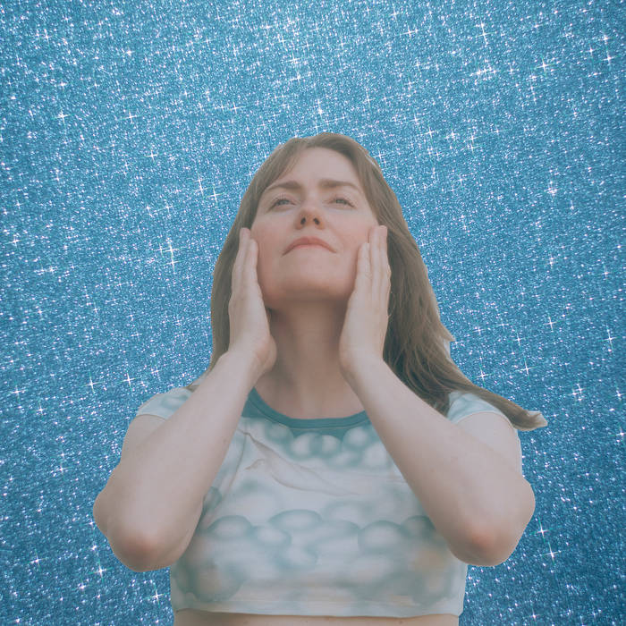

.Hollow Hand – One Last Summer
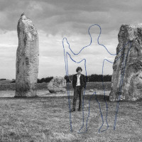

[%hardbreaks]
Damned – Beware Of The Clown
Sleaford Mods feat. Perry Farrell – So Trendy
Allan Clarke – Buddy's Back
Orbital feat. The Little Pest – What A Surprise
Deerhoof – Wedding, March, Flower
Temples – Afterlife
John Cale feat. Fat White Family – The Legal Status Of Ice
Аквариум – Песни вычерпывающих людей

++++
 
++++

=== Викинги, 19 марта 2023
<https://aerostatbg.ru/release/928>

.Jethro Tull – Broadsword
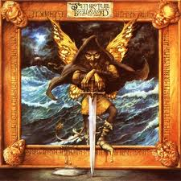

.Mari Boine – Vuoi vuoi mu
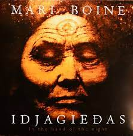

.Robert Plant – Monkey
image:ROBERT PLANT/2010 - Band of Joy/120s8xu.jpg[Band of Joy,200,200,role="thumb left"]

[%hardbreaks]
Steppenwolf – Jupiter's Child
Faun – Hymn To Pan
Hedningarna – Räven
Wardruna – Raido

++++
 
++++

=== Новые Песни Марта, 12 марта 2023
<https://aerostatbg.ru/release/927>

.Brian Eno – Bimini Twist
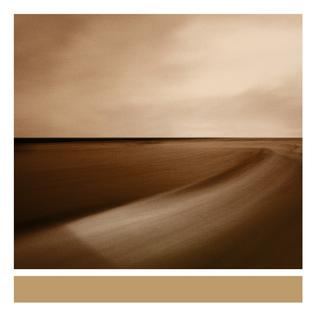

.Acid Arab feat. Sofiane Saidi – Leila

[%hardbreaks]
Peter Gabriel – The Court (Dark-Side Mix)
Shania Twain – Best Friend
Depeche Mode – Ghosts Again
Mgzavrebi – Den Den Duri
Unknown Mortal Orchestra – Nadja
Bleep Bloop – Fires
Polobi & The Gwo Ka Masters – Zion
Reverend And The Makers – Problems

++++
 
++++

=== Blues For Allah, 5 марта 2023
<https://aerostatbg.ru/release/926>

.Grateful Dead – Help On The Way / Slipknot!
image:GRATEFUL DEAD/Grateful Dead - Blues For Allah/cover.jpg[Blues For Allah,200,200,role="thumb left"]

[%hardbreaks]
Grateful Dead – Franklin's Tower
Grateful Dead – King Solomon's Marbles (Part I: Stronger Than Dirt / Part II: Milkin' The Turkey)
Grateful Dead – Crazy Fingers
Grateful Dead – Sage & Spirit
Grateful Dead – Blues For Allah / Sand Castles & Glass Camels / Unusual Occurrences In The Desert
    
++++
 
++++

=== То Да Сё №29, 26 февраля 2023
<https://aerostatbg.ru/release/925>

.Howard Shore – The Shire (Concerning Hobbits)

.Massive Attack – Risingson

.Gus Teja World Music – Morning Happiness
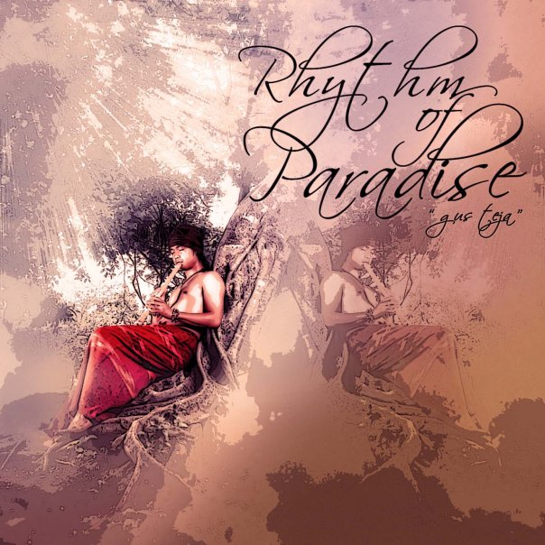

.George Harrison – Breath Away From Heaven
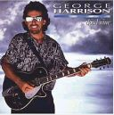

++++
 
++++

[%hardbreaks]
Dolores Keane – Mouth Music/Eddie Curran's Favourite
Gandharva – Chinta Jagate
Boo Radleys – Fairfax Scene
Skrillex, Fred Again & Flowdan – Rumble
Tomaso Albinoni – Trumpet Concerto in D minor: III. Adagio
The Mamas & The Papas – Nothing's Too Good For My Little Girl
Toots & The Maytals feat. Terry Hall, The Skatalites and U-Roy – Never Grow Old

++++
 
++++

=== Terry Hall, 19 февраля 2023
<https://aerostatbg.ru/release/924>

.Specials - link:Specials/Encore%20(Deluxe)/lyrics/encore.html#_gangsters[Gangsters]

.Specials – My Next Door Neighbor

[%hardbreaks]
Fun Boy Three – The Lunatics (Have Taken Over The Asylum)
Specials – Stereotype
Specials & Fun Boy Three – Our Lips Are Sealed
Colourfield – Thinking Of You
Terry Hall & Mushtaq – A Gathering Storm
Terry Hall – From Dawn To Distraction
Terry Hall – Beautiful People
Specials – Doesn't Make It Alright
    
++++
 
++++

=== 30-е годы: эпоха стиля, 12 февраля 2023
<https://aerostatbg.ru/release/923>

.Ink Spots – Someone's Rocking My Dreamboat
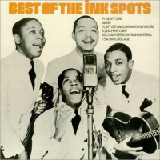

[%hardbreaks]
Jack Buchanan – Goodnight Vienna
Rudy Vallée – Brother, Can You Spare A Dime?
Jimmie Lewis & His Orchestra – The Merry-Go-Round Broke Down
Little Jack Little & His Orchestra – I'm In The Mood For Love
Benny Goodman – Liza (All The Clouds'll Roll Away)
Bing Crosby – Where The Blue Of The Night (Meets The Gold Of The Day)
Bing Crosby & The Mills Brothers – Dinah
Al Bowlly – Sweet And Lovely
Paul Whiteman & His Orchestra – Body And Soul
Glenn Miller & His Orchestra – Moonlight Serenade

++++
 
++++

=== Новые песни Февраля, 5 февраля 2023
<https://aerostatbg.ru/release/922>

[%hardbreaks]
Sunny War – No Reason
Mary Hopkin – Midsummer Dream
Jethro Tull – Ginnungagap
Ryuichi Sakamoto – 20211130
Ryuichi Sakamoto & Hildur Guðnadóttir – World Citizen I Won't Be Disappointed
Dave Gahan & Kurt Uenala – Chains
Mary Wallopers – Cod Liver Oil & The Orange Juice
Amber Arcades – Odd To Even
Ian Hunter – Bed Of Roses
    
++++
 
++++

=== Imbolc 2023, 29 января 2023
<https://aerostatbg.ru/release/921>

.Richard Thompson & Danny Thompson – Drifting Through The Days
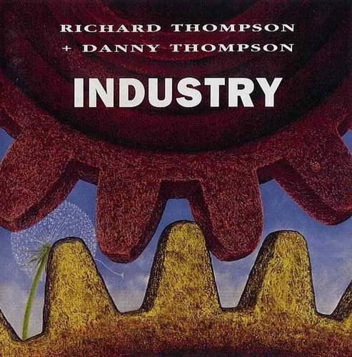

.Archie Fisher & Garnet Rogers – The Winter It Is Past
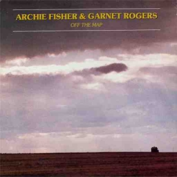

.Battlefield Band – Shepherd Lad
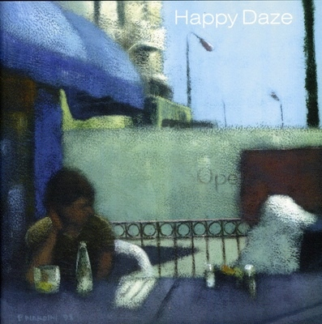

[%hardbreaks]
Albion Band – Jacob's Well
Karan Casey – Nine Apples Of Gold
Lumiere – Don oíche úd í mBeithil
Christy Moore – Where I Come From
Duncan Chisholm – Black Cuillin
Lumiere – Ye Jacobites
Tannahill Weavers – Auld Lang Syne
    
++++
 
++++

=== То да сё № 28, 22 января 2023
<https://aerostatbg.ru/release/920>

.David Bowie - link:DAVID%20BOWIE/The%20Rise%20And%20Fall%20Of%20Ziggy%20Stardust%20And%20The%20Spiders%20From%20Mars/lyrics/ziggy.html#_starman[Starman]
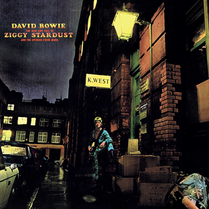

.Gryphon – Tea Wrecks
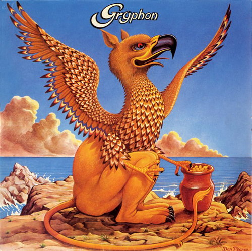

[%hardbreaks]
George Frideric Handel – Water Piece, Suite in D major (HWV 341): V. March
Peter Gabriel – Panopticom
Damian Marley – Looks Are Deceiving
Gentle Giant – The Moon Is Down
Serj Tankian feat. Sevak Amroyan – Amber
Аквариум – Даже не думай об этом
Pete Coe – Wait Till The Clouds Roll By

++++
 
++++

=== Jerry Lee Lewis, 15 января 2023
<https://aerostatbg.ru/release/919>

[%hardbreaks]
Jerry Lee Lewis – Great Balls Of Fire
Jerry Lee Lewis – Chantilly Lace
Jerry Lee Lewis – Drinkin' Wine, Spo-Dee-O-Dee
Jerry Lee Lewis – Whole Lotta Shakin' Goin' On
Jerry Lee Lewis – You Can Have Her
Jerry Lee Lewis – High School Confidential
Jerry Lee Lewis – You Win Again
Jerry Lee Lewis – Another Place, Another Time
Jerry Lee Lewis – Bad, Bad Leroy Brown
Jerry Lee Lewis – Wild One
Jerry Lee Lewis – Stepchild
Jerry Lee Lewis – Goodnight Irene
Jerry Lee Lewis – Crazy Arms

++++
 
++++

=== Новые Песни Января, 8 января 2023
<https://aerostatbg.ru/release/918>

.Kate Rusby – Christmas Is Merry
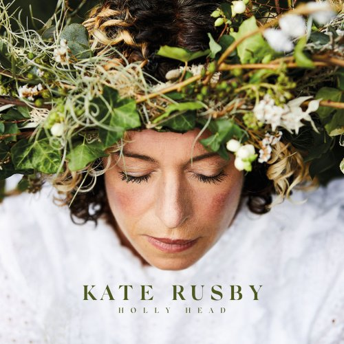

[%hardbreaks]
Marc-Antoine Charpentier – In nativitatem Domini nostri Jesu Christi canticum, H. 414: Ouverture
Black-Am-I – Mr Hurry Come Up
Twinkle3 – I Borrow Moonlight
Billy Nomates – Balance Is Gone
Guided By Voices – Instinct Dwelling
Margo Price – Change Of Heart
Quasi – Queen Of Ears
Terry Hall & Mushtaq – The Hour Of Two Lights
Simon Raymonde – Worship Me

++++
 
++++

=== С Новым Годом!, 1 января 2023
<https://aerostatbg.ru/release/917>

.Howlin' Wolf - link:Howlin%20Wolf%20-%20His%20Best/lyrics/howlin.html#_smokestack_lightnin[Smokestack Lightnin']
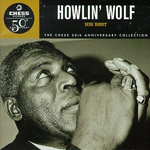

.Fairport Convention - link:FAIRPORT%20CONVENTION/Fairport%20Convention-What%20We%20Did%20On%20Our%20Holidays-1969/lyrics/holidays.html#_book_song[Book Song]
image:FAIRPORT CONVENTION/Fairport Convention-What We Did On Our Holidays-1969/cover.jpg[What We Did On Our Holidays-1969,200,200,role="thumb left"]

.Idle Race – I Like My Toys
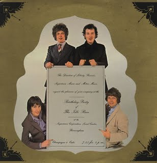

.Lisa Gerrard feat. Patrick Cassidy – Adrift
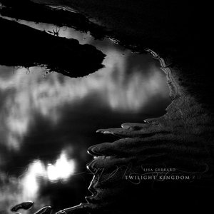

++++
 
++++

.Human League – Together In Electric Dreams
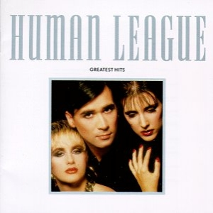

.Howard Shore – The Shire (Concerning Hobbits)

[%hardbreaks]
БГ+ – Пегги Поршень
Kathmandu Music Center feat. Raman Maharjan & Tsering Gyurmey – Prayers, To Wish Prevalence Of Happiness In The World
Iggy Pop – Strung Out Johnny
БГ+ – Сидя На Красивом Холме

++++
 
++++

---

> link:aerostat.html[<Home>]
> link:toc.html[<Contents>]
> link:lyrics.html[<Lyrics>]