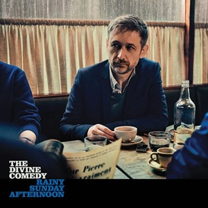
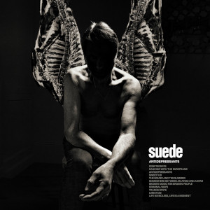
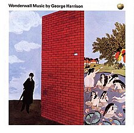
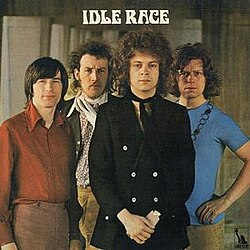

= Радио Аэростат
:toc: left

> link:aerostat.html[<Home>]
> link:toc.html[<Contents>]
> link:lyrics.html[<Lyrics>]

++++

++++

                                                                          
== 42.

=== Новые Песни Октября, 28 сентября 2025
<https://aerostatbg.ru/release/1058>

.Divine Comedy – Invisible Thread

.Suede – Dancing With The Europeans

.Orb – Arabebonics

[%hardbreaks]
Gruff Rhys – Cân I'r Cymylau
Dean Johnson – Carol
Baby Cham, Damian Marley & Stephen Marley – Hustling In My Blood
Gorillaz feat. Sparks – The Happy Dictator
Beatles – Free As A Bird (2025 Mix)

++++
 
++++

=== Полезные Слова, 21 сентября 2025
<https://aerostatbg.ru/release/1057>

.Jethro Tull - link:JETHRO%20TULL/Jethro%20Tull%20-%20Heavy%20Horses/lyrics/horses.html#_heavy_horses[Heavy Horses]
image:JETHRO TULL/Jethro Tull - Heavy Horses/cover.jpg[Heavy Horses,200,200,role="thumb left"]

[%hardbreaks]
Ozzy Osbourne – I Just Want You
Rolling Stones – Ain't Too Proud To Beg
Andy M. Stewart – The Man In The Moon
Aardvark – Once Upon A Hill
Georg Philipp Telemann – Recorder Sonata in F minor: II. Allegro
Vishwanath H. V. feat. Vanishree & Vijayalakshmi – Bhagavad Gita, Chapter 5 - Sanyasa Yoga

++++
 
++++

=== Высокодуховные Ответы, 14 сентября 2025
<https://aerostatbg.ru/release/1056>

.George Harrison – On The Bed

.Doors – The Crystal Ship
image:DOORS/1967 - The Doors/Folder.jpg[The Doors,200,200,role="thumb left"]

.Giles, Giles & Fripp – One In A Million
image:KING CRIMSON/1968 - The Cheerful Insanity Of/Folder.jpg[The Cheerful Insanity Of,200,200,role="thumb left"]

.George Harrison – Flying Hour
image:GEORGE HARRISON/1995 - Pirate Songs/cover.jpg[Pirate Songs,200,200,role="thumb left"]

++++
 
++++

.Brian Eno – Fickle Sun (III) I'm Set Free
image:BRIAN ENO/Brian Eno 2016 - The Ship/folder.jpg[The Ship,200,200,role="thumb left"]

[%hardbreaks]
Cocteau Twins & Harold Budd – Eyes Are Mosaics
Brian Eno & Harold Budd – Late October
Аквариум – Комната, лишённая зеркал
Donovan – Roots Of Oak

++++
 
++++

=== Новые Песни Сентября, 7 сентября 2025
<https://aerostatbg.ru/release/1055>

.Steeleye Span – Trees Are Whispering

.Ed Sheeran – Old Phone

[%hardbreaks]
Future Clouds & Radar – The Man Who Would Be King
Brian Eno & Beatie Wolfe – Ringing Ocean
Junior Murvin – No Bed Of Roses
Solomon – Unrequited
Ty Segall – Shoplifter
Matmos – The Chrome Reflects Our Image
Elizabeth Fraser – At Last I Am Free
Neil Young & The Chrome Hearts – Silver Eagle

++++
 
++++

=== То да Cё (к Первому сентября), 31 августа 2025
<https://aerostatbg.ru/release/1054>

.Beatles – Baby, You're A Rich Man
image:THE BEATLES/1967b - Magical Mystery Tour/cover.jpg[Magical Mystery Tour,200,200,role="thumb left"]

.Doors – My Eyes Have Seen You
image:DOORS/1967 - Strange Days/cover.jpg[Strange Days,200,200,role="thumb left"]

[%hardbreaks]
Alice Cooper – School's Out
Yeule – Electric
Аквариум – Лебединая сталь
Iron Butterfly – Belda-Beast
Gentle Giant – Schooldays
Strawberry Alarm Clock – Incense And Peppermints
Turtles – Happy Together

++++
 
++++

=== Сага об Иннокентии, 24 августа 2025
<https://aerostatbg.ru/release/1053>

.Crosby, Stills & Nash – Wasted On The Way
image:Crosby Stills Nash/2005 - Greatest Hits/cover.jpg[Greatest Hits,200,200,role="thumb left"]

[%hardbreaks]
Yardbirds – For Your Love
Yes – I've Seen All Good People
Yusuf / Cat Stevens – I Think I See The Light
YG Marley – Praise Jah In The Moonlight
Frank Zappa – The Legend Of Golden Arches
Young Dubliners – (I Don't Think I'll) Love Anymore
Ye Vagabonds – On Yonder Hill
Yusuf / Cat Stevens – Greenfields, Golden Sands

++++
 
++++

=== Ответы на Вопросы, 17 августа 2025
<https://aerostatbg.ru/release/1052>

.Derek & The Dominoes – Bell Bottom Blues
image:Eric Clapton/1970 - Layla and Other Assorted Love Songs/cover.jpg[Layla and Other Assorted Love Songs,200,200,role="thumb left"]

.Idle Race – A Better Life (The Weather Man Knows)

[%hardbreaks]
Борис Гребенщиков – Прощание с новогодней ёлкой (Б. Окуджава)
George Frideric Handel – Oboe Concerto No. 1 in B-flat major: I. Adagio
Shirley & Dolly Collins – Over The Hills And Far Away
Frank Zappa & The Mothers Of Invention – Dirty Love
Free – Wild Indian Woman
Johann Sebastian Bach – Trio Sonata No. 1 in E-flat major: II. Adagio
Incredible String Band – Gently Tender

++++
 
++++

---

> link:aerostat.html[<Home>]
> link:toc.html[<Contents>]
> link:lyrics.html[<Lyrics>]