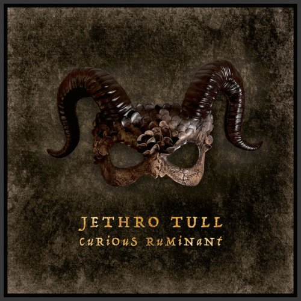
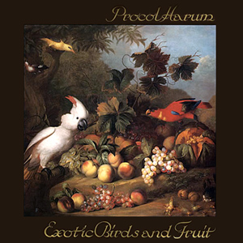
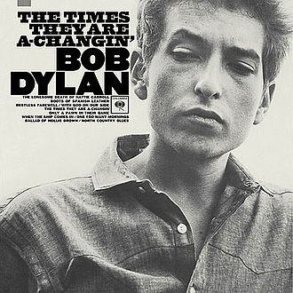
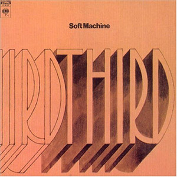

= Радио Аэростат
:toc: left

> link:aerostat.html[<Home>]
> link:toc.html[<Contents>]
> link:lyrics.html[<Lyrics>]

++++

++++

                                                                          
== 41.

=== Танцы в Честь Ушедших, 9 марта 2025
<https://aerostatbg.ru/release/1029>

[%hardbreaks]
Band – Acadian Driftwood
Peter, Paul & Mary – Early Mornin' Rain
Sam & Dave – Soul Man
Olivia Tremor Control – Hideaway
Zakir Hussain feat. Hariprasad Chaurasia, John McLaughlin, Jan Garbarek – Water Girl
David Johansen – She
David Lynch & Angelo Badalamenti – Just You
Captain Beefheart – Low Yo Yo Stuff
Jam – Town Called Malice
Roy Ayers – Reaching The Highest Pleasure
Badfinger – Come And Get It

++++
 
++++

=== Новые Песни Марта, 2 марта 2025
<https://aerostatbg.ru/release/1028>

.Jethro Tull – The Tipu House

[%hardbreaks]
Thom Yorke & Mark Pritchard – Back In The Game
Wooze – Sabre Tooth Spider
Steven Wilson – December Skies
Horace Andy feat. Jr. Santa – Be Wise
Ozzy Osbourne & Billy Morrison feat. Steve Stevens – Gods Of Rock'n'Roll
Piers Faccini & Ballaké Sissoko – One Half Of A Dream
Salif Keita – Tassi
Buddy Guy & Switchfoot – Last Man Standing
Jason Isbell – Bury Me

++++
 
++++

=== Ещё Прогрессив, 23 февраля 2025  
<https://aerostatbg.ru/release/1027>

.Procol Harum – New Lamps For Old

.Jethro Tull – Cheap Day Return
image:JETHRO TULL/1971  Aqualung/cover.jpg[1971  Aqualung,200,200,role="thumb left"]

.Jethro Tull - link:JETHRO%20TULL/1972%20%20Living%20In%20The%20Past/lyrics/past.html#_just_trying_to_be[Just Trying To Be]
image:JETHRO TULL/1972  Living In The Past/cover.jpg[1972  Living In The Past,200,200,role="thumb left"]

[%hardbreaks]
Barclay James Harvest – Hymn
Jade Warrior – Memories Of A Distant Sea
Emerson, Lake & Powell – Touch And Go
Caravan – Hello, Hello
Third Ear Band – At The Well / The Princes' Escape / Coronation / Come Sealing Night
Henry Cow – Nine Funerals Of Citizen King
Arthur Brown's Kingdom Come – Sunrise

++++
 
++++

=== То да Сё, 16 февраля 2025  
<https://aerostatbg.ru/release/1026>

.Bob Dylan – One Too Many Mornings

.Led Zeppelin – Since I've Been Loving You
image:LED ZEPPELIN/Led Zeppelin - III/III.jpg[III,200,200,role="thumb left"]

.Soft Machine – Moon In June

.Loudon Wainwright III – Do We? We Do

++++
 
++++

[%hardbreaks]
Éamon Doorley, Muireann Nic Amhlaoibh, Julie Fowlis & Ross Martin – An eala bhán
Chris Brain – Wish
Lumiere – Poor Wayfaring Stranger
Black Sabbath – Who Are You?
Éamon Doorley, Muireann Nic Amhlaoibh, Julie Fowlis & Ross Martin – Dá bhfaigheann mo rogha de thriúr acu / Dhannsamaid le Ailean / Cairistion' nigh'n Eòghainn

++++
 
++++

=== Новые Песни Февраля, 9 февраля 2025  
<https://aerostatbg.ru/release/1025>

[%hardbreaks]
Luke Sital-Singh – Still Young
Good Flying Birds – I Care For You
Marianne Faithfull – This Little Bird
Sparks – Do Things My Own Way
Songhoy Blues – Norou
Marshall Allen – Same Old Love
Richard Dawson – Polytunnel
FKA Twigs & Koreless – Drums Of Death
Peter Doherty – Felt Better Alive
Ludovico Einaudi – Jay
George Harrison – Sunshine Life for Me (Sail Away Raymond)

++++
 
++++

---

> link:aerostat.html[<Home>]
> link:toc.html[<Contents>]
> link:lyrics.html[<Lyrics>]