= Радио Аэростат
:toc: left

> link:aerostat.html[<Home>]
> link:toc.html[<Contents>]
> link:lyrics.html[<Lyrics>]

++++

++++

                                                                          
== 43.

=== Новые Песни Июля, 5 июля 2026
<https://aerostatbg.ru/release/1098>

.Boards Of Canada – Father And Son
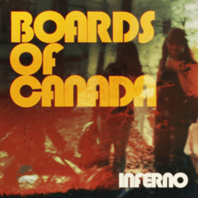

[%hardbreaks]
East Pointers – Maritime Moonshine
Peter Gabriel – A Hard Lesson
Dropkick Murphys & Shane MacGowan – The Body Of An American
Arthur Brown & The Crazy World Of Arthur Brown & Dan Smith – Nature
Hu – Warrior Chant
Seu Jorge – Luz Na Escuridão
Rolling Stones – Jealous Lover
Stephen Marley – Hills Of St. Ann

++++
 
++++

=== Ответы на Вопросы, 28 июня 2026
<https://aerostatbg.ru/release/1097>

.Аквариум – Дом всех святых
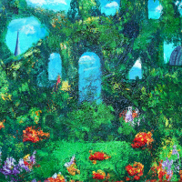

.George Harrison - link:GEORGE%20HARRISON/George%20Harrison%20-%20Brainwashed/lyrics/brainwashed.html#_run_so_far[Run So Far]
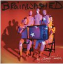

.Weepies – All This Beauty
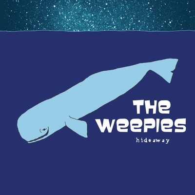

[%hardbreaks]
Peter Noone – Meet Me On The Corner Down At Joe's Café
Yusuf / Cat Stevens – Heaven / Where True Love Go
Gentle Giant – No God's A Man
Jesse Welles – Domestic Error
Аквариум – Suaimhneas Intinne

++++
 
++++

=== То да Сё № 52, 21 июня 2026
<https://aerostatbg.ru/release/1096>

.Miles Davis – Nuit sur les Champs-Élysées (Take 1)

.Archie Fisher – Dark Eyed Molly

.Tom Petty & The Heartbreakers - link:TOM%20PETTY/Tom%20Petty%201994%20-%20Wildflowers/lyrics/wildflowers.html#_to_find_a_friend[To Find A Friend]
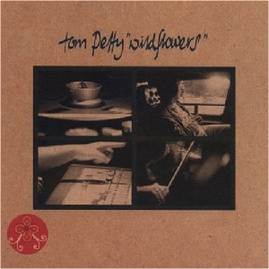

.John Lennon – Going Down On Love
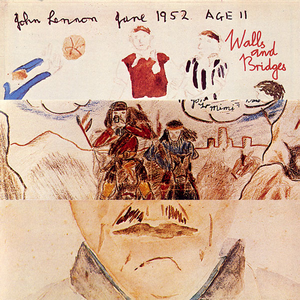

++++
 
++++

.Screamin' Jay Hawkins – I Put A Spell On You

.George Harrison – Cowboy Music
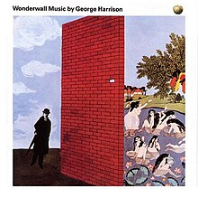

[%hardbreaks]
Rjanikanto – Jekhane Se Dayal Amar
Laurie Anderson – Strange Angels
Arthur Brown – Junkyard King
Barleyjuice – Weekend Irish

++++
 
++++

=== Новости, 14 июня 2026
<https://aerostatbg.ru/release/1095>

.Paul McCartney – Never Know

.Planxty – The Irish Marche
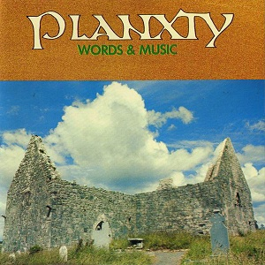

[%hardbreaks]
Peter Gabriel – A Hard Lesson
Sonny Rollins & Wynton Kelly – Tune Up
Michael Stipe & Andrew Watt – I Played The Fool
Pogues – A Pair Of Brown Eyes
Afrika Bambaataa – Soul Makossa
Frightened Rabbit – I Wish I Was Sober

++++
 
++++

=== Снежный Лев, 7 июня 2026
<https://aerostatbg.ru/release/1094>

[%hardbreaks]
Аквариум – Инцидент в Настасьино
Аквариум – Центр циклона
Аквариум – Максим-лесник
Аквариум – Древнерусская тоска
Аквариум – Дубровский
Аквариум – Истребитель
Аквариум – Чёрный брахман
Аквариум – Великая железнодорожная симфония
Аквариум – Серебряная роза

++++
 
++++

=== Новые Песни Июня, 31 мая 2026
<https://aerostatbg.ru/release/1093>

.Claypool Lennon Delirium – Meat Machines
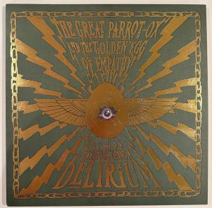

[%hardbreaks]
Sunny Eldr – Eldr! Ulfr!
Martin Simpson – Recruited Collier
Capleton & Little Lion Sound – Jah Is My Leader
Beck – Ride Lonesome
Lambchop – Weakened
Noah Kahan – End Of August
Reverend & The Makers (feat. Robbie Williams) – Fucked Up

++++
 
++++

=== Вопросы и Ответы, 24 мая 2026
<https://aerostatbg.ru/release/1092>

.Etta James – At Last

.Planxty – The Little Drummer
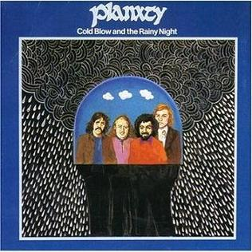

.Procol Harum - link:PROCOL%20HARUM/1967%20-%20Procol%20Harum%20(With%20Bonus%20Tracks)/lyrics/procol.html#_something_following_me[Something Following Me]
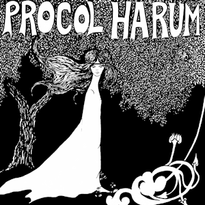

.Pugwash – Lullaby #1
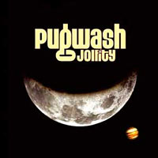

++++
 
++++

.Beatles – Komm, gib mir deine Hand

[%hardbreaks]
Chad & Jeremy – A Summer Song
Fortunes – You've Got Your Troubles
Lei Qiang – Farewell Red Army
Аквариум – Не стой на пути у высоких чувств
Police – Every Little Thing She Does Is Magic
Peter & Gordon – Sunday For Tea
Fisherman's Friends – Johnny Gone Down To Hilo

++++
 
++++

=== То да Сё № 51, 17 мая 2026
<https://aerostatbg.ru/release/1091>

.Paul McCartney & Ringo Starr – Home To Us

.Johann Sebastian Bach – English Suite No. 4 in F major: VI. Menuet II

.Smile – Instant Psalm
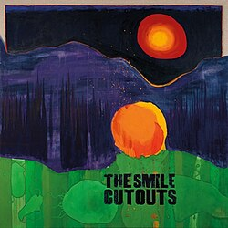

[%hardbreaks]
Bing Crosby – I Whistle A Happy Tune
Rolling Stones – In The Stars
Peter Gabriel – Won't Stand Down
Who – Faith In Something Bigger
Don McLean – Magdalene Lane
Eurythmics – A Little Of You
Yusuf / Cat Stevens – To Be What You Must

++++
 
++++

=== Новые Имена, 10 мая 2026
<https://aerostatbg.ru/release/1090>

.Hazel O'Connor – D-Days
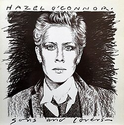

.Art Pepper – Maybe Next Year
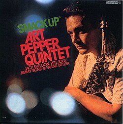

[%hardbreaks]
Kris Drever – Every Time
Honeybus – I Can't Let Maggie Go
King Tubby feat. Augustus Pablo – King Tubby Meets Rockers Uptown
Cult – She Sells Sanctuary
Eddie Palmieri – Vámonos pa'l Monte
Fourmost – Some Kind Of Wonderful
Capleton & Little Lion Sound & Derrick Sound – Red Again
Black Skirts – Love Is All

++++
 
++++

=== Новые Песни Мая, 3 мая 2026
<https://aerostatbg.ru/release/1089>

.Protoje feat. Damian Marley – At We Feet

.Tori Amos – Gasoline Girls

[%hardbreaks]
Dandy Warhols – Cherry Bomb
Squarepusher – K1 Advance
Massive Attack feat. Tom Waits – Boots On The Ground
Cosmo Sheldrake – Old Ocean
Cockroaches – Rough And Twisted
Shye Ben Tzur, Jonny Greenwood & The Rajasthan Express – Ranjha
Lemon Twigs – 2 Or 3
U2 – In A Life

++++
 
++++

=== BELTAIN, 26 апреля 2026
<https://aerostatbg.ru/release/1088>

.Lumiere – The West's Awake

[%hardbreaks]
Chieftains – Ag Taisteal Na Blárnán
Martin Carthy – The Song Of The Lower Classes
Foreign Landers – I Am A Youth Incline To Ramble
Lúnasa – Páistín Fionn
Tommy Sands feat. Moya Sands & Fionan Sands – The People Have Spoken
Moya Brennan – Black Night
Traffic – Hole In My Shoe
Аквариум – Мир, как мы его знали
Steeleye Span – The Holly And The Ivy

++++
 
++++

=== Новые Имена, 19 апреля 2026
<https://aerostatbg.ru/release/1087>

.Mitski – In A Lake

[%hardbreaks]
Barstaff – Outta Your League
Nubiyan Twist – Body Flows
Molotovs – Daydreaming
Gene Autry – You Are My Sunshine
Three Seas – Rongmohol
Andrew Wasylyk – First Moonbeams Of Adulthood
Orielles – Shadow Of You Appears
Tashi Dorji – Low Clouds Hang, This Land Is On Fire
Dry Bones & Dennis Bovell – Jonny Minor

++++
 
++++

=== То да Сё № 50, 12 апреля 2026
<https://aerostatbg.ru/release/1086>

.Kate Rusby – High On A Hill

.Bob Dylan – Things Have Changed

.Ian Brown – The Sweet Fantastic
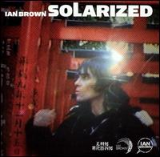

.Sleaford Mods feat. Aldous Harding – Elitest G.O.A.T. (The Prodigy Acid Thunder Remix)
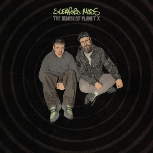

++++
 
++++

.Herb Alpert & The Tijuana Brass – Whipped Cream
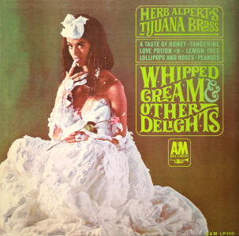

[%hardbreaks]
Paul McCartney – Days We Left Behind
Neil Sedaka – Breaking Up Is Hard To Do
Мистерията на българските гласове – Калиманку, Денку
Аквариум – Ключи от моих дверей

++++
 
++++

=== Заппа Заппа, 5 апреля 2026
<https://aerostatbg.ru/release/1085>

[%hardbreaks]
Frank Zappa & The Mothers Of Invention – Zombie Woof
Frank Zappa & The Mothers Of Invention – Montana
Frank Zappa & The Mothers Of Invention – Sleeping In A Jar
Frank Zappa & The Mothers Of Invention – Duke Of Prunes
Frank Zappa & The Mothers Of Invention – Call Any Vegetable
Frank Zappa & The Mothers Of Invention – Camarillo Brillo
Frank Zappa – Amnerika Goes Home
Frank Zappa & The Mothers Of Invention – Wonderful Wino
Frank Zappa & The Mothers Of Invention – You're Probably Wondering Why I'm Here
Frank Zappa – Jazz From Hell
Frank Zappa – Harder Than Your Husband

++++
 
++++

=== Новые Песни Апреля, 29 марта 2026
<https://aerostatbg.ru/release/1084>

.U2 – Song Of The Future

.Tinariwen – Amidinim Ehaf Solan
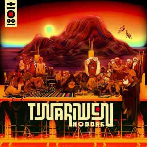

[%hardbreaks]
Peter Gabriel – What Lies Ahead
Anna Calvi feat. Iggy Pop – God's Lonely Man
Ringo Starr – It's Been Too Long
Magpie Arc – The Mantle
Country Joe & The Fish – The 'Fish' Cheer / I-Feel-Like-I'm-Fixin'-To-Die Rag
Depeche Mode – Universal Soldier
Максим Леонидов – Послание
Секрет – 40 секунд пути
Paul McCartney – Mull Of Kintyre

++++
 
++++

=== То Да Сё № 49, 22 марта 2026
<https://aerostatbg.ru/release/1083>

.Robert Plant – All The King's Horses
image:ROBERT PLANT/2005 - Mighty Rearranger/front.jpg[Mighty Rearranger,200,200,role="thumb left"]

.Imagined Village – My Son John
image:The Imagined Village/2010 - Empire & Love/cover.jpg[Empire & Love,200,200,role="thumb left"]

.Bob Marley – Roots
image:BOB MARLEY/1976 - Rastaman Vibration/Folder.jpg[Rastaman Vibration,200,200,role="thumb left"]

[%hardbreaks]
Hollies – Games We Play
Cake – The Guitar Man
Paul Horn – Initiation: Psalm 2
Dolores Keane – I Courted A Soldier
Аквариум – Никто и Звать Никак
Donovan – And Clett Makes Three

++++
 
++++

=== Долгие Песни, 15 марта 2026
<https://aerostatbg.ru/release/1082>

.Jethro Tull – Pibroch (Cap In Hand)
image:JETHRO TULL/1977  Songs From The Wood/cover.jpg[1977  Songs From The Wood,200,200,role="thumb left"]

[%hardbreaks]
Traffic – The Low Spark Of High Heeled Boys
Gentle Giant – His Last Voyage
Lee 'Scratch' Perry – Russian Jesus

++++
 
++++

=== Новые Имена, 8 марта 2026
<https://aerostatbg.ru/release/1081>

.Lenka – Everything At Once
image:Lenka - Two/Two_by_Lenka.png[Two,200,200,role="thumb left"]

[%hardbreaks]
Blawan – NOS
Sammy Virji, Champion & IRAH – Dis Badman
Son Of Kali – Ya Devi Sarva Bhuteshu — Devi Stuti
Burl Ives – The Donut Song
Gnomes – Time Will Tell
SsingSsing – 사시랭이소리
Will Varley – To Build A Wall
Reilly & Maloney – Bramble And The Rose
Miracle Musical – Dream Sweet In Sea Major

++++
 
++++

=== Новые Песни Марта, 1 марта 2026
<https://aerostatbg.ru/release/1080>

.Colourfield – Heart Of America
image:The Colourfield 1987 - Deception/Deception.jpg[Deception,200,200,role="thumb left"]

.Bonnie 'Prince' Billy – Hey Little
image:Bonnie Prince Billy/2026 - We Are Together Again/cover_front.jpg[We Are Together Again,200,200,role="thumb left"]

[%hardbreaks]
Peter Gabriel – Been Undone
Kula Shaker – Lucky Number
Obongjayar – Sweet Danger
Jesse Welles – Join ICE
Dropkick Murphys & Haywire 617 – Citizen I.C.E.
Van Morrison – On A Monday
Morrissey – Notre-Dame
Squeeze – You Get The Feeling

++++
 
++++

=== 9 лучших альбомов джаза, 22 февраля 2026
<https://aerostatbg.ru/release/1079>

.Duke Ellington & His Orchestra – Mood Indigo
image:Duke Ellington/images.jpg[Duke Ellington,200,200,role="thumb left"]

.Miles Davis – Blue In Green
image:MILES DAVIS/Miles Davis 1959 - Kind of Blue (50th Ann Ed) CD 1/folder.jpg[Kind of Blue (50th Ann Ed) CD 1,200,200,role="thumb left"]

[%hardbreaks]
Cannonball Adderley & The Bossa Rio Sextet feat. Sérgio Mendes – Clouds
Dave Brubeck Quartet – Take Five
John Coltrane – Naima
Bill Evans feat. Tony Scott – A Shoulder To Cry On
Charles Mingus – Memories Of You
Art Blakey & Thelonious Monk – Blue Monk
Ahmad Jamal Trio – It Ain't Necessarily So

++++
 
++++

---

> link:aerostat.html[<Home>]
> link:toc.html[<Contents>]
> link:lyrics.html[<Lyrics>]