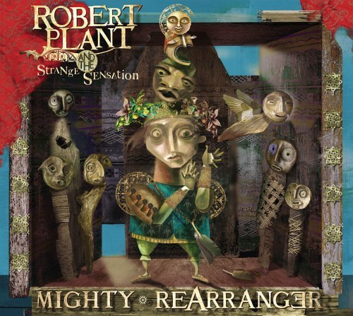
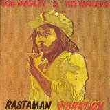
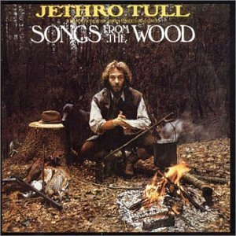
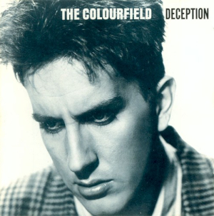
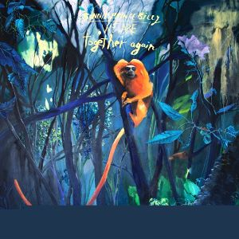
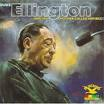
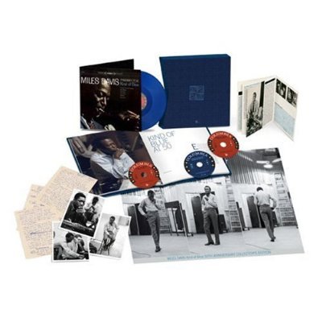

= Радио Аэростат
:toc: left

> link:aerostat.html[<Home>]
> link:toc.html[<Contents>]
> link:lyrics.html[<Lyrics>]

++++

++++

                                                                          
== 43.

=== То Да Сё № 49, 22 марта 2026
<https://aerostatbg.ru/release/1083>

.Robert Plant – All The King's Horses

.Imagined Village – My Son John

.Bob Marley – Roots

[%hardbreaks]
Hollies – Games We Play
Cake – The Guitar Man
Paul Horn – Initiation: Psalm 2
Dolores Keane – I Courted A Soldier
Аквариум – Никто и Звать Никак
Donovan – And Clett Makes Three

++++
 
++++

=== Долгие Песни, 15 марта 2026
<https://aerostatbg.ru/release/1082>

.Jethro Tull – Pibroch (Cap In Hand)

[%hardbreaks]
Traffic – The Low Spark Of High Heeled Boys
Gentle Giant – His Last Voyage
Lee 'Scratch' Perry – Russian Jesus

++++
 
++++

=== Новые Имена, 8 марта 2026
<https://aerostatbg.ru/release/1081>

.Lenka – Everything At Once

[%hardbreaks]
Blawan – NOS
Sammy Virji, Champion & IRAH – Dis Badman
Son Of Kali – Ya Devi Sarva Bhuteshu — Devi Stuti
Burl Ives – The Donut Song
Gnomes – Time Will Tell
SsingSsing – 사시랭이소리
Will Varley – To Build A Wall
Reilly & Maloney – Bramble And The Rose
Miracle Musical – Dream Sweet In Sea Major

++++
 
++++

=== Новые Песни Марта, 1 марта 2026
<https://aerostatbg.ru/release/1080>

.Colourfield – Heart Of America

.Bonnie 'Prince' Billy – Hey Little

[%hardbreaks]
Peter Gabriel – Been Undone
Kula Shaker – Lucky Number
Obongjayar – Sweet Danger
Jesse Welles – Join ICE
Dropkick Murphys & Haywire 617 – Citizen I.C.E.
Van Morrison – On A Monday
Morrissey – Notre-Dame
Squeeze – You Get The Feeling

++++
 
++++

=== 9 лучших альбомов джаза, 22 февраля 2026
<https://aerostatbg.ru/release/1079>

.Duke Ellington & His Orchestra – Mood Indigo

.Miles Davis – Blue In Green

[%hardbreaks]
Cannonball Adderley & The Bossa Rio Sextet feat. Sérgio Mendes – Clouds
Dave Brubeck Quartet – Take Five
John Coltrane – Naima
Bill Evans feat. Tony Scott – A Shoulder To Cry On
Charles Mingus – Memories Of You
Art Blakey & Thelonious Monk – Blue Monk
Ahmad Jamal Trio – It Ain't Necessarily So

++++
 
++++

---

> link:aerostat.html[<Home>]
> link:toc.html[<Contents>]
> link:lyrics.html[<Lyrics>]