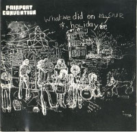

= Радио Аэростат
:toc: left

> link:aerostat.html[<Home>]
> link:toc.html[<Contents>]
> link:lyrics.html[<Lyrics>]

++++

++++

                                                                          
== 37.

=== То да сё № 28, 22 января 2023
<https://aerostatbg.ru/release/920>

.David Bowie - link:DAVID%20BOWIE/The%20Rise%20And%20Fall%20Of%20Ziggy%20Stardust%20And%20The%20Spiders%20From%20Mars/lyrics/ziggy.html#_starman[Starman]
image:DAVID BOWIE/The Rise And Fall Of Ziggy Stardust And The Spiders From Mars/cover.png[The Rise And Fall Of Ziggy Stardust And The Spiders From Mars,200,200,role="thumb left"]

[%hardbreaks]
George Frideric Handel – Water Piece, Suite in D major (HWV 341): V. March
Peter Gabriel – Panopticom
Damian Marley – Looks Are Deceiving
Gentle Giant – The Moon Is Down
Serj Tankian feat. Sevak Amroyan – Amber
Gryphon – Tea Wrecks
Аквариум – Даже не думай об этом
Pete Coe – Wait Till The Clouds Roll By

++++
 
++++

=== Jerry Lee Lewis, 15 января 2023
<https://aerostatbg.ru/release/919>

[%hardbreaks]
Jerry Lee Lewis – Great Balls Of Fire
Jerry Lee Lewis – Chantilly Lace
Jerry Lee Lewis – Drinkin' Wine, Spo-Dee-O-Dee
Jerry Lee Lewis – Whole Lotta Shakin' Goin' On
Jerry Lee Lewis – You Can Have Her
Jerry Lee Lewis – High School Confidential
Jerry Lee Lewis – You Win Again
Jerry Lee Lewis – Another Place, Another Time
Jerry Lee Lewis – Bad, Bad Leroy Brown
Jerry Lee Lewis – Wild One
Jerry Lee Lewis – Stepchild
Jerry Lee Lewis – Goodnight Irene
Jerry Lee Lewis – Crazy Arms

++++
 
++++

=== Новые Песни Января, 8 января 2023
<https://aerostatbg.ru/release/918>

.Kate Rusby – Christmas Is Merry

[%hardbreaks]
Marc-Antoine Charpentier – In nativitatem Domini nostri Jesu Christi canticum, H. 414: Ouverture
Black-Am-I – Mr Hurry Come Up
Twinkle3 – I Borrow Moonlight
Billy Nomates – Balance Is Gone
Guided By Voices – Instinct Dwelling
Margo Price – Change Of Heart
Quasi – Queen Of Ears
Terry Hall & Mushtaq – The Hour Of Two Lights
Simon Raymonde – Worship Me

++++
 
++++

=== С Новым Годом!, 1 января 2023
<https://aerostatbg.ru/release/917>

.Howlin' Wolf - link:Howlin%20Wolf%20-%20His%20Best/lyrics/howlin.html#_smokestack_lightnin[Smokestack Lightnin']
image:Howlin Wolf - His Best/cover.jpg[His Best,200,200,role="thumb left"]

.Fairport Convention - link:FAIRPORT%20CONVENTION/Fairport%20Convention-What%20We%20Did%20On%20Our%20Holidays-1969/lyrics/holidays.html#_book_song[Book Song]

.Idle Race – I Like My Toys

.Lisa Gerrard feat. Patrick Cassidy – Adrift
image:DEAD CAN DANCE/2014 - Twilight Kingdom/Front.jpg[Twilight Kingdom,200,200,role="thumb left"]

++++
 
++++

.Human League – Together In Electric Dreams
image:Human League - Greatest Hits/cover.jpg[Greatest Hits,200,200,role="thumb left"]

.Howard Shore – The Shire (Concerning Hobbits)
image:Lord of the Rings 2005 - The Fellowship of the Ring - The Complete Recordings/albumart.jpg[The Fellowship of the Ring - The Complete Recordings,200,200,role="thumb left"]

[%hardbreaks]
БГ+ – Пегги Поршень
Kathmandu Music Center feat. Raman Maharjan & Tsering Gyurmey – Prayers, To Wish Prevalence Of Happiness In The World
Iggy Pop – Strung Out Johnny
БГ+ – Сидя На Красивом Холме

++++
 
++++

---

> link:aerostat.html[<Home>]
> link:toc.html[<Contents>]
> link:lyrics.html[<Lyrics>]