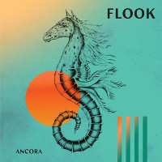

= Радио Аэростат
:toc: left

> link:aerostat.html[<Home>]
> link:toc.html[<Contents>]
> link:lyrics.html[<Lyrics>]

++++

++++

                                                                          
== 39.

=== Nu March Songs, 17 марта 2024
<https://aerostatbg.ru/release/980>

[%hardbreaks]
Crowded House – Oh Hi
БГ+ – Текила, виски и джин
Smile – Read The Room
Richard Thompson – Singapore Sadie
Eels – Time
Pet Shop Boys – Loneliness
Liam Gallagher & John Squire – Mars To Liverpool
Kacey Musgraves – Too Good To Be True
Richard Hawley – Two For His Heels
Keith Richards – I'm Waiting For The Man

++++
 
++++

=== Ответы на Ваши Вопросы, 10 марта 2024
<https://aerostatbg.ru/release/979>

.Jethro Tull – Slipstream

.Donovan – The Little Tin Soldier
image:DONOVAN/Donovan - Fairytale/cover.jpg[Fairytale,200,200,role="thumb left"]

[%hardbreaks]
Roxy Music – Over You
Séamus Begley – Will You Go To Flanders
Searchers – Someday We're Gonna Love Again
Claude Le Jeune – Un gentil amoureux
Jimi Hendrix – One Rainy Wish
Deep Purple – Black Night
Аквариум – Нога судьбы
State of Bengal & Paban Das Baul – Moner Manush
Martin Carthy & Family – Hog-Eye Man

++++
 
++++

=== New Имена, 3 марта 2024
<https://aerostatbg.ru/release/978>

[%hardbreaks]
Adama Koita – Fantainfalla Toyi Bolo
Them Crooked Vultures – Gunman
Amistat – Seasons
Kaleo – Way Down We Go
Mississippi Fred McDowell – You Gotta Move
Vieux Farka Touré & Julia Easterlin – A'Bashiye
McDonald & Giles – Is She Waiting?
Barbara Strozzi – Che si può fare
Ariel Kalma, Jeremiah Chiu & Marta Sofia Honer – A Treasure Chest
Bereket Getachew – Afzeza

++++
 
++++

=== Кодекс Джедая, 25 февраля 2024 
<https://aerostatbg.ru/release/977>

.King Creosote – Love Is A Curse

[%hardbreaks]
Jack Bruce – There's A Forest
Rhythms del Mundo feat. Jack Johnson – Better Together
Thomas Mapfumo & The Blacks Unlimited – Tombi Wachena
Jack Hylton & His Orchestra – Happy Days Are Here Again
Japan – Taking Islands In Africa
Kevin Ayers – The Confessions of Doctor Dream, Part 1: Irreversible Neural Damage
Terakaft – Alghalem
King Crimson feat. Keith Tippett – Prince Rupert Awakes
Eno Moebius Roedelius – Broken Head

++++
 
++++

=== О Чём Ваши Песни? 18 февраля 2024 
<https://aerostatbg.ru/release/976>

.Robert Plant – Falling In Love Again
image:ROBERT PLANT/2010 - Band of Joy/120s8xu.jpg[Band of Joy,200,200,role="thumb left"]

.Richard Thompson – Ghost Of You Walks
image:RICHARD THOMPSON/2001 - Action Packed - The Best of the Capitol Years/cover.jpg[Action Packed - The Best of the Capitol Years,200,200,role="thumb left"]

.Leonard Cohen - link:LEONARD%20COHEN/Leonard%20Cohen%20-%20Ten%20New%20Songs/lyrics/ten.html#_by_the_rivers_dark[By The Rivers Dark]
image:LEONARD COHEN/Leonard Cohen - Ten New Songs/cover.jpg[Ten New Songs,200,200,role="thumb left"]

.Steeleye Span – Little Sir Hugh
image:STEELEYE SPAN/Steeleye Span - Commoners Crown/cover.jpg[Commoners Crown,200,200,role="thumb left"]

++++
 
++++

.Damian Marley – Time Travel
image:Damian Marley - Stony Hill/cover.jpg[Stony Hill,200,200,role="thumb left"]

[%hardbreaks]
Tony Scott – Za-Zen (Meditation)
Bob Marley & The Wailers – Ride Natty Ride
Rolling Stones – Angie
David Bowie – Because You're Young
БГ+ – Bernie & Ciaran

++++
 
++++

=== День Серебра, 11 февраля 2024 
<https://aerostatbg.ru/release/975>

[%hardbreaks]
Аквариум – Сидя На Красивом Холме
Аквариум – Иван Бодхидхарма
Аквариум – Дело Мастера Бо
Аквариум – Выстрелы С Той Стороны
Аквариум – Двигаться Дальше
Аквариум – Она не знает, что это (Сны)
Аквариум – Электричество
Аквариум – Глаз
Аквариум – Здравствуй, Моя Смерть
Аквариум – Колыбельная
Аквариум – Пока Не Начался Джаз

++++
 
++++

=== New February Songs, 4 февраля 2024 
<https://aerostatbg.ru/release/974>

[%hardbreaks]
Vaccines – Lunar Eclipse
Cosmo Sheldrake – Stop The Music
Ambrose Akinmusire feat. Bill Frisell & Herlin Riley – Weighted Corners
Solomon – Bloom
Jesus and Mary Chain – Chemical Animal
Hans-Joachim Roedelius & Arnold Kasar – Wordless
Castellows – I Know It'll Never End
Villagers – That Golden Time
Les Amazones d'Afrique – Kuma Fo
Malice K – Radio
Noah Kahan – Stick Season

++++
 
++++

=== Химолк 2024, 28 января 2024
<https://aerostatbg.ru/release/973>

.Flook – Ellie Goes West

[%hardbreaks]
Martin Carthy feat. Dave Swarbrick – And A-Begging I Will Go
Richard Thompson – Light Bob's Lassie
Watersons – The Greenland Whale Fishery
Lumiere – Edward On Loch Erne's Shore
Nic Jones – The Little Pot Stove
Kate Rusby – Broken-Hearted I Will Wander
Andy M. Stewart – I'd Cross The Wild Atlantic
Chieftains & The Low Anthem – School Days Over

++++
 
++++

=== Коммерция и Му, 21 января 2024
<https://aerostatbg.ru/release/972>

.Planxty – Sí bheag, Sí mhór
image:PLANXTY/Planxty 1973 - Planxty/cover.jpg[Planxty,200,200,role="thumb left"]

[%hardbreaks]
Русско-Абиссинский оркестр – Zarn Hlar
Аквариум – Иван-чай
ABBA – The Winner Takes It All
Afro Celt Sound System feat. Sinéad O'Connor – Release
Beatles – There's A Place
Brian Setzer – Let's Shake
Weepies, Deb Talan & Steve Tannen – Gotta Have You
Phil Cunningham & Aly Bain – Spring The Summer Long
Bryan Ferry – I'll See You Again

++++
 
++++

=== New January songs, 14 января 2024
<https://aerostatbg.ru/release/971>

[%hardbreaks]
Grandaddy – Watercooler
Joe Jackson & Max Champion – The Bishop And The Actress
Dead South – A Little Devil
Lee Scratch Perry feat. Greentea Peng – 100lbs Of Summer
БГ – Saraswati
Bill Ryder-Jones – If Tomorrow Starts Without Me
Ty Segall – My Best Friend
Joni Mitchell – Like Veils Said Lorraine
Cast – Faraway

++++
 
++++

---

> link:aerostat.html[<Home>]
> link:toc.html[<Contents>]
> link:lyrics.html[<Lyrics>]