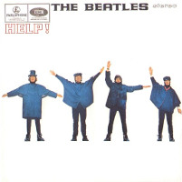
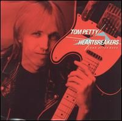

= Радио Аэростат
:toc: left

> link:aerostat.html[<Home>]
> link:toc.html[<Contents>]
> link:lyrics.html[<Lyrics>]

++++

++++

                                                                          
== 40.

=== То да Сё – Исцеление, 20 октября 2024
<https://aerostatbg.ru/release/1011>

.Beatles – Another Girl

.Jethro Tull – Skating Away (On The Thin Ice Of The New Day)
image:JETHRO TULL/2007 - The Best Of Acoustic Jethro Tull/cover.jpg[The Best Of Acoustic Jethro Tull,200,200,role="thumb left"]

.Procol Harum - link:PROCOL%20HARUM/1973%20-%20Grand%20Hotel/lyrics/grand.html#_for_liquorice_john[For Liquorice John]
image:PROCOL HARUM/1973 - Grand Hotel/images.jpg[Grand Hotel,200,200,role="thumb left"]

.George Harrison – Someplace Else
image:GEORGE HARRISON/George Harrison - Cloud Nine/cover.jpg[Cloud Nine,200,200,role="thumb left"]

++++
 
++++

[%hardbreaks]
T-Rex – Demon Queen
Smile – Instant Psalm
Pink Floyd – Burning Bridges
Kris Kristofferson – Loving Her Was Easier (Than Anything I'll Ever Do Again)
Sérgio Mendes – Mas Que Nada
Phoebe Bridgers – Funeral

++++
 
++++

=== История Цивилизаций, 13 октября 2024
<https://aerostatbg.ru/release/1010>

.Cat Stevens – O' Caritas
image:CAT STEVENS/Catch Bull At Four/front.jpg[Catch Bull At Four,200,200,role="thumb left"]

.Paul Simon - link:PAUL%20SIMON/Paul%20Simon%20-%20Songwriter/lyrics/songwriter.html#_ren%C3%A9_and_georgette_magritte_with_their_dog_after_the_war[René And Georgette Magritte With Their Dog After The War]
image:PAUL SIMON/Paul Simon - Songwriter/cover.jpg[Songwriter,200,200,role="thumb left"]

.Led Zeppelin – No Quarter
image:LED ZEPPELIN/Led Zeppelin - House Of The Holy/House Of The Holy.jpg[House Of The Holy,200,200,role="thumb left"]

[%hardbreaks]
Who – Heinz Baked Beans
Brian Finnegan – Ton bale ar pont
Jimmy Page & Robert Plant – The Truth Explodes
Дживан Гаспарян – Mair Araks
Alap Desai – Paṅkhīḍā nē ā pīn̄jaruṁ
Lei Qiang – Picking Flowers
Codex Faenza – J'ay grant désespoir de ma vie
Paul McCartney & Wings – Country Dreamer

++++
 
++++

=== Октябрь, 6 октября 2024
<https://aerostatbg.ru/release/1009>

[%hardbreaks]
Fanfare Orchestra Of The Castle Guard – Sonata No. 5
Cure – Alone
U2 – Country Mile
The The – Cognitive Dissident
Brian Finnegan – Dobbin's Flowery Vale
Bryan Ferry – Star
Serj Tankian – Life's Revengeful Son
Phoebe Bridgers – Nothing Else Matters
Van Morrison – Avalon Of The Heart

++++
 
++++

=== То да Сё №38, 29 сентября 2024
<https://aerostatbg.ru/release/1008>

.Damien Rice – Delicate

.New Vaudeville Band – Peek-A-Boo

.Tom Petty & The Heartbreakers – You Got Lucky

.Villagers – Nothing Arrived

++++
 
++++

.Whistlebinkies – My Bonny Moor Hen

.Beatles – Rain
image:THE BEATLES/1988 - Past Masters/cover.jpg[Past Masters,200,200,role="thumb left"]

[%hardbreaks]
John Mayall & The Bluesbreakers – All Your Love
Cream – Wrapping Paper
Who – Whiskey Man
Bing Crosby & Victor Young – I Apologize
Country Joe & The Fish – Sad And Lonely Times

++++
 
++++

=== Новые Имена, 22 сентября 2024
<https://aerostatbg.ru/release/1007>

.David Carroll – Gentlemen Of High Renown

[%hardbreaks]
Sizzla – Political Lies
Wolfgang Press – Going South
Mahlathini & The Mahotella Queens – Lilizela Mlilizeli
Pill – Bale Of Hay
Dorothy Carter – The Morning Star
Jimmy Reed – Baby What You Want Me To Do
Count Basie & Jimmy Rushing – Goin' To Chicago Blues
Eiko Ishibashi – Evil Does Not Exist
Edmofo & Camélia Jordana – Doudou

++++
 
++++

=== Квадратный Корень из Солнца, 15 сентября 2024
<https://aerostatbg.ru/release/1006>

.БГ+ – Ангел

[%hardbreaks]
Franz Joseph Haydn – Trumpet Concerto in E-flat major: II. Andante
БГ+ – Плохая Песня
БГ+ – Бог зимогоров
БГ+ – У Нимфодоры
БГ+ – Феникс
БГ+ – 5 утра
Johann Sebastian Bach – Orchestral Suite No. 3 in D major: II. Air

++++
 
++++

=== Новые Песни Сентября, 8 сентября 2024
<https://aerostatbg.ru/release/1005>

.Brian Eno – We Let It In
image:BRIAN ENO/2022 - ForeverAndEverNoMore/FOREVERANDEVERNOMORE.jpg[ForeverAndEverNoMore,200,200,role="thumb left"]

.Tom Waits – Get Behind The Mule
image:TOM WAITS/1999 - Mule Variations/cover.jpg[Mule Variations,200,200,role="thumb left"]

.Max Richter – The Poetry Of Earth (Geophony)

[%hardbreaks]
Nada Surf – Losing
Stick In The Wheel – A Thousand Pokes
Manu Chao – São Paulo Motoboy
Glass Animals – Wonderful Nothing
Smile – Zero Sum
Red Clay Strays – Wanna Be Loved
Stevie Wonder – Can We Fix Our Nation's Broken Heart

++++
 
++++

=== Ответы на Вопросы, 1 сентября 2024
<https://aerostatbg.ru/release/1004>

.REM. – Every Day Is Yours To Win

.Bob Dylan – Shooting Star

.Donovan - link:DONOVAN/Donovan%20-%20HMS%20Donovan/lyrics/hms.html#_wynken_blynken_and_nod[Wynken, Blynken, And Nod]
image:DONOVAN/Donovan - HMS Donovan/cover.jpg[HMS Donovan,200,200,role="thumb left"]

.Donovan – Ferris Wheel

++++
 
++++

.Scaffold – Jelly Covered Cloud

++++
 
++++

[%hardbreaks]
Ralph McTell – Last Train And Ride
Robin Laing – Burke And Hare
Ringo Starr – Love Is Many Splendored Thing
БГ+ – Charam Charam
Аквариум – Иерофант
Pete Coe – Light From The Lighthouse

++++
 
++++

=== Мантры и Слова, 25 августа 2024
<https://aerostatbg.ru/release/1003>

.Krishna Das – Hara Hara Mahadev
image:KRISHNA DAS/1998 - Pilgrim Heart/cover.jpg[Pilgrim Heart,200,200,role="thumb left"]

.David Sylvian – Orpheus

.Robert Fripp – Music For Quiet Moments 30 – Strong Quiet I
image:KING CRIMSON/Robert Fripp - Music For Quiet Moments Vol. 1-52/cover.jpg[Music For Quiet Moments Vol. 1-52,200,200,role="thumb left"]

[%hardbreaks]
Fratellis – Alive
David Bowie – Station To Station
Johann Sebastian Bach – Concerto for two harpsichords in C minor: II. Adagio
    
++++
 
++++

=== Новые Песни Августа, 18 августа 2024
<https://aerostatbg.ru/release/1002>

.Jónsi – Cherry Blossom

[%hardbreaks]
Pom Poko – Champion
Wett Brain, Kabaka Pyramid & tbriz – Too Irie
Laurie Anderson feat. Anohni – India And On Down To Australia
Eminem – Houdini
Oso Oso – The Country Club
Chrystabell & David Lynch – She Knew
Archie Fisher – Men O' Worth
Alan Sparhawk – Can U Hear
Courteneers – Solitude Of The Night Bus
Bryan Ferry – She Belongs To Me

++++
 
++++

=== 1001 Аэростат, 11 августа 2024
<https://aerostatbg.ru/release/1001>

.Cotton Mather - link:COTTON%20MATHER/Cotton%20Mather%20-%20Kon%20Tiki/lyrics/kontiki.html#_vegetable_row[Vegetable Row]
image:COTTON MATHER/Cotton Mather - Kon Tiki/Folder.jpg[Kon Tiki,200,200,role="thumb left"]

.Band – Ophelia
image:The Band/2013 - Opus Collection/cover.jpg[Opus Collection,200,200,role="thumb left"]

[%hardbreaks]
Cocteau Twins & Harold Budd – Sea, Swallow Me
John McCusker feat. Battlefield Band – The Shepherd Lad
Barbara Keith – The Road I Took To You
Aквариум – Дуй
Cormac Breatnach – Mujeres
Cornelius – Sleep Warm
Roger McGuinn – May The Road Rise To Meet You

++++
 
++++

=== Творчество, 4 августа 2024
<https://aerostatbg.ru/release/1001>

.Bob Dylan - link:BOB%20DYLAN/Bob%20Dylan%201966%20-%20Blonde%20On%20Blonde/lyrics/blonde.html#_i_want_you[I Want You]

.T-Rex – Lofty Skies
image:T-REX/T-Rex - A Beard Of Stars/cover.jpg[Rex - A Beard Of Stars,200,200,role="thumb left"]

.Archie Fisher – Upstairs And Downstairs
image:ARCHIE FISHER/1976 - The Man with a Rhyme/cover.jpg[The Man with a Rhyme,200,200,role="thumb left"]

.Beatles - link:THE%20BEATLES/1966%20-%20Revolver/lyrics/revolver.html#_and_your_bird_can_sing[And Your Bird Can Sing]
image:THE BEATLES/1966 - Revolver/cover.jpg[Revolver,200,200,role="thumb left"]

++++
 
++++

.Beatles - link:THE%20BEATLES/1967b%20-%20Magical%20Mystery%20Tour/lyrics/tour.html#_strawberry_fields_forever[Strawberry Fields Forever]
image:THE BEATLES/1967b - Magical Mystery Tour/cover.jpg[Magical Mystery Tour,200,200,role="thumb left"]

.Lovin’ Spoonful – Butchie’s Tune
image:Lovin Spoonful - Daydream/cover.jpg[Daydream,200,200,role="thumb left"]

.Simon & Garfunkel - link:SIMON%20&%20GARFUNKEL/Simon%20&%20Garfunkel%20-%20Parsley,%20Sage,%20Rosemary%20and%20Thyme/lyrics/parsley.html[Flowers Never Bend With the Rainfall]
image:SIMON & GARFUNKEL/Simon & Garfunkel - Parsley, Sage, Rosemary and Thyme/cover.jpg[Parsley  Sage  Rosemary and Thyme,200,200,role="thumb left"]

[%hardbreaks]
Eric Burdon & The Animals – Orange And Red Beams
Byrds – Wild Mountain Thyme
King Crimson – Book of Saturdays
Rolling Stones – Ruby Tuesday
Family – My Friend The Sun

++++
 
++++

=== Лунасса, 28 июля 2024
<https://aerostatbg.ru/release/999>

.Archie Fisher – The Cruel Brother
image:ARCHIE FISHER/1976 - The Man with a Rhyme/cover.jpg[The Man with a Rhyme,200,200,role="thumb left"]

.Van Morrison & The Chieftains – Tá Mo Chleamhnas Déanta
image:VAN MORRISON/Van Morrison - Irish Heartbeat/cover.jpg[Irish Heartbeat,200,200,role="thumb left"]

[%hardbreaks]
Lumiere – Fair And Tender Ladies
Lúnasa – The Wounded Hussar
Dick Gaughan – The Snow They Melt The Soonest
Bothy Band – The Butterfly
Lumiere – The Streets Of Derry
Ruth Notman – The Bonny Boy
Robin Williamson – I'll Mak' Ye Fain to Follow Me

++++
 
++++

=== Новые Имена, 21 июля 2024
<https://aerostatbg.ru/release/998>

.Tony Rice – Last Thing On My Mind

[%hardbreaks]
Units – High Pressure Days
VOCES8 – Pyramid Song
Peter Murphy – Cuts You Up
Anna Bon – Piano Sonata Op.2 No.2 Andante (Ivana Francisci)
Paul Clayton – Who’s Gonna Buy You Ribbons (When I’m Gone)
Ani DiFranco – Virus
Cal Tjader – Soul Bird (Tin Tin Deo)
Bizhiki – Gigawaabamin (Come Through)
Jan Pieterszoon Sweelinck – Pavana Lachrimae (Christopher Herrick)
Kedar Pandit & Sanjeev Abhyankar – Gayatri Invocation... Vakratunda Mahakaya

++++
 
++++

> link:aerostat.html[<Home>]
> link:toc.html[<Contents>]
> link:lyrics.html[<Lyrics>]