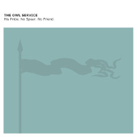
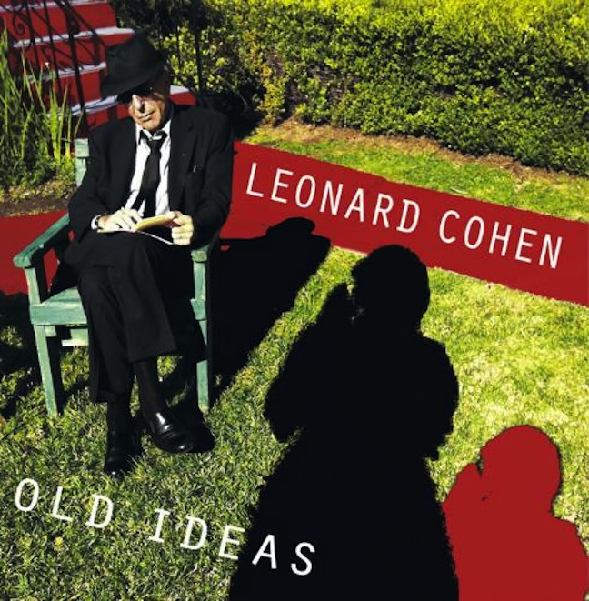

= Радио Аэростат
:toc: left

> link:lyrics.html[Lyrics]

- link:aerostat33.html[`Глава XXXIII.  8.11.2020 - 16.05.2021`]
- link:aerostat32.html[`Глава XXXII.   3.05.2020 -  1.11.2020`]
- link:aerostat31.html[`Глава XXXI.   27.10.2019 - 26.04.2020`]
- link:aerostat30.html[`Глава XXX.    28.04.2019 - 20.10.2019`]
- link:aerostat29.html[`Глава XXIX.   14.10.2018 - 21.04.2019`]
- link:aerostat28.html[`Глава XXVIII.  8.04.2018 -  7.10.2018`]
- link:aerostat27.html[`Глава XXVII.  10.09.2017 -  1.04.2018`]
- link:aerostat26.html[`Глава XXVI.    5.03.2017 -  3.09.2017`]
- link:aerostat25.html[`Глава XXV.    28.08.2016 - 26.02.2017`]
- link:aerostat24.html[`Глава XXIV.   16.02.2016 - 21.08.2016`]
- link:aerostat23.html[`Глава XXIII.  30.08.2015 - 21.02.2016`]
- link:aerostat22.html[`Глава XXII.    1.03.2015 - 23.08.2015`]
- link:aerostat21.html[`Глава XXI.    31.08.2014 - 22.02.2015`]
- link:aerostat20.html[`Глава XX.      2.03.2014 - 24.08.2014`]
- link:aerostat19.html[`Глава XIX.    15.09.2013 - 23.02.2014`]
- link:aerostat18.html[`Глава XVIII.  31.03.2013 -  8.09.2013`]
- link:aerostat17.html[`Глава XVII.   14.10.2012 - 24.03.2013`]
- link:aerostat16.html[`Глава XVI.    29.04.2012 -  7.10.2012`]

...

- link:aerostat05.html[`Глава V.      25.03.2006 -  9.09.2007`]
- link:aerostat04.html[`Глава IV.      8.10.2006 - 18.03.2007`]
- link:aerostat03.html[`Глава III.    23.04.2006 -  1.10.2006`]
- link:aerostat02.html[`Глава II.      6.11.2005 - 16.04.2006`]
- link:aerostat01.html[`Глава I.      22.05.2005 - 30.10.2005`]

++++
 
++++

++++

++++

== 34.

=== Философы, 29 августа 2021

<https://aerostatbg.ru/release/850>

.King Creosote & Michael Johnston – Will You Wait For Me?
image:King Creosote/2016 - with Michael Johnston - The Bound Of The Red Deer/folder.jpg[with Michael Johnston - The Bound Of The Red Deer,200,200,role="thumb left"]

.Paul McCartney – Rainclouds
image:PAUL MCCARTNEY/Tug of War 24bit Deluxe Edition/cover.jpg[Tug of War 24bit Deluxe Edition,200,200,role="thumb left"]

.Robert Plant – Rainbow

.Bob Dylan – Every Grain Of Sand
image:BOB DYLAN/Bob Dylan 1981 - Shot Of Love/cover.jpg[Shot Of Love,200,200,role="thumb left"]

++++
 
++++

[%hardbreaks]
Baltimore Consort – Nuttmigs And Ginger
Sri Chinmoy – Jedike Phirai
Hollies – King Midas In Reverse
Mills Brothers – Ain't Misbehavin'
Midlake – We Gathered In Spring
Pomerium – Timor et tremor

++++
 
++++

=== Дети, 22 августа 2021

<https://aerostatbg.ru/release/849>

[%hardbreaks]
Inhaler – It Won't Always Be Like This
Harper Simon – Berkeley Girl
Damian Marley – R.O.A.R.
Claypool Lennon Delirium – Blood And Rockets
James McCartney – Butterfly
Adam Cohen – We Go Home
Norah Jones – A Song With No Name
Jakob Dylan – Something Good This Way Comes
Ky-Mani Marley – All The Way
        
++++
 
++++

=== Flyte, 15 августа 2021

<https://aerostatbg.ru/release/848>

.Flyte – Losing You
image:Flyte/2021 - This Is Really Going To Hurt/cover.jpg[This Is Really Going To Hurt,200,200,role="thumb left"]

[%hardbreaks]
Flyte – Easy Tiger
Flyte – Never Get To Heaven
Flyte – Mistress America
Flyte – Love Is An Accident
Flyte – Spiral
Flyte – Trying To Break Your Heart
Flyte – I've Got A Girl
Flyte – Everyone's A Winner
Flyte – Under The Skin
Flyte – Little White Lies
    
++++
 
++++

=== Новые песни августа, 8 августа 2021

<https://aerostatbg.ru/release/847>

.Black Keys – Louise

[%hardbreaks]
Sufjan Stevens & Angelo De Augustine – Reach Out
Weezer – All My Favourite Songs
Villagers – So Simpatico
Ed Sheeran – Bad Habits
Kings Of Convenience – Comb My Hair
Los Lobos – Love Special Delivery
Robert Harrison – Stella Not Too Late
Brian Setzer – Checkered Flag
Rodrigo Amarante – I Can't Wait
    
++++
 
++++

=== Lugh’s Day 2021, 1 августа 2021

<https://aerostatbg.ru/release/846>

.Owl Service – Geordie

[%hardbreaks]
John Spillane – We Come In The Wind
John Francis Flynn – My Son Tim
Findlay Napier & Gillian Frame feat. Mike Vass – Bonnie George Campbell
Shirley Collins – My Sailor Boy
Peat & Diesel – Brandy In The Airidh
Calum Martin – Raised
Whileaways – Julia
Tim Edey – Rare Old Mountain Set
Ringlefinch – The Prince Of Poyais
Iain Maciver – Portnaguran By The Sea

++++
 
++++

=== Событие Чёрный Лебедь, 25 июля 2021

<https://aerostatbg.ru/release/845>

.Pugwash – Anyone Who Asks
image:PUGWASH/2014 - A Rose in a Garden of Weeds/cover.jpg[A Rose in a Garden of Weeds,200,200,role="thumb left"]

.Bob Dylan - link:BOB%20DYLAN/Bob%20Dylan%201963%20-%20Blowing%20In%20The%20Wind/lyrics/blowing.html#_blowin_in_the_wind[Blowing In The Wind]
image:BOB DYLAN/Bob Dylan 1963 - Blowing In The Wind/cover.jpg[Blowing In The Wind,200,200,role="thumb left"]

.Beatles - link:THE%20BEATLES/1966%20-%20Revolver/lyrics/revolver.html#_she_said_she_said[She Said, She Said]
image:THE BEATLES/1966 - Revolver/cover.jpg[Revolver,200,200,role="thumb left"]

[%hardbreaks]
Tally Hall – Hidden In The Sand
Dobet Gnahoré – Telo de
Tally Hall – Ruler Of Everything
Kraftwerk – It's More Fun To Compute
Rolling Stones – Ride On Baby
Irish Rovers – No Nay Never
Ustad Nishat Khan & Ensemble Gilles Binchois – Introit - Statuit ei Dominus
Byrds – My Back Pages
    
++++
 
++++

=== Дживан Гаспарян, 18 июля 2021

<https://aerostatbg.ru/release/844>

.Дживан Гаспарян – Menag Jamport Em

[%hardbreaks]
Дживан Гаспарян – Lovely Spring
Дживан Гаспарян – Pepo’s Song
Дживан Гаспарян – Fallen Star
Дживан Гаспарян – Your Strong Mind
Дживан Гаспарян – Mair Araks
Аквариум – Северный Цвет
Дживан Гаспарян – Eshkhemed

++++
 
++++

=== New July songs, 11 июля 2021

<https://aerostatbg.ru/release/843>

.Crowded House – Goodnight Everyone

.King Gizzard & The Lizard Wizard – Shanghai
image:KING GIZZARD & THE LIZARD WIZARD/2021 - Butterfly 3000/cover.jpg[Butterfly 3000,200,200,role="thumb left"]

.Easy Life – Ocean View
image:Easy Life - Lifes A Beach/cover.jpg[Lifes A Beach,200,200,role="thumb left"]

[%hardbreaks]
UB40 feat. Inner Circle – Rebel Love
Duran Duran – Invisible
Arooj Aftab – Inayaat
Roger Chapman – Dark Side Of The Stairs
John Grant – Billy
Tom Petty & The Heartbreakers – One Of Life's Little Mysteries

++++
 
++++

=== Ed Sheeran, 4 июля 2021

<https://aerostatbg.ru/release/842>

[%hardbreaks]
Ed Sheeran – Nancy Mulligan
Ed Sheeran – Shape Of You
Ed Sheeran – The A Team
Ed Sheeran – I See Fire
Ed Sheeran – Sing
Ed Sheeran feat. Stormzy – Take Me Back To London
Ed Sheeran – Galway Girl
Ed Sheeran – I Don't Care
Ed Sheeran feat. Paulo Londra & Dave – Nothing On You
Ed Sheeran – Perfect

++++
 
++++

=== Имена, 27 июня 2021

<https://aerostatbg.ru/release/841>

[%hardbreaks]
Eric Hutchinson – Talk Is Cheap
Blue Oyster Cult – (Don't Fear) The Reaper
Maberrant – Zamaas Hold
Char Chris & Penelope Scott – Brittle, Baby!
Redskins – Hold On
Foy Vance – Time Stand Still
His Name Is Alive – Lord, Make Me A Channel Of Your Peace
Robbie Basho – The Hajj (instrumental)
Witch Camp (Ghana) – Love
The Edgar Broughton Band – Granma
Eric Hutchinson – Best Days

++++
 
++++

=== Суфи 2 Суфи, 20 июня 2021

<https://aerostatbg.ru/release/840>

[%hardbreaks]
Sufi Music Ensemble – Fly Away
Sufi – Uyan
Nobukazu Takemura – Tiddler
John French, Fred Frith, Henry Kaiser, Richard Thompson – Bird In God's Garden / Lost And Found
Sufi Music Ensemble – Santoor Taksim
Serkan Mesut Halili – Çeng-i Harbi
Bon Iver – Salem
Norayr Kartashyan – Goghtan
Yusuf Islam – Heaven / Where True Love Goes
Nusrat Fateh Ali Khan – Nothing Without You
    
++++
 
++++

=== С Легким Сердцем (То Да Сё №16), 13 июня 2021

<https://aerostatbg.ru/release/839>

.Del Amitri – All Hail Blind Love
image:Del Amitri/2021 - Fatal Mistakes/Front.jpg[Fatal Mistakes,200,200,role="thumb left"]

.Tom Waits – Ruby's Arms
image:TOM WAITS/Tom Waits 1980 - Heartattack And Vine/cover.jpg[Heartattack And Vine,200,200,role="thumb left"]

[%hardbreaks]
Chas & Dave – The Sideboard Song
Ashley Hutchings – Cotswold Tune
Krishna Das – Sri Bajrang Baan
Roger Eno – Riddle
Frank Ifield – She Taught Me How To Yodel
Liz Phair – Spanish Doors
Beach Boys – Big Sur
Eden Kane – We Could Have Had It All

    
++++
 
++++

=== Новые Песни Июня, 6 июня 2021

<https://aerostatbg.ru/release/838>

[%hardbreaks]
Lucy Dacus – Hot And Heavy
Billy F. Gibbons – My Lucky Card
Micky Dolenz – Carlisle Wheeling
Comorian – The Devil Doesn't Eat Papaya, He Eats Fire
Garbage – No Gods No Masters
Francis Lung – Lonesome No More
Tequilajazzz – Никого не останется
Pet Shop Boys – Cricket Wife
James – Beautiful Beaches
    
++++
 
++++

=== Дуэндэ. Чёрные Ноты, 30 мая 2021

<https://aerostatbg.ru/release/837>

.Leonard Cohen – Darkness

.Richard Thompson – Walking On A Wire
image:RICHARD THOMPSON/1968_2009 - Walking on a Wire/cover.png[Walking on a Wire,200,200,role="thumb left"]

.Jethro Tull – Silver River Turning
image:JETHRO TULL/1993  Nightcap (Your Round) - Unrele/cover.jpg[Unrele,200,200,role="thumb left"]

[%hardbreaks]
Olivier Messiaen – Les Corps Glorieux: 6. Joie et clarté des Corps Glorieux
El Lebrijano – Que Hermoso Pelo Tiene
Rié Yanagisawa & Clive Bell – Esashi Oiwake
Free – Rain (Alternative Version)
Johnny Cash – I'm Free From The Chain Gang Now
    
++++
 
++++

=== Воспоминания, 23 мая 2021

<https://aerostatbg.ru/release/836>

.Fairport Convention – Percy's Song
image:FAIRPORT CONVENTION/Fairport Convention-Unhalfbricking-1969/folder.jpg[Unhalfbricking-1969,200,200,role="thumb left"]

.Richard Thompson – When The Spell Is Broken
image:RICHARD THOMPSON/Across a Crowded Room/cover.jpg[Across a Crowded Room,200,200,role="thumb left"]

.Roger Eno – The Last Days Of May
image:ROGER ENO/2017 - This Floating World/cover.jpg[This Floating World,200,200,role="thumb left"]

[%hardbreaks]
Cyril Tawney – Chase The Buffalo
Archangelo Corelli – Concerto Grosso in F major, Op. 6 No. 12: I. Preludio: Adagio
Who – Cobwebs & Strange
Mdou Moctar – Tarhatazed
Al Stewart – Lover Man
Joe Brown – I Like Bananas

