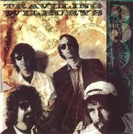

= Радио Аэростат
:toc: left

> link:lyrics.html[Lyrics]

- link:aerostat31.html[`Глава XXXI.   27.10.2019 - 26.04.2020`]
- link:aerostat30.html[`Глава XXX.    28.04.2019 - 20.10.2019`]
- link:aerostat29.html[`Глава XXIX.   14.10.2018 - 21.04.2019`]
- link:aerostat28.html[`Глава XXVIII.  8.04.2018 -  7.10.2018`]
- link:aerostat27.html[`Глава XXVII.  10.09.2017 -  1.04.2018`]
- link:aerostat26.html[`Глава XXVI.    5.03.2017 -  3.09.2017`]
- link:aerostat25.html[`Глава XXV.    28.08.2016 - 26.02.2017`]
- link:aerostat24.html[`Глава XXIV.   16.02.2016 - 21.08.2016`]
- link:aerostat23.html[`Глава XXIII.  30.08.2015 - 21.02.2016`]
- link:aerostat22.html[`Глава XXII.    1.03.2015 - 23.08.2015`]
- link:aerostat21.html[`Глава XXI.    31.08.2014 - 22.02.2015`]
- link:aerostat20.html[`Глава XX.      2.03.2014 - 24.08.2014`]
- link:aerostat19.html[`Глава XIX.    15.09.2013 - 23.02.2014`]
- link:aerostat18.html[`Глава XIIIV.  31.03.2013 -  8.09.2013`]

...

- link:aerostat05.html[`Глава V.      25.03.2006 -  9.09.2007`]
- link:aerostat04.html[`Глава IV.      8.10.2006 - 18.03.2007`]
- link:aerostat03.html[`Глава III.    23.04.2006 -  1.10.2006`]
- link:aerostat02.html[`Глава II.      6.11.2005 - 16.04.2006`]
- link:aerostat01.html[`Глава I.      22.05.2005 - 30.10.2005`]

++++
 
++++

++++

++++

<<<

== 32.

=== British Blues, 18 октября 2020

.Jethro Tull – Some Day The Sun Won't Shine For You
image:JETHRO TULL/Jethro Tull - 2002  Living With The Past/cover.jpg[2002  Living With The Past,200,200,role="thumb left"]

.Eric Clapton & John Mayall – Lonely Years

.Yardbirds – I'm A Man

[%hardbreaks]
John Mayall & The Bluesbreakers & Eric Clapton – Steppin' Out
Alexis Korner's Blues Incorporated – Gotta Move
Animals – Boom Boom
Donovan – Bert's Blues
Rolling Stones – Little Red Rooster
Jimi Hendrix – Red House
Free – Walk In My Shadow
Fleetwood Mac – My Baby's Good To Me
Cream – Four Until Late

++++
 
++++

=== Новые Кленовые Имена, 11 октября 2020

.Roy Ayers – Ayerloom

.Necks – The Boys II

[%hardbreaks]
Everlast – Black Jesus
A Certain Ratio – Berlin
Diana Jones – I Will And I Do
War – Low Rider
Skindred – Pressure
Susanna – Burial
Savoy Brown – Tell Mama
Crickets – Don't Ever Change

++++
 
++++

=== Новые Песни Октября, 4 октября 2020

.Kate Rusby – Everglow

[%hardbreaks]
Tom Petty – Confusion Wheel
Tom Petty – There Goes Angela (Dream Away)
Songhoy Blues – Barre
Lucrecia Dalt – Disuelta
Marilyn Manson – Don't Chase The Dead
Kelsea Ballerini – Club
Idles – Ne Touche Pas Moi
Brian Eno – Ship In A Bottle
Robert Plant feat. Patty Griffin – Too Much Alike
Oneohtrix Point Never – Auto & Allo

++++
 
++++

=== То да Сё №10, 27 сентября 2020

.Charlie Watts & The Danish Radio Big Band – (Satis) Faction

[%hardbreaks]
Tomaso Albinoni – Concerto in D major for Trumpet, Op. 7, No. 6: I. Allegro
Rolling Stones – Jigsaw Puzzle
Little Richard – Tutti Frutti
Bob Marley – Punky Reggae Party
Максим Леонидов – Когда я сухой
Jessie & The Leonards feat. Hannah Grace Deller – Working On The Frontline

++++
 
++++

=== Магия камней, 20 сентября 2020

.Donovan - link:DONOVAN/Donovan%20-%20HMS%20Donovan/lyrics/hms.html#_fishes_in_love[Fishes In Love]
image:DONOVAN/Donovan - HMS Donovan/cover.jpg[HMS Donovan,200,200,role="thumb left"]

.Planxty – Planxty Irwin

.Grateful Dead – Sage & Spirit
image:GRATEFUL DEAD/Grateful Dead - Blues For Allah/cover.jpg[Blues For Allah,200,200,role="thumb left"]

.Jethro Tull – Living In These Hard Times
image:JETHRO TULL/1982  Broadsword & The Beast/cover.jpg[1982  Broadsword & The Beast,200,200,role="thumb left"]

++++
 
++++

.New Vaudeville Band – Sadie Moonshine

[%hardbreaks]
Jan Garbarek – De Spineto Nata Rosa
Mahavishnu Orchestra – A Lotus On Irish Streams
Donovan - link:DONOVAN/Donovan%20-%20HMS%20Donovan/lyrics/hms.html#_coulter_s_candy[Coulter's Candy]
Hong Ting – Ah-Do-Qing-Ah-Si-Er
Derek Bell – Mrs. Poer Or Carolan's Concerto
Simon & Garfunkel – Why Don't You Write Me
Arbeau – La Traditore My Fa Morire
Magnetic Fields – I Don't Want To Get Over You

++++
 
++++

=== Новые Песни Сентября, 13 сентября 2020

.Sufjan Stevens –  Video Game

[%hardbreaks]
Biffy Clyro – Tiny Indoor Fireworks
Taylor Swift – Cardigan
Max Richter – All Human Beings, Pt. 3
Jónsi – Swill
Eels – Baby Let's Make It Real
Yusuf – On The Road To Find Out
Jon Anderson – Makes Me Happy
Bright Eyes – Pan And Broom
Darius Rucker – Beers And Sunshine

++++
 
++++

=== Части Света 2020, 6 сентября 2020

[%hardbreaks]
Namgar – Medley-Two Yokhors
Markscheider Kunst – Метание Копьем
Markscheider Kunst – Бабушка
Цвет Граната – Кочари
Oyme – Adai-Adai
Ольга Глазова – Tales of Light, Told in the Dark
Ольга Глазова – Облачко
Juna – Yashel Kuzle
Аквариум – Учение Свет А Неученье Тьма

++++
 
++++

=== Thick As A Brick, 30 августа 2020

.Jethro Tull - link:JETHRO%20TULL/1972%20%20Thick%20As%20A%20Brick/lyrics/brick.html[Thick As A Brick, Part I] 
image:JETHRO TULL/1972  Thick As A Brick/cover.jpg[1972  Thick As A Brick,200,200,role="thumb left"]

[%hardbreaks]
Jethro Tull – Thick As A Brick, Part I
Jethro Tull – Thick As A Brick, Part II
Jethro Tull – Thick As A Brick, Part II

++++
 
++++

=== О Картине Мира, 23 августа 2020

[%hardbreaks]
Sigur Rós – Rembihnútur
Sergey Karamyshev – Menuett
R.E.M. – Diminished / I'm Not Over You (Medley)
Paul McCartney – Beautiful Night
Rolling Stones – Jig-Saw Puzzle
Roger Eno – A-Typical Waltz
Robin Williamson – By Weary Well
Paul Simon – Night Game

++++
 
++++

=== О Том да Сем, 16 августа 2020

.Fleetwood mac – Albatross

[%hardbreaks]
Santana feat. Rob Thomas – Smooth
T. Rex – Woodland Rock (B Side)
David Bowie – London Bye Ta-Ta
Orlande de Lassus – Ave Verum Corpus
UB40 – Red Red Wine
Peter Gabriel – This Is The Picture (Excellent Birds)
Beatles – For You Blue
Pied Pipers – Lily Belle
Bhajan Singers – Ganesh

++++
 
++++

=== Новые песни августа, 9 августа 2020

.Christine Ott – Todeslied
image:Christine Ott - Chimères/cover.jpg[Chimères,200,200,role="thumb left"]

[%hardbreaks]
David Gilmour – Yes, I Have Ghosts
Shirley Collins – Wondrous Love
Pinch feat. Killa P – Party
Lianne La Havas – Can't Fight
Rolling Stones – Criss Cross
Peter Gabriel feat. Paddy Maloney & The Black Dyke Mills Band – That'll Do
Jarv Is... – Am I Missing Something?

++++
 
++++

=== Лунассад, 2 августа 2020

.Silly Wizard – The Highland Clearances
image:SILLY WIZARD/Silly Wizard - So Many Partings/cover.jpg[So Many Partings,200,200,role="thumb left"]

.Emerson, Lake & Palmer – Jerusalem

.Sinéad O'Connor – Lord Franklin

[%hardbreaks]
Brian Finnegan – Flow, In The Year Of Wu Wei
Whistlebinkies – Waukin' O' The Fauld
Peatbog Faeries – Abhainn a'Nathair
Five Hand Reel – Death Of Argyll
Boys Of The Lough – Beauty Deas An Oileain
Ossian – 'S Gann Gann Dirich Mi Chaoidh

++++
 
++++

=== Демон Мечты, 26 июля 2020

.Iggy Pop – Cry For Love

[%hardbreaks]
Cambini – Quintet No.1 in B Flat Major - Rondo. Allegretto grazioso 
Books – None But Shining Hours
Iron Butterfly – My Mirage
Doors – Orange County Suite
Roy Orbison – Careless Heart
Paul Simon – My Little Town
The Whistlebinkies – Great Is The Cause Of My Sorrow
Rolling Stones –  Who's Been Sleeping Here

++++
 
++++

=== Новые Имена #29, 19 июля 2020

.Bill Withers – Use Me

[%hardbreaks]
Osborne Brothers – Some Old Day
Mortimer – Careful
Steve Howe – Surface Tension
Rat Cage – A Country For Idiots
Camila Cabello – Havana
Debashish Bhattacharya – Maa
Snowgoose – The Making Of You
Yusef Lateef –  Juba Juba
Green-House – Peperomia Seedling

++++
 
++++

=== Вслух о Музыке, 12 июля 2020

.Bob Dylan - link:BOB%20DYLAN/Bob%20Dylan%201963%20-%20Blowing%20In%20The%20Wind/lyrics/blowing.html#_when_the_ship_comes_in[When The Ship Comes In]
image:BOB DYLAN/Bob Dylan 1963 - Blowing In The Wind/cover.jpg[Blowing In The Wind,200,200,role="thumb left"]

.Le Mystère Des Voix Bulgares – Tche Da Ti Kupim Bela Seitsa
image:The Mystery of the Bulgarian Voices/0801 - Volume 2/cover.jpg[Volume 2,200,200,role="thumb left"]

.Cocteau Twins – Rilkean Heart

[%hardbreaks]
King Crimson – Red
King Crimson – Lady Of The Dancing Water
Dietrich Buxtehude – Ein Feste Burg Ist Unser Gott 
Animal Collective – Hounds Of Bairro
Rakesh Chaurasia – Bada Natkhat Hai  
Beatles – You Like Me Too Much

++++
 
++++

=== Новые Песни Июля, 5 июля 2020

.Bob Dylan – My Own Version Of You
image:BOB DYLAN/2020 - Rough And Rowdy Days/cover.jpg[Rough And Rowdy Days,200,200,role="thumb left"]

.Dalai Lama – Compassion
image:Dalai Lama - Inner World/cover.png[Inner World,200,200,role="thumb left"]

.Bananagun – Perfect Stranger

[%hardbreaks]
Michael Stipe & Big Red Machine – No Time For Love Like Now
Neil Young – Vacancy
Julianna Barwick feat. Jónsi – In Light
Shaggy feat. Sting – Angel

++++
 
++++

=== Музыка Ревущих 20-х, 28 июня 2020

[%hardbreaks]
Fred Rich & His Orchestra – Singing In The Rain
Nick Lucas – Tip-Toe Thru' The Tulips With Me
Johnny Marvin & Leonard Joy Orchestra – Happy Days Are Here Again
Fats Waller – Ain't Misbehavin'
Cab Calloway – Minnie The Moocher
Fred Astaire – Puttin' On The Ritz
Cliff «Ukulele Ike» Edwards – That's My Weakness Now 
Louis Armstrong – It Don't Mean A Thing (If It Ain't Got That Swing)
Blind Lemon Jefferson – Hangman's Blues
Al Jolson – Pasadena
Paul Hindemith – Hindemith: Concerto for Orchestra, Op. 38 - 1. Mit Kraft, mäßig schnelle Viertel 
Cliff «Ukulele Ike» Edwards –  Orange Blossom Time

++++
 
++++

=== Новый Альбом А, 21 июня 2020

.БГ – Альфа

[%hardbreaks]
БГ – Вон Вавилон
БГ – Мое Имя Пыль
БГ – Не Судьба
БГ – Вечное Возвращение
БГ – Знак
БГ – Масала Доса
БГ – Хиханьки Да Хаханьки
БГ – Мой Ясный Свет
БГ – Поутру В Поле

++++
 
++++

=== Рок-Звезда, 14 июня 2020

.Ian Anderson – Photo Shop
image:JETHRO TULL/IA - Rupis Dance (2003)/cover.jpg[Rupis Dance (2003),200,200,role="thumb left"]

[%hardbreaks]
Rolling Stones – Child Of The Moon
David Bowie – Sorrow
Lou Reed – Ride Sally Ride
Queen – I'm Going Slightly Mad
Little Richard – I Got It
Beatles – What You're Doing
Doors – Strange Days
Eurythmics – Thorn In My Side
Robert Plant – The Only Sound That Matters

++++
 
++++

=== Новые Песни Июня, 7 июня 2020

.Bob Dylan – False Prophet
image:BOB DYLAN/2020 - Rough And Rowdy Days/cover.jpg[Rough And Rowdy Days,200,200,role="thumb left"]

.Sparks – Stravinsky's Only Hit
image:Sparks 2020 - A Steady Drip Drip Drip/cover.jpg[A Steady Drip Drip Drip,200,200,role="thumb left"]

.Badly Drawn Boy – You And Me Against The World
image:Badly Drawn Boy - Banana Skin Shoes/cover.jpg[Banana Skin Shoes,200,200,role="thumb left"]

[%hardbreaks]
Blitzen Trapper – Magical Thinking
Sleaford Mods – Tarantula Deadly Cargo
Noveller – Canyons
Bab L' Bluz – Ila Mata
47Soul – Dabke System
Phil Cunningham & Aly Bain –  Lightly Swims The Swan

++++
 
++++

=== Последний день Весны, 31 мая 2020

.Maccabees – Toothpaste Kisses
image:The Maccabees - Colour It In/cover.jpg[Colour It In,200,200,role="thumb left"]

[%hardbreaks]
Ben Webster – Chelsea Bridge
The Stranglers – Golden Brown
Sébastien Tellier  – Domestic Tasks
Akvarium In Dub – Riba
Mentrix – Nature
Kraftwerk – Taschenrechner 
Bob Andy – Rock It Down
Lei Quing – Night Song

++++
 
++++

=== 15 лет Аэростатики, 24 мая 2020

.Jethro Tull – From The Dead Beat To An Old Greaser
image:JETHRO TULL/1976  Too Old to Rock N Roll/cover.jpg[1976  Too Old to Rock N Roll,200,200,role="thumb left"]

[%hardbreaks]
Simon & Garfunkel – Beat Love
Jethro Tull – Journeyman
Françoise Hardy – Le Large
Hemant Kumar – Ami Kaan Pete Roi
Rolling Stones – 19th  Nervous Breakdown
Creedence Clearwater Revival – Lodi
Deep Purple – Into The Fire
Andy M. Stewart – Land O' The Leal
Beatles – Real Love

++++
 
++++

=== Глубокие песни Джорджа, 17 мая 2020

.George Harrison – Isn't It A Pity
image:GEORGE HARRISON/George Harrison - Live In Japan CD2/cover.jpg[Live In Japan CD2,200,200,role="thumb left"]

.George Harrison – When We Were Fab
image:GEORGE HARRISON/George Harrison - Cloud Nine/cover.jpg[Cloud Nine,200,200,role="thumb left"]

.Travelling Wilburys - link:Traveling%20Wilburys%20-%20Volume%203/lyrics/wilburys3.html#_the_devil_s_been_busy[The Devil's Been Busy]

[%hardbreaks]
George Harrison – Woman Don't You Cry For Me
George Harrison – Not Guilty
George Harrison – Hear Me Lord
George Harrison – If Not For You
George Harrison – Simply Shady
George Harrison – Dark Sweet Lady
George Harrison – That's What It Takes

++++
 
++++

=== То да се #8, 10 мая 2020

.Jethro Tull – Teacher
image:JETHRO TULL/1976  M.U. - The Best of Jethro Tull/cover.jpg[The Best of Jethro Tull,200,200,role="thumb left"]

.Tom Waits – Cold Cold Ground

.Giles, Giles & Fripp –  Thursday Morning
image:KING CRIMSON/1968 - The Cheerful Insanity Of/Folder.jpg[The Cheerful Insanity Of,200,200,role="thumb left"]

.Gentle Giant – Black Cat

++++
 
++++

.Grateful Dead – Mississippi Half-Step Uptown Toodeloo
image:GRATEFUL DEAD/1973 - Wake Of The Flood/cover.jpg[Wake Of The Flood,200,200,role="thumb left"]

.Thom Yorke – And It Rained All Night (Burial Remix)

.Whistlebinkies – My Bonnie Moor Hen
image:Whistlebinkies 2006 - Albannach/front.jpg[Albannach,200,200,role="thumb left"]

.Tommy Sands –  Misty Mourne Shore
image:Tommy Sands - Singing Of The Times/cover1.jpg[Singing Of The Times,200,200,role="thumb left"]

++++
 
++++

=== Новые песни мая, 3 мая 2020

.Ashley McBryde – One Night Standards
image:Ashley McBryde - Never Will/cover.jpg[Never Will,200,200,role="thumb left"]

[%hardbreaks]
Gorillaz feat. Peter Hook & Georgia – Aries
Rolling Stones – Living In A Ghost Town
Robby Krieger – Slide Home
Bob Dylan – I Contain Multitudes
Steve Earle & The Dukes – John Henry Was A Steel Drivin' Man
Airborne Toxic Event – Come On Out
Richard Thompson – Light Bob's Lassie
Jimmy Buffett – Down At The La Dee Dah
