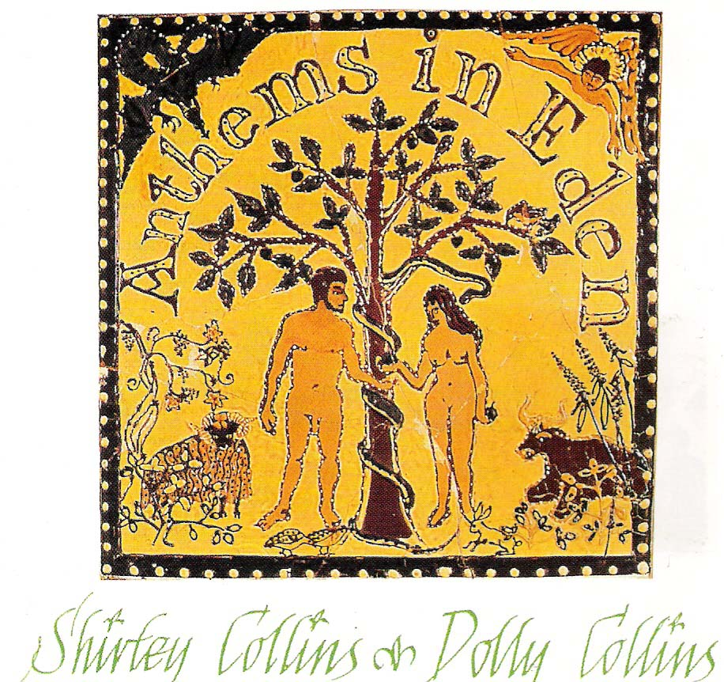
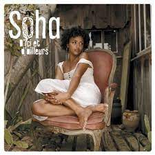

= Радио Аэростат
:toc: left

> link:aerostat.html[<Home>]
> link:toc.html[<Contents>]
> link:lyrics.html[<Lyrics>]

++++

++++

                                                                          
== 38.

=== Система Безумия Т. Уэйтса, 22 октября 2023
<https://aerostatbg.ru/release/959>

.Tom Waits - link:TOM%20WAITS/Tom%20Waits%201987%20-%20Franks%20Wild%20Years/lyrics/franks.html#_i_ll_be_gone[I'll Be Gone]
image:TOM WAITS/Tom Waits 1987 - Franks Wild Years/cover.jpg[Franks Wild Years,200,200,role="thumb left"]

.Tom Waits – Jersey Girl
image:TOM WAITS/Tom Waits 1980 - Heartattack And Vine/cover.jpg[Heartattack And Vine,200,200,role="thumb left"]

.Tom Waits – Underground

.Tom Waits - link:TOM%20WAITS/Tom%20Waits%201985%20-%20Rain%20Dogs%20-%20part%201/lyrics/raindogs.html#_blind_love[Blind Love]
image:TOM WAITS/Tom Waits 1985 - Rain Dogs - part 1/raindogs.png[Rain Dogs - part 1,200,200,role="thumb left"]

++++
 
++++

[%hardbreaks]
Tom Waits - link:TOM%20WAITS/Tom%20Waits%201987%20-%20Franks%20Wild%20Years/lyrics/franks.html#_more_than_rain[More Than Rain]
Tom Waits - link:TOM%20WAITS/Tom%20Waits%201987%20-%20Franks%20Wild%20Years/lyrics/franks.html#_train_song[Train Song]
Tom Waits - link:TOM%20WAITS/Tom%20Waits%201985%20-%20Rain%20Dogs%20-%20part%201/lyrics/raindogs.html#_clap_hands[Clap Hands]
Tom Waits - link:TOM%20WAITS/Tom%20Waits%201987%20-%20Franks%20Wild%20Years/lyrics/franks.html#_yesterday_is_here[Yesterday Is Here]
Tom Waits - link:TOM%20WAITS/Tom%20Waits%201985%20-%20Rain%20Dogs%20-%20part%201/lyrics/raindogs.html#_big_black_mariah[Big Black Mariah]
Tom Waits - link:TOM%20WAITS/Tom%20Waits%201987%20-%20Franks%20Wild%20Years/lyrics/franks.html#_innocent_when_you_dream[Innocent When You Dream]
    
++++
 
++++

=== New Names, 15 октября 2023
<https://aerostatbg.ru/release/958>

[%hardbreaks]
Murder Capital – The Star Will Leave Their Stage
Moby Grape – 8:05
Electric Sufi feat. Professor Chill, Sarah Yaseen & Mina Salama – Hudaaya
Fanny Mendelssohn Hensel – Piano Sonata in G minor: II. Scherzo
Nashville Ambient Ensemble – Waveguide
Lutan Fyah – Never Stop Hail Rastafari
Curtis Mayfield – Superfly
Supersport! – Allt fólkið allt í kringum mig
Pharoah Sanders – You Don't Know What Love Is
    
++++
 
++++

=== То Да Сё №31, 8 октября 2023
<https://aerostatbg.ru/release/957>

.Old Crow Medicine Show – Keel Over And Die

.Sufjan Stevens – Will Anybody Ever Love Me?

.Johann Sebastian Bach – Orchestral Suite No. 2 in B minor: VI. Menuet

.Paul Rodgers – Dance In The Sun

++++
 
++++

[%hardbreaks]
Pink Floyd – Burning Bridges
Cotton Mather – Fishes, Loaves And Hand Grenades
Josquin des Prez – La Spagna
Bob Marley & The Wailers – Turn Your Light Down Low
Peter Gabriel – This Is Home (Dark-Side Mix)
Olivier Messiaen – L'Ascension: II. Alleluias sereins d'une âme qui désire le ciel
    
++++
 
++++

=== October New, 1 октября 2023
<https://aerostatbg.ru/release/956>

.Old Crow Medicine Show – Ballad Of Jubilee Jones

.Animal Collective – Gem & I

.Kathryn Tickell & The Darkening – Caelestis / Sheep In The Temple

.Oneohtrix Point Never – A Barely Lit Path

++++
 
++++

.Paul Rodgers – Midnight Rose

[%hardbreaks]
Thomas Walsh – All This Hurt
Burning Spear – The Spear
Hauschka – Limitations Of Lifetime
Buffalo Nichols – You're Gonna Need Somebody On Your Bond
Peter Culshaw – Night Country (Mayotte)
    
++++
 
++++

=== Мир, В Котором Мы Живем, 24 сентября 2023
<https://aerostatbg.ru/release/955>

.Tamikrest – Manhouy Inerizhan

.Eels - link:EELS/Eels%20-%20Blinking%20Lights%20And%20Other%20Revelations/lyrics/blinking.html#_railroad_man[Railroad Man]
image:EELS/Eels - Blinking Lights And Other Revelations/Folder.jpg[Blinking Lights And Other Revelations,200,200,role="thumb left"]

[%hardbreaks]
Wolfgang Amadeus Mozart – Andante in E-flat major, K. 15mm
Johann Sebastian Bach – Cello Suite No. 4 in E-Flat major: V. Bourrée I (Arr. for Trumpet and Organ)
David Sylvian – A Fire In The Forest
Dragostin Folk National – Ишу, бяла Недо
Michael Stipe – Future If Future
Édith Piaf – Simply A Waltz
Lúnasa – Bulgarian Rock
Talking Heads – This Must Be The Place (Naïve Melody)

++++
 
++++

=== Новости и БОГРУКИНОГ, 17 сентября 2023
<https://aerostatbg.ru/release/954>

.БГ+ – Черный лебедь

[%hardbreaks]
Rolling Stones – Angry
БГ+ – Незабыто
БГ+ – Новый шелковый путь
Chieftains – Bonaparte's Retreat
Gus Teja World Music – Beauty In Colors

++++
 
++++

=== То да Сё № 30, 10 сентября 2023
<https://aerostatbg.ru/release/953>

.Band – Across The Great Divide

.Shirley & Dolly Collins – Fare Thee Well My Dearest Dear

.Donovan – Bleak City Woman

.High Llamas – Tides

++++
 
++++

[%hardbreaks]
Lutan Fyah – These Are My Better Days
Ronnie Lane & Slim Chance – Careless Love
Sun Ra & His Arkestra – Bassism
Uma Mohan – Brahma Krtam Mahalakshmi Kavacham
Stevie Wonder – Heaven Is 10 Zillion Light Years Away
Charles Aznavour – Bon anniversaire

++++
 
++++

=== Новые Песни Сентября, 3 сентября 2023
<https://aerostatbg.ru/release/952>

.Dengue Fever – Touch Me Not

[%hardbreaks]
Pretenders – A Love
Blind Boys Of Alabama – Work Until My Days Are Done
Flyte – Speech Bubble
Alice Cooper feat. Tom Morello – White Line Frankenstein
Orchestral Manoeuvres In The Dark – Bauhaus Staircase
Kara Jackson – Pawnshop
Sufjan Stevens – So You Are Tired
Chemical Brothers – Skipping Like a Stone
Herb Alpert – East Bound and Down

++++
 
++++ 

=== Ответы На Вопросы, 27 августа 2023
<https://aerostatbg.ru/release/951>

.Swingle Singers – Prelude No. 11 in F major (BWV 880)
image:Les Swingle Singers - Jazz Sebastien Bach/cover.jpg[Jazz Sebastien Bach,200,200,role="thumb left"]

.Leonard Cohen - link:LEONARD%20COHEN/Leonard%20Cohen%20-%20Ten%20New%20Songs/lyrics/ten.html#_love_itself[Love Itself]
image:LEONARD COHEN/Leonard Cohen - Ten New Songs/cover.jpg[Ten New Songs,200,200,role="thumb left"]

.Ivor Cutler Trio – Flim Flam Flum

[%hardbreaks]
Blur – Barbaric
Brian Eno & Harold Budd – First Light
Ivo Sedláček – Gopala Gopala
Talking Heads – I Zimbra
Isan – Recently In The Sahara
Ivor Cutler Trio – Darling, Will You Marry Me Twice?

++++
 
++++ 

=== Новые Имена № 42, 20 августа 2023
<https://aerostatbg.ru/release/950>

.Soha – C'est bien mieux comme ça

[%hardbreaks]
Brian Houston – The Days Of Pearly Spencer
Ernest Hood – Bedroom Of The Absent Child
Christian Besa Wright – Cherry Blossom Oak
Mellow Candle – Reverend Sisters
Doug McKechnie – Gyre And Gimble
Kíla – Rachel Corrie
Giulio Briccialdi – Wind Quintet in D major, Op. 124: II. Andante
Crooked Still – Come On In My Kitchen

++++
 
++++ 

=== Два и Один, 13 августа 2023
<https://aerostatbg.ru/release/949>

.Enya – Book Of Days

.Robert Fripp – Music For Quiet Moments 52 – Time And Time Again

[%hardbreaks]
Ernest Hood – The Jantzen Rag (Raccoons)
Paul & Linda McCartney – Dear Boy
Chopstick Dubplate feat. Mr. Williamz – Wanted
Yamato Ensemble – Futatsu no Den‐en‐shi: No. 1
Yash-ar – Kaldıralım
Blake Mills – There Is No Now
Beach Boys – In My Room
Ben Folds – But Wait, There's More

++++
 
++++ 

=== Август: Новые Песни, 6 августа 2023
<https://aerostatbg.ru/release/948>

.Sinéad O'Connor – Dancing Lessons
image:SINEAD OCONNOR/Faith And Courage/cover.jpg[Faith And Courage,200,200,role="thumb left"]

[%hardbreaks]
Pregoblin feat. Peter Doherty – These Hands AKA Danny Knife
Peter Gabriel – So Much (Dark-Side Mix)
Domenico Lancellotti – Aterrizar
Blake Mills – Skeleton Is Walking
Sparklehorse – Evening Star Supercharger
Protomartyr – For Tomorrow
African Head Charge – Accra Electronica
Beck & Phoenix – Odyssey
    
++++
 
++++     

=== Lunassad 2023, 30 июля 2023
<https://aerostatbg.ru/release/947>

[%hardbreaks]
Full English – Awake Awake
Nuala Kennedy – Ye Lover's All
Trials Of Cato – Aberdaron
Me Lost Me – Mirie It Is While Summer I Last
Belshazzar's Feast – Hills Of The North
Lankum – The Young People
Battlefield Band feat. Christine Primrose & Nuala Kennedy – Scots Gaelic Song: An Gille Mear
Lúnasa – Paddy's Green Shamrock Shore
Belshazzar's Feast – Museum Hornpipe

++++
 
++++ 

=== Новые Имена, 23 июля 2023
<https://aerostatbg.ru/release/946>

.Tally Hall – Turn The Lights Off
image:Tally Hall/2011 - Good & Evil/tally_hall-good_and_evil-web-2011.jpg[Good & Evil,200,200,role="thumb left"]

[%hardbreaks]
José Miguel Moreno & Orphénica Lyra – Canarios
Sister Rosetta Tharpe & Sam Price Trio - When I Move To The Sky
Ultramarine – Kingdom
Samuel Blaser – Thoroughfare
Petula Clark – Downtown
Singers & Players feat. Prince Far I – Quanté Jubila
Blossom Dearie – I Won't Dance
Antônio Carlos Jobim – Wave
Jane Birkin – Jane B
Domenico Lancellotti – Tá brabo

++++
 
++++ 

=== Мир Как Отражение, 16 июля 2023
<https://aerostatbg.ru/release/945>

.Richard Thompson – The Ghost Of You Walks
image:RICHARD THOMPSON/2001 - Action Packed - The Best of the Capitol Years/cover.jpg[Action Packed - The Best of the Capitol Years,200,200,role="thumb left"]

.Paul Simon – Some Folks' Lives Roll Easy
image:PAUL SIMON/2018 - In The Blue Light/cover.jpg[In The Blue Light,200,200,role="thumb left"]

[%hardbreaks]
Chad & Jeremy – A Summer Song
Lei Qiang – Embroidered Pouch
Nick Drake – Bryter Later
Hemant Kumar – Chole Jay Mori Hay Basanter Din
Jack Hylton & His Orchestra – By A Waterfall
Ólafur Arnalds – Loftið verður skyndilega kalt
Nik Freitas – In The Frame
Franz Joseph Haydn – Trumpet Concerto in E-flat major: II. Adagio

++++
 
++++ 

=== Court And Spark, 9 июля 2023
<https://aerostatbg.ru/release/944>

.Joni Mitchell – Help Me
image:JONI MITCHELL/Court and Spark (remastered)/cover.jpg[Court and Spark (remastered),200,200,role="thumb left"]

[%hardbreaks]
Joni Mitchell – Raised On Robbery
Joni Mitchell – Blue
Joni Mitchell – Court And Spark
Joni Mitchell – Free Man In Paris
Joni Mitchell – Car On A Hill
Joni Mitchell – Down On You
Joni Mitchell – People's Parties
Joni Mitchell – Just Like This Train
Joni Mitchell – Twisted
Joni Mitchell – The Same Situation
    
++++
 
++++ 

---

> link:aerostat.html[<Home>]
> link:toc.html[<Contents>]
> link:lyrics.html[<Lyrics>]