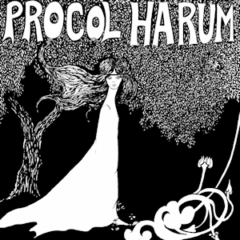
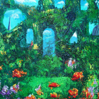
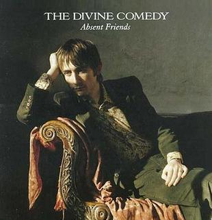
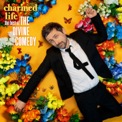
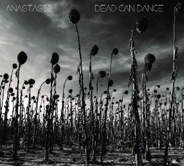
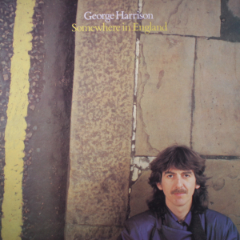

= Радио Аэростат
:toc: left

> link:aerostat.html[<Home>]
> link:toc.html[<Contents>]
> link:lyrics.html[<Lyrics>]

++++

++++

                                                                          
== 36.

=== Британское Рэгге, 13 ноября 2022

<https://aerostatbg.ru/release/909>

[%hardbreaks]
UB40 – One In Ten
Millie Small – My Boy Lollipop
Desmond Dekker – It Mek
Cimarons – Feel Nice
Matumbi – Bluebeat And Ska
Steel Pulse – Cry Cry Blood
Aswad – Shine
Linton Kwesi Johnson – Dread Beat An' Blood
Specials – Concrete Jungle
Janet Kay – Silly Games
Beat – Ranking Full Stop

++++
 
++++

=== New November Songs, 6 ноября 2022

<https://aerostatbg.ru/release/909>

[%hardbreaks]
Taylor Swift – You're On Your Own, Kid
Björk – Mycelia
Gorillaz feat. Thundercat – Cracker Island
Queen – Face It Alone
Gaye Su Akyol – Sen benim mağaramsın
Kabaka Pyramid feat. Damian Marley – Red Gold And Green
Jean-Michel Jarre – Zeitgeist
Sarathy Korwar feat. Photay – Remember Begum Rokheya
Al-Qasar feat. Lee Ranaldo – Awal
Caitlin Rose – Nobody's Sweetheart

++++
 
++++

=== Samhain: Невидимый Мир, 23 октября 2022

<https://aerostatbg.ru/release/908>

.Steeleye Span - link:STEELEYE%20SPAN/Steeleye%20Span%20-%20Below%20the%20Salt/lyrics/salt.html#_rose_bud_in_june[Rosebud In June]
image:STEELEYE SPAN/Steeleye Span - Below the Salt/Folder.jpg[Below the Salt,200,200,role="thumb left"]

.Eliza Carthy & Norma Waterson – Bunch Of Thyme

[%hardbreaks]
Eric Bogle – All The Fine Young Man
Fairport Convention – Sir Patrick Spens (Live On John Peel’sTop Gear, 1969)
Danny Thompson & Richard Thompson – Sweetheart On The Barricade
Maura O'Connell – Summerfly
Robin Laing – Uisquebaugh Baul
Barleyjuice – Rosin The Bow
Andy M. Stewart & Manus Lunny – Heart Of The Home

++++
 
++++

=== To & Сё № 27, 23 октября 2022

<https://aerostatbg.ru/release/907>

.Leonard Cohen - link:LEONARD%20COHEN/Leonard%20Cohen%202012%20-%20Old%20Ideas/lyrics/old.html#_different_sides[Different Sides]
image:LEONARD COHEN/Leonard Cohen 2012 - Old Ideas/Old ideas Cover.jpg[Old Ideas,200,200,role="thumb left"]

.Procol Harum - link:PROCOL%20HARUM/1967%20-%20Procol%20Harum%20(With%20Bonus%20Tracks)/lyrics/procol.html#_a_christmas_camel[A Christmas Camel]

.George Harrison - link:GEORGE%20HARRISON/George%20Harrison%20-%20Best%20Of%20Dark%20Horse%201976-1989/lyrics/darkhorse.html#_here_comes_the_moon[Here Comes The Moon]
image:GEORGE HARRISON/George Harrison - Best Of Dark Horse 1976-1989/Folder.jpg[Best Of Dark Horse 1976-1989,200,200,role="thumb left"]

.Brian Eno – I'm Hardly Me

++++
 
++++

.Al-Qasar – Benzine
image:Al-Qasar 2022 - Who Are We/cover.jpg[Qasar 2022 - Who Are We,200,200,role="thumb left"]

.Beatles – I'll Get You
image:THE BEATLES/1988 - Past Masters/cover.jpg[Past Masters,200,200,role="thumb left"]

.Doors – Alabama Song (Whisky Bar)
image:DOORS/1967 - The Doors/Folder.jpg[The Doors,200,200,role="thumb left"]

[%hardbreaks]
Paul McCartney – You Gave Me The Answer
Nat King Cole – Nature Boy
Bing Crosby – Getting To Know You

++++
 
++++

=== New Names, 16 октября 2022

<https://aerostatbg.ru/release/906>

.Staple Singers – Respect Yourself

[%hardbreaks]
Fanfare Orchestra Of The Castle Guard – Marche I
Heptones – Meaning Of Life
Jellyfish – He's My Best Friend
Merzbow – Flare Gun, Part II
Alban Maria Johannes Berg – Lyric Suite For String Quartet: II. Andante amoroso
David Michael Moore – Shad
Wishbone Ash – Blowin' Free
Mississippi John Hurt – Candy Man
    
++++
 
++++

=== Zappa Baroque, 9 октября 2022

<https://aerostatbg.ru/release/905>

[%hardbreaks]
Frank Zappa – Camarillo Brillo
Frank Zappa – Stink-Foot
Frank Zappa – Zomby Woof
Frank Zappa – Find Her Finer
Frank Zappa & The Mothers Of Invention – I'm The Slime
Frank Zappa – Dinah-Moe Humm
Frank Zappa & The Mothers Of Invention – Florentine Pogen
Frank Zappa – Uncle Remus

++++
 
++++

=== New October, 2 октября 2022

<https://aerostatbg.ru/release/904>

[%hardbreaks]
Luke Sital-Singh – Dressing Like A Stranger
Afghan Whigs – The Getaway
Daniel Lanois – Zsa Zsa
Souad Massi – Une seule étoile
Lightning Seeds – Emily Smiles
Will Van Horn – Attwater
Jesca Hoop – Sudden Light
Dry Cleaning – Gary Ashby
Hagop Tchaparian – Raining
Parekh & Singh – Bedouin
Mike Adams At His Honest Weight – Open Heart

++++
 
++++

=== Культура и Бизнес, 25 сентября 2022

<https://aerostatbg.ru/release/903>

.Mike Oldfield – To France
image:Mike Oldfield/2019 - Essential Collection/front.jpg[Essential Collection,200,200,role="thumb left"]

.Аквариум – Махамайя

[%hardbreaks]
After Class – Farewell to Whiskey
Mike Oldfield – Foreign Affair
Kaleidoscope – Dear Nellie Goodrich
George Harrison – Behind This Locked Door
David Bowie – China Girl

++++
 
++++

=== Nu September Songs, 18 сентября 2022

<https://aerostatbg.ru/release/902>

[%hardbreaks]
Пётр Чайковский – Спящая красавица, соч. 66: II действие, № 13 Фарандола (сцена)
Pale Waves – Lies
Son Parapluie – Je ne finis rien
Beths – Knees Deep
Elephant Sessions – Is This A Vibe
William Orbit – Duende
Buddy Guy – Gunsmoke Blues
Mabe Fratti – Cada músculo
Dr. John – Sleeping Dogs Best Left Alone
Brian Eno – We Let It In
Ozzy Osbourne – Nothing Feels Right

++++
 
++++

=== The Divine Comedy, 11 сентября 2022

<https://aerostatbg.ru/release/901>

.Divine Comedy - link:DIVINE%20COMEDY/2016%20-%20Foreverland/lyrics/foreverland.html#_catherine_the_great[Catherine The Great]
image:DIVINE COMEDY/2016 - Foreverland/Cover.jpg[Foreverland,200,200,role="thumb left"]

.Divine Comedy – Timewatching

.Divine Comedy – My Imaginary Friend

.Divine Comedy – Bang Goes The Knighthood
image:DIVINE COMEDY/2010 - Bang Goes The Knighthood/cover.jpg[Bang Goes The Knighthood,200,200,role="thumb left"]

++++
 
++++

.Divine Comedy – Something For The Weekend

[%hardbreaks]
Divine Comedy – Tonight We Fly
Divine Comedy – Everybody Knows (Except You)
Divine Comedy – Eric The Gardener
Divine Comedy - link:DIVINE%20COMEDY/2016%20-%20Foreverland/lyrics/foreverland.html#_the_pact[The Pact]

++++
 
++++

=== Культура, 4 сентября 2022

<https://aerostatbg.ru/release/900>

.Cotton Mather – Ramon Finds Waterfalls
image:COTTON MATHER/Cotton Mather - The Big Picture/cover.png[The Big Picture,200,200,role="thumb left"]

.George Harrison – I Really Love You
image:GEORGE HARRISON/George Harrison - Gone Troppo/cover.jpg[Gone Troppo,200,200,role="thumb left"]

.George Harrison – Sue Me, Sue You Blues
image:GEORGE HARRISON/1995 - Pirate Songs/cover.jpg[Pirate Songs,200,200,role="thumb left"]

.Cocteau Twins – Watchlar

++++
 
++++

.Paul Simon – St. Judy's Comet
image:PAUL SIMON/1973 - There Goes Rhymin Simon/Folder.jpg[There Goes Rhymin Simon,200,200,role="thumb left"]

[%hardbreaks]
Hemanta Mukherjee – He kshaniker atithi
Tsinandali Choir – Zamtari
A Perfect Circle – Sleeping Beauty
Thom Yorke – Guess Again!
Helmut Jost – Trumpet Concerto in E-flat major: II. Adagio (Franz Joseph Haydn)

++++
 
++++

=== Дом Всех Святых, 28 августа 2022

<https://aerostatbg.ru/release/899>

.Аквариум – Учение свет

[%hardbreaks]
Аквариум – Великий змей
Аквариум – Вино из песка
Аквариум – Ворожба
Аквариум – Не выходи за дверь
Аквариум – Агатина песня
Аквариум – Королям листопада
Аквариум – Обида
Аквариум – Дом всех святых
Аквариум – Я не я
    
++++
 
++++

=== Книги по Истории, 21 августа 2022

<https://aerostatbg.ru/release/898>

.Kate Rusby feat. Sam Kelly – Blooming Heather @30

.John Surman – Druid's Circle

[%hardbreaks]
Pier  Damiano Peretti – Toccata Prima (Kerll)
Aggrolites – Love Isn't Love
Eurythmics – A Little Of You
John Smith – Another Country
Johann Sebastian Bach – Orchestral Suite No. 1 in C major: 1. Ouverture (The English Concert, Trevor Pinnock)
Françoise Hardy & Iggy Pop – I'll Be Seeing You
Aly Bain & Phil Cunningham – Sheenagh's Air

++++
 
++++ 

=== Песни Франции, 14 августа 2022

<https://aerostatbg.ru/release/897>

[%hardbreaks]
Francis Lemarque – À Paris
Maurice Chevalier – Ça sent si bon la France
Charles Trenet – La Mer
Édith Piaf – La Vie en rose
Yves Montand – C'est si bon
Juliette Gréco – Si tu t'imagines
Gilbert Bécaud – Nathalie
Françoise Hardy – Comment te dire adieu
Jacques Brel – La Valse à mille temps
Georges Brassens – Les Quat'z'arts
Charles Aznavour – Une vie d'amour
    
++++
 
++++ 

=== Новые песни августа, 7 августа 2022

<https://aerostatbg.ru/release/896>

.Junipers – Wobbly Interlude

[%hardbreaks]
Cass McCombs – Karaoke
Eric Clapton – Pompous Fool
Kate Rusby – Fairest Of All Yarrow @30
Sessa – Gostar do mundo
Red Hot Chili Peppers – Nerve Flip
Gabríel Ólafs – Solon Islandus
Rita Morar & Adrian Sherwood – Meri awaaz suno (Hear My Voice)
Julia Jacklin – I Was Neon
Calypso Rose feat. Carlos Santana & The Garifuna Collective – Watina
Death Cab For Cutie – Here To Forever

++++
 
++++ 

=== Лунаса, 31 июля 2022

<https://aerostatbg.ru/release/895>

[%hardbreaks]
Liam O'Flynn – Sliabh na mban
Ceól & Christian Fotsch – Òrò sé do bheatha abhaile
All Folk'd Up – The Contender
Bryony Griffith & Alice Jones – The Grey Goose And Gander
Plethyn – Si hei lwli mabi
Davy Spillane – Midnight Walker
Seán Ó Riada – Women of Ireland (From “Barry Lyndon”)
Ye Vagabonds – Lowlands Of Holland

++++
 
++++ 

=== Заслуга. То да Сё № 26, 24 июля 2022

<https://aerostatbg.ru/release/894>

.Beatles – The Inner Light
image:THE BEATLES/1988 - Past Masters/cover.jpg[Past Masters,200,200,role="thumb left"]

.Jethro Tull – Mother Goose
image:JETHRO TULL/1971  Aqualung/cover.jpg[1971  Aqualung,200,200,role="thumb left"]

.Dead Can Dance – Anabasis

.Roger Eno – Garden
image:ROGER ENO/2017 - This Floating World/cover.jpg[This Floating World,200,200,role="thumb left"]

++++
 
++++ 

.Crosby, Stills & Nash – Just A Song Before I Go
image:Crosby Stills Nash/2005 - Greatest Hits/cover.jpg[Greatest Hits,200,200,role="thumb left"]

[%hardbreaks]
Sandy Denny – Milk & Honey
Scott Matthews & Robert Plant – 12 Harps
Robert Plant & Jimmy Page – Rude World
Jeremy Loops feat. Ladysmith Black Mambazo – This Town

++++
 
++++ 

=== Never Heard of Them, 17 июля 2022

<https://aerostatbg.ru/release/893>

[%hardbreaks]
Myrkur – Gudernes Vilje
Kingston Trio – One More Town
Uji – Jenga
Lemon Pipers – Everything Is You
Oren Ambarchi – Thirsty Boots
Jay-Jay Johanson – Why Wait Until Tomorrow
Lorn – Acid Rain
Evan Dando – Lovely New York
Transglobal Underground – Lookee Here

++++
 
++++ 
    
=== Новые Песни Июля, 10 июля 2022

<https://aerostatbg.ru/release/892>

[%hardbreaks]
Jack Johnson – Don't Look Now
ZZ Top – La Grange
Wardruna – Kvitravn
Jeff Beck & Johnny Depp – This Is A Song For Miss Hedy Lamarr
Shonky – Electrica
Ozzy Osbourne feat. Jeff Beck – Patient Number 9
Taylor Swift – Carolina
Fisherman's Friends feat. Imelda May – Cornwall My Home

++++
 
++++ 

=== Music Of Stevie Mind, 3 июля 2022

<https://aerostatbg.ru/release/891>

[%hardbreaks]
Stevie Wonder – Love Having You Around
Stevie Wonder – My Cherie Amour
Stevie Wonder – Maybe Your Baby
Stevie Wonder – Superwoman (Where Were You When I Needed You)
Stevie Wonder – Happier Than The Morning Sun
Stevie Wonder – Superstition
Stevie Wonder – You Are The Sunshine Of My Life

++++
 
++++ 

=== Hoagy and Culture, 18 июня 2022

<https://aerostatbg.ru/release/890>

.Jeff Lynne's ELO – Losing You
image:Electric Light Orchestra/2019 - From Out of Nowhere/cover.png[From Out of Nowhere,200,200,role="thumb left"]

.George Harrison – Hong Kong Blues

[%hardbreaks]
Ray Charles – Georgia On My Mind
Hoagy Carmichael – Stardust
Hoagy Carmichael – Ole Buttermilk Sky
Rakesh Chaurasia, Sunil Das, Ulhas Bapat, Zarin Daruwala, Akhlak Hussain, Bhavani Shankar, Ashit Desai – Odhhaji Mara Vaalane
Jan Pieterszoon Sweelinck – More palatino
Леонид Фёдоров & Владимир Волков – Таял, ч. 2
George Frideric Handel – Organ Concerto No. 5 in F major: IV. Presto
Sun's Signature – Apples

++++
 
++++ 

---

> link:aerostat.html[<Home>]
> link:toc.html[<Contents>]
> link:lyrics.html[<Lyrics>]
