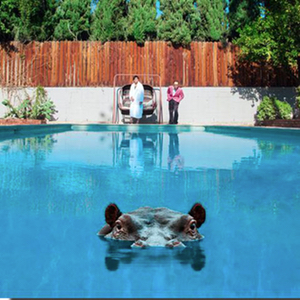

= Радио Аэростат
:toc: left

> link:lyrics.html[Lyrics]

- link:aerostat32.html[`Глава XXXII.   3.05.2020 -  1.11.2020`]
- link:aerostat31.html[`Глава XXXI.   27.10.2019 - 26.04.2020`]
- link:aerostat30.html[`Глава XXX.    28.04.2019 - 20.10.2019`]
- link:aerostat29.html[`Глава XXIX.   14.10.2018 - 21.04.2019`]
- link:aerostat28.html[`Глава XXVIII.  8.04.2018 -  7.10.2018`]
- link:aerostat27.html[`Глава XXVII.  10.09.2017 -  1.04.2018`]
- link:aerostat26.html[`Глава XXVI.    5.03.2017 -  3.09.2017`]
- link:aerostat25.html[`Глава XXV.    28.08.2016 - 26.02.2017`]
- link:aerostat24.html[`Глава XXIV.   16.02.2016 - 21.08.2016`]
- link:aerostat23.html[`Глава XXIII.  30.08.2015 - 21.02.2016`]
- link:aerostat22.html[`Глава XXII.    1.03.2015 - 23.08.2015`]
- link:aerostat21.html[`Глава XXI.    31.08.2014 - 22.02.2015`]
- link:aerostat20.html[`Глава XX.      2.03.2014 - 24.08.2014`]
- link:aerostat19.html[`Глава XIX.    15.09.2013 - 23.02.2014`]
- link:aerostat18.html[`Глава XIIIV.  31.03.2013 -  8.09.2013`]

...

- link:aerostat05.html[`Глава V.      25.03.2006 -  9.09.2007`]
- link:aerostat04.html[`Глава IV.      8.10.2006 - 18.03.2007`]
- link:aerostat03.html[`Глава III.    23.04.2006 -  1.10.2006`]
- link:aerostat02.html[`Глава II.      6.11.2005 - 16.04.2006`]
- link:aerostat01.html[`Глава I.      22.05.2005 - 30.10.2005`]

++++
 
++++

++++

++++

<<<

== 33.

=== То Да Сё №11, 22 ноября 2020

<https://aerostatbg.ru/release/810>

.Tír na nÓg – Dance Of Years
image:TIR NA NOG/1971 - Tír Na NÓg/Tír Na NÓg - Tír Na NÓg.jpg[Tír Na NÓg,200,200,role="thumb left"]

[%hardbreaks]
System Of A Down – Protect The Land
Joni Mitchell – Born To Take The Highway
Tony Scott – Satori (Enlightenment)
Grateful Dead – Althea
Cocteau Twins – Oil Of Angels
Van Morrison – Snow In San Anselmo
Hollies – Oriental Sadness
    
++++
 
++++

=== The Sparks, 15 ноября 2020

<https://aerostatbg.ru/release/809>

.Sparks – Amateur Hour
image:SPARKS/1974 - Kimono My House/Folder.jpg[Kimono My House,200,200,role="thumb left"]

.Sparks – Under The Table With Her
image:SPARKS/1975 - Indiscreet/front.jpg[Indiscreet,200,200,role="thumb left"]

.Sparks – The Number One Song In Heaven
image:SPARKS/Sparks - No. 1 In Heaven/cover.jpg[No. 1 In Heaven,200,200,role="thumb left"]

.Sparks – This Town Ain't Big Enough For The Both Of Us
image:SPARKS/1997 - Plagiarism/cover.jpg[Plagiarism,200,200,role="thumb left"]

++++
 
++++

.Sparks - link:SPARKS/2002%20-%20Lil%20Beethoven/lyrics/lil.html#_the_rhythm_thief[The Rhythm Thief]
image:SPARKS/2002 - Lil Beethoven/cover.jpg[Lil Beethoven,200,200,role="thumb left"]

.Sparks - link:SPARKS/Sparks%202017%20-%20Hippopotamus/lyrics/hippo.html#_the_amazing_mr_repeat[The Amazing Mr. Repeat]

.Sparks – Onomato Pia
image:SPARKS/Sparks 2020 - A Steady Drip Drip Drip/cover.jpg[A Steady Drip Drip Drip,200,200,role="thumb left"]

[%hardbreaks]
Sparks – When Do I Get To Sing 'My Way'
Sparks – Angst In My Pants
Sparks – Falling In Love With Myself Again

++++
 
++++

=== Новые Песни Ноября, 8 ноября 2020

<https://aerostatbg.ru/release/808>

[%hardbreaks]
Gorillaz feat. Peter Hook & Georgia – Aries
Working Men’s Club – A.A.A.A.
Autechre – gr4
Garcia Peoples – Gliding Through
AC/DC – Shot In The Dark
Juliette Gréco – Sous le ciel de Paris
Gratien Midonet – Ven en lévé
Ólafur Arnalds feat. Bonobo – Loom
Аквариум – Камчатка
Loudon Wainwright III – How I Love You (I'm Tellin' the Birds, Tellin' the Bees)
    
