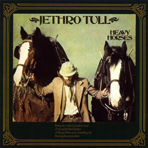
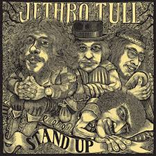
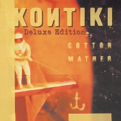

= Радио Аэростат
:toc: left

> link:aerostat.html[<Home>]
> link:toc.html[<Contents>]
> link:lyrics.html[<Lyrics>]

++++

++++

                                                                          
== 41.

=== Tо & Se № 44, 13 июля 2025
<https://aerostatbg.ru/release/1047>

.Low Anthem – Give My Body Back
image:Low Anthem/The Salt Doll Went To Measure The Depth Of The Sea/cover.jpg[The Salt Doll Went To Measure The Depth Of The Sea,200,200,role="thumb left"]

.Cocteau Twins – Tishbite
image:Cocteau Twins/Milk & Kisses/milkandkisses.jpg[Milk & Kisses,200,200,role="thumb left"]

[%hardbreaks]
Kingston Sound System & The B-52's – Love Shack
Chris Wood – The Cottager's Reply
Talking Heads – Happy Day
Sly & The Family Stone – Dance To The Music
Cat Stevens – Trouble
Jan Pieterszoon Sweelinck – Est-ce Mars?
Chumbawamba – Song On The Times
Bobby Darin – Dream Lover

++++
 
++++

=== Новые Песни Июля, 6 июля 2025
<https://aerostatbg.ru/release/1046>

.Garbage – There's No Future In Optimism

.Counting Crows – Spaceman In Tulsa

[%hardbreaks]
David Byrne – Everybody Laughs
Alice Cooper – Wild Ones
Rolling Stones feat. Steve Riley – Zydeco Sont Pas Salés
Peggy Seeger – Sing About These Hard Times
Little Simz – Flood
Dropkick Murphys – Who'll Stand With Us?
Black Keys – Babygirl
Fontaines D.C. – Starbuster

++++
 
++++

=== Время Мифа, 29 июня 2025
<https://aerostatbg.ru/release/1045>

.Cocteau Twins – Watchlar
image:Cocteau Twins/Cocteau Twins - 1991 CD Single Box Set/Cocteau Twins - 09 Iceblink Luck/covers.jpg[09 Iceblink Luck,200,200,role="thumb left"]

.Beatles - link:THE%20BEATLES/1966%20-%20Revolver/lyrics/revolver.html#_here_there_and_everywhere[Here, There And Everywhere]
image:THE BEATLES/1966 - Revolver/cover.jpg[Revolver,200,200,role="thumb left"]

.Jethro Tull - link:JETHRO%20TULL/Jethro%20Tull%20-%20Heavy%20Horses/lyrics/horses.html#_acres_wild[Acres Wild]

.Jethro Tull – Look Into The Sun

++++
 
++++

.Dieterich Buxtehude – Toccata In G Major

[%hardbreaks]
Rolling Stones – 2000 Light Years From Home
Paul McCartney – Cafe On The Left Bank
Idle Race – End Of The Road
Jimi Hendrix Experience – Bold As Love
Robin Laing – Summer Of ‘46

++++
 
++++

=== Редкости, 22 июня 2025
<https://aerostatbg.ru/release/1044>

[%hardbreaks]
Jethro Tull – Jack Frost And The Hooded Crow
Paul McCartney – Great Day
Beatles – A Beginning
Nick Drake – Time Has Told Me
Donovan – What A Beautiful Creature You Are
Mary Hopkin – Wrap Me In Your Arms
Melanie – All The Things I Should Have Known
Grateful Dead – Me And My Uncle
Byrds – Why
Bruce Springsteen – Repo Man
Florence & The Machine – Free

++++
 
++++

=== То Да Сё № 43, 15 июня 2025
<https://aerostatbg.ru/release/1043>

.Beach Boys – Good Vibrations
image:The Beach Boys/Smiley Smile/folder.jpg[Smiley Smile,200,200,role="thumb left"]

.Ink Spots - link:Ink%20Spots%20-%20The%20Very%20Best/lyrics/ink.html#_we_three_my_echo_my_shadow_me[We Three (My Echo, My Shadow And Me)]
image:Ink Spots - The Very Best/Folder.jpg[The Very Best,200,200,role="thumb left"]

.Jethro Tull – Drive On The Young Side Of Life
image:JETHRO TULL/1993  Nightcap (Your Round) - Unrele/cover.jpg[Unrele,200,200,role="thumb left"]

.Idle Race – On With The Show
image:Idle Race - Birthday Party/Folder.jpg[Birthday Party,200,200,role="thumb left"]

++++
 
++++

.Swingle Singers – Prelude No. 11 in F major (BWV 880)
image:Les Swingle Singers - Jazz Sebastien Bach/cover.jpg[Jazz Sebastien Bach,200,200,role="thumb left"]

.Joe Brown – You've Got Your Troubles

.Al Green – You Ought To Be With Me

[%hardbreaks]
Everything Is Everything – Witchi Tai To
Jimi Hendrix – Pali Gap
Alan Price – Sell Sell

++++
 
++++

=== Песни Джорджа, 8 июня 2025
<https://aerostatbg.ru/release/1042>

[%hardbreaks]
Аквариум – 15 голых баб
Террариум – Сибирская песня
Террариум – Несинхрон
Аквариум – К друзьям
Аквариум – Хорал
Аквариум – Марш
Аквариум – Из Тамбова с любовью
БГ-Бэнд – Русская симфония
Террариум – Китайцы не хотят
Террариум – Лабрадор/Гибралтар
Аквариум – Сонет
Террариум – Зоя и Соня

++++
 
++++

=== Новые Песни Июня, 1 июня 2025
<https://aerostatbg.ru/release/1041>

.REM - link:REM/REM%20-%20Eponymous/lyrics/eponymous.html#_radio_free_europe[Radio Free Europe]
image:REM/REM - Eponymous/cover.jpg[Eponymous,200,200,role="thumb left"]

.REM – Sitting Still
image:REM/REM - Murmur/cover.jpg[Murmur,200,200,role="thumb left"]

.Brian Eno & Beatie Wolfe – Suddenly

[%hardbreaks]
Stereolab – Aerial Troubles
Robert Forster – Strawberries
Snapped Ankles – Personal Responsibilities
Beirut – Tuanaki Atoll
Nils Frahm – Kanten
Van Morrison – Down To Joy
T. Rex – Lady

++++
 
++++

=== 20 Лет Аэростату, 25 мая 2025
<https://aerostatbg.ru/release/1040>

[%hardbreaks]
Борис Гребенщиков – У кошки четыре ноги
Борис Гребенщиков – Услышь меня, хорошая
Борис Гребенщиков – Шинкарёвский романс
Борис Гребенщиков – Станочек
Борис Гребенщиков – Чёрный Ворон
Борис Гребенщиков – Сердце
Борис Гребенщиков – Снился Мне Сад
Борис Гребенщиков – Песня о Встречном
Борис Гребенщиков – Тёмная Ночь
Борис Гребенщиков – Тучи над Городом Встали
Борис Гребенщиков – Чубчик

++++
 
++++

=== Новые Имена, 18 мая 2025
<https://aerostatbg.ru/release/1039>

[%hardbreaks]
Blasters – No Other Girl
Fleur De Lys – Circles
Jacob Miller – Tenement Yard
Ornette Coleman – Lonely Woman
Freddie & The Dreamers – I'm Telling You Now
Love Sculpture – People People
Rebekka Karijord – Serenade
Shack – Streets Of Kenny
Gregorio Allegri – Miserere mei, Deus
Woody Guthrie – Roll On Columbia

++++
 
++++

=== Duke Ellington, 11 мая 2025
<https://aerostatbg.ru/release/1038>

[%hardbreaks]
Duke Ellington – Creole Love Call
Duke Ellington – Mood Indigo
Duke Ellington – Don't Get Around Much Anymore
Duke Ellington – It Don't Mean A Thing
Duke Ellington – Sophisticated Lady
Duke Ellington – In A Sentimental Mood
Duke Ellington – A Hundred Dreams Ago
Duke Ellington – Caravan
Duke Ellington – Will You Be There?
Duke Ellington – Take The 'A' Train
Duke Ellington – Body And Soul

++++
 
++++

=== То да Сё № 42, 4 мая 2025
<https://aerostatbg.ru/release/1037>

[%hardbreaks]
Divine Comedy – Achilles
Steppenwolf – Tenderness
Stephen Marley – Tight Ship
Moby feat. Lady Blackbird – Dark Days
Eurythmics – A Little Of You
Patti Smith – Ghost Dance
Ribale Wehbé & Archd. Marian – Kyrie Eleison
Аквариум – Иван & Данило (Riddim Version)

++++
 
++++

=== Новые Песни Мая, 27 апреля 2025
<https://aerostatbg.ru/release/1036>

[%hardbreaks]
Pulp – Spike Island
Viagra Boys – The Bog Body
Stereophonics – Seems Like You Don't Know Me
Wolfgang Flür – Property
Paul Simon & Edie Brickell – Bad Dream
Youssou N'Dour – Tell Me What You Want
Bootsy Collins – Album of the Year #1 Funkateer
Small Faces – Red Balloon
Lucy Dacus – Ankles

++++
 
++++

=== Пасха, 20 апреля 2025
<https://aerostatbg.ru/release/1035>

.Blondie - link:Blondie%20-%20Greatest%20Hits/lyrics/blondie.html#_in_the_flesh[In the Flesh]
image:Blondie - Greatest Hits/cover.jpg[Greatest Hits,200,200,role="thumb left"]

.Paul Simon – Under African Skies
image:PAUL SIMON/Paul Simon - Graceland/Folder.jpg[Graceland,200,200,role="thumb left"]

.Cotton Mather - link:COTTON%20MATHER/Cotton%20Mather%20-%20Kon%20Tiki/lyrics/kontiki.html#_autumn_s_birds[Autumn's Birds]

[%hardbreaks]
Cocteau Twins – Pitch the Baby
Paul McCartney – Distractions
George Harrison – Be Here Now
Max Romeo & The Upsetters – Chase The Devil
Аквариум – Иван-чай
Ringo Starr – Weight of the World
Choir of Clare College, Cambridge & Graham Ross – This Joyful Eastertide

++++
 
++++

=== Новые Имена, 13 апреля 2025
<https://aerostatbg.ru/release/1034>

[%hardbreaks]
Basia Bulat – My Angel
Fugazi – Waiting Room
Mimi & Richard Fariña – Pack Up Your Sorrows
Zaz – Sains et saufs
Horace Silver – Opus De Funk
Damned – Love Song
Anouar Brahem feat. Anja Lechner – In The Shade Of Your Eyes
Protoje – Big 45
Belly – Feed The Tree
Humsufi Band – Humsufi (Bondhu Re)

++++
 
++++

=== Новые Песни Апреля, 6 апреля 2025
<https://aerostatbg.ru/release/1033>

.Brian Eno – Cascade
image:BRIAN ENO/2025 - Aurum/cover.jpg[Aurum,200,200,role="thumb left"]

.Suzanne Vega – Speakers' Corner

.Jim Kweskin feat. Matt Leavenworth – Four Or Five Times

.Yazz Ahmed – She Stands On The Shore

++++
 
++++

.Kate Rusby – Let Your Light Shine

[%hardbreaks]

Ye Banished Privateers – Raise Your Glass
Black Country, New Road – Besties
Billy Gibbons – Livin' It Up In Texas
Jethro Tull – Tomorrow Was Today

++++
 
++++

=== Flook Sanju, 30 марта 2025
<https://aerostatbg.ru/release/1032>

.Flook – The Farther Shore/Winter Flower

[%hardbreaks]
Flook – Jig For Sham/The Dawn Wall/Johnny Ds/Timewaver
Flook – Koady/The Burning Lion
Flook – Tie The Knot In Georgia/Ed’s Big Five-O/Faqqua
Flook – Where There Is Light/The May Waterway/Ninety Years Young
Brian Finnegan – Dusty Windowsills/Na Tonntracha/The Mist On The Mountain/The Kings Of Inishbofin

++++
 
++++

=== Роберт Фрипп, 23 марта 2025
<https://aerostatbg.ru/release/1031>

.Robert Fripp – Music For Quiet Moments 1 – Pastorale
image:KING CRIMSON/Robert Fripp - Music For Quiet Moments Vol. 1-52/cover.jpg[Music For Quiet Moments Vol. 1-52,200,200,role="thumb left"]

[%hardbreaks]
Robert Fripp – Music For Quiet Moments 43 – Reflection
Robert Fripp – Music For Quiet Moments 8 – Evensong
Robert Fripp – Music For Quiet Moments 16 – Aspiration
Robert Fripp – Music For Quiet Moments 10 – Pastorale

++++
 
++++

=== То да Сё № 41, 16 марта 2025
<https://aerostatbg.ru/release/1030>

.Gryphon – Three Jolly Butchers

.Cat Stevens – How Good It Feels
image:CAT STEVENS/2023 - King Of A Land/cover.png[King Of A Land,200,200,role="thumb left"]

[%hardbreaks]
Jubalaires – Noah
Christie – Yellow River
Byrds – She Don't Care About Time
Bill Evans Trio – Some Other Time
Beatles – Do You Want To Know A Secret
Iron Butterfly – Soul Experience
Steppenwolf – Ride With Me
Who – Baba O'Riley

++++
 
++++

=== Танцы в Честь Ушедших, 9 марта 2025
<https://aerostatbg.ru/release/1029>

.Band – Acadian Driftwood
image:The Band/1975 - Northern Lights - Southern Cross/Folder.jpg[Northern Lights - Southern Cross,200,200,role="thumb left"]

[%hardbreaks]
Peter, Paul & Mary – Early Mornin' Rain
Sam & Dave – Soul Man
Olivia Tremor Control – Hideaway
Zakir Hussain feat. Hariprasad Chaurasia, John McLaughlin, Jan Garbarek – Water Girl
David Johansen – She
David Lynch & Angelo Badalamenti – Just You
Captain Beefheart – Low Yo Yo Stuff
Jam – Town Called Malice
Roy Ayers – Reaching The Highest Pleasure
Badfinger – Come And Get It

++++
 
++++

=== Новые Песни Марта, 2 марта 2025
<https://aerostatbg.ru/release/1028>

.Jethro Tull – The Tipu House
image:JETHRO TULL/2025 - Curious Ruminant/folder.jpg[Curious Ruminant,200,200,role="thumb left"]

[%hardbreaks]
Thom Yorke & Mark Pritchard – Back In The Game
Wooze – Sabre Tooth Spider
Steven Wilson – December Skies
Horace Andy feat. Jr. Santa – Be Wise
Ozzy Osbourne & Billy Morrison feat. Steve Stevens – Gods Of Rock'n'Roll
Piers Faccini & Ballaké Sissoko – One Half Of A Dream
Salif Keita – Tassi
Buddy Guy & Switchfoot – Last Man Standing
Jason Isbell – Bury Me

++++
 
++++

=== Ещё Прогрессив, 23 февраля 2025  
<https://aerostatbg.ru/release/1027>

.Procol Harum – New Lamps For Old
image:PROCOL HARUM/1974 - Exotic Birds And Fruit/cover.jpg[Exotic Birds And Fruit,200,200,role="thumb left"]

.Jethro Tull – Cheap Day Return
image:JETHRO TULL/1971  Aqualung/cover.jpg[1971  Aqualung,200,200,role="thumb left"]

.Jethro Tull - link:JETHRO%20TULL/1972%20%20Living%20In%20The%20Past/lyrics/past.html#_just_trying_to_be[Just Trying To Be]
image:JETHRO TULL/1972  Living In The Past/cover.jpg[1972  Living In The Past,200,200,role="thumb left"]

[%hardbreaks]
Barclay James Harvest – Hymn
Jade Warrior – Memories Of A Distant Sea
Emerson, Lake & Powell – Touch And Go
Caravan – Hello, Hello
Third Ear Band – At The Well / The Princes' Escape / Coronation / Come Sealing Night
Henry Cow – Nine Funerals Of Citizen King
Arthur Brown's Kingdom Come – Sunrise

++++
 
++++

=== То да Сё, 16 февраля 2025  
<https://aerostatbg.ru/release/1026>

.Bob Dylan – One Too Many Mornings
image:BOB DYLAN/Bob Dylan 1964 -The Times They Are A-Changin'/cover.jpg[The Times They Are A-Changin',200,200,role="thumb left"]

.Led Zeppelin – Since I've Been Loving You
image:LED ZEPPELIN/Led Zeppelin - III/III.jpg[III,200,200,role="thumb left"]

.Soft Machine – Moon In June
image:SOFT MACHINE/1970 - Third/Folder.jpg[Third,200,200,role="thumb left"]

.Loudon Wainwright III – Do We? We Do
image:BECK/2014 - Song reader/cover.jpg[Song reader,200,200,role="thumb left"]

++++
 
++++

[%hardbreaks]
Éamon Doorley, Muireann Nic Amhlaoibh, Julie Fowlis & Ross Martin – An eala bhán
Chris Brain – Wish
Lumiere – Poor Wayfaring Stranger
Black Sabbath – Who Are You?
Éamon Doorley, Muireann Nic Amhlaoibh, Julie Fowlis & Ross Martin – Dá bhfaigheann mo rogha de thriúr acu / Dhannsamaid le Ailean / Cairistion' nigh'n Eòghainn

++++
 
++++

=== Новые Песни Февраля, 9 февраля 2025  
<https://aerostatbg.ru/release/1025>

[%hardbreaks]
Luke Sital-Singh – Still Young
Good Flying Birds – I Care For You
Marianne Faithfull – This Little Bird
Sparks – Do Things My Own Way
Songhoy Blues – Norou
Marshall Allen – Same Old Love
Richard Dawson – Polytunnel
FKA Twigs & Koreless – Drums Of Death
Peter Doherty – Felt Better Alive
Ludovico Einaudi – Jay
George Harrison – Sunshine Life for Me (Sail Away Raymond)

++++
 
++++

---

> link:aerostat.html[<Home>]
> link:toc.html[<Contents>]
> link:lyrics.html[<Lyrics>]