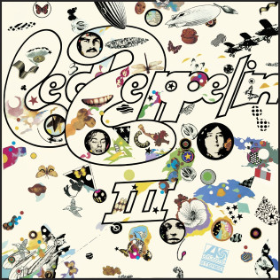

= Радио Аэростат
:toc: left

> link:toc.html[<Contents>]
> link:lyrics.html[<Lyrics>]

++++

++++

== 35.

=== Новые песни июня, 12 июня 2022

<https://aerostatbg.ru/release/889>

[%hardbreaks]
Soft Cell & Pet Shop Boys – Purple Zone
Sun's Signature – Underwater
Fontaines D.C. – Skinty Fia
Stick In The Wheel & Jon1st – Let No Man Steal Your Thyme
Afghan Whigs – The Getaway
Black Keys – For The Love Of Money
Kikagaku Moyo – Monaka
Hovvdy – Ruby
Ziggy Marley, Stephen Marley & Damian Marley feat. Marley Brothers, Ky-Mani Marley & Julian Marley – Cornerstone

++++
 
++++ 

=== Продолжение №25, 22 мая 2022

<https://aerostatbg.ru/release/888>

.Magnetic Fields – '86: How I Failed Ethics
image:Magnetic Fields - 50 Song Memoir/cover.jpg[50 Song Memoir,200,200,role="thumb left"]

.Donovan – Young Girl Blues
image:DONOVAN/1967 - Mellow Yellow (2005, RE, with bonus tracks)/cover.png[Mellow Yellow (2005  RE  with bonus tracks),200,200,role="thumb left"]

.George Harrison – Baby Don't Run Away

.Ink Spots – I'll Never Smile Again
image:Ink Spots - The Very Best/Folder.jpg[The Very Best,200,200,role="thumb left"]

++++
 
++++ 

[%hardbreaks]
Jimmy Page & Robert Plant – Nobody's Fault But Mine
Johann Sebastian Bach – Mass in B minor: Kyrie eleison
Incredible String Band – My Name Is Death
Idle Race – Lucky Man
Аквариум – Агатина песня

++++
 
++++ 

=== Miles – То да Сё, 15 мая 2022

<https://aerostatbg.ru/release/887>

[%hardbreaks]
Miles Davis – Miles Runs The Voodoo Down
Miles Davis – Pharaoh's Dance
Miles Davis – Shhh / Peaceful
Smile – Thin Thing
Mukesh – Mera Joota Hai Japani
Aквариум – Пабло
Bishwa Nepali & Sujata Upadhyaya – Aaye Ma Ta Parera Chitikai / Kavi Devkota

++++
 
++++ 

=== Новые Песни Мая, 8 мая 2022

<https://aerostatbg.ru/release/886>

[%hardbreaks]
Liam Gallagher – Better Days
Michael Stipe & Brian Eno – Future, If Future
Sun's Signature – Golden Air
Sean Paul feat. Damian Marley & Nicky Jam – No Fear
Machine Gun Kelly – 5120
Leyla McCalla – Dodinin
Bryan Ferry – I Just Don't Know What To Do With Myself
Kurt Vile – Fo Sho
Otyken – Storm
Hot Chip, Fay Milton & Brian Eno – Line In The Sand

++++
 
++++ 

=== Белтайн Ом, 1 мая 2022

<https://aerostatbg.ru/release/885>

.Shirley & Dolly Collins – Fare Thee Well My Dearest Dear
image:Shirley & Dolly Collins - Anthems in Eden/folder.jpg[Anthems in Eden,200,200,role="thumb left"]

[%hardbreaks]
Clanadonia – Hamsterheid
Lumiere — The Streets of Derry
Lúnasa – Sinead Maire’s
Ravi Shankar – Hari Om
George Harrison – Singing Om
Rura ft. Julie Fowlis – Dh’èirich Mi Moch Madainn Cheòthar
Dick Gaughan – Lough Erne, First Kiss At Parting
High Kings – Ar Éireann Ní Neosainn Cé Hí

++++
 
++++ 

=== Ответы на Вопросы, 22 апреля 2022

<https://aerostatbg.ru/release/884>

.Bob Dylan - link:BOB%20DYLAN/2020%20-%20Rough%20And%20Rowdy%20Ways/lyrics/rowdy.html#_goodbye_jimmy_reed[Goodbye Jimmy Reed]
image:BOB DYLAN/2020 - Rough And Rowdy Ways/cover.jpg[Rough And Rowdy Ways,200,200,role="thumb left"]

.Beatles – Across The Universe
image:THE BEATLES/1970 - Let It Be/cover.jpg[Let It Be,200,200,role="thumb left"]

.Maddy Prior & Tim Hart – Bring Us In Good Ale
image:STEELEYE SPAN/Tim Hart and Maddy Prior 1971 - Summer Solstice/Folder.jpg[Summer Solstice,200,200,role="thumb left"]

[%hardbreaks]
Хор Свято-Троицкой Сергиевой лавры и Московской духовной академии и семинарии – Ирмосы Пасхального канона
Beach Boys – Then I Kissed Her
Lama Khenno – Light Offering Prayers
Myrkur – Gudernes vilje
Аквариум – Сюрприз
Crazy World Of Arthur Brown – Jungle Fever
Bryan Ferry – When She Walks In The Room

++++
 
++++ 

=== Judy Collins Wildflowers, 17 апреля 2022

<https://aerostatbg.ru/release/883>

.Judy Collins – Michael From Mountains
image:Judy Collins - Wildflowers/folder.jpg[Wildflowers,200,200,role="thumb left"]

[%hardbreaks]
Judy Collins – Someday Soon
Judy Collins – My Father
Judy Collins – A Ballata Of Francesco Landini - Lasso! di donna
Judy Collins – Le chanson de vieux amants
Judy Collins – Sisters Of Mercy
Judy Collins – Farewell To Tarwathie
Judy Collins – When I Was A Girl In Colorado
Judy Collins – Hey That's No Way To Say Goodbye

++++
 
++++ 

=== Новое То да Сё, 10 апреля 2022

<https://aerostatbg.ru/release/882>

.Bob Dylan – A Hard Rain's A-Gonna Fall
image:BOB DYLAN/Bob Dylan 1963 - The Freewheelin' Bob Dylan/cover.jpg[The Freewheelin' Bob Dylan,200,200,role="thumb left"]

.Bob Dylan - link:BOB%20DYLAN/Bob%20Dylan%201963%20-%20Blowing%20In%20The%20Wind/lyrics/blowing.html#_blowin_in_the_wind[Blowin' In The Wind]
image:BOB DYLAN/Bob Dylan 1963 - Blowing In The Wind/cover.jpg[Blowing In The Wind,200,200,role="thumb left"]

[%hardbreaks]
George Ezra – Anyone For You (Tiger Lily)
Mick Jagger – Strange Game
Aldous Harding – Tick Tock
Bauhaus – Drink The New Wine
Oval – Dormant
Paul McCartney & Wings – I'm Carrying
Taj Mahal & Ry Cooder – I Shall Not Be Moved

++++
 
++++ 

=== Новые Песни Апреля, 3 апреля 2022

<https://aerostatbg.ru/release/881>

[%hardbreaks]
Peter Doherty & Frédéric Lo – You Can't Keep It From Me Forever
Jenny Hval – Year Of Love
Gonora Sounds – Go Bhora
John Mayall feat. Marcus King – Can't Take No More
Arthur Brown – Long Long Road
U96 & Wolfgang Flür – Zukunftmusik
Wet Leg – Chaise Longue
Roger Eno – Bells
Jon Spencer & The Hitmakers – Junk Man
Old Crow Medicine Show – Bombs Away

++++
 
++++ 

=== Что такое концерт, 27 марта 2022

<https://aerostatbg.ru/release/880>

.Dead Can Dance – Song Of The Sibyl
image:DEAD CAN DANCE/1990 Aion/cover.jpg[1990 Aion,200,200,role="thumb left"]

.Donovan – Superlungs My Supergirl

.Tom Petty – A Feeling Of Peace

.Thelonious Monk – Ruby, My Dear
image:Thelonius Monk/08-Monks Classic Recordings (1983)/cover.jpg[Monks Classic Recordings (1983),200,200,role="thumb left"]

++++
 
++++ 

[%hardbreaks]
Van Morrison – Golden Autumn Day
Fieri Consort & Chelys Consort of Viols – Turn Thy Face From My Wickedness
Jean-Philippe Rykiel & Lama Gyurme – Hope For Enlightenment
Jeff Lynne – Save Me Now
Евгений Клячкин – Ах, Улыбнись...

++++
 
++++ 

=== То да Сё №22, 20 марта 2022

<https://aerostatbg.ru/release/879>

.Beatles – Think For Yourself
image:THE BEATLES/1965b - Rubber Soul/cover.jpg[Rubber Soul,200,200,role="thumb left"]

.Gene Clark – She's The Kind Of Girl
image:Gene Clark/1973 - Roadmaster/Folder.jpg[Roadmaster,200,200,role="thumb left"]

[%hardbreaks]
Weather Station – Marsh
Jasdeep Singh Degun – Ulterior Motives
Andy Bell – We All Fall Down
Melt Yourself Down – For Real
Pink Floyd – Remember A Day
Placebo – Beautiful James
Aly Bain & Phil Cunningham – Irish Beauty
    
++++
 
++++ 

=== Целительная музыка, 13 марта 2022

<https://aerostatbg.ru/release/878>

.Paul McCartney - link:PAUL%20MCCARTNEY/Paul%20McCartney%20-%20Pipes%20Of%20Peace/lyrics/peace.html#_pipes_of_peace[Pipes Of Peace]

.Christodoulos Halaris – Hymn To The Muse

[%hardbreaks]
Johann Sebastian Bach – Orchestral Suite No. 3 in D major: II. Air
Silly Sisters – The Old Miner
Pomerium – Creator Omnium
Lei Qiang – Moonlight Reflected On The Er-Quan Spring
Native American Music Consort – Native Indians Blessings
Johann Pachelbel – Canon and Gigue in D major

    
++++
 
++++ 

=== Новые Песни Марта, 4 марта 2022

<https://aerostatbg.ru/release/877>

[%hardbreaks]
Stereophonics – Forever
Choir Of Clare College, Cambridge – Heyr, himna smiður
Rokia Koné & Jacknife Lee – Shezita
Animal Collective – Walker
Guided By Voices – Excited Ones
Castalian String Quartet – La nuit froide et sombre
Yungchen Lhamo – Awakening
Cate Le Bon – Remembering Me
Hoodoo Gurus – Carry On
Janis Ian – This Long Night (Dancing With The Dark)
    
++++
 
++++ 

=== Шаманизм, 27 февраля 2022

<https://aerostatbg.ru/release/876>

.Shpongle – Juggling Molecules
image:Shpongle/2013 - Museum Of Consciousness/cover.jpg[Museum Of Consciousness,200,200,role="thumb left"]

.Enya – Afer Ventus
image:ENYA/enya-02-Shepherd Moons 1991/cover.jpg[02-Shepherd Moons 1991,200,200,role="thumb left"]

.David Sylvian – Silver Moon

.Doors – My Wild Love
image:Doors - Waiting For The Sun/Waiting For The Sun.jpg[Waiting For The Sun,200,200,role="thumb left"]
    
++++
 
++++    

[%hardbreaks]
Gabrieli (Taverner Players) – Canzoni et Sonate: Canzon XVII, a 12 Song
David Sylvian – River Man
Grasscut – Halflife
Shooglenifty – Venus In Tweeds
    
++++
 
++++    
    
=== Новые Имена, 20 февраля 2022

<https://aerostatbg.ru/release/875>

[%hardbreaks]
Fanfare Orchestra Of The Castle Guard – III. Presto
Anthony B – Turn Up The Music
Yeule – Electric
Patsy Cline – Crazy
Swell Maps – Read About Seymour
Pauline Scanlon – The Poorest Company
Killers – Read My Mind
Lead Belly – Goodnight Irene
Ben Böhmer & Rob Moose feat. lau.ra – Erase (An Apparition)
Andy Williams – My Happiness
Yard Act – Witness (Can I Get A?)
Jiang Liang – Wa Li Li
Spiritualized – Stop Your Crying
    
++++
 
++++

=== То да Сё №21, 13 февраля 2022

<https://aerostatbg.ru/release/874>

.Jethro Tull – In Brief Visitation

.Brian Eno – Little Apricot

[%hardbreaks]
Fanfare Orchestra Of The Castle Guard – Johannes Eccard: Leggiero II
Red Hot Chili Peppers – Black Summer
Collie Buddz & Bounty Killer – Twisted Agenda
System Of A Down – Hypnotize
Robin Laing – Black Art
Martin Bozmarov – Le printemps
Аквариум – Дом всех святых
Black-Am-I feat. Kabaka Pyramid – Jah In My Corner

++++
 
++++

=== Новые Песни Февраля, 6 февраля 2022

<https://aerostatbg.ru/release/873>

[%hardbreaks]
Big Thief – Change
Franz Ferdinand – This Fffire
Del Amitri – This City Loves You Back
Smile – The Smoke
Joel Lyssarides – Down And Out
Midlake – Bethel Woods
Hurray For The Riff Raff – Jupiter's Dance
Tangerine Dream – You're Always On Time
Buzzard Buzzard Buzzard – Break Right In
    
++++
 
++++

=== Имболк: Романтизм, 30 января 2022

<https://aerostatbg.ru/release/872>

.Imagined Village – The Lark In The Morning

[%hardbreaks]
Dàimh – Òran Bhàgh a' Chàise
5 Hand Reel – When A Man's In Love
Hom Bru – Rowin Foula Doon
Zehetmair Quartett – Schumann: String Quartet No.1 in A minor, Op.41 No.1 - 2. Scherzo (Presto) - Intermezzo
Frédéric Chopin – Prelude No. 4 in E minor, Op. 28
Chieftains – Mná na h-Éireann
Goitse – Siobháinín Seó
Lumiere feat. Sinéad O' Connor – Who Knows Where The Time Goes

++++
 
++++

=== Кто Есть Кто? 23 января 2022

<https://aerostatbg.ru/release/871>

[%hardbreaks]
Abafana Baka Mahawukela – Inhliziyo Yami
Daniel Pemberton & Gareth Williams – The Politics & The Life
The Meters – Hey Pocky A-Way
Tom Dissevelt & Kid Baltan – Moon Maid
The Gun Club – The Breaking Hands
Electric Prunes – Kyrie Eleison
Weeed – Something About Having Your Feet In The River
U-Roy – Truthful Dub
Parquet Courts – Stoned And Starving
Adelaide Hall – Transatlantic Lullaby
    
++++
 
++++

=== То и Сё №20, 16 января 2022

<https://aerostatbg.ru/release/870>

.Leonard Cohen – Amen
image:LEONARD COHEN/Leonard Cohen 2012 - Old Ideas/Old ideas Cover.jpg[Old Ideas,200,200,role="thumb left"]

.Del Amitri – When You Were Young 
image:Del Amitri/Hatful of Rain - The Best of Del Amitri/cover.jpg[The Best of Del Amitri,200,200,role="thumb left"]

.Bob Dylan - link:BOB%20DYLAN/2020%20-%20Rough%20And%20Rowdy%20Ways/lyrics/rowdy.html#_i_ve_made_up_my_mind_to_give_myself_to_you[I've Made Up My Mind To Give Myself To You]
image:BOB DYLAN/2020 - Rough And Rowdy Ways/cover.jpg[Rough And Rowdy Ways,200,200,role="thumb left"]

.Robert Fripp – Music For Quiet Moments 27 – Pastorale
image:KING CRIMSON/Robert Fripp - Music For Quiet Moments Vol. 1-52/cover.jpg[Music For Quiet Moments Vol. 1-52,200,200,role="thumb left"]

++++
 
++++

[%hardbreaks]
Joni Mitchell – Hunter (Blue Sessions)
Maria Pomianowska & Zespół Polski & Roozbeh Asadian – Lament (Wielkopostna)
Robert Harrison – Sitting In The Sun

++++
 
++++

=== Новые Песни Января, 9 января 2022

<https://aerostatbg.ru/release/869>

.Christy Moore – Johnny Boy

.Michael Stipe – Sunday Morning
image:Velvet Undeground/VA - I’ll Be Your Mirror/cover.jpg[I’ll Be Your Mirror,200,200,role="thumb left"]

[%hardbreaks]
Boo Radleys – Full Syringe And Memories Of You
Hiss Golden Messenger – By The Light Of St. Stephen
Yendry feat. Damian Marley – You
Neil Young & Crazy Horse – Song Of The Seasons
Aksak Maboul – Sophie La Bévue (Cate Le Bon Interpretation)
Emily Scott Robinson – Old Gods
Black Flower – Magma

++++
 
++++

=== Новогодние притчи, 2 января 2022

<https://aerostatbg.ru/release/868>

.Lisa Gerrard – Too Far Gone
image:DEAD CAN DANCE/2014 - Twilight Kingdom/Front.jpg[Twilight Kingdom,200,200,role="thumb left"]

.Christy Moore – Greenland

.Leonard Cohen - link:LEONARD%20COHEN/Leonard%20Cohen%202012%20-%20Old%20Ideas/lyrics/old.html#_lullaby[Lullaby]
image:LEONARD COHEN/Leonard Cohen 2012 - Old Ideas/Old ideas Cover.jpg[Old Ideas,200,200,role="thumb left"]

.Richard Thompson & Danny Thompson – Lotteryland
image:RICHARD THOMPSON/1968_2009 - Walking on a Wire/cover.png[Walking on a Wire,200,200,role="thumb left"]

++++
 
++++

[%hardbreaks]
Louis Armstrong – All Of Me
Jack Bruce – Folk Song
Lonnie Johnson – Blue Ghost Blues
Andy M. Stewart – The Echo Mocks The Corncake
Archie Fisher – Bogie's Bonny Belle
Jacco Gardner – Lullaby
Fanfare Orchestra Of The Castle Guard – Michael Praetorius: Moderato
    
++++
 
++++

=== Предновогодняя, 26 декабря 2021

<https://aerostatbg.ru/release/867>

.New Vaudeville Band – If I Had A Talking Picture Of You
image:New Vaudeville Band - 1967 - Winchester Cathedral/cover.jpg[1967 - Winchester Cathedral,200,200,role="thumb left"]

.Bob Dylan - link:BOB%20DYLAN/2020%20-%20Rough%20And%20Rowdy%20Ways/lyrics/rowdy.html#_mother_of_muses[Mother Of Muses]
image:BOB DYLAN/2020 - Rough And Rowdy Ways/cover.jpg[Rough And Rowdy Ways,200,200,role="thumb left"]

.Leon Redbone – Winter Wonderland

[%hardbreaks]
Ed Sheeran & Elton John – Merry Christmas
Empire Brass Quintet & William Kuhlman – Trumpet Voluntary
Elvis Presley – That's All Right
Sonny Rollins – Don't Stop The Carnival
Monkees – Tomorrow's Gonna Be Another Day
Аквариум – Вино из песка
Albion Christmas Band – God Bless The Master
Bing Crosby – White Christmas

++++
 
++++

=== Роберт Плант и Элисон Краусс, 19 декабря 2021

<https://aerostatbg.ru/release/866>

.Robert Plant & Alison Krauss - link:ROBERT%20PLANT/Robert%20Plant%20&%20Alison%20Krauss%20-%202021%20-%20Raise%20The%20Roof%20(Deluxe%20Edition)%20(24bit-96kHz)/lyrics/roof.html#_quattro_world_drifts_in[Quattro (World Drifts In)]
image:ROBERT PLANT/Robert Plant & Alison Krauss - 2021 - Raise The Roof (Deluxe Edition) (24bit-96kHz)/Cover.jpg[2021 - Raise The Roof (Deluxe Edition) (24bit-96kHz),200,200,role="thumb left"]

[%hardbreaks]
Robert Plant & Alison Krauss - link:ROBERT%20PLANT/Robert%20Plant%20&%20Alison%20Krauss%20-%202021%20-%20Raise%20The%20Roof%20(Deluxe%20Edition)%20(24bit-96kHz)/lyrics/roof.html#_somebody_was_watching_over_me[Somebody Was Watching Over Me]
Robert Plant & Alison Krauss - link:ROBERT%20PLANT/Robert%20Plant%20&%20Alison%20Krauss%20-%202021%20-%20Raise%20The%20Roof%20(Deluxe%20Edition)%20(24bit-96kHz)/lyrics/roof.html#_searching_for_my_love[Searching For My Love]
Robert Plant & Alison Krauss - link:ROBERT%20PLANT/Robert%20Plant%20&%20Alison%20Krauss%20-%202021%20-%20Raise%20The%20Roof%20(Deluxe%20Edition)%20(24bit-96kHz)/lyrics/roof.html#_go_your_way[Go Your Way]
Robert Plant & Alison Krauss - link:ROBERT%20PLANT/Robert%20Plant%20&%20Alison%20Krauss%20-%202021%20-%20Raise%20The%20Roof%20(Deluxe%20Edition)%20(24bit-96kHz)/lyrics/roof.html#_you_led_me_to_the_wrong[You Led Me To The Wrong]
Robert Plant & Alison Krauss - link:ROBERT%20PLANT/Robert%20Plant%20&%20Alison%20Krauss%20-%202021%20-%20Raise%20The%20Roof%20(Deluxe%20Edition)%20(24bit-96kHz)/lyrics/roof.html#_high_and_lonesome[High And Lonesome]
Robert Plant & Alison Krauss - link:ROBERT%20PLANT/Robert%20Plant%20&%20Alison%20Krauss%20-%202021%20-%20Raise%20The%20Roof%20(Deluxe%20Edition)%20(24bit-96kHz)/lyrics/roof.html#_you_cant_rule_me[You Can't Rule Me]
Robert Plant & Alison Krauss - link:ROBERT%20PLANT/Robert%20Plant%20&%20Alison%20Krauss%20-%202021%20-%20Raise%20The%20Roof%20(Deluxe%20Edition)%20(24bit-96kHz)/lyrics/roof.html#_my_heart_would_know[My Heart Would Know]

++++
 
++++

=== 8 Наблюдений, 12 декабря 2021

<https://aerostatbg.ru/release/865>

.Doors – Crawling King Snake
image:Doors - LA Woman/front.png[LA Woman,200,200,role="thumb left"]

.Beatles – Julia
image:THE BEATLES/The Beatles - White Album CD 1/cover.jpg[White Album CD 1,200,200,role="thumb left"]

.George Harrison – Wake Up My Love

.Simon & Garfunkel - link:SIMON%20&%20GARFUNKEL/Simon%20&%20Garfunkel%20-%20Parsley,%20Sage,%20Rosemary%20and%20Thyme/lyrics/parsley.html#_the_59th_street_bridge_song_feelin_groovy[The 59th Street Bridge (Feelin' Groovy)]
image:SIMON & GARFUNKEL/Simon & Garfunkel - Parsley, Sage, Rosemary and Thyme/cover.jpg[Parsley  Sage  Rosemary and Thyme,200,200,role="thumb left"]

++++
 
++++

.Elliott Smith – Easy Way Out
image:ELLIOTT SMITH/Elliott Smith 2000 - Figure 8/Folder.jpg[Figure 8,200,200,role="thumb left"]

[%hardbreaks]
Donovan – Legend Of A Young Girl Child Linda
Primal Scream – Country Girl
Nobukazu Takemura – Lost Treasure (4th Version)
Michael Chapman – Naked Ladies And Electric Ragtime
Moody Blues – Are You Sitting Comfortable?

++++
 
++++

=== New December Songs, 5 декабря 2021

<https://aerostatbg.ru/release/864>

.Jonsi – Obsidian

.Taylor Swift feat. Phoebe Bridgers – Nothing New

[%hardbreaks]
Deerhoof – Be Unbarred, O Ye Gates Of Hell
Jethro Tull – Shoshana Sleeping
Monoswezi – Hwiri Hwiri Hwiri
Spiers & Boden – Bluey Brink
Houeida Hedfi feat. Planningtorock – Namami Gange
Arca – Lost Woman Found
Brian Eno & Roger Eno – Wanting To Belie (Oh Holy Night)

++++
 
++++
        
=== Birthday Songs, 28 ноября 2021

<https://aerostatbg.ru/release/863>

.Silly Wizard – Wi' My Dog And Gun
image:SILLY WIZARD/Silly Wizard - So Many Partings/cover.jpg[So Many Partings,200,200,role="thumb left"]

.Joni Mitchell – California
image:JONI MITCHELL/1971 - Blue/Folder.jpg[Blue,200,200,role="thumb left"]

.Brian Eno – By This River
image:BRIAN ENO/Brian Eno - Before & After Science/cover.jpg[Before & After Science,200,200,role="thumb left"]

.Led Zeppelin – Since I've Been Loving You

++++
 
++++

.Beatles – I'll Be Back
image:THE BEATLES/1964a - A Hard Days Night/cover.jpg[A Hard Days Night,200,200,role="thumb left"]

.T-Rex – Rock On

[%hardbreaks]
Donovan – Grace
Peter Gabriel – Indigo
Johann Sebastian Bach – French Suite No. 5 in G major: II. Courante
Family – My Friend The Sun

++++
 
++++
