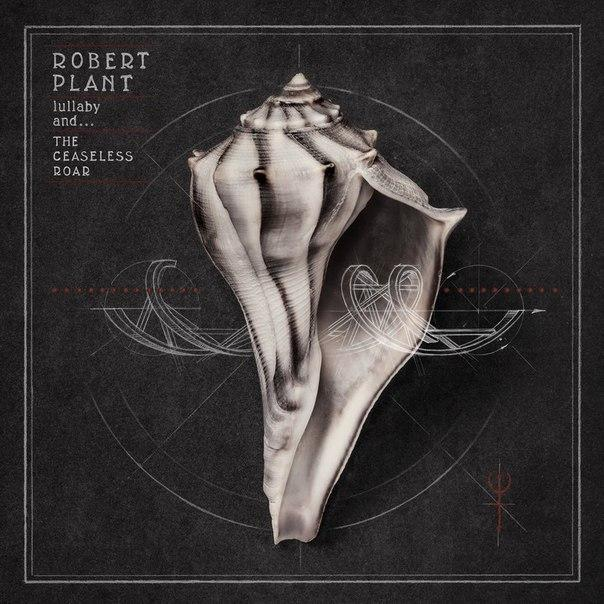
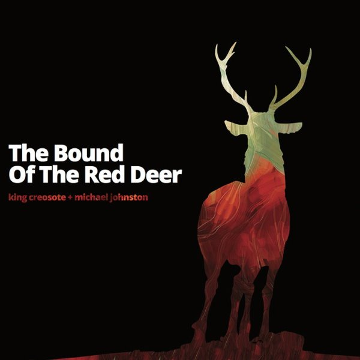
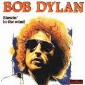
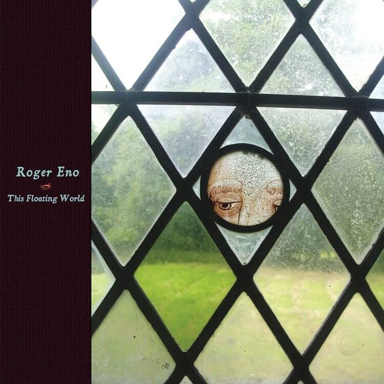

= Радио Аэростат
:toc: left

> link:toc.html[<Contents>]
> link:lyrics.html[<Lyrics>]

++++

++++

== 34.

=== О питье, 24 октября 2021

<https://aerostatbg.ru/release/858>

[%hardbreaks]
Robert Harrison – Watching The Kid Come Back
Archie Fisher – O Charlie, O Charlie
Bud Flanagan & Chesney Allan – Dreaming
Andy M. Stewart & Manus Lunny – The Humours Of Whiskey
Franz Benda – Flute Sonata in E minor: III. Presto
Grateful Dead – Dire Wolf
Theodore Bikel – Что мне горе?
Rolling Stones – Troubles A' Comin
Atoms For Peace – Ingenue
Gryphon – Dumbe Dum Chit
    
++++
 
++++

=== Всякая Новая Музыка, 17 октября 2021

<https://aerostatbg.ru/release/857>

[%hardbreaks]
Black Dice – Bad Bet
Little Simz feat. Obongjayar – Point And Kill
Lord Huron & Allison Ponthier – I Lied
Liars – From What The Never Was
Alt-J – U & Me
Sam Gendel – Alto Voices
Glass Animals – Heat Waves
Speedway – S.O.F.
Hovvdy – Around Again
Robert Plant & Alison Krauss – High And Lonesome

++++
 
++++

=== То да Сё № 19, 10 октября 2021

<https://aerostatbg.ru/release/856>

.Del Amitri – Mockingbird, Copy Me Now
image:Del Amitri/2021 - Fatal Mistakes/Front.jpg[Fatal Mistakes,200,200,role="thumb left"]

.Beatles – Blue Jay Way
image:THE BEATLES/1967b - Magical Mystery Tour/cover.jpg[Magical Mystery Tour,200,200,role="thumb left"]

.George Harrison – Dream Away
image:GEORGE HARRISON/George Harrison - Gone Troppo/cover.jpg[Gone Troppo,200,200,role="thumb left"]

.Gene Clark – Fair And Tender Ladies
image:Gene Clark - So Rebellious A Lover/cover.jpg[So Rebellious A Lover,200,200,role="thumb left"]

++++
 
++++

[%hardbreaks]
Chas & Dave – Where Am I Gonna Find Ya?
Merrymakers – I'm In... Love!
Brain Damage & Big Youth – Good To Talk
Animal Collective – My Girls
Pomerium – Missa Hercules dux Ferrariae: IV. Sanctus

++++
 
++++

=== Новые песни октября, 3 октября 2021

<https://aerostatbg.ru/release/855>

[%hardbreaks]
Ed Sheeran – Shivers
Eels – Good Night On Earth
Richard Thompson – Tinker's Rhapsody
Low – All Night
Radiohead – If You Say The Word
Rolling Stones – Living In The Heart Of Love
Sting – If It's Love
Yes – The Ice Bridge
Rod Stewart – One More Time

++++
 
++++

=== Шакти, 26 сентября 2021

<https://aerostatbg.ru/release/854>

.Leonard Cohen - link:LEONARD%20COHEN/2014%20-%20Popular%20Problems/lyrics/popular.html#_born_in_chains[Born In Chains]
image:LEONARD COHEN/2014 - Popular Problems/cover.jpg[Popular Problems,200,200,role="thumb left"]

.Robert Plant – House Of Love

.Krishna Das – The Goddess Suite: Mother Song

[%hardbreaks]
Byrds – Have You Seen Her Face
Anne Briggs – The Recruited Collier
Melanie – Peace Will Come (According To Plan)
Sinéad O'Connor – 'Til I Whisper U Someting
Robert Palmer – You're My Thrill
Cocteau Twins – Primitive Heart

++++
 
++++

=== Новые Имена, 19 сентября 2021

<https://aerostatbg.ru/release/853>

[%hardbreaks]
Dead South – In Hell I'll Be In Good Company
Franz Ignaz Danzi – Quintet For Wind Instruments No. 2 in B-flat major, Op. 56: II. Andante con moto
Mega Bog – Flower
Chris Barber & Sweet Papa Lowdown – Apex Blues
Ustad Nishat Khan & Ensemble Gilles Binchois – Alleluia - Pascha nostrum
Jxdn – One Minute
Grid & Robert Fripp – Sympatico
Charlie Parr – Anaconda
Mother Mother – Forgotten Souls

++++
 
++++

=== То Да Сё - Дань, 12 сентября 2021

<https://aerostatbg.ru/release/852>

[%hardbreaks]
Broadside Band & Jeremy Barlow – The Dancing Master: Maiden Lane
Van Morrison – Let's Get Lost
ZZ Top – Sharp Dressed Man
Rolling Stones – You Got Me Rocking
Everly Brothers – That's Just Too Much
Зоопарк – Вперёд, Бодхисаттва!
Lee Scratch Perry – Rastafari On Wall Street
Звуки Му – Ганс мой ёж
Mikis Theodorakis – Ena to helidoni
Rakesh Chaurasia, Sunil Das, Ulhas Bapat, Zarin Daruwala, Akhlak Hussain, Bhavani Shankar, Ashit Desai – Odhhaji Mara Vaalane
   
++++
 
++++
    
=== Новые Песни Сентября, 5 сентября 2021

<https://aerostatbg.ru/release/851>

[%hardbreaks]
Fanfárový orchestr Hradní stráže – Johann Christoph Pezel: Intrada II
Robert Plant & Alison Krauss – Can't Let Go
Specials – Everybody Knows
Gorillaz feat. AJ Tracey – Jimmy Jimmy
Jimmy Cliff – Human Touch
Big Red Machine feat Taylor Swift – Renegade
Сплин – Я был влюблён в Вас
Bug feat. Irah – Demon
Nathan Salsburg – Psalm 147
Nick Brodeur & Ky-Mani Marley – She's So Crazy

++++
 
++++

=== Философы, 29 августа 2021

<https://aerostatbg.ru/release/850>

.King Creosote & Michael Johnston – Will You Wait For Me?

.Paul McCartney – Rainclouds

.Robert Plant – Rainbow
image:ROBERT PLANT/2020 - Digging Deep Subterranea/cover.jpg[Digging Deep Subterranea,200,200,role="thumb left"]

.Bob Dylan – Every Grain Of Sand

++++
 
++++

[%hardbreaks]
Baltimore Consort – Nuttmigs And Ginger
Sri Chinmoy – Jedike Phirai
Hollies – King Midas In Reverse
Mills Brothers – Ain't Misbehavin'
Midlake – We Gathered In Spring
Pomerium – Timor et tremor

++++
 
++++

=== Дети, 22 августа 2021

<https://aerostatbg.ru/release/849>

.Norah Jones – A Song With No Name

[%hardbreaks]
Inhaler – It Won't Always Be Like This
Harper Simon – Berkeley Girl
Damian Marley – R.O.A.R.
Claypool Lennon Delirium – Blood And Rockets
James McCartney – Butterfly
Adam Cohen – We Go Home
Jakob Dylan – Something Good This Way Comes
Ky-Mani Marley – All The Way
        
++++
 
++++

=== Flyte, 15 августа 2021

<https://aerostatbg.ru/release/848>

.Flyte – Losing You
image:Flyte/2021 - This Is Really Going To Hurt/cover.jpg[This Is Really Going To Hurt,200,200,role="thumb left"]

[%hardbreaks]
Flyte – Easy Tiger
Flyte – Never Get To Heaven
Flyte – Mistress America
Flyte – Love Is An Accident
Flyte – Spiral
Flyte – Trying To Break Your Heart
Flyte – I've Got A Girl
Flyte – Everyone's A Winner
Flyte – Under The Skin
Flyte – Little White Lies
    
++++
 
++++

=== Новые песни августа, 8 августа 2021

<https://aerostatbg.ru/release/847>

.Black Keys – Louise
image:Black Keys - Delta Kream/cover.png[Delta Kream,200,200,role="thumb left"]

[%hardbreaks]
Sufjan Stevens & Angelo De Augustine – Reach Out
Weezer – All My Favourite Songs
Villagers – So Simpatico
Ed Sheeran – Bad Habits
Kings Of Convenience – Comb My Hair
Los Lobos – Love Special Delivery
Robert Harrison – Stella Not Too Late
Brian Setzer – Checkered Flag
Rodrigo Amarante – I Can't Wait
    
++++
 
++++

=== Lugh’s Day 2021, 1 августа 2021

<https://aerostatbg.ru/release/846>

.Owl Service – Geordie
image:The Owl Service - His Pride No Spear No Friend/cover.jpg[His Pride No Spear No Friend,200,200,role="thumb left"]

[%hardbreaks]
John Spillane – We Come In The Wind
John Francis Flynn – My Son Tim
Findlay Napier & Gillian Frame feat. Mike Vass – Bonnie George Campbell
Shirley Collins – My Sailor Boy
Peat & Diesel – Brandy In The Airidh
Calum Martin – Raised
Whileaways – Julia
Tim Edey – Rare Old Mountain Set
Ringlefinch – The Prince Of Poyais
Iain Maciver – Portnaguran By The Sea

++++
 
++++

=== Событие Чёрный Лебедь, 25 июля 2021

<https://aerostatbg.ru/release/845>

.Pugwash – Anyone Who Asks
image:PUGWASH/2014 - A Rose in a Garden of Weeds/cover.jpg[A Rose in a Garden of Weeds,200,200,role="thumb left"]

.Bob Dylan - link:BOB%20DYLAN/Bob%20Dylan%201963%20-%20Blowing%20In%20The%20Wind/lyrics/blowing.html#_blowin_in_the_wind[Blowing In The Wind]

.Beatles - link:THE%20BEATLES/1966%20-%20Revolver/lyrics/revolver.html#_she_said_she_said[She Said, She Said]
image:THE BEATLES/1966 - Revolver/cover.jpg[Revolver,200,200,role="thumb left"]

[%hardbreaks]
Tally Hall – Hidden In The Sand
Dobet Gnahoré – Telo de
Tally Hall – Ruler Of Everything
Kraftwerk – It's More Fun To Compute
Rolling Stones – Ride On Baby
Irish Rovers – No Nay Never
Ustad Nishat Khan & Ensemble Gilles Binchois – Introit - Statuit ei Dominus
Byrds – My Back Pages
    
++++
 
++++

=== Дживан Гаспарян, 18 июля 2021

<https://aerostatbg.ru/release/844>

.Дживан Гаспарян – Menag Jamport Em
image:Djivan Gasparian/1999 - Heavenly Duduk/folder.jpg[Heavenly Duduk,200,200,role="thumb left"]

[%hardbreaks]
Дживан Гаспарян – Lovely Spring
Дживан Гаспарян – Pepo’s Song
Дживан Гаспарян – Fallen Star
Дживан Гаспарян – Your Strong Mind
Дживан Гаспарян – Mair Araks
Аквариум – Северный Цвет
Дживан Гаспарян – Eshkhemed

++++
 
++++

=== New July songs, 11 июля 2021

<https://aerostatbg.ru/release/843>

.Crowded House – Goodnight Everyone
image:CROWDED HOUSE/2021 - Dreamers Are Waiting/cover.png[Dreamers Are Waiting,200,200,role="thumb left"]

.King Gizzard & The Lizard Wizard – Shanghai

.Easy Life – Ocean View

[%hardbreaks]
UB40 feat. Inner Circle – Rebel Love
Duran Duran – Invisible
Arooj Aftab – Inayaat
Roger Chapman – Dark Side Of The Stairs
John Grant – Billy
Tom Petty & The Heartbreakers – One Of Life's Little Mysteries

++++
 
++++

=== Ed Sheeran, 4 июля 2021

<https://aerostatbg.ru/release/842>

[%hardbreaks]
Ed Sheeran – Nancy Mulligan
Ed Sheeran – Shape Of You
Ed Sheeran – The A Team
Ed Sheeran – I See Fire
Ed Sheeran – Sing
Ed Sheeran feat. Stormzy – Take Me Back To London
Ed Sheeran – Galway Girl
Ed Sheeran – I Don't Care
Ed Sheeran feat. Paulo Londra & Dave – Nothing On You
Ed Sheeran – Perfect

++++
 
++++

=== Имена, 27 июня 2021

<https://aerostatbg.ru/release/841>

[%hardbreaks]
Eric Hutchinson – Talk Is Cheap
Blue Oyster Cult – (Don't Fear) The Reaper
Maberrant – Zamaas Hold
Char Chris & Penelope Scott – Brittle, Baby!
Redskins – Hold On
Foy Vance – Time Stand Still
His Name Is Alive – Lord, Make Me A Channel Of Your Peace
Robbie Basho – The Hajj (instrumental)
Witch Camp (Ghana) – Love
The Edgar Broughton Band – Granma
Eric Hutchinson – Best Days

++++
 
++++

=== Суфи 2 Суфи, 20 июня 2021

<https://aerostatbg.ru/release/840>

[%hardbreaks]
Sufi Music Ensemble – Fly Away
Sufi – Uyan
Nobukazu Takemura – Tiddler
John French, Fred Frith, Henry Kaiser, Richard Thompson – Bird In God's Garden / Lost And Found
Sufi Music Ensemble – Santoor Taksim
Serkan Mesut Halili – Çeng-i Harbi
Bon Iver – Salem
Norayr Kartashyan – Goghtan
Yusuf Islam – Heaven / Where True Love Goes
Nusrat Fateh Ali Khan – Nothing Without You
    
++++
 
++++

=== С Легким Сердцем (То Да Сё №16), 13 июня 2021

<https://aerostatbg.ru/release/839>

.Del Amitri – All Hail Blind Love
image:Del Amitri/2021 - Fatal Mistakes/Front.jpg[Fatal Mistakes,200,200,role="thumb left"]

.Tom Waits – Ruby's Arms
image:TOM WAITS/Tom Waits 1980 - Heartattack And Vine/cover.jpg[Heartattack And Vine,200,200,role="thumb left"]

[%hardbreaks]
Chas & Dave – The Sideboard Song
Ashley Hutchings – Cotswold Tune
Krishna Das – Sri Bajrang Baan
Roger Eno – Riddle
Frank Ifield – She Taught Me How To Yodel
Liz Phair – Spanish Doors
Beach Boys – Big Sur
Eden Kane – We Could Have Had It All

    
++++
 
++++

=== Новые Песни Июня, 6 июня 2021

<https://aerostatbg.ru/release/838>

[%hardbreaks]
Lucy Dacus – Hot And Heavy
Billy F. Gibbons – My Lucky Card
Micky Dolenz – Carlisle Wheeling
Comorian – The Devil Doesn't Eat Papaya, He Eats Fire
Garbage – No Gods No Masters
Francis Lung – Lonesome No More
Tequilajazzz – Никого не останется
Pet Shop Boys – Cricket Wife
James – Beautiful Beaches
    
++++
 
++++

=== Дуэндэ. Чёрные Ноты, 30 мая 2021

<https://aerostatbg.ru/release/837>

.Leonard Cohen – Darkness
image:LEONARD COHEN/Leonard Cohen 2012 - Old Ideas/Old ideas Cover.jpg[Old Ideas,200,200,role="thumb left"]

.Richard Thompson – Walking On A Wire

.Jethro Tull – Silver River Turning

[%hardbreaks]
Olivier Messiaen – Les Corps Glorieux: 6. Joie et clarté des Corps Glorieux
El Lebrijano – Que Hermoso Pelo Tiene
Rié Yanagisawa & Clive Bell – Esashi Oiwake
Free – Rain (Alternative Version)
Johnny Cash – I'm Free From The Chain Gang Now
    
++++
 
++++

=== Воспоминания, 23 мая 2021

<https://aerostatbg.ru/release/836>

.Fairport Convention – Percy's Song
image:FAIRPORT CONVENTION/Fairport Convention-Unhalfbricking-1969/folder.jpg[Unhalfbricking-1969,200,200,role="thumb left"]

.Richard Thompson – When The Spell Is Broken

.Roger Eno – The Last Days Of May

[%hardbreaks]
Cyril Tawney – Chase The Buffalo
Archangelo Corelli – Concerto Grosso in F major, Op. 6 No. 12: I. Preludio: Adagio
Who – Cobwebs & Strange
Mdou Moctar – Tarhatazed
Al Stewart – Lover Man
Joe Brown – I Like Bananas

> link:toc.html[<Contents>]
> link:lyrics.html[<Lyrics>]
