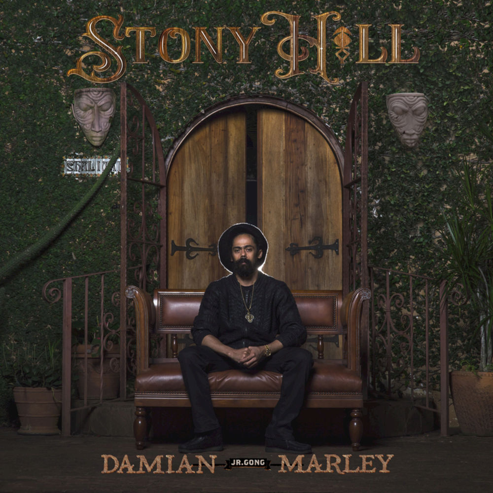

= Радио Аэростат
:toc: left

> link:aerostat.html[<Home>]
> link:toc.html[<Contents>]
> link:lyrics.html[<Lyrics>]

++++

++++

                                                                          
== 39.

=== Австралия, 26 мая 2024
<https://aerostatbg.ru/release/990>

[%hardbreaks]
Lucksmiths – Synchronised Sinking
King Gizzard & The Lizard Wizard – Nuclear Fusion
Lazy Harry – Wild Colonial Boy
Easybeats – Friday On My Mind
AC/DC – Back In Black
Midnight Oil – Beds Are Burning
Men At Work – Who Can It Be Now?
Nick Cave & The Bad Seeds – Girl In Amber
Rolf Harris – Tie Me Kangaroo Down, Sport
Lucksmiths – The Great Dividing Range

++++
 
++++

=== Новые Имена, 19 мая 2024
<https://aerostatbg.ru/release/989>

[%hardbreaks]
Knack – My Sharona
Asa Tone – Perpetual Motion Via Jungle Transport
T Bone Burnett feat. Steven Soles – Hawaiian Blue Songs
Slowdive – Slomo
Louise Ferrenc – Quintet for Piano and Winds, Op. 8: III. Scherzo
Maya Ongaku – Something In Morning Rain
Avett Brothers – Live And Die
Stephen Marley feat. Ziggy Marley – There's A Reward
Séamus Ennis – A Little Bench Of Rushes

++++
 
++++

=== Боги и Тату, 12 мая 2024
<https://aerostatbg.ru/release/988>

.King Creosote – I Des
image:King Creosote/2023 - I DES/cover.jpg[I DES,200,200,role="thumb left"]

.Beck – Turn Away

[%hardbreaks]
King Creosote – Love Is A Curse
БГ+ – Не убивает
Talking Heads – This Must Be the Place (Naïve Melody)
Steve Jansen – Ballad Of A Deadman
Sufjan Stevens – Futile Devices
Who – Tattoo
Stella Jang – Walking Down The Road
Lei Qiang – Crescent Moon Before Dawn
King Creosote – Walter de la Nightmare

++++
 
++++

=== Новые песни мая. Пасха, 5 мая 2024
<https://aerostatbg.ru/release/987>

.Bonnie 'Prince' Billy – Like It Or Not
image:Bonnie Prince Billy/2023 Keeping Secrets Will Destroy You/cover.jpg[2023 Keeping Secrets Will Destroy You,200,200,role="thumb left"]

[%hardbreaks]
David Gilmour – The Piper's Call
Brad Mehldau – Between Bach
Thom Yorke – Knife Edge
Johnny Cash – Well Alright
Brian Eno feat. Leo Abrahams, Jon Hopkins – Emerald And Lime
UB40 – Home
Yard Act – The Undertow
George Harrison – Blow Away

++++
 
++++

=== Beltain Красота, 28 апреля 2024
<https://aerostatbg.ru/release/986>

.Planxty – 'P' Stands For Paddy, I Suppose
image:PLANXTY/Planxty 1974 - Cold Blow and the Rainy Night/cover.jpg[Cold Blow and the Rainy Night,200,200,role="thumb left"]

[%hardbreaks]
Chieftains – An Dhruimfhionn Donn Dílis (Slow Air)
Tannas – Sabhal Ia'n 'ic Uisdean
Old Blind Dogs – Johnny O' Braidislee
Guidewires, Pádraig Rynne, Tóla Custy, Sylvain Barou, Karol Lynch & Paul McSherry (feat. Mike Shimmin) – Caoimhín
Silly Sisters – How Shall I Your True Love Know?
Silly Wizard – Tha Mi Sgith (Strathspey) / Eck Stewart's March / MacKenzie's Fancy (Marches)
Dick Gaughan – The Recruited Collier
Anna Mhoireach – Tìr nan Òg
High Level Ranters – Fortune Turns The Wheel

++++
 
++++

=== То да Сё №35, 21 апреля 2024
<https://aerostatbg.ru/release/985>

.Jimmy Page & Robert Plant - link:ROBERT%20PLANT/Robert%20Plant%20-%20Sixty%20Six%20To%20Timbuktu%20(Disc%201)/lyrics/timbuktu.html#_rude_world[Rude World]
image:ROBERT PLANT/Robert Plant - Sixty Six To Timbuktu (Disc 1)/cover.jpg[Sixty Six To Timbuktu (Disc 1),200,200,role="thumb left"]

.Cat Stevens – Angelsea
image:CAT STEVENS/Catch Bull At Four/front.jpg[Catch Bull At Four,200,200,role="thumb left"]

.Beatles – Keep Your Hands Off My Baby

[%hardbreaks]
Buddy Greco – The Lady Is A Tramp
James McCartney – Primrose Hill
Kraftwerk – The Hall of Mirrors
Jimmy Page & Robert Plant – Most High
Antonio Cece, Ludovica Bastianini & Nico Sommese – Seikilos Epitaph
Paul McCartney – Yvonne's The One

++++
 
++++

=== Новые Имена, 14 апреля 2024
<https://aerostatbg.ru/release/984>

[%hardbreaks]
Pietro Mascagni – Cavalleria Rusticana: Intermezzo
Noga Erez feat. Reo Cragun & Rousso – Views
Ruhollâh Khâleqi feat. Gholâm-Hoseyn Banân – Shab-e Javâni
Limp Bizkit – My Way
High Level Ranters – Fortune Turns The Wheel
Marie Laforêt – Mon amour, mon ami
Bothy Band – Fionnghuala
Erroll Garner – Misty
Fungus – Farewell To Tarwathie
António Carreira – Canção a quatro glosada
Bothy Band – Calum Sgaire

++++
 
++++

=== Новые Песни Апреля, 7 апреля 2024
<https://aerostatbg.ru/release/983>

[%hardbreaks]
Black Keys – Beautiful People (Stay High)
Waxahatchee – 365
Pearl Jam – Dark Matter
Katherine Priddy – Selah
MC5 – Kick Out The Jams
Blitzen Trapper – Hello Hallelujah
Shabaka Hutchings – End Of Innocence
Sahra Halgan – Laga
Chris Brain – Now Westlin Winds
Cast – Faraway

++++
 
++++

=== То да Сё №34, 31 марта 2024
<https://aerostatbg.ru/release/982>

.Theo Travis & Robert Fripp – The Power To Believe / Pastorale
image:KING CRIMSON/2008 - Theo Travis and Robert Fripp - Thread/folder.jpg[Theo Travis and Robert Fripp - Thread,200,200,role="thumb left"]

.Johann Sebastian Bach – Orchestral Suite No. 3 in D major: I. Overture
image:BACH/BWV 1066~1069, 1060, 1043 - Orchestral Suites/cover.jpg[Orchestral Suites,200,200,role="thumb left"]

[%hardbreaks]
World Party – Is It Like Today?
Melanie – The Good Guys
Can – Sing Swan Song
Paul McCartney & Wings – Mama's Little Girl
БГ+ – На берегу пруда

++++
 
++++

=== Свадьба Культур, 24 марта 2024
<https://aerostatbg.ru/release/981>

.Jimmy Page & Robert Plant – Friends
image:LED ZEPPELIN/Led Zeppelin - III/III.jpg[III,200,200,role="thumb left"]

.Beatles – Within You Without You
image:THE BEATLES/1967a - Sgt Peppers Lonely Hearts Club Band/cover.jpg[Sgt Peppers Lonely Hearts Club Band,200,200,role="thumb left"]

.Astrud Gilberto – The Girl From Ipanema

.Paul Simon – Diamonds On The Soles Of Her Shoes

++++
 
++++

.Beatles – The Inner Light
image:THE BEATLES/1988 - Past Masters/cover.jpg[Past Masters,200,200,role="thumb left"]

.Silly Wizard – Highland Clearances
image:SILLY WIZARD/Silly Wizard - So Many Partings/cover.jpg[So Many Partings,200,200,role="thumb left"]

[%hardbreaks]
Specials – Stupid Marriage
George Harrison – Singing Om
Rolling Stones – Little Red Rooster
Борис Гребенщиков – Голубиное слово

++++
 
++++

=== Nu March Songs, 17 марта 2024
<https://aerostatbg.ru/release/980>

[%hardbreaks]
Crowded House – Oh Hi
БГ+ – Текила, виски и джин
Smile – Read The Room
Richard Thompson – Singapore Sadie
Eels – Time
Pet Shop Boys – Loneliness
Liam Gallagher & John Squire – Mars To Liverpool
Kacey Musgraves – Too Good To Be True
Richard Hawley – Two For His Heels
Keith Richards – I'm Waiting For The Man

++++
 
++++

=== Ответы на Ваши Вопросы, 10 марта 2024
<https://aerostatbg.ru/release/979>

.Jethro Tull – Slipstream
image:JETHRO TULL/1971  Aqualung/cover.jpg[1971  Aqualung,200,200,role="thumb left"]

.Donovan – The Little Tin Soldier
image:DONOVAN/Donovan - Fairytale/cover.jpg[Fairytale,200,200,role="thumb left"]

[%hardbreaks]
Roxy Music – Over You
Séamus Begley – Will You Go To Flanders
Searchers – Someday We're Gonna Love Again
Claude Le Jeune – Un gentil amoureux
Jimi Hendrix – One Rainy Wish
Deep Purple – Black Night
Аквариум – Нога судьбы
State of Bengal & Paban Das Baul – Moner Manush
Martin Carthy & Family – Hog-Eye Man

++++
 
++++

=== New Имена, 3 марта 2024
<https://aerostatbg.ru/release/978>

[%hardbreaks]
Adama Koita – Fantainfalla Toyi Bolo
Them Crooked Vultures – Gunman
Amistat – Seasons
Kaleo – Way Down We Go
Mississippi Fred McDowell – You Gotta Move
Vieux Farka Touré & Julia Easterlin – A'Bashiye
McDonald & Giles – Is She Waiting?
Barbara Strozzi – Che si può fare
Ariel Kalma, Jeremiah Chiu & Marta Sofia Honer – A Treasure Chest
Bereket Getachew – Afzeza

++++
 
++++

=== Кодекс Джедая, 25 февраля 2024 
<https://aerostatbg.ru/release/977>

.King Creosote – Love Is A Curse
image:King Creosote/2023 - I DES/cover.jpg[I DES,200,200,role="thumb left"]

[%hardbreaks]
Jack Bruce – There's A Forest
Rhythms del Mundo feat. Jack Johnson – Better Together
Thomas Mapfumo & The Blacks Unlimited – Tombi Wachena
Jack Hylton & His Orchestra – Happy Days Are Here Again
Japan – Taking Islands In Africa
Kevin Ayers – The Confessions of Doctor Dream, Part 1: Irreversible Neural Damage
Terakaft – Alghalem
King Crimson feat. Keith Tippett – Prince Rupert Awakes
Eno Moebius Roedelius – Broken Head

++++
 
++++

=== О Чём Ваши Песни? 18 февраля 2024 
<https://aerostatbg.ru/release/976>

.Robert Plant – Falling In Love Again
image:ROBERT PLANT/2010 - Band of Joy/120s8xu.jpg[Band of Joy,200,200,role="thumb left"]

.Richard Thompson – Ghost Of You Walks
image:RICHARD THOMPSON/2001 - Action Packed - The Best of the Capitol Years/cover.jpg[Action Packed - The Best of the Capitol Years,200,200,role="thumb left"]

.Leonard Cohen - link:LEONARD%20COHEN/Leonard%20Cohen%20-%20Ten%20New%20Songs/lyrics/ten.html#_by_the_rivers_dark[By The Rivers Dark]
image:LEONARD COHEN/Leonard Cohen - Ten New Songs/cover.jpg[Ten New Songs,200,200,role="thumb left"]

.Steeleye Span – Little Sir Hugh
image:STEELEYE SPAN/Steeleye Span - Commoners Crown/cover.jpg[Commoners Crown,200,200,role="thumb left"]

++++
 
++++

.Damian Marley – Time Travel

[%hardbreaks]
Tony Scott – Za-Zen (Meditation)
Bob Marley & The Wailers – Ride Natty Ride
Rolling Stones – Angie
David Bowie – Because You're Young
БГ+ – Bernie & Ciaran

++++
 
++++

=== День Серебра, 11 февраля 2024 
<https://aerostatbg.ru/release/975>

[%hardbreaks]
Аквариум – Сидя На Красивом Холме
Аквариум – Иван Бодхидхарма
Аквариум – Дело Мастера Бо
Аквариум – Выстрелы С Той Стороны
Аквариум – Двигаться Дальше
Аквариум – Она не знает, что это (Сны)
Аквариум – Электричество
Аквариум – Глаз
Аквариум – Здравствуй, Моя Смерть
Аквариум – Колыбельная
Аквариум – Пока Не Начался Джаз

++++
 
++++

=== New February Songs, 4 февраля 2024 
<https://aerostatbg.ru/release/974>

[%hardbreaks]
Vaccines – Lunar Eclipse
Cosmo Sheldrake – Stop The Music
Ambrose Akinmusire feat. Bill Frisell & Herlin Riley – Weighted Corners
Solomon – Bloom
Jesus and Mary Chain – Chemical Animal
Hans-Joachim Roedelius & Arnold Kasar – Wordless
Castellows – I Know It'll Never End
Villagers – That Golden Time
Les Amazones d'Afrique – Kuma Fo
Malice K – Radio
Noah Kahan – Stick Season

++++
 
++++

=== Химолк 2024, 28 января 2024
<https://aerostatbg.ru/release/973>

.Flook – Ellie Goes West
image:Flook 2019 - Ancora/cover.jpg[Ancora,200,200,role="thumb left"]

[%hardbreaks]
Martin Carthy feat. Dave Swarbrick – And A-Begging I Will Go
Richard Thompson – Light Bob's Lassie
Watersons – The Greenland Whale Fishery
Lumiere – Edward On Loch Erne's Shore
Nic Jones – The Little Pot Stove
Kate Rusby – Broken-Hearted I Will Wander
Andy M. Stewart – I'd Cross The Wild Atlantic
Chieftains & The Low Anthem – School Days Over

++++
 
++++

=== Коммерция и Му, 21 января 2024
<https://aerostatbg.ru/release/972>

.Planxty – Sí bheag, Sí mhór
image:PLANXTY/Planxty 1973 - Planxty/cover.jpg[Planxty,200,200,role="thumb left"]

[%hardbreaks]
Русско-Абиссинский оркестр – Zarn Hlar
Аквариум – Иван-чай
ABBA – The Winner Takes It All
Afro Celt Sound System feat. Sinéad O'Connor – Release
Beatles – There's A Place
Brian Setzer – Let's Shake
Weepies, Deb Talan & Steve Tannen – Gotta Have You
Phil Cunningham & Aly Bain – Spring The Summer Long
Bryan Ferry – I'll See You Again

++++
 
++++

=== New January songs, 14 января 2024
<https://aerostatbg.ru/release/971>

[%hardbreaks]
Grandaddy – Watercooler
Joe Jackson & Max Champion – The Bishop And The Actress
Dead South – A Little Devil
Lee Scratch Perry feat. Greentea Peng – 100lbs Of Summer
БГ – Saraswati
Bill Ryder-Jones – If Tomorrow Starts Without Me
Ty Segall – My Best Friend
Joni Mitchell – Like Veils Said Lorraine
Cast – Faraway

++++
 
++++

---

> link:aerostat.html[<Home>]
> link:toc.html[<Contents>]
> link:lyrics.html[<Lyrics>]