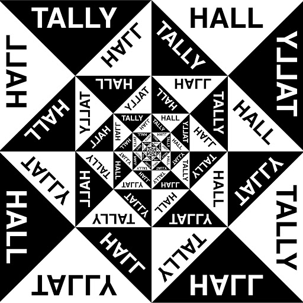
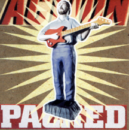

= Радио Аэростат
:toc: left

> link:aerostat.html[<Home>]
> link:toc.html[<Contents>]
> link:lyrics.html[<Lyrics>]

++++

++++

                                                                          
== 38.

=== Август: Новые Песни, 6 августа 2023
<https://aerostatbg.ru/release/948>

.Sinéad O'Connor – Dancing Lessons
image:SINEAD OCONNOR/Faith And Courage/cover.jpg[Faith And Courage,200,200,role="thumb left"]

[%hardbreaks]
Pregoblin feat. Peter Doherty – These Hands AKA Danny Knife
Peter Gabriel – So Much (Dark-Side Mix)
Domenico Lancellotti – Aterrizar
Blake Mills – Skeleton Is Walking
Sparklehorse – Evening Star Supercharger
Protomartyr – For Tomorrow
African Head Charge – Accra Electronica
Beck & Phoenix – Odyssey
    
++++
 
++++     

=== Lunassad 2023, 30 июля 2023
<https://aerostatbg.ru/release/947>

[%hardbreaks]
Full English – Awake Awake
Nuala Kennedy – Ye Lover's All
Trials Of Cato – Aberdaron
Me Lost Me – Mirie It Is While Summer I Last
Belshazzar's Feast – Hills Of The North
Lankum – The Young People
Battlefield Band feat. Christine Primrose & Nuala Kennedy – Scots Gaelic Song: An Gille Mear
Lúnasa – Paddy's Green Shamrock Shore
Belshazzar's Feast – Museum Hornpipe

++++
 
++++ 

=== Новые Имена, 23 июля 2023
<https://aerostatbg.ru/release/946>

.Tally Hall – Turn The Lights Off

[%hardbreaks]
José Miguel Moreno & Orphénica Lyra – Canarios
Sister Rosetta Tharpe & Sam Price Trio - When I Move To The Sky
Ultramarine – Kingdom
Samuel Blaser – Thoroughfare
Petula Clark – Downtown
Singers & Players feat. Prince Far I – Quanté Jubila
Blossom Dearie – I Won't Dance
Antônio Carlos Jobim – Wave
Jane Birkin – Jane B
Domenico Lancellotti – Tá brabo

++++
 
++++ 

=== Мир Как Отражение, 16 июля 2023
<https://aerostatbg.ru/release/945>

.Richard Thompson – The Ghost Of You Walks

.Paul Simon – Some Folks' Lives Roll Easy
image:PAUL SIMON/2018 - In The Blue Light/cover.jpg[In The Blue Light,200,200,role="thumb left"]

[%hardbreaks]
Chad & Jeremy – A Summer Song
Lei Qiang – Embroidered Pouch
Nick Drake – Bryter Later
Hemant Kumar – Chole Jay Mori Hay Basanter Din
Jack Hylton & His Orchestra – By A Waterfall
Ólafur Arnalds – Loftið verður skyndilega kalt
Nik Freitas – In The Frame
Franz Joseph Haydn – Trumpet Concerto in E-flat major: II. Adagio

++++
 
++++ 

=== Court And Spark, 9 июля 2023
<https://aerostatbg.ru/release/944>

.Joni Mitchell – Help Me
image:JONI MITCHELL/Court and Spark (remastered)/cover.jpg[Court and Spark (remastered),200,200,role="thumb left"]

[%hardbreaks]
Joni Mitchell – Raised On Robbery
Joni Mitchell – Blue
Joni Mitchell – Court And Spark
Joni Mitchell – Free Man In Paris
Joni Mitchell – Car On A Hill
Joni Mitchell – Down On You
Joni Mitchell – People's Parties
Joni Mitchell – Just Like This Train
Joni Mitchell – Twisted
Joni Mitchell – The Same Situation
    
++++
 
++++ 

---

> link:aerostat.html[<Home>]
> link:toc.html[<Contents>]
> link:lyrics.html[<Lyrics>]