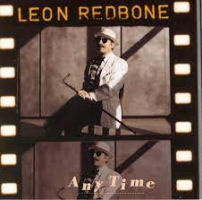
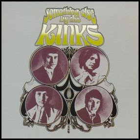
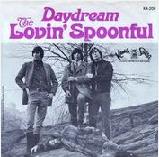
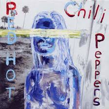
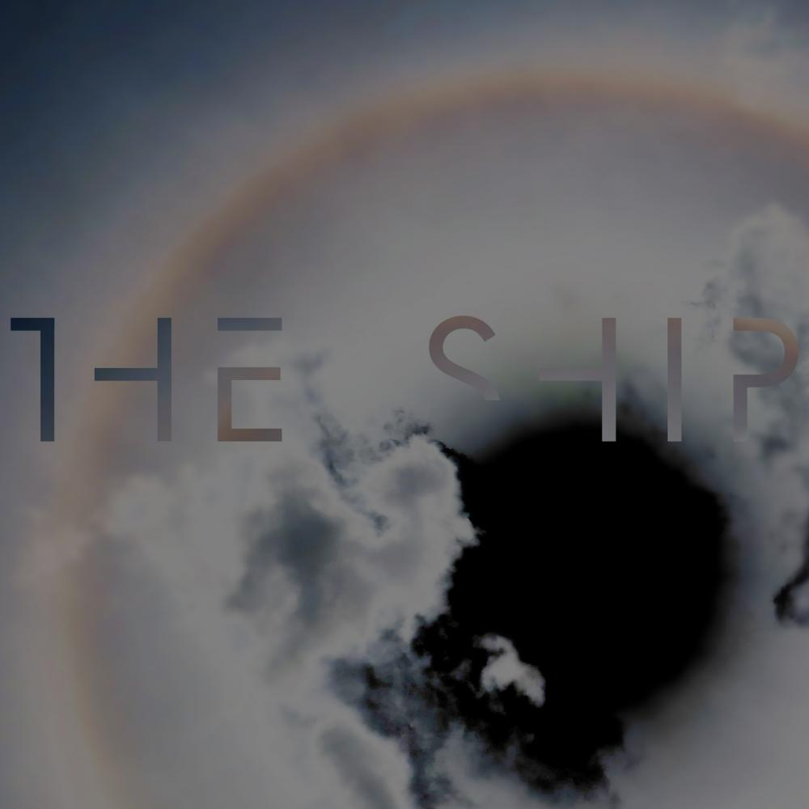
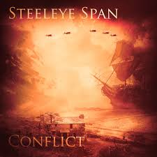

= Радио Аэростат
:toc: left

> link:aerostat.html[<Home>]
> link:toc.html[<Contents>]
> link:lyrics.html[<Lyrics>]

++++

++++

                                                                          
== 42.

=== Новые Песни Февраля, 8 февраля 2026
<https://aerostatbg.ru/release/1077>

.Cast – Free Love
image:Cast 2026 - Yeah Yeah Yeah/cover.jpg[Yeah Yeah Yeah,200,200,role="thumb left"]

[%hardbreaks]
Iron & Wine – In Your Ocean
Fred Again.. & BIA – ..Feisty
Altın Gün – Öldürme Beni
Gorillaz feat. Bizarrap, Kara Jackson, Anoushka Shankar – Orange County
Peter Gabriel – Put The Bucket Down
Bruce Springsteen – Streets Of Minneapolis
Beck – True Love Will Find You In The End
Arctic Monkeys – Opening Night

++++
 
++++

=== Imbolc, 1 февраля 2026
<https://aerostatbg.ru/release/1076>

.Five Hand Reel – My Love Is Like A Red, Red Rose
image:5 Hand Reel/For A That/cover.jpg[For A That,200,200,role="thumb left"]

.Archie Fisher & Garnet Rogers – The Winter It Is Past
image:ARCHIE FISHER/2008 - Windward Away/cover.jpg[Windward Away,200,200,role="thumb left"]

[%hardbreaks]
Michael McGoldrick – Jenny Picking Cockles / The Earl's Chair
Brian Finnegan – Bone Memory
Ye Vagabonds – On Sitric Road
Rory McCarthy – So We Were Told
Rend Collective – Abide In Me
Lumiere – Óró Mo Bháidín
Tom Fitzgerald – The Griffin

++++
 
++++

=== То да Сё № 47, 25 января 2026
<https://aerostatbg.ru/release/1075>

.Tom Petty & The Heartbreakers - link:TOM%20PETTY/Tom%20Petty%20-%20Echo/lyrics/echo.html#_counting_on_you[Counting On You]
image:TOM PETTY/Tom Petty - Echo/cover.jpg[Echo,200,200,role="thumb left"]

[%hardbreaks]
Who – Postcard
Аквариум – Морской конёк
Bob Weir – Cassidy
Jimmy Cliff – Many Rivers To Cross
Frank Zappa – I'm The Slime
Franz Schubert – Symphony No. 3 in D major: II. Allegretto
Bill Haley & His Comets – Crazy Man, Crazy
Shawn Lee & Clutchy Hopkins – Root Trees
Free – Mourning Sad Morning

++++
 
++++

=== Странные Новости с Далёкой Звезды, 18 января 2026
<https://aerostatbg.ru/release/1074>

.Аквариум – Апокалипсис
image:AQUARIUM/2026 - Странные Новости с Далёкой Звезды/cover.jpg[Странные Новости с Далёкой Звезды,200,200,role="thumb left"]

[%hardbreaks]
Аквариум – Поговорим о мёртвых
Аквариум – Все кошки серы
Аквариум – Вороны вороны
Аквариум – Спаси и сохрани
Аквариум – Зелёный ангел
Аквариум – Горизонт
Аквариум – Шила-на-Гиг
Аквариум – Странные новости с далёкой звезды
Аквариум – Из сада камней

++++
 
++++

=== Ответы на Вопросы, 11 января 2026
<https://aerostatbg.ru/release/1073>

.Ivor Cutler – Last Song
image:Ivor Cutler Trio - Ludo/cover.jpg[Ludo,200,200,role="thumb left"]

.Leon Redbone – I Ain't Gonna Give You None Of My Jelly Roll

.Jethro Tull – Sweet Dreams

.Donovan - link:DONOVAN/Donovan%20-%20HMS%20Donovan/lyrics/hms.html#_mr_wind[Mr. Wind]
image:DONOVAN/Donovan - HMS Donovan/cover.jpg[HMS Donovan,200,200,role="thumb left"]

++++
 
++++

.Glenn Miller Orchestra – Polka Dots And Moonbeams

.Kinks – Tin Soldier Man

.Who – Doctor, Doctor

[%hardbreaks]
Kraftwerk – Boing Boom Tschak
Johann Christoph Pezel – Trumpet Sonata No. 71
Vjaceslav Grochovskij – Uruli
Wailers – Put It On
БГ+ – Верный раб ветра

++++
 
++++

=== New January Songs, 4 января 2026
<https://aerostatbg.ru/release/1072>

.Chris Rea – Auberge
image:Chris Rea/Auberge/cover.jpg[Auberge,200,200,role="thumb left"]

.Barr Brothers – Run Right Into It
image:Barr Brothers - Let It Hiss/cover.jpg[Let It Hiss,200,200,role="thumb left"]

.Belair Lip Bombs – Cinema
image:Belair Lip Bombs - Again/cover.jpg[Again,200,200,role="thumb left"]

[%hardbreaks]
Soulwax – New Earth Time
Queen – Not For Sale (Polar Bear)
Alborosie – Ipanema
Charles Lloyd – Abide With Me
Eric Bibb – Muddy Waters
Glyders – Moon Eyes
Future Clouds & Radar – The Man Who Would Be King

++++
 
++++

=== С Наступающим Новым Годом, 28 декабря 2025
<https://aerostatbg.ru/release/1071>

.REM - link:REM/REM%20-%20Lifes%20Rich%20Pageant/lyrics/lifes.html#_swan_swan_h[Swan Swan H]
image:REM/REM - Lifes Rich Pageant/cover.jpg[Lifes Rich Pageant,200,200,role="thumb left"]

.David Bowie - link:DAVID%20BOWIE/The%20Rise%20And%20Fall%20Of%20Ziggy%20Stardust%20And%20The%20Spiders%20From%20Mars/lyrics/ziggy.html#_starman[Starman]

.Brian Eno – By This River
image:BRIAN ENO/Brian Eno - Before & After Science/cover.jpg[Before & After Science,200,200,role="thumb left"]

.Lovin' Spoonful – Butchie's Tune

++++
 
++++

.Silly Wizard – The Valley Of Strathmore
image:SILLY WIZARD/Silly Wizard - So Many Partings/cover.jpg[So Many Partings,200,200,role="thumb left"]

.Byrds – Wild Mountain Thyme
image:Byrds/1966 - Fifth Dimension/Folder.jpg[Fifth Dimension,200,200,role="thumb left"]

.King Crimson – Book Of Saturday
image:KING CRIMSON/1973 - Lark_s Tongues In Aspic/Folder.jpg[Lark_s Tongues In Aspic,200,200,role="thumb left"]

[%hardbreaks]
Smiths – There Is A Light That Never Goes Out
Damian Marley – Welcome To Jamrock
Sixpence None The Richer – Kiss Me

++++
 
++++

=== Скоро Рождество, 21 декабря 2025
<https://aerostatbg.ru/release/1070>

[%hardbreaks]
Bing Crosby – Happy Holiday
Choir Of Clare College, Cambridge – Gabriel's Message
Albion Christmas Band – Julian Of Norwich
Guy Lombardo And His Royal Canadians & The Andrews Sisters – Christmas Island
Kate Rusby – Holmfirth Anthem
Eddy Arnold – C-H-R-I-S-T-M-A-S
Cher – What Christmas Means To Me
Doris Day – Let No Walls Divide
Maddy Prior – It Came Upon The Midnight Clear
Enya – The Spirit Of Christmas Past
Bing Crosby – White Christmas

++++
 
++++

=== Трень-Брень, 14 декабря 2025
<https://aerostatbg.ru/release/1069>

.Imarhan – Derhan N'Oulhine
image:Imarhan - Aboogi/cover.jpg[Aboogi,200,200,role="thumb left"]

.Melody's Echo Chamber – In The Stars
image:Melodys Echo Chamber - Unclouded/cover.jpg[Unclouded,200,200,role="thumb left"]

[%hardbreaks]
Dub Pistols & Freestylers feat. JA-13 – Ska Train
Damned – There's A Ghost In My House
Judy Collins – Pretty Saro
Harper Finn – Winter Sky
Langhorne Slim – Dream Come True
Sleaford Mods feat. Gwendoline Christie & Big Special – The Good Life
Булат Окуджава – Грузинская песня
Владимир Высоцкий – Притча о правде и лжи
Yusuf / Cat Stevens – Take The World Apart

++++
 
++++

=== Время Петь, 7 декабря 2025
<https://aerostatbg.ru/release/1068>

.Ravi Shankar – Mahaa Mrityunjaya
image:RAVI SHANKAR/2010 - Chants Of India/cover.jpg[Chants Of India,200,200,role="thumb left"]

.Leonard Cohen - link:LEONARD%20COHEN/2014%20-%20Popular%20Problems/lyrics/popular.html#_did_i_ever_love_you[Did I Ever Love You]
image:LEONARD COHEN/2014 - Popular Problems/cover.jpg[Popular Problems,200,200,role="thumb left"]

.Charles Trenet – La Mer
image:Charles Trenet - L_essentiel/cover.jpg[L_essentiel,200,200,role="thumb left"]

.Eric Clapton – I'll Be Seeing You
image:Eric Clapton/2016 - I Still Do/folder.jpg[I Still Do,200,200,role="thumb left"]

++++
 
++++

[%hardbreaks]
David Bowie & Bing Crosby – Peace On Earth/Little Drummer Boy
Justin Bieber – Daisies
Flanagan & Allen – Shine On, Harvest Moon
Rolling Stones – Driving Me Too Hard
Bob Dylan – Long And Wasted Years
Aквариум – День в доме дождя

++++
 
++++

=== Новые Песни Декабря, 30 ноября 2025
<https://aerostatbg.ru/release/1067>

.Jeff Tweedy – Love Is For Love
image:Jeff Tweedy - Twilight Override/cover.jpg[Twilight Override,200,200,role="thumb left"]

[%hardbreaks]
Big Thief – Los Angeles
Geese – Cobra
FKA Twigs – Predictable Girl
Khruangbin – White Gloves II
Moody Blues – Cities
Сплин – Добро пожаловать!
Rick Wakeman – Sitting At The Window
Magpie Arc – Darling Charms
Mumford & Sons with Hozier – Rubber Band Man

++++
 
++++

=== Re-Issues, 23 ноября 2025
<https://aerostatbg.ru/release/1066>

[%hardbreaks]
Rolling Stones – Shame, Shame, Shame
Jimi Hendrix – Mr. Bad Luck
Terry Hall – Ballad Of A Landlord
Françoise Hardy – Mon amie la rose
Frank Sinatra – In The Wee Small Hours Of The Morning
Jethro Tull – Old Aces Die Hard
Family – Song For Lots
Human League – Hard Times
Madness – (Waiting For) The Ghost Train
Donovan – To Whom It May Concern

++++
 
++++

=== То Да Сё № 46, 16 ноября 2025
<https://aerostatbg.ru/release/1065>

.Beths – Metal
image:Beths - Straight Line Was A Lie/cover.jpg[Straight Line Was A Lie,200,200,role="thumb left"]

[%hardbreaks]
Ocean Colour Scene – Dawn Cried The Day
Nobukazu Takemura – Tiddler
Orchestral Manoeuvres In The Dark – Dresden
Doris Day – I'm Forever Blowing Bubbles
Johannes Ockeghem – Missa Mi-mi: Sanctus
Jimmy Page & Robert Plant – Upon The Golden Horse
Debout sur le Zinc – La declaration
Ozzy Osbourne – Lay Your World On Me
Paul McCartney – I'm Carrying

++++
 
++++

=== Равноденствие, 9 ноября 2025
<https://aerostatbg.ru/release/1064>

[%hardbreaks]
Аквариум – Иван-чай
Аквариум – Великий дворник
Аквариум – Наблюдатель
Аквариум – Партизаны полной луны
Аквариум – Лебединая сталь
Аквариум – Аделаида
Аквариум – Золото на голубом
Аквариум – Дерево
Аквариум – Очарованный тобой
Аквариум – Поколение дворников

++++
 
++++

=== Новые Песни Ноября, 2 ноября 2025
<https://aerostatbg.ru/release/1063>

.Beths – Straight Line Was A Lie
image:Beths - Straight Line Was A Lie/cover.jpg[Straight Line Was A Lie,200,200,role="thumb left"]

.Boo Boos – C'mon Baby
image:EELS/Boo Boos - 2025 - Young Love/cover.jpg[2025 - Young Love,200,200,role="thumb left"]

.Midlake – Days Gone By
image:Midlake - A Bridge To Far/cover.jpg[A Bridge To Far,200,200,role="thumb left"]

.Cheap Trick – Twelve Gates
image:Cheap Trick - All Washed Up/cover.jpg[All Washed Up,200,200,role="thumb left"]

++++
 
++++

[%hardbreaks]
David Bowie – I'm Deranged (Lost Highway Edit)
Lemonheads – Deep End
Of Monsters And Men – Television Love
Roger Eno – Alembic Distillation
Guided By Voices – (You Can't Go Back To) Oxford Talawanda
Dion – New York Minute

++++
 
++++

=== Samhain, 27 октября 2025
<https://aerostatbg.ru/release/1062>

.Mary Hopkin – Voyage Of The Moon
image:MARY HOPKIN/Mary Hopkin - Post Card/cover.jpg[Post Card,200,200,role="thumb left"]

[%hardbreaks]
Silly Wizard – Broom O' The Cowdenknowes
Lumiere – Fill Fill A Rún Ó
Peat & Diesel – Loch Maree Islands
Maddy Prior & June Tabor – The Grey Funnel Line
Beoga – The Bellevue Waltz
Jesse Ofgang & Kevin Elam feat. Lady Moon – Old Churchyard
Aly Bain & Phil Cunningham – Hector The Hero

++++
 
++++

=== То да Сё, 19 октября 2025
<https://aerostatbg.ru/release/1061>

.Doors – Love Her Madly
image:DOORS/1971 - LA Woman/front.png[LA Woman,200,200,role="thumb left"]

.Simon & Garfunkel - link:SIMON%20&%20GARFUNKEL/Simon%20&%20Garfunkel%20-%20Sounds%20of%20Silence/lyrics/silence.html#_kathy_s_song[Kathy's Song]
image:SIMON & GARFUNKEL/Simon & Garfunkel - Sounds of Silence/cover.jpg[Sounds of Silence,200,200,role="thumb left"]

.Donovan – House Of Jansch
image:DONOVAN/1967 - Mellow Yellow (2005, RE, with bonus tracks)/cover.png[Mellow Yellow (2005  RE  with bonus tracks),200,200,role="thumb left"]

.Damian Marley feat. Stephen Marley – Perfect Picture
image:Damian Marley - Stony Hill/cover.jpg[Stony Hill,200,200,role="thumb left"]

++++
 
++++

[%hardbreaks]
Duke Kamoku & His Islanders – Blue Hawaii
Guess Who – No Time
Scaffold – Liverpool Girls
Steppenwolf – Everybody's Next One
Manfred Mann – Quinn The Eskimo (The Mighty Quinn)
Beths – Metal

++++
 
++++

=== Новые Имена, 12 октября 2025
<https://aerostatbg.ru/release/1060>

[%hardbreaks]
Tractor – Madrigal
Mary Black – Sonny
Montgolfier Brothers – Even If My Mind Can't Tell You
Jesse Welles – War Isn't Murder
Dawn Penn – You Don't Love Me (No, No, No)
ULD – Jeg skal finne deg
Xmal Deutschland – I'll Be Near You
Blackberry Smoke – One Horse Town
Julee Cruise – Falling

++++
 
++++

=== Прогулки Романтика, 5 октября 2025
<https://aerostatbg.ru/release/1059>

.Red Hot Chili Peppers – Can't Stop

.Tom Petty & The Heartbreakers - link:TOM%20PETTY/Tom%20Petty%20-%20Echo/lyrics/echo.html#_echo[Echo]
image:TOM PETTY/Tom Petty - Echo/cover.jpg[Echo,200,200,role="thumb left"]

.Richard Thompson & Danny Thompson – Children Of The Dark
image:RICHARD THOMPSON/1997 - Industry/folder.jpg[Industry,200,200,role="thumb left"]

.Robert Plant – It's A Beautiful Day Today
image:ROBERT PLANT/2025 - Saving Grace/Front.jpg[Saving Grace,200,200,role="thumb left"]

++++
 
++++

.REM – Wall Of Death
image:REM/1996 - New Adventures in Hi‐Fi/cover.jpg[New Adventures in Hi‐Fi,200,200,role="thumb left"]

.REM - link:REM/REM%20-%20Up/lyrics/up.html#_why_not_smile[Why Not Smile]
image:REM/REM - Up/cover.jpg[Up,200,200,role="thumb left"]

.Nusrat Fateh Ali Khan – Nothing Without You
image:Nusrat Fateh Ali Khan - Mustt Mustt/cover.jpg[Mustt Mustt,200,200,role="thumb left"]

.Ravi Shankar – Hari Om
image:RAVI SHANKAR/2010 - Chants Of India/cover.jpg[Chants Of India,200,200,role="thumb left"]

++++
 
++++

[%hardbreaks]
Кино – Прогулка романтика

++++
 
++++

=== Новые Песни Октября, 28 сентября 2025
<https://aerostatbg.ru/release/1058>

.Divine Comedy – Invisible Thread
image:DIVINE COMEDY/2025 - Rainy Sunday Afternoon/cover.jpg[Rainy Sunday Afternoon,200,200,role="thumb left"]

.Suede – Dancing With The Europeans
image:Suede - Antidepressants/cover.jpg[Antidepressants,200,200,role="thumb left"]

.Orb – Arabebonics
image:The Orb/2025 - Buddhist Hipsters/cover.jpg[Buddhist Hipsters,200,200,role="thumb left"]

[%hardbreaks]
Gruff Rhys – Cân I'r Cymylau
Dean Johnson – Carol
Baby Cham, Damian Marley & Stephen Marley – Hustling In My Blood
Gorillaz feat. Sparks – The Happy Dictator
Beatles – Free As A Bird (2025 Mix)

++++
 
++++

=== Полезные Слова, 21 сентября 2025
<https://aerostatbg.ru/release/1057>

.Jethro Tull - link:JETHRO%20TULL/Jethro%20Tull%20-%20Heavy%20Horses/lyrics/horses.html#_heavy_horses[Heavy Horses]
image:JETHRO TULL/Jethro Tull - Heavy Horses/cover.jpg[Heavy Horses,200,200,role="thumb left"]

[%hardbreaks]
Ozzy Osbourne – I Just Want You
Rolling Stones – Ain't Too Proud To Beg
Andy M. Stewart – The Man In The Moon
Aardvark – Once Upon A Hill
Georg Philipp Telemann – Recorder Sonata in F minor: II. Allegro
Vishwanath H. V. feat. Vanishree & Vijayalakshmi – Bhagavad Gita, Chapter 5 - Sanyasa Yoga

++++
 
++++

=== Высокодуховные Ответы, 14 сентября 2025
<https://aerostatbg.ru/release/1056>

.George Harrison – On The Bed
image:GEORGE HARRISON/Wonderwall Music/cover.jpg[Wonderwall Music,200,200,role="thumb left"]

.Doors – The Crystal Ship

.Giles, Giles & Fripp – One In A Million
image:KING CRIMSON/1968 - The Cheerful Insanity Of/Folder.jpg[The Cheerful Insanity Of,200,200,role="thumb left"]

.George Harrison – Flying Hour
image:GEORGE HARRISON/1995 - Pirate Songs/cover.jpg[Pirate Songs,200,200,role="thumb left"]

++++
 
++++

.Brian Eno – Fickle Sun (III) I'm Set Free

[%hardbreaks]
Cocteau Twins & Harold Budd – Eyes Are Mosaics
Brian Eno & Harold Budd – Late October
Аквариум – Комната, лишённая зеркал
Donovan – Roots Of Oak

++++
 
++++

=== Новые Песни Сентября, 7 сентября 2025
<https://aerostatbg.ru/release/1055>

.Steeleye Span – Trees Are Whispering

.Ed Sheeran – Old Phone
image:Ed Sheeran/2025 - Play/cover.png[Play,200,200,role="thumb left"]

[%hardbreaks]
Future Clouds & Radar – The Man Who Would Be King
Brian Eno & Beatie Wolfe – Ringing Ocean
Junior Murvin – No Bed Of Roses
Solomon – Unrequited
Ty Segall – Shoplifter
Matmos – The Chrome Reflects Our Image
Elizabeth Fraser – At Last I Am Free
Neil Young & The Chrome Hearts – Silver Eagle

++++
 
++++

=== То да Cё (к Первому сентября), 31 августа 2025
<https://aerostatbg.ru/release/1054>

.Beatles – Baby, You're A Rich Man
image:THE BEATLES/1967b - Magical Mystery Tour/cover.jpg[Magical Mystery Tour,200,200,role="thumb left"]

.Doors – My Eyes Have Seen You
image:DOORS/1967 - Strange Days/cover.jpg[Strange Days,200,200,role="thumb left"]

[%hardbreaks]
Alice Cooper – School's Out
Yeule – Electric
Аквариум – Лебединая сталь
Iron Butterfly – Belda-Beast
Gentle Giant – Schooldays
Strawberry Alarm Clock – Incense And Peppermints
Turtles – Happy Together

++++
 
++++

=== Сага об Иннокентии, 24 августа 2025
<https://aerostatbg.ru/release/1053>

.Crosby, Stills & Nash – Wasted On The Way
image:Crosby Stills Nash/2005 - Greatest Hits/cover.jpg[Greatest Hits,200,200,role="thumb left"]

[%hardbreaks]
Yardbirds – For Your Love
Yes – I've Seen All Good People
Yusuf / Cat Stevens – I Think I See The Light
YG Marley – Praise Jah In The Moonlight
Frank Zappa – The Legend Of Golden Arches
Young Dubliners – (I Don't Think I'll) Love Anymore
Ye Vagabonds – On Yonder Hill
Yusuf / Cat Stevens – Greenfields, Golden Sands

++++
 
++++

=== Ответы на Вопросы, 17 августа 2025
<https://aerostatbg.ru/release/1052>

.Derek & The Dominoes – Bell Bottom Blues

.Idle Race – A Better Life (The Weather Man Knows)

[%hardbreaks]
Борис Гребенщиков – Прощание с новогодней ёлкой (Б. Окуджава)
George Frideric Handel – Oboe Concerto No. 1 in B-flat major: I. Adagio
Shirley & Dolly Collins – Over The Hills And Far Away
Frank Zappa & The Mothers Of Invention – Dirty Love
Free – Wild Indian Woman
Johann Sebastian Bach – Trio Sonata No. 1 in E-flat major: II. Adagio
Incredible String Band – Gently Tender

++++
 
++++

---

> link:aerostat.html[<Home>]
> link:toc.html[<Contents>]
> link:lyrics.html[<Lyrics>]