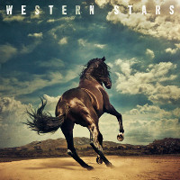
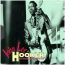

= Радио Аэростат
:toc: left

- link:aerostat29.html[`Глава XXIX.   14.10.2018 - 21.04.2019`]
- link:aerostat28.html[`Глава XXVIII.  8.04.2018 -  7.10.2018`]
- link:aerostat27.html[`Глава XXVII.  10.09.2017 -  1.04.2018`]
- link:aerostat26.html[`Глава XXVI.    5.03.2017 -  3.09.2017`]
- link:aerostat25.html[`Глава XXV.    28.08.2016 - 26.02.2017`]
- link:aerostat24.html[`Глава XXIV.   16.02.2016 - 21.08.2016`]
- link:aerostat23.html[`Глава XXIII.  30.08.2015 - 21.02.2016`]
- link:aerostat22.html[`Глава XXII.    1.03.2015 - 23.08.2015`]
- link:aerostat21.html[`Глава XXI.    31.08.2014 - 22.02.2015`]
- link:aerostat20.html[`Глава XX.      2.03.2014 - 24.08.2014`]
- link:aerostat19.html[`Глава XIX.    15.09.2013 - 23.02.2014`]

...

- link:aerostat05.html[`Глава V.      25.03.2006 -  9.09.2007`]
- link:aerostat04.html[`Глава IV.      8.10.2006 - 18.03.2007`]
- link:aerostat03.html[`Глава III.    23.04.2006 -  1.10.2006`]
- link:aerostat02.html[`Глава II.      6.11.2005 - 16.04.2006`]
- link:aerostat01.html[`Глава I.      22.05.2005 - 30.10.2005`]

++++
 
++++

> link:lyrics.html[Lyrics]

++++

++++

<<<

== 30.

<http://www.aquarium.ru/misc/aerostat/index.html>

=== Новые песни в июле, 7 июля 2019

<http://www.radiorus.ru/brand/57083/episode/2183247>

.Bruce Springsteen - The Wayfarer

[%hardbreaks]
Sheryl Crow - Prove You Wrong
Thom Yorke - Traffic
Freddie Mercury - Time Waits For Noone
Ludovico Einaudi - Day 4: Full Moon
Kate Rusby - Until Morning
Plaid - Ops
Bitw/Hitmore - Love Is Happening
High Kings - Red Is The Rose

=== John Lee Hooker, 30 июня 2019

<http://www.radiorus.ru/brand/57083/episode/2181170>

.John Lee Hooker - link:JOHN%20LEE%20HOOKER/John%20Lee%20Hooker%20-%20The%20Ultimate%20Collection%20(CD%202)/lyrics/hooker2.html#_boom_boom[Boom Boom]

[%hardbreaks]
John Lee Hooker - link:JOHN%20LEE%20HOOKER/John%20Lee%20Hooker%20-%20The%20Ultimate%20Collection%20(CD%201)/lyrics/hooker1.html#_weeping_willow_boogie[Weeping Willow Boogie]
John Lee Hooker - Doin' The Shout
John Lee Hooker - link:JOHN%20LEE%20HOOKER/John%20Lee%20Hooker%20-%20The%20Ultimate%20Collection%20(CD%201)/lyrics/hooker1.html#_let_your_daddy_ride[Let Your Daddy Ride]
John Lee Hooker - link:JOHN%20LEE%20HOOKER/John%20Lee%20Hooker%20-%20The%20Ultimate%20Collection%20(CD%201)/lyrics/hooker1.html#_crawlin_king_snake[Crawling King Snake]
John Lee Hooker - link:JOHN%20LEE%20HOOKER/John%20Lee%20Hooker%20-%20The%20Ultimate%20Collection%20(CD%201)/lyrics/hooker1.html#_i_m_in_the_mood[I'm In The Mood]
John Lee Hooker - link:JOHN%20LEE%20HOOKER/John%20Lee%20Hooker%20-%20The%20Ultimate%20Collection%20(CD%201)/lyrics/hooker1.html#_boogie_chillen[Boogie Chillen]
John Lee Hooker - link:JOHN%20LEE%20HOOKER/John%20Lee%20Hooker%20-%20The%20Ultimate%20Collection%20(CD%201)/lyrics/hooker1.html#_dimples[Dimples]
John Lee Hooker - link:JOHN%20LEE%20HOOKER/John%20Lee%20Hooker%20-%20The%20Ultimate%20Collection%20(CD%202)/lyrics/hooker2.html#_one_bourbon_one_scotch_one_beer[One Burbon One Scotch One Beer]
John Lee Hooker - Women In My Life
John Lee Hooker - Chill Out

=== То да се #3, 23 июня 2019

<http://www.radiorus.ru/brand/57083/episode/2179513>

.REM - link:REM/REM%20-%20Eponymous/lyrics/eponymous.html#_talk_about_the_passion[Talk About The Passion]
image:REM/REM - Eponymous/cover.jpg[Eponymous,200,200,role="thumb left"]

.Simon & Garfunkel - Song For The Asking
image:SIMON & GARFUNKEL/Simon & Garfunkel - Bridge Over Troubled Water/cover.jpg[Bridge Over Troubled Water,200,200,role="thumb left"]

[%hardbreaks]
Joao Gilberto - Saudade Fez Um Samba
Kathmandu Music - Prayers For 3 Pioneers Of Kagyu
Liam Gallagher - Shockwave
King Crimson - Epitaph
Happy Traum - Blues Ain't Nothin'
Page & Plant - The Truth Explodes
Handel - Oboe Concerto #2. Andante

++++
 
++++

=== Новые имена # 23, 16 июня 2019

<http://www.radiorus.ru/brand/57083/episode/2177293>

[%hardbreaks]
Humble Pie - Stone Cold Fever
Suicide - Ghost Rider
Dustin O'Halloran - Mother
Endless Boogie - Taking Out The Trash
Ronnie Lane - Roll On Baby
Pete Seeger - If I Had A Hammer
Emitt Rhodes - 'Til The Day After
Screaming Trees - Nearly Lost You
Skip Marley - That's Not True
Free - Travellin In Style

=== Thelonius Monk, 9 июня 2019

<http://www.radiorus.ru/brand/57083/episode/2175601>

[%hardbreaks]
Thelonius Monk - Light Blue
Thelonius Monk - Blue Monk
Thelonius Monk - Just A Gigolo
Thelonius Monk - Bemsha Swing
Thelonius Monk - Ruby My Dear
Thelonius Monk - Round Midnight
Thelonius Monk - Crepuscule With Nellie
Thelonius Monk - Well, You Needn't

=== Новые песни июня, 2 июня 2019

<http://www.radiorus.ru/brand/57083/episode/2173518>

[%hardbreaks]
Divine Comedy - Queuejumper
Richard Hawley - Alone
Eliza Carthy - Friendship
Santana - Breaking Down The Door
Calexico/Iron & Wine - Father Mountain
John Zorn - The Hermit
Dervish & Kate Rusby - Down By The Sally Gardens
Beck - Saw Lightning
Shannon Lay - Something On Your Mind
Morrissey - Wedding Bell Blues

=== Священность музыки, 26 мая 2019

<http://www.radiorus.ru/brand/57083/episode/2171574>

.Donovan - Colours
image:DONOVAN/Donovan - Fairytale/cover.jpg[Fairytale,200,200,role="thumb left"]

.Beatles - I Feel Fine
image:THE BEATLES/1988 - Past Masters/cover.jpg[Past Masters,200,200,role="thumb left"]

[%hardbreaks]
Cat Stevens - Mona Bone Jacon
Rakesh Chaurasia - Mane Te Manavi Lejo
J S Bach - English Suite #1, X. Gigue
Busnoys - Regina Celi 1
Bhajan Singers - Ranjana Nadi Tire
Buxtehude - Canzona In C Maj
Herbie Mann - If
Mendelsson - Concertante In G Maj For 2 Flutes. 2

=== О том, о сем, No 2, 19 мая 2019

<http://www.radiorus.ru/brand/57083/episode/2169618>

.Donovan - The Tinker & The Crab
image:DONOVAN/Donovan - A Gift From a Flower to a Garden/cover.jpg[A Gift From a Flower to a Garden,200,200,role="thumb left"]

[%hardbreaks]
Vampire Weekend - Hold You Now
Family - Hung Up Down
J. S. Bach - Concerto For Oboe d'Amour In A. Allegro
John Fogerty - It Ain't Right
Traffic - Dealer
King Sunny Ade - Ma Jaiye Oni
Beat/Ranking Roger - A Good Day For Sunshine
King Crimson - Starless
Mick Jagger - Evening Gown

=== Новая музыка. Май, 12 мая 2019

<http://www.radiorus.ru/brand/57083/episode/2167507>

[%hardbreaks]
Black Keys - Eagle Birds
Steel Pulse - Cry Cry Blood
Morrisey - Morning Starship
Hu - Wolf Totem
King Gizzard & Wizard Lizard - Real's Not Real
Sleaford Mods - When You Come Up To Me
Kel Assuf - Amghar
James Yorkston - The Blue Of The Thistle
Stray Cats - Rock It Off

=== Beltain Flook - 2019, 28 апреля 2019

<https://aerostatica.ru/2019/04/28/728-beltain-flook-2019/>

.Flook - Lalabee/Jig For Simon
image:Flook 2019 - Ancora/cover.jpg[Ancora,200,200,role="thumb left"]

[%hardbreaks]
Flook - Omos Sheamuis/The Quickenbeam
Flook - Reel For Rubik/Toward The Sun
Flook - Sharig/The Pipers Of Roguery/The Huntsman
Flook - Ellie Goes West
Flook - The Bunting Fund/Ocean Child
Flook - The Crystal Year/Foxes’ Rock
Flook - Turquoise Girl/The Tree Climber/Twelve Weeks And A Day/Rounding Malin Head

++++
 
++++

