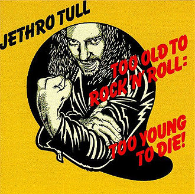
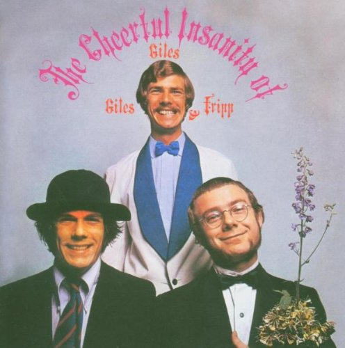

= Радио Аэростат
:toc: left

> link:lyrics.html[Lyrics]

- link:aerostat31.html[`Глава XXXI.   27.10.2019 - 26.04.2020`]
- link:aerostat30.html[`Глава XXX.    28.04.2019 - 20.10.2019`]
- link:aerostat29.html[`Глава XXIX.   14.10.2018 - 21.04.2019`]
- link:aerostat28.html[`Глава XXVIII.  8.04.2018 -  7.10.2018`]
- link:aerostat27.html[`Глава XXVII.  10.09.2017 -  1.04.2018`]
- link:aerostat26.html[`Глава XXVI.    5.03.2017 -  3.09.2017`]
- link:aerostat25.html[`Глава XXV.    28.08.2016 - 26.02.2017`]
- link:aerostat24.html[`Глава XXIV.   16.02.2016 - 21.08.2016`]
- link:aerostat23.html[`Глава XXIII.  30.08.2015 - 21.02.2016`]
- link:aerostat22.html[`Глава XXII.    1.03.2015 - 23.08.2015`]
- link:aerostat21.html[`Глава XXI.    31.08.2014 - 22.02.2015`]
- link:aerostat20.html[`Глава XX.      2.03.2014 - 24.08.2014`]
- link:aerostat19.html[`Глава XIX.    15.09.2013 - 23.02.2014`]
- link:aerostat18.html[`Глава XIIIV.  31.03.2013 -  8.09.2013`]

...

- link:aerostat05.html[`Глава V.      25.03.2006 -  9.09.2007`]
- link:aerostat04.html[`Глава IV.      8.10.2006 - 18.03.2007`]
- link:aerostat03.html[`Глава III.    23.04.2006 -  1.10.2006`]
- link:aerostat02.html[`Глава II.      6.11.2005 - 16.04.2006`]
- link:aerostat01.html[`Глава I.      22.05.2005 - 30.10.2005`]

++++
 
++++

++++

++++

<<<

== 32.

=== Вслух о Музыке, 12 июля 2020

.Bob Dylan - link:BOB%20DYLAN/Bob%20Dylan%201963%20-%20Blowing%20In%20The%20Wind/lyrics/blowing.html#_when_the_ship_comes_in[When The Ship Comes In]
image:BOB DYLAN/Bob Dylan 1963 - Blowing In The Wind/cover.jpg[Blowing In The Wind,200,200,role="thumb left"]

.Le Mystère Des Voix Bulgares – Tche Da Ti Kupim Bela Seitsa

[%hardbreaks]
King Crimson – Red
King Crimson – Lady Of The Dancing Water
Dietrich Buxtehude – Ein Feste Burg Ist Unser Gott 
Animal Collective – Hounds Of Bairro
Rakesh Chaurasia – Bada Natkhat Hai  
Beatles – You Like Me Too Much
Cocteau Twins – Rilkean Heart

++++
 
++++

=== Новые Песни Июля, 5 июля 2020

<https://www.radiorus.ru/brand/57083/episode/2418045>

.Bob Dylan – My Own Version Of You
image:BOB DYLAN/2020 - Rough And Rowdy Days/cover.jpg[Rough And Rowdy Days,200,200,role="thumb left"]

.Dalai Lama – Compassion

.Bananagun – Perfect Stranger
image:Bananagun - The True Story of Bananagun/cover.png[The True Story of Bananagun,200,200,role="thumb left"]

[%hardbreaks]
Michael Stipe & Big Red Machine – No Time For Love Like Now
Neil Young – Vacancy
Julianna Barwick feat. Jónsi – In Light
Shaggy feat. Sting – Angel

++++
 
++++

=== Музыка Ревущих 20-х, 28 июня 2020

<https://www.radiorus.ru/brand/57083/episode/2416430>

[%hardbreaks]
Fred Rich & His Orchestra – Singing In The Rain
Nick Lucas – Tip-Toe Thru' The Tulips With Me
Johnny Marvin & Leonard Joy Orchestra – Happy Days Are Here Again
Fats Waller – Ain't Misbehavin'
Cab Calloway – Minnie The Moocher
Fred Astaire – Puttin' On The Ritz
Cliff «Ukulele Ike» Edwards – That's My Weakness Now 
Louis Armstrong – It Don't Mean A Thing (If It Ain't Got That Swing)
Blind Lemon Jefferson – Hangman's Blues
Al Jolson – Pasadena
Paul Hindemith – Hindemith: Concerto for Orchestra, Op. 38 - 1. Mit Kraft, mäßig schnelle Viertel 
Cliff «Ukulele Ike» Edwards –  Orange Blossom Time

=== Новый Альбом А, 21 июня 2020

<https://www.radiorus.ru/brand/57083/episode/2414525>

.БГ – Альфа
image:AQUARIUM/БГ - Знак Огня/cover.jpg[Знак Огня,200,200,role="thumb left"]

[%hardbreaks]
БГ – Вон Вавилон
БГ – Мое Имя Пыль
БГ – Не Судьба
БГ – Вечное Возвращение
БГ – Знак
БГ – Масала Доса
БГ – Хиханьки Да Хаханьки
БГ – Мой Ясный Свет
БГ – Поутру В Поле

=== Рок-Звезда, 14 июня 2020

<https://www.radiorus.ru/brand/57083/episode/2412178>

.Ian Anderson – Photo Shop

[%hardbreaks]
Rolling Stones – Child Of The Moon
David Bowie – Sorrow
Lou Reed – Ride Sally Ride
Queen – I'm Going Slightly Mad
Little Richard – I Got It
Beatles – What You're Doing
Doors – Strange Days
Eurythmics – Thorn In My Side
Robert Plant – The Only Sound That Matters

=== Новые Песни Июня, 7 июня 2020

<https://www.radiorus.ru/brand/57083/episode/2409143>

.Bob Dylan – False Prophet
image:BOB DYLAN/2020 - Rough And Rowdy Days/cover.jpg[Rough And Rowdy Days,200,200,role="thumb left"]

.Sparks – Stravinsky's Only Hit
image:Sparks 2020 - A Steady Drip Drip Drip/cover.jpg[A Steady Drip Drip Drip,200,200,role="thumb left"]

.Badly Drawn Boy – You And Me Against The World

[%hardbreaks]
Blitzen Trapper – Magical Thinking
Sleaford Mods – Tarantula Deadly Cargo
Noveller – Canyons
Bab L' Bluz – Ila Mata
47Soul – Dabke System
Phil Cunningham & Aly Bain –  Lightly Swims The Swan

++++
 
++++

=== Последний день Весны, 31 мая 2020

<https://www.radiorus.ru/brand/57083/episode/2392948>

.Maccabees – Toothpaste Kisses

[%hardbreaks]
Ben Webster – Chelsea Bridge
The Stranglers – Golden Brown
Sébastien Tellier  – Domestic Tasks
Akvarium In Dub – Riba
Mentrix – Nature
Kraftwerk – Taschenrechner 
Bob Andy – Rock It Down
Lei Quing – Night Song

=== 15 лет Аэростатики, 24 мая 2020

<https://www.radiorus.ru/brand/57083/episode/2392948>

.Jethro Tull – From The Dead Beat To An Old Greaser

[%hardbreaks]
Simon & Garfunkel – Beat Love
Jethro Tull – Journeyman
Françoise Hardy – Le Large
Hemant Kumar – Ami Kaan Pete Roi
Rolling Stones – 19th  Nervous Breakdown
Creedence Clearwater Revival – Lodi
Deep Purple – Into The Fire
Andy M. Stewart – Land O' The Leal
Beatles – Real Love

=== Глубокие песни Джорджа, 17 мая 2020

<https://www.radiorus.ru/brand/57083/episode/2391038>

.George Harrison – Isn't It A Pity
image:GEORGE HARRISON/George Harrison - Live In Japan CD2/cover.jpg[Live In Japan CD2,200,200,role="thumb left"]

.George Harrison – When We Were Fab
image:GEORGE HARRISON/George Harrison - Cloud Nine/cover.jpg[Cloud Nine,200,200,role="thumb left"]

.Travelling Wilburys - link:Traveling%20Wilburys%20-%20Volume%203/lyrics/wilburys3.html#_the_devil_s_been_busy[The Devil's Been Busy]
image:Traveling Wilburys - Volume 3/cover.jpg[Volume 3,200,200,role="thumb left"]

[%hardbreaks]
George Harrison – Woman Don't You Cry For Me
George Harrison – Not Guilty
George Harrison – Hear Me Lord
George Harrison – If Not For You
George Harrison – Simply Shady
George Harrison – Dark Sweet Lady
George Harrison – That's What It Takes

=== То да се #8, 10 мая 2020

<https://www.radiorus.ru/brand/57083/episode/2267550>

.Jethro Tull – Teacher
image:JETHRO TULL/1976  M.U. - The Best of Jethro Tull/cover.jpg[The Best of Jethro Tull,200,200,role="thumb left"]

.Tom Waits – Cold Cold Ground
image:TOM WAITS/1988 - Big Time/cover.jpg[Big Time,200,200,role="thumb left"]

.Giles, Giles & Fripp –  Thursday Morning

.Gentle Giant – Black Cat
image:Gentle Giant 1971 - Acquiring The Taste/Folder.jpg[Acquiring The Taste,200,200,role="thumb left"]

++++
 
++++

.Grateful Dead – Mississippi Half-Step Uptown Toodeloo
image:GRATEFUL DEAD/1973 - Wake Of The Flood/cover.jpg[Wake Of The Flood,200,200,role="thumb left"]

.Thom Yorke – And It Rained All Night (Burial Remix)
image:RADIOHEAD/Thom Yorke - The Eraser/folder.jpg[The Eraser,200,200,role="thumb left"]

.Whistlebinkies – My Bonnie Moor Hen
image:Whistlebinkies 2006 - Albannach/front.jpg[Albannach,200,200,role="thumb left"]

.Tommy Sands –  Misty Mourne Shore

++++
 
++++

=== Новые песни мая, 3 мая 2020

<https://www.radiorus.ru/brand/57083/episode/2265666>

.Ashley McBryde – One Night Standards
image:Ashley McBryde - Never Will/cover.jpg[Never Will,200,200,role="thumb left"]

[%hardbreaks]
Gorillaz feat. Peter Hook & Georgia – Aries
Rolling Stones – Living In A Ghost Town
Robby Krieger – Slide Home
Bob Dylan – I Contain Multitudes
Steve Earle & The Dukes – John Henry Was A Steel Drivin' Man
Airborne Toxic Event – Come On Out
Richard Thompson – Light Bob's Lassie
Jimmy Buffett – Down At The La Dee Dah
