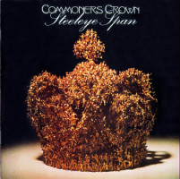
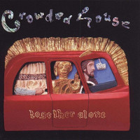
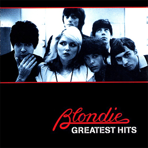
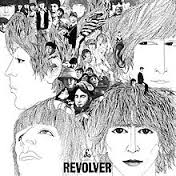
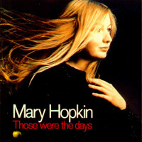
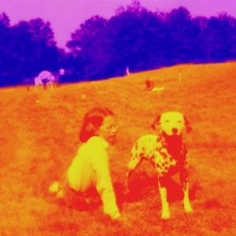

= Радио Аэростат. Глава I
:toc: left

link:aerostat.html[Главная страница]

== 22 мая 2005 - 30 октября 2005

<http://www.aquarium.ru/misc/aerostat/index01.html>

++++

++++

=== "Самайн (Соуэн)", 30 октября 2005

<http://www.aquarium.ru/misc/aerostat/aerostat24.html>

.Steeleye Span - Little Sir Hugh

.Donovan - Lord Of the Dance
image:DONOVAN/Donovan - HMS Donovan/cover.jpg[HMS Donovan,200,200,role="thumb left"]

[%hardbreaks]
Chieftains - Bonaparte's Retreat (part 1)
Derek Bell - Fanny Poer
Albion Country Band - I was A Young Man
Fairport Convention - Farewell, Farewell
Shirley & Dolly Collins - Just As The Tide
Fairport Convention - Now Be Thankful
Amazing Blondel - St.Crispin's Day
Dick Gaughan - Both Sides The Tweed
Pogues - Sally McLennan
Maire Brennan - Song Of David

=== "Правь, Британия!", 23 октября 2005

<http://www.aquarium.ru/misc/aerostat/aerostat23.html>

.Radiohead - Everything In Its Right Place
image:RADIOHEAD/Radiohead - Not My Fault/cover.png[Not My Fault,200,200,role="thumb left"]

[%hardbreaks]
Right Said Fred - I Love You But I Don't Like You
Annie Lennox - No More I Love You's
The High Llamas - Literature Is Fluff
Oasis - Don't Look Back In Anger
Blur - Beetlebum
Ocean Colour Scene - The Circle
Looper - On The Flipside

=== "Сделай Сам!", 16 октября 2005

<http://www.aquarium.ru/misc/aerostat/aerostat22.html>

.Cotton Mather - Glory Eyes

.Cotton Mather - link:COTTON%20MATHER/Cotton%20Mather%20-%20Kon%20Tiki/lyrics/kontiki.html#_lily_dreams_on[Lily Dreams On]
image:COTTON MATHER/Cotton Mather - Kon Tiki/Folder.jpg[Kon Tiki,200,200,role="thumb left"]

.Eels - Novocaine For the Soul
image:EELS/Eels - Beautiful Freak/Folder.jpg[Beautiful Freak,200,200,role="thumb left"]

.Red Hot Chili Peppers - Cabron
image:RED HOT CHILI PEPPERS/Red Hot Chilli Peppers - By the way/cover.jpg[By the way,200,200,role="thumb left"]

++++
 
++++

.Elliot Smith - XO Waltz
image:ELLIOTT SMITH/Elliott Smith - XO/cover.jpg[XO,200,200,role="thumb left"]

[%hardbreaks]
Magnetic Fields - Lets Pretend We're Bunny Rabbits
Apples In Stereo - Lying With A Friend
Beck - O Maria
Cake - Satan Is My Motor
Sixpence None The Richer - Kiss Me

++++
 
++++

=== "С днем рождения, Джон", 9 октября 2005

<http://www.aquarium.ru/misc/aerostat/aerostat21.html>

.Beatles - Strawberry Fields Forever
image:THE BEATLES/1967b - Magical Mystery Tour/cover.jpg[Magical Mystery Tour,200,200,role="thumb left"]

.Beatles - Happiness Is A Warm Gun
image:THE BEATLES/The Beatles - White Album CD 1/cover.jpg[White Album CD 1,200,200,role="thumb left"]

.Paul McCartney - Here Today
image:PAUL MCCARTNEY/Paul McCartney - Tug Of War/cover.jpg[Tug Of War,200,200,role="thumb left"]

[%hardbreaks]
Beatles - It Won't Be Long
Beatles - In My Life
Beatles - Tomorrow Never Knows
John Lennon - God
John Lennon - Instant Karma
John Lennon - Mind Games
George Harrison - All Those Years Ago
Beatles - Free As A Bird

=== "Россия - 80-е", 2 октября 2005

<http://www.aquarium.ru/misc/aerostat/aerostat20.html>

[%hardbreaks]
Санкт-Петербург - Сердце Камня
Майк Науменко - Сладкая N
Кино - Это не любовь
Наутилус Помпилиус - Монгольская степь
Настя - Белые волки
Янка - Гори, гори ясно
Александр Башлачев - Время колокольчиков
Странные Игры - Хоровод
Звуки Му - Досуги-буги
Секрет - Моя Любовь На Пятом Этаже

=== "Пора сбора урожая", 25 сентября 2005

<http://www.aquarium.ru/misc/aerostat/aerostat19.html>

.Sigur Ros - Glosoli

.Paul McCartney - link:PAUL%20MCCARTNEY/Paul%20McCartney%20-%20Chaos%20And%20Creation%20In%20The%20Backyard/lyrics/backyard.html#_english_tea[English Tea]
image:PAUL MCCARTNEY/Paul McCartney - Chaos And Creation In The Backyard/cover.jpg[Chaos And Creation In The Backyard,200,200,role="thumb left"]

[%hardbreaks]
Rolling Stones - She Saw Me Coming
Gorillaz - Last Liven Souls
Feeder - Tumble And Fall
Richard Thompson - Let It Blow
Daft Punk - Human After All
Albert Kuvezin & Yat-Kha - In-A-Gadda-Da-Vida
Damien Rice - Unplayed Piano

=== Прямой эфир, 18 сентября 2005

<http://www.aquarium.ru/misc/aerostat/aerostat18.html>

.Tom Petty - link:TOM%20PETTY/Tom%20Petty%20-%20Echo/lyrics/echo.html#_accused_of_love[Accused Of Love]
image:TOM PETTY/Tom Petty - Echo/cover.jpg[Echo,200,200,role="thumb left"]

[%hardbreaks]
Srila Gurudeva - Sri Guru Vandana
System Of A Down - Radio/Video
Mary Hopkin - Sparrow
Red Hot Chili Peppers - Eskimo

=== "Beatles после Beatles", 11 сентября 2005

<http://www.aquarium.ru/misc/aerostat/aerostat17.html>

.George Harrison - My Sweet Lord

.Paul McCartney - Junk

[%hardbreaks]
John Lennon - Hold On
Ringo Starr - Weight Of The World
George Harrison - Life Itself
Paul McCartney - I'm Carrying
John Lennon - Surprise, Surprise
Paul McCartney - Pipes Of Peace
John Lennon - Watching The Wheels
George Harrison - Between The Devil And The Deep Blue Sea
Beatles - Real Love

=== "Синтезатор Galore!", 4 сентября 2005

<http://www.aquarium.ru/misc/aerostat/aerostat16.html>

.Brian Eno - By This River
image:BRIAN ENO/Brian Eno - Before & After Science/cover.jpg[Before & After Science,200,200,role="thumb left"]

.Mum - Green Grass Of Tunnel
image:MUM/Mum - Finally We Are No One/cover.jpg[Finally We Are No One,200,200,role="thumb left"]

[%hardbreaks]
Nobukazu Takemura - Fallslake
Schneider TM - Reality Check
Aphex Twin - afx237v7
Massive Attack - I Against I
Tricky - Diss Never
Klutch - Tray Buffet
Nobukazu Takemura - Wandering

=== "God Save Britania (80s)", 28 августа 2005

<http://www.aquarium.ru/misc/aerostat/aerostat15.html>

.Cocteau Twins - Iceblink Luck
image:Cocteau Twins/Cocteau Twins - 1991 CD Single Box Set/Cocteau Twins - 09 Iceblink Luck/covers.jpg[09 Iceblink Luck,200,200,role="thumb left"]

[%hardbreaks]
Human League - Fashination
Orchestral Manoeuvres in the Dark - Enola Gay
Associates - Breakfast
Soft Cell - Tainted Love
Ultravox - Reap The Wild Wind
Bowie/Queen - Under Pressure
Cure - Friday I'm In Love
Smiths - There's The Light That Never Goes Out

=== "Альтернатива за океаном или Искусство жить в корпоративном пейзаже", 21 августа 2005

<http://www.aquarium.ru/misc/aerostat/aerostat14.html>

.R.E.M. - link:REM/REM%20-%20Document/lyrics/document.html#_welcome_to_the_occupation[Welcome To The Occupation]
image:REM/REM - Document/cover.jpg[Document,200,200,role="thumb left"]

.R.E.M. - link:REM/REM%20-%20Eponymous/lyrics/eponymous.html#_it_s_the_end_of_the_world[It's The End Of The World]
image:REM/REM - Eponymous/cover.jpg[Eponymous,200,200,role="thumb left"]

.Tom Waits - link:TOM%20WAITS/Tom%20Waits%201987%20-%20Franks%20Wild%20Years/lyrics/franks.html#_innocent_when_you_dream[Innocent When You Dream]
image:TOM WAITS/Tom Waits 1987 - Franks Wild Years/cover.jpg[Franks Wild Years,200,200,role="thumb left"]

.Guided By Voices - Surgical Focus

++++
 
++++

.Tom Petty - Mary Jane's Last Dance
image:TOM PETTY/Tom Petty And The Heartbreakers - Greatest Hits/cover.jpg[Greatest Hits,200,200,role="thumb left"]

.Crowded House - Nails In My Feet

[%hardbreaks]
Laurie Anderson - O Superman
Cars - You Might Think
Tom Petty - Wildflowers

++++
 
++++

=== "Рок-н-ролл", 14 августа 2005

<http://www.aquarium.ru/misc/aerostat/aerostat13.html>

.Roy Orbison - Lana

[%hardbreaks]
Little Richard - I Hear You Knocking
Bill Haley & The Comets - Shake, Rattle and Roll
Elvis Presley - Blue Moon of Kentucky
Everly Brothers - All I Have To Do Is Dream
Neil Sedaka - Happy Birthday Sweet Sixteen
Jerry Lee Lewis - Great Balls Of Fire
Buddy Holly - Everyday
Roy Orbison - Only The Lonely
Elvis Presley - I Want You, I Need You, I Love You
Neil Sedaka - Calendar Girl
Little Richard - Tutti Frutti
Bill Haley - Rock Around The Clock
Elvis Presley - His Latest Flame

=== "Против шерсти", 7 августа 2005

<http://www.aquarium.ru/misc/aerostat/aerostat12.html>

.Blondie - link:Blondie%20-%20Greatest%20Hits/lyrics/blondie.html#_sunday_girl[Sunday Girl]

[%hardbreaks]
System Of A Down - Chic 'N' Stu
Sex Pistols - Anarchy in the UK
Clash - I Fought The Law
Stranglers - Nice And Sleazy
Dead Kennedys - California Uber Alles
Iggy Pop - The Passenger
Specials - A Message To You, Rudy
Pogues - Sally McLennan
Prodigy - Firestarter
System Of A Down - Chop Suey!

=== "Голова Бога Брана", 31 июля 2005

<http://www.aquarium.ru/misc/aerostat/aerostat11.html>

.Steeleye Span - link:STEELEYE%20SPAN/Steeleye%20Span%20-%20Parcel%20Of%20Rogues/lyrics/rogues.html#_rogues_in_a_nation[Rogues in a Nation]
image:STEELEYE SPAN/Steeleye Span - Parcel Of Rogues/cover.jpg[Parcel Of Rogues,200,200,role="thumb left"]

.Silly Wizard - With Me Dog And Gun
image:SILLY WIZARD/Silly Wizard - So Many Partings/cover.jpg[So Many Partings,200,200,role="thumb left"]

.Silly Wizard - Sweet Dublin Bay
image:SILLY WIZARD/Silly Wizard - Kiss The Tears Away/cover.jpg[Kiss The Tears Away,200,200,role="thumb left"]

[%hardbreaks]
Chieftains - An Speic Seoigheach
Richard Thompson - I Feel So Good
5 Hand Reel - For a'That
Dick Gaughan - Jock Of Hazeldean
The Pogues - Streams Of Whiskey
Andy Stewart - Hold Your Tongue Dear Sally

=== "Магия музыки", 24 июля 2005

<http://www.aquarium.ru/misc/aerostat/aerostat10.html>

.Donovan - Hi, It's Been A Long Time
image:DONOVAN/Donovan - Hurdy Gurdy Man/cover.jpg[Hurdy Gurdy Man,200,200,role="thumb left"]

.Donovan - Lovely Day

.Beatles - And Your Bird Can Sing

.Mary Hopkin - Goodbye

++++
 
++++

[%hardbreaks]
Tyrannosaurus Rex - Great Horse
Beatles - Here There And Everywhere
Rolling Stones - Ruby Tuesday
Traffic - Paper Sun
Kinks - Days
Idle Race - No More Sad Songs
Family - No Mule's Fool
The Who - I Can't Reach You

=== "World music", 17 июля 2005

<http://www.aquarium.ru/misc/aerostat/aerostat09.html>

.Krishna Das - Hara Hara Mahadev

.Juluka - Wasa Friday

[%hardbreaks]
Harry Belafonte - Jamaica Farewell
Jagjit & Chitra Singh - Hey Govinda Hey Gopala
Dr. John - Ki Ya Gris Gris
Ondar - Tuva Groove
Paban Das Baul - Ki Ki Do Ya
Ryuichi Sakamoto - Okinava Song

++++
 
++++

=== "Куда бедному крестьянину податься?", 10 июля 2005

<http://www.aquarium.ru/misc/aerostat/aerostat08.html>

.Don McLean - link:Don%20McLean%20-%20American%20Pie/lyrics/mclean.html#_american_pie[American Pie]
image:Don McLean - American Pie/cover.jpg[American Pie,200,200,role="thumb left"]

.Cat Stevens - My Lady D'Arbanville
image:Cat Stevens - The Very Best Of/cover.jpg[The Very Best Of,200,200,role="thumb left"]

[%hardbreaks]
T.Rex - Raw Ramp (part 1)
Cat Stevens - Ruby Love
Don McLean - Vincent
Thin Lizzie - Whiskey In The Jar
David Bowie - Life On Mars
Slade - Far Far Away
T.Rex - Ballrooms Of Mars

=== "Вавилонская филармония", 3 июля 2005

<http://www.aquarium.ru/misc/aerostat/aerostat07.html>

.Jethro Tull - link:JETHRO%20TULL/1972%20%20Thick%20As%20A%20Brick/lyrics/brick.html[Thick As A Brick] 

.Robert Wyatt - Sea Song

[%hardbreaks]
Electric Light Orchestra - I Can't Get It Out Of My Head
Gentle Giant - Advent Of Panurg
Emerson, Lake & Palmer - Endless Enigma
Terry Riley - Lazy Afternoon
Kraftwerk - Radioactivity

++++
 
++++

=== "Золотой век музыки" - 3, 26 июня 2005

<http://www.aquarium.ru/misc/aerostat/aerostat06.html>

.Procol Harum - Magdalene (My Regal Zonophone)

.Donovan - link:DONOVAN/Donovan%20-%20Brother%20Sun,%20Sister%20Moon/lyrics/moon.html#_brother_sun_sister_moon[Brother Sun, Sister Moon]

[%hardbreaks]
Idle Race - Follow Me Follow
Move - Blackberry Way
Scaffold - Lily The Pink
Herman's Hermits - No Milk Today
The Troggs - Love Is All Around
Cream - White Room
The Small Faces - Itchikoo Park
Manfred Mann - My Name Is Jack
Chad & Jeremy - Summer Song

=== "За океаном, или Дайте нам своих Битлов - 2", 19 июня 2005

<http://www.aquarium.ru/misc/aerostat/aerostat05.html>

.Simon & Garfunkel - link:SIMON%20&%20GARFUNKEL/Simon%20&%20Garfunkel%20-%20Parsley,%20Sage,%20Rosemary%20and%20Thyme/lyrics/parsley.html#_scarborough_fair_canticle[Scarborough Fair]
image:SIMON & GARFUNKEL/Simon & Garfunkel - Parsley, Sage, Rosemary and Thyme/cover.jpg[Parsley Sage Rosemary and Thyme,200,200,role="thumb left"]

.Doors - link:Doors%20-%20Waiting%20For%20The%20Sun/lyrics/waiting.html#_love_street[Love Street]
image:Doors - Waiting For The Sun/Waiting For The Sun.jpg[Waiting For The Sun,200,200,role="thumb left"]

.Velvet Underground - link:Velvet%20Undeground/Velvet%20Underground%20-%20The%20Best%20of%20the%20Velvet%20Underground/lyrics/velvet.html#_stephanie_says[Stephanie Says]
image:Velvet Undeground/Velvet Underground - The Best of the Velvet Underground/cover.jpg[The Best of the Velvet Underground,200,200,role="thumb left"]

.Beach Boys - Heroes And Villains

++++
 
++++

.The Mamas And The Papas - Dream A Little Dream For Me
image:THE MAMAS AND THE PAPAS/The Mamas & The Papas - Greatest Hits/cover.jpg[Greatest Hits,200,200,role="thumb left"]

[%hardbreaks]
The Left Banke - Pretty Ballerina
Captain Beefheart - My Human Gets Me Blues
Melanie - Baby Day
Monkees - We're the Monkees
Sopwith Camel - Hello Hello
Beach Boys - Good Vibrations

++++
 
++++

=== "За океаном, или Дайте нам своих Битлов", 12 июня 2005

<http://www.aquarium.ru/misc/aerostat/aerostat04.html>

.Bob Dylan - link:BOB%20DYLAN/Bob%20Dylan%201963%20-%20Blowing%20In%20The%20Wind/lyrics/blowing.html#_i_want_you[I Want You]
image:BOB DYLAN/Bob Dylan 1963 - Blowing In The Wind/cover.jpg[Blowing In The Wind,200,200,role="thumb left"]

.Loving Spoonful - Butchie's Tune
image:Lovin Spoonful - Daydream/cover.jpg[Daydream,200,200,role="thumb left"]

.Joni Mitchell - Songs to Aging Children Come

.The Mamas And The Papas - Monday Monday
image:THE MAMAS AND THE PAPAS/The Mamas & The Papas - Greatest Hits/cover.jpg[Greatest Hits,200,200,role="thumb left"]

++++
 
++++

.Grateful Dead - Uncle John's Band

[%hardbreaks]
Byrds - Wild Mountain Thyme
Iron Butterfly - Her Favourite Style
Buffalo Springfield - For What it's worth
Frank Zappa - Brown Shoes Dont Make It

++++
 
++++

=== "Сегодня в июне" , 5 июня 2005

<http://www.aquarium.ru/misc/aerostat/aerostat03.html>

.Eels - link:EELS/Eels%20-%20Blinking%20Lights%20And%20Other%20Revelations/lyrics/blinking.html#_trouble_with_dreams[Trouble with Dreams]

.Múm - An Island of Children's Children

.Damien Rice - Older Chests
image:Damien Rice - O/Damien_Rice_O_album_cover.jpg[O,200,200,role="thumb left"]

[%hardbreaks]
Beck - Send a Message to Her
Beats for Beginners - Kill All DJs
Максим Леонидов - Основы фен-шуя
Mouse on Mars - Mine Is in Yours
System of a Down - B.Y.O.B.

++++
 
++++

=== "Золотой век музыки" - 2, 29 мая 2005

<http://www.aquarium.ru/misc/aerostat/aerostat02.html>

.Jethro Tull - Reasons For Waiting
image:JETHRO TULL/Jethro Tull - Stand Up/cover.jpg[Stand Up,200,200,role="thumb left"]

.Mary Hopkin - The Honeymoon Song
image:MARY HOPKIN/Mary Hopkin - Post Card/cover.jpg[Post Card,200,200,role="thumb left"]

.Incredible String Band - Water Song

[%hardbreaks]
The Who - Happy Jack
Traffic - Berkshire Poppies
Artur Brown - Child Of My Kingdom
Rolling Stones - Back Street Girl
The Hollies - Ye Olde Toffee Shoppe
New Vaudeville Band - I Was Lord Kitchener's Valet
Seekers - Georgie Girl

=== "Золотой век музыки" - 1, 22 мая 2005

<http://www.aquarium.ru/misc/aerostat/aerostat01.html>

.Beatles - link:THE%20BEATLES/1966%20-%20Revolver/lyrics/revolver.html#_i_m_only_sleeping[I'm Only Sleeping]
image:THE%20BEATLES/1966%20-%20Revolver/cover.jpg[Revolver,200,200,role="thumb left"]

.Donovan - link:DONOVAN/Donovan%20-%20Greatest%20Hits/lyrics/greatest.html#_mellow_yellow[Mellow Yellow]

.Shirley & Dolly Collins - Rambleaway
image:Shirley & Dolly Collins - Anthems in Eden/folder.jpg[Anthems in Eden,200,200,role="thumb left"]

.T.Rex - Diamond Meadows 
image:T-REX/T-Rex/cover.jpg[T.Rex,200,200,role="thumb left"]

---

[%hardbreaks]
Kinks - Waterloo Sunset
Jimi Hendrix - Are You Experienced
Eric Burdon & The Animals - Orange & Red Beams
Family - Drowned In Wine
Peter & Gordon - Lady Godiva

