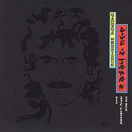
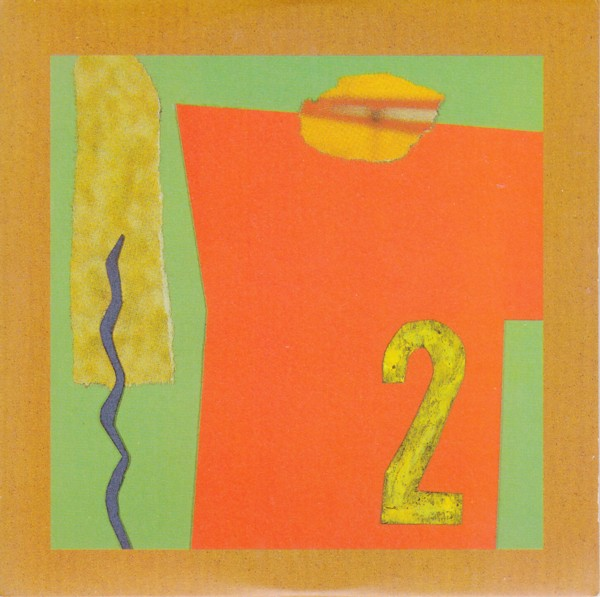

= Радио Аэростат. Глава II
:toc: left

> link:aerostat.html[Главная страница]

== 6 ноября 2005 - 16 апреля 2006

<http://old.aquarium.ru/misc/aerostat/index02.html>

++++

++++

=== "Как Рок-н-Ролл Спас Западную Цивилизацию От Вымирания", 16 апреля 2006

<http://old.aquarium.ru/misc/aerostat/aerostat48.html>

.Beatles - I Want To Hold Your Hand
image:THE BEATLES/1988 - Past Masters/cover.jpg[Past Masters,200,200,role="thumb left"]

[%hardbreaks]
Manfred Mann - Do Wah Diddy
Searchers - Sweets for My Sweet
Tremeloes - There Goes My Baby
Shocking Blue - Serenade
Troggs - Jingle Jangle
Peter & Gordon - True Love Ways
Los Bravos - Black Is Black
Zombies - She's Not There
Who - The Kids Are Alright
Gerry & The Pacemakers - It's Gonna Be Alright
The Fourmost - I'm In Love
Beatles - Devil In Her Heart
Billy J. Kramer & The Dakotas - I'll Keep You Satisfied

++++
 
++++

=== "Божественная Музыка", 9 апреля 2006

<http://old.aquarium.ru/misc/aerostat/aerostat47.html>

[%hardbreaks]
Srila GuruDeva - Shri Guru Vandanam
Family - Some Poor Soul
Pachelbel - Canon
John Lennon - Oh My Love
Jagjit Singh - Rabindranath Tagor poem
Jimi Hendrix - Angel
Joni Mitchell - California
Emerson, Lake & Palmer - Jerusalem
Jethro Tull - Look Into The Sun
Beatles - Across The Universe

++++
 
++++

=== "Беспечный Русский Бродяга", 2 апреля 2006

<http://old.aquarium.ru/misc/aerostat/aerostat46.html>

[%hardbreaks]
Аквариум - Стаканы
Аквариум - Беспечный Русский Бродяга
Аквариум - Мама, Я Не Могу Больше Пить
Аквариум - Шумелка
Аквариум - Voulez Vous Coucher Avec Moi
Аквариум - Голова Альфредо Гарсии
Аквариум - О Смысле Всего Сущего
Аквариум - Афанасий Никитин Буги
Аквариум - Дело За Мной

++++
 
++++

=== "Donovan", 26 марта 2006

<http://old.aquarium.ru/misc/aerostat/aerostat45.html>

.Donovan - Universal Soldier
image:DONOVAN/Donovan - Fairytale/cover.jpg[Fairytale,200,200,role="thumb left"]

.Donovan - Sunshine Superman
image:DONOVAN/Donovan - Love Is Hot, Truth Is Molten/cover.jpg[Love Is Hot  Truth Is Molten,200,200,role="thumb left"]

.Donovan - Hurdy Gurdy Man
image:DONOVAN/Donovan - Hurdy Gurdy Man/cover.jpg[Hurdy Gurdy Man,200,200,role="thumb left"]

.Donovan - Season Of The Witch

++++
 
++++

.Donovan - Colours

.Donovan - Writer In The Sun
image:DONOVAN/1967 - Mellow Yellow (2005, RE, with bonus tracks)/cover.png[Mellow Yellow (2005  RE  with bonus tracks),200,200,role="thumb left"]

.Donovan - Celia Of The Seals
image:DONOVAN/Donovan - HMS Donovan/cover.jpg[HMS Donovan,200,200,role="thumb left"]

.Donovan - Sunny Goodge Street

++++
 
++++

.Donovan - Catch The Wind
image:DONOVAN/Donovan - Catch The Wind/cover.jpg[Catch The Wind,200,200,role="thumb left"]

[%hardbreaks]
Donovan - A Sunny Day
Donovan - As I Recall It
Donovan - Get Thy Bearings
Donovan - Entertaintment Of a Shy Girl

++++
 
++++

=== "Голоса Из Золотого Сумрака", 19 марта 2006

<http://old.aquarium.ru/misc/aerostat/aerostat44.html>

[%hardbreaks]
Malcolm Arnold - Whistle Down The Wind
Dr. Strangely Strange - Strangely Strange But Oddly Normal
Pete Dello - Uptight Basil
Pink Floyd - San Tropez
Nick Drake - Time Of No Reply
Moody Blues - Night In White Satin
Bee Gees - I've Got to Get a Message to You
Hep Stars - Consolation
Serge Gainsburg - Je T'aime
Zombies - Time Of The Season
Tremeloes - Silence Is Golden

++++
 
++++

=== "Марк Болан", 12 марта 2006

<http://old.aquarium.ru/misc/aerostat/aerostat43.html>

[%hardbreaks]
Tyrannosaurus Rex - Life's A Gas
Tyrannosaurus Rex - Children Of The Revolution
Tyrannosaurus Rex - Beltane Walk
Tyrannosaurus Rex - Seal Of Seasons
Tyrannosaurus Rex - Chariots Of Silk
Tyrannosaurus Rex - By The Light Of A Magical Moon
Tyrannosaurus Rex - Summer Deep
Tyrannosaurus Rex - Iscariot
Tyrannosaurus Rex - Suneye
Tyrannosaurus Rex - The Visit
Tyrannosaurus Rex - Scenescof
Tyrannosaurus Rex - Dandy In The Underworld
Tyrannosaurus Rex - Girl
Tyrannosaurus Rex - Metal Guru
Tyrannosaurus Rex - A Day Laye

++++
 
++++

=== "Слово о Великой Богине", 5 марта 2006

<http://old.aquarium.ru/misc/aerostat/aerostat42.html>

.Leonard Cohen - link:LEONARD%20COHEN/Leonard%20Cohen%20-%20Ten%20New%20Songs/lyrics/ten.html#_alexandra_leaving[Alexandra Leaving]
image:LEONARD COHEN/Leonard Cohen - Ten New Songs/cover.jpg[Ten New Songs,200,200,role="thumb left"]

.Crowded House - link:CROWDED%20HOUSE/1996%20-%20The%20Very%20Best%20Of%20Crowded%20House/lyrics/house.html#_fall_at_your_feet[Fall At Your Feet]
image:CROWDED HOUSE/1996 - The Very Best Of Crowded House/folder.jpg[The Very Best Of Crowded House,200,200,role="thumb left"]

.Traveling Wilburys - link:Traveling%20Wilburys%20-%20Volume%203/lyrics/wilburys3.html#_you_took_my_breath_away[You Take My Breath Away]
image:Traveling Wilburys - Volume 3/cover.jpg[Volume 3,200,200,role="thumb left"]

.Beatles - I Will
image:THE BEATLES/The Beatles - White Album CD 1/cover.jpg[White Album CD 1,200,200,role="thumb left"]

++++
 
++++

.Robert Palmer - You Blow Me Away

[%hardbreaks]
Robert Palmer - Spellbound
Serge Gainsburg - Jane B.
Peter Gabriel - Indigo
Roxy Music - More Than This
Robert Palmer - Airplane

++++
 
++++

=== "Happy Birthday, George!", 24 февраля 2006

<http://old.aquarium.ru/misc/aerostat/aerostat41.html>

.George Harrison - link:GEORGE%20HARRISON/George%20Harrison%20-%20Brainwashed/lyrics/brainwashed.html#_any_road[Any Road]
image:GEORGE HARRISON/George Harrison - Brainwashed/cover.jpg[Brainwashed,200,200,role="thumb left"]

.George Harrison - What Is Life

.George Harrison - link:GEORGE%20HARRISON/George%20Harrison%20-%20Best%20Of%20Dark%20Horse%201976-1989/lyrics/darkhorse.html#_crackerbox_palace[Crackerbox Palace]
image:GEORGE HARRISON/George Harrison - Best Of Dark Horse 1976-1989/Folder.jpg[Best Of Dark Horse 1976-1989,200,200,role="thumb left"]

[%hardbreaks]
George Harrison - Love you Too
George Harrison - Within You Without You
George Harrison - Behind That Locked Door
George Harrison - Dear One
George Harrison - True Love
George Harrison - It Is He (Jai Sri Krsna!)
George Harrison - link:GEORGE%20HARRISON/George%20Harrison%20-%20Best%20Of%20Dark%20Horse%201976-1989/lyrics/darkhorse.html#_blow_away[Blow Away]

++++
 
++++

=== "Есенин и Электроника", 19 февраля 2006

<http://old.aquarium.ru/misc/aerostat/aerostat40.html>

[%hardbreaks]
Two Banks Of Four - Street Lullaby
Squarepusher - My Red Hot Car
Charles Dodge - She Destroyed Her Image
David Bowie - Sound and Vision
Jon Hassell - Tucan Ocean
Four Tet - No More Mosquitoes
Hot Chip - Playboy
Depeche Mode - Barrel Of The Gun
Shpongle - Dorset Perception

++++
 
++++

=== "Звук Другого Барабана", 12 февраля 2006

<http://old.aquarium.ru/misc/aerostat/aerostat39.html>

.Tom Waits - Cemetery Polka
image:TOM WAITS/Tom Waits 1985 - Rain Dogs - part 1/raindogs.png[Rain Dogs - part 1,200,200,role="thumb left"]

.Tom Waits - Hold On
image:TOM WAITS/1999 - Mule Variations/cover.jpg[Mule Variations,200,200,role="thumb left"]

.Robert Wyatt - Shipbuilding

[%hardbreaks]
Japan - Visions Of China
David Silvian - Forbidden Colours
Suzanne Vega - Gypsy
Robyn Hitchcock - Flesh Number One (Beatle Dennis)
Peter Gabriel/Robert Fripp - Here Comes The Flood
Laurie Anderson/Gabriel - Excellent Birds
Mike Oldfield - Sheba

++++
 
++++

=== "American Cousins", 5 февраля 2006

<http://old.aquarium.ru/misc/aerostat/aerostat38.html>

[%hardbreaks]
Harry Nilsson - My Old Desk
Harry Nilsson - Everybody's Talking
Tommy James - Crimson And Clover
First Edition - Just Dropped In (My Condition)
Jefferson Airplane - White Rabbit
Janis Joplin - Summertime
Creedence Crearwater Revival - Up Around The Bend
The Band - The Day They Drove
Association - Never My Love
Byrds - She Has A Way
Grateful Dead - Ripples

++++
 
++++

=== "Imbolk - Celts Galore!", 29 января 2006

<http://old.aquarium.ru/misc/aerostat/aerostat37.html>

.Van Morrison - On Raglan Road
image:VAN MORRISON/Van Morrison - Irish Heartbeat/cover.jpg[Irish Heartbeat,200,200,role="thumb left"]

[%hardbreaks]
5 Hand Reel - Both Sides Of North
Planxty - Pat Reilly
Mary Hopkin - Y Blodym Gwyn
Albion Country Band - Albion Sunrise
Silly Wizard - Wha'll Be The King
Pogues - Sick Bed Of Cuchulain
Sting/Chieftains - Mo Ghile Mear
Silly Wizard - The Loch Tay Boat Song

++++
 
++++

=== "Гитары гандхарвов", 22 января 2006

<http://old.aquarium.ru/misc/aerostat/aerostat36.html>

George Harrison - That's The Way It Goes
image:GEORGE HARRISON/George Harrison - Gone Troppo/cover.jpg[Gone Troppo,200,200,role="thumb left"]

[%hardbreaks]
Beatles - Roll Over Beethoven
Beatles - Till There Was You
Jimi Hendrix - Voodoo Chile (Slight Return)
King Crimson - The Night Watch
Cream - Swlabr
Jimi Hendrix - Little Wing
T.Rex - Root Of Star
Jimi Hendrix - Still Raining, Still Dreaming
King Crimson - Starless
George Harrison - That's The Way It Goes

++++
 
++++

=== "70-е - 2", 15 января 2006

<http://old.aquarium.ru/misc/aerostat/aerostat35.html>

.Procol Harum - Fires Which Burnt Brightly
image:PROCOL HARUM/Procol Harum - Grand Hotel/images.jpg[Grand Hotel,200,200,role="thumb left"]

.Led Zeppelin - Friends
image:LED ZEPPELIN/Led Zeppelin - III/III.jpg[III,200,200,role="thumb left"]

.Leon Redbone - She Ain't Rose

.Lou Reed - Satellite Of Love

++++
 
++++

[%hardbreaks]
Van Morrison - Brown Eyed Girl
Stealers Wheel - Stuck In The Middle With You
Richard Thompson - New St.George
Queen - Killer Queen
Mott The Hoople - Original Mixed-Up Kid
Free - Stealer
Splinter - Elly May 

++++
 
++++

=== "Мудрость пустыни", 8 января 2006

<http://old.aquarium.ru/misc/aerostat/aerostat34.html>

.Bob Dylan - link:BOB%20DYLAN/Bob%20Dylan%201993%20-%20World%20Gone%20Wrong/lyrics/world.html#_lone_pilgrim[Lone Pilgrim]
image:BOB DYLAN/Bob Dylan 1993 - World Gone Wrong/cover.jpg[World Gone Wrong,200,200,role="thumb left"]

.Jethro Tull - Another Christmas Song

.Steeleye Span - Gaudete
image:STEELEYE SPAN/Steeleye Span - Below the Salt/Folder.jpg[Below the Salt,200,200,role="thumb left"]

.Leonard Cohen - Go No More A-Roving

++++
 
++++

[%hardbreaks]
Emerson, Lake and Palmer - The Only Way
Iron Butterfly - Flowers And Beads
Jimi Hendrix - May This Be Love (Waterfall)
George Harrison - Here Comes The Moon
Melanie - What Wondrous Love
Electric Light Orchestra - One Summer Dream

++++
 
++++

=== "Свет и сладость", 1 января 2006

<http://old.aquarium.ru/misc/aerostat/aerostat33.html>

.Donovan - Jennifer Juniper
image:DONOVAN/Donovan - Hurdy Gurdy Man/cover.jpg[Hurdy Gurdy Man,200,200,role="thumb left"]

[%hardbreaks]
Archangelo Corelli - Concerto #1, D maj (1)
Gentle Giant - Think Of Me With Kindness
Cocteau Twins - Athol-brose
Don McLean - Birthday Song
Byrds - Fifth Dimension
Bob Marley - Stir It Up
Paul McCartney - Heart of The Country
Eurythmics - Right By Your Side
Mary Hopkin - The Cherry Tree Carol
Cat Stevens - The Wind
The Beatles - I'll Be On My Way

++++
 
++++

=== "Рождественские песни", 25 декабря 2005

<http://old.aquarium.ru/misc/aerostat/aerostat32.html>

.Jethro Tull - Christmas Song
image:JETHRO TULL/1972  Living In The Past/cover.jpg[Living In The Past,200,200,role="thumb left"]

[%hardbreaks]
We wish you a Merry Christmas!
Slade - Merry Christmas, Everybody
Hark! The Angels Sing
Bing Crosby - Good King Wenceslas
Simon & Garfunkel - God rest Ye, Merry Gentlemen
Enya - Silent Night
Frank Sinatra - Jingle Bells
Greg Lake - I Believe In Father Christmas
South Park - Merry Fucking Christmas
Let It Snow!
Paul McCartney - Wonderful Christmas Time
Elvis Presley - Blue Christmas
John Lennon - Happy Christmas (War Is Over)

++++
 
++++

=== "Позитивные Вибрации С Солнечного Острова или Чему Джа Растафари научил своих детей", 18 декабря 2005

<http://old.aquarium.ru/misc/aerostat/aerostat31.html>

[%hardbreaks]
Bob Marley - Natty Dread
Toots & The Maytals - Pressure Drop
Melodians - Rivers Of Babylon
Culture - International Herb
Max Romeo - Chase The Devil
Bob Marley - Easy Skanking
Specials - Dawning Of A New Era
English Beat - Ranking Full Stop
Black Uhuru - Youth Of Eglington
Bob Marley - Three Little Birds

++++
 
++++

=== "Музыка Безмятежной Неги", 11 декабря 2005

<http://old.aquarium.ru/misc/aerostat/aerostat30.html>

.Glenn Miller - When You Wish Upon A Star
image:Glenn Miller/The Complete Glenn Miller/cover.png[The Complete Glenn Miller,200,200,role="thumb left"]

[%hardbreaks]
Beatles - Honey Pie
Glenn Miller - My Melancholy Baby
Al Bowlly - Love Is The Sweetest Thing
Marlene Dietrich - Falling In Love Again
Mills Brothers - Nagasaki
Flanagan & Allen - Underneath The Arches
Ink Spots - Your Feet's Too Big
Bing Crosby - White Christmas
Jack Buchanan - Goodnight Vienna
Glenn Miller - Say "Si Si"

++++
 
++++

=== "Этно Снова На Коне", 4 декабря 2005

<http://old.aquarium.ru/misc/aerostat/aerostat29.html>

[%hardbreaks]
Дживан Гаспарян
Arto Tunc Boyaciyan - Black Water
Serart - Leave Melody Counting Fear
John Chibadura - Zuva Rekufa Kwangu
Srila Gurudeva - Sri Nama Kirtana
Astrud Gilberto - Quiet nights
Harry Belafonte - Day O
George Brassens - Copain D'Abord
Beatles - The Inner Light

++++
 
++++

=== День Рождения, 27 ноября 2005

<http://old.aquarium.ru/misc/aerostat/aerostat28.html>

.Jethro Tull - Cup Of Wonder
image:JETHRO TULL/1977  Songs From The Wood/cover.jpg[Songs From The Wood,200,200,role="thumb left"]

.R.E.M. - link:REM/REM%20-%20Reveal/lyrics/reveal.html#_imitation_of_life[Imitation Of Life]
image:REM/REM - Reveal/cover.jpg[Reveal,200,200,role="thumb left"]

[%hardbreaks]
Mary Hopkin - Young Love
George Harrison - Give Me Love
King Crimson - Book Of Saturdays
Jacques Brel - Ne Me Quittes Pas
Paul Simon - Father And Daughter
Eurythmics - When Tomorrow Comes
Don McLean - Crossroads
Bach - "Air" from Orchestra Suite No. 3

++++
 
++++

=== "Голоса Гандхарвов", 20 ноября 2005

<http://old.aquarium.ru/misc/aerostat/aerostat27.html>

.Jethro Tull - link:JETHRO%20TULL/Jethro%20Tull%20-%20Heavy%20Horses/lyrics/horses.html#_moths[Moths]
image:JETHRO TULL/Jethro Tull - Heavy Horses/cover.jpg[Heavy Horses,200,200,role="thumb left"]

.Donovan - Wear Your Love Like Heaven
image:DONOVAN/Donovan - A Gift From a Flower to a Garden/cover.jpg[A Gift From a Flower to a Garden,200,200,role="thumb left"]

[%hardbreaks]
Sheila Chandra - Om Shiva Namaha
Robert Plant - If It's Really Got To Be This Way
Eurythmics - 1984
Jeff Lynne - Blown Away
T.Rex - Wind Cheetah
Cocteau Twins - Kookaburra
John Lennon - Mind Games
Beach Boys - God Only Knows
Beatles - All You Need Is Love

++++
 
++++

=== "Поучительная История Б. Дилана", 13 ноября 2005

<http://old.aquarium.ru/misc/aerostat/aerostat26.html>

.Bob Dylan - link:BOB%20DYLAN/Bob%20Dylan%201963%20-%20Blowing%20In%20The%20Wind/lyrics/blowing.html#_it_ain_t_me_babe[It Ain't Me]
image:BOB DYLAN/Bob Dylan 1963 - Blowing In The Wind/cover.jpg[Blowing In The Wind,200,200,role="thumb left"]

.Bob Dylan - It's All Over Now, Baby Blue

.Bob Dylan - John Wesley Harding
image:BOB DYLAN/Bob Dylan 1967 - John Wesley Harding/cover.jpg[John Wesley Harding,200,200,role="thumb left"]

.Bob Dylan - Oh, Sister

++++
 
++++

.Bob Dylan - Po' Boy
image:BOB DYLAN/Bob Dylan 2001 - Love And Theft/cover.jpg[Love And Theft,200,200,role="thumb left"]

[%hardbreaks]
Bob Dylan - link:BOB%20DYLAN/Bob%20Dylan%201963%20-%20Blowing%20In%20The%20Wind/lyrics/blowing.html#_positively_4th_street[Positively 4th Street]
Bob Dylan - link:BOB%20DYLAN/Bob%20Dylan%201963%20-%20Blowing%20In%20The%20Wind/lyrics/blowing.html#_just_like_a_woman[Just Like A Woman]
Bob Dylan - link:BOB%20DYLAN/Bob%20Dylan%201963%20-%20Blowing%20In%20The%20Wind/lyrics/blowing.html#_like_a_rolling_stone[Like A Rolling Stone]

++++
 
++++

=== "Странные песни, странные люди, безоблачный мир", 6 ноября 2005

<http://old.aquarium.ru/misc/aerostat/aerostat25.html>

.Donovan - Jabberwocky
image:DONOVAN/Donovan - HMS Donovan/cover.jpg[HMS Donovan,200,200,role="thumb left"]

[%hardbreaks]
Tiny Tim - Tiptoe Through The Tulips
Scaffold - 2days Monday
Trio - Da Da Da
Ivor Cutler - A Great Grey Grasshopper
Frank Zappa - Let's Make The Water Turn Black/The Idiot Bastard Son
This Heat - Deep Sleep
Tiger Lillies - Terrible
Beck - Truckdriving Neighbours
Fun Boy Three - The Lunatics
Incredible String Band - The Hedgehog Song
George Harrison - Singing Om
David Bowie - African Night Flight
Tyrannosaurus Rex - Wind Quartets

