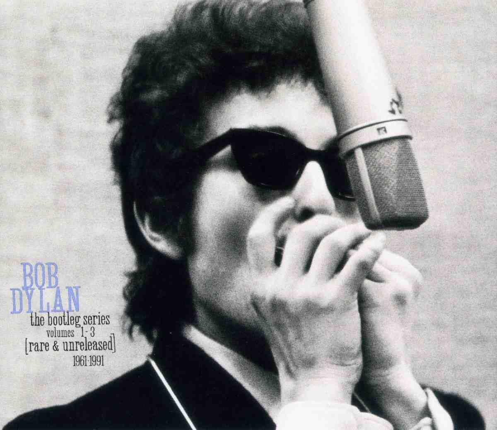
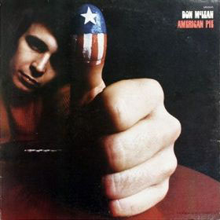
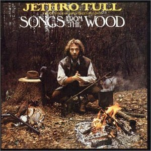
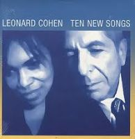

= Радио Аэростат. Глава III
:toc: left

> link:aerostat.html[<Home>]
> link:toc.html[<Contents>]
> link:lyrics.html[<Lyrics>]

== 23 апреля 2006 - 1 октября 2006

<http://old.aquarium.ru/misc/aerostat/index03.html>

++++

++++

=== История Джеффа Линна, 1 октября 2006

<http://old.aquarium.ru/misc/aerostat/aerostat72.html>

.Traveling Wilburys - New Blue Moon
image:Traveling Wilburys - Volume 3/cover.jpg[Volume 3,200,200,role="thumb left"]

.Idle Race - Girl At The Window
image:Idle Race/Idle Race/Idle_Race_(album).jpeg[Idle Race,200,200,role="thumb left"]

.Idle Race - Morning Sunshine
image:Idle Race/Birthday Party/Folder.jpg[Birthday Party,200,200,role="thumb left"]

[%hardbreaks]
Electric Light Orchestra - Mr.Radio
Electric Light Orchestra - Queen Of The Hours
Electric Light Orchestra - Telephone Line
Jeff Lynne - Now You're Gone
Electric Light Orchestra - Moments Of Paradise
Jeff Lynne - September Song
Jeff Lynne - Every Little Thing

++++
 
++++

=== Ирландское Рагу No.3 (и ремиксы), 24 сентября 2006

<http://old.aquarium.ru/misc/aerostat/aerostat71.html>

.Сotton Mather - Baby Freeze Queen
image:COTTON MATHER/Cotton Mather - Kon Tiki/Folder.jpg[Kon Tiki,200,200,role="thumb left"]

[%hardbreaks]
Cornelius/Beck - Mixed Business
Cornelius - The MicroDisney World Tour (High Llamas Mix)
Aphex Twin - Heroes (Bowie, Glass) Remiх
Terry Hall & Mushtaq - Ten Eleven
The Hollies - Carrie Ann
Family - Mellowing Grey
The Hollies - Rain On My Window
Сornelius - GariGari Kun

++++
 
++++

=== Кот Да Винчи, 17 сентября 2006

<http://old.aquarium.ru/misc/aerostat/aerostat70.html>

.Archie Fisher - Helen Of Kirkconell Lee 
image:ARCHIE FISHER/1976 - The Man with a Rhyme/cover.jpg[The Man with a Rhyme,200,200,role="thumb left"]

[%hardbreaks]
Hot Chip - Ass Attack
Platti - Sonate No.6 op.3 per oboe e cembalo
Gentle Giant - Raconteur Troubadour
Perfect Circle - Blue
Jack Bruce - Can You Follow?
Knifehandchop- Sunjammer Is My Favourite Pokemon
Mac-Talla - Griogal Cridhe
Queens Of The Stone Age - The Lost Art Of Keeping A Secret
Monastic Choir of Solesmes - In Pace & Psalm 4
Mary Hopkin - Prince en Avignon

++++
 
++++

=== Новые альбомы, 10 сентября 2006

<http://old.aquarium.ru/misc/aerostat/aerostat69.html>

.Sufjan Stevens - Chicago
image:SUFJAN STEVENS/Sufjan Stevens 2005 - Illinoise/Folder.jpg[Illinoise,200,200,role="thumb left"]

.Tom Petty - Saving Grace
image:TOM PETTY/Tom Petty - Highway Companion/cover.jpg[Highway Companion,200,200,role="thumb left"]

[%hardbreaks]
Thom Yorke - Analyze
Bob Neuwirth - Haul On The Bowline
Русско-Абиссинский Оркестр - Charam Charam
William Elliott Whitmore - Midnight
Micah P. Hinson - The Dreams You Left Behind
Robert Harrison - Build Havana
Pink Floyd - Scarecrow
Bob Dylan - Beyond The Horizon

++++
 
++++

=== Общие принципы употребления алкогольных напитков, 3 сентября 2006

<http://old.aquarium.ru/misc/aerostat/aerostat68.html>

.Tom Waits - Jockey Full Of Bourbon
image:TOM WAITS/Tom Waits 1985 - Rain Dogs - part 1/raindogs.png[Rain Dogs - part 1,200,200,role="thumb left"]

.Leon Redbone - Champagne Charlie
image:LEON REDBONE/Champagne Charlie/cover.jpg[Champagne Charlie,200,200,role="thumb left"]

[%hardbreaks]
Robin Laing - More Than Just
Splinter - Drink All Day
Roger McGuinn - Finnegan's Wake
UB40 - Red Red Wine
Silly Wizard - Parish Of Dunkeld
Pierre Perret - Le Vin
Pogues - If I Should Fall From Grace With God
Paul McCartney - Drink To Me
Robin Laing - Tak a Drum

++++
 
++++

=== Слово Растаману, 27 августа 2006

<http://old.aquarium.ru/misc/aerostat/aerostat67.html>

[%hardbreaks]
Wailers - Get Up, Stand Up
Toots And The Maytals - Sweet & Dandy
Burning Spear - Jah No Dead (film version)
Big Youth - Jah Jah Children Moving
Eddy Grant - How Do You Feel My Love
Althea & Donna - Uptown Top Ranking
Serge Gainsburg - Marceilleuse
UB 40 - Kingston Town
Sizzla - Jah Is Love
Beanie Man - Selassie
Bob Marley - Redemption Song

++++
 
++++

=== Ирландское Рагу 2, 20 августа 2006

<http://old.aquarium.ru/misc/aerostat/aerostat66.html>

.Crowded House - Distant Sun
image:CROWDED HOUSE/1993 - Together Alone/front.jpg[Together Alone,200,200,role="thumb left"]

[%hardbreaks]
Muse - Supermassive Black Hole
Emerson, Lake & Palmer - Jeremy Bender
Gabriel Faure - Berceuse from "Dolly"
Black Grape - In The Name Of The Father
Frank Zappa - The Legend Of The Golden Arches
Roy Orbison - Pretty One
Bob Geldov - The Great Song Of Indifference
The Buggles - Video Killed A Radio Star
Kate Rusby - The Daughter Of Megan
The Crimea - Lottery Winners On Acid

++++
 
++++

=== Мосты Между Небом и Землей, 13 августа 2006

<http://old.aquarium.ru/misc/aerostat/aerostat65.html>

[%hardbreaks]
George Harrison - Singing Om
Ravi Shankar - Vandanaa Trayee
Radha Krishna Temple - Govinda
George Harrison - Fantasy Sequins
Beatles - Love You Too
Gjaan Karo - 1
Srila Gurudeva - Sri Guru Vandanam
George Harrison - Dream Scene
Krishna Das - Kashi Vishvanath Gange
Jagjit Singh - Om Shivay Hari Om Shivay

++++
 
++++

=== Дорогая Мария Васильевна!, 6 августа 2006

<http://old.aquarium.ru/misc/aerostat/aerostat64.html>

[%hardbreaks]
J.S.Bach - Well-Tempered Klavier
Tommazo Albinoni - Concerto G maj, Allegro
Russian Abyssinian Orchestra - Sirakh Malatoy Tan
Дживан Гаспарян - Dle Yaman
Edith Piaf - L'Hymne a l'amour
Nirvana - Smells Like Teen Spirit
Elvis Presley - The Girl Of My Best Friend
БГ - Таруса
Jeff Lynne - Don't Say Goodbye
Ima Sumak - Chuncho

++++
 
++++

=== Лунассад, 30 июля 2006

<http://old.aquarium.ru/misc/aerostat/aerostat63.html>

[%hardbreaks]
Albion Band - Aboard For Pleasure
The Whistlebinkies - John Roy Stewart
Robin Williamson - Return No More
Robin Laing - John Barleycorn
The Whistlebinkies - Wendell's Wedding
Albion Band - Along The Pilgrim's Way
Kate Rusby - Bonnie House Of Airlie
5 Hand Reel - The Knight & Shepherd's Daughter
Silly Wizard - Golden Golden

++++
 
++++

=== Слово О Мистиках, 23 июля 2006

<http://old.aquarium.ru/misc/aerostat/aerostat62.html>

[%hardbreaks]
Gottfried Stolzer - Trumphet concerto, part 1
George Harrison - Behind That Locked Door
Geraint Watkins - Be My Love
J.S. Bach - Fugue in C (Flanders Quartet)
Cat Stevens - Morning Has Broken
Flook! - Bruno
Herman's Hermits - Silhuettes
Shri Chinmoy - Tamase Rate (Bengali Songs 2)
Grateful Dead - Stella Blue
Jeff Lynne - Lift Me Up

++++
 
++++

=== Ирландское рагу, 16 июля 2006

<http://old.aquarium.ru/misc/aerostat/aerostat61.html>

[%hardbreaks]
The Who - Heinz Baked Beans
Pablo Lubadika Porthos - Madaleine
Venetian Snares - Hand Throw
Napalm Death - Impressions
Of Montreal - City Bird
Nick Cave - The Ship Song
Noel Coward - Mad Dogs And Englishmen
Robert Palmer - It Could Happen To Me
Satie - Trois Gymnopedies 1
The Who - Mary-Anne with the Shaky Hands
Wilson Pickett - Land Of 1000 Dances
Sandy Denny - White Dress
Simon & Garfunkel - Flowers Never Bend

++++
 
++++

=== Джаз!, 9 июля 2006

<http://old.aquarium.ru/misc/aerostat/aerostat60.html>

.Glenn Miller - Melancholy Baby
image:Glenn Miller/The Complete Glenn Miller/cover.png[The Complete Glenn Miller,200,200,role="thumb left"]

[%hardbreaks]
George Shearing - Making Whoopee
Charlie Parker - Bird Gets The Worm
Miles Davis - Nuit Sur Les Champ-Elysees (take 2)
Art Blakey - Moanin'
Louis Armstrong - It Don't Mean A Thing
John Coltrane - My Favourite Things
Thelonius Monk - Monk's Dream
Donovan - The Observation
Dave Brubeck - Take Five 

++++
 
++++

=== КСП USA, 2 июля 2006

<http://old.aquarium.ru/misc/aerostat/aerostat59.html>

.Bob Dylan - Eternal Circle

.Simon & Garfunkel - Homeward Bound
image:SIMON & GARFUNKEL/Simon & Garfunkel - Parsley, Sage, Rosemary and Thyme/cover.jpg[Parsley  Sage  Rosemary and Thyme,200,200,role="thumb left"]

.Don McLean - Empty Chairs

.Joni Mitchell - Gallery
image:JONI MITCHELL/Joni Mitchell - Clouds/cover.jpg[Clouds,200,200,role="thumb left"]

++++
 
++++

[%hardbreaks]
Kris Kristoferson - Silver Tongued Devil
Judee Sill - Crayon Angels
James Taylor - Sweet Baby James
Crosby, Stills & Nash - Suite: Judy Blue Eyes
Neil Young - Heart Of Gold
Arlo Guthrie - City Of New Orleans

++++
 
++++

=== Вечнозеленый Бомж, 25 июня 2006

<http://old.aquarium.ru/misc/aerostat/aerostat58.html>

.Jethro Tull - Aqualung
image:JETHRO TULL/1971  Aqualung/cover.jpg[1971  Aqualung,200,200,role="thumb left"]

.Jethro Tull - Skating Away On the Thin Ice

.Jethro Tull - I Don' Want To Be Me
image:JETHRO TULL/1993  Nightcap (Your Round) - Unrele/cover.jpg[Unrele,200,200,role="thumb left"]

.Jethro Tull - Slow Marching Band
image:JETHRO TULL/1982  Broadsword & The Beast/cover.jpg[1982 Broadsword The Beast,200,200,role="thumb left"]

++++
 
++++

.Jethro Tull - We Used To Know
image:JETHRO TULL/Jethro Tull - Stand Up/cover.jpg[Stand Up,200,200,role="thumb left"]

.Jethro Tull - Velvet Green

.Jethro Tull - Requiem
image:JETHRO TULL/1975  Minstrel In The Gallery/cover.jpg[1975  Minstrel In The Gallery,200,200,role="thumb left"]

[%hardbreaks]
Jethro Tull - Bouree
Jethro Tull - Strip Cartoon

++++
 
++++

=== С днем рождения, Пол, 18 июня 2006

<http://old.aquarium.ru/misc/aerostat/aerostat57.html>

.Beatles - When I'm 64
image:THE BEATLES/1967a - Sgt Peppers Lonely Hearts Club Band/cover.jpg[Sgt Peppers Lonely Hearts Club Band,200,200,role="thumb left"]

[%hardbreaks]
Paul McCartney - Every Night
Paul McCartney - Tug Of War
Beatles - Eleanor Rigby
Paul McCartney - Little Lamb Dragonfly
Beatles - I Will
Paul McCartney - My Baby's Request
Beatles - Michelle
Paul McCartney - Winter Rose
Beatles - Martha My Dear
Beatles - For No One
Beatles - Golden Slumbers

++++
 
++++

=== Новая Волна, 11 июня 2006

<http://old.aquarium.ru/misc/aerostat/aerostat56.html>

.Talking Heads - Once in a Lifetime

[%hardbreaks]
Devo - Whip It
Gary Numan - Are Friends Electric?
XTC - Making Plans For Nigel
Visage - We Fade To Grey
The Jam - Going Underground
Police - Message In The Bottle
Eurythmics - Sweet Dreams
Roxy Music - Do The Strand
Elvis Costello - Oliver's Army

++++
 
++++

=== The Kinks, 4 июня 2006

<http://old.aquarium.ru/misc/aerostat/aerostat55.html>

[%hardbreaks]
The Kinks - Dedicated Follower Of Fashion
The Kinks - Sunny Afternoon
The Kinks - You Really Got Me
The Kinks - Well Respected Man
The Kinks - Tired Of Waiting For You
The Kinks - Victoria
The Kinks - Village Green Preservation Society
The Kinks - Dead End Street
The Kinks - Death Of The Clown
The Kinks - See My Friends
The Kinks - Days
The Kinks - Waterloo Sunset 

++++
 
++++

=== Медитация, 28 мая 2006

<http://old.aquarium.ru/misc/aerostat/aerostat54.html>

.Beatles - Fool On The Hill
image:THE BEATLES/1967b - Magical Mystery Tour/cover.jpg[Magical Mystery Tour,200,200,role="thumb left"]

[%hardbreaks]
Bhajan - Shirdi Sai
Lassus - Lustorum Animae
Leopold Mozart - Trumpet Concerto No.1
Beach Boys - Surf's Up
Richard Clayderman & Rahul Sharma - The Confluence
Krishna Das - Om Namah Shivaya
Shri Chinmoy's Play

++++
 
++++

=== Песни и Как Их Писать, 21 мая 2006

<http://old.aquarium.ru/misc/aerostat/aerostat53.html>

.Bob Dylan - You Angel You

.Paul Simon - So Long, Frank Lloyd Wright
image:SIMON & GARFUNKEL/Simon & Garfunkel - Bridge Over Troubled Water/cover.jpg[Bridge Over Troubled Water,200,200,role="thumb left"]

.Beatles - Being For The Benefit Of Mr. Kite
image:THE BEATLES/1967a - Sgt Peppers Lonely Hearts Club Band/cover.jpg[Sgt Peppers Lonely Hearts Club Band,200,200,role="thumb left"]

.Lou Reed - Men Of Good Fortune
image:Velvet Undeground/1973 - Berlin/Folder.jpg[Berlin,200,200,role="thumb left"]

++++
 
++++

.Leonard Cohen - link:LEONARD%20COHEN/Leonard%20Cohen%20-%20Ten%20New%20Songs/lyrics/ten.html#_in_my_secret_life[In My Secret Life]

.Donovan - Skip Along Sam
image:DONOVAN/Donovan - A Gift From a Flower to a Garden/cover.jpg[A Gift From a Flower to a Garden,200,200,role="thumb left"]

.Richard Thompson - Dry My Tears And Move On

[%hardbreaks]
Rolling Stones - New Faces
Creedence Clearwater Revival - Looking Out Of My Back Door
Byrds - She Has A Way
Tom Petty - Hard To Find A Friend

++++
 
++++

=== Новенькое, 14 мая 2006

<http://old.aquarium.ru/misc/aerostat/aerostat52.html>

.Red Hot Chili Peppers - Storm In A Teacup

.Tom Petty - link:TOM%20PETTY/Tom%20Petty%20-%20Highway%20Companion/lyrics/highway.html#_square_one[Square One]
image:TOM PETTY/Tom Petty - Highway Companion/cover.jpg[Highway Companion,200,200,role="thumb left"]

.Morrisey - link:MORRISSEY/2006%20-%20Ringleader%20of%20the%20Tormentors/lyrics/ringleader.html#_i_ll_never_be_anybody_s_hero_now[I'll Never Be Anybody's Hero Now]
image:MORRISSEY/2006 - Ringleader of the Tormentors/cover.jpg[Ringleader of the Tormentors,200,200,role="thumb left"]

[%hardbreaks]
Bob Dylan - Tell Ol' Bill
Dirty Pretty Things - Bang Bang You're Dead
Chikinki - Ether Radio
46Bliss - In A Long Time
System Of A Down - Attack
Margot & The Nuclear So's & So's - Paper Kitten Nightmare
Paul Simon - Surprise

++++
 
++++

=== Traveling Wilburys, 7 мая 2006

<http://old.aquarium.ru/misc/aerostat/aerostat51.html>

.Traveling Wilburys - link:Traveling%20Wilburys%20-%20Volume%201/lyrics/wilburys1.html#_dirty_world[Dirty World]
image:Traveling Wilburys - Volume 1/cover.jpg[Volume 1,200,200,role="thumb left"]

.Traveling Wilburys - link:Traveling%20Wilburys%20-%20Volume%203/lyrics/wilburys3.html#_nobody_s_child[Nobody's Child]
image:Traveling Wilburys - Volume 3/cover.jpg[Volume 3,200,200,role="thumb left"]

[%hardbreaks]
Traveling Wilburys - link:Traveling%20Wilburys%20-%20Volume%201/lyrics/wilburys1.html#_handle_with_care[Handle Me With Care]
Traveling Wilburys - link:Traveling%20Wilburys%20-%20Volume%201/lyrics/wilburys1.html#_last_night[Last Night]
Traveling Wilburys - link:Traveling%20Wilburys%20-%20Volume%201/lyrics/wilburys1.html#_end_of_the_line[End Of The Line]
Traveling Wilburys - link:Traveling%20Wilburys%20-%20Volume%203/lyrics/wilburys3.html#_7_deadly_sins[7 Deadly Sins]
Traveling Wilburys - link:Traveling%20Wilburys%20-%20Volume%203/lyrics/wilburys3.html#_7_deadly_sins[Not Alone Anymore]
Traveling Wilburys - link:Traveling%20Wilburys%20-%20Volume%201/lyrics/wilburys1.html#_tweeter_and_the_monkey_man[Tweeter And The Monkey Man]
Traveling Wilburys - link:Traveling%20Wilburys%20-%20Volume%201/lyrics/wilburys1.html#_congratulations[Congratulations]
Traveling Wilburys - link:Traveling%20Wilburys%20-%20Volume%203/lyrics/wilburys3.html#_inside_out[Inside Out]

++++
 
++++

=== Белтайн, 30 апреля 2006

.Silly Wizard - Loch Tag Boat Song
image:SILLY WIZARD/Silly Wizard - Kiss The Tears Away/cover.jpg[Kiss The Tears Away,200,200,role="thumb left"]

.Silly Wizard - Bridget O-Malley
image:SILLY WIZARD/Silly Wizard - So Many Partings/cover.jpg[So Many Partings,200,200,role="thumb left"]

.Archie Fisher - Twa Bonnie Maidens
image:ARCHIE FISHER/1976 - The Man with a Rhyme/cover.jpg[The Man with a Rhyme,200,200,role="thumb left"]

[%hardbreaks]
Jean Ives Le Pape - Down In Sally Gardens
Planxty - Si Bheag, Si Mhor
Robin Dransfield - Spencer The Rover
Kate Rusby - The Duke And The Tinker
Robin Laing - Summer Of '46
5 Hand Reel - Carrickfergus
Sandy Denny - Winter Winds

++++
 
++++

=== "Пока Несут Сакэ!", 23 апреля 2006

<http://old.aquarium.ru/misc/aerostat/aerostat49.html>

.Cotton Mather - link:COTTON%20MATHER/Cotton%20Mather%20-%20Kon%20Tiki/lyrics/kontiki.html#_she_s_only_cool[She's Only Cool]
image:COTTON MATHER/Cotton Mather - Kon Tiki/Folder.jpg[Kon Tiki,200,200,role="thumb left"]

.Red Hot Chili Peppers - Dani California
image:RED HOT CHILI PEPPERS/Red Hot Chili Peppers - Stadium Arcadium (Disc 1)/cover.jpg[Stadium Arcadium (Disc 1),200,200,role="thumb left"]

[%hardbreaks]
Darin Murphy - Boxing Day
Lucksmiths - Synchronized Sinking
Cocorosie - Angel Song
Shooglenifty - Bjorks's Chauffeur
Minders - Light
Nobukazu Takemura - Croon
Magnetic Fields - I Don't Believe You

---

> link:aerostat.html[<Home>]
> link:toc.html[<Contents>]
> link:lyrics.html[<Lyrics>]
