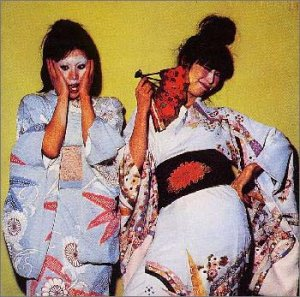
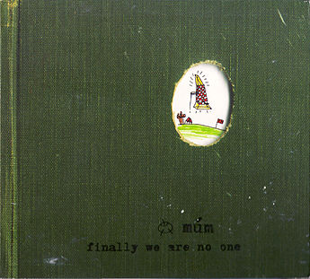

= Радио Аэростат. Глава IV
:toc: left

> link:aerostat.html[Главная страница]

== 8 октября 2006 - 18 марта 2007

<http://old.aquarium.ru/misc/aerostat/index04.html>

++++

++++

=== The Grateful Dead, 18 марта 2007

<http://old.aquarium.ru/misc/aerostat/aerostat96.html>

[%hardbreaks]
The Grateful Dead - Terrapin Station
The Grateful Dead - Casey Jones
The Grateful Dead - Cumberland Blues
The Grateful Dead - Rosemary
The Grateful Dead - Box Of Rain
The Grateful Dead - Help On The Way
The Grateful Dead - Slipknot
The Grateful Dead - Franklin's Tower
The Grateful Dead - Ship Of Fools

++++
 
++++

=== Квасса-Квасса или Этно-3, 11 марта 2007

<http://old.aquarium.ru/misc/aerostat/aerostat95.html>

[%hardbreaks]
S.E. Rogie - Jojo Yalahjo
Hedningarna - Gorrlaus
Ofra Haza - Im Nin'Alu
Lunasa - Fest Nos
Kanda Bongo Man - Sai
R. L. Burnside - Hard Time Killing Floor
Мамонов - Золушка
Le Mystere Des Voix Bulgares - Kaval Sviri
Juluka - Akanaki Nobunaga

++++
 
++++

=== О любви, 4 марта 2007

<http://old.aquarium.ru/misc/aerostat/aerostat94.html>

.Crowded House - link:CROWDED%20HOUSE/1996%20-%20The%20Very%20Best%20Of%20Crowded%20House/lyrics/house.html#_into_temptation[Into Temptation]
image:CROWDED HOUSE/1996 - The Very Best Of Crowded House/folder.jpg[The Very Best Of Crowded House,200,200,role="thumb left"]

.Leonard Cohen - link:LEONARD%20COHEN/Leonard%20Cohen%20-%20Ten%20New%20Songs/lyrics/ten.html#_a_thousand_kisses_deep[A Thousand Kisses Deep]
image:LEONARD COHEN/Leonard Cohen - Ten New Songs/cover.jpg[Ten New Songs,200,200,role="thumb left"]

[%hardbreaks]
Glen Weston - What Is A Youth?
Robert Palmer - Know By Now
David Bowie - Wild as The Wind
Mary Hopkin - The Fields Of St. Etienne
Аквариум - Услышь Меня, Хорошая
Kate Rusby - Sweet Bride
Beatles - It's Only Love
Paul Simon - Love

++++
 
++++

=== Музыка Индии, 25 февраля 2007

<http://old.aquarium.ru/misc/aerostat/aerostat93.html>

[%hardbreaks]
George Harrison - Microbes
Ravi Shankar - Omkaaraaya Namaha
Ravi Shankar - Gaayatri
Ravi Shankar - Poornamadah
Bhatt-Manjubdar - Raga Mand (Dhun)
Ravi Shankar - Raga Kafi (Dhun)
Vidyadhar Vyas - Raga Bhairavi
Jagjit & Chitra Singh - Hare Krishna
Sri Chinmoy - Dheyani Nehari
George Harrison - Mystical One

++++
 
++++

=== Искатель Бога Cat Stevens, он же - Юсуф Ислам, 18 февраля 2007

<http://old.aquarium.ru/misc/aerostat/aerostat92.html>

[%hardbreaks]
Cat Stevens - Longer Boats
Cat Stevens - Katmandu
Cat Stevens - Moonshadow
Cat Stevens - Into White
Cat Stevens - But I Might Die Tonight
Cat Stevens - Father and Son
Cat Stevens - Sad Lisa
Cat Stevens - Oh Very Young
Yusuf Islam - If You Ask Me
Yusuf Islam - Don't Let Me Be Misunderstood
Yusuf Islam - Midday

++++
 
++++

=== Cocteau Twins, 11 февраля 2007

<http://old.aquarium.ru/misc/aerostat/aerostat91.html>

[%hardbreaks]
Cocteau Twins - Evangeline
Cocteau Twins - Beatrix
Cocteau Twins - Aloysius
Cocteau Twins - The Itchy Glowbo Blow
Cocteau Twins - Amelia
Cocteau Twins - Persephone
Cocteau Twins - Cherry Coloured Funk
Cocteau Twins - Carolyn's Fingers
Cocteau Twins - Blue Bell Knoll
Cocteau Twins - Donimo 

++++
 
++++

=== Traffic, 4 февраля 2007

<http://old.aquarium.ru/misc/aerostat/aerostat90.html>

[%hardbreaks]
Traffic - Coloured Rain
Traffic - No Face, No Name, No Number
Traffic - Heaven Is In Your Mind
Traffic - Paper Sun
Traffic - Hole In My Shoe
Traffic - Here We Go 'Round The Mulberry Bush
Traffic - Dear Mr. Fantasy
Traffic - Don't Be Sad
Traffic - 40 000 Headmen
Traffic - Vagabond Virgin

++++
 
++++

=== Памятка Паломнику по Европе, 28 января 2007

<http://old.aquarium.ru/misc/aerostat/aerostat89.html>

[%hardbreaks]
Flook! - Rosbeg
Emerson, Lake & Palmer - Take A Pebble
The Chieftains - Tip of the Whistle
Radiohead - Kid A
King Crimson - I Talk to the Wind
Boards Of Canada - Peacock Tail
Palestrina - O Bone Jesu A6
Robin Williamson - Verses in the Stewart St.
Battlefield Band - Happy Daze

++++
 
++++

=== Tom Petty, 21 января 2007

<http://old.aquarium.ru/misc/aerostat/aerostat88.html>

.Tom Petty - You Got Lucky
image:TOM PETTY/Tom Petty - Long After Dark/Folder.jpg[Long After Dark,200,200,role="thumb left"]

.Tom Petty - You Wreck Me
image:TOM PETTY/Tom Petty 1994 - Wildflowers/cover.jpg[Wildflowers,200,200,role="thumb left"]

.Tom Petty - Free Fallin'
image:TOM PETTY/Tom Petty And The Heartbreakers - Greatest Hits/cover.jpg[Greatest Hits,200,200,role="thumb left"]

.Tom Petty - The Dark Of The Sun
image:TOM PETTY/Tom Petty 1991 - Into the Great Wide Open/Folder.jpg[Into the Great Wide Open,200,200,role="thumb left"]

++++
 
++++

[%hardbreaks]
Tom Petty - Angel Dream (No.4)
Tom Petty - It'll All Work Out
Tom Petty - The Last DJ
Tom Petty - California
Tom Petty - Girl On LSD
Tom Petty - Don't Treat Me like A Stranger
Tom Petty - Time To Move On

++++
 
++++

=== Содержимое Моей Головы, 14 января 2007

<http://old.aquarium.ru/misc/aerostat/aerostat87.html>

[%hardbreaks]
Dillinger Escape Plan - We Are The Storm
Palestrina - Exultate Deo
Penguin Cafe Orchestra
Gorillaz vs. Spacemonkeyz - Slow Country
Crash Test Dummies - Mmm Mmm Mmm
Charlie Parker - Milestones
Yusuf Islam - Bismillah
Atrium Musicae - Allemande Tripla
Grinderman - Get It On
Flanagan & Allen - Round The Back Of The Arches
Twilight Electric - Table Tennis Breeze
Chemical Brothers - Let Forever Be
Donovan - Aye My Love

++++
 
++++

=== 10 лучших групп за последние 2006 лет, 7 января 2007

<http://old.aquarium.ru/misc/aerostat/aerostat86.html>

.R.E.M. - Bad Day

[%hardbreaks]
Rolling Stones - Don't Stop
Radiohead - No Surprises
Led Zeppelin - Over The Hill & Far Away
Jethro Tull - Life's A Long Song
Grateful Dead - Dupree's Diamond Blues
Doors - Shaman's Blues
Cocteau Twins - Aikea Guinea
Red Hot Chili Peppers - Otherside
Beatles - She Said She Said

++++
 
++++

=== С Наступающим!, 31 декабря 2006

<http://old.aquarium.ru/misc/aerostat/aerostat85.html>

[%hardbreaks]
Cindy Lauper - Girls Just Want To Have Fun
Splinter - Costafine Town
Swingle Singers - J.S. Bach Bourre (Eng.Suite #2)
Jethro Tull - Wond'ring Aloud
Red Hot Chili Peppers - The Zephir Song
Harry Nilsson - Everybody's Talking
Peter & Gordon - True Love Ways
Stevie Wonder - Happier Than The Morning Sun
Yusuf Islam - Maybe There's A World
Human League - One Man In My Heart
Corelli - Concerto Grosso 12 (F maj), #1
The Beatles - Octopus' Garden

++++
 
++++

=== Christmas time Again!, 24 декабря 2006

<http://old.aquarium.ru/misc/aerostat/aerostat84.html>

[%hardbreaks]
Bing Crosby - White Christmas
Chris Rea - Driving Home For Christmas
Dolly Parton - Winter Wonderland
Bing Crosby - It's Beginning To Look a Lot Like Christmas
Sting - I Saw Three Ships
James Taylor - Have Yourself a Merry Liitle Christmas
Twelve Days Of Christmas
Tom Petty - Christmas All Over Again
Cynthia Basinet - Santa Baby
The Holly And The Ivy
Bowie/Crosby - Little Drummer Boy
We Wish You A Merry Christmas!

++++
 
++++

=== Happy Birthday, Keith!, 17 декабря 2006

<http://old.aquarium.ru/misc/aerostat/aerostat83.html>

[%hardbreaks]
Rolling Stones - Beast Of Burden
Rolling Stones - Good Time
Rolling Stones - No Expectations
Rolling Stones - Ventilator Blues
Rolling Stones - Waiting On A Friend
Rolling Stones - Satisfaction
Rolling Stones - Lady Jane
Rolling Stones - Jumping Jack Flash
Rolling Stones - This Place Is Empty
Rolling Stones - The Worst
Rolling Stones - Dandelion

++++
 
++++

=== Tom Waits: Сироты и все-все-все, 10 декабря 2006

<http://old.aquarium.ru/misc/aerostat/aerostat82.html>

[%hardbreaks]
Tom Waits - Bend Down The Branches
Tom Waits - In The Neighbourhood
Tom Waits - Lord I've Been Changed
Tom Waits - Fish In The Jailhouse
Tom Waits - Good Old World
Tom Waits - Book Of Moses
Tom Waits - Poor Little Lamb
Tom Waits - Hang Down Your Head
Tom Waits - Tell It To Me
Tom Waits - Long Way Home
Tom Waits - Never Let Go
Tom Waits - Widow's Grove

++++
 
++++

=== George Frideric Handel, 3 декабря 2006

<http://old.aquarium.ru/misc/aerostat/aerostat81.html>

[%hardbreaks]
Water Music (D maj) - Allegro
Royal Fireworks - Menuet I
Water Music (F maj) - Hornpipe
Concert F maj - part 1
Royal Fireworks - La Paix: Largo alla Siciliana
Water Music (D maj) - Alla Hornpipe
Sonata in C (1)
Messiah - For Unto Us A Child Is Born
Suite G min (4)
Sarabande
Gloria In Excelsis Deo
Royal Fireworks - La rejouissance: Allegro

++++
 
++++

=== Психоделия, 26 ноября 2006

<http://old.aquarium.ru/misc/aerostat/aerostat80.html>

[%hardbreaks]
Pink Floyd - The Gnome
Incredible String Band - Koeeoaddi There
Donovan - Mad John's Escape
Family - My Friend The Sun
The Beatles - Blue Jay Way
The Who - Our Love Was... Is
Rolling Stones - She's a Rainbow
The Small Faces - Here Comes The Nice
Tyrannosaurus Rex - King Of The Rumbling Spires
Procol Harum - She Wandered Through The Garden Fence
Jimi Hendrix - Burning Of The Midnight Lamp

++++
 
++++

=== Новые песни, старые песни, 19 ноября 2006

<http://old.aquarium.ru/misc/aerostat/aerostat79.html>

.Damien Rice - Grey Room

.Sparklehorse - Don't Take My Sunshine Away

.The Fratellis - Vince The Loveable Stoner
image:Fratellis/2006 - Costello Music/cover.jpg[Costello Music,200,200,role="thumb left"]

[%hardbreaks]
The Rosewood Thieves - Los Angeles
Beck - Cell Phone's Dead
Sparklehorse - Knives Of Summertime
Sting - Come Again
Simon & Garfunkel - Feuiiles-O
The Fratellis - Whistle For The Choir

++++
 
++++

=== Песни южных морей, 12 ноября 2006

<http://old.aquarium.ru/misc/aerostat/aerostat78.html>

[%hardbreaks]
Sting - Blood Red Roses
Jacques Arcadelt - unknown
Bryan Ferry & Anthony - Lowlands Low
Guillaume De Machaut - Virelai Douce Dame Jolie
Mark Anthony Thompson - Haul Away Joe
Tom Waits - Hoist That Rag
Richard Thompson - Row Boys Row
Joseph Arthur - High Barbary
Loudon Wainwright - Good Ship Venus
Maddy Prior - Grey Funnel Line
The Fratellis - Cigarello

++++
 
++++

=== Снова 70-е, 5 ноября 2006

<http://old.aquarium.ru/misc/aerostat/aerostat77.html>

.Sparks - Amateur Hour

[%hardbreaks]
Rod Stewart - Maggie May
10cc - Dreadlock Holiday
Motorhead - Ace Of Spades
Black Sabbath - Changes
Genesis - Dancing With a Moonlit Knight
Badfinger - No Matter What
Elton John - Your Song
Slade - Gudbye T'Jane
Cat Stevens - Moonshadow

++++
 
++++

=== Samhain, 29 октября 2006

<http://old.aquarium.ru/misc/aerostat/aerostat76.html>

.Archie Fisher - Joy Of My Heart
image:ARCHIE FISHER/2008 - Windward Away/cover.jpg[Windward Away,200,200,role="thumb left"]

[%hardbreaks]
Sandy Denny - Fotheringay
Andy Stewart - Tak' It, Man, Tak' It
Tannahill Weavers - Good Drying Set
Planxty - Cold Blow And The Rainy Night
Espers - Flowery Noontide
Henry Purcell - Trumpet Voluntary
Silly Wizard - The Valley Of Strathmore
Kate Rusby - The Maid Of Llanwellyn

++++
 
++++

=== Митьки и Дэвид Боуи, 22 октября 2006

<http://old.aquarium.ru/misc/aerostat/aerostat75.html>

[%hardbreaks]
David Bowie - Fantastic Voyage
David Bowie - Velvet Goldmine
David Bowie - Changes
David Bowie - Starman
David Bowie - Ashes To Ashes
David Bowie - Young Americans
David Bowie - Prettiest Star
David Bowie - Move On
David Bowie - Word On A Wing

++++
 
++++

=== Краткая Суть Буддизма, 15 октября 2006

<http://old.aquarium.ru/misc/aerostat/aerostat74.html>

.R.E.M. - link:REM/REM%20-%20Up/lyrics/up.html#_at_my_most_beautiful[At My Most Beautiful]
image:REM/REM - Up/cover.jpg[Up,200,200,role="thumb left"]

.Brian Eno - Another Green World

.Mum - We Have The Map Of The Plane

.Robert Wyatt - Maryan
image:ROBERT WYATT/Shleep/cover.png[Shleep,200,200,role="thumb left"]

++++
 
++++

.Aphex Twin - Hy A Scullias Lyf a Dhagrow
image:APHEX TWIN/Drukqs (2001)/cover.jpg[Drukqs (2001),200,200,role="thumb left"]

.Bob Dylan - Winterlude

[%hardbreaks]
Om Mani Padme Hum
Noriko Tujiko - White Film
Arto Tuncboyajan - Thank God I Wake Up Again
Om Mani Padme Hum 

++++
 
++++

=== Золотая Заря Рок-н-Ролла, 8 октября 2006

<http://old.aquarium.ru/misc/aerostat/aerostat73.html>

.John Lee Hooker - link:JOHN%20LEE%20HOOKER/John%20Lee%20Hooker%20-%20The%20Ultimate%20Collection%20(CD%202)/lyrics/hooker2.html#_boom_boom[Boom Boom]
image:JOHN LEE HOOKER/John Lee Hooker - The Ultimate Collection (CD 2)/cover.jpg[The Ultimate Collection (CD 2),200,200,role="thumb left"]

[%hardbreaks]
Sam Cooke - Working On The Chain Gang
Robert Johnson - Come On In My Kitchen
Muddy Waters - Mannish Boy
Ray Charles - Hit The Road Jack
The Ronettes - Da Da Ron Ron
Frankie Lymon - Why Do Fools Fall In Love?
Smokey Robinson - Tracks Of My Tears
Hank Williams - Hey Good Lookin'
Elvis Presley - Blue Moon
Gene Vincent - Be Bop A Lula
John Lennon - Stand By Me
Sam Cooke - Unchained

