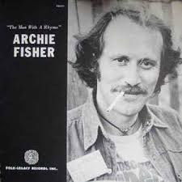

= Радио Аэростат. Глава V
:toc: left

> link:aerostat.html[<Home>]
> link:toc.html[<Contents>]
> link:lyrics.html[<Lyrics>]

== 25 марта 2007 - 9 сентября 2007

<http://old.aquarium.ru/misc/aerostat/index05.html>

++++

++++

=== Суфии - Кто Они?, 25 марта 2007

<http://old.aquarium.ru/misc/aerostat/aerostat97.html>

[%hardbreaks]
Sonzoo - Sufi Meditation Song
Mahavishnu Orchestra - 1000 Islands Park
Nusrat Fateh Ali Khan - Night Song
Massive Attack - Teardrop
Zikr
Ranjana Sangeet - Tumi Amar
Mevlana
Nahan Khaneh Del
Yusuf Islam - The Beloved
Beatles - Sun King
Jacques Arcadelt

++++
 
++++

=== ОБЭРИУ, 1 апреля 2007

<http://old.aquarium.ru/misc/aerostat/aerostat98.html>

[%hardbreaks]
Hugh Le Caine - Dripsody
Gamers In Exile - I Am A Decent
Venetian Snares - Underground Circle Jesus
Si Begg - Move Up
New York Renaissance Band - Branle Gay
Stockhausen - Kontakte
Paul Lansky - Six Fantasies
David Behrman - On The Other Ocean
Albinoni - Adagio G moll
Nobukazu Takemura - Astral Beads

++++
 
++++

=== Апология Америки, 8 апреля 2007

<http://old.aquarium.ru/misc/aerostat/aerostat99.html>

.Simon & Garfunkel - America
image:SIMON & GARFUNKEL/Simon & Garfunkel - Bookends/Bookends.jpg[Bookends,200,200,role="thumb left"]

.Bruce Springsteen - Thunder Road

.Glenn Miller - On a Little Street In Singapore
image:Glenn Miller/The Complete Glenn Miller/cover.png[The Complete Glenn Miller,200,200,role="thumb left"]

[%hardbreaks]
Frank Zappa - Concentration Moon
Byrds - Lay Down Your Weary Tune
Little Richard - Bala Lama Bama Loo
Elvis Presley - Anyway You Want Me
James Brown - I Feel Good
Johnny Cash - Four Strong Winds
Billy Joel - Matter Of Trust 

++++
 
++++

=== 1000 лет музыки, 15 апреля 2007

<http://old.aquarium.ru/misc/aerostat/aerostat100.html>

[%hardbreaks]
Atrium Musicae de Madrid - Homero Hymnus
William Byrd - Haec Dies
Antonio Vivaldi - Trumpet Concerto A flat, 2 (104)
Brahms - Symphony #2 (III - Allegretto) (1.06)
Al Bowlly - It Was The lover And His Lass
Thelonius Monk - Five Blues Spot
Jerry Lee Lewis - High School Confidential
The Beatles - Getting Better
The Clash - White Riot
Ultravox - We Came to Dance
Prodigy - Smack My Bitch Up
Ranjana Singers

++++
 
++++

=== Richard Thompson, 22 апреля 2007

<http://old.aquarium.ru/misc/aerostat/aerostat101.html>

[%hardbreaks]
Richard Thompson - Turning Of The Tide
Richard Thompson - I Misunderstood
Richard Thompson - Keep Your Distance
Richard Thompson - Put It There Pal
Richard Thompson - Beeswing
Richard Thompson - How Do You Like The New Me
Richard Thompson - Dark Hand Over My Heart
Richard Thompson - Walking The Long Miles Home

++++
 
++++

=== Дверь Лета (Beltane Eve), 29 апреля 2007

<http://old.aquarium.ru/misc/aerostat/aerostat102.html>

.Archie Fisher - Welcome Royal Charlie

[%hardbreaks]
Andy M. Stewart - Take Her In Your Arms
Steeleye Span - All Around My Hat
Flook! - Ballybrolly Jigs
Mary Hopkin - Let My Name Be Sorrow
Robin Laing - Willy Brew'd A Peck O'Maut
Jethro Tull - Fire At Midnight
Incredible String Band - Banks Of Sweet Italie
Lunasa - Inion Ni Scannlain
Paul McCartney - Mull Of Kintyre
T.Rex - Beltane Walk

++++
 
++++

=== Памяти Ильи Кормильцева, 6 мая 2007

<http://old.aquarium.ru/misc/aerostat/aerostat103.html>

[%hardbreaks]
Nautilus Pompilius - Взгляд с экрана
Nautilus Pompilius - Одинокая птица
Nautilus Pompilius - Скованные одной цепью
Nautilus Pompilius - Крылья
Nautilus Pompilius - Я хочу быть с тобой
Nautilus Pompilius - Дыхание
Nautilus Pompilius - Человек на Луне
Albinoni - Trumpet Concert in D min.1
Nautilus Pompilius - Титаник

++++
 
++++

=== Elvis Presley'56, 13 мая 2007

<http://old.aquarium.ru/misc/aerostat/aerostat104.html>

[%hardbreaks]
Elvis Presley - That's Alright (Mama)
Elvis Presley - I Love You Because
Elvis Presley - Milk Cow Blues
Elvis Presley - Heartbreak Hotel
Elvis Presley - Too Much
Elvis Presley - Mystery Train
Elvis Presley - Don't Be Cruel
Elvis Presley - I Was The One
Elvis Presley - Good Rockin' Tonight
Elvis Presley - You're a Heartbreaker
Elvis Presley - Hound Dog
Elvis Presley - Trying to Get to You
Elvis Presley - Return To Sender
Elvis Presley - Anyway You Want Me
Elvis Presley - Finders Keepers, Losers Weepers 

++++
 
++++

=== Новая Коломна, 20 мая 2007

<http://old.aquarium.ru/misc/aerostat/aerostat105.html>

.Tinariwen - Imidiwan Winakalin
image:TINARIWEN/Aman Iman _ Water Is Life/cover.jpg[Aman Iman _ Water Is Life,200,200,role="thumb left"]

[%hardbreaks]
Ryou Kunihiko - William's Love
Air - Napalm Love
Cocorosie - Werewolf
Glow - Lamp Post
Gonzales - Manifesto
King Creosote - Ph 6.5
Rita Lee - She Loves You
Gjallarhorn - Suvetar
Toumani Diabate - Boulevard De L'independence
Sean Lennon - On Again Off Again

++++
 
++++

=== Иоганн Себастьян Бах, 27 мая 2007

<http://old.aquarium.ru/misc/aerostat/aerostat106.html>

[%hardbreaks]
Well-Tempered Clavier (4)
Toccata D min (A.Isoir - organ)
Oboe Concerto G min (BWM 1056) - Largo
Organ Concerto (after Vivaldi) G-moll. #1. Allegro
Concerto For Harpsichord C min (BWV 1062)
Violin Concerto #2 - Allegro Assai
Goldberg Variation #4
Orchestral Suite #2 BWV 1067 - Sarabande
Three-Part Invention #14 BWV800
Allemande (A. Isoir)
Suite #3 D maj - Gigue
Suite #1 C maj - No6. Bouree 1 & 2 

++++
 
++++

=== Frank Zappa, 3 июня 2007

<http://old.aquarium.ru/misc/aerostat/aerostat107.html>

[%hardbreaks]
Frank Zappa - Camarillo Brillo
Frank Zappa - Don't Eat The Yellow Snow
Frank Zappa - Nanook Rubs It
Frank Zappa - St.Alphonzo's Pancake Breakfast
Frank Zappa - Aybe Sea
Frank Zappa - Twenty Small Cigars
Frank Zappa - Peaches En Regalia
Frank Zappa - The Uncle Meat Variations
Frank Zappa - Igor's Boogie
Frank Zappa - Brown Shoes
Frank Zappa - Bow Tie Daddy
Frank Zappa - Harry You're A Beast
Frank Zappa - What's The Ugliest Part Of Your Body
Frank Zappa - For Calvin
Frank Zappa - Bobby Brown
Frank Zappa - Take Your Clothes Off When You Dance

++++
 
++++

=== Новые песни, 10 июня 2007

<http://old.aquarium.ru/misc/aerostat/aerostat108.html>

[%hardbreaks]
Paul McCartney - You Tell Me
Future Clouds & Radar - Hurricane Judy
Bjork - Hope
Richard Thompson - Poppy Red
Klaxons - Golden Scans
Rosewood Thieves - Cold In The Country
Battles - Ddiamondd
Wilco - Sky Blue Sky
Metric - The Twist
Dan Bern - Suicide Room 

++++
 
++++

=== Серьезная Музыка, 17 июня 2007

<http://old.aquarium.ru/misc/aerostat/aerostat109.html>

[%hardbreaks]
Brahms - Symphonie #3, part 2
Terry Riley - 10 Voices Of 2 Prophets
Terry Riley - Poppy Nogood
Terry Riley - Rainbow In Curved Air 

++++
 
++++

=== Несерьезная Музыка, 24 июня 2007

<http://old.aquarium.ru/misc/aerostat/aerostat110.html>

[%hardbreaks]
Leslie Saronie with Jack Hylton & His Orchestra - Jollity Farm
The Savoy Havana Band - I'm Going To Bring a Watermelon
Jack Hylton & His Orchestra - Button Up Your Overcoat
Jelly Roll Morton - Dr. Jazz Stomp
Noel Coward - A Room With The View
Whispering Jack Smith - All By Yourself In The Moonlight
Bebe Daniels & Ben Lyon - Little Sir Echo
Bonzo Dog Band - Tubas In the Moonlight
Bonzo Dog Band - I'm The Urban Spaceman
The New Vaudeville Band - Nighttingale Sang In Berkeley Square
Paul McCartney - You Gave Me The Answer
Jack Hylton - By The Waterfall 

++++
 
++++

=== Sgt. Pepper's Lonely Hearts Club Band, 1 июля 2007

<http://old.aquarium.ru/misc/aerostat/aerostat111.html>

.Beatles - Sgt. Pepper's Lonely Hearts Club Band
image:THE BEATLES/1967a - Sgt Peppers Lonely Hearts Club Band/cover.jpg[Sgt Peppers Lonely Hearts Club Band,200,200,role="thumb left"]

[%hardbreaks]
Beatles - And Your Bird Can Sing
Beatles - Strawberry Fields Forever
Beatles - With a Little Help From My Friends
Beatles - Being For The Benefit Of Mr. Kite
Beatles - Lucy In The Sky With Diamonds
Beatles - Fixing A Hole
Beatles - A Day In The Life
Beatles - Good Morning Good Morning
Beatles - She's Leaving Home
Beatles - All You Need Is Love 

++++
 
++++

=== R.E.M., 8 июля 2007

<http://old.aquarium.ru/misc/aerostat/aerostat112.html>

.R.E.M. - Fall On Me
image:REM/REM - Eponymous/cover.jpg[Eponymous,200,200,role="thumb left"]

.R.E.M. - Radio Free Europe
image:REM/REM - Murmur/cover.jpg[Murmur,200,200,role="thumb left"]

.R.E.M. - Sidewinder Sleeps Tonight
image:REM/REM - Automatic For The People/cover.jpg[Automatic For The People,200,200,role="thumb left"]

.R.E.M. - Losing My Religion

++++
 
++++

.R.E.M. - link:REM/REM%20-%20Document/lyrics/document.html#_the_one_i_love[The One I Love]
image:REM/REM - Document/cover.jpg[Document,200,200,role="thumb left"]

.R.E.M. - link:REM/REM%20-%20Up/lyrics/up.html#_hope[Hope]
image:REM/REM - Up/cover.jpg[Up,200,200,role="thumb left"]

.R.E.M. - link:REM/REM%20-%20Reveal/lyrics/reveal.html#_imitation_of_life[Imitation of Life]
image:REM/REM - Reveal/cover.jpg[Reveal,200,200,role="thumb left"]

[%hardbreaks]
R.E.M. - Nightswimming
R.E.M. - link:REM/REM%20-%20Up/lyrics/up.html#_daysleeper[Daysleeper]

++++
 
++++

=== Дао Де Цзин, 15 июля 2007

<http://old.aquarium.ru/misc/aerostat/aerostat113.html>

[%hardbreaks]
Cattle In The Meadow
Moonlit Night
Incredible String Band - Chinese White
Brian Wilson - Wonderful
* * *
Incredible String Band - Red Hair
* * *
Flower Drum
George Harrison - All Things Must Pass
Boys And Flowers
Donovan - Old Fashioned Picture Book 

++++
 
++++

=== Восток и Запад, 22 июля 2007

<http://old.aquarium.ru/misc/aerostat/aerostat114.html>

[%hardbreaks]
Dowland - Leggiero
Dissidenten - Sahara Electric
The Four Lads - Istambul
Robert Plant & Afro-Celt Sound System - Life Begins Again
Smiths - Girlfriend In A Coma
Eminem - Ass Like That
Bryan Ferry - These Foolish Things
Bhajan Singers - Jhili Mili

++++
 
++++

=== Silly Wizard, 29 июля 2007

<http://old.aquarium.ru/misc/aerostat/aerostat115.html>

[%hardbreaks]
Silly Wizard - Lover's Heart
Silly Wizard - Sweet Dublin Bay
Silly Wizard - Finlay M. MacRae
Silly Wizard - Donald McGillavry
Silly Wizard - Miss Catherine Brosnan
Silly Wizard - If I Was A Blackbird
Silly Wizard - The Blackbird Of Sweet Avondale
Silly Wizard - The Chill Eastern Winds

++++
 
++++

=== Археология - Canterbury And Others, 5 августа 2007

<http://old.aquarium.ru/misc/aerostat/aerostat116.html>

[%hardbreaks]
Matching Mole - Starting In The Middle Of The Day We Can Drink Our Politics Away
Soft Machine - Slightly All The Time
Soft Machine - Hulloder
Hatfield & The North - Fitter Stoke Has A Bath
Gong - Never Glid Before
Caravan - I Don't Know Its Name
Peter Hammill - Autumn
Pink Floyd - What Uh The Deal
Matching Mole - O Caroline

++++
 
++++

=== Алиса в Зазеркалье, 12 августа 2007

<http://old.aquarium.ru/misc/aerostat/aerostat117.html>

.Procol Harum - link:PROCOL%20HARUM/1967%20-%20Procol%20Harum%20(With%20Bonus%20Tracks)/lyrics/procol.html#_good_captain_clack[Good Captain Clack]
image:PROCOL HARUM/1967 - Procol Harum (With Bonus Tracks)/cover.png[Procol Harum (With Bonus Tracks),200,200,role="thumb left"]

[%hardbreaks]
Donovan - Mr.Wind
Tyrannosaurus Rex - Blessed Wild Apple Girl
Pink Floyd - Julia Dream
The Who - Silas Stingy
The Hollies - Lullaby To Tim
Pink Floyd - Matilda Mother
King Crimson - I Talk To The Wind
Beatles - What's New, Mary Jane?
Incredible String Band - Minotaur's Song
Nick Drake - I Was Made To Love Magic
Idle Race - Sea Of Dreams

++++
 
++++

=== Сно-видение, 19 августа 2007

<http://old.aquarium.ru/misc/aerostat/aerostat118.html>

[%hardbreaks]
Brian Eno - Here He Comes
Fred Frith - Spring Any Day Now
Sileas - The Pipers
Brian Eno- Backwater
Kate Bush - Dreaming
Jon Hassell - Chor Moire
Beatles - Nus Gnik
Brian Eno - Everything Merges With The Night
Sigur Ros - Hoppipolla
Beatles - Good Night

++++
 
++++

=== The Byrds, 26 августа 2007

<http://old.aquarium.ru/misc/aerostat/aerostat119.html>

[%hardbreaks]
Byrds - Turn Turn Turn
Byrds - Here Without You
Byrds - The World Turns All Around Her
Byrds - Mr. Tamborine Man
Byrds - Renessaince Fair
Byrds - Goin Back
Byrds - Eight Miles High
Byrds - Mr. Spaceman
Byrds - So You Want To Be A Rock n Roll Star
Byrds - It Happens Each Day
Byrds - Wasn t Born To Follow
Byrds - John Riley
Byrds - Get To You

++++
 
++++

=== Новые Песни В Сентябре, 2 сентября 2007

<http://old.aquarium.ru/misc/aerostat/aerostat120.html>

.Glenn Miller - Careless
image:Glenn Miller/The Complete Glenn Miller/cover.png[The Complete Glenn Miller,200,200,role="thumb left"]

[%hardbreaks]
Gallows - In The Belly Of A Shark
Tori Amos - Bouncing Off Clouds
Bell X1 - I'll See Your Heart
Matthew Dear - Fleece On Brain
Mum - Moon Pulls
The Stands - Back To You
Madness - Shame & Scandal
Page & Plant - When The World Was Young
Paul McCartney - Too Much Rain 

++++
 
++++

=== Paul Simon, 9 сентября 2007

<http://old.aquarium.ru/misc/aerostat/aerostat121.html>

.Simon & Garfunkel - Mrs. Robinson
image:SIMON & GARFUNKEL/Simon & Garfunkel - Bookends/Bookends.jpg[Bookends,200,200,role="thumb left"]

.Simon & Garfunkel - link:SIMON%20&%20GARFUNKEL/Simon%20&%20Garfunkel%20-%20Parsley,%20Sage,%20Rosemary%20and%20Thyme/lyrics/parsley.html#_for_emily_whenever_i_may_find_her[For Emily, Wherever I May Find Her]
image:SIMON & GARFUNKEL/Simon & Garfunkel - Parsley, Sage, Rosemary and Thyme/cover.jpg[Parsley  Sage  Rosemary and Thyme,200,200,role="thumb left"]

.Simon & Garfunkel - link:SIMON%20&%20GARFUNKEL/Simon%20&%20Garfunkel%20-%20Sounds%20of%20Silence/lyrics/silence.html#_the_sound_of_silence[The Sound Of Silence]
image:SIMON & GARFUNKEL/Simon & Garfunkel - Sounds of Silence/cover.jpg[Sounds of Silence,200,200,role="thumb left"]

[%hardbreaks]
Simon & Garfunkel - Hazy Shade Of Winter
Simon & Garfunkel - El Condor Pasa
Paul Simon - Mother and Child Reunion
Simon & Garfunkel - Me and Julio Down By The Schoolyard
Simon & Garfunkel - Kodachrome
Paul Simon - Under African Skies
Paul Simon - I Do It For Your Love
Paul Simon - 50 Ways To Leave Your Lover
Paul Simon - 59th Bridge Street Song

++++
 
++++

=== Jimi: Are You Experienced?, 16 сентября 2007

<http://old.aquarium.ru/misc/aerostat/aerostat122.html>

[%hardbreaks]
Jimi Hendrix Experience - Purple Haze
Jimi Hendrix Experience - Manic Depression
Jimi Hendrix Experience - Love Or Confusion
Jimi Hendrix Experience - I Don't Live Today
Jimi Hendrix Experience - May This Be Love
Jimi Hendrix Experience - The Wind Cries Mary
Jimi Hendrix Experience - Fire
Jimi Hendrix Experience - Third Stone From The Sun
Jimi Hendrix Experience - Foxey Lady
Jimi Hendrix Experience - Are You Experienced? 

---

> link:aerostat.html[<Home>]
> link:toc.html[<Contents>]
> link:lyrics.html[<Lyrics>]
