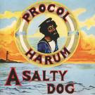
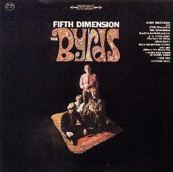

= Радио Аэростат. Глава XIV
:toc: left

> link:aerostat.html[<Home>]
> link:toc.html[<Contents>]
> link:lyrics.html[<Lyrics>]

== 15 мая 2011 - 6 ноября 2011

<http://old.aquarium.ru/misc/aerostat/index14.html>

++++

++++

=== Новые Песни Осени, 6 ноября 2011

<http://old.aquarium.ru/misc/aerostat/aerostat338.html>

[%hardbreaks]
Superheavy - Superheavy
Little Roy - Come As You Are
Ry Cooder - No Banker Left Behind
Yes - Hour Of Need
Everything Everything - Photoshop Hands
Radiohead - Little By Little (caribou Rmx)
Tom Waits - Back In The Crowd
R.E.M. - We All Go Back To Where We Belong
George Thorogood - Let It Rock
R.E.M. - Finest Worksong 

++++
 
++++

=== Золото Эльфов, 30 октября 2011

<http://old.aquarium.ru/misc/aerostat/aerostat337.html>

[%hardbreaks]
Andy M. Stewart - Brighidin Ban Mo Store
Richard Thompson - The Old Changing Way
Shirley & Dolly Collins - Ca' The Yowes
Cliar - Cailleach An Airgid
Robin Laing - Born In Blossom Time
Cormac Breatnach - Down By The Glenside
Brian Finnegan - Marga
Planxty - True Love Knows No Season
Tannahill Weavers - The Unicorn Set

++++
 
++++

=== Молодой Родерик С., 23 октября 2011

<http://old.aquarium.ru/misc/aerostat/aerostat336.html>

[%hardbreaks]
Rod Stewart - Mandolin Wind
Rod Stewart - Mama You've Been On My Mind
Rod Stewart - Twisting The Night Away
Jeff Beck Group - Ain't Superstitious
Faces - Pool Hall Richard
Rod Stewart - Maggie May
Rod Stewart - Tomorrow Is Such A Long Time
Rod Stewart - Lady Day
Rod Stewart - You Wear It Well 

++++
 
++++

=== Eurythmics, 16 октября 2011

<http://old.aquarium.ru/misc/aerostat/aerostat335.html>

[%hardbreaks]
Eurythmics - Here Comes The Rain Again
Eurythmics - Missionary Man
Eurythmics - Love Is A Stranger
Eurythmics - Right By Your Side
Eurythmics - Sweeet Dreams
Eurythmics - A Little Of You
Eurythmics - No More I Love You's
Eurythmics - When Tomorrow Comes
Eurythmics - 1984

++++
 
++++

=== Doo Woop, 9 октября 2011

<http://old.aquarium.ru/misc/aerostat/aerostat334.html>

[%hardbreaks]
Dell-ikings - Come Go With Me
Chords - Sh-Boom
Mills Brothers - Tiger Rag
Rivingtons - Papa-Oom-Mow-Mow
The Diamonds - Little Darlin'
Marcels - Blue Moon
Led Zeppelin - D'yer Mak'er
Paul Simon - Slip Sliding Away
Platters - Only You
John Lennon - Stand By Me
Spaniels - Goodnight, Sweetheart
Red Hot Chili Peppers - Someone

++++
 
++++

=== Неслыханное, 2 октября 2011

<http://old.aquarium.ru/misc/aerostat/aerostat333.html>

[%hardbreaks]
The Duckworth Lewis Method - Coin Toss
Marmaduke Duke - Rubber Lover
Sean Hayes - Boom Boom Goes The Day
Dora - До-Ка-На-Ли
J.Martin & Tymon Dogg - This Is Only Me
Jon Allen - In Your Light
Pat Dam Smyth - U
Marc Carroll - Silent And Blind
Solar Bears - Children Of The Times
Adam Green - Buddy Bradley
Shins - Sphagnum Esplanade
The Duckworth Lewis Method - Me And Mr. M

++++
 
++++

=== Хроники Священных Коров, 25 сентября 2011

<http://old.aquarium.ru/misc/aerostat/aerostat332.html>

[%hardbreaks]
Аквариум - Марш Священных Коров
Аквариум - Назад В Архангельск
Аквариум - Красная Река
Аквариум - Капитан Беллерофонт
Аквариум - Огонь Вавилона
Аквариум - Небо Цвета Дождя
Аквариум - На Ход Ноги

++++
 
++++

=== Бутлег, 18 сентября 2011

<http://old.aquarium.ru/misc/aerostat/aerostat331.html>

[%hardbreaks]
Jethro Tull - Airplane
Led Zeppelin - Hey Hey What Can I Do
Tom Waits - Good Man Is Hard To Find
Bob Dylan - Million Dollar Bash
Beatles - I'm In Love
Rolling Stones - Through The Lonely Night
Simon & Garfunkel - You Don't Know Where
Pink Floyd - Vegetable Man
John Lennon - India
Paul McCartney - Return To Pepperland
T.Rex - Mr. Motion
George Harrison - I Don't Want To Do It

++++
 
++++

=== Новые Песни со Стогов, 11 сентября 2011

<http://old.aquarium.ru/misc/aerostat/aerostat330.html>

[%hardbreaks]
William Elliot Whitmore - Field Song
Raghu Dixit - No Man Will Ever Love You
Red Hot Chili Peppers - Monarchy Of Roses
Bjork - Cristalline
Nick Freitas - Saturday Night Underwater
Noel Gallagher - Death Of You And Me
Tom Waits - Bad As Me
Airborne Toxic Event - Changing
Stephin Merritt - When You're Young And In Love
Peatbog Faeries - Room 215 

++++
 
++++

=== Чжуан Цзы, 4 сентября 2011

<http://old.aquarium.ru/misc/aerostat/aerostat329.html>

.Procol Harum - All This And More

[%hardbreaks]
Stackridge - Pinafore Days
Donovan - Three King Fishers
Simon & Garfunkel - Blues Run The Game
Deiseal - Si Beag Si Mor
Simon & Garfunkel - Leaves That Are Green
Rolling Stones - No Expectation
Burns Unit - Sorrys
Archie Fisher - Song For Simon
Strawbs - Ah Me Ah My
Lei Qiang - Jasmine Flower 

++++
 
++++

=== Lovin' Spoonful, 28 августа 2011

<http://old.aquarium.ru/misc/aerostat/aerostat328.html>

[%hardbreaks]
Lovin' Spoonful - Daydream
Lovin' Spoonful - It's Not Time Now
Lovin' Spoonful - Jug Band Music
Lovin' Spoonful - Did You Ever Have To Make Up Your Mind
Lovin' Spoonful - Warm Baby
Lovin' Spoonful - Nashville Cats
Lovin' Spoonful - Rain On The Roof
Lovin' Spoonful - Darlin' Companion
Lovin' Spoonful - Do You Believe In Magic
Lovin' Spoonful - Didn't Want To Have To Do It
Lovin' Spoonful - Summer In The City
Lovin' Spoonful - Butchie's Tune
Lovin' Spoonful - You Didn't Have To Be So Nice

++++
 
++++

=== "Мыслитель", 21 августа 2011

<http://old.aquarium.ru/misc/aerostat/aerostat327.html>

[%hardbreaks]
Dobet Gnahore - Issa
Beatles - Mellotron Impro
Grant Lee Philips - Winterglow
Happy Traum - Fare Thee Well Marianne
Noze - Kitchen
Eels - My Timing Is Off
Blind Faith - In The Presence Of The Lord
Hemant Kumar - Jaane Woh Kaise Log The Jin
Divine Comedy - Bang Goes The Knighthood
Mary Hopkin - Lord Of The Reedy River
Donovan - Yellow Star

++++
 
++++

=== Вальс, 14 августа 2011

<http://old.aquarium.ru/misc/aerostat/aerostat326.html>

[%hardbreaks]
Ben Selvin & His Orchestra - Ramona
Wurlitzer Carousel Organ - Blue Danube
Josef Lanner - Osmanen Waltz Op. 146
П.И. Чайковский - Вальс из балета "Спящая красавица"
Strauss - Tales From Vienna Woods
Jacque Brel - La Valse A Mille Temps
Клячкин - Псков
Queen - Millionaire Waltz
Leonard Cohen - Take This Waltz

++++
 
++++

=== Ringo!, 7 августа 2011

<http://old.aquarium.ru/misc/aerostat/aerostat325.html>

[%hardbreaks]
Beatles - Yellow Submarine
Ringo Starr - Photograph
Beatles - With A Little Help From My Friends
Ringo Starr - Sentimental Journey
Ringo Starr - It Don't Come Easy
Ringo Starr - Back Of Bougaloo
Ringo Starr - I'm The Greatest
Ringo Starr - You're Sixteen
Ringo Starr - Weight Of The World
Ringo Starr - No No Song
Ringo Starr - Dream
Beatles - Act Naturally

++++
 
++++

=== Lugh, 2011, 31 июля 2011

<http://old.aquarium.ru/misc/aerostat/aerostat324.html>

[%hardbreaks]
Lunasa - Maids In The Kitchen
Pete Coe - 7 Warnings
Solas - Wind That Shakes The Barley
Finn's Fury - Highland Cathedral
Beoga - Fly Fishing
Peter Bellamy - Down By The Green Groves
Robert Mathieson - Calypso
Phil Cunningham&Ali Bain - Sarah's Song
Maggie Sansone - Bridget Cruise
Chieftains - Dochas 

++++
 
++++

=== "Exile On Main Street", 24 июля 2011

<http://old.aquarium.ru/misc/aerostat/aerostat323.html>

[%hardbreaks]
Rolling Stones - Rocks Off
Rolling Stones - Rip This Joint
Rolling Stones - Stop Breaking Down
Rolling Stones - Sweet Virginia
Rolling Stones - Casino Boogie
Rolling Stones - Tumbling Dice
Rolling Stones - Ventilator Blues
Rolling Stones - Let It Loose
Rolling Stones - All Down The Line
Rolling Stones - Shine A Light

++++
 
++++

=== Звуки этого лета, 17 июля 2011

<http://old.aquarium.ru/misc/aerostat/aerostat322.html>

[%hardbreaks]
Arbeau - L'official
Eddie Vedder - Without You
Blondie - Girlie Girlie
Brian Eno - Glitch
Red Button - Caught In The Middle
Maneken - Soulmate Sublime
Beirut - East Harlem
Tinariwen - Tenere Taqqim Tossam
High Llamas - Talahomi Way
Grant Lee Philips - Love's A Mystery
Super Heavy - Miracle Worker
Red Button - Picture

++++
 
++++

=== Melanie, 10 июля 2011

<http://old.aquarium.ru/misc/aerostat/aerostat321.html>

[%hardbreaks]
Melanie - Little Bit Of Me
Melanie - Someday I'll Be A Farmer
Melanie - Steppin'
Melanie - Some Say (I Got Devil)
Melanie - Look What They've Done To My Song
Melanie - Ring the Living Bell
Melanie - Brand New Key
Melanie - What Wondrous Love
Melanie - Ring Around The Moon
Melanie - Center Of The Circle
Melanie - Baby Day
Melanie - Tell Me Why 

++++
 
++++

=== Острова Блаженных, 3 июля 2011

<http://old.aquarium.ru/misc/aerostat/aerostat320.html>

[%hardbreaks]
Herman's Hermits - Green Street Green
Finger - Sonata In C For Trumpet & Oboe
Four Preps - 26 Miles
Bulgarian State Choir - Kalimankou Denku
Lunasa - The Dimmers
Maria Pomyanovska - Please Dear God
Dunstable - O Rosa Bella
Navang Khechog - The Dalai Lama
Ulfur Eldjarn - The Ether
Анатолий Орфенов - Далеко Далеко За Морем
Chieftains - Air - You Are The One 

++++
 
++++

=== Sam Cooke, 26 июня 2011

<http://old.aquarium.ru/misc/aerostat/aerostat319.html>

[%hardbreaks]
Sam Cooke - Good Time
Sam Cooke - Having A Party
Sam Cooke - Jesus Gave Me Water
Sam Cooke - You Send Me
Sam Cooke - Amazing Grace
Sam Cooke - Another Saturday Night
Sam Cooke - A Change Is Gonna Come
Sam Cooke - Bring It On Home To Me
Sam Cooke - Twistin' The Night Away
Sam Cooke - Just For You
Sam Cooke - Chain Gang
Sam Cooke - I'll Come Running Back To You
Sam Cooke - Wonderful World 

++++
 
++++

=== Три минуты славы, 19 июня 2011

<http://old.aquarium.ru/misc/aerostat/aerostat318.html>

[%hardbreaks]
Pipkins - Gimme Dat Ding
Joe Dolce - Shaddap You Face
Archies - Sugar Sugar
Ohio Express - Yummy Yummy Yummy
Royal Guardsmen - Snoopy vs Red Baron
D.A.F. - Der Mussolini
Falco - Rock Me Amadeus
Plastic Bertrand - Ca Plane Pour Moi
Rolf Harris - Tie Me Kangaroo Down Sport
Afroman - Because I Got High
Brian Hyland - Itsy Bitsy Teeny Weeny Yellow Polka Dot Bikini
Bobby McFerrin - Don't Worry Be Happy 

++++
 
++++

=== Остров огня и льда, 12 июня 2011

<http://old.aquarium.ru/misc/aerostat/aerostat317.html>

[%hardbreaks]
Apparat Organ Quartet - Romantika
Sigur Ros - Hoppipolla
Mr. Silla And Mongoose - Say You Will
Daniel Agust - The Drift
Ske - On The Way We Lose It Somehow
Rokkurro - Solin Mun Skina
Eberg - Been Thinking Of You
Olafur Arnalds - Loftid Verdur Skyndilega
Seabear - I Sing I Swim
For A Mminor Reflection - Fjara

++++
 
++++

=== Иконостас, 5 июня 2011

<http://old.aquarium.ru/misc/aerostat/aerostat316.html>

.Byrds - Wild Mountain Thyme

[%hardbreaks]
Robert Palmer - Airplane
Silly Wizard - Wi' Me Dog And Gun
Mary Hopkin - Young Love
Paul McСartney - Little Willow
Smiths - The Light That Never Goes Out
R.E.M. - At My Most Beautiful
Rolling Stones - Dandelion
Donovan - Skip-A-Long Sam
Bob Dylan - I Want You
Van Morrison - Into The Mystic 

++++
 
++++

=== Матрица Бабы-Яги, 29 мая 2011

<http://old.aquarium.ru/misc/aerostat/aerostat315.html>

[%hardbreaks]
Soundgarten - Black Hole Sun
Perfect Circle - The Noose
Sex Pistols - Holiday In The Sun
Soulfly - Bloodbath And Beyond
Mark Lanegan - Wedding Dress
Rage Against The Machine - Wake Up
Pogues - Fiesta
David Bowie - You Pretty Things

++++
 
++++

=== Новые Песни Весны, 22 мая 2011

<http://old.aquarium.ru/misc/aerostat/aerostat314.html>

[%hardbreaks]
Arctic Monkey - Don't Sit Down 'cause I've Moved Your Chair
P.J. Harvey - The Glorious Land
Paul Simon - Dazzling Blue
Stornoway - Zorbing
Glasser - Apply
King Creosote/Jon Hopkins - Bats In The Attic
Alexi Murdoch - Song For You
Fujiya & Miyagi - 16 Shades of Black and Blue
BellX1 - Trailing Skirts Of Love 

++++
 
++++

=== New Age, 15 мая 2011

<http://old.aquarium.ru/misc/aerostat/aerostat313.html>

[%hardbreaks]
Gandalf - Morning At The River Bench
Medwyn Goodall - Day Break
Kitaro - As The Wind Blows
Mike Rowland - Mystic Angel
Gary Stadler - Lullaby
Enya - Only Time
Llewellyn - Crown Chakra 

++++
 
++++

---
                       
> link:aerostat.html[<Home>]
> link:toc.html[<Contents>]
> link:lyrics.html[<Lyrics>]