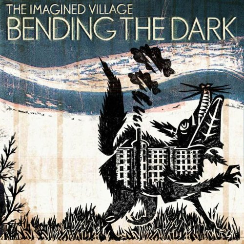
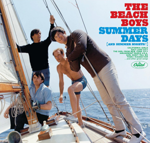

= Радио Аэростат. Глава XVI
:toc: left

> link:aerostat.html[<Home>]
> link:toc.html[<Contents>]
> link:lyrics.html[<Lyrics>]

== 29 апреля 2012 - 7 октября 2012

<http://old.aquarium.ru/misc/aerostat/index16.html>

++++

++++

=== Скандинавский Джаз, 7 октября 2012

<http://old.aquarium.ru/misc/aerostat/aerostat386.html>

[%hardbreaks]
Espen Eriksen Trio - Dusk Of Dawn
Tord Gustavsen Quartet - Prelude
Mats Eilertsen - Embrace
Hakon Kornstad - Damascus
Esbjorn Svensson Trio - Tuesday Wonderland
Stoner Forss Borg - For Varlden
Mats Eilertsen - Splendour 

++++
 
++++

=== Просто хорошие песни, 30 сентября 2012

<http://old.aquarium.ru/misc/aerostat/aerostat385.html>

[%hardbreaks]
Talking Heads - Road To Nowhere
Talking Heads - And She Was
Simon & Garfunkel - The Only Livin' Boy
Julian Casablancas - Ludlow Street
Веданъ Колод - На Море Бярёза
Franceschini - Sonata In D Maj
Four Vagabonds - Rosy The Riveter
Duotone - Golden Hair Saved My Life
Аквариум - Борода
New Vaudeville Band - I Wonder Who's Kissing Her Now 

++++
 
++++

=== Новое, 23 сентября 2012

<http://old.aquarium.ru/misc/aerostat/aerostat384.html>

[%hardbreaks]
The Bug - Can't Take This No More
Kid Coala - 2 Bit Blues
David Byrne/St.Vincent - Why
Animal Collective - Applesause
Dead Can Dance - Agape
Bob Dylan - Duquesne Whistle
Chilly Gonzales - Papa Gavotte
Tame Impala - That's All For Everyone 

++++
 
++++

=== Сокровенные Песни, 16 сентября 2012

<http://old.aquarium.ru/misc/aerostat/aerostat383.html>

[%hardbreaks]
Dowland - Leggiero
Pink Floyd - Scream Thy Last Scream
Donovan - Newest Bath Guide
George Harrison - Hottest Gong In Town
Rolling Stones - Anyway You Look At It
Who - Girl's Eyes
Tom Waits - Brother Can You Spare A Dime
Bob Marley - High Tide Or Low Tide
Red Hot Chili Peppers - Bicycle Song
Mary Hopkin - Que Sera Sera

++++
 
++++

=== 9 Заметок О Париже, 9 сентября 2012

<http://old.aquarium.ru/misc/aerostat/aerostat382.html>

[%hardbreaks]
Frehel - Musette
Charles Aznavour - La Palais De Nos Chime
Jehan De Lescurel - A Vous Douce Debonaire
Arbeau - Jouyssance Vous Donneray
Leonin - Viderunt Omnes #1
Arbeau - Gavotte
New London Consort - Gagliarda
Couperin - La Piemontose 6 2e Air
Lully - Entree D'Apollon
Josephine Baker - J'ai Deux Amours
Satie - Trois Gymnopedies (arr. Debussy)
Edith Piaf - Paris

++++
 
++++

=== Услышанное Во Сне, 2 сентября 2012

<http://old.aquarium.ru/misc/aerostat/aerostat381.html>

[%hardbreaks]
Maddy Prior - In Dolce Jubilo
Elvis Presley - Blue Suede Shoes
Richard Wagner - Tristan And Iseult
Tartini - Devil's Trill
Comhaltas - Si Beag Si Mor
Irish Tenors - Danny Boy
Reed Miller - The Lost Chord
Beatles - Yesterday
Rolling Stones - Satisfaction
Cotton Mather - Lily Dreams On 

++++
 
++++

=== О Срезании Травы, 26 августа 2012

<http://old.aquarium.ru/misc/aerostat/aerostat380.html>

[%hardbreaks]
Grasscut - Cut Grass
Grasscut - A Mysterious Disappearance
Grasscut - Blink In The Night
Grasscut - From Town And Fields
Grasscut - Lights
Grasscut - Reservoir
Grasscut - Stone Lions
Grasscut - Richardson Road
Grasscut - We Fold Ourselves

++++
 
++++

=== Cosmo Jarvis, 19 августа 2012

<http://old.aquarium.ru/misc/aerostat/aerostat379.html>

[%hardbreaks]
Cosmo Jarvis - Tell Me Who To Be
Cosmo Jarvis - Whatever
Cosmo Jarvis - Think Bigger
Cosmo Jarvis - She Doesn't Mind
Cosmo Jarvis - Lacie
Cosmo Jarvis - Hopeless Bay
Cosmo Jarvis - Gay Pirates
Cosmo Jarvis - Wrong Kind Of Happy
Cosmo Jarvis - Sunshine & Dandylions
Cosmo Jarvis - Screw You Moon

++++
 
++++

=== "Воздухоплавание В Компании Сфинксов", 12 августа 2012

<http://old.aquarium.ru/misc/aerostat/aerostat378.html>

[%hardbreaks]
Аквариум - Дед Мороз Блюз
Аквариум - Из Дельты Гнезда
Аквариум - Под Мостом Как Чкалов
Аквариум - Генерал
Аквариум - XXII-й Век
Аквариум - Новая Песня О Родине
Аквариум - Слова Растамана
Аквариум - Господин Одинокий Журавль
Аквариум - Горный Хрусталь

++++
 
++++

=== Урожай Начала Августа, 5 августа 2012

<http://old.aquarium.ru/misc/aerostat/aerostat377.html>

[%hardbreaks]
Serj Tankyan - Ching Chime
Serj Tankyan - Forget Me Knot
Guided By Voices - Class Clown Spots A UFO
Beachwood Sparks - Forget The Song
Duke Special - Stargazers Of The World Unite
Syd Arthur - Ode To Summer
Cosmo Jarvis - Think Bigger
Grasscut - Stone Lions
Robert Palmer - Dreams To Remember

++++
 
++++

=== Lugh. Шинейд, 29 июля 2012

<http://old.aquarium.ru/misc/aerostat/aerostat376.html>

[%hardbreaks]
Treacherous Orchestra - Look East
Battlefield Band - Whaur Will We Gang?
Sinead O'Connor - Peggy Gordon
Sinead O'Connor - Nothing Compares to You
Sinead O'Connor - Daddy I'm Fine
Sinead O'Connor - Her Mantle So Green
Sinead O'Connor - Oro Se Do Bheatha 'Bhail

++++
 
++++

=== Дверь в Сегодня, 22 июля 2012

<http://old.aquarium.ru/misc/aerostat/aerostat375.html>

[%hardbreaks]
Death Grips - Get Got
John Surman - No.3
Corelli - Concerto No.5, Adagio
Death Grips - I've Seen Footage
Death Grips - Hustle Bones
Beatles - Tomorrow Never Knows
My Bloody Valentine - I Only Said
Bob Dylan - I Shall Be Released
J.S.Bach - French Suite No.5, Allemande
Ustad Shujaat Khan - Samarpan

++++
 
++++

=== Новости с полей гармонии, 15 июля 2012

<http://old.aquarium.ru/misc/aerostat/aerostat374.html>

.Imagined Village - Washing Song

[%hardbreaks]
Dirty Projectors - Gun Has No Trigger
Edward Sharpe & M-Zeros - Home
Dexys - You
Richard Hawley - She Brings The Sun
Smashing Pumpkins - The Celestials
Jimmy Cliff - One More
Beach House - Myth

++++
 
++++

=== Переиздания, 8 июля 2012

<http://old.aquarium.ru/misc/aerostat/aerostat373.html>

[%hardbreaks]
Searchers - Farmer John
Small Faces - My Mind's Eye
Kaleidoscope - Please Excuse My Face
Doors - Queen Of The Highway
Sandy Denny - Ecoute Ecoute
David Bowie - Lady Stardust
Paul McCartney - Watersprout
Аквариум - Менуэт Земледельцу
Beatles - It's All Too Much

++++
 
++++

=== Музыка Второго Плана (George Shearing), 1 июля 2012

<http://old.aquarium.ru/misc/aerostat/aerostat372.html>

[%hardbreaks]
George Shearing - Makin' Whoopee
George Shearing - What's New
George Shearing - Like Someone In Love
George Shearing - Heart Of Winter
George Shearing - Symphony
George Shearing - The Mood Is Mellow
George Shearing - When Sunny Gets Blue
George Shearing - Wonder Why
George Shearing - Gone With The Wind
George Shearing - It Could Happen To You 

++++
 
++++

=== Летние Желания, 24 июня 2012

<http://old.aquarium.ru/misc/aerostat/aerostat371.html>

.Glenn Miller - Indian Summer
image:Glenn Miller/The Complete Glenn Miller/cover.png[The Complete Glenn Miller,200,200,role="thumb left"]

.Beach Boys - California Girls

.Beach Boys - You Still Believe In Me
image:The Beach Boys/Pet Sounds/cover.jpg[Pet Sounds,200,200,role="thumb left"]

[%hardbreaks]
Cocteau Twins - Summerhead
Elvis Presley - Summer Kisses Winter Tears
Bob Dylan - Summer Days
Jethro Tull - Summerday Sands
Hermans Hermits - Sunshine Girl
Bruce Springsteen - Girls In Their Summer
Battlefield Band - Happy Days
Beach Boys - I Get Around

++++
 
++++

=== Премьеры Июня, 17 июня 2012

<http://old.aquarium.ru/misc/aerostat/aerostat370.html>

[%hardbreaks]
Sigur Ros - Rembihnutur
Santana - Never The Same Again
Damon Albarn - Apple Carts
Iggy Pop - I-m Going Again
George Harrison - Mama You-ve Been On My Mind
Paul Mccartney - Hey Diddle
Ultravox - Brilliant
Beach Boys - That-s Why God Made The Radio
Sweet Billy Pilgrim - Joyful Reunion

++++
 
++++

=== Из Жизни Неста Р. Марли, 10 июня 2012

<http://old.aquarium.ru/misc/aerostat/aerostat369.html>

[%hardbreaks]
Bob Marley - Positive Vibration
Bob Marley - Buffalo Soldier
Bob Marley - No Woman No Cry
Bob Marley - Them Bellyful (But We Hungry)
Bob Marley - Duppy Conqueror
Bob Marley - Get Up Stand Up
Bob Marley - Natural Mystic
Bob Marley - Chant Down Babylon
Bob Marley - Small Axe
Bob Marley - Africa Unite

++++
 
++++

=== Неигранное, 3 июня 2012

<http://old.aquarium.ru/misc/aerostat/aerostat368.html>

[%hardbreaks]
Spin Doctors - Two Princes
La's - There She Goes
Dodgy - So Let Me Go Far
Soap Kills - Herzan
Tal Bachman - She's So High
Andrew Bird - Imitosis
Doozer - Brother Lazarus
Mashrou' Leila - Raksit Leila
Sam Amidon - Wedding Dress
I Hate This Place - Moment 2008

++++
 
++++

=== Oasis, 27 мая 2012

<http://old.aquarium.ru/misc/aerostat/aerostat367.html>

[%hardbreaks]
Oasis - Songbird
Oasis - Wonderwall
Oasis - Roll With It
Oasis - Some Might Say
Oasis - Importance Of Being Idle
Oasis - Stop Crying Your Heart Out
Oasis - Live Forever
Oasis - Rock'n'Roll Star
Oasis - Champagne Supernova

++++
 
++++

=== История "Пси", 20 мая 2012

<http://old.aquarium.ru/misc/aerostat/aerostat366.html>

[%hardbreaks]
Аквариум - Маша и Медведь
Аквариум - Телохранитель
Аквариум - Луна Успокой Меня
Аквариум - Сварог
Аквариум - Пока Несут Сакэ
Аквариум - Сын Плотника
Аквариум - Имя Моей Тоски
Аквариум - Цвет Йошивары
Аквариум - Стоп Машина

++++
 
++++

=== Новые Песни Мая, 13 мая 2012

<http://old.aquarium.ru/misc/aerostat/aerostat365.html>

[%hardbreaks]
Duotone - House In Karemma
Dr. John - Kingdom Of Izzness
Gentleman's Dub Club - High Grade
Stranglers - Lowlands
Athena Andreadis - Finding England
Ian Anderson - Upper 6th Loan Shark/Banker Bets, Banker Wins
Fanfarlo - Atlas
Red Hot Chili Peppers - Teenager In Love
Sennen - Wasted Heart
State Of The Union - Skidoo 23 

++++
 
++++

=== 60-е Снова На Коне, 6 мая 2012

<http://old.aquarium.ru/misc/aerostat/aerostat364.html>

[%hardbreaks]
Rolling Stones - In Another Land
End - Shades Of Orange
Flower Pot Men - In A Moment Of Madness
Dave Dee DBM&T - Here's a Heart
Beau Brummels - Triangle
Kaleidoscope - Keep Your Mind Open
Strawberry Alarmclock - They Saw The Fat
Easybeats - Friday On My Mind
Tir Na Nog - Our Love Will Not Decay
Fleetwood Mac - Oh Well
Crispian St. Peters - You Were On My Mind

++++
 
++++

=== Белтайн, 29 апреля 2012

<http://old.aquarium.ru/misc/aerostat/aerostat363.html>

[%hardbreaks]
Pennou Skoulm - A Dix Heures A St Vincent
Cormack Breatnach - Christmastime In Ashland
Iron Horse - The Burning Of Auchindoun
Moving Hearts - Tribute To Peadar O'Donne
Jim Reid - Rohallion
Battlefield Band - Mo Ghleannan Taobh
Kan - Coriolis
Jim Reid - Wild Geese
Breabach - Lochaber No More

---

> link:aerostat.html[<Home>]
> link:toc.html[<Contents>]
> link:lyrics.html[<Lyrics>]
