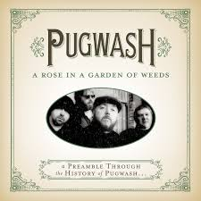

= Радио Аэростат. Глава XVIII
:toc: left

> link:aerostat.html[Главная страница]

== 31 марта 2013 - 8 сентября 2013

++++

++++

=== Морис Равель, 8 сентября 2013

<http://old.aquarium.ru/misc/aerostat/aerostat434.html>

[%hardbreaks]
Maurice Ravel – Pavane
Maurice Ravel – Pavane
Maurice Ravel – Le Tombeau De Couperin: Fugue
Maurice Ravel – Bolero
Maurice Ravel – Daphnis & Chloe
Maurice Ravel – Daphnis & Chloe

++++
 
++++

=== Песни Товарища М., 1 сентября 2013

<http://old.aquarium.ru/misc/aerostat/aerostat433.html>

[%hardbreaks]
Keb Mo – Angelina
Loading Data – Circus Blues
Lama Gyurme – Offering Chant
Jeff Healey – Holding My Honey's Hand
Colin James – Shoulder To Cry On
Temples – Ankh
Eleven – Time For Miracles
Habrera Hativeet – Etzlenu
Keb Mo – Life Is Beautiful 

++++
 
++++

=== Борода, 25 августа 2013

<http://old.aquarium.ru/misc/aerostat/aerostat432.html>

.Pugwash – It's Nice To Be Nice

[%hardbreaks]
Аквариум – Расти Борода Расти
Jethro Tull – Back To The Family
William Elliot Whitmore – The Day The End Finally Came
ZZ Top – Chartreuse
Cat Stevens – My Lady D'Arbanville
Eels – In My Dreams
Grateful Dead – Friend Of The Devil
Richard Thompson – How Can I Ever Be Simple Again
Robert Wyatt – Free Will And Testament

++++
 
++++

=== Голоса братьев Эверли, 18 августа 2013

<http://old.aquarium.ru/misc/aerostat/aerostat431.html>

[%hardbreaks]
The Everly Brothers – All I Have To Do Is Dream
The Everly Brothers – So Sad (To Watch Good Love Go Bad)
The Everly Brothers – Claudette
The Everly Brothers – Bye Bye Love
The Everly Brothers – When Will I Be Loved
The Everly Brothers – Wake Up Little Suzie
The Everly Brothers – Cathy's Clown
The Everly Brothers – Let It Be Me
The Everly Brothers – Stick With Me Baby
The Everly Brothers – I Wonder If I Care As Much
The Everly Brothers – On The Wings Of A Nightingale
Jeff Lynne – So Sad
Robert Plant – Stick With Me Baby
The Everly Brothers – Like Strangers
The Everly Brothers – Memories Are Made Of This

++++
 
++++

=== Энергия Ци, 11 августа 2013

<http://old.aquarium.ru/misc/aerostat/aerostat430.html>

[%hardbreaks]
Beatles – Yes It Is
Anna Guo – Pearls Dropping Into Jade Plate
Amiina – Hilli
Lei Qiang – The Hill Looks Like A Bottle
Air – Venus
Lei Qiang – Butterfly Lovers
Esper Erikson Trio – Fall
Albinoni – Concerto G Major. Allegro
Ming Flute Ensemble – Maidens Of Tea Mou
Hong Ting – The Hang Down Curtain
Donovan – The Sun Is A Very Magic Fellow

++++
 
++++

=== Урожай августа, 4 августа 2013

<http://old.aquarium.ru/misc/aerostat/aerostat429.html>

[%hardbreaks]
Duckworth Lewis Method – It's Not Cricket
Duckworth Lewis Method – The Umpire
Temples – Colours To Life
Beck – I Won't Be Long
John Grant – GMF
Jagwar Ma – Uncertainty
Cotton Mather – California
Bell X1 – Drive By Summer
Leisure Society – Fight For Everyone 

++++
 
++++

=== Деньги, 28 июля 2013

<http://old.aquarium.ru/misc/aerostat/aerostat428.html>

[%hardbreaks]
ABBA – Money Money Money
Elvis Presley – Money Honey
Beatles – You Never Give Me Your Money
Mills Brothers – Money In My Pockets
Who – Man With The Money
Nine Horses – Money For All
Tom Waits – Til The Money Runs Out
Rolling Stones – Luxury
Fratellis – Milk And Money
Glenn Miller – I Haven't Got Time To Be Millionaire
David Bowie – The Man Who Sold The World

++++
 
++++

=== 60-e Снова На Коне, 21 июля 2013

<http://old.aquarium.ru/misc/aerostat/aerostat427.html>

[%hardbreaks]
Humblebums – Patrick
Marquis Of Kensington – Changing Of The Guard
Scott McKenzie – San Francisco
? & The Mysterians – 96 Tears
Joe Cocker – Marjorine
Paul Revere/The Raiders – Indian Reservation
David McWilliams – Days Of Pearly Spencer
Merrilee Rush – Angel Of The Morning
Peter Paul & Mary – Puff The Magic Dragon
Pearls Before Swine – Guardian Angels
Foundations – Build Me Up Buttercup 

++++
 
++++

=== 23 Принципа, 14 июля 2013

<http://old.aquarium.ru/misc/aerostat/aerostat426.html>

.Archie Fisher – Every Man's Heart
image:ARCHIE FISHER/2008 - Windward Away/cover.jpg[Windward Away,200,200,role="thumb left"]

.Leonard Cohen – Sisters Of Mercy
image:LEONARD COHEN/01-Songs Of Leonard Cohen (1967)/cover.jpg[Songs Of Leonard Cohen (1967),200,200,role="thumb left"]

[%hardbreaks]
Kinks – Too Much On My Mind
Penguin Cafe Orchestra – Music For Found
Paul Simon – Rene And Georgette Magritte With Their Dog After the War
Tommy Sands – Misty Mourne Shore
George Harrison – Gone Troppo
Ustad Shujaat Khan – Ranjha
Johnny Marvin – Happy Days Are Here Again 

++++
 
++++

=== Вразброд, 7 июля 2013

<http://old.aquarium.ru/misc/aerostat/aerostat425.html>

[%hardbreaks]
Procol Harum – Pandora's Box
Messiaen – La Nativite. VI.Les Anges
Cotton Mather – I'll Be Gone
Moody Blues – Candle Of Life
Stewart J. Sharp – Angeli Symphony
Monochrome Set – He's Frank
Arctic Monkeys – Do I Wanna Know?
Котов-Старостин – Когда Уйду

++++
 
++++

=== "Innervisions", 30 июня 2013

<http://old.aquarium.ru/misc/aerostat/aerostat424.html>

[%hardbreaks]
Stevie Wonder – Too High
Stevie Wonder – Visions
Stevie Wonder – Living For The City
Stevie Wonder – Golden Lady
Stevie Wonder – All In Love Is Fair
Stevie Wonder – Higher Ground
Stevie Wonder – Don't You Worry Bout A Thing
Stevie Wonder – He's A Misstra Know It All

++++
 
++++

=== Новые Песни Июня, 23 июня 2013

<http://old.aquarium.ru/misc/aerostat/aerostat423.html>

[%hardbreaks]
Queens Of Stone Age – I Sat By The Ocean
Cocorosie – After The Afterlife
Sigur Ros – Hrafntinna
Active Child – Hanging On
Daft Punk – Instant Crush
Zorge – Тайна
Shpongle – Brain In A Fishtank

++++
 
++++

=== Скрытая Земля Р. Палмера, 16 июня 2013

<http://old.aquarium.ru/misc/aerostat/aerostat422.html>

[%hardbreaks]
Robert Palmer – Some Guys Have All The Luck
Robert Palmer – What's It Take
Robert Palmer – I Dream Of Wires
Robert Palmer – Not A Second Time
Robert Palmer – People Will Say We're In Love
Robert Palmer – Early In The Morning
Robert Palmer – Lucky
Robert Palmer – Riptide
Robert Palmer – Chance
Robert Palmer – Not A Word
Robert Palmer – I'll Be Your Baby Tonight

++++
 
++++

=== New Names, 9 июня 2013

<http://old.aquarium.ru/misc/aerostat/aerostat421.html>

[%hardbreaks]
Temples – Shelter Song
Foals – Olympic Airways
Christopher Owens – A Broken Heart
Thomas Feiner & Anywhen – Siren Songs
Jacco Gardner – The Ballad Of Little Jane
Anouar Brahem – Stopover At Djibouti
Kit Downes Trio – Golden
Milk Carton Kids – The Ash And Clay 

++++
 
++++

=== Аккордеон, 2 июня 2013

<http://old.aquarium.ru/misc/aerostat/aerostat420.html>

[%hardbreaks]
Ali Bain & Phil Cunningham – Waltz Of Little Girls
Аквариум – Митин Вальс
Marielle Roy – Musette Et Liberte
Борис Чирков – Крутится Вертится Шар Голубой
Emile Carrara – Mon Amant De Saint Jean
Shirley&Dolly Collins – Bonny Kate
Марк Бернес – Играй Мой Баян
Rolling Stones – Back Street Girl
Silly Wizard – The Isla Waters
Regis Gizavo – Brazil
Аквариум – Ласточка
Paul Simon – That Was Your Mother

++++
 
++++

=== "Сын Галереи Злодеев", 26 мая 2013

<http://old.aquarium.ru/misc/aerostat/aerostat419.html>

[%hardbreaks]
Patti Smith & Johnny Depp – The Mermaid
Iggy Pop – Asshole Rules The Navy
Richard Thompson – General Taylor
Michael Stipe & C.Love – Rio Grande
Sean Lennon – Row Bullies Row
Marianne Faithful – Flandyke Shore
Marc Almond – Ship In Distress
Dr. John – In Lure Of The Tropics
Tom Waits & Keith Richards – Shenandoah 

++++
 
++++

=== Новые Песни Мая, 19 мая 2013

<http://old.aquarium.ru/misc/aerostat/aerostat418.html>

.Orchestral Manoeuvres in the Dark – Kissing The Machine
image:Orchestral Manoeuvres in the Dark/2013 - English Electric/cover.png[English Electric,200,200,role="thumb left"]

[%hardbreaks]
Jeff Lynne – Borderline
Wire – Reinvent Your Second Wheel
Thee Oh Sees – Toe Cutter
Федоров-Волков – Конь Унес Любимого
Tricky – I Could Black Sabbath – God Is Dead?
Jeff Lynne – Forecast
Orchestral Manoeuvres in the Dark – Stay With Me

++++
 
++++

=== The Animals, 12 мая 2013

<http://old.aquarium.ru/misc/aerostat/aerostat417.html>

[%hardbreaks]
Animals – Inside Looking Out
Animals – See See Rider
Animals – Help Me Girl
Animals – The House Of The Rising Sun
Animals – Don't Bring Me Down
Animals – Don't Let Me Be Misunderstood
Animals – We Gotta Get Out Of This Place
Animals – Boom Boom
Animals – Paint It Black
Animals – San Franciscan Nights 

++++
 
++++

=== Пасха, 5 мая 2013

<http://old.aquarium.ru/misc/aerostat/aerostat416.html>

[%hardbreaks]
Beatles – We Can Work It Out
Red Hot Chili Peppers – I Could Die For U
Handel – Oboe Concerto # 3 – Sarabande
Page-Plant – Shining In The Light
Manfredini – Concerto Grosso F. Op. 3/1
George Harrison – Your Love Is Forever
Messiaen – La Nativite De Seigneur. VI
Traffic – Smiling Phases
Weepies – The World Spins Madly On

++++
 
++++

=== Beltane, 28 апреля 2013

<http://old.aquarium.ru/misc/aerostat/aerostat415.html>

[%hardbreaks]
Cora & Breda Smyth – Backberry Blossom
Tommy Sands – Carlington Bay
Danu – Gareth's Wedding/Reel Gan Aim
Wills Clan – A Travelling Song
Strawbs – And You Need Me
Barry Kerr – Ronan's March
Calico – Men Of Destiny
Damien O'Kane – Castlerock
Cormac De Bara – Tabhair Dom Do Lahm
Andy Stewart – Ferry Me Over 

++++
 
++++

=== Путешествие на Восток, 21 апреля 2013

<http://old.aquarium.ru/misc/aerostat/aerostat414.html>

[%hardbreaks]
Beatles – Inner Light
Ravi Shankar – Hari Om
Beatles/George Martin – Sea Of Time
Lama Gyurme – The Tsog Offering
George Harrison – Red Lady Too
Yu Zhou – The Song Of The Heart
Ravi Shankar – Vedic Chanting
Ustad Shujaat Khan – Utpatti (Creation)
Herman's Hermits – East West

++++
 
++++

=== "We're Only In It For Money", 14 апреля 2013

<http://old.aquarium.ru/misc/aerostat/aerostat413.html>

[%hardbreaks]
The Mothers of Invention – Are You Hung Up?
The Mothers of Invention – Who Needs The Peace Corps?
The Mothers of Invention – Nasal Retentive Calliope Music
The Mothers of Invention – Absolutely Free
The Mothers of Invention – Concentration Moon
The Mothers of Invention – Mom & Dad
The Mothers of Invention – Bow Tie Daddy
The Mothers of Invention – Harry You're A Beast
The Mothers of Invention – What's The Ugliest Part Of Your Body?
The Mothers of Invention – Flower Punk
The Mothers of Invention – Idiot Bastard Son
The Mothers of Invention – Lonely Little Girl
The Mothers of Invention – Let's Make The Water Turn Black
The Mothers of Invention – The Chrome Plated Megaphone Of Destiny
The Mothers of Invention – Mother People
The Mothers of Invention – Take Your Clothes Off When You Dance
The Mothers of Invention – What's The Ugliest Part Of Your Body (Rep)

++++
 
++++

=== Авангард, 7 апреля 2013

<http://old.aquarium.ru/misc/aerostat/aerostat412.html>

[%hardbreaks]
Cecil Taylor – Crossing (Excerpt)
Louis Vierne – Impromptu
Anton Webern – Bagatelle Opus.9
Stockhausen – Kontakte
Albert Ayler – Ghosts: First Variation
Sun Ra – Bassism
Frank Zappa – It Can't Happen Here
Pere Ubu – Navvy
Venetian Snares – Fire Beats
David Sylvian – Late Night Shopping
Radiohead – Packt Like Sardines In A Tin
Beatles – Mellotron Music #4
Beatles – Only A Northern Song

++++
 
++++

=== Новые Песни Весны No.2, 31 марта 2013

<http://old.aquarium.ru/misc/aerostat/aerostat411.html>

[%hardbreaks]
Jim James – A New Life
Devendra Banheart – Never Seen Such Good Things
Eric Clapton – Angel
Unknown Mortal Orchesra – Swim & Sleep
Depeche Mode – Soft Touch/Raw Nerve
Family – Good News Bad News
Lord Huron – Time To Run
Аквариум – Хавай Меня Хавай
Karl Bartos – Atomium
Cody Canada/The Departed – Cold Hard Fact