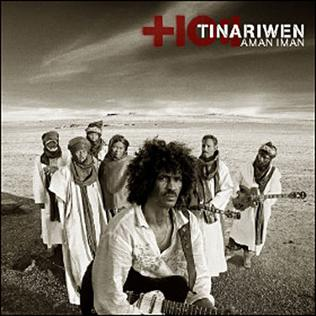
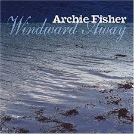
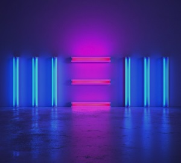

= Радио Аэростат. Глава XIX
:toc: left

> link:aerostat.html[Главная страница]

== 15 сентября 2013 - 23 февраля 2014

<http://old.aquarium.ru/misc/aerostat/index19.html>

++++

++++

=== Новая Музыка Февраля, 23 февраля 2014

<http://old.aquarium.ru/misc/aerostat/aerostat458.html>

.Suzanne Vega - link:SUZANNE%20VEGA/2014%20-%20Tales%20from%20the%20Realm%20of%20the%20Queen%20of%20Pentacles/lyrics/pentacles.html#_horizon_there_is_a_road[Horizon]
image:SUZANNE VEGA/2014 - Tales from the Realm of the Queen of Pentacles/cover.jpg[Tales from the Realm of the Queen of Pentacles,200,200,role="thumb left"]

.Beck – Say Goodbye
image:BECK/Morning Phase/Cover.jpg[Morning Phase,200,200,role="thumb left"]

.Everything Everything – Kemosabe

.Tinariwen – Toumast Tincha

++++
 
++++

.Eels - link:EELS/Eels%20-%202014%20-%20The%20cautionary%20tales%20of%20Mark%20Oliver%20Everett%20-%20CD%201/lyrics/tales.html#_agatha_chang[Agatha Chang]
image:EELS/Eels - 2014 - The cautionary tales of Mark Oliver Everett - CD 1/cover.jpg[2014 - The cautionary tales of Mark Oliver Everett - CD 1,200,200,role="thumb left"]

.Pixies – Blue Eyed Hexe
image:PIXIES/Indie Cindy/cover.png[Indie Cindy,200,200,role="thumb left"]

[%hardbreaks]
Temples – Keep In The Dark
Damon Albarn – Everyday Robots
Grip Weeds – She Don't Care About Time
Suzanne Vega - link:SUZANNE%20VEGA/2014%20-%20Tales%20from%20the%20Realm%20of%20the%20Queen%20of%20Pentacles/lyrics/pentacles.html#_silver_bridge[Silver Bridge]

++++
 
++++

=== Акустические Воины 60-х, 16 февраля 2014

<http://old.aquarium.ru/misc/aerostat/aerostat457.html>

.Simon & Garfunkel - link:SIMON%20&%20GARFUNKEL/Simon%20&%20Garfunkel%20-%20Sounds%20of%20Silence/lyrics/silence.html#_blues_run_the_game[Blues Runs The Game]
image:SIMON & GARFUNKEL/Simon & Garfunkel - Sounds of Silence/cover.jpg[Sounds of Silence,200,200,role="thumb left"]

.Gerry Rafferty – Her Father Didn't Like Me Anyway
image:Billy Connolly & Gerry Rafferty - Best Of The Humblebums/cover.jpg[Best Of The Humblebums,200,200,role="thumb left"]

[%hardbreaks]
Ralph McTell – Bright And Beautiful Thing
Gerry Rafferty – Keep It To Yourself
Ewan MacColl – Dirty Old Town
Tom Paxton – The Last Thing On My Mind
Matthews Southern Comfort – Castle Far
Клячкин – И Вечный Бой
Ralph McTell – Streets Of London
Jackson C. Frank – My Name Is Carnival
Crosby & Nash – Southbound Train

++++
 
++++

=== Тело Боли, 9 февраля 2014

<http://old.aquarium.ru/misc/aerostat/aerostat456.html>

.REM. - link:REM/REM%20-%20Lifes%20Rich%20Pageant/lyrics/lifes.html#_swan_swan_h[Swan Swan H]

.Jethro Tull – With You There To Help

.Pugwash – Rose In The Garden Of Weeds
image:PUGWASH/2014 - A Rose in a Garden of Weeds/cover.jpg[A Rose in a Garden of Weeds,200,200,role="thumb left"]

.Procol Harum – Beyond The Pale
image:PROCOL HARUM/08-Exotic Birds And Fruit (1974)/cover.jpg[Exotic Birds And Fruit (1974),200,200,role="thumb left"]

++++
 
++++

[%hardbreaks]
Johnny Cash – Hurt
Nirvana – Heart Shaped Box
Peter Gabriel – Apres Moi
King Crimson – Book Of Saturdays
J. S. Bach – Gavotte. Suite #1
Cat Stevens – Fill My Eyes

++++
 
++++

=== Химолк, 2 февраля 2014

<http://old.aquarium.ru/misc/aerostat/aerostat455.html>

.Boys Of The Lough – Farewell To Whisky

.Gentle Good – Marwnad Chang-Kan

[%hardbreaks]
Boys Of The Lough – Sweet Rural Shade
Robin Laing – Loons Is Loons
Chieftains – Opening Theme (from Treasure Island)
Sweeney's Men – Willy O'Winsbury
Tim Hart & Maddy Prior – Bring Us In Good Ale
Pentangle – Light Flight
Brass Monkey – The Rose Lawn Cadrille
Boys Of The Lough – Sharon Eubank's Waltz

++++
 
++++

=== Миры Ашкенази, 26 января 2014

<http://old.aquarium.ru/misc/aerostat/aerostat454.html>

.Jethro Tull - link:JETHRO%20TULL/Jethro%20Tull%20-%20Heavy%20Horses/lyrics/horses.html#_one_brown_mouse[One Brown Mouse]
image:JETHRO TULL/Jethro Tull - Heavy Horses/cover.jpg[Heavy Horses,200,200,role="thumb left"]

.Paul Simon – Take Me To The Mardi Gras

.Beatles – Magical Mystery Tour
image:THE BEATLES/1967b - Magical Mystery Tour/cover.jpg[Magical Mystery Tour,200,200,role="thumb left"]

.Dead Can Dance – Return Of The She-King
image:DEAD CAN DANCE/2012 - Anastasis/cover.jpg[Anastasis,200,200,role="thumb left"]

++++
 
++++

.King Crimson – 21 Century Schizoid Man
image:KING CRIMSON/1969 - In the Court of the Crimson King/cover.jpg[In the Court of the Crimson King,200,200,role="thumb left"]

[%hardbreaks]
Nobukazu Takemura – White Ship And Small
Robin Williamson – Soor Plums
Nobukazu Takemura – Croon
Beatles – Sea Of Time

++++
 
++++

=== Примечательные альбомы 2013-го, 19 января 2014

<http://old.aquarium.ru/misc/aerostat/aerostat453.html>

.Eels – I'm Your Brave Little Soldier
image:EELS/Eels - 2014 - The cautionary tales of Mark Oliver Everett - CD 1/cover.jpg[2014 - The cautionary tales of Mark Oliver Everett - CD 1,200,200,role="thumb left"]

.Orchestral Manoeuvres In The Dark – Night Cafe 
image:Orchestral Manoeuvres in the Dark/2013 - English Electric/cover.png[English Electric,200,200,role="thumb left"]

.Mum – Eternity Is The Between Breaths

.David Bowie – Valentine's Day

++++
 
++++

[%hardbreaks]
Arctic Monkeys – Why'd You Only Call Me
John Grant – It Does Not Matter To Him
Adama Koita – Fantainfalla Toyo Bolo
John Vanderslice – How The West Was Won
Bill Callahan – The Sing
Beatles – Bad To Me

++++
 
++++

=== Новые Имена, 12 января 2014

<http://old.aquarium.ru/misc/aerostat/aerostat452.html>

.Gentle Good – Meddyliau Distaw'r Nos

[%hardbreaks]
Asgeir – Nyfallio Regn
Asgeir – Lupin Intrigue
William Fitzsimmons – I Kissed A Girl
Tigran Hamasyan – Seafarer
Tape Five – Dixie Bisquits
Joseph Ruarri – Got My Share
Psapp – Leaving In Coffins
Eric Church – Springsteen
Аквариум – Новогоднее поздравление 

++++
 
++++

=== Cнова Притчи, 5 января 2014

<http://old.aquarium.ru/misc/aerostat/aerostat451.html>

.Jethro Tull – Songs From The Wood
image:JETHRO TULL/1977  Songs From The Wood/cover.jpg[1977  Songs From The Wood,200,200,role="thumb left"]

.Tom Petty – Echo
image:TOM PETTY/Tom Petty - Echo/cover.jpg[Echo,200,200,role="thumb left"]

.Tom Waits – Jersey Girl
image:TOM WAITS/Tom Waits 1980 - Heartattack And Vine/cover.jpg[Heartattack And Vine,200,200,role="thumb left"]

.Cat Stevens – Silent Sunlight
image:CAT STEVENS/Catch Bull At Four/front.jpg[Catch Bull At Four,200,200,role="thumb left"]

++++
 
++++

.Cat Stevens – Where Do The Children Play

.5 Hand Reel – Ae Fond Kiss

[%hardbreaks]
Tommy Sands – Road To Aughnacloy
Frank Harte/Donal Lunny – Henry Joy
Tim Buckley – Morning Glory

++++
 
++++

=== С Новым Годом!, 29 декабря 2013

<http://old.aquarium.ru/misc/aerostat/aerostat450.html>

.Archie Fisher - Joy Of My Heart

.Kate Rusby - The Holly And The Ivy

[%hardbreaks]
5 Hand Reel - Freedom Come-All-Ye
Beatles - I Want To Tell You
Van Morrison - Brand New Day
Beatles? - Now And Then
Сплин - Мороз по коже
Семеро Из Под Камней - Андромеда
Борис Рубекин - Planxty BG
Louis Armstrong - Winter Wonderland

++++
 
++++

=== С Рождеством!, 22 декабря 2013

<http://old.aquarium.ru/misc/aerostat/aerostat449.html>

[%hardbreaks]
Bing Crosby - Here Comes Santa Claus
Dean Martin - Peace On Earth/Silent Night
Maddy Prior - On Christmas Night
Dropkick Murphrys - The Season's Upon Us
Eddy Arnold - C-H-R-I-S-T-M-A-S
Dave King - Christmas And You
Pretenders - 2000 Miles
Kate Rusby - Cranbrook
Albion Christmas Band - Alderbury Wassail
Bing Crosby - Do You Hear What I Hear
Bing Crosby - White Christmas 

++++
 
++++

=== Америка в 50-е, 15 декабря 2013

<http://old.aquarium.ru/misc/aerostat/aerostat448.html>

[%hardbreaks]
Les Paul And Mary Ford - Vaya Con Dios
Eve Boswell - Sugar Bush
Tennessee Ernie Ford - The Ballad Of Davy
The Four Knights - I Love The Sunshine Of Your Smile
Marylin Monro - I Wanna Be Loved By You
Dean Martin - Mambo Italiano
Ink Spots - If I Didn't Care
Larry Hooper - Oh Happy Day
Jimmie Rodgers - Kisses Sweeter Than Wine
Four Freshmen - Graduation Day
Elvis Presley - Blue Suede Shoes
Michael Holliday - In Love

++++
 
++++

=== "Аквариум плюс", 8 декабря 2013

<http://old.aquarium.ru/misc/aerostat/aerostat447.html>

[%hardbreaks]
Аквариум - Как Движется Лед
Аквариум - Молитва И Пост
Аквариум - Рухнул
Аквариум - Сердце Из Песка
Аквариум - Кошка Моря
Аквариум - Сутра Ледоруба
Аквариум - Синее Небо Белые Облака
Аквариум - Из Хрустального Захолустья
Аквариум - Песнь Весеннего Восстановления 

++++
 
++++

=== Бог знает что, 1 декабря 2013

<http://old.aquarium.ru/misc/aerostat/aerostat446.html>

.Procol Harum - Luskus Delph

[%hardbreaks]
Neil Finn - Song Of The Lonely Mountain
БГ - Праздник Урожая Во Дворце Труда
БГ - Не Было Такой И Не Будет
Dechen Shak-Dagsay - Dolma
Berlioz - Symphonie Fantastique.2. Un Bal
Beatles - Hey Jude

++++
 
++++

=== Новая Му Ноября, 24 ноября 2013

<http://old.aquarium.ru/misc/aerostat/aerostat445.html>

[%hardbreaks]
Sting - What Have We Got?
Connan Mockasin - Do I Make You Shy?
Blitzen Trapper - Feel The Chill
Boy George - Nice And Slow
Master Musicians Of Jajouka - Djebala Hill
David Bowie - Atomica
Christie Moore - St. Arthur's Day
Motorhead - Lost Woman Blues
Clannad - Rhapsody Nagrann

++++
 
++++

=== Harry Nilsson, 17 ноября 2013

<http://old.aquarium.ru/misc/aerostat/aerostat444.html>

[%hardbreaks]
Harry Nilsson - I Guess The Lord Must Be In NYC
Harry Nilsson - I Said Goodbye To Me
Harry Nilsson - Good Old Desk
Harry Nilsson - Cuddly Toy
Harry Nilsson - Me & My Arrow
Harry Nilsson - Coconut
Harry Nilsson - Living Without You
Harry Nilsson - Without You
Harry Nilsson - You're Breaking My Heart
Harry Nilsson - Nobody Cares About The Railroads
Harry Nilsson - Loop Di Loop
Harry Nilsson - Mr. Bojangles

++++
 
++++

=== "New" Paul McCartney, 10 ноября 2013

<http://old.aquarium.ru/misc/aerostat/aerostat443.html>

.Paul McCartney – Save Us

[%hardbreaks]
Paul McCartney – New
Paul McCartney – Appreciate
Paul McCartney – On My Way To Work
Paul McCartney – Alligator
Paul McCartney – Queenie Eye
Paul McCartney – Hosanna
Paul McCartney – Looking At Her
Paul McCartney – Struggle
Paul McCartney – Turned Out
Paul McCartney – Everybody Out There 

++++
 
++++

=== Строго Второй Эшелон, 3 ноября 2013

<http://old.aquarium.ru/misc/aerostat/aerostat442.html>

[%hardbreaks]
Those New Puritans – Fragment Two
Fat Freddy's Drop – Blackbird
Steve Jansen – December Train
Laura Mvula – Green Garden
Johnny Dowd – Easy Money
Grimes – Genesis
Mavis Staples – You Are Not Alone 

++++
 
++++

=== "Ommadawn", 27 октября 2013

<http://old.aquarium.ru/misc/aerostat/aerostat441.html>

.Mike Oldfield – Ommadawn Part 1

[%hardbreaks]
Mike Oldfield – Ommadawn Part 2
Mike Oldfield – On Horseback

++++
 
++++

=== Новые Песни Октября, 20 октября 2013

<http://old.aquarium.ru/misc/aerostat/aerostat440.html>

.Paul McCartney – Alligator

.Cotton Mather – Animal Show
image:COTTON MATHER/Cotton Mather - Kon Tiki/Folder.jpg[Kon Tiki,200,200,role="thumb left"]

.Fratellis – We Need Medicine

[%hardbreaks]
Peter Gabriel & S. Merritt – Not One Of Us
Kelley Stoltz – Marcy
Gary Numan – I Am Dust
Robert Plant & Sss – I'm Your Witch Doctor
Of Montreal – Obsidian Currents
Jonathan Wilson – Trials Of Jonathan
Fratellis – Seven Days Seven Nights

++++
 
++++

=== Варвары и греки, 13 октября 2013

<http://old.aquarium.ru/misc/aerostat/aerostat439.html>

.REM - link:REM/REM%20-%20Document/lyrics/document.html#_exhuming_mccarthy[Exhuming McCarthy]
image:REM/REM - Document/cover.jpg[Document,200,200,role="thumb left"]

.Jethro Tull – Wind Up
image:JETHRO TULL/1971  Aqualung/cover.jpg[1971  Aqualung,200,200,role="thumb left"]

[%hardbreaks]
David Bowie – Kooks
D.A.F. – Der Rauber Und Der Prinz
Massive Attack – Karmacoma
Radiohead – 22
Red Hot Chili Peppers – We Believe
Jethro Tull – Hymn 43
Rolling Stones – Undercover Of The Night
Torelli – Sonata A Cinque: Allegro
Future Cloud & Radar – Green Mountain Clover

++++
 
++++

=== Little Richard, 6 октября 2013

<http://old.aquarium.ru/misc/aerostat/aerostat438.html>

[%hardbreaks]
Little Richard – Keep A Knockin'
Little Richard – Bama Lama Bama Loo
Little Richard – True, Fine Mama
Little Richard – Rip It Up
Little Richard – Ready Teddy
Little Richard – Tutti Frutti
Little Richard – Long Tall Sally
Little Richard – Slippin' And Slidin'
Little Richard – The Girl Can't Help It
Little Richard – Seach Me Lord
Little Richard – Certainly Lord
Little Richard – Lucille
Little Richard – Ooh! My Soul
Little Richard – Baby Don't You Tear My Clothes
Little Richard – Boo Hoo Hoo Hoo

++++
 
++++

=== Страшная Сила Красоты, 29 сентября 2013

<http://old.aquarium.ru/misc/aerostat/aerostat437.html>

[%hardbreaks]
Lemon Jelly – His Majesty King Raam
Lightning Seeds – Perfect
Аквариум – Красота Это Страшная Сила
Red Hot Chili Peppers – Someone
Beck – Lost Cause
Tom Petty – Square One
Leisure Society – Save It For Someone
Leonard Cohen – Crazy To Love You
Blood Sweat & Tears – And When I Die
Beatles – I Will

++++
 
++++

=== Del Amitri, 22 сентября 2013

<http://old.aquarium.ru/misc/aerostat/aerostat436.html>

.Del Amitri – Not Where It's At

.Del Amitri – Roll To Me

[%hardbreaks]
Del Amitri – Cry To Be Found
Del Amitri – Some Other Sucker's Parade
Del Amitri – Be My Downfall
Del Amitri – Driving With The Brakes On
Del Amitri – Tell Her This
Del Amitri – Always The Last To Know
Del Amitri – Life Is Full
Del Amitri – Won't Make It Better 

++++
 
++++

=== Новые Песни Сентября, 15 сентября 2013

<http://old.aquarium.ru/misc/aerostat/aerostat435.html>

.Pixies – Andro Queen
image:PIXIES/Indie Cindy/cover.png[Indie Cindy,200,200,role="thumb left"]

.Pond – Giant Tortoise

.Mum – Toothwheels

[%hardbreaks]
Justin Currie – Bend To My Will
Caliphone – The Orchids
Bob Dylan – Railroad Bill
Polyphonic Spree – You're Golden
Paul McCartney – New
БГ – Губернатор
Justin Currie – Priscilla 
