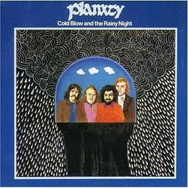

= Радио Аэростат. Глава XX
:toc: left

> link:aerostat.html[Главная страница]

== 2 марта 2014 - 24 августа 2014

++++

++++

=== Fats Waller, 24 августа 2014

<http://old.aquarium.ru/misc/aerostat/aerostat484.html>

.Fats Waller – Handful Of Keys

[%hardbreaks]
Fats Waller – Lulu's Back In Town
Jelly Roll Morton – Dead Man Blues
Fats Waller – Your Feet's Too Big
Fats Waller – I'm Gonna Sit Right Down
Fats Waller – All That Meat And No Potato
Fats Waller – Two Sleepy People
Fats Waller – Good Man Is Hard To Find
Fats Waller – The Joint Is Jumping
Fats Waller – Lenox Avenue Blues
Fats Waller – I Ain't Got Nobody
Fats Waller – Squeeze Me

++++
 
++++

=== Брик-О-Брак (Понемногу О Разном), 17 августа 2014

<http://old.aquarium.ru/misc/aerostat/aerostat483.html>

[%hardbreaks]
Stevie Wonder – Secret Life Of Plants
Аквариум – Ты Дерево
Nick Mason – Can't Get My Motor To Start
Johnny Winter – Rock'n'Roll Hoochie Koo
Lou Reed – The Gift
Damian Marley – There For You
Cindy Lauper – Time After Time
Aly Bain-Phil Cunningham – Sarah's Song
Nick Drake – Saturday Sun

++++
 
++++

=== Радио Африка, 10 августа 2014

<http://old.aquarium.ru/misc/aerostat/aerostat482.html>

[%hardbreaks]
Аквариум – Вызываю Капитана Африка
Аквариум – Песни Вычерпывающих Людей
Аквариум – Мальчик Евграф
Аквариум – Змея
Аквариум – Вана Хойя
Аквариум – Радио Шао Линь
Аквариум – Музыка Серебряных Спиц
Аквариум – Тибетское Танго
Аквариум – Время Луны
Аквариум – Еще Один Упавший Вниз

++++
 
++++

=== Урожай Августа, 3 августа 2014

<http://old.aquarium.ru/misc/aerostat/aerostat481.html>

.King Creosote - link:King%20Creosote/King%20Creosote%202014%20-%20From%20Scotland%20With%20Love/lyrics/scotland.html#__one_floor_down[One Floor Down]
image:King Creosote/King Creosote 2014 - From Scotland With Love/cover.jpg[From Scotland With Love,200,200,role="thumb left"]

.Eno-Hyde – Cells & Bells

.Richard Thompson – Walking On The Wire
image:RICHARD THOMPSON/1968_2009 - Walking on a Wire/cover.png[Walking on a Wire,200,200,role="thumb left"]

[%hardbreaks]
Mozart – Serenade #13. 3 – Menuett
Sinead O'Connor – Dense Water, Deeper Down
5 Seconds Of Summer – Don't Stop
Andrew Bird – Far From Any Road
OOIOO – Gamel Ninna Yama
Kip Moore – Somethin' Bout The Truck

++++
 
++++

=== Planxty, 27 июля 2014

<http://old.aquarium.ru/misc/aerostat/aerostat480.html>

.Planxty – Johnny Cope

.Planxty – Sweet Thames Flow Softly
image:PLANXTY/Planxty 1973 - Planxty/cover.jpg[Planxty,200,200,role="thumb left"]

.Planxty – Hewlett

.Planxty – The Irish Marche

++++
 
++++

[%hardbreaks]
Planxty – Out On The Ocean/Toicfaidh Tu Abhaile
Planxty – Dennis Murphy's Polka
Planxty – The Jolly Beggar
Planxty – Bean Phaidin
Planxty – True Love Knows No Season

++++
 
++++

=== Невоспетые герои, 20 июля 2014

<http://old.aquarium.ru/misc/aerostat/aerostat479.html>

.Neil Innes – How Sweet To Be An Idiot

.Howlin' Wolf – Spoonful
image:Howlin Wolf - His Best/cover.jpg[His Best,200,200,role="thumb left"]

[%hardbreaks]
J.S.Bach – English Suite 2.VI
John Sebastian – Rainbows All Over Yb
J.S.Bach – English Suite 1.V
Buzzcocks – Ever Fallen In Love?
Gram Parsons – Brass Buttons
Fats Waller – Ain't Misbehaving
Nick Mason – Hot River
Matia Bazar – Vacanze Romane
J.S.Bach – English Suite 2.VI

++++
 
++++

=== Мой Led Zeppelin, 13 июля 2014

<http://old.aquarium.ru/misc/aerostat/aerostat478.html>

.Led Zeppelin - Houses Of The Holy
image:LED ZEPPELIN/Led Zeppelin - Physical Graffiti/Physical Graffiti.jpg[Physical Graffiti,200,200,role="thumb left"]

.Led Zeppelin – Celebration Day
image:LED ZEPPELIN/Led Zeppelin - III/III.jpg[III,200,200,role="thumb left"]

[%hardbreaks]
Led Zeppelin – Tangerine
Led Zeppelin – Immigrant
Led Zeppelin – Dancing Days
Led Zeppelin – Good Times Bad Times
Led Zeppelin – Since I've Been Loving You
Led Zeppelin – In The Light

++++
 
++++

=== Новые Альбомы Июля, 6 июля 2014

<http://old.aquarium.ru/misc/aerostat/aerostat477.html>

.Tom Petty – U Get Me High

.Robert Plant – Rainbow
image:ROBERT PLANT/2014 - Lullaby and the ceaseless roar/cover.jpg[Lullaby and the ceaseless roar,200,200,role="thumb left"]

[%hardbreaks]
Arthur Brown – Zim Zam Zim
Arthur Brown – The Unknown
Jan Rohrweg – Opening: Dreamland Of Love
R.E.M. – Favourite Writer
9bach – Pa Le?
Led Zeppelin – Key To The Highway
Leisure Society – Colombia
R.E.M. – Yellow River

++++
 
++++

=== Время Мифа, 29 июня 2014

<http://old.aquarium.ru/misc/aerostat/aerostat476.html>

.Cocteau Twins – Watchlar
image:Cocteau Twins/Cocteau Twins - 1991 CD Single Box Set/Cocteau Twins - 09 Iceblink Luck/covers.jpg[09 Iceblink Luck,200,200,role="thumb left"]

[%hardbreaks]
Rolling Stones – 2000 Light Years From Home
Buxtehude – Toccata In G Major
Beatles – Here There And Everywhere
Paul McCartney – Cafe On The Left Banke
Jethro Tull – Acres Wild
Idle Race – The End Of The Road
Jimi Hendrix – Bold As Love
Robin Laing – Summer Of '46
Jethro Tull – Look Into The Sun

++++
 
++++

=== Новые Имена, 22 июня 2014

<http://old.aquarium.ru/misc/aerostat/aerostat475.html>

[%hardbreaks]
Bombay Bicycle Club – Feel
St. Vincent – Cruel
Burial – Forgive
Sleaford Mods – 14 Day Court
Julie Fowlis – Smeorath Chlann
Malawi Mouse Boys – Ndiyamika
Elizabeth Fraser – At Last I'm Free
Riviere Noir – Bate Longe
Malawi Mouse Boys – Machimo Anga Ngambir

++++
 
++++

=== Евгений Клячкин, 15 июня 2014

<http://old.aquarium.ru/misc/aerostat/aerostat474.html>

[%hardbreaks]
Евгений Клячкин – Не Гляди Назад, Не Гляди
Евгений Клячкин – Сигаретой Опиши Колечко
Евгений Клячкин – Cидишь Беременная Бледная
Евгений Клячкин – Псков
Евгений Клячкин – Поиски Тепла
Евгений Клячкин – Песня О Правах
Евгений Клячкин – Мелодия В Ритме Лодки
Евгений Клячкин – Романс Князя Мышкина
Евгений Клячкин – Письма Римскому Другу
Евгений Клячкин – Романс Черта
Евгений Клячкин – Прощание
Евгений Клячкин – Зимний Сон

++++
 
++++

=== The Specials, 8 июня 2014

<http://old.aquarium.ru/misc/aerostat/aerostat473.html>

[%hardbreaks]
The Specials – (Dawning Of A) New Era
The Specials – Gangsters
The Specials – Too Much Too Young
The Specials – Hey Little Rich Girl
The Specials – International Jet Set
The Specials – Ghost Town
The Specials – You're Wondering Now
The Specials – Blank Expression
The Specials – A Message To You Rudy
The Specials – Enjoy Yourself

++++
 
++++

=== Новые Песни Июня, 1 июня 2014

<http://old.aquarium.ru/misc/aerostat/aerostat472.html>

[%hardbreaks]
Anoushka Shankar – River Pulse
Chrissie Hynde – Dark Sunglasses
Morrissey – World Peace Is None Of Your Business
Anoushka Shankar – Fathers
Eno/Hyde – Daddy's Car
Carlene Carter – Little Black Train
Lee Perry – Copy This And Copy That
Tune-Yards – Water Fountain
Specials – Friday Night Saturday Morning
БГ – Поутру В Поле

++++
 
++++

=== 9 лет Аэростатики, 25 мая 2014

<http://old.aquarium.ru/misc/aerostat/aerostat471.html>

[%hardbreaks]
Manfred Mann – My Name Is Jack
Mary Hopkin – Sparrow
Eric Burdon – Orange And Red Beams
Van Morrison – Into The Mystic
George Harrison – Life Itself
Cure – Friday I'm In Love
Jeff Lynne – Blown Away
Debussy – Clair De Lune
Red Hot Chili Peppers – Someone
Jethro Tull – Reasons For Waiting

++++
 
++++

=== Истории Марка Эверетта, 18 мая 2014

<http://old.aquarium.ru/misc/aerostat/aerostat470.html>

[%hardbreaks]
Eels – Where I'm At
Eels – Parallels
Eels – Lockdown Hurricane
Eels – Series Of Misunderstandings
Eels – A Swallow In The Sun
Eels – Kindred Spirits
Eels – Dead Reckoning
Eels – Agatha Chang
Eels – Gentlemen's Choice
Eels – Where I'm From
Eels – Answers
Eels – Where I'm Going

++++
 
++++

=== Новые Песни Мая, 11 мая 2014

<http://old.aquarium.ru/misc/aerostat/aerostat469.html>

[%hardbreaks]
Ziggy Marley – I Get Up
Jack White – Lazaretto
Ian Anderson – Heavy Metals
Woods – Twin Steps
William S. Burroughs – Virus B-23
Jesca Hoop – Tulip (Undressed)
Toumani-Sidki Diabate – Rachid Ouiguini
Liars – Mask Maker
Johnny Cash – Out Among The Stars
Ziggy Marley – Fly Rasta

++++
 
++++

=== Lester Young, 4 мая 2014

<http://old.aquarium.ru/misc/aerostat/aerostat468.html>

[%hardbreaks]
Lester Young – Ad Lib Blues
Lester Young – I Can't Get Started
Lester Young – Almost Like Being In Love
Lester Young – Come Rain Or Come Shine
Lester Young – Prisoner Of Love
Lester Young – Who Wants Love?
Lester Young – On The Sunny Side Of The Street
Lester Young – Stardust
Lester Young – These Foolish Thing
Lester Young – On The Sunny Side Of The Street

++++
 
++++

=== Белтайн, 27 апреля 2014

<http://old.aquarium.ru/misc/aerostat/aerostat467.html>

[%hardbreaks]
Barleyjuice – Fiddlers Green
David Munroe/Early Music – Faerie Round
Steeleye Span – Weary Cutters
Martyn Bennett – The Magic Flute
Hedningarna – Tappmarschen
Joemy Wilson – The Ash Grove
Lunasa – Autumn Child
Robin Williamson – Road The Gypsies Go
Robin Laing – The Unquiet Grave
Richard Thompson/Phil Pickett – Short
Andy M. Stewart – Heart Of The Home

++++
 
++++

=== Сейчас, 20 апреля 2014

<http://old.aquarium.ru/misc/aerostat/aerostat466.html>

[%hardbreaks]
Charpantier – Te Deum
Donovan – Oh Gosh
R.E.M. – Make It All Okay
Paisible – Sonata In D. Allegro
Radik Tyulush – Solchur Suurum
David Bowie – Time
John Martyn – Sweet Little Mystery
J.S. Bach – Piano Concerto #2
Paul McCartney – This One
Weepies – All That Beauty 

++++
 
++++

=== Новые альбомы апреля, 13 апреля 2014

<http://old.aquarium.ru/misc/aerostat/aerostat465.html>

[%hardbreaks]
Quilt – Eye Of The Pearl
Metronomy – Monstrous
Noah Gundersen – Time Moves Quickly
Elbow – Fly Boy Blue/Lunette
БГ – Голубиное Слово
Jack Bruce – Hidden Cities
Tyrannosaurus Rex – Oh Baby
Daltrey/Johnson – Ice On The Motorway
Stephen Malkmus & The Jicks – Lariat

++++
 
++++

=== Толубей Толубей, 6 апреля 2014

<http://old.aquarium.ru/misc/aerostat/aerostat464.html>

[%hardbreaks]
Jackson Browne – Take It Easy
Skrillex – All Is Fair In Love And Brostep
Frank Zappa – Zombie Woof
Johnny Winter – Rock Me Baby
Eels – Mistakes Of My Youth
Red Hot Chili Peppers – Funny Face
БГ – Пришел Пить Воду
George Harrison – Just For Today

++++
 
++++

=== Вакханалия Любовь, 30 марта 2014

<http://old.aquarium.ru/misc/aerostat/aerostat463.html>

[%hardbreaks]
Bryan Ferry – Sweet And Lovely
Traveling Wilburys – You Took My Breath Away
Cardigans – Beautiful One
Elvis Presley – It's Now Or Never
Rolling Stones – Parachute Woman
Procol Harum – The Rum Tale
Paul Simon – Something So Right
John Renbourne – Bunyan's Hymn
Magnetic Fields – Busby Berkeley Dreams
Jeff Lynne – She
Beatles – All My Loving

++++
 
++++

=== Гобой и иже с ним, 23 марта 2014

<http://old.aquarium.ru/misc/aerostat/aerostat462.html>

[%hardbreaks]
Carl Ditters – Maj
Ustad Bismilla Khan – Dhun
Djivan Gasparyan – Tonight
David Munrow – Paduana From Banchetto
Handel – Oboe Concerto #3 (Largo)
Tanita Tikaram – Twist In My Sobriety
Oregon – Cane Fields
БГ Бэнд – Никита Рязанский
Van Morrison – Got To Go Back
J.S.Bach – Concerto In A Maj For Oboe

++++
 
++++

=== Русские Барды и Я, 16 марта 2014

<http://old.aquarium.ru/misc/aerostat/aerostat461.html>

[%hardbreaks]
Высоцкий – Дела
Высоцкий – Нейтральная Полоса
Окуджава – Песенка Веселого Солдата
Высоцкий – Старый Дом
Кукин – Город
Городницкий – Деревянные Города
Высоцкий – Я Не Люблю
Галич – Красный Треугольник
Окуджава – Ворон
Клячкин – Грустная Песенка О Городских Влюбленных
Клячкин – Ах, Улыбнись
Окуджава – Грузинская Песня
Клячкин – Мокрый Вальс

++++
 
++++

=== Новые Песни Марта, 9 марта 2014

<http://old.aquarium.ru/misc/aerostat/aerostat460.html>

[%hardbreaks]
Villagers – Occupy Your Mind
Penguin Cafe – Radio Bemba
Snowbird – All Wishes Are Ghosts
Catrin Finch/Seckou Keita – Bamba
Сплин – Мысль
Get The Blessing – Viking Death Moped
Sheryl Crow – Easy
Krishna Das – 4 Am Hanuman Chalisa

++++
 
++++

=== Lou Reed, 2 марта 2014

<http://old.aquarium.ru/misc/aerostat/aerostat459.html>

[%hardbreaks]
Lou Reed – Vicious
Lou Reed – Venus In Furs
Lou Reed – Waiting For My Man
Lou Reed – Walk On The Wild Side
Lou Reed – Man Of Good Fortune
Lou Reed – Metal Machine Music Pt.1
Lou Reed – How Do You Think It Feels?
Lou Reed – Dirty Blvd
Lou Reed – Caroline Says
Lou Reed – Goodnight Ladies