= Радио Аэростат. Глава XXI
:toc: left

> link:aerostat.html[<Home>]
> link:toc.html[<Contents>]
> link:lyrics.html[<Lyrics>]

== 31 августа 2014 - 22 февраля 2015

<http://old.aquarium.ru/misc/aerostat/index21.html>

++++

++++

=== Новый Джаз Британии, 22 февраля 2015

<http://old.aquarium.ru/misc/aerostat/aerostat510.html>

.John Surman - Whistman's Wood
image:John Surman/Saltash Bells/cover.jpg[Saltash Bells,200,200,role="thumb left"]

[%hardbreaks]
Troyka - Arcades
Kit Downes - Light From Old Stars
Matthew Bourne - Montauk Variations 3
Arun Ghosh - Aurora
Jim Rattigan - Jessica
Nigel Price Organ Trio - Hit The Road

++++
 
++++

=== Русские композиторы, 15 февраля 2015

<http://old.aquarium.ru/misc/aerostat/aerostat509.html>

[%hardbreaks]
Римский-Корсаков - Майская Ночь
Даргомыжский - Меланхолический Вальс
Глинка - Камаринская
Римский Корсаков - Золотой Петушок
Балакирев - Увертюра На Темы Трех Русских Народных Песен
Кюи - Сюита No.2, Часть 2
Мусоргский - Картинки с выставки
Кюи - Пьеса в Народном Стиле
Чайковский - Марш из балета "Щелкунчик"

++++
 
++++

=== Новые Песни. Февраль, 8 февраля 2015

<http://old.aquarium.ru/misc/aerostat/aerostat508.html>

.Aphex Twin - Diskhat ALL Prepared1mixed

.Mark Knopfler - Beryl
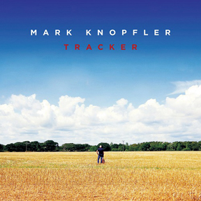

[%hardbreaks]
Prodigy - Nasty
Nickelback - Sister Sin
Panda Bear - Sequentional Circuits
Marylin Manson - Fated, Faithful, Fatal
Mini Mansions - Any Emotions
Paradise Bangcok Molam International Band - Trak
Infected Mushroom - Bass Nipple

++++
 
++++

=== Imbolc 2015, 1 февраля 2015

<http://old.aquarium.ru/misc/aerostat/aerostat507.html>

.James Vincent McMorrow - Gold

[%hardbreaks]
Gaelic Storm - Slim Jim & The 7/11 Girl
Alan Kelly's Gang - Lollie's Waltz
Caoimhin O'Raghallaigh - What What What
Talos - Tethered Bones
I Have A Tribe - Monsoon
Padraig Rynne - May's Smile
John McSherry - The Wave Sweeper
Lumiere - My Dearest Dear
Phil Cunningham/Aly Bain - Sheenagh's Air

++++
 
++++

=== Пятиугольный Грех, 25 января 2015

<http://old.aquarium.ru/misc/aerostat/aerostat506.html>

[%hardbreaks]
Террариум - Полина Дороти
Террариум – География
Террариум – Вести С Огорода
Террариум – Моллой Пришел
Террариум – Пятиугольный Грех
Террариум – Электрическая Птица
Террариум – Зоя И Соня
Террариум – Лабрадор Гибралтар
Террариум – Китайцы Не Хотят
Террариум – Креол
Террариум – Январский Романс

++++
 
++++

=== Deluxe По Сусекам, 18 января 2015

<http://old.aquarium.ru/misc/aerostat/aerostat505.html>

.Jethro Tull – Rainbow Blues

.Jethro Tull – Elegy
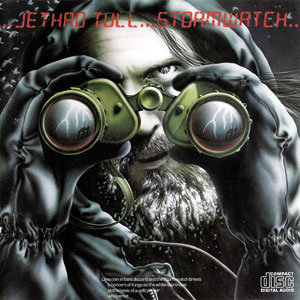

.Emerson Lake & Palmer – Oh My Father
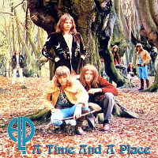

[%hardbreaks]
Electric Light Orchestra – Everyone's Born To Die
Pink Floyd – Wine Glasses
Simon & Garfunkel – Star Carol
Tom Petty – Around The Roses
Rolling Stones – Claudine
Led Zeppelin – The Girl I Love She Got Long Black Wavy Hair
BG – Slide
Hollies - Do The Best You Can

++++
 
++++

=== Новая музыка, 11 января 2015

<http://old.aquarium.ru/misc/aerostat/aerostat504.html>

.Decemberists – The Wrong Year
image:THE DECEMBERISTS/2015 What a terrible world what a beautiful world/cover.png[2015 What a terrible world what a beautiful world,200,200,role="thumb left"]

.Kate Rusby – The Youthful Boy
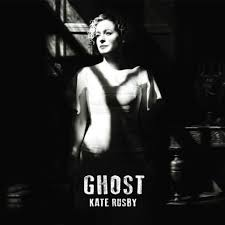

[%hardbreaks]
Junipers – Oh Gilbert
Gong – When God Shakes Hands With Devil
Damian Marley – Is It Worth It
Thompson Family – One Life At A Time
Grasscut – Catholic Architecture
Kettel – Fincity
Paul McCartney – Hope For The Future

++++
 
++++

=== Притчи, 4 января 2015

<http://old.aquarium.ru/misc/aerostat/aerostat503.html>

.Bob Dylan – I Dreamed I Saw St Augustine

.Don McLean – Falling Through Time
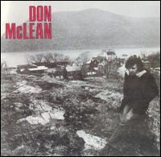

.Archie Fisher – Lindsay
image:ARCHIE FISHER/1976 - Will Ye Gang Love/cover.jpg[Will Ye Gang Love,200,200,role="thumb left"]

[%hardbreaks]
Chris Wood – The Cottager's Reply
Nic Jones – The Flandyke Shore
John Martyn – Sweet Little Mystery
Dick Gaughan – Bonnie Jeannie O'Betheln
Eliza Carthy/Norma Waterson – 5
Bert Jansch – Black Water Side
Bob Dylan – You Ain't Going Nowhere

++++
 
++++

=== К Новому Году!, 28 декабря 2014

<http://old.aquarium.ru/misc/aerostat/aerostat502.html>

[%hardbreaks]
Billy Gilman – Angels We Have Heard On High
Elvis Presley – Here Comes Santa Claus
Johnny Cash – We'll Meet Again
Beatles – What Goes On
Thompson Twins – We Are Detective
Sally Oldfield – Mirrors
Чайковский – Щелкунчик, Акт 1, Марш
Русский Роговой Оркестр – Funiculi Funicula
Albion Christmas Band – Alderbury Wassai
Cornelius – Chapter 8
John Chibadura – Zano Rako Mkoma
Bing Crosby – White Christmas

++++
 
++++

=== Лучшие Альбомы 2014, 21 декабря 2014

<http://old.aquarium.ru/misc/aerostat/aerostat501.html>

.Sun Kil Moon – Ben's My Friend

.Robert Plant – Up On The Hollow Hill
image:ROBERT PLANT/2014 - Lullaby and the ceaseless roar/cover.jpg[Lullaby and the ceaseless roar,200,200,role="thumb left"]

.Lana Del Rey – West Coast

.Leonard Cohen – My Oh My
image:LEONARD COHEN/2014 - Popular Problems/cover.jpg[Popular Problems,200,200,role="thumb left"]

++++
 
++++

.Eels - link:EELS/Eels%20-%202014%20-%20The%20cautionary%20tales%20of%20Mark%20Oliver%20Everett%20-%20CD%201/lyrics/tales.html#_lonely_lockdown_hurricane[Lonely Lockdown Hurricane]
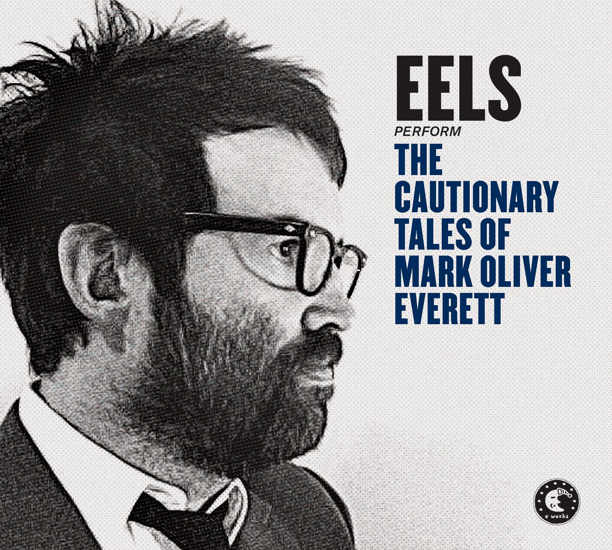

.War On Drugs – Red Eyes
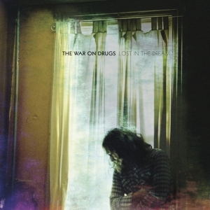

.Future Islands – Seasons (Waiting On You)
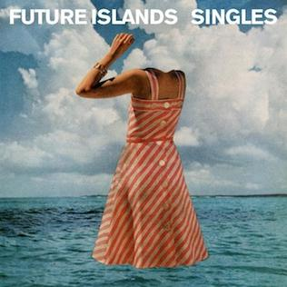

[%hardbreaks]
FKA Twigs – Two Weeks
Hiss Golden Messenger – Lucia

++++
 
++++

=== О красоте и счастье, 14 декабря 2014

<http://old.aquarium.ru/misc/aerostat/aerostat500.html>

.Donovan - link:DONOVAN/Donovan%20-%20A%20Gift%20From%20a%20Flower%20to%20a%20Garden/lyrics/gift.html#_there_was_a_time[There Was A Time]
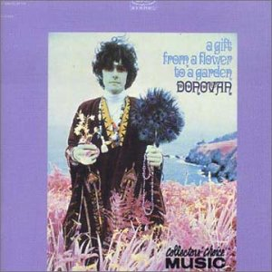

.Cotton Mather – link:COTTON%20MATHER/Cotton%20Mather%20-%20Kon%20Tiki/lyrics/kontiki.html#_my_before_and_after[My Before & After]
image:COTTON MATHER/Cotton Mather - Kon Tiki/Folder.jpg[Kon Tiki,200,200,role="thumb left"]

.Beatles – Sexie Sadie

.Tom Waits - link:TOM%20WAITS/2006%20-%20Orphans%20Brawlers,%20Bawlers,%20Bastards/CD2/lyrics/orphans2.html#_you_can_never_hold_back_spring[You Can Never Hold Back Spring]
image:TOM WAITS/2006 - Orphans Brawlers, Bawlers, Bastards/cover.jpg[Orphans Brawlers  Bawlers  Bastards,200,200,role="thumb left"]

++++
 
++++

.Procol Harum – Boredom
image:PROCOL HARUM/1969 - A Salty Dog/images.jpg[A Salty Dog,200,200,role="thumb left"]

.King Crimson – Cadence & Cascade
image:KING CRIMSON/In The Wake Of Poseidon/cover.jpg[In The Wake Of Poseidon,200,200,role="thumb left"]

.John Lennon – Bless You
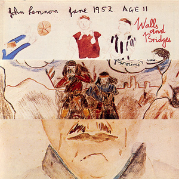

[%hardbreaks]
Manfredini – Concerto Grosso In D, 1
Tony Scott – Za Zen (Meditation)
George Harrison – Let It Be Me

++++
 
++++

=== Небылицы из жизни, 7 декабря 2014

<http://old.aquarium.ru/misc/aerostat/aerostat499.html>

.Donovan – link:DONOVAN/Donovan%20-%20HMS%20Donovan/lyrics/hms.html#_lost_time[Lost Time]
image:DONOVAN/Donovan - HMS Donovan/cover.jpg[HMS Donovan,200,200,role="thumb left"]

.Soft Machine – Dedicated To You But You Weren't Listening
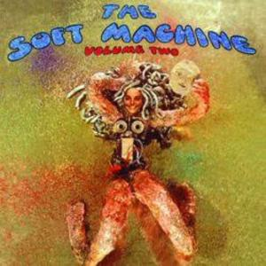

.Roger Eno – An Excursion
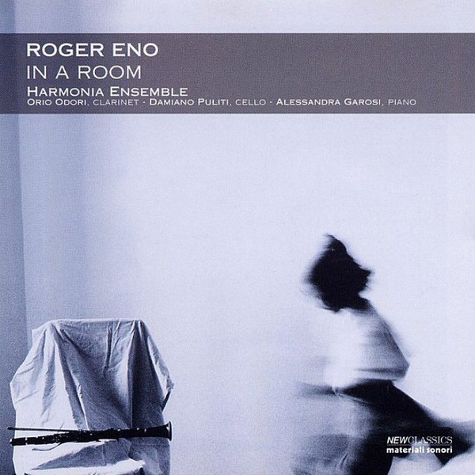

.Joni Mitchell – Ladies Of The Canyon
image:JONI MITCHELL/1970 - Ladies of the Canyon/front.png[Ladies of the Canyon,200,200,role="thumb left"]

++++
 
++++

.Van Morrison – Crazy Face
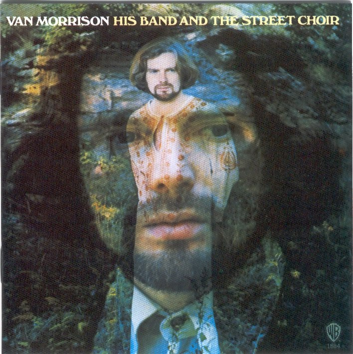

[%hardbreaks]
Who – Heinz Baked Beans
Jerry Rafferty – Please Sing A Song For Us
Paul Rodgers & The Maytals – See You Smile
Parry – Jerusalem
Roger Mcguinn – Suddenly Blue
Bhajan Singers – Ganesh

++++
 
++++

=== Kevin Ayers, 30 ноября 2014

<http://old.aquarium.ru/misc/aerostat/aerostat498.html>

.Kevin Ayers – Town Feeling
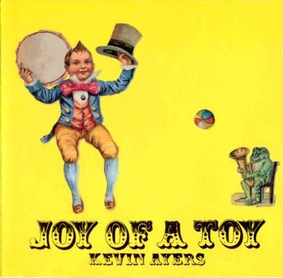

[%hardbreaks]
Kevin Ayers – Oh! Wot A Dream
Kevin Ayers – Caribbean Moon
Kevin Ayers – Stranger In Blue Suede Shoes
Kevin Ayers – The Lady Rachel
Kevin Ayers – Oh My
Kevin Ayers – Singing A Song In The Morning
Kevin Ayers – May I?
Kevin Ayers – Cold Shoulder
Kevin Ayers – Red Green And You Blue

++++
 
++++

=== Новые Пляски Динозавров, 23 ноября 2014

<http://old.aquarium.ru/misc/aerostat/aerostat497.html>

[%hardbreaks]
Pink Floyd – Calling
Pink Floyd – Louder Than Words
Neil Young – Plastic Flowers
Cat Stevens – Gold Digger
Bryan Ferry – Loop De Li
Jerry Lee Lewis – Stepchild
Robin Williamson – Alive Today
Queen – Love Kills

++++
 
++++

=== По Вашим Просьбам, 16 ноября 2014

<http://old.aquarium.ru/misc/aerostat/aerostat496.html>

[%hardbreaks]
Billy Mackenzie – Outernational
Rokia Traore – Kounandi
Fountains Of Wayne – Mexican Wine
Deine Lakaien – Into My Arms
Max Romeo – War Ina Babylon
Joao Gilberto – Rosa Moreno
Ed Sheeran – I See Fire

++++
 
++++

=== Новые Песни. Ноябрь, 9 ноября 2014

<http://old.aquarium.ru/misc/aerostat/aerostat495.html>

.Thom Yorke – A Brain In The Bottle
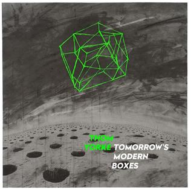

.Damien Rice – I Don't Want To Change You
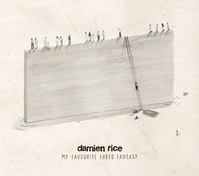

[%hardbreaks]
Levellers – What A Beautiful Day
Eric Clapton – For Jack
Bonnie Prince Billy – There Will Be Spring
AC/DC – Play Ball
Noel Gallagher – In the Heat Of A Moment
Ariel Pink – Put Your Number in My Phone
Bob Dylan – 900 Miles from My Home
Old Crow Medicine Show – Firewater

++++
 
++++

=== "Соль", 2 ноября 2014

<http://old.aquarium.ru/misc/aerostat/aerostat494.html>

[%hardbreaks]
БГ – Праздник Урожая
БГ – Любовь Во Время Войны
БГ – Пришёл Пить Воду
БГ – Ветка
БГ – Голубиное Слово
БГ – Если Я Уйду
БГ – Селфи
БГ – Stella Maris

++++
 
++++

=== Старики, 26 октября 2014

<http://old.aquarium.ru/misc/aerostat/aerostat493.html>

.Leonard Cohen - link:LEONARD%20COHEN/2014%20-%20Popular%20Problems/lyrics/popular.html#_slow[Slow]
image:LEONARD COHEN/2014 - Popular Problems/cover.jpg[Popular Problems,200,200,role="thumb left"]

.Robert Plant – Somebody There
image:ROBERT PLANT/2014 - Lullaby and the ceaseless roar/cover.jpg[Lullaby and the ceaseless roar,200,200,role="thumb left"]

.BB King – Tired Of Your Jive
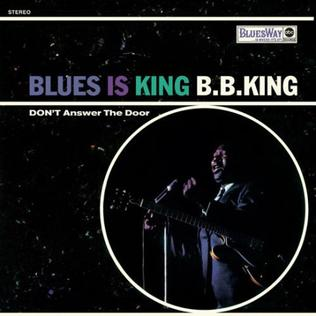

[%hardbreaks]
Вахтанг Кикабидзе – Мои Года Мое Богатство
Arthur Brown – Junkyard King
Lee Perry – Blackboard Re-Vision
Bob Dylan – Pay In Blood
Rolling Stones – Doom And Gloom

++++
 
++++

=== Молодые Неизвестно Кто, 19 октября 2014

<http://old.aquarium.ru/misc/aerostat/aerostat492.html>

[%hardbreaks]
Го Го Го – Коза
Vapors – Turning Japanese
Stiffs – Goodbye My Love
Gerry Mulligan – Prelude In E Min
John Steele Singers – The Staged Intervent
Wall Of Voodoo – Mexican Radio
Alexi Tuomarilo Trio – Jibeinia
Dowling Poole – Empires Buildings & Acqui
OK Go – Before The Earth Was Round
Lindisfarne – Meet Me On The Corner

++++
 
++++

=== Слова игумена Евмения, 12 октября 2014

<http://old.aquarium.ru/misc/aerostat/aerostat491.html>

.Donovan – To Susan On The West Coast
image:DONOVAN/Donovan - Barabajagal/cover.jpg[Barabajagal,200,200,role="thumb left"]

.Led Zeppelin – Down By The Seaside
image:LED ZEPPELIN/Led Zeppelin - Physical Graffiti/Physical Graffiti.jpg[Physical Graffiti,200,200,role="thumb left"]

[%hardbreaks]
New Vaudeville Band – Lily Marlene
Family – From Past Archives
Who – So Sad About Us
Free – Be My Friend
George Harrison – Beware Of Darkness
Idle Race – I'm Going Home
Herman's Hermits – Museum
Fortunes – Here It Comes Again

++++
 
++++

=== Урожай в Октябре, 5 октября 2014

<http://old.aquarium.ru/misc/aerostat/aerostat490.html>

.Leonard Cohen – Nevermind
image:LEONARD COHEN/2014 - Popular Problems/cover.jpg[Popular Problems,200,200,role="thumb left"]

.Annie Lennox – I Put A Spell On You
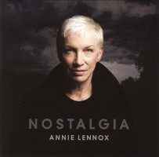

.U2 – Iris
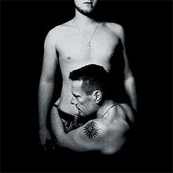

[%hardbreaks]
Courteneers – White Horses
Neville Staple – Play A Song For Me
Robyn Hitchcock – The Ghost In You
Cambodian Space Project – Mountain Dance
Brian Setzer – Let's Shake
Leonard Cohen – You Got Me Singing

++++
 
++++

=== Откуда Взялся "Чубчик", 28 сентября 2014

<http://old.aquarium.ru/misc/aerostat/aerostat489.html>

[%hardbreaks]
БГ – Станочек
Петр Лещенко – Прощай Мой Табор
Александр Вертинский – Дорогой Длинною
Георгий Виноградов – Счастье Мое
Александр Вертинский – Сероглазый Король
Александр Вертинский – Пани Ирэна
Теодор Бикель – Палсо Было Влюбляться
БГ – Пускай Погибну Безвозвратно
БГ – Миленький Ты Мой
Чиж – Солдат На Привале
Петр Лещенко – Стаканчики

++++
 
++++

=== Новые имена, 21 сентября 2014

<http://old.aquarium.ru/misc/aerostat/aerostat488.html>

[%hardbreaks]
Shakin' Stevens – This Ole House
Bobby Vee – Take Good Care Of My Baby
3 Mustaphas 3 – Medley: Buki E Kripe Ne
Omar Souleyman – Hedi Hedi
Red Garland – Baby Won't You Please Come
Lynyrd Skynyrd – Sweet Home Alabam
Steve Reich – Electric Counterpoint Slow
Status Quo – Paper Plane
Jack Johnson – Horizon Have Been Defeated
House Of Love – The Beatles And The Stones

++++
 
++++

=== Урожай Сентября 2014, 14 сентября 2014

<http://old.aquarium.ru/misc/aerostat/aerostat487.html>

.Eric Clapton – They Call Me The Breeze
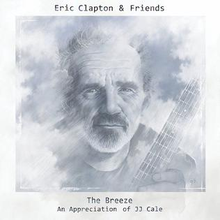

.King Creosote - link:King%20Creosote/King%20Creosote%202014%20-%20From%20Scotland%20With%20Love/lyrics/scotland.html#_cargill[Cargill]
image:King Creosote/King Creosote 2014 - From Scotland With Love/cover.jpg[From Scotland With Love,200,200,role="thumb left"]

.Leonard Cohen – Almost Like The Blues
image:LEONARD COHEN/2014 - Popular Problems/cover.jpg[Popular Problems,200,200,role="thumb left"]

.Beck - link:BECK/Beck%20Hansens%20Song%20Reader/lyrics/songs.html#_heaven_s_ladder[Heaven's Ladder]
image:BECK/Beck Hansens Song Reader/cover.jpg[Beck Hansens Song Reader,200,200,role="thumb left"]

++++
 
++++

.Aphex Twin – Minipops 67
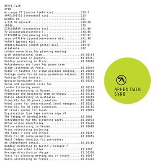

[%hardbreaks]
Los Pacaminos – Jump Back Baby
New Pornographers – Champions Of Red Wine
Liza Gerrard – Blinded
Royal Blood – Loose Change
БГ – Если Я Уйду

++++
 
++++

=== Гленн Гульд, 7 сентября 2014

<http://old.aquarium.ru/misc/aerostat/aerostat486.html>

[%hardbreaks]
J.S. Bach – French Suite #5 (Gigue)
Byrd – A Voluntary
J.S. Bach – Goldberg Variations 12
J.S. Bach – French Suite #2 – Allemande
Scarlatti – Sonata G Maj
J.S. Bach – English Suite #1, Bouree 1
Beethoven – 7 Bagatelles #1, Allemande
Mozart – Piano Sonata #11, 3 – Rondo A La Turc
J.S. Bach – Italian Concerto F Maj, 1
J.S. Bach – English Suite #1, Sarabande
J.S. Bach – Partita #3 in A Minor, II. Allemande
J.S. Bach – English Suite #1, Sarabande

++++
 
++++

=== Притчи в конце лета, 31 августа 2014

<http://old.aquarium.ru/misc/aerostat/aerostat485.html>

.Beck – Lazy Flies
image:BECK/Beck - Mutations/Folder.jpg[Mutations,200,200,role="thumb left"]

.Leonard Cohen – Suzanne
image:LEONARD COHEN/01-Songs Of Leonard Cohen (1967)/cover.jpg[Songs Of Leonard Cohen (1967),200,200,role="thumb left"]

.Beatles – This Boy
image:THE BEATLES/1988 - Past Masters/cover.jpg[Past Masters,200,200,role="thumb left"]

.Procol Harum – Still There'll Be More
image:PROCOL HARUM/1970 -Home/cover.jpg[Home,200,200,role="thumb left"]

++++
 
++++

[%hardbreaks]
Blood Sweat And Tears – Hi De Ho
Battlefield Band – Shepherd's Lad
Alan Price – My Home Town
Coope, Boyes & Sipson – Now Is The Cool Of The Day
Cake – Palm Of Your Hand
Rolling Stones – Love In Vain

---

> link:aerostat.html[<Home>]
> link:toc.html[<Contents>]
> link:lyrics.html[<Lyrics>]
