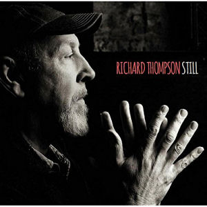

= Радио Аэростат. Глава XXII
:toc: left

link:aerostat.html[Главная страница]

== 1 марта 2015 - 23 августа 2015

<http://www.aquarium.ru/misc/aerostat/index22.html>

++++

++++

=== Dave Brubeck, 23 августа 2015

<http://aquarium.ru/misc/aerostat/aerostat536.html>

[%hardbreaks]
Dave Brubeck - Blue Rondo A La Turk
Dave Brubeck - Strange Meadow Lark
Dave Brubeck - Three To Get Ready
Dave Brubeck - Kathy's Waltz
Dave Brubeck - Take Five
Dave Brubeck - Everybody's Jumping
Dave Brubeck - Pick Up Sticks

=== Море чайной ложкой, 16 августа 2015

<http://www.aquarium.ru/misc/aerostat/aerostat535.html>

[%hardbreaks]
Iron&Wine&Ben Bridwell - This Must Be The Place
Things In Herds - Nothing Is Lost
Cannonball Adderley - Clouds
Carl Ditters von Dittersdorf - Sinfonia In F, 7
Nozinja - Xihukwani
Abaji - Kilmit Hob
Charles Ives - Set Of 3 Short Pieces
FSS - So Desu Ne
Dion & The Belmonts - Runaround Sue

=== Урожай августа, 9 августа 2015

<http://www.aquarium.ru/misc/aerostat/aerostat534.html>

.Richard Thompson - link:RICHARD%20THOMPSON/Richard%20Thompson%20-%20Still/lyrics/still.html#_she_never_could_resist_a_winding_road[She Never Could Resist a Winding Road]

[%hardbreaks]
David Gilmour - Rattle That Lock
Sleaford Mods - No One's Bothered
Chemical Brothers/Beck - Wide Open
Cocorosie - Heartache City
Wilco - Taste The Ceiling
Public Image Ltd - Double Trouble
Аквариум - Палёное Виски И Толчёный Мел
Magic - Rude

=== Друиды, 2 августа 2015

<http://www.aquarium.ru/misc/aerostat/aerostat533.html>

.John Surman - Dark Reflections

[%hardbreaks]
Derek Bell - Untitled Air/Colonel O'Hara
Chieftains - Ag Taisteal Na Blarnan
Alan Kelly Gang - Birdmaker
Robin Williamson - Flowers Of The Forrest
Chieftains - Green Grow The Rushes
Gay McKeown - Bean Dubh A'ghleanna
David Munrow - Crumhorn: Padouana
Alain Genty - Kan Bale
Lumier - Wind That Shakes The Barley

=== Майк, 26 июля 2015

<http://www.aquarium.ru/misc/aerostat/aerostat532.html>

[%hardbreaks]
Зоопарк - Пригородный Блюз
Зоопарк - Блюз Де Моску
Зоопарк - Если Ты Хочешь
Зоопарк - Все В Порядке (Старые Раны)
Зоопарк - Сладкая N
Зоопарк - Вперед, Бодхисаттва
Зоопарк - Песня Гуру
Зоопарк - Золотые Львы
Зоопарк - Дрянь
Зоопарк - Ода Ванной Комнате
Зоопарк - Прощай, Детка

=== Мир и Наши Мысли, 19 июля 2015

<http://www.aquarium.ru/misc/aerostat/aerostat531.html>

.Stravinsky - Pulcinella Suite, 6. Gavot
image:Stravinsky - Pulcinella (Suite)/cover.jpg[Pulcinella (Suite),200,200,role="thumb left"]

.John Surman - On Staddon Heights

.Brian Eno - The River

[%hardbreaks]
Hank Williams - I'm Sorry For You, My Friend
Zorge - Поздравляю
Messiaen - Vocalise
Kathmandu Music Center - 25 Pioneers
Beatles - Tell Me What You

++++
 
++++

=== Новое у Друзей в Петербурге, 12 июля 2015

<http://www.aquarium.ru/misc/aerostat/aerostat530.html>

[%hardbreaks]
Manfredini - Concerto Grosso F, Presto
Зоопарк - Растафара (Натти Дреда)
Аквариум - Растафара
Алексей Зубарев - Главная Тема
Игорь Тимофеев - Курс Санты
Борис Рубекин - Катенькин Вальс
Террариум - Сибирская Песня
Федоров-Волков - Муза
Зорге - Валентин
Зоопарк - Лето

=== Новые Имена, 5 июля 2015

<http://www.aquarium.ru/misc/aerostat/aerostat529.html>

[%hardbreaks]
T.Rex - There Was A Time
Staff Benda Belili - Je T'aime
Terje Isungset - Fading Sun
Julian Cope - They Were On Hard Drugs
Lenine - Jack Soul Braziliero
Wendy Mae Chambers - New York New York
Hindi Zahra - Beautiful Tango
8x8 - Laws Of Attraction
Steely Dan - Aja

=== Время Перемен, 28 июня 2015

<http://www.aquarium.ru/misc/aerostat/aerostat528.html>

.Bob Dylan – Queen Jane Approximately
image:BOB DYLAN/Bob Dylan 1963 - Blowing In The Wind/cover.jpg[Blowing In The Wind,200,200,role="thumb left"]

.Elliot Smith – Everything Means Nothing To Me
image:ELLIOTT SMITH/Elliott Smith 2000 - Figure 8/Folder.jpg[Figure 8,200,200,role="thumb left"]

[%hardbreaks]
Paul Simon – Song About The Moon
Стравинский – Pastorale:Chant Sans Paroles
Beck – Dreams
Malcolm Arnold - Inn Of 6th Happiness 2
Pixies – Indie Cindy
Terry Riley – Derveshum Carnivalis
Gandalf – Love Is The Answer

=== Еще Новые Песни, 21 июня 2015

<http://www.aquarium.ru/misc/aerostat/aerostat527.html>

.Brian Wilson – The Right Time

[%hardbreaks]
Grasscut – Radar
Slaves – Cheer Up London
James Taylor – Montana
Bill Wyman – Stuff
Tom Petty – Somewhere Under Heaven
David Cross/Fripp – Fear Of Starlight
Yo La Tengo – Deeper Into Movies
Motorhead – Thunder & Lightning
Third Eye Blind – Everything Is Easy

=== Канадская Музыка, 14 июня 2015

<http://www.aquarium.ru/misc/aerostat/aerostat526.html>

.Leonard Cohen – Everybody Knows
image:LEONARD COHEN/08-Im Your Man (1988)/cover.jpg[Im Your Man,200,200,role="thumb left"]

[%hardbreaks]
Gordon Lightfoot – If You Could Read
Guess Who – American Woman
Joni Mitchell – Court And Spark
Neil Young – Old Man
Steppenwolf – Who Needs Ya
Nickelback – Rockstar
Venetian Snares – Ever Apparent All Being
Barenaked Ladies – If I Had A 1000000$

=== Система Трех Ф, 7 июня 2015

<http://www.aquarium.ru/misc/aerostat/aerostat525.html>

[%hardbreaks]
Hot Chip – Huarache Lights
Sweet Billy Pilgrim – Coloma Blues
Tony Allen – Tiger's Skip
Cathal Smyth – She's Got The Light
Robin Guthrie & Mark Gardener – Amnesia
Vaccines – Handsome
William Elliott Whitmore – Can't Go Back
Matthew E. White – Rock&Roll Is Cold
Death & Vanilla – California Owls

=== Eric's Winds Of Change, 31 мая 2015

<http://www.aquarium.ru/misc/aerostat/aerostat524.html>

[%hardbreaks]
Eric Burdon & The Animals – Winds Of Change
Eric Burdon & The Animals – Poem By The Sea
Eric Burdon & The Animals – Paint It Black
Eric Burdon & The Animals – San Franciscan Nights
Eric Burdon & The Animals – Good Times
Eric Burdon & The Animals – Man/Woman
Eric Burdon & The Animals – Hotel Hell
Eric Burdon & The Animals – Orange And Red Beams
Eric Burdon & The Animals – Anything

=== 10 Лет Аэростату, 24 мая 2015

<http://www.aquarium.ru/misc/aerostat/aerostat523.html>

.Donovan – Skip-A-Long Sam
image:DONOVAN/Donovan - A Gift From a Flower to a Garden/cover.jpg[A Gift From a Flower to a Garden,200,200,role="thumb left"]

.David Bowie – Move On
image:DAVID BOWIE/David Bowie - Lodger/cover.jpg[Lodger,200,200,role="thumb left"]

.Robert Wyatt – Maryan

.Jethro Tull – Moths
image:JETHRO TULL/Jethro Tull - Heavy Horses/cover.jpg[Heavy Horses,200,200,role="thumb left"]

++++
 
++++

[%hardbreaks]
Mary Hopkin – Voyage Of The Moon
Tyrannosaurus Rex – Lofty Skies
Family – No Mule's Fool
Grateful Dead – Ripple
Cotton Mather – Heaven's Helping
Beatles – P.S. I Love You

=== Radio Silence, 17 мая 2015

<http://www.aquarium.ru/misc/aerostat/aerostat522.html>

[%hardbreaks]
БГ – Radio Silence
БГ – Postcard
БГ – Fields Of My Love
БГ – Real Slow Today
БГ – That Voice Again
БГ – Winter
БГ – Time
БГ – Mother

=== Новые Альбомы Мая, 10 мая 2015

<http://www.aquarium.ru/misc/aerostat/aerostat521.html>

[%hardbreaks]
East India Youth – Turn Away
Blur – Ghost Ship
Django Django – Found You
Weepies – Sirens
Bassekou Kouyate – Siran Fen
Richard Thompson – Beatnik Walking
Leonard Cohen – I Can't Forget
East India Youth – Carousel

=== Белтайн, 3 мая 2015

<http://www.aquarium.ru/misc/aerostat/aerostat520.html>

[%hardbreaks]
Young Dubliners – Seeds Of Sorrow
Bella Hardy – Good Man's Wife
Bully's Acre – Devlin'
Hanz Araki – Valentine O'Hara
Spiers & Boden – Bold Sir Rylas
Sam Lee – The Jew's Garden
Fisherman's Friends – Sweet Maids Of Madeira
Fairport Convention – Clear Water
Fairport Convention – Fylde Mountain

=== Ритуал, 26 апреля 2015

<http://www.aquarium.ru/misc/aerostat/aerostat519.html>

[%hardbreaks]
Pugwash – Answers On A Postcard
Eminem – Kill You
Elliot Smith – Morning After
Emerson Lake & Palmer – C'est La Vie
Rolling Stones – Love Is Strong
Red Hot Chili Peppers – Snow (Hey Oh)
Roger Mcguinn – King Of The Hill
Telemann – Concerto In G:Allegro
Bhajans – Shirdi Sai

=== Новые альбомы, апрель, 19 апреля 2015

<http://www.aquarium.ru/misc/aerostat/aerostat518.html>

[%hardbreaks]
Jon Spencer Blues Explosion – Do The Get Down
Leonard Cohen – Never Gave Nobody Trouble
Ringo Starr – Right Side Of The Road
Martin Gore – Europa Hymn
Prodigy – Ibiza
БГ/Wyatt – Stella Maris
Ghostpoet – X Marks The Spot
Johnny Dowd – White Dolemite
Van Morrison – Get On With The Show

=== Пасха: Делать и Быть, 12 апреля 2015

<http://www.aquarium.ru/misc/aerostat/aerostat517.html>

[%hardbreaks]
Junipers – Golden Fields In Golden Sun
Lumiere – The Silver Tassie
J. S. Bach – Partita #1.IV Sarabande
R.E.M. – At My Most Beatiful
Buxtehude – Fuga In G Maj
Vetiver – Time Flies By
George Harrison – Pisces Fish
Looper – These Things
Elgar – Chanson De Matin
Eberg – No Need To Worry

=== Что Я Слушаю, 5 апреля 2015

<http://www.aquarium.ru/misc/aerostat/aerostat516.html>

[%hardbreaks]
Robert Wyatt – Alien
Robert Wyatt – A Sunday In Madrid
Richard Thompson – Al Bowlly's In Heaven
Hemanta Kumar – Sangsar Jabe Mon Kere
Happy Traum – Sporting Life Blues
John Surman – The Pilgrim's Way
Jimi Hendrix – One Rainy Wish
Herman's Hermits – It's Nice To Be Out 

=== Позитивная Энергия, 29 марта 2015

<http://www.aquarium.ru/misc/aerostat/aerostat515.html>

[%hardbreaks]
Paul McCartney – No More Lonely Nights
Catrin Finch/Seckou Keita – Ceffylau
Cat Stevens – Another Saturday Night
Robin Williamson – Woodcutter's Song
Kathmandu Music – Prayers For Tara
Utsava & Friends – Asar Age Dibo Tomai
Archie Fisher – The Winter It Is Past
Sam Cooke – Wonderful World
Valerie Kimani – Sirudi Tena

=== Новые Песни Марта, 22 марта 2015

<http://www.aquarium.ru/misc/aerostat/aerostat514.html>

[%hardbreaks]
Belle & Sebastian – The Cat With Cream
Blur – Go Out
Bob Dylan – That Lucky Old Sun
Songhoy Blues – Soubour
Chilly Gonzales – Sweet Burden
Mark Almond – When The Comet Comes
Terrarium – Conduktor
Sufjan Stevens – No Shade In The Shadow
Seasick Steve – Bring It On

=== Коктейли и Жизнь, 15 марта 2015

<http://www.aquarium.ru/misc/aerostat/aerostat513.html>

[%hardbreaks]
Tommy Dorsey – You're Lonely And I'm Lonely
Cliff "Ukelele Ike" Edwards – That's My Weakness
Bert Ambrose – Miss Annabelle Lee
Johnny Marvin – Happy Days Are Here Again
Waring's Pensilvanians – Button Up Your Overcoat
Isham Jones – Who's Sorry Now
Eric Winstone – How Did He Look?
Harry Nilsson – Mucho Mungo
Ink Spots – Do I Worry
Vera Lynn – We'll Meet Again

=== Песни 8 марта, 8 марта 2015

<http://www.aquarium.ru/misc/aerostat/aerostat512.html>

[%hardbreaks]
Beatles – Words Of Love
Aквариум – День В Доме Дождя
Don McLean – And I Love You So
Paul McCartney – Distractions
Robert Palmer – Spellbound
Charles Aznavour – Isabelle
Roy Orbison – Pretty One
Lambchop – Is A Woman
Robert Palmer – Between Us
Paul Simon – Was A Sunny Da

=== Новые имена, 1 марта 2015

<http://www.aquarium.ru/misc/aerostat/aerostat511.html>

[%hardbreaks]
Idlewild – Readers And Writers
Jim Noir – Piece Of Mind
Exploited – Dead Cities
Roddy Woomble – Every Line Of A Long Moment
Chris Spedding – Now You See It
Tim Buckley – Song For The Siren
Harold Budd/Brian Eno – A Stream With Bright Fish
Dennis Brown – Money In My Pocket
Aluminum Group – Two Bit Faux Construction Song
Wings – Walking In The Park With Elois
