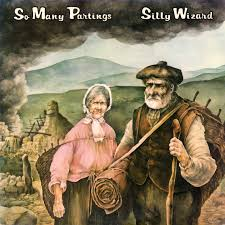
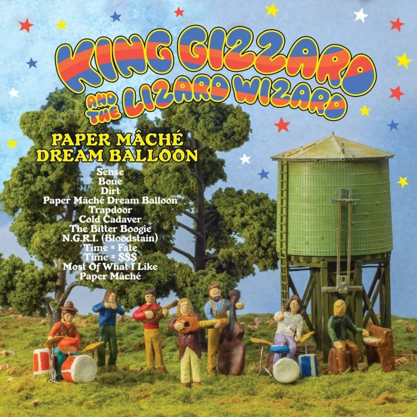

= Радио Аэростат. Глава XXIII
:toc: left

link:aerostat.html[Главная страница]

== 30 августа 2015 - 21 февраля 2016

<http://www.aquarium.ru/misc/aerostat/index23.html>

++++

++++

=== Новые Имена, 21 февраля 2016

<http://www.aquarium.ru/misc/aerostat/aerostat562.html>

[%hardbreaks]
Holborne - The Night Watch
Speedy West/J.B - Midnight Rambler
Clutch - X Ray Visions
Francoise Hardy - Tout Les Garcons
Ty Segall - Squealer
Irish Rovers - Don't Call Me Early
Allen Toussaint - Blue Drag
Dead Brothers - I Am All I Got
George Jones - If Drinking Don't Kill Me
Runrig - Loch Lomond

=== Pet Sounds, 14 февраля 2016

<http://www.aquarium.ru/misc/aerostat/aerostat561.html>

.Beach Boys - Wouldn't It Be Nice
image:The Beach Boys - Pet Sounds/cover.jpg[Pet Sounds,200,200,role="thumb left"]

[%hardbreaks]
Beach Boys - You Still Believe In Me
Beach Boys - That's Not Me
Beach Boys - Don't Talk
Beach Boys - Let's Go Away For a While
Beach Boys - I'm Waiting For The Day
Beach Boys - Sloop John B
Beach Boys - God Only Knows
Beach Boys - I Know There's An Answer
Beach Boys - Here Today
Beach Boys - I Just Wasn't Made For These Times
Beach Boys - Caroline No

=== New February Music, 7 февраля 2016

<http://www.aquarium.ru/misc/aerostat/aerostat560.html>

[%hardbreaks]
Suede - Like Kids
Animal Collective - Floridada
Yorkston/Thorne/Khan - Everything Sacred
Mad Professor - Zion Blood Dub 1
Show Of Hands - Breme Fell At Hastings
Massive Attack - Voodoo In My Blood
John Cale - Thoughtless Kind
High Llamas - Here Come The Rattlin
Iggy Pop - Gardenia

=== Памяти Энди М. Стюарта, 31 января 2016

<http://www.aquarium.ru/misc/aerostat/aerostat559.html>

.Silly Wizard - Queen Of All Argyll

.Silly Wizard - Valley Of Strathmore 

[%hardbreaks]
Andy M. Stewart - Take Her In Your Arms
Silly Wizard - Fisherman's Song
Andy M. Stewart - Ramblin Rover
Andy M. Stewart - Errant Apprentice
Andy M. Stewart - Fire In The Glen
Andy M. Stewart - I Mourn For The Highlands

++++
 
++++

=== David Bowie R.I.P., 24 января 2016

<http://www.aquarium.ru/misc/aerostat/aerostat558.html>

[%hardbreaks]
David Bowie - Sound And Vision
David Bowie - Golden Years
David Bowie - Scary Monsters
David Bowie - African Night Flight
David Bowie - Word On a Wing
David Bowie - Wild Is The Wind
Queen&David Bowie - Under Pressure
David Bowie - All The Madmen

=== История "Акустики", 17 января 2016

<http://www.aquarium.ru/misc/aerostat/aerostat557.html>

[%hardbreaks]
Аквариум - Песня Для Нового Быта
Аквариум - Сталь
Аквариум - Нам Всем Будет Лучше
Аквариум - Граф Гарсия
Аквариум - К Друзьям
Аквариум - Укравший Дождь
Аквариум - Моей Звезде
Аквариум - Иванов
Аквариум - 10 Стрел
Аквариум - 2е Стеклянное Чудо
Аквариум - Держаться Корней
Аквариум - Почему не падает небо
Аквариум - С Той Стороны Зеркального Стекла
Аквариум - 25 к 10

=== Песни Протеста, 10 января 2016

<http://www.aquarium.ru/misc/aerostat/aerostat556.html>

.Bob Dylan - Masters Of War
image:BOB DYLAN/Bob Dylan 1963 - The Freewheelin' Bob Dylan/cover.jpg[The Freewheelin Bob Dylan,200,200,role="thumb left"]

.Donovan - Universal Soldier
image:DONOVAN/Donovan - Catch The Wind/cover.jpg[Catch The Wind,200,200,role="thumb left"]

[%hardbreaks]
Buffalo Springfield - For What It's
Rolling Stones - Street Fightin Man
Steppenwolf - Monster
Barry Mcguire - Eve Of Destruction
Neil Young - Ohio
Jefferson Airplane - Crown Of Creation
Joan Baez - There But For Fortune
Byrds - Turn Turn Turn
Creedence Clearwater Revival - Who'll Stop The Rain

=== Best of 2015, 3 января 2016

<http://www.aquarium.ru/misc/aerostat/aerostat555.html>

.Richard Thompson - link:RICHARD%20THOMPSON/Richard%20Thompson%20-%20Still/lyrics/still.html#_broken_doll[Broken Doll]
image:RICHARD THOMPSON/Richard Thompson - Still/cover.jpg[Still,200,200,role="thumb left"]

.King Gizzard & The Lizard Wizard - Paper Mache Dream Balloon

.Keith Richards - link:Keith%20Richards%202015%20-%20Crosseyed%20Heart/lyrics/crosseyed.html#_nothing_on_me[Nothing On Me]
image:Keith Richards 2015 - Crosseyed Heart/cover.png[Crosseyed Heart,200,200,role="thumb left"]

.Jeff Lynne's ELO - I'm Leaving You

++++
 
++++

[%hardbreaks]
Prodigy - The Day Is My Enemy
Sleaford Mods - Face To Faces
Jonny Greenwood Etc - Junun
Леонид Федоров - В траве
Brian Wilson - Whatever Happened
Billy Gibbons - Treat Her Right

=== Предновогодние Притчи, 27 декабря 2015

<http://aquarium.ru/misc/aerostat/aerostat554.html>

[%hardbreaks]
Boys Of The Lough - Stella's Trip
The Ink Spots - I Don't Want to Set the World on Fire
Bob Dylan - Spirit On The Water
Grateful Dead - Sugar Magnolia 
Bruce Springsteen - Tougher Than The Rest
Elliot Smith - Say Yes
Archie Fisher - Waltz Into Winter
Beck - Nobody's Fault But Mine 
Rod Stewart - Love And Be Loved

=== Стихи под Рождество, 20 декабря 2015

<http://aquarium.ru/misc/aerostat/aerostat553.html>

[%hardbreaks]
Bing Crosby - Christmas Is Here To Stay 
Frank Sinatra - Christmas Dreaming 
Albion Christmas Band - On Christmas Night All Christians Sing 
Praetorius - In Dulce Jubilo 
Annie Lennox - God Rest You Merry Gentlemen 
Harry Connick - When My Heart Find Christmas 
Leon Redbone - Home For Holidays 
Ella Fitzgerald - Santa Claus Got Stuck In My Chimney 
Bing Crosby - O Fir Tree Dark 
Аквариум - Рождественская Ночь 
Bing Crosby - White Christmas

=== Buena Vista Social Club, 13 декабря 2015

<http://aquarium.ru/misc/aerostat/aerostat552.html>

[%hardbreaks]
Buena Vista Social Club - Amor De Loca Juventud
Buena Vista Social Club - De Camino A La Vereda
Buena Vista Social Club - El Cuarto De Tula
Buena Vista Social Club - Veinte Anos
Buena Vista Social Club - Candela
Buena Vista Social Club - Guajira En F
Ibrahim Ferrer - Cienfuegos Tiene

=== Новые Песни Декабря, 6 декабря 2015

<http://aquarium.ru/misc/aerostat/aerostat551.html>

.King Gizzard &The Lizard Wizard - Sense 

.Bob Dylan - I'll Keep It With Mine 
image:BOB DYLAN/The Bootleg Series Vol. 2/Folder.jpg[The Bootleg Series Vol. 2,200,200,role="thumb left"]

[%hardbreaks]
Seal - Padded Cell
Glen Hansard - Lowly Deserter
David Bowie - Black Star 
Jean-Michel Jarre & Laurie Anderson - Rely on Me 
Israel Nash - Fire And The Flood 
Everything Everything - Spring / Sun / Winter / Dread

++++
 
++++

=== Alone in the Universe, 29 ноября 2015

<http://aquarium.ru/misc/aerostat/aerostat550.html>

.Jeff Lynne's ELO - When I Was A Boy

[%hardbreaks]
Jeff Lynne's ELO - Love And Rain
Jeff Lynne's ELO - Dirty To The Bone
Jeff Lynne's ELO - When The Night Comes
Jeff Lynne's ELO - The Sun Will Shine On You
Jeff Lynne's ELO - Ain't It A Drag
Jeff Lynne's ELO - All My Life
Jeff Lynne's ELO - I'm Leaving You
Jeff Lynne's ELO - One Step At A Time
Jeff Lynne's ELO - Alone In The Universe
Jeff Lynne's ELO - Fault Line
Jeff Lynne's ELO - Blue

=== 3 = 8, 22 ноября 2015

<http://aquarium.ru/misc/aerostat/aerostat549.html>

[%hardbreaks]
Террариум - Сибирская Песня
Террариум - Сомнамбула Ночи
Террариум - Обратная Песня Харона
Террариум - Лэди Гуру и Билл
Террариум - Душа Не Ведает
Террариум - Не Прикасаясь К Тишине
Террариум - Бэби Убийца
Террариум - Это Было
Террариум - Гарфункель
Террариум - Кондуктор

=== Новые Песни Ноября, 15 ноября 2015

<http://aquarium.ru/misc/aerostat/aerostat548.html>

[%hardbreaks]
Bryan Adams - We Did It All 
Deerhunter - Take Care 
5 Seconds Of Summer - She's Kinda Hot 
Crowded House - Help Is Coming 
Umo & Jimi Tenor - Huumatun Pako 
Bill Ryder-Jones - Catharine & Hus 
Elvis Costello - I Want You 
Kurt Cobain - Sappy 
Rod Stewart - Hold The Line

=== Памяти Бориса Рубекина, 8 ноября 2015

<http://aquarium.ru/misc/aerostat/aerostat547.html>

[%hardbreaks]
Борис Рубекин - Катенькин Вальс
Борис Рубекин & Brian Finnegan - Ciaran & Bernie
Аквариум - Песня На День Рождения Джорджа
Борис Рубекин - Planxty BG
Аквариум - 5/4
Аквариум - 7/8
Аквариум - Девушки Танцуют Одни
Азимут Р - Легче Воздуха
7 Из Под Камней - С Камня Безоар
7 Из Под Камней - Секрет Зимнего Дня

=== Соуэн, 1 ноября 2015

<http://aquarium.ru/misc/aerostat/aerostat546.html>

[%hardbreaks]
Whistlebinkies - Ceilidh Lines 
Lunasa - The Walrus 
Battlefield Band - 5 Mile Chase 
Archie Fisher - Lord Of the May 
Andy M. Stewart - Parish Of Dunkeld 
Seamus Begley - Taimse Im Chodladh 
De Danann - My Baby Need A Shepherd 
Shooglenifty - Fitzroy Crossing 
Tannahill Weavers - Roddie MacDonald's Favourite

=== Стихи Поля Элюара, 25 октября 2015

<http://aquarium.ru/misc/aerostat/aerostat545.html>

[%hardbreaks]
Hesperus - Cary Owen 
Dragostin Folk - Hey You White Ned 
Afrocubism - Nima Diyala 
Jacques Brel - La Chanson Des Vieux 
Leonard Cohen - If It Be Your Will 
Franz Benda - Flute Sonata E Min, 3 
Free - Come Together In The Morning 
Dechen Shak-Dagsay - Namgyel Ma
Faure - Dolly: Tendresse 
Lambchop - Is A Woman

=== Новости Октября, 18 октября 2015

<http://aquarium.ru/misc/aerostat/aerostat544.html>

.Keith Richards - link:Keith%20Richards%202015%20-%20Crosseyed%20Heart/lyrics/crosseyed.html#_robbed_blind[Robbed Blind]
image:Keith Richards 2015 - Crosseyed Heart/cover.png[Crosseyed Heart,200,200,role="thumb left"]

.Decemberists - What Would I Now? 

[%hardbreaks]
Jeff Lynne's Elo - When I Was A Boy
London Souls - Someday
John Grant - Disappointing
Buddy Guy - Whiskey, Beer & Wine
Billy Gibbons - Got Love If You Want It
Gurrumul - Marwurrunburr
Faces - You Can Make Me Dance

=== Велосипедист и эгрегор, 11 октября 2015

<http://aquarium.ru/misc/aerostat/aerostat543.html>

[%hardbreaks]
Kathmandu Music - 25 Pioneers
Andy M. Stewart - They Wounded Old Ireland
Family - Burning Bridges
Beck - Chain Reaction
Procol Harum - Nothing That I Didn't Know
Jethro Tull - Weathercock
Dead Can Dance - The End Of Words
Arthada & Friends - Charan Tale
Richard Thompson - Shine On Love

=== Стихи Алена Боскэ, 4 октября 2015

<http://aquarium.ru/misc/aerostat/aerostat542.html>

[%hardbreaks]
Calliope Music - Smiles
Cannonball Adderley - Corcovado 
Cardigans - Travels With Charley
Cat Stevens - Sun/C79
Brian Wilson - Somewhere Quiet
Cocteau Twins - Fluffy Tuffs
Teleman - Recorder Sonata C Maj
Djivan Gasparian - Chiarescuroed
Bhajan Singers - Nam Dhare 
Beatles - And I Love Her

=== Еще Немного Нового , 27 сентября 2015

<http://aquarium.ru/misc/aerostat/aerostat541.html>

[%hardbreaks]
Beach House - Sparks 
Baio - Sister Of Pearl 
Rory Gallagher - Bad Penny 
Beverley Sisters - The Young Cavalier 
Jaga Jazzist - Starfire 
Gully Bop - My God Dem Nuh Bad Like Me 
Amy Whitehouse - Valerie 
Paul McCartney Etc - Love Song To Earth 
Small Faces - Ichickoo Park

=== Молчание - золото, 20 сентября 2015

<http://aquarium.ru/misc/aerostat/aerostat540.html>

[%hardbreaks]
Tremeloes - Silence Is Golden
Alan Price - Poor People
Peter Gabriel - Home Sweet Home
Free - Only My Soul
Blondie - Dreaming
Handel - Organ Concerto #8: Ouverture
King Creosote - Something To Believe In
David Gilmour - Today
Motorhead - Evil Eye
Bob Dylan - Gates Of Eden

=== Еще Новые Песни Сентября, 13 сентября 2015

<http://aquarium.ru/misc/aerostat/aerostat539.html>

[%hardbreaks]
Mynabirds - All My Heart
Alif - Holako
Hollywood Vampires - My Dead Drunk Friends
Duran Duran - You Kill Me With Silence
The Arcs - Outta My Mind
Haiku Salut - Bleak And Beautiful
Shirley Collins - Long Years Ago
Ben Folds - Phone In A Pool
Incredible String Band - Lover Man

=== Новые Песни Сентября, 6 сентября 2015

<http://aquarium.ru/misc/aerostat/aerostat538.html>

.Keith Richards - link:Keith%20Richards%202015%20-%20Crosseyed%20Heart/lyrics/crosseyed.html#_trouble[Trouble]
image:Keith Richards 2015 - Crosseyed Heart/cover.png[Crosseyed Heart,200,200,role="thumb left"]

[%hardbreaks]
Fratellis - Dogtown
Asian Dub Foundation - Signal And Noise
Richard Hawley - Which Way
Chvrches - Leave A Trace
Squeeze - Happy Days
Low - What Part Of Me
New Order - Restless
Black - Good Liar

=== Новости О Том и Сем, 30 августа 2015

<http://aquarium.ru/misc/aerostat/aerostat537.html>

[%hardbreaks]
Jeff Lynne - Junk
Rolling Stones - Cool Calm Collected
Zombies - Beechwood Park
Grateful Dead - Touch Of Grey
Jethro Tull - Down At The End Of Yr Road
T.Rex - Mystic Lady
Red Hot Chili Peppers - Love Of Your Life
Sandy Denny - Until The Real Thing Come
Rolling Stones - Something Happened To Me Yesterday

