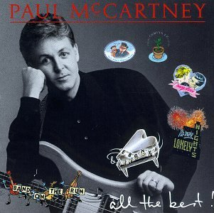
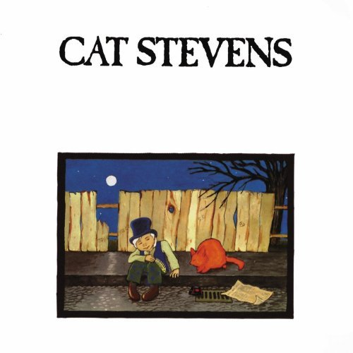

= Радио Аэростат. Глава XXIV
:toc: left

> link:aerostat.html[Главная страница]

== 28 февраля 2016 - 21 августа 2016

<http://old.aquarium.ru/misc/aerostat/index24.html>

++++

++++

=== э э каммингс, 21 августа 2016

<http://old.aquarium.ru/misc/aerostat/aerostat588.html>

[%hardbreaks]
Debussy - The Girl With The Flaxen Hair
Telemann - Trumpet Concerto. II
Alan Hovnannes - Concerto For Harp and String Orchestra
Harp Duet "Sharm" - Polka
One Harp And A Flute - Bridget Cruise
Charles Ives - A Set Of 3 Short Pieces
Charles Mingus - Memories Of You
Chet Atkins - City Of New Orleans
Chet Baker - Aren't You Glad You're You
Alexi Murdoch - Blue Mind

=== Не судьба, 14 августа 2016

<http://old.aquarium.ru/misc/aerostat/aerostat587.html>

.Sufjan Stevens - Concerning The UFO

.Mamas & Papas - Dancing Bear

.Electric Light Orchestra - Xanadu
image:Electric Light Orchestra/08_Xanadu (1980)/cover.jpg[Xanadu,200,200,role="thumb left"]

[%hardbreaks]
Fat White Family - Whitest Boy On The Beach
Love - Message To Pretty
George Harrison - Unknown Delight
Sinead O'Connor - The Lamb's Book of Life
Page & Plant - Wonderful One
Al Bowlly - Easy Come Easy Go

=== Новые Песни Августа, 7 августа 2016

<http://old.aquarium.ru/misc/aerostat/aerostat586.html>

.Divine Comedy - Catherine The Great
image:DIVINE COMEDY/2016 - Foreverland/Cover.jpg[Foreverland,200,200,role="thumb left"]

[%hardbreaks]
Peter Gabriel - I'm Amazing
Maarja Nuut - Odangule
Steven Tyler - Love Is Your Name
Jacob Collier - Woke Up Today
Edward II - Dirty Old Town
Biffy Clyro - Howl
Roy Orbison - Sweet Memories
Devendra Banhart - Middle Names
Ikaya - Love Note

=== Лунассад, 31 июля 2016

<http://old.aquarium.ru/misc/aerostat/aerostat585.html>

[%hardbreaks]
Iron Horse - Helen Of Kirconnel
Arum - Brighnest Sky Blue
Jim Reid - The Wild Geese/Norland Wind
Barrule - Kinnoull
Barry Kerr - Erin Go Bragh
Navigators - Warlike Lads Of Russia
Andy M. Stewart - By The Hush
Pauline Scanlon - The Poorest Company

=== "Золотой Букет", 24 июля 2016

<http://old.aquarium.ru/misc/aerostat/aerostat584.html>

[%hardbreaks]
БГ - Таруса
БГ - Лейся Песня
БГ - Весна На Заречной Улице
БГ - Славное Море Священный Байкал
БГ - О Встречном
БГ - Катя Катерина
БГ - Случай В Ватикане
БГ - То Не Ветер Ветку Клонит
БГ - Дом
БГ - Крутится Вертится Шар Голубой
БГ - Услышь Меня Хорошая

=== Новые Имена No.13, 17 июля 2016

<http://old.aquarium.ru/misc/aerostat/aerostat583.html>

.Super Furry Animals - Helium Hearts

[%hardbreaks]
Dandy Warhols - Bohemian Like You
Le Femme - Sphynx
Texas Tornados - Who Were You Thinkin'
Damien O'Kane - I Am A Youth
Die Artze - Lasse Redn
Terry Reid - River
Uma Mohan - Brahma Krtam
Rupa & April Fishes - Maintenant

=== Гендель - "Музыка на воде", 10 июля 2016

<http://old.aquarium.ru/misc/aerostat/aerostat582.html>

[%hardbreaks]
Handel - The Water Music. Suite in D maj. Allegro
Handel - The Water Music. Suite in F maj. Ouverture
Handel - The Water Music. Suite in F maj. Andante
Handel - The Water Music. Suite in G maj. Sarabande
Handel - The Water Music. Suite in F maj. Allegro
Handel - The Water Music. Suite in F maj. Presto
Handel - The Water Music. Suite in D maj. Alla Hornpipe
Handel - The Water Music. Suite in F maj. Air Presto
Handel - The Water Music. Suite in G maj. Rigaudon
Handel - The Water Music. Suite in G maj. Menuet
Handel - The Water Music. Suite in F maj. Hornpipe
Handel - The Water Music. Suite in F maj. Adagio e Staccato
Handel - The Water Music. Suite in F maj. Menuet
Handel - The Water Music. Suite in F maj. Country Dance

=== Red Hot Chili Peppers - "The Getaway", 3 июля 2016

<http://old.aquarium.ru/misc/aerostat/aerostat581.html>

.Red Hot Chili Peppers - The Getaway
image:RED HOT CHILI PEPPERS/Red Hot Chili Peppers 2016 - The Getaway/cover.jpg[The Getaway,200,200,role="thumb left"]

[%hardbreaks]
Red Hot Chili Peppers - Dark Necessities
Red Hot Chili Peppers - We Turn Red
Red Hot Chili Peppers - Goodbye Angels
Red Hot Chili Peppers - Sick Love
Red Hot Chili Peppers - The Longest Wave
Red Hot Chili Peppers - Go Robot
Red Hot Chili Peppers - Feasting On The Flowers
Red Hot Chili Peppers - Detroit

=== Новые Песни Июня, 26 июня 2016

<http://old.aquarium.ru/misc/aerostat/aerostat580.html>

.King Creosote - Helpless To Turn
image:King Creosote/2016 - with Michael Johnston - The Bound Of The Red Deer/folder.jpg[The Bound Of The Red Deer,200,200,role="thumb left"]

.Richard Ashcroft - This Is How It Feels

[%hardbreaks]
Christie Moore - Mandolin Mountain
Beck - Wow
Clayton Lennon Delirium - Cricket & The Genie
Afrocelt Sound System - Cascade
Аукцыон - Луна Упала
Paul McCartney - Wild And Beautiful

++++
 
++++

=== Paul Simon - "Stranger To Stranger", 19 июня 2016

<http://old.aquarium.ru/misc/aerostat/aerostat579.html>

.Paul Simon - link:PAUL%20SIMON/Paul%20Simon%20-%20Stranger%20To%20Stranger/lyrics/stranger.html#_in_a_parade[In A Parade]
image:PAUL SIMON/Paul Simon - Stranger To Stranger/cover.jpg[Stranger To Stranger,200,200,role="thumb left"]

[%hardbreaks]
Paul Simon - Werewolf
Paul Simon - Street Angel
Paul Simon - Stranger To Stranger
Paul Simon - The Riverbank
Paul Simon - Cool Papa Bell
Paul Simon - Wristband
Paul Simon - Insomniac's Lullaby
Paul Simon - The Clock
Paul Simon - Proof of Love

=== Blonde On Blonde, 12 июня 2016

<http://old.aquarium.ru/misc/aerostat/aerostat578.html>

.Bob Dylan - Rainy Day Women #12&5
image:BOB DYLAN/Bob Dylan 1966 - Blonde On Blonde/cover.jpg[Blonde On Blonde,200,200,role="thumb left"]

[%hardbreaks]
Bob Dylan - I Want You
Bob Dylan - Most Likely You Go Your Way And I'll Go Mine
Bob Dylan - Just Like A Woman
Bob Dylan - Stuck Inside Of Mobile With The Memphis Blues Again
Bob Dylan - Visions of Johanna
Bob Dylan - Absolutely Sweet Marie

++++
 
++++

=== Музыка Австралии, 5 июня 2016

<http://old.aquarium.ru/misc/aerostat/aerostat577.html>

.King Gizzard & The Lizard Wizard- Papier Mache Dream Balloon
image:KING GIZZARD & THE LIZARD WIZARD/2015 - Paper Mache Dream Balloon/front.jpg[Paper Mache Dream Balloon,200,200,role="thumb left"]

.Dead Can Dance - Black Sun

[%hardbreaks]
Tame Impala - Disciples
Midnight Oil - Beds Are Burning
Dennis Gibbons - Waltzing Matilda
Frank Ifield - She Taught Me How To Yode
Lucksmiths - Smokers In Love
Letterstick Band - Gugaliya Yerrcha
Augie March - Awol
Alexander Biggs - Out In The Dark
Resin Moon - Salt
King Gizzard & The Lizard Wizard - Bone

=== Мысли о йоге, 29 мая 2016

<http://old.aquarium.ru/misc/aerostat/aerostat576.html>

.Paul McCartney - Blue Jean Babe
image:PAUL MCCARTNEY/1999 - Run Devil Run/cover.jpg[Run Devil Run,200,200,role="thumb left"]

.Tom Waits - Mr. Siegal
image:TOM WAITS/Tom Waits 1980 - Heartattack And Vine/cover.jpg[Heartattack And Vine,200,200,role="thumb left"]

.George Harrison - Life Itself
image:GEORGE HARRISON/George Harrison - Somewhere In England/cover.jpg[Somewhere In England,200,200,role="thumb left"]

.UB40 - Bring Me Your Cup

++++
 
++++

.Paul McCartney - With A Little Luck

.Mike Oldfield - Wonderful Land

[%hardbreaks]
Alap Desai - Dhooni Re Dhakhavi
Handel - Organ Concerto #8, 2
Ustad Shujaat Khan - Benares

++++
 
++++

=== Cнег На Голову или Новые Песни Мая, 22 мая 2016

<http://old.aquarium.ru/misc/aerostat/aerostat575.html>

.Paul Simon - link:PAUL%20SIMON/Paul%20Simon%20-%20Stranger%20To%20Stranger/lyrics/stranger.html#_cool_papa_bell[Cool Papa Bell]
image:PAUL SIMON/Paul Simon - Stranger To Stranger/cover.jpg[Stranger To Stranger,200,200,role="thumb left"]

.Radiohead - Daydreaming

[%hardbreaks]
Red Hot Chili Peppers - Dark Necessities
Monkees - She Makes Me Laugh
9bach - Llyn Du
Optimystica Оrchestra - Долго До Праздника
Аквариум - Весна На Заречной Улице
Stone Roses - All For One

++++
 
++++

=== Маленькие Альбомы (EP), 15 мая 2016

<http://old.aquarium.ru/misc/aerostat/aerostat574.html>

.Donovan - Universal Soldier

.Beatles - Long Tall Sally
image:THE BEATLES/1988 - Past Masters/cover.jpg[Past Masters,200,200,role="thumb left"]

.Cocteau Twins - Quisquose

[%hardbreaks]
Rolling Stones - Around And Around
Kinks - Till The End Of The Day
Beatles - I Call Your Name
Pink Floyd - See Emily Play
Buzzcocks - Boredom
R.E.M. - Volves, Lower
Pogues - The Body Of The American
Аквариум - Собачий Вальс
Clash - I Fought The Law

=== Истории О Музыке, 8 мая 2016

<http://old.aquarium.ru/misc/aerostat/aerostat573.html>

.Etta James - At Lasty
image:Etta James - At Last!/cover.jpg[At Last!,200,200,role="thumb left"]

[%hardbreaks]
Elephants - Friendy
Papa Wemba - Maria Valenciay
MC5 - Tonighty
Who - See My Wayy
Os Mutantes - Panis Et Circencesy
Killing Joke - Redy
Afro Celt Sound System - When You're Fallingy
Andy Williams - Can't Get Used To Losing You

++++
 
++++

=== Пасха и Белтайн, 1 мая 2016

<http://old.aquarium.ru/misc/aerostat/aerostat572.html>

.Christy Moore - link:Christy%20Moore%20-%20Ordinary%20Man/lyrics/ordinary.html#_st_brendan_s_voyage[St. Brendan’s Voyage]
image:Christy Moore - Ordinary Man/cover.jpg[Ordinary Man,200,200,role="thumb left"]

.Donovan - Lord Of The Dance
image:DONOVAN/Donovan - HMS Donovan/cover.jpg[HMS Donovan,200,200,role="thumb left"]

.Maddy Prior - Christ The Lord Is Risen Today

.Cat Stevens - Morning Has Broken

++++
 
++++

[%hardbreaks]
Simeon Wood - Standing On The Rock
Beatles - Eight Days A Week
Craig Duncan - All Things Bright and Beautiful
Chieftains - Hedigan's Fancy
Maddy Prior - Light Of The World
Our Daily Bread - A Mighty Fortress 

++++
 
++++

=== Новые Песни В Апреле, 24 апреля 2016

<http://old.aquarium.ru/misc/aerostat/aerostat571.html>

.Paul Simon - link:PAUL%20SIMON/Paul%20Simon%20-%20Stranger%20To%20Stranger/lyrics/stranger.html#_wristband[Wristband]
image:PAUL SIMON/Paul Simon - Stranger To Stranger/cover.jpg[Stranger To Stranger,200,200,role="thumb left"]

.Brian Eno - The Ship
image:BRIAN ENO/Brian Eno 2016 - The Ship/folder.jpg[The Ship,200,200,role="thumb left"]

.Eric Clapton - Can't Let You Do It

.PJ Harvey - The Community Of Hope

++++
 
++++

[%hardbreaks]
Pet Shop Boys - The Pop Kids
Mudcrutch - Trailer
Imarhan - Tahabort
Weezer - Good Thing

++++
 
++++

=== Aftermath, 17 апреля 2016

<http://old.aquarium.ru/misc/aerostat/aerostat570.html>

[%hardbreaks]
Rolling Stones - Mother's Little Helper
Rolling Stones - Get Off Of My Cloud
Rolling Stones - Stupid Girl
Rolling Stones - Flight 505
Rolling Stones - Under My Thumb
Rolling Stones - Lady Jane
Rolling Stones - Dontcha Bother Me
Rolling Stones - High And Dry
Rolling Stones - Out Of Time
Rolling Stones - I Am Waiting
Rolling Stones - Take It Or Leave It

=== Великие Продюсеры, 10 апреля 2016

<http://old.aquarium.ru/misc/aerostat/aerostat569.html>

.Tom Petty - Kings Highway
image:TOM PETTY/Tom Petty 1991 - Into the Great Wide Open/Folder.jpg[Into the Great Wide Open,200,200,role="thumb left"]

.Led Zeppelin - No Quarter
image:LED ZEPPELIN/Led Zeppelin - House Of The Holy/House Of The Holy.jpg[House Of The Holy,200,200,role="thumb left"]

.Beatles - link:THE%20BEATLES/1966%20-%20Revolver/lyrics/revolver.html#_eleanor_rigby[Eleanor Rigby]
image:THE BEATLES/1966 - Revolver/cover.jpg[Revolver,200,200,role="thumb left"]

.Beatles - Martha My Dear
image:THE BEATLES/The Beatles - White Album CD 1/cover.jpg[White Album CD 1,200,200,role="thumb left"]

++++
 
++++

.Donovan - A Sunny Day
image:DONOVAN/Donovan - Hurdy Gurdy Man/cover.jpg[Hurdy Gurdy Man,200,200,role="thumb left"]

.Red Hot Chili Peppers - By The Way
image:RED HOT CHILI PEPPERS/Red Hot Chilli Peppers - By the way/cover.jpg[By the way,200,200,role="thumb left"]

.Talking Heads - Crosseyed And Painless
image:Talking Heads - Remain In Light/Folder.jpg[Remain In Light,200,200,role="thumb left"]

.T-Rex - King Of The Mountain Cometh
image:T-REX/T-Rex - Electric Warrior/folder.jpg[Rex - Electric Warrior,200,200,role="thumb left"]

++++
 
++++

[%hardbreaks]
Traffic - Utterly Simple
Free - The Highway Song

++++
 
++++

=== Новые Имена, 3 апреля 2016

<http://old.aquarium.ru/misc/aerostat/aerostat568.html>

.Kimmo Pohjonen - Anemone

[%hardbreaks]
Coral - She Runs The River
Steve Forbert - Oh So Close (And Yet)
McCoy Tyner - Satin Doll
Indila - Derniere Dance
Robert Pollard - My Daughter Yes She Knows
Premiata Forneria Marconi - River Of Life
The Matshikos - New South Africa 

=== Ирландское Рагу, 27 марта 2016

<http://old.aquarium.ru/misc/aerostat/aerostat567.html>

.Doors - Spanish Caravan
image:Doors - Waiting For The Sun/Waiting For The Sun.jpg[Waiting For The Sun,200,200,role="thumb left"]

.Don McLean - On The Amazon
image:Don McLean 1972 - Don McLean/cover.png[Don McLean,200,200,role="thumb left"]

.Jefferson Airplane - Somebody To Love
image:Jefferson Airplane - Surrealistic Pillow/front.jpg[Surrealistic Pillow,200,200,role="thumb left"]

[%hardbreaks]
Eagles - Take It Easy
Elgar - Salut D'amour
Who - Someone's Coming
Emitt Rhodes - Somebody Made For Me
Belle & Sebastian - Take Your Carriage Clock And Shove It
Loreena McKennitt - Marco Polo
Queen - Dear Friends
Bhajans - Shirdi Sai

=== Новые Песни Марта, 20 марта 2016

<http://old.aquarium.ru/misc/aerostat/aerostat566.html>

.Tom Waits - The Soul Of A Man

[%hardbreaks]
Аквариум - Собачий Вальс
Аквариум - Пыль
Аквариум - Песни Нелюбимых
Blind Willie Johnson - Dark Was The Night
Sinead O'Connor - Trouble Will Soon
Iggy Pop - Break Into Your Heart
Rokia Traore - Tu Voles
Emerson, Lake & Palmer - Fugue
Tiger Lillies - In Love With Moon
Loretta Lynn - Everybody Wants To Go To Heaven

=== 60-е: Археология, 13 марта 2016

<http://old.aquarium.ru/misc/aerostat/aerostat565.html>

.Giles Giles & Fripp - Little Children
image:KING CRIMSON/1968 - The Cheerful Insanity Of/Folder.jpg[The Cheerful Insanity Of,200,200,role="thumb left"]

[%hardbreaks]
Harmony Grass - Summer Dreaming
Iron Butterfly - In The Time Of Our Lives
Nirvana - In The Courtyard Of Stars
Scott Fagan - In My Head
Duncan Browne - Dwarf In A Tree
Brewer - Witchi-Tai-To
Nick Garrie - Bungles Tour
Humblebums - Song For Simon
Tremeloes - Even The Bad Times Are Good

=== Булат Окуджава, 6 марта 2016

<http://old.aquarium.ru/misc/aerostat/aerostat564.html>

[%hardbreaks]
Булат Окуджава - Последний Троллейбус
Булат Окуджава - Ванька Морозов
Булат Окуджава - Неистов И Упрям
Булат Окуджава - Простите Пехоте
Булат Окуджава - Старая Солдатская Песня
Булат Окуджава - Грузинская Песня
Булат Окуджава - Прощание С Новогодней Ёлкой
Булат Окуджава - Молитва
Булат Окуджава - Чудесный Вальс
Булат Окуджава - Три Сестры
Булат Окуджава - Черный Кот
Булат Окуджава - Ночной Разговор
Булат Окуджава - Часовые Любви

=== Queen, 28 февраля 2016

<http://old.aquarium.ru/misc/aerostat/aerostat563.html>

[%hardbreaks]
Queen - I Want To Break Free
Queen - Death On Two Legs
Queen - Play The Game
Queen - Good Old Fashioned Lover Boy
Queen - Seaside Rendezvous
Queen - Killer Queen
Queen - Bohemian Rhapsody
Queen - Love Of My Life
Queen - Another One Bites The Dust
Queen - These Are The Days Of Our Lives
