= Радио Аэростат. Глава XXV
:toc: left

> link:aerostat.html[<Home>]
> link:toc.html[<Contents>]
> link:lyrics.html[<Lyrics>]

== 28 августа 2016 - 26 февраля 2017

<http://old.aquarium.ru/misc/aerostat/index25.html>

++++

++++

=== Заговор Гандхарвов, 26 февраля 2017
<https://aerostatbg.ru/release/615>

.Simon & Garfunkel - April Come She Will
image:SIMON & GARFUNKEL/Simon & Garfunkel - Sounds of Silence/cover.jpg[Sounds of Silence,200,200,role="thumb left"]

[%hardbreaks]
Bob Marley & The Wailers - Satisfy My Soul
Harry Nilsson - One
Orlando de Lassus - Heroum soboles
Arcangelo Corelli - Concerto Grosso No.6 in F major: Adagio
Rolling Stones - Highwire
J.S. Bach - English Suites No. 1 in A major: Allemande
Santana - Samba Pa Ti
J.S. Bach - English Suite No. 3 in G minor: Gavotte I and II
George Harrison - Ballad Of Sir Frankie Crisp (Let It Roll)

++++
 
++++

=== Новые Песни Февраля, 19 февраля 2017
<https://aerostatbg.ru/release/614>

[%hardbreaks]
Iggy Pop - Gold
The xx - On Hold
Depeche Mode - Where’s The Revolution
Black Sabbath - Sabbath Bloody Sabbath
Sleaford Mods - I Feel So Wrong
Ty Segall - Orange Color Queen
Jamiroquai - Automaton
Magnetic Fields - ‘74: No
Grandaddy - Way We Won’t

++++
 
++++

=== Великое Делание, 12 февраля 2017
<https://aerostatbg.ru/release/613>

.George Harrison – Greece
image:GEORGE HARRISON/George Harrison - Gone Troppo/cover.jpg[Gone Troppo,200,200,role="thumb left"]

.Brian Eno – Events In Dense Fog

.Roger Eno – A Moment
image:ROGER ENO/1993 - In a Room/cover.jpg[In a Room,200,200,role="thumb left"]

[%hardbreaks]
Matt Molloy - Idir Deighric ‘Gus Breo’
Carlo Gesualdo
Li Wei - Song For Gu Cheng
Giuseppe Cambini - Wind Quintet No.1 in B major: III. Rondo: Allegretto grazioso
Cannonball Adderley – Corcovado
Harold Budd/Brian Eno With Daniel Lanois – Their Memories
Chieftains – Love Theme (From Tristan And Isolde)

++++
 
++++

=== Пост-классическая музыка, 5 февраля 2017
<https://aerostatbg.ru/release/612>

.Yann Tiersen - Porz Goret

.Hauschka - Radar

[%hardbreaks]
Amiina - Sexfaldur
Nils Frahm – Snippet
Max Richter - Organum
A Winged Victory For The Sullen – Minuet For A Cheap Piano Number Two
Jóhann Jóhannsson – The Drowned World
Ólafur Arnalds – Words Of Amber
Nico Muhly - Who Was She?

++++
 
++++

=== Imbolc 2017, 29 января 2017
<https://aerostatbg.ru/release/611>

.Mr. Fox - link:MR%20FOX/1971%20-%20The%20Gypsy/lyrics/gypsy.html[Elvira Madigan]

.Silly Wizard - Bridget O’Malley
image:SILLY WIZARD/Silly Wizard - So Many Partings/cover.jpg[So Many Partings,200,200,role="thumb left"]

.Maddy Prior & The Carnival Band - My Dancing Day

.Whistlebinkies - Sir John Fenwick

++++
 
++++

.Tim Hart & Maddy Prior - Dancing At Whitsun
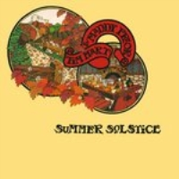

[%hardbreaks]
Clutha - Binnorie
5 Hand Reel - Bratach Bana
Gerry Rafferty - Mary Skeffington
McCalmans - Lochs Of The Tay
Guidewires - Marbh Ban

++++
 
++++

=== Аквариум. Гиперборея, 22 января 2017
<https://aerostatbg.ru/release/610>

[%hardbreaks]
Аквариум - Hyperborea In Memoriam
Аквариум - Апокриф
Аквариум - Ангел дождя
Аквариум - Время любви пришло
Аквариум - Ария Казанского Зверя
Аквариум - Магистраль
Аквариум - Быстрый Светлый

++++
 
++++

=== Finnegan’s Choice, 15 января 2017
<https://aerostatbg.ru/release/609>

[%hardbreaks]
Canzoniere Grecanico Salentino – Nu te fermare
Staves - Outlaw
Baloji - Spoiler
Avishai Cohen - Continuo
Mike Vass - Settled in Clay
San Fermin & Sam Amidon - Shiver
Ólafur Arnalds feat. Nanna Bryndís Hilmarsdóttir - Particles
Shee - Lady Grey
Lotte Kestner - Halo

++++
 
++++

=== Лучшие Альбомы 2016, 8 января 2017
<https://aerostatbg.ru/release/608>

.Red Hot Chili Peppers - Encore
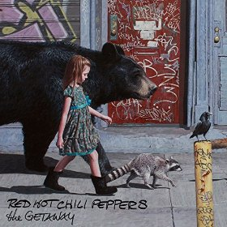

.Leonard Cohen - Leaving the Table

.Brian Eno - I’m Set Free
image:BRIAN ENO/Brian Eno 2016 - The Ship/folder.jpg[The Ship,200,200,role="thumb left"]

++++
 
++++

.Cotton Mather - link:COTTON%20MATHER/Cotton%20Mather%202016%20-%20Death%20of%20the%20Cool/lyrics/cool.html#_never_be_it[Never Be It]

.King Creosote - Betelgeuse
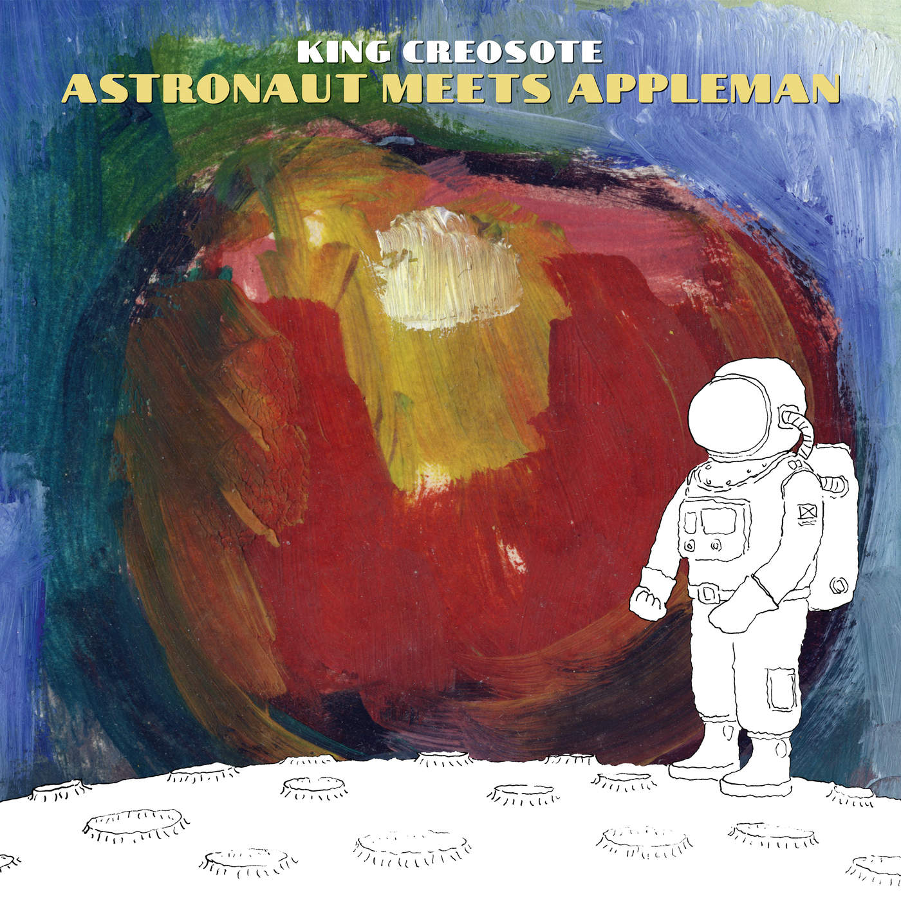

.Rolling Stones - Hate To See You Go

++++
 
++++

.Radiohead - Decks Dark
image:RADIOHEAD/Radiohead 2016 - A Moon Shaped Pool/Folder.jpg[A Moon Shaped Pool,200,200,role="thumb left"]

.Divine Comedy - link:DIVINE%20COMEDY/2016%20-%20Foreverland/lyrics/foreverland.html#_funny_peculiar[Funny Peculiar]
image:DIVINE COMEDY/2016 - Foreverland/Cover.jpg[Foreverland,200,200,role="thumb left"]

.Paul Simon - link:PAUL%20SIMON/Paul%20Simon%20-%20Stranger%20To%20Stranger/lyrics/stranger.html#_insomniac_s_lullaby[Insomniac’s Lullaby]
image:PAUL SIMON/Paul Simon - Stranger To Stranger/cover.jpg[Stranger To Stranger,200,200,role="thumb left"]

++++
 
++++

=== Новогодние притчи, 1 января 2017
<https://aerostatbg.ru/release/607>

.Bob Dylan - link:BOB%20DYLAN/Bob%20Dylan%201993%20-%20World%20Gone%20Wrong/lyrics/world.html#_love_henry[Love Henry]
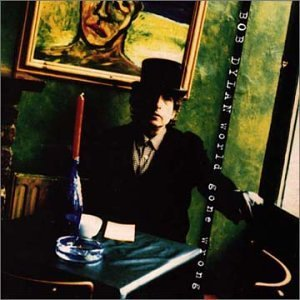

.Lambchop - A Day Without Glasses

.Mark Knopfler - True Love Will Never Fade

.Van Morrison & The Chieftains - Ta Mo Chleamhnas Deanta
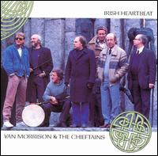

++++
 
++++

.Leon Redbone - Love Letters In The Sand

[%hardbreaks]
Black - Wonderful Life
Nick Drake - At The Chime Of A City Clock
Elliott Smith - Angeles
Yusuf Islam - I Look I See

++++
 
++++

=== Лучшие Рождественские песни, 25 декабря 2016
<https://aerostatbg.ru/release/606>

.Steeleye Span - Gaudete
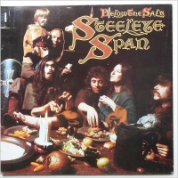

.Jethro Tull - Another Christmas Song
image:JETHRO TULL/1989  Rock Island/cover.jpg[1989  Rock Island,200,200,role="thumb left"]

[%hardbreaks]
Nat King Cole - The Christmas Song (Chestnuts Roasting on an Open Fire)
Dean Martin - Let it Snow! Let It Snow! Let It Snow!
Slade - Merry Christmas Everybody
Jona Lewie - Stop The Cavalry
Greg Lake - I Believe In Father Christmas
Pogues & Kirsty MacColl - Fairytale Of New York
Kate Rusby - Cranbrook
Bing Crosby - White Christmas
John Lennon - Happy Xmas (War Is Over)

++++
 
++++

=== Новые песни декабря, 18 декабря 2016
<https://aerostatbg.ru/release/605>

[%hardbreaks]
Junipers ‎– Red Bouquet Fair
Rolling Stones - Hate To See You Go
Christine and The Queens - Christine
Neil Young - Show Me
Damian Marley - Nail Pon Cross
Gruff Rhys - The Last Conquistador
Kate Rusby - Hunter Moon
Pink Floyd - Green Is The Colour
Shins - Dead Alive
Paul McCartney - In The Blink of an Eye

++++
 
++++

=== The Divine Comedy, 11 декабря 2016
<https://aerostatbg.ru/release/604>

.Divine Comedy - link:DIVINE%20COMEDY/2016%20-%20Foreverland/lyrics/foreverland.html#_foreverland[Foreverland]
image:DIVINE COMEDY/2016 - Foreverland/Cover.jpg[Foreverland,200,200,role="thumb left"]

[%hardbreaks]
Divine Comedy - link:DIVINE%20COMEDY/2016%20-%20Foreverland/lyrics/foreverland.html#_napoleon_complex[Napoleon Complex]
Divine Comedy - link:DIVINE%20COMEDY/2016%20-%20Foreverland/lyrics/foreverland.html#_catherine_the_great[Catherine The Great]
Divine Comedy - link:DIVINE%20COMEDY/2016%20-%20Foreverland/lyrics/foreverland.html#_i_joined_the_foreign_legion_to_forget[I Joined the Foreign Legion]
Divine Comedy - link:DIVINE%20COMEDY/2016%20-%20Foreverland/lyrics/foreverland.html#_my_happy_place[My Happy Place]
Divine Comedy – link:DIVINE%20COMEDY/2016%20-%20Foreverland/lyrics/foreverland.html#_the_one_who_loves_you[The One Who Loves You]
Divine Comedy - link:DIVINE%20COMEDY/2016%20-%20Foreverland/lyrics/foreverland.html#_other_people[Other People]
Divine Comedy - link:DIVINE%20COMEDY/2016%20-%20Foreverland/lyrics/foreverland.html#_the_pact[The Pact]
Divine Comedy - link:DIVINE%20COMEDY/2016%20-%20Foreverland/lyrics/foreverland.html#_how_can_you_leave_me_on_my_own[How Can You Leave Me On My Own]
Divine Comedy - link:DIVINE%20COMEDY/2016%20-%20Foreverland/lyrics/foreverland.html#_a_desperate_man[A Desperate Man]
Divine Comedy - link:DIVINE%20COMEDY/2016%20-%20Foreverland/lyrics/foreverland.html#_funny_peculiar[Funny Peculiar]

++++
 
++++

=== Новые имена, 4 декабря 2016

<http://old.aquarium.ru/misc/aerostat/aerostat603.html>

[%hardbreaks]
Edwyn Collins - A Girl Like You
James Yuill - This Sweet Love
Wolf People - Ninth Night
Tokens - The Lion Sleeps Tonight
Fall - Totally Wired
Winged Victory For The Sullen - Requiem For The Static King
Van Der Graaf Generator - Pilgrims
Rachid Taha - Ya Rayah
Drive-By Truckers - Surrender Under Protest

++++
 
++++

=== Азбука, 27 ноября 2016

<http://old.aquarium.ru/misc/aerostat/aerostat602.html>

.King Creosote - link:King%20Creosote/King%20Creosote%202014%20-%20From%20Scotland%20With%20Love/lyrics/scotland.html#__one_floor_down[One Floor Down]
image:King Creosote/King Creosote 2014 - From Scotland With Love/cover.jpg[From Scotland With Love,200,200,role="thumb left"]

.Eels - Where I'm From
image:EELS/Eels - 2014 - The cautionary tales of Mark Oliver Everett - CD 1/cover.jpg[The cautionary tales of Mark Oliver Everett,200,200,role="thumb left"]

.R.E.M. - link:REM/REM%20-%20Reveal/lyrics/reveal.html#_imitation_of_life[Imitation Of Life]
image:REM/REM - Reveal/cover.jpg[Reveal,200,200,role="thumb left"]

.Paul McCartney - link:PAUL%20MCCARTNEY/Paul%20McCartney%20-%20Chaos%20And%20Creation%20In%20The%20Backyard/lyrics/backyard.html#_too_much_rain[Too Much Rain] 
image:PAUL MCCARTNEY/Paul McCartney - Chaos And Creation In The Backyard/cover.jpg[Chaos And Creation In The Backyard,200,200,role="thumb left"]

++++
 
++++

.Cotton Mather - link:COTTON%20MATHER/Cotton%20Mather%202016%20-%20Death%20of%20the%20Cool/lyrics/cool.html#_child_bride[Child Bride]

.Paul Simon - link:PAUL%20SIMON/Paul%20Simon%20-%20Songwriter/lyrics/songwriter.html#_father_and_daughter[Father And Daughter]
image:PAUL SIMON/Paul Simon - Songwriter/cover.jpg[Songwriter,200,200,role="thumb left"]

.Red Hot Chili Peppers - Someone
image:RED HOT CHILI PEPPERS/Red Hot Chilli Peppers - Unpublished Songs/cover.jpg[Unpublished Songs,200,200,role="thumb left"]

.Divine Comedy - link:DIVINE%20COMEDY/2010%20-%20Bang%20Goes%20The%20Knighthood/lyrics/bang.html#_bang_goes_the_knighthood[Bang Goes The Knighthood]
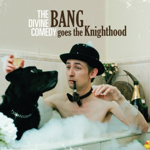

++++
 
++++

.Elliot Smith - Waltz #2
image:ELLIOTT SMITH/Elliott Smith - XO/cover.jpg[XO,200,200,role="thumb left"]

.Peter Gabriel - The Book of Love

[%hardbreaks]
Lumiere - The Silver Tassie

++++
 
++++

=== Леонард Коэн RIP, 20 ноября 2016

<http://old.aquarium.ru/misc/aerostat/aerostat601.html>

.Leonard Cohen - You Want It Darker

[%hardbreaks]
Leonard Cohen - Steer Your Way
Leonard Cohen - Treaty
Leonard Cohen - Traveling Light
Leonard Cohen - It Seemed the Better Way
Leonard Cohen - If I Didn't Have Your Love
Leonard Cohen - On the Level
Leonard Cohen - Leaving the Table
Leonard Cohen - String Reprise/Treaty

++++
 
++++

=== Юбилейная, 13 ноября 2016

<http://old.aquarium.ru/misc/aerostat/aerostat600.html>

.Tom Petty - In The Dark Of The Sun
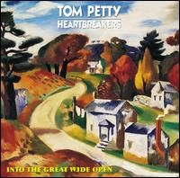

.Paul McCartney - Junk
image:PAUL MCCARTNEY/Paul McCartney 1970 - McCartney/cover.jpg[McCartney,200,200,role="thumb left"]

.Tom Waits - Long Way Home
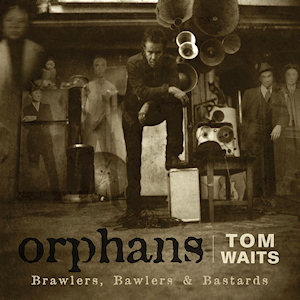

.Beatles - Here, There & Everywhere
image:THE BEATLES/1966 - Revolver/cover.jpg[Revolver,200,200,role="thumb left"]

++++
 
++++

.George Harrison - This Is Love
image:GEORGE HARRISON/George Harrison - Cloud Nine/cover.jpg[Cloud Nine,200,200,role="thumb left"]

.Beatles - The Inner Light
image:THE BEATLES/1988 - Past Masters/cover.jpg[Past Masters,200,200,role="thumb left"]

.ELO - Moments Of Paradise

.Simon & Garfunkel - Homeward Bound
image:SIMON & GARFUNKEL/Simon & Garfunkel - Parsley, Sage, Rosemary and Thyme/cover.jpg[Parsley Sage Rosemary and Thyme,200,200,role="thumb left"]

++++
 
++++

[%hardbreaks]
Katmandu Music - 25 Pioneers
Rolling Stones - Ruby Tuesday
Ustad Shudjaat Khan - Utsav

++++
 
++++

=== Новые Звуки Ноября, 6 ноября 2016

<http://old.aquarium.ru/misc/aerostat/aerostat599.html>

.Lambchop - Niv

.Sleaford Mods - TCR

.Tinariwen - Tenere Taqqai

[%hardbreaks]
Syd Arthur - Sun Rays
Dillinger Escape Plan - Symptom
Peter Gabriel - The Veil
Max Romeo - Scammer Jammers
Herb Albert - Don't Go Breaking My Heart
Oasis - Stay Young

++++
 
++++

=== Samhain, 30 октября 2016

<http://old.aquarium.ru/misc/aerostat/aerostat598.html>

.Steeleye Span - The Blacksmith
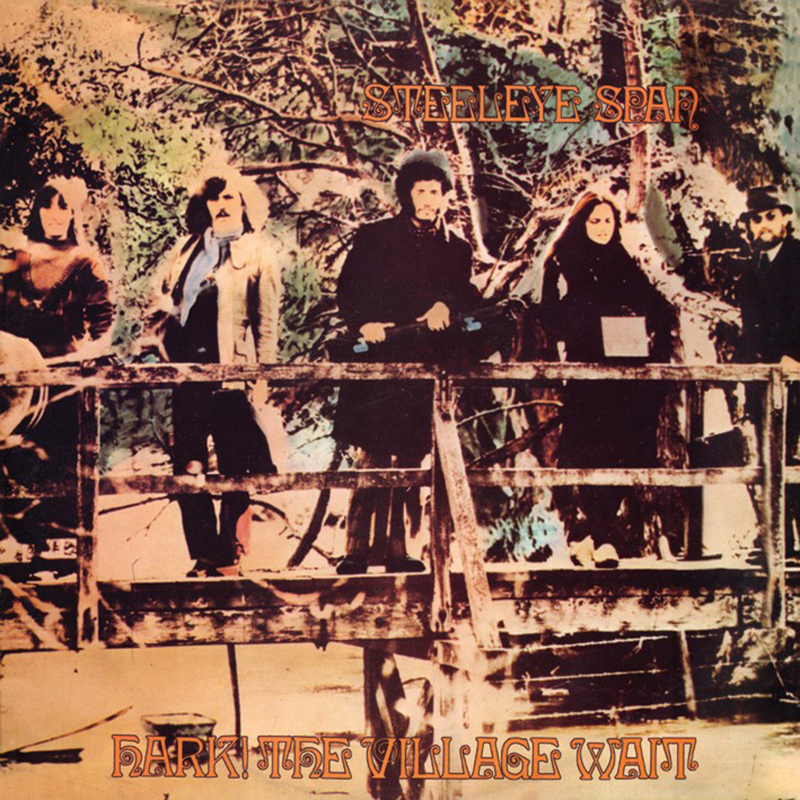

.Richard Thompson - I Still Dream

[%hardbreaks]
Gryphon - Unquiet Grave
Chris Wood - Hard
Shirley & Dolly Collins - Just As The Tide Was Flowing
Martin Carthy - And A Begging I Will
Pete Coe - Catch Me If You Can
Broadside Band - Greensleeves
Kate Rusby - I Courted A Sailor
Ruth Notman - Still I Love Him

++++
 
++++

=== О Смысле Жизни, 23 октября 2016

<http://old.aquarium.ru/misc/aerostat/aerostat597.html>

.R.E.M. - link:REM/REM%20-%20Document/lyrics/document.html#_disturbance_at_the_heron_house[Disturbance At The Heron House]
image:REM/REM - Document/cover.jpg[Document,200,200,role="thumb left"]

.Jethro Tull - Hunting Girl
image:JETHRO TULL/1977  Songs From The Wood/cover.jpg[1977  Songs From The Wood,200,200,role="thumb left"]

.Van Morrison - Memory Lane

[%hardbreaks]
Hollies - Signs That Never Change
Handel - Corgan Oncerto #8. Overture
Roger McGuinn - Let The Road Rise Up To Meet You
Rod Stewart - Angel
Hemant Kumar - Sansar Jabey Mon Kere Loy
J.S.Bach - French Suite #6. Allemande
ELO - One Day

++++
 
++++

=== Новые Песни Октября, 16 октября 2016

<http://old.aquarium.ru/misc/aerostat/aerostat596.html>

.Suzanne Vega - link:SUZANNE%20VEGA/2016%20-%20Lover%20Beloved%20Songs%20From%20An%20Evening%20With%20Carson%20McCullers/lyrics/mccallers.html#_we_of_me[We Of Me]
image:SUZANNE VEGA/2016 - Lover Beloved Songs From An Evening With Carson McCullers/cover.png[Lover Beloved Songs From An Evening With Carson McCullers,200,200,role="thumb left"]

.Tiger Lillies - Marcel's Gone Away

.Leonard Cohen - You Want It Darker

[%hardbreaks]
Bob Weir - One More River To Cross
Bon Iver - 21 Moon Water
Madness - Mr. Apples
Yello - Limbo
Jagwar Ma - Give Me A Reason
Rolling Stones - Just Your Fool
Green Day - Revolution Radio

++++
 
++++

=== John Lennon, 9 октября 2016

<http://old.aquarium.ru/misc/aerostat/aerostat595.html>

.Beatles - Help!
image:THE BEATLES/The Beatles - Help!/front.jpg[Help!,200,200,role="thumb left"]

.Beatles - I'm So Tired
image:THE BEATLES/The Beatles - White Album CD 1/cover.jpg[White Album CD 1,200,200,role="thumb left"]

.Beatles - link:THE%20BEATLES/1966%20-%20Revolver/lyrics/revolver.html#_and_your_bird_can_sing[And Your Bird Can Sing]
image:THE BEATLES/1966 - Revolver/cover.jpg[Revolver,200,200,role="thumb left"]

.Beatles - Being For The Benefit Of Mr Kite
image:THE BEATLES/1967a - Sgt Peppers Lonely Hearts Club Band/cover.jpg[Sgt Peppers Lonely Hearts Club Band,200,200,role="thumb left"]

++++
 
++++

.Beatles - Nowhere Man
image:THE BEATLES/1965b - Rubber Soul/cover.jpg[Rubber Soul,200,200,role="thumb left"]

[%hardbreaks]
Beatles - It's Only Love
Beatles - You're Going To Lose That Girl
Beatles - No Reply
Beatles - Happiness Is A Warm Gun
Beatles - In My Life
Beatles - Sexy Sadie
Beatles - I'm Only Sleeping
John Lennon - Look At Me
Beatles - She Said She Said

++++
 
++++

=== Gene Clark, 2 октября 2016

<http://old.aquarium.ru/misc/aerostat/aerostat594.html>

.Gene Clark - Fair And Tender Ladies

.Gene Clark - One In A Hundred
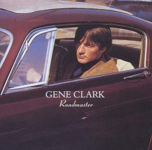

[%hardbreaks]
Byrds - 8 Miles High
Byrds - Here Without You
Gene Clark - Gypsy Rider
Gene Clark - No Other
Gene Clark - Spanish Guitar
Gene Clark - Is Yours Is Mine
Gene Clark - All I Want

++++
 
++++

=== Новые песни сентября, 25 сентября 2016

<http://old.aquarium.ru/misc/aerostat/aerostat593.html>

.King Creosote - Melin Wynt

.Of Montreal - My Fair Lady

.Van Morrison - Too Late

[%hardbreaks]
Gonjasufi - Krishna Punk
Pixies - Tenement Song
Bell X1 - Upswing
Сплин - Окраины
Nick Cave - Skeleton Tree
New English Beat - Walking On The Wrong Side

++++
 
++++

=== Новые имена, т.14, 18 сентября 2016

<http://old.aquarium.ru/misc/aerostat/aerostat592.html>

[%hardbreaks]
Orange Blossom - Black Box
Department Of Eagles - No One Does It Like You
Calypso Rose - Calypso Queen
Son House - Walkin' Blues
Shadows - Apache
Tremelous - Even The Bad Times Are Good
Bob Landers - Cherokee Dance
Jacques Dutronc - Les Cactus
Inner Circle - Sweat
H-Burns - Silent Wars

++++
 
++++

=== Время Трепанга: Новые альбомы, 11 сентября 2016

<http://old.aquarium.ru/misc/aerostat/aerostat591.html>

[%hardbreaks]
Teenage Fanclub - I'm In Love
Wilco - If I Ever Was A Child
Sting - I Cant Stop Thinking About You
Сплин - Пирамиды
Aaron Neville - Stompin' Ground
Pugwash - Feed His Heart With Coal
Markscheider Kunst - Майк и Боб
Dinosaur Jr - Tiny
Emerson, Lake & Palmer - Unknown Ballad
Green Day - Bang Bang

++++
 
++++

=== Cotton Mather & "I Ching", 4 сентября 2016

<http://old.aquarium.ru/misc/aerostat/aerostat590.html>

.Cotton Mather - link:COTTON%20MATHER/Cotton%20Mather%202016%20-%20Death%20of%20the%20Cool/lyrics/cool.html#_child_bride[Child Bride]

[%hardbreaks]
Cotton Mather - link:COTTON%20MATHER/Cotton%20Mather%202016%20-%20Death%20of%20the%20Cool/lyrics/cool.html#_close_to_the_sun[Close To The Sun]
Cotton Mather - link:COTTON%20MATHER/Cotton%20Mather%202016%20-%20Death%20of%20the%20Cool/lyrics/cool.html#_the_middle_of_nowhere[The Middle Of Nowhere]
.Cotton Mather - link:COTTON%20MATHER/Cotton%20Mather%202016%20-%20Death%20of%20the%20Cool/lyrics/cool.html#_candy_lilac[Candy Lilac]
Cotton Mather - link:COTTON%20MATHER/Cotton%20Mather%202016%20-%20Death%20of%20the%20Cool/lyrics/cool.html#_life_of_the_liar[Life Of The Liar]
Cotton Mather - link:COTTON%20MATHER/Cotton%20Mather%202016%20-%20Death%20of%20the%20Cool/lyrics/cool.html#_the_land_of_flowers[The Land Of Flowers]
Cotton Mather - link:COTTON%20MATHER/Cotton%20Mather%202016%20-%20Death%20of%20the%20Cool/lyrics/cool.html#_never_be_it[Never Be It]
Cotton Mather - link:COTTON%20MATHER/Cotton%20Mather%202016%20-%20Death%20of%20the%20Cool/lyrics/cool.html#_queen_of_swords[Queen Of Swords]
Cotton Mather - link:COTTON%20MATHER/Cotton%20Mather%202016%20-%20Death%20of%20the%20Cool/lyrics/cool.html#_waters_raging[Waters Raging]
Cotton Mather - link:COTTON%20MATHER/Cotton%20Mather%202016%20-%20Death%20of%20the%20Cool/lyrics/cool.html#_the_end_of_dewitt_finley[The End Of Dewitt Finley]
Cotton Mather - link:COTTON%20MATHER/Cotton%20Mather%202016%20-%20Death%20of%20the%20Cool/lyrics/cool.html#_the_book_of_too_late_changes[The Book Of Too Late Changes]

++++
 
++++

=== The Small Faces, 28 августа 2016

<http://old.aquarium.ru/misc/aerostat/aerostat589.html>

[%hardbreaks]
Small Faces - My Mind's Eye
Small Faces - Here Comes The Nice
Small Faces - Itchycoo Park
Small Faces - Have You Ever Seen
Small Faces - All Or Nothing
Small Faces - Lazy Sunday
Small Faces - Tin Soldier
Small Faces - The Universal
Small Faces - Song Of A Baker
Small Faces - Happiness Stan
Small Faces - Green Circles
Small Faces - Afterglow Of Your Love

---

> link:aerostat.html[<Home>]
> link:toc.html[<Contents>]
> link:lyrics.html[<Lyrics>]
