= Радио Аэростат. Глава XXVI
:toc: left

link:aerostat.html[Главная страница]

== 5 марта 2017 - 3 сентября 2017

<http://www.aquarium.ru/misc/aerostat/index26.html>

++++

++++

=== Урожай сентября, 3 сентября 2017

<https://aerostatica.ru/2017/09/03/642-urozhay-sentyabrya/>

.Robert Plant - link:ROBERT%20PLANT/2017%20-%20Carry%20Fire/lyrics/fire.html#_the_may_queen[The May Queen]
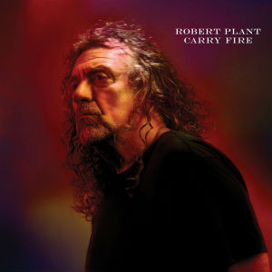

.Yusuf / Cat Stevens - See What Love Did To Me
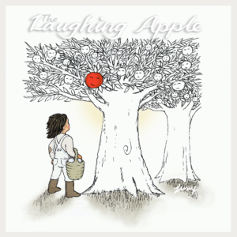

.Damian Marley - The Struggle Discontinues
image:Damian Marley - Stony Hill/cover.jpg[Stony Hill,200,200,role="thumb left"]

.Can - She Brings The Rain
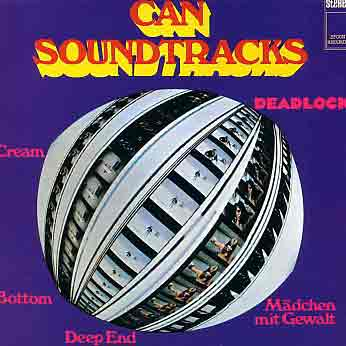

++++
 
++++

[%hardbreaks]
Mick Jagger - England Lost
Alice Cooper - Paranormal
Аквариум - Стучаться в двери травы
Randy Newman - She Chose Me
Ringo Starr - Give More Love

++++
 
++++

=== Нисаргадатта Махарадж, 27 августа 2017

<https://aerostatica.ru/2017/08/27/641-nisargadatta-maharadzh/>

.Paul Simon - link:PAUL%20SIMON/Paul%20Simon%20-%20Songwriter/lyrics/songwriter.html#_still_crazy_after_all_these_years[Still Crazy After All These Years]

.Paul McCartney - Summer’s Day Song
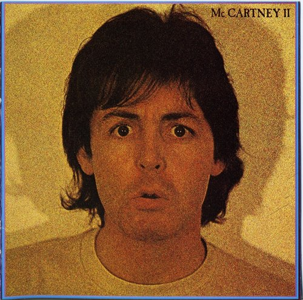

.Robert Plant & The Strange Sensation - Shine It All Around
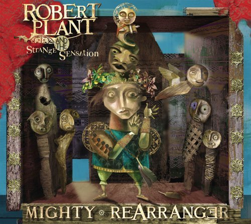

.Tom Petty And The Heartbreakers - Insider
image:TOM PETTY/Tom Petty 2008 - An American Treasure/cover.jpg[An American Treasure,200,200,role="thumb left"]

++++
 
++++

[%hardbreaks]
Аквариум - Сharam Сharam
Uma Mohan - Mahalakshmi Suktam
Krishna Das - By Your Grace/Jai Gurudev
Frivolous - You Gotta Sing
Shivkumar Sharma - Shri Gayatri Mahamantra

=== Воображаемые миры, 20 августа 2017

<https://aerostatica.ru/2017/08/20/640-voobrazhaemye-miry/>

.King Gizzard & The Lizard Wizard - Sleep Drifter
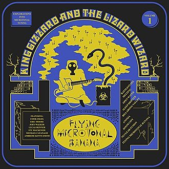

.Brass Monkey - The Miller’s Three Sons
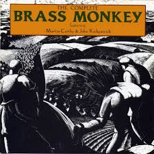

[%hardbreaks]
Band - Across The Great Divide
Peter Hammill - Crying Wolf
Dillinger Escape Plan - Panasonic Youth
Bryan Ferry - Goodnight Irene
Paul Horn - Siciliano (From Flute Sonata No. II)
Jan Pieterszoon Sweelinck - Pavana Hispanica
Beatles - Every Little Thing
Del Amitri - Nothing Ever Happens

=== Radiohead, 13 августа 2017

<http://aerostatica.ru/2017/08/13/639-radiohead/>

.Radiohead - Lotus Flower

.Radiohead - Fake Plastic Trees
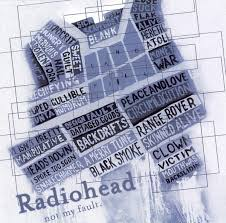

.Radiohead - Creep
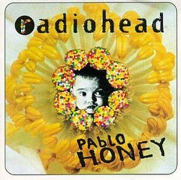

.Radiohead - 2 + 2 = 5 (The Lukewarm.)
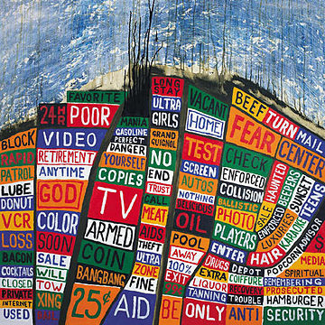

++++
 
++++

[%hardbreaks]
Radiohead - No Surpises
Radiohead - Pyramid Song
Radiohead - Exit Music (For A Film)
Radiohead - Everything In Its Right Place
Radiohead - Burn The Witch

=== Новые песни в августе, 6 августа 2017

<http://aerostatica.ru/2017/08/06/638-novye-pesni-v-avguste/>

.Jethro Tull - So Much Trouble
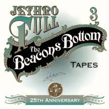

[%hardbreaks]
Michel-Richard de la Lande - Fanfare
Drugdealer feat. Weyes Blood - Suddenly
Magic Gang - No One Else
Broken Social Scene - Protest Song
Sylvan Esso - Die Young
John Adams - Shaker Loops: Hymning Slews
Yazz Ahmed - The Space Between The Fish And The Moon
This Is The Kit - Moonshine Freeze
Ekoplekz - Denier Daze

=== Лунассад: Фил Каннингэм, 30 июля 2017

<http://aerostatica.ru/2017/07/30/637-lunassad-fil-kanningem/>

[%hardbreaks]
Aly Bain & Phil Cunningham - My Lily/The Sweetness Of Mary/Hughie Jim Paul’s Reel
Phil Cunningham - Ross Memorial Hospital
Silly Wizard - Simon MacKenzie’s Welcome To His Twin Sister/Farewell To “The Heb”
Silly Wizard - Roarin’ Donald/The Man Who Shot The Windmill/A Glint Of Siver
Silly Wizard - Donald McGillavry/O’Neill’s Cavalry March
Aly Bain & Phil Cunningham - Spring The Summer Long
Silly Wizard - The Banks Of The Lee
Aly Bain & Phil Cunningham - Eleanor Of Usan
Silly Wizard - Mo Nighean Donn, Grádh Mo Chridhe

=== Девять главных, 23 июля 2017

<http://aerostatica.ru/2017/07/23/636-devyat-glavnyh/>

.Radiohead - Paranoid Android

.Cotton Mather - Innocent Street
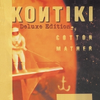

.Sigur Rós - Starálfur
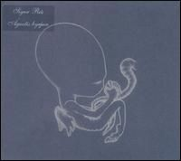

.Eels - Beautiful Freak

++++
 
++++

.King Creosote & Jon Hopkins - Your Own Spell
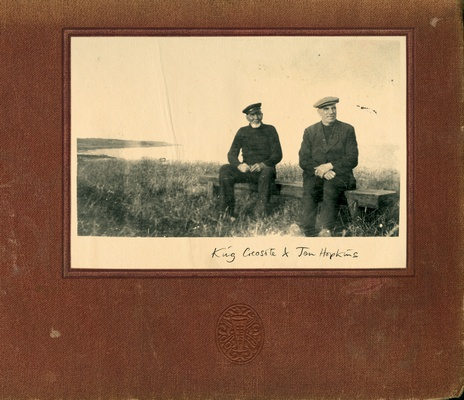

.Beck - Lazy Flies
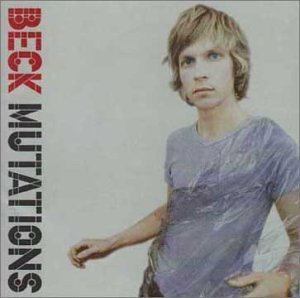

[%hardbreaks]
Prodigy - Breathe
Kate Rusby - The Recruited Collier
Sleaford Mods - B.H.S.

++++
 
++++

=== Коллаборации, 16 июля 2017

<http://aerostatica.ru/2017/07/16/635-kollaboracii/>

[%hardbreaks]
Golden Palominos feat. Michael Stipe - Boy (Go)
Leftfield feat. John Lydon - Open Up
Nicola Alesini & Pier Luigi Andreoni feat. David Sylvian - The Golden Way
SuperHeavy - Beautiful People
Blondie feat. Robert Fripp - Fade Away And Radiate
Mark Pritchard feat. Thom Yorke - Beautiful People
Nitin Sawhney feat. Paul McCartney - My Soul

=== Новые Песни Июля, 9 июля 2017

<http://aerostatica.ru/2017/07/09/634-novye-pesni-iyulya/>

.Sufjan Stevens, Bryce Dessner, Nico Muhly, James McAlister - Mercury
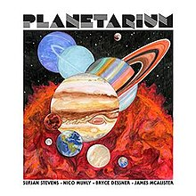

[%hardbreaks]
Liam Gallagher - Wall Of Glass
Radiohead - I Promise
Cornelius - Sometime Someplace
Unthanks - Happiness
Steve Earle & The Dukes - So You Wannabe An Outlaw
Jeff Tweedy - I’m Always In Love
Kasabian - Comeback Kid
Hans-Joachim Roedelius & Arnold Kasar - Rolling
T. Rex - Light Of Love

=== Мастер Тик Ньят Хань, 2 июля 2017

<http://aerostatica.ru/2017/07/02/633-master-tik-nyat-han/>

.Donovan - Someone Singing
image:DONOVAN/Donovan - A Gift From a Flower to a Garden/cover.jpg[A Gift From a Flower to a Garden,200,200,role="thumb left"]

[%hardbreaks]
Ming Flute Ensemble - The Song Of The Four Seasons
Johann Sebastian Bach - French Suite No. 5 In G Major: Sarabande
Sri Chinmoy - Flute Music (9)
Hemanta Mukherjee - Jadi Tare Nai Chini Go
George Frideric Handel - Organ Concerto In A Major (HWV 307): Ouverture
Hoa Tau - Luu Thuy
Linda Long - Music For Muscle And Bone
Lama Khenno - Ultimate Guru Sadhana Of Simplicity
Deepak Khazanchi - Gajavadana Gananatha
Kathmandu Music Center & Lama Ngodup Jungney - Prayers For Dharma Wangchuk: Lineage, The Founder Of Bamrom Tradition Of Kagyu

    
=== The Move, 25 июня 2017

<http://aerostatica.ru/2017/06/25/632-the-move/>

.Move - Flowers in the Rain
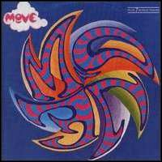

[%hardbreaks]
Move - I Can Hear the Grass Grow
Move - (Here We Go Round) The Lemon Tree
Move - Cherry Blossom Clinic
Move - Zing Went the Strings of My Heart
Move - Fire Brigade
Move - Kilroy Was Here
Move - Blackberry Way
Roy Wood - Nancy Sing Me a Song
Move - No Time
Move - Message from the Country

=== Творчество, 18 июня 2017

<http://aerostatica.ru/2017/06/18/631-tvorchestvo/>

.Bob Dylan - link:BOB%20DYLAN/Bob%20Dylan%201963%20-%20Blowing%20In%20The%20Wind/lyrics/blowing.html#_subterranean_homesick_blues[Subterranean Homesick Blues]
image:BOB DYLAN/Bob Dylan 1963 - Blowing In The Wind/cover.jpg[Blowing In The Wind,200,200,role="thumb left"]

.Procol Harum - link:PROCOL%20HARUM/Procol%20Harum%201967%20-%20Procol%20Harum%20(With%20Bonus%20Tracks)/lyrics/procol.html#_conquistador[Conquistador]
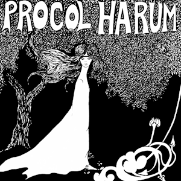

.Planxty - Only Our Rivers
image:PLANXTY/Planxty 1973 - Planxty/cover.jpg[Planxty,200,200,role="thumb left"]

.James Taylor - Fire And Rain
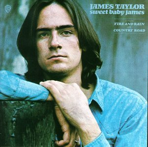

++++
 
++++

[%hardbreaks]
John Vanderslice - Coming And Going On Easy Terms
Johann Sebastian Bach - Oboe Concerto In G Minor (BWV 1056): Largo
Beatles - Wait
Andy Summers & Robert Fripp - Painting And Dance
Jimmy Cliff - The Harder They Come
Jethro Tull - Lick Your Fingers Clean

=== Japan, 11 июня 2017

<http://aerostatica.ru/2017/06/11/630-japan/>

.Japan - Visions Of China
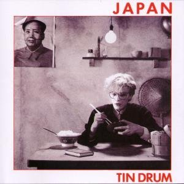

[%hardbreaks]
Japan - Gentlemen Take Polaroids
Japan - Burning Bridges
Japan - All Tomorrow’s Parties
Japan - Ghosts
Japan - The Experience Of Swimming
Rain Tree Crow - Blackwater
Japan - Quiet Life

=== Новые песни июня, 04 июня 2017

<http://aerostatica.ru/2017/06/04/629-novye-pesni-iyunya/>

.Fleet Foxes - Kept Woman
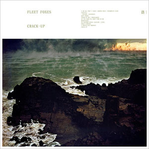

.Dan Auerbach - King of a One Horse Town

[%hardbreaks]
Flogging Molly - The Hand of John L. Sullivan
Аквариум - Пегги Поршень
Trio Mediaeval & Arve Henriksen - Om Ödet Skulle Skicka Mig
Der Plan - Lass Die Katze Stehn
Songhoy Blues - Mali Nord
Lindsey Buckingham & Christine McVie - Feel About You
Kronos Quartet & Natalie Merchant - The Butcher’s Boy
Charlatans - There Will Be Chances

++++
 
++++

=== 12 лет. Лето Любви ‘67, 28 мая 2017

<http://aerostatica.ru/2017/05/28/628-12-let-leto-lyubvi-67/>

.Procol Harum - Wish Me Well
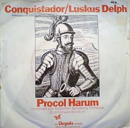

.Beatles - If I Needed Someone
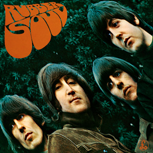

[%hardbreaks]
Kaleidoscope - A Dream For Julie
Cream - Wrapping Paper
Grateful Dead - Uncle John’s Band
Incredible String Band - Nightfall
Jimi Hendrix Experience - Spanish Castle Magic
Family - Love Is a Sleeper
Kinks - Where Have All the Good Times Gone
Beatles - With a Little Help From My Friends (2017 remix)
Manfred Mann - Fox on the Run

=== The Clash, 21 мая 2017

<http://aerostatica.ru/2017/05/21/627-the-clash/>

.Clash - London Calling
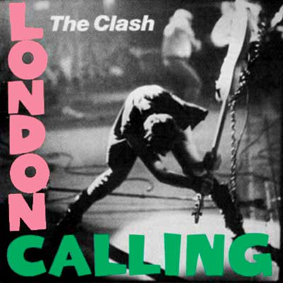

[%hardbreaks]
Clash - Should I Stay Or Should I Go
Clash - Clash City Rockers
Clash - White Riot
Clash - I’m So Bored With the USA
Clash - (White Man) In Hammersmith Palais
Clash - Rudie Can’t Fail
Clash - Rock The Casbah
Clash - Police & Thieves
Clash - I Fought the Law

=== Арво Пярт, 14 мая 2017

<http://aerostatica.ru/2017/05/14/626-arvo-pyart/>

[%hardbreaks]
Arvo Pärt - Cantate Domino
Arvo Pärt - Summa
Arvo Pärt - Magnificat
Arvo Pärt - Für Alina
Arvo Pärt - Missa Sillabica: Gloria
Arvo Pärt - Cantus in Memory of Benjamin Britten
Arvo Pärt - Pari Intervallo
Arvo Pärt - Spiegel im Spiegel

=== Новые Песни в Мае, 7 мая 2017

<http://aerostatica.ru/2017/05/07/625-novye-pesni-v-mae/>

.Sparks - link:Sparks%202017%20-%20Hippopotamus/lyrics/hippo.html#_hippopotamus[Hippopotamus]
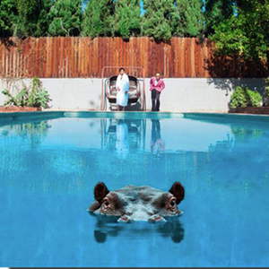

.Blondie - Long Time
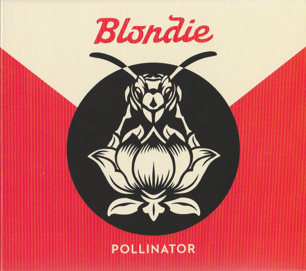

[%hardbreaks]
Roger Waters - Smell the Roses
Ray Davies - The Deal
Damian Marley (feat. Stephen Marley) - Medication
Jane Birkin ‎- L’Aquoiboniste
Lisa Knapp - Bedfordshire May Day Carol
Аквариум - Дело мастера Бо
Tyrannosaurus Rex - Ride a White Swan

++++
 
++++

=== Beltane 2017, 30 апреля 2017

<http://aerostatica.ru/2017/04/30/624-beltane-2017/>

.Steeleye Span - link:STEELEYE%20SPAN/Steeleye%20Span%20-%20Below%20the%20Salt/lyrics/salt.html#_spotted_cow[Spotted Cow]
image:STEELEYE SPAN/Steeleye Span - Below the Salt/Folder.jpg[Below the Salt,200,200,role="thumb left"]

[%hardbreaks]
Shooglenifty - The Tammienorrie: The Tammienorie/Leo Elsey’s Reel/Les Reel des Voyageurs
Johnny Flynn - Detectorists
Matt Molloy - Fisherman’s Lilt/Ship in Full Sail/Out on the Ocean
Andy M. Stewart And Manus Lunny - Bogie’s Bonnie Bell
Van Morrison & The Chieftains - My Lagan Love
Steve Tilston & Jez Lowe - Tattered and Torn
Goitse - Transformed

=== Новые Песни Апреля, 23 апреля 2017

<http://aerostatica.ru/2017/04/23/623-novye-pesni-aprelya/>

.Cotton Mather - Girl with a Blue Guitar
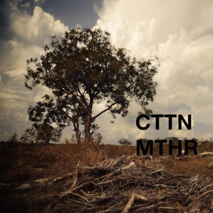

[%hardbreaks]
Alt-J - In Cold Blood
Chuck Berry - Big Boys
Procol Harum - Sunday Morning
Mark Lanegan Band - Beehive
Tamikrest - Mawarniha Tartit
Dirty Projectors - Little Bubble
Bob Dylan - Once Upon a Time
Inna de Yard feat. The Viceroys - Love Is the Key
Justin Currie - Sydney Harbour Bridge

=== Пасха. Люди о Боге, 16 апреля 2017

<http://aerostatica.ru/2017/04/16/622-pasha-lyudi-o-boge/>

[%hardbreaks]
Van Morrison - Whenever God Shines His Light
Котов-Старостин-Фёдоров-Волков - Глубоко
Hollies - Maker
Jimi Hendrix Experience – Waterfall
Аквариум - Charam Charam
Johannes Ebenbauer - Trio - Gratieusement
George Harrison - Sat Singing
Yusuf Islam - God Is The Light
Van Morrison - In The Garden

=== Pugwash, 9 апреля 2017

<http://aerostatica.ru/2017/04/09/621-pugwash/>

.Duckworth Lewis Method - link:The%20Duckworth%20Lewis%20Method%202009/lyrics/duckworth.html#_meeting_mr_miandad[Meeting Mr Miandad]
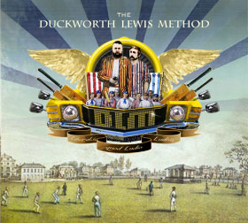

.Pugwash - There You Are
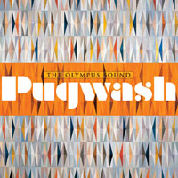

[%hardbreaks]
Pugwash - To The Warmth Of You
Pugwash - Just So You Know
Pugwash - The Season Of Flowers And Leaves
Pugwash - Apples
Pugwash - Anyone Who Asks
Pugwash - Here We Go ‘Round Again
Pugwash - Monorail
Pugwash - My Genius

=== Разговоры с Коэном, 2 апреля 2017

<http://aerostatica.ru/2017/04/02/620-razgovory-s-koenom/>

.Leonard Cohen - link:LEONARD%20COHEN/09-The%20Future%20(1992)/lyrics/future.html#_the_future[The Future]
image:LEONARD%20COHEN/09-The%20Future%20(1992)/cover.jpg[The Future,200,200,role="thumb left"]

[%hardbreaks]
Leonard Cohen - Dance Me To The End Of Love
Leonard Cohen - Hey, That’s No Way To Say Goodbye
Leonard Cohen - Closing Time
Leonard Cohen - Ain’t No Cure For Love
Leonard Cohen - Hallelujah

++++
 
++++

=== За пианино – Билл Эванс! 26 марта 2017

<http://aerostatica.ru/2017/03/26/619-za-pianino-bill-evans/>

.Bill Evans - Nardis
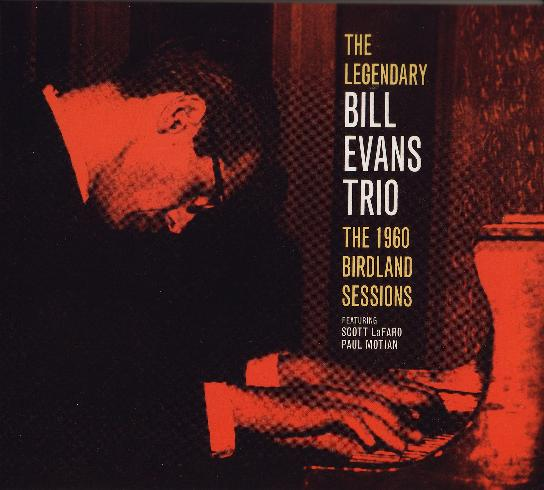

[%hardbreaks]
Bill Evans - I Wish I Knew
Bill Evans - Tenderly
Miles Davis - Blue In Green
Bill Evans - Peri’s Scope
Bill Evans - Stella By Starlight
Bill Evans - If You Could See Me Now
Bill Evans - Polka Dots And Moonbeams

=== Кто это? 19 марта 2017

<http://aerostatica.ru/2017/03/19/618-kto-eto/>

[%hardbreaks]
Matt Bianco - Ordinary Day
Manu Chao - Bongo Bong
Ram Jam - Black Betty
Marvin Gaye - What’s Going On
Damned - New Rose
Gustav Holst - Dance Of Spirits Of Water
Noisia & Phace - Imperial
Pink Turtle - Video Killed The Radio Star
Gus Teja - Bali Jalan-Jalan

=== Новые Песни Марта, 12 марта 2017

<http://aerostatica.ru/2017/03/12/617-novye-pesni-marta/>

.Steeleye Span - All Things Are Quite Silent
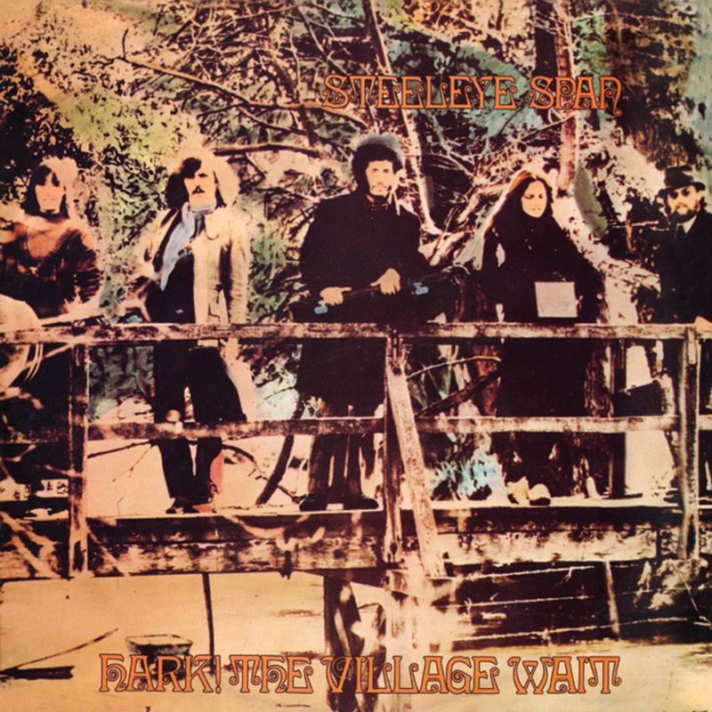

.Tiger Lillies - Finsbury Park
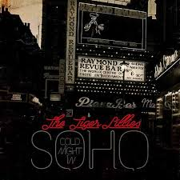

.King Gizzard & The Lizard Wizard - Nuclear Fusion

[%hardbreaks]
Ásgeir - Unbound
Nickelback - Feed The Machine
Ed Sheeran - Nancy Mulligan
Hurray For The Riff Raff - Hungry Ghost
Residents - Train vs Elephant
Аквариум - Безъядерная Зона
Felix Mendelssohn - Op. 62: Allegretto Grazioso in A major (Spring Song)

=== Флейта, 5 марта 2017

<http://aerostatica.ru/2017/03/05/616-fleyta/>

.Jethro Tull - Up To Me
image:JETHRO TULL/1971  Aqualung/cover.jpg[Aqualung,200,200,role="thumb left"]

.Jethro Tull - King Henry’s Madrigal
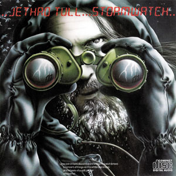

[%hardbreaks]
Gus Teja - Beauty In Colors
Ming Flute Ensemble - The Maidens Of The Tea Mountain
Flook - Pod: The Empty Pod
Georg Philipp Telemann - Sonata in F Major: Vivace
Kohachiro Miyata - Honshirabe
R. Carlos Nakai - Inward Journey
Paul Horn - Mumtaz Mahal
Hariprasad Chaurasia & Shivkumar Sharma - Love (Alap)
