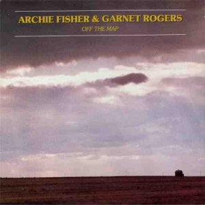
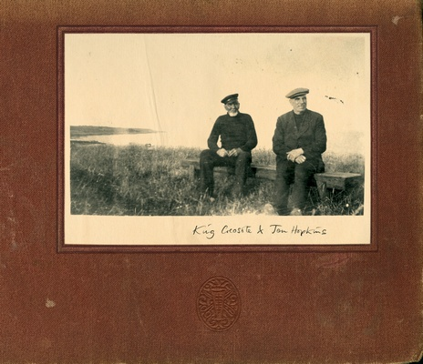
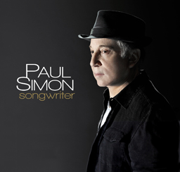
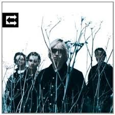
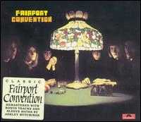

= Радио Аэростат. Глава XXVII
:toc: left

> link:aerostat.html[<Home>]
> link:toc.html[<Contents>]
> link:lyrics.html[<Lyrics>]

== 10 сентября 2017 - 1 апреля 2018

<http://old.aquarium.ru/misc/aerostat/index27.html>

++++

++++

=== Новые песни апреля, 1 апреля 2018

<https://aerostatica.ru/2018/04/01/672-novye-pesni-aprelya/>

.Decemberists - link:THE%20DECEMBERISTS/The%20Decemberists%20-%20I_ll%20Be%20Your%20Girl/lyrics/dec_girl.html#_severed[Severed]
image:THE DECEMBERISTS/The Decemberists - I_ll Be Your Girl/cover.jpg[I_ll Be Your Girl,200,200,role="thumb left"]

.Low Anthem - Give My Body Back

.Wailin’ Jennys - Old Churchyard

.Eels - Premonition

++++
 
++++

.Joni Mitchell - Cactus Tree

.Tyler Childers - Feathered Indians

[%hardbreaks]
No Age - Drippy
Jimi Hendrix - Cherokee Mist
Breeders - Nervous Mary
Antonee First Class feat. U-Roy - Gimme Di Ska

++++
 
++++

=== Забытая классика, 25 марта 2018

<https://aerostatica.ru/2018/03/25/671-zabytaya-klassika/>

.Bruce Springsteen - Dancing In The Dark
image:Bruce Springsteen/1984 - Born in the USA/cover.jpeg[Born in the USA,200,200,role="thumb left"]

[%hardbreaks]
Sublime - What I Got
Richard Hell & The Voidoids ‎– Blank Generation
Public Enemy - Don’t Believe The Hype
Butthole Surfers - Pepper
Primitive Radio Gods - Standing Outside A Broken Phone Booth With Money In My Hand
Five Finger Death Punch - House Of The Rising Sun
Dead Boys - Sonic Reducer
Fred Astaire - Puttin’ On The Ritz

=== Позитивная энергия, 18 марта 2018

<https://aerostatica.ru/2018/03/18/670-pozitivnaya-energiya/>

.Paul McCartney - No More Lonely Nights

.Robin Williamson - The Woodcutter’s Song

.Archie Fisher & Garnet Rogers - The Winter It Is Past

[%hardbreaks]
Catrin Finch & Seckou Keita - Ceffylau
Cat Stevens - Another Saturday Night
Kathmandu Music Center & Lama Ngodup Jungney - Prayers For Tara: Protecting Begins From The Eight Fears
Utsava & Friends - Asar Age Dibo Tomai
Sam Cooke - Wonderful World
Valerie Kimani - Sirudi Tena

=== Страшная сила красоты, 11 марта 2018

<https://aerostatica.ru/2018/03/11/669-strashnaya-sila-krasoty/>

.Red Hot Chili Peppers - Someone

.Leonard Cohen - Crazy To Love You
image:LEONARD COHEN/Leonard Cohen 2012 - Old Ideas/Old ideas Cover.jpg[Old Ideas,200,200,role="thumb left"]

.Tom Petty - link:TOM%20PETTY/Tom%20Petty%20-%20Highway%20Companion/lyrics/highway.html#_square_one[Square One]
image:TOM PETTY/Tom Petty - Highway Companion/cover.jpg[Highway Companion,200,200,role="thumb left"]

[%hardbreaks]
Lemon Jelly - His Majesty King Raam
Lightning Seeds - Perfect
Аквариум - Красота Это Страшная Сила
Beck - Lost Cause
Leisure Society - A Short Weekend Begins With Longing
Blood, Sweat & Tears - And When I Die
Beatles - I Will

++++
 
++++

=== За пианино – Билл Эванс! 4 марта 2018

<https://aerostatica.ru/2018/03/04/668-za-pianino-bill-evans/>

[%hardbreaks]
Bill Evans - Nardis
Bill Evans - I Wish I Knew
Bill Evans - Tenderly
Miles Davis - Blue In Green
Bill Evans - Peri’s Scope
Bill Evans - Stella By Starlight
Bill Evans - If You Could See Me Now
Bill Evans - Polka Dots And Moonbeams

=== Время N, 25 февраля 2018

<https://aerostatica.ru/2018/02/25/667-vremya-n/>

[%hardbreaks]
БГ - Тёмный как ночь
БГ - Сякухачи
БГ - На ржавом ветру
БГ - Песни нелюбимых
БГ - Соль
БГ - Ножи Бодхисаттвы
БГ - Прикуривает от пустоты
БГ - Крестовый поход птиц

=== Отцы-пустынники, 18 февраля 2018

<https://aerostatica.ru/2018/02/18/666-otcy-pustynniki/>

.Don McLean - link:Don%20McLean%20-%20American%20Pie/lyrics/mclean.html#_babylon[Babylon]
image:Don McLean - American Pie/cover.jpg[American Pie,200,200,role="thumb left"]

.Donovan - link:DONOVAN/Donovan%20-%20HMS%20Donovan/lyrics/hms.html#_the_little_white_road[The Little White Road]
image:DONOVAN/Donovan - HMS Donovan/cover.jpg[HMS Donovan,200,200,role="thumb left"]

[%hardbreaks]
Djivan Gasparyan - They Took My Love Away
E - E’s Tune
Ulaid & Duke Special - Lon Dubh Loch Lao
Dr. Strangely Strange - Frosty Mornings
Gustav Holst - Dance Of Spirits Of Water
The Duke & The King - Summer Morning Rain
Lemon Jelly - A Tune For Jack
Takagi Masakatsu feat. David Sylvian - Exit/Delete

=== Новые песни февраля, 11 февраля 2018

<https://aerostatica.ru/2018/02/11/665-novye-pesni-fevralya/>

.Joan Baez - Whistle Down The Wind

.Lost Brothers - Echoes In The Wind

.Eels - The Deconstruction

[%hardbreaks]
Ty Segall - Rain
TootArd - Roots Rock Jabali
Field Music - Share A Pillow
Soho Rezanejad - December Song
47Soul - Mo Light
Максим Леонидов - Снегопад

++++
 
++++

=== Elliott Smith, 4 февраля 2018

<https://aerostatica.ru/2018/02/04/664-elliott-smith/>

.Elliott Smith - Baby Britain
image:ELLIOTT SMITH/Elliott Smith - XO/cover.jpg[XO,200,200,role="thumb left"]

.Elliott Smith - Can’t Make A Sound
image:ELLIOTT SMITH/Elliott Smith 2000 - Figure 8/Folder.jpg[Figure 8,200,200,role="thumb left"]

[%hardbreaks]
Elliott Smith - A Fond Farewell
Elliott Smith - Ballad Of Big Nothing
Elliott Smith - Oh Well, Okay
Elliott Smith - Happiness
Elliott Smith - Miss Misery
Elliott Smith - Waltz #2 (XO)
Elliott Smith - Everything Means Nothing To Me
Elliott Smith - Stupidity Tries

=== Imbolc, 28 января 2018

<https://aerostatica.ru/2018/01/28/663-imbolc/>

.Christy Moore - The Voyage

.Richard Thompson – Beeswing

[%hardbreaks]
Solas - I Am A Maid That Sleeps In Love
Shane MacGowan And The Popes – Nancy Whiskey
Anne Briggs – Let No Man Steal Your Thyme
East Pointers – 82 Fires
Ulaid & Duke Special – The Poet’s Mission
Declan O’Rourke – Poor Boy’s Shoes
Liam O’Flynn – An Droichead (The Bridge)

=== Новые песни января, 21 января 2018

<https://aerostatica.ru/2018/01/21/662-novye-pesni-yanvarya/>

.Jonny Greenwood - The Tailor Of Fitzrovia

.Roger Eno - Riddle
image:ROGER ENO/2017 - This Floating World/cover.jpg[This Floating World,200,200,role="thumb left"]

.Fratellis - Stand Up Tragedy

[%hardbreaks]
Grant-Lee Phillips - Totally You Gunslinger
Johnny Dowd - Twinkle, Twinkle, Little Star
Stick In The Wheel - Over Again
Chris Declercq feat. Lemmy Kilmister - We Are The Ones
La Féline - Senga
Eminem - Tragic Endings
БГ - Тёмный Как Ночь
Skids - One Last Chance

=== Лучшие альбомы 2017, 14 января 2018

<https://aerostatica.ru/2018/01/14/661-luchshie-albomy-2017/>

.Morrissey - link:MORRISSEY/2017%20-%20Low%20in%20High%20School/lyrics/school.html#_jacky_s_only_happy_when_she_s_up_on_the_stage[Jacky’s Only Happy When She’s Up On The Stage]
image:MORRISSEY/2017 - Low in High School/cover.jpg[Low in High School,200,200,role="thumb left"]

.Robert Plant - link:ROBERT%20PLANT/2017%20-%20Carry%20Fire/lyrics/fire.html#_heaven_sent[Heaven Sent]
image:ROBERT PLANT/2017 - Carry Fire/cover.jpg[Carry Fire,200,200,role="thumb left"]

.Richard Thompson - Rainbow Over The Hill

.Sparks - link:SPARKS/Sparks%202017%20-%20Hippopotamus/lyrics/hippo.html#_what_the_hell_is_it_this_time[What The Hell Is It This Time?]
image:SPARKS/Sparks 2017 - Hippopotamus/cover.jpg[Hippopotamus,200,200,role="thumb left"]

++++
 
++++

.Cotton Mather - Postcard Home

[%hardbreaks]
Ed Sheeran - Perfect
Sleaford Mods - Time Sands
Krishna Das - Guru Puja
Snarky Puppy - Tarova

++++
 
++++

=== Притчи, 7 января 2018

<https://aerostatica.ru/2018/01/07/660-pritchi/>

.Elliott Smith - I Better Be Quiet Now
image:ELLIOTT SMITH/Elliott Smith 2000 - Figure 8/Folder.jpg[Figure 8,200,200,role="thumb left"]

.Lovin’ Spoonful - Coconut Grove

.Archie Fisher - The Flower Of France And England, O

[%hardbreaks]
Barleyjuice - Whiskey Maid
Woodentops - Good Thing
Elvis Presley - She’s Not You
Gentle Good - Holly Blue
Norayr Kartashyan - Sharmonikum
Buffalo Springfield - Flying On The Ground Is Wrong
Eels - The Good Old Days
Keith Emerson - It Came Upon A Midnight Clear

=== С Новым годом! 31 декабря 2017

<https://aerostatica.ru/2017/12/31/659-s-novym-godom/>

.Electric Light Orchestra - The Lights Go Down

.Eric Clapton - Lay Down Sally

.Cotton Mather - Dream Girl

.Cat Stevens - The First Cut Is The Deepest
image:CAT STEVENS/Cat Stevens - The Very Best Of/cover.jpg[The Very Best Of,200,200,role="thumb left"]

++++
 
++++

[%hardbreaks]
Byrds - Set You Free This Time
Amiina - Rugla
Lumiere - The Last Rose Of Summer
Pogues - Navigator
Paul McCartney - Souvenir
Electric Light Orchestra - One Day
Keith Emerson - Glorietta, Pt.1

++++
 
++++

=== С Рождеством! 24 декабря 2017

<https://aerostatica.ru/2017/12/24/658-s-rozhdestvom/>

[%hardbreaks]
Frank Sinatra - Have Yourself A Merry Little Christmas
Gilbert O’Sullivan - Christmas Song
Kay Starr - (Everybody’s Waiting For) The Man With The Bag
38 Special - Hallelujah, It’s Christmas!
Robert Plant & Alison Krauss - The Light Of Christmas Day
Dean Martin - Marshmallow World
Enya - The Spirit Of Christmas Past
Burl Ives - A Holly Jolly Christmas
Nat King Cole - Away In A Manger
Kate Rusby - We’ll Sing Hallelujah
Bing Crosby - White Christmas
Keith Emerson - Snowman’s Land

=== Суфийская поэзия: Джалал-ад-Дин Руми, 17 декабря 2017

<https://aerostatica.ru/2017/12/17/657-sufiyskaya-poeziya-dzhalal-ad-din-rumi/>

.King Creosote & Jon Hopkins - Bubble

.Elliott Smith - I Better Be Quiet Now
image:ELLIOTT SMITH/Elliott Smith 2000 - Figure 8/Folder.jpg[Figure 8,200,200,role="thumb left"]

[%hardbreaks]
Ustad Mehdi Hassan - Heer In Raga Bhairavi
Paul Horn - Siciliano (From Flute Sonata No. II)
Nick Drake - Northern Sky
Yasmine Hamdan - Assi
Pomerium - Missa Sur Tous Regretz, à 5: Kyrie
Cat Stevens - Daytime
Abida Parveen - Ghazal, Part 2

++++
 
++++

=== Музыкальные новости декабря, 10 декабря 2017

<https://aerostatica.ru/2017/12/10/656-muzykalnye-novosti-dekabrya/>

.Morrissey - link:MORRISSEY/2017%20-%20Low%20in%20High%20School/lyrics/school.html#_the_girl_from_tel_aviv_who_wouldn_t_kneel[The Girl From Tel-Aviv Who Wouldn’t Kneel]
image:MORRISSEY/2017 - Low in High School/cover.jpg[Low in High School,200,200,role="thumb left"]

.Van Morrison - Broken Record

[%hardbreaks]
Snapped Ankles - The Invisible Real That Hurts
Fats Domino - Blueberry Hill
King Gizzard & The Lizard Wizard - Polygondwanaland
Gary Numan - When The World Comes Apart
Forever Pavot - Au Pas De L’assassin
Nattali Rize feat. Julian Marley‎ - Natty Rides Again
Kate Rusby - See Amid The Winter Snow

++++
 
++++

=== Новые имена, 3 декабря 2017

<https://aerostatica.ru/2017/12/03/655-novye-imena/>

[%hardbreaks]
Flyte - Victoria Falls
Josephine Foster - There Are Eyes Above
Mr. Anonymous feat. Ranking Jr. - One Pretty Woman
Scott Walker - Angels Of Ashes
Jürg Frey - Extended Circular Music No. 1
Ray Charles & Willie Nelson - Seven Spanish Angels
Oki - Utari
Kingston Trio - Tom Dooley
Hot Tuna - Keep On Truckin’

=== Ещё новая музыка, 26 ноября 2017

<https://aerostatica.ru/2017/11/26/654-eshchyo-novaya-muzyka/>

.George Harrison - Blow Away
image:GEORGE HARRISON/George Harrison - Best Of Dark Horse 1976-1989/Folder.jpg[Best Of Dark Horse 1976-1989,200,200,role="thumb left"]

.Sufjan Stevens - Wallowa Lake Monster

[%hardbreaks]
Enter Shikari - Live Outside
Björk - The Gate
Canzoniere Grecanico Salentino - Quannu Te Visciu
Wand - Bee Karma
Аквариум - Сирин, Алконост, Гамаюн
Josh Ritter feat. Bob Weir - When Will I Be Changed

++++
 
++++

=== Новые имена, 19 ноября 2017

<https://aerostatica.ru/2017/11/19/653-novye-imena/>

[%hardbreaks]
Jet - One Hipster One Bullit
Knower - The Government Knows
Hakobune - Intransigence
Värttinä - Taivasranta/The Heavenly Shore
Split Enz - One Step Ahead
The White Buffalo & The Forest Rangers - Come Join The Murder
Silk Rhodes - Pains
Leo Abrahams - Into The Wild
Marc Cohn - Walking In Memphis

=== Роберт Плант 2017, 12 ноября 2017

<https://aerostatica.ru/2017/11/12/652-robert-plant-2017/>

.Robert Plant - link:ROBERT%20PLANT/2017%20-%20Carry%20Fire/lyrics/fire.html#_new_world[New World…]
image:ROBERT PLANT/2017 - Carry Fire/cover.jpg[Carry Fire,200,200,role="thumb left"]

[%hardbreaks]
Robert Plant - Dance With You Tonight
Robert Plant - Season’s Song
Robert Plant - Carving Up The World Again… A Wall And Not A Fence
Robert Plant - A Way With Words
Robert Plant - Carry Fire
Robert Plant - Bluebirds Over The Mountain
Robert Plant - Keep It Hid

=== Новые песни ноября, 5 ноября 2017

<https://aerostatica.ru/2017/11/05/651-novye-pesni-noyabrya/>

.Shpongle - Herr Gringleflapper’s Secret Stash Box

[%hardbreaks]
Chris Rea - Happy On The Road
Cotton Mather - Mighty Girl
Fever Ray - Mustn’t Hurry
Lost Horizons - She Led Me Away
Johnny Clegg - King Of Time
St. Vincent - New York
Liam Gallagher - For What It’s Worth

++++
 
++++

=== Солнце и облака, 29 октября 2017

<https://aerostatica.ru/2017/10/29/650-solnce-i-oblaka/>

.Procol Harum - Whisky Train

.Paul McCartney - Summer’s Day Song
image:PAUL MCCARTNEY/Paul McCartney 1980 - McCartney II/Folder.jpg[McCartney II,200,200,role="thumb left"]

.Paul Simon - link:PAUL%20SIMON/Paul%20Simon%20-%20Songwriter/lyrics/songwriter.html#_still_crazy_after_all_these_years[Still Crazy After All These Years]

[%hardbreaks]
John Renbourn - Traveller’s Prayer
Who - Pure And Easy
Lisa Knapp feat. Mary Hampton - Bedforshire May Day Carol
Irish Rovers - The Best Of Friends Must Part
Pete Coe - Penny For The Ploughboys
Аквариум - Для Тех, Кто Влюблён

=== Tom Petty R.I.P., 22 октября 2017

<https://aerostatica.ru/2017/10/22/649-tom-petty-r-i-p/>

.Tom Petty And The Heartbreakers - Deliver Me
image:TOM PETTY/Tom Petty - Long After Dark/Folder.jpg[Long After Dark,200,200,role="thumb left"]

.Tom Petty And The Heartbreakers - link:TOM%20PETTY/Tom%20Petty%20-%20Echo/lyrics/echo.html#_accused_of_love[Accused Of Love]

.Tom Petty And The Heartbreakers - Breakdown

.Tom Petty - link:TOM%20PETTY/Tom%20Petty%201994%20-%20Wildflowers/lyrics/wildflowers.html#_it_s_good_to_be_king[It’s Good To Be King]
image:TOM PETTY/Tom Petty 1994 - Wildflowers/cover.jpg[Wildflowers,200,200,role="thumb left"]

++++
 
++++

[%hardbreaks]
Tom Petty - Yer So Bad
Tom Petty And The Heartbreakers - Insider
Tom Petty - Crawling Back To You
Tom Petty And The Heartbreakers - Here Comes My Girl
Tom Petty - I Won’t Back Down
Tom Petty And The Heartbreakers - Wooden Heart

=== Сладости реггей, 15 октября 2017

<https://aerostatica.ru/2017/10/15/648-sladosti-reggey/>

[%hardbreaks]
Dave & Ansel Collins - Double Barrel
Hopeton Lewis - Take It Easy
Mighty Sparrow - Dorothy
Chosen Few - I Second That Emotion
Desmond Dekker & The Aces - Israelites
Pioneers - Long Shot (Kick The Bucket)
Slickers - Johnny (Too) Bad
Toots & The Maytals - Do The Reggay
Gregory Isaacs ‎– Night Nurse
Max Romeo & The Upsetters - One Step Forward
Laurel Aitken feat. The Skatalites - Bad Minded Woman

=== Урожай октября, 8 октября 2017

<https://aerostatica.ru/2017/10/08/647-urozhay-oktyabrya/>

.Morrissey - link:MORRISSEY/2017%20-%20Low%20in%20High%20School/lyrics/school.html#_spent_the_day_in_bed[Spent The Day In Bed]
image:MORRISSEY/2017 - Low in High School/cover.jpg[Low in High School,200,200,role="thumb left"]

.Sparks - link:SPARKS/Sparks%202017%20-%20Hippopotamus/lyrics/hippo.html#_when_you_re_a_french_director[When You’re A French Director]
image:SPARKS/Sparks 2017 - Hippopotamus/cover.jpg[Hippopotamus,200,200,role="thumb left"]

.Pugwash - The Perfect Summer

.U2 - You’re The Best Thing About Me

++++
 
++++	

[%hardbreaks]
Mary Epworth - Me Swimming
Chris Hillman - Here She Comes Again
Marilyn Manson - We Know Where You Fucking Live
Van Morrison - Transformation
Neil Finn - Widow’s Peak
Аквариум - Не трать время

++++
 
++++	

=== Коммуникация, 1 октября 2017

<https://aerostatica.ru/2017/10/01/646-kommunikaciya/>

.Beatles - Paperback Writer
image:THE BEATLES/1988 - Past Masters/cover.jpg[Past Masters,200,200,role="thumb left"]

.Jethro Tull - Too Old To Rock N’ Roll: Too Young To Die
image:JETHRO TULL/1976  Too Old to Rock N Roll/cover.jpg[Too Old to Rock N Roll,200,200,role="thumb left"]

.Procol Harum - The Final Thrust

.Robert Plant - link:ROBERT%20PLANT/2017%20-%20Carry%20Fire/lyrics/fire.html#_bones_of_saints[Bones Of Saints]
image:ROBERT PLANT/2017 - Carry Fire/cover.jpg[Carry Fire,200,200,role="thumb left"]

++++
 
++++	

.Игорь Стравинский - Pulcinella Suite: Sinfonia
image:Stravinsky - Pulcinella (Suite)/cover.jpg[Pulcinella (Suite),200,200,role="thumb left"]

.Cat Stevens - Blackness Of The Night
image:CAT STEVENS/Yusuf 2017 - The Laughing Apple/cover.png[The Laughing Apple,200,200,role="thumb left"]

[%hardbreaks]
Gentle Giant - An Inmates Lullaby
George Frideric Handel - Flute Concerto In D Major: Aria 1 (Largo)
Jimi Hendrix Experience - I Don’t Live Today
Rufus Wainwright - Instant Pleasure

++++
 
++++
    
=== Reissues, 24 сентября 2017

<https://aerostatica.ru/2017/09/24/645-reissues/>

.Fairport Convention - Time Will Show The Wiser

[%hardbreaks]
Lal & Mike Waterson - Rubber Band
Mothers Of Invention - Call Any Vegetable
Deutsch Amerikanische Freundschaft - Kebabträume
Elvis Presley - I’ll Never Stand In Your Way
Nick Lowe - Cruel To Be Kind
Nusrat Fateh Ali Khan - Nothing Without You (Tery Bina)
Yoko Ono - Mrs. Lennon
Cars - Just What I Needed
Skatalites - Guns Of Navarone

=== Beck, 17 сентября 2017

<https://aerostatica.ru/2017/09/17/644-beck/>

.Beck - Cold Brains
image:BECK/Beck - Mutations/Folder.jpg[Mutations,200,200,role="thumb left"]

.Beck - link:BECK/Beck%20Hansens%20Song%20Reader/lyrics/songs.html#_heaven_s_ladder[Heaven’s Ladder]
image:BECK/Beck Hansens Song Reader/cover.jpg[Beck Hansens Song Reader,200,200,role="thumb left"]

.Beck - Send a Message to Her

[%hardbreaks]
Beck - New Round
Beck - Girl
Beck - Mixed Bizness
Beck - Loser
Beck - Devils Haircut
Beck - Already Dead
Beck - Dear Life

++++
 
++++

=== Второй урожай сентября,  10 сентября 2017

<https://aerostatica.ru/2017/09/10/643-vtoroy-urozhay-sentyabrya/>

.Steven Wilson - To The Bone

.Orchestral Manoeuvres in the Dark - The View From Here

[%hardbreaks]
Iron & Wine - Thomas County Law
Kabaka Pyramid - Nuh Hype
Tori Amos - Cloud Riders
Mogwai - aka 47
LCD Soundsystem - American Dream
Nick Heyward - The Stars
National - The System Only Dreams In Total Darkness

> link:aerostat.html[<Home>]
> link:toc.html[<Contents>]
> link:lyrics.html[<Lyrics>]
