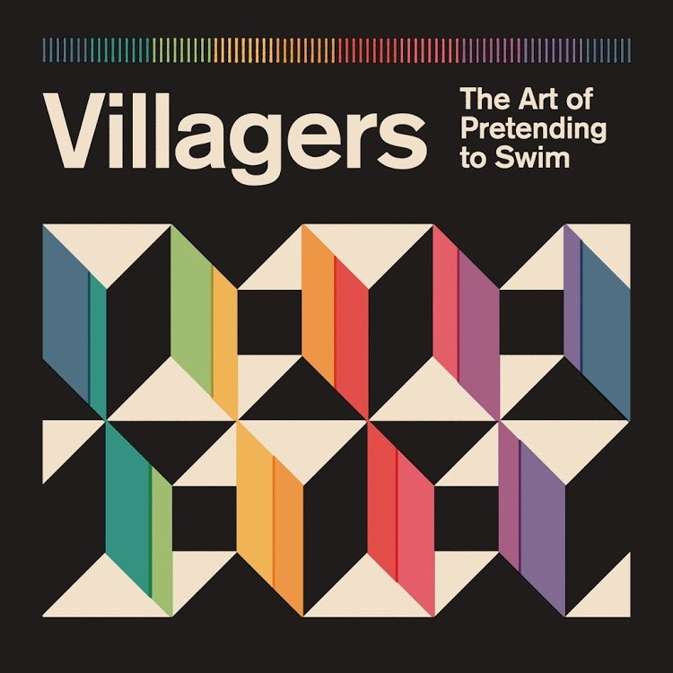
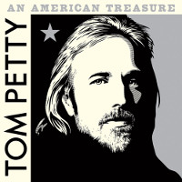
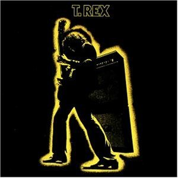
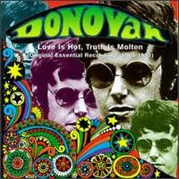
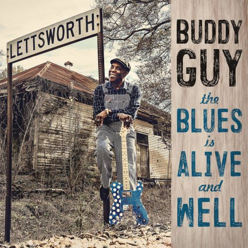
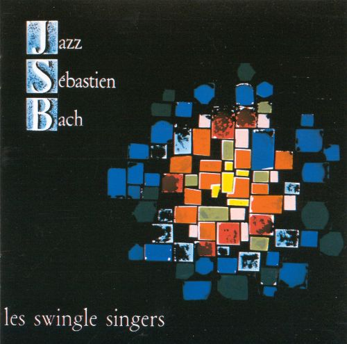
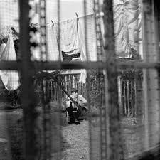
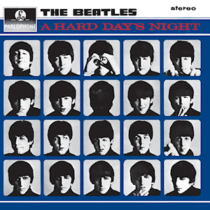

= Радио Аэростат. Глава XXVIII
:toc: left

> link:aerostat.html[<Home>]
> link:toc.html[<Contents>]
> link:lyrics.html[<Lyrics>]

== 8 апреля 2018 - 7 октября 2018

<http://old.aquarium.ru/misc/aerostat/index28.html>

++++

++++

<<<

=== Новые песни октября, 7 октября 2018
<https://aerostatbg.ru/release/699>

.Villagers - link:VILLAGERS/Villagers%20-%20The%20Art%20of%20Pretending%20to%20Swim/lyrics/swim.html#_a_trick_of_the_light[A Trick Of The Light]

.Gilberto Gil - Quatro Pedacinhos

[%hardbreaks]
Sleaford Mods - Stick In A Five And Go
Phosphorescent - New Birth In New England
Mudhoney - Paranoid Core
Marc Ribot feat. Tom Waits - Bella Ciao (Goodbye Beautiful)
Matthew Dear - Echo
Seasick Steve - Hate Da Winter
Beatles - Back In The USSR [Esher Demo]

++++
 
++++

=== Everly Brothers, 30 сентября 2018
<https://aerostatbg.ru/release/698>

.Everly Brothers - So Sad (To Watch Good Love Go Bad)
image:Everly Brothers - The Best Of/Folder.jpg[The Best Of,200,200,role="thumb left"]

[%hardbreaks]
Everly Brothers - All I Have To Do Is Dream
Everly Brothers - Cathy’s Clown
Everly Brothers - Wake Up Little Susie
Everly Brothers - Memories Are Made Of This
Everly Brothers - Bye Bye Love
Everly Brothers - Love Hurts
Buddy Holly - Wishing
Everly Brothers - Love Of My Life
Everly Brothers - When Will I Be Loved
Everly Brothers - On The Wings Of A Nightingale
Everly Brothers - Oh, True Love
Everly Brothers - Stick With Me Baby
Everly Brothers - Some Sweet Day
Everly Brothers - Let It Be Me

=== Кулёма и культура, 23 сентября 2018
<https://aerostatbg.ru/release/697>

.John Dowland - Melancholy Galliard

.George Harrison - Lay His Head
image:GEORGE HARRISON/1995 - Pirate Songs/cover.jpg[Pirate Songs,200,200,role="thumb left"]

.Nobukazu Takemura - White Sheep And Small Light

[%hardbreaks]
Cars - Bye Bye Love
Burns Unit - What Is Life?
Thelonious Monk ‎– Brilliant Corners
Andy Summers ‎– Brilliant Corners
Madonna - Die Another Day
Joni Mitchell - I Don’t Know Where I Stand

=== «Electric Ladyland», 16 сентября 2018
<https://aerostatbg.ru/release/696>

.Jimi Hendrix Experience - And The Gods Made Love

[%hardbreaks]
Jimi Hendrix Experience - Have You Ever Been (To Electric Ladyland)
Jimi Hendrix Experience - Crosstown Traffic
Jimi Hendrix Experience - Little Miss Strange
Jimi Hendrix Experience - All Along the Watchtower
Jimi Hendrix Experience - Long Hot Summer Night
Jimi Hendrix Experience - Voodoo Child (Slight Return)
Jimi Hendrix Experience - Come On (Part I)
Jimi Hendrix Experience - House Burning Down
Jimi Hendrix Experience - Burning Of The Midnight Lamp

=== Новые новые песни сентября, 9 сентября 2018
<https://aerostatbg.ru/release/695>

.Idles - Great

.Orbital - Tiny Foldable Cities

.John Grant - Love Is Magic
image:JOHN GRANT/John Grant - Love Is Magic/cover.jpg[Love Is Magic,200,200,role="thumb left"]

.Richard Thompson - link:RICHARD%20THOMPSON/2018%20-%2013%20Rivers/lyrics/13_rivers.html#_bones_of_gilead[Bones Of Gilead]

++++
 
++++

.Low - Disarray

.Aphex Twin - t69 Collapse

[%hardbreaks]
Animal Collective - Hair Cutter
Soft Cell - Northern Lights

++++
 
++++

=== Фестиваль «Части Света», 2 сентября 2018
<https://aerostatbg.ru/release/694>

[%hardbreaks]
Terakaft - Talikoba
Beat feat. Ranking Roger - Heaven Hiding
Mgzavrebi - Tsremlebs Tuchebze (Tears on Your Lips)
Yat-Kha - Karangailyg Kara Hovaa (Dyngyldai)
Аквариум - Моей звезде
Gulaza - Al’chaiba
Белое Злато - За тихой рекою
Мельница - Ночная кобыла
Ibibio Sound Machine - The Chant (Iquo Isang)
Sheema Mukherjee - Bengali Lullaby
Kimmo Pohjonen - Serenity

=== Новые песни сентября, 26 августа 2018
<https://aerostatbg.ru/release/693>

.Neil & Liam Finn - Back To Life

.Elvis Costello & The Imposters - Unwanted Number

.Paul McCartney - Fuh You

.Paul Simon - One Man’s Ceiling is Another Man’s Floor

++++
 
++++

.Tom Petty And The Heartbreakers - Keep a Little Soul

[%hardbreaks]
Rod Stewart feat. Bridget Cady - Didn’t I
Manu Delago - Parasol Woods
Prodigy - Need Some1
Billy Gibbons - Missin’ Yo’ Kissin’
Kinks - Time Song

++++
 
++++

=== Новые имена, 19 августа 2018
<https://aerostatbg.ru/release/692>

.Les Negresses Vertes - Zobi La Mouche

.Scritti Politti - The World Girl

[%hardbreaks]
Dave Edmunds - I Hear You Knocking
Rockpile - Teacher Teacher
The The ‎– This Is The Day
Umm Kulthum - Alf Leila Wa Leila
Wardruna - Raido
Ambrose Slade - Knocking Nails Into My House
Felt - The World Is As Soft As Lace
Unicorn - Ooh Mother

=== Big Data Etc., 12 августа 2018
<https://aerostatbg.ru/release/691>

.T.Rex - Cosmic Dancer

.Donovan - Celeste

.Jethro Tull - link:JETHRO%20TULL/1972%20%20Living%20In%20The%20Past/lyrics/past.html#_living_in_the_past[Living In The Past]
image:JETHRO TULL/1972  Living In The Past/cover.jpg[1972  Living In The Past,200,200,role="thumb left"]

[%hardbreaks]
Jimi Hendrix Experience - 1983… (A Merman I Should Turn To Be)
Jimi Hendrix Experience - Moon, Turn The Tides… Gently, Gently Away
Liz Phair - Why Can’t I?
Cat Stevens - On The Road To Find Out
T.Rex - Monolith

++++
 
++++

=== Новые песни августа, 5 августа 2018
<https://aerostatbg.ru/release/690>

.Milk Carton Kids - link:MILK%20CARTON%20KIDS/2018%20-%20All%20The%20Things%20That%20I%20Did%20And%20All%20The%20Things%20That%20I%20Didnt%20Do/lyrics/things.html#_younger_years[Younger Years]

[%hardbreaks]
Daron Malakian and Scars On Broadway - Lives
Tiger Lillies - Don Hector
Death Grips - Streaky
Alice In Chains - The One You Know
Chilly Gonzales - Blizzard in B Flat Minor
White Denim - Magazin
Joe Strummer - London Is Burning
John Prine - Summer’s End
Ólafur Arnalds - saman
Wild Feathers - Stand By You

=== Люнассад - 2018, 29 июля 2018
<https://aerostatbg.ru/release/689>

.Skipinnish - The Island

[%hardbreaks]
Chieftains feat. Paddy Moloney - Le Lys Vert
Lumiere - Cailín Deas Crúite Na Mbó
Traffic - John Barleycorn
Liam Clancy - Green Fields Of France
Chieftains & The Rankin Family - An Innis Aigh
Fisherman’s Friends - The Leaving Of Liverpool

++++
 
++++

=== Слова, 22 июля 2018
<https://aerostatbg.ru/release/688>

.Paul Simon - Everything Put Together Falls Apart
image:PAUL SIMON/1972 - Paul Simon (remastered)/cover.jpg[Paul Simon,200,200,role="thumb left"]

.Leonard Cohen - link:LEONARD%20COHEN/09-The%20Future%20(1992)/lyrics/future.html#_be_for_real[Be For Real]

.T.Rex - The Time Of Love Is Now
image:T-REX/T-Rex/cover.jpg[Rex,200,200,role="thumb left"]

[%hardbreaks]
Talking Heads - Burning Down The House
Cat Empire - The Lost Song
Antonio Carlos Jobim - The Face I Love (Seu Encanto)
Family - Summer ‘67
Johann Sebastian Bach - Herz Und Mund Und Tat Und Leben
Eric Burdon & The Animals - Man-Woman
Gin Blossoms - Break

++++
 
++++

=== Remain in Light, 15 июля 2018
<https://aerostatbg.ru/release/687>

.Talking Heads - Crosseyed And Painless
image:Talking Heads - Remain In Light/Folder.jpg[Remain In Light,200,200,role="thumb left"]

[%hardbreaks]
Talking Heads - Born Under Punches (The Heat Goes On)
Talking Heads - The Great Curve
Talking Heads - Once In A Lifetime
Talking Heads - Houses In Motion
Talking Heads - Listening Wind
Talking Heads - The Overload
Talking Heads - Seen And Not Seen

++++
 
++++

=== Новые песни в июле, 8 июля 2018
<https://aerostatbg.ru/release/686>

.Buddy Guy - Old Fashioned

.Norma Waterson & Eliza Carthy - The Wild Colonial Boy

.Paul McCartney - Сome On To Me

.Luluc - Spring

++++
 
++++

[%hardbreaks]
Dirty Projectors - Break-Thru
Paul McCartney - I Don’t Know
Gene Clark - Past Tense
Underworld & Iggy Pop - I’ll See Big
Old Crow Medicine Show - Dixie Avenue

++++
 
++++

=== Новые имена, 1 июля 2018
<https://aerostatbg.ru/release/685>

.Jason Wade - You Belong To Me

.Buddy Guy - I Could Die Happy

.Primal Scream - Rocks

[%hardbreaks]
Primal Scream - Higher Than The Sun
Teardrop Explodes - When I Dream
Teenage Fanclub - December
Bow Wow Wow - Aphrodisiac
Cameron Graves - Satania Our Solar System
Hoagy Carmichael - Stardust
Zero 7 - Futures

++++
 
++++

=== Женщины поют, 24 июня 2018
<https://aerostatbg.ru/release/684>

.Janelle Monáe feat. Brian Wilson - Dirty Computer
image:Janelle Monáe - Dirty Computer/cover.png[Dirty Computer,200,200,role="thumb left"]

.Joan As Police Woman - Damned Devotion

[%hardbreaks]
Emma Tricca - Cobblestone Street
Eleanor Friedberger - He Didn’t Mention His Mother
Liz Phair - Never Said
Ashley Monroe ‎- Like A Rose
Melody’s Echo Chamber - I Follow You
Serafina Steer - Skinny Dipping
Gwenno - Tir Ha Mor
Nina Simone - I Wish I Knew How It Would Feel To Be Free

    
=== О чём ваши песни? 17 июня 2018
<https://aerostatbg.ru/release/683>

.Paul McCartney - Bye Bye Blackbird
image:PAUL MCCARTNEY/Paul McCartney - Kisses On The Bottom/cover.png[Kisses On The Bottom,200,200,role="thumb left"]

.Tom Waits - link:TOM%20WAITS/Tom%20Waits%201987%20-%20Franks%20Wild%20Years/lyrics/franks.html#_blow_wind_blow[Blow Wind Blow]
image:TOM WAITS/Tom Waits 1987 - Franks Wild Years/cover.jpg[Franks Wild Years,200,200,role="thumb left"]

.Bob Dylan - link:BOB%20DYLAN/Bob%20Dylan%201963%20-%20Blowing%20In%20The%20Wind/lyrics/blowing.html[One Too Many Mornings]
image:BOB DYLAN/Bob Dylan 1963 - Blowing In The Wind/cover.jpg[Blowing In The Wind,200,200,role="thumb left"]

.Beatles - Till There Was You
image:THE BEATLES/Live at the BBC/cover.jpg[Live at the BBC,200,200,role="thumb left"]

++++
 
++++

[%hardbreaks]
Frank Sinatra - Say It
Nirvana ‎- Come As You Are
Mothers Of Invention - Call Any Vegetable
Searchers - Needles And Pins
George Harrison - Tired Of Midnight Blue
Seekers ‎- I’ll Never Find Another You
Johann Sebastian Bach - Oboe Concerto In A Major (BWV 1055): Allegro

=== Новые песни в июне, 10 июня 2018
<https://aerostatbg.ru/release/682>

.Le Mystère Des Voix Bulgares feat. Lisa Gerrard - Pora Sotunda

[%hardbreaks]
Matthew Sweet - I Belong To You
Bombino - Oulhin (My Heart Burns)
Jonny Greenwood - Playground (Bass Clarinet)
Ziggy Marley - Circle Of Peace
Oneohtrix Point Never - The Station
Brad Mehldau Trio - Almost Like Being In Love
Beat feat. Dave Wakeling - How Can You Stand There?
Tom Rush - Come See About Me

    
=== Ух, какие песни! 3 июня 2018
<https://aerostatbg.ru/release/681>

.Heaven 17 - (We Don’t Need This) Fascist Groove Thang

[%hardbreaks]
Johnny Kidd & The Pirates - Shakin’ All Over
Sam The Sham & The Pharaohs - Wooly Bully
Shocking Blue - I’ll Folow The New Sun
Lonnie Donegan - Rock Island Line
Holger Czukay - Persian Love
Cecil Taylor and Buell Neidlinger - O.P.
Julie London - I’m In The Mood For Love
Tim O’Brien - Oh Brother Can You Spare A Dime?
Eric Gales Trio - New Beginnings
Tommy Roe - Hooray For Hazel

=== Возрождение народа, 27 мая 2018
<https://aerostatbg.ru/release/680>

[%hardbreaks]
Mark Spoelstra - Sugar Babe
Odetta - 900 Miles
Weavers - Old Paint (Ride Around Little Dogies)
Joan Baez - Donna Donna
Tom Paxton ‎– Ramblin’ Boy
Fred Neil - Blues On The Ceiling
Dave Van Ronk - You’ve Been A Good Old Wagon
Clancy Brothers & Tommy Makem - The Wild Colonial Boy
Phil Ochs - Outside Of A Small Circle Of Friends
Eric Andersen - Close The Door Lightly When You Go
Bob Dylan - The Times They Are A-Changin’

    
=== Джаз Себастьян Бах, 20 мая 2018
<https://aerostatbg.ru/release/679>

.Les Swingle Singers - Fugue En Ré Mineur (Extr. De L’Art De La Fugue)

[%hardbreaks]
Les Swingle Singers - Prélude Pour Choral D’ Orgue N° 1
Les Swingle Singers - Aria (Extr. De La Suite En Ré Majeur)
Les Swingle Singers - Prelude N° 9 (Clavecin Bien Tempéré, Vol. 2)
Les Swingle Singers - Fuge VIII In D# Minor From «Das Wohltemperirte Clavier» Book 2
Johann Sebastian Bach - The Well-Tempered Clavier: Book I: Fugue In C Minor (BWV 847)
Les Swingle Singers - Fugue En Do Mineur (Clavecin Bien Tempéré, Vol. 1)
Les Swingle Singers - Bourrée (Extr. De La Suite Anglaise N° 2)
Les Swingle Singers - Fugue En Ré Majeur (Clavecin Bien Tempéré, Vol. 2)
Les Swingle Singers - Prélude En Do Majeur (Clavecin Bien Tempéré, Vol. 2)
Les Swingle Singers - Prélude En Fa Majeur (Clavecin Bien Tempéré, Vol. 2)
Les Swingle Singers - Fugue En Ré Majeur (Clavecin Bien Tempéré, Vol. 1)
Les Swingle Singers - Canon
Les Swingle Singers - Sinfonia (Extr. Partita N° 2)

=== Новые песни в мае, 13 мая 2018
<https://aerostatbg.ru/release/678>

.Arctic Monkeys - link:ARCTIC%20MONKEYS/Arctic%20Monkeys%20-%20Tranquility%20Base%20Hotel%20Casino/lyrics/tranquility.html#_science_fiction[Science Fiction]
image:ARCTIC%20MONKEYS/Arctic Monkeys - Tranquility Base Hotel Casino/cover.jpg[Tranquility Base Hotel Casino,200,200,role="thumb left"]

[%hardbreaks]
Father John Misty - Disappointing Diamonds Are the Rarest of Them All
Blabbermouth - Deep State
Akita - Пустой
Florence And The Machine - Sky Full Of Song
Shopping - Asking For A Friend
Sigur Rós - 64º46’34.1’’N 14º02’55.8’’W
Kabaka Pyramid - Can’t Breath
Аквариум - Из Тамбова с любовью
Frank Turner - Be More Kind

=== Jon Hassell, 6 мая 2018
<https://aerostatbg.ru/release/677>

[%hardbreaks]
Jon Hassell & Brian Eno - Ba-benzélé
Jon Hassell - Power Spot
Jon Hassell - Caracas Night September 11, 1975
Jon Hassell - Dream Theory
Jon Hassell - Last Night The Moon Came
Jon Hassell - Delta Rain Dream

=== Белтайн, 29 апреля 2018
<https://aerostatbg.ru/release/676>

.Jethro Tull - The Whistler
image:JETHRO TULL/1977  Songs From The Wood/cover.jpg[1977  Songs From The Wood,200,200,role="thumb left"]

[%hardbreaks]
The Hound + The Fox - The Parting Glass
Líadan - The Irish Girl
Bruno Major - Places We Won’t Walk
Mànran - Là Inbhir Lòchaidh
Sinéad O’Connor - Molly Malone
Albion Band - Harvest Anthem
Robin Laing - The Bruichladdich Dram
Maddy Prior & June Tabor - Somewhere Along The Road
Silly Wizard - The Pearl

=== Протест красотой, 22 апреля 2018
<https://aerostatbg.ru/release/675>

.Paul McCartney - link:PAUL%20MCCARTNEY/Paul%20McCartney%20-%20Chaos%20And%20Creation%20In%20The%20Backyard/lyrics/backyard.html#_how_kind_of_you[How Kind Of You]

.George Harrison - link:GEORGE%20HARRISON/George%20Harrison%20-%20Brainwashed/lyrics/brainwashed.html#_rising_sun[The Rising Sun]
image:GEORGE HARRISON/George Harrison - Brainwashed/cover.jpg[Brainwashed,200,200,role="thumb left"]

.Jethro Tull – Wond’ring Again
image:JETHRO TULL/1972  Living In The Past/cover.jpg[1972  Living In The Past,200,200,role="thumb left"]

[%hardbreaks]
Roger McGuinn - Shenandoah
Roxy Music – Love Is The Drug
Cat Stevens – If I Laugh
Paul Simon - Run That Body Down
Andy M. Stewart – The Orphan’s Wedding

++++
 
++++

=== Семеро Из Под Камней, 15 апреля 2018
<https://aerostatbg.ru/release/674>

[%hardbreaks]
Квартет Анны Карениной - Зеркало Баргельда
Квартет Анны Карениной - Стрепетарх
Русско-Абиссинский Оркестр - Llar-A-Hlar
Квартет Анны Карениной - Большой Стрепетарх выходит на охоту
Квартет Анны Карениной - Капитан Воронин встречает гигантского муравья
Квартет Анны Карениной - Наташа Ростова плюс
Семеро Из Под Камней - Highlands Of Kiev
Русско-Абиссинский Оркестр - Bar-do
Квартет Анны Карениной - Лошадь, как твоё имя?
Русско-Абиссинский Оркестр - Aballon Sayo
Семеро Из Под Камней - Секрет зимнего дня
Семеро Из Под Камней - Созерцает с камня безоар
Семеро Из Под Камней - Пылающее сердце зебры

    
=== Beatles в XXI-ом веке, 8 апреля 2018
<https://aerostatbg.ru/release/673>

.Beatles - If I Needed Someone
image:THE BEATLES/1965b - Rubber Soul/cover.jpg[Rubber Soul,200,200,role="thumb left"]

.Beatles - Day Tripper
image:THE BEATLES/1988 - Past Masters/cover.jpg[Past Masters,200,200,role="thumb left"]

.Beatles - Maxwell’s Silver Hammer
image:THE BEATLES/1969b - Abbey Road/cover.jpg[Abbey Road,200,200,role="thumb left"]

.Beatles - Long, Long, Long
image:THE BEATLES/The Beatles - White Album CD 2/cover.jpg[White Album CD 2,200,200,role="thumb left"]

++++
 
++++

.Beatles - Any Time At All

[%hardbreaks]
Beatles - Please Mister Postman
Beatles - Drive My Car
Beatles - Cry Baby Cry
Beatles - If I Fell
Beatles - I’m A Loser
Beatles - Norwegian Wood (This Bird Has Flown)
Beatles - Taxman
Beatles - Ticket To Ride

---

> link:aerostat.html[<Home>]
> link:toc.html[<Contents>]
> link:lyrics.html[<Lyrics>]

