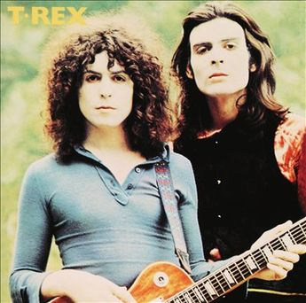

= Радио Аэростат. Глава XXIX
:toc: left

link:aerostat.html[Главная страница]

== 14 октября 2018 - 21 апреля 2019

<http://www.aquarium.ru/misc/aerostat/index28.html>

++++

++++

<<<

=== Новые песни апреля, 21 апреля 2019

<https://aerostatica.ru/2019/04/21/727-novye-pesni-aprelya/>

.Cranberries - The Pressure

[%hardbreaks]
Vampire Weekend - Big Blue
Joshua Burnell - Ah! Robin, Gentyl Robin
National - You Had Your Soul With You
Rua Das Pretas - Vida De Estrela
J.J. Cale - Stay Around
Bu Kolthoum - Zamilou
Drugdealer feat. Weyes Blood - Honey
Ruth Notman & Sam Kelly - Caw The Yowes
Sly & Robbie feat. Michael Rose, Mykal Rose, Sidney Mills & Don Camel - This Morning
Flook - Companion Star/The Coral Castle

=== «Stand Up» (словами авторов), 14 апреля 2019

<https://aerostatica.ru/2019/04/14/726-stand-up-slovami-avtorov/>

.Jethro Tull - A New Day Yesterday
image:JETHRO TULL/Jethro Tull - Stand Up/cover.jpg[Stand Up,200,200,role="thumb left"]

[%hardbreaks]
Jethro Tull - Jeffrey Goes To Leicester Square
Jethro Tull - Bourée
Jethro Tull - Nothing Is Easy
Jethro Tull - Back To The Family
Jethro Tull - Fat Man
Jethro Tull - For A Thousand Mothers
Jethro Tull - Reasons For Waiting
Jethro Tull - We Used To Know
Jethro Tull - Look Into The Sun

=== Krautrock, 7 апреля 2019

<https://aerostatica.ru/2019/04/07/725-krautrock/>

.Can - Moonshake

[%hardbreaks]
Cluster - Halwa
Amon Düül II - She Came Through The Chimney
Ash Ra Tempel - Le Sourire Volé
Guru Guru - Girl Call
Popol Vuh - Das 5. Buch Mose: Abschied
Tangerine Dream - Tangines On And Running
Harmonia - Watussi
Faust - Jennifer
Kraftwerk - Metropolis

=== Новые имена, 31 марта 2019

<https://aerostatica.ru/2019/03/31/724-novye-imena/>

[%hardbreaks]
Vaudou Game - Chérie Nye
Teeth Of The Sea - Hiraeth
Cúig - Change
Crass - Yes Sir, I Will
Nat King Cole - Straighten Up And Fly Right
Telekinesis - Set A Course
Neu! - Hallogallo
The 1975 - Sincerity Is Scary

=== Muddy Waters, 24 марта 2019

<https://aerostatica.ru/2019/03/24/723-muddy-waters/>

[%hardbreaks]
Muddy Waters - Mannish Boy
Muddy Waters - Trouble No More
Muddy Waters - My John The Conquer Root
Muddy Waters - Still A Fool
Muddy Waters - I’m Ready
Muddy Waters - I’m Your Hoochie Coochie Man
Muddy Waters - I Can’t Be Satisfied
Muddy Waters - Rollin’ Stone
Muddy Waters - Sugar Sweet
Muddy Waters - Young Fashioned Ways
Muddy Waters - Louisiana Blues
Muddy Waters - Just Make Love To Me

=== Дэвид Сильвиан, 17 марта 2019

<https://aerostatica.ru/2019/03/17/722-devid-silvian/>

[%hardbreaks]
David Sylvian - The Boy With The Gun
David Sylvian - Orpheus
David Sylvian & Steve Jansen - Ballad Of A Deadman
David Sylvian & Ryuichi Sakamoto - Forbidden Colours
David Sylvian - The Good Son
David Sylvian & Nine Horses - Money For All
David Sylvian - The Only Daughter

=== И то, и сё, 10 марта 2019

<https://aerostatica.ru/2019/03/10/721-i-to-i-syo/>

.Specials - link:Specials%20-%20Encore%20(Deluxe)/lyrics/encore.html#_the_lunatics[The Lunatics]
image:Specials - Encore (Deluxe)/cover.jpg[Encore (Deluxe),200,200,role="thumb left"]

.Leonard Cohen - So Long, Marianne
image:LEONARD COHEN/01-Songs Of Leonard Cohen (1967)/cover.jpg[Songs Of Leonard Cohen (1967),200,200,role="thumb left"]

.Andy M. Stewart - Macgregor’s Gathering

[%hardbreaks]
Orlando di Lasso - Tristis Est Anima Mea
Stevie Wonder - Master Blaster (Jammin’)
Sergio Mendes & Brasil ‘66 - Constant Rain (Chove Chuva)
Joan Baez - Donna Donna
Johann Sebastian Bach - Toccata, Adagio And Fugue In C Major (BWV 564)
Sha Na Na - Witch Doctor

++++
 
++++

=== Новые песни марта, 3 марта 2019

<https://aerostatica.ru/2019/03/03/720-novye-pesni-marta/>

.Pet Shop Boys - Give Stupidity A Chance

.Specials - link:Specials%20-%20Encore%20(Deluxe)/lyrics/encore.html#_breaking_point[Breaking Point]
image:Specials - Encore (Deluxe)/cover.jpg[Encore (Deluxe),200,200,role="thumb left"]

.Lambchop - Everything For You

.Snarky Puppy - Xavi

++++
 
++++

.Iron & Wine - Passing Afternoon

[%hardbreaks]
Bassekou Kouyate feat. Habib Koite - Kanto Kelena
Toni Molina - Nothing I Can Say
Martyn Joseph - Oh My Soul
Cass McCombs - Absentee

++++
 
++++

=== Главные альбомы Боба Марли, 24 февраля 2019

<https://aerostatica.ru/2019/02/24/719-glavnye-albomy-boba-marli/>

.Bob Marley & The Wailers - Natty Dread
image:BOB MARLEY/Bob Marley - Natty Dread (1974)/cover.jpg[Natty Dread (1974),200,200,role="thumb left"]

.Bob Marley & The Wailers - Kaya
image:BOB MARLEY/Bob Marley - Kaya (1978)/cover.jpg[Kaya (1978),200,200,role="thumb left"]

[%hardbreaks]
Bob Marley & The Wailers - Is This Love
Bob Marley & The Wailers - Concrete Jungle
Bob Marley & The Wailers - Crazy Baldhead
Bob Marley & The Wailers - Jamming
Bob Marley & The Wailers - So Much Trouble In The World
Bob Marley & The Wailers - Coming In From The Cold
Bob Marley & The Wailers - Ride Natty Ride

++++
 
++++

=== Из какого сора №2, 17 февраля 2019

<https://aerostatica.ru/2019/02/17/718-iz-kakogo-sora-2/>

[%hardbreaks]
George Frideric Handel - Semele: Where’er You Walk
Bauhaus - Bela Lugosi’s Dead
Spirit - Fresh-Garbage
Public Enemy - Don’t Believe The Hype
John Martyn - Solid Air
Doors - Light My Fire

    
=== Howlin’ Wolf, 10 февраля 2019

<https://aerostatica.ru/2019/02/10/717-howlin-wolf/>

[%hardbreaks]
Howlin’ Wolf - Spoonful
Howlin’ Wolf - Cause Of It All
Howlin’ Wolf - Smokestack Lightning
Howlin’ Wolf - How Many More Years
Howlin’ Wolf - Sitting On Top Of The World
Howlin’ Wolf - Back Door Man
Howlin’ Wolf - Moanin’ At Midnight
Howlin’ Wolf - I Asked For Water
Howlin’ Wolf - The Red Rooster
Howlin’ Wolf - Killing Floor
Howlin’ Wolf - The Sun Is Rising

=== Химолк, 3 февраля 2019

<https://aerostatica.ru/2019/02/03/716-himolk/>

.Fairport Convention - She Moves Through The Fair
image:FAIRPORT CONVENTION/Fairport Convention-What We Did On Our Holidays-1969/cover.jpg[What We Did On Our Holidays-1969,200,200,role="thumb left"]

[%hardbreaks]
Ímar - White Strand
Lumiere - Samhradh
Maddy Prior & June Tabor - Silver Whistle
Lúnasa - Ballyogan
Clutha - Among The Blue Flowers And The Yellow
Ian Campbell Folk Group - Twa Recruiting Sergeants
Andy M. Stewart - Patrick Sheehan
Dransfield - What Will We Tell Them?
Archie Fisher & Garnet Rogers - Ettrick

=== «Лилит», 27 января 2019

<https://aerostatica.ru/2019/01/27/715-lilit/>

[%hardbreaks]
БГ - Некоторые женятся (А некоторые - так)
БГ - Из Калинина в Тверь
БГ - Там, где взойдёт Луна
БГ - На её стороне
БГ - Хилый закос под любовь
БГ - Тень
БГ - Капитан Белый Снег
БГ - По дороге в Дамаск
БГ - Если бы не ты

=== Новые песни января, 20 января 2019

<https://aerostatica.ru/2019/01/20/714-novye-pesni-yanvarya/>

[%hardbreaks]
Weezer - Zombie Bastards
Specials - Vote For Me
Senyawa - Sujud (Prostration)
Radiohead - Ill Wind
Dudu Tassa & The Kuwaitis - Ya Nabat Al-Rehan
Fofoulah - Seye
Beat feat. Ranking Roger - Who’s Dat Looking
Аквариум - Бабушки
Paul McCartney - Get Enough

=== Лучшие альбомы 2018, 13 января 2019

<https://aerostatica.ru/2019/01/13/713-luchshie-albomy-2018/>

.John Grant - Touch And Go

.Buddy Guy - Ooh Daddy
image:BUDDY GUY/Buddy Guy - The Blues Is Alive And Well/cover.jpg[The Blues Is Alive And Well,200,200,role="thumb left"]

.Brian Eno - Flora And Fauna/Gleise 581d

.Christine and The Queens - Doesn’t Matter

++++
 
++++

.Jon Hopkins - Feel First Life

.Richard Thompson - link:RICHARD%20THOMPSON/2018%20-%2013%20Rivers/lyrics/13_rivers.html#_my_rock_my_rope[My Rock, My Rope]
image:RICHARD THOMPSON/2018 - 13 Rivers/cover.jpg[13 Rivers,200,200,role="thumb left"]

.Low - Poor Sucker
image:Low - Double Negative/cover.jpg[Double Negative,200,200,role="thumb left"]

.David Byrne - link:David%20Byrne%20-%20American%20Utopia/lyrics/utopia.html#_i_dance_like_this[I Dance Like This]

++++
 
++++

.Ziggy Marley - Your Pain Is Mine
image:Ziggy Marley - Rebellion Rises/cover.jpg[Rebellion Rises,200,200,role="thumb left"]

++++
 
++++

=== Притчи, 6 января 2019

<https://aerostatica.ru/2019/01/06/712-pritchi/>

.Simon & Garfunkel - Benedictus
image:SIMON & GARFUNKEL/Simon & Garfunkel - Wednesday Morning/cover.jpg[Wednesday Morning,200,200,role="thumb left"]

.Eric Clapton - My Very Good Friend The Milkman

.Bob Dylan - Workingman’s Blues #2

[%hardbreaks]
Rustavi Choir - Shen Khar Venakhi
Gordon Lightfoot - Steel Rail Blues
Richard Thompson - Precious One
Johann Sebastian Bach - French Suite No. 2 In C Minor: Allemande
Shirley & Dolly Collins - Lord Allenwater
Eric Andersen - Just A Country Dream
Tom Paxton - My Lady’s A Wild, Flying Dove

=== С наступающим! 30 декабря 2018

<https://aerostatica.ru/2018/12/30/711-s-nastupayushchim/>

.George Harrison - I Live For You

.Donovan - The Land Of Doesn’t Have To Be
image:DONOVAN/Donovan - A Gift From a Flower to a Garden/cover.jpg[A Gift From a Flower to a Garden,200,200,role="thumb left"]

.T.Rex - Seagull Woman

.George Harrison - Give Me Love (Give Me Peace On Earth)
image:GEORGE HARRISON/George Harrison - Live In Japan CD1/220px-Harrison-live-in-japan.jpg[Live In Japan CD1,200,200,role="thumb left"]

++++
 
++++

.Eric Clapton - Rockin’ Chair

[%hardbreaks]
Texas Gypsies - Lights Up The Sun
Dick Gaughan - Scojun Waltz / Randers Hopsa
Moody Blues - Dr. Livingstone, I Presume
George Harrison - Behind That Locked Door
Purushottama - Gratitude Heart
Bing Crosby & Grace Kelly - True Love

++++
 
++++

=== Рождество, 23 декабря 2018

<https://aerostatica.ru/2018/12/23/710-rozhdestvo/>

[%hardbreaks]
Bing Crosby - That Christmas Feeling
Kate Rusby - The Ivy And The Holly
Maddy Prior & The Carnival Band - How Firm A Foundation
Albion Christmas Band - Somerset Wassail
Dean Martin - Christmas Blues
Doris Day - Be A Child At Christmas Time
Ray Conniff - The Twelve Days Of Christmas
Queen - Thank God It’s Christmas
Cocteau Twins - Winter Wonderland
T. Rex ‎– Christmas Bop
Bing Crosby - White Christmas

=== Карбонара, 16 декабря 2018

<https://aerostatica.ru/2018/12/16/709-karbonara/>

[%hardbreaks]
Rustavi Choir - Sabodisho (Healing Song)
Buzzcocks ‎- Harmony In My Head
Dillard & Clark - Train Leaves Here This Mornin’
Etta James - All I Could Do Was Cry
William Byrd - Emendemus in melius
Beatles - Leave My Kitten Alone
Alternative TV - Action Time Vision
Alternative TV - Vibing Up The Senile Man
Rolling Stones - I Got The Blues
Tom Petty - Around The Roses

=== Начало блюза, 9 декабря 2018

<https://aerostatica.ru/2018/12/09/708-nachalo-blyuza/>

.John Lee Hooker - link:JOHN%20LEE%20HOOKER/John%20Lee%20Hooker%20-%20The%20Ultimate%20Collection%20(CD%201)/lyrics/hooker1.html#_dimples[Dimples]
image:JOHN LEE HOOKER/John Lee Hooker - The Ultimate Collection (CD 1)/cover.jpg[The Ultimate Collection (CD 1),200,200,role="thumb left"]

[%hardbreaks]
Elmore James ‎– Shake Your Moneymaker
Blind Willie Johnson ‎– John The Revelator
Blind Boy Fuller ‎– What’s That Smells Like Fish
Robert Johnson ‎– I Believe I’ll Dust My Broom
Charley Patton ‎– Down The Dirt Road Blues
Son House ‎– My Black Mama Part I
Big Bill Broonzy - Baby, Please Don’t Go
Howlin’ Wolf ‎– Smokestack Lightning
Muddy Waters - I’m Your Hoochie Coochie Man
Skip James - Hard Times Killing Floor Blues

=== Новые имена, 2 декабря 2018

<https://aerostatica.ru/2018/12/02/707-novye-imena/>

[%hardbreaks]
Johann Caspar Ferdinand Fischer - Marche I
La Troba Kung-Fú - María Hernández
Alasdair Roberts - Admiral Cole
Andy Williams - Can’t Get Used To Losing You
Horse Radio - Boom Bur Jaan
Gazelle Twin - Love And Mercy
Etta James - At Last
Pandit Ajay Pohankar - Des Birana’
Motorama - Heavy Wave
Matshikos - New South Africa

=== Новые песни декабря, 25 ноября 2018

<https://aerostatica.ru/2018/11/25/706-novye-pesni-dekabrya/>

.Mark Knopfler - Good On You Son

.Dead Can Dance - ACT II : The Mountain

[%hardbreaks]
Lúnasa - Paddy’s Green Shamrock Shore
Bokanté + Metropole Orkest - La Maison En Feu (House On Fire)
Adam Hopkins - I Think The Duck Was Fine
Skiffle Players - John O’Dreams
John Smith - Hummingbird

++++
 
++++

=== Алиса Колтрейн, 18 ноября 2018

<https://aerostatica.ru/2018/11/18/705-alisa-koltreyn/>

[%hardbreaks]
Alice Coltrane - Transcendence
Alice Coltrane feat. Pharoah Sanders - Journey In Satchidananda
John Coltrane & Alice Coltrane - Lord, Help Me To Be
Alice Coltrane - Radhe-Shyam
Alice Coltrane - Sita Ram
Alice Coltrane - Jagadishwar

=== The Band, 11 ноября 2018

<https://aerostatica.ru/2018/11/11/704-the-band/>

[%hardbreaks]
Band - Across The Great Divide
Band - The Night They Drove Old Dixie Down
Band - Up On Cripple Creek
Band - Time To Kill
Bob Dylan & The Band - This Wheel’s On Fire
Band - I Shall Be Released
Band - Tears Of Rage
Band - Rag Mama Rag
Band - The Weight
Bob Dylan & The Band - You Ain’t Goin’ Nowhere

=== Новые в ноябре, 4 ноября 2018

<https://aerostatica.ru/2018/11/04/703-novye-v-noyabre/>

.Gryphon - Rhubarb Crumhorn
image:Gryphon - ReInvention/Cover.jpg[ReInvention,200,200,role="thumb left"]

.Breabach - Birds Of Passage

.Iron & Wine - What Hurts Worse

.Van Morrison - The Prophet Speaks

++++
 
++++

[%hardbreaks]
Ty Segall - Low Rider
Thom Yorke - Suspirum
Smashing Pumpkins - Silvery Sometimes (Ghosts)
Mgzavrebi - Iasamani
Beatles - While My Guitar Gently Weeps [Acoustic Version / Take 2]
Аквариум - Бой Баба

++++
 
++++

=== Samhain-2018, 28 октября 2018

<https://aerostatica.ru/2018/10/28/702-samhain-2018/>

[%hardbreaks]
Gráinne Hambly - Eleanor Plunkett
Jarlath Henderson - Courting Is A Pleasure
Dougie Maclean - Gin I Were A Baron’s Heir
Silly Wizard - Take The High Road
Plethyn - Cysga Di, Fy Mhlentyn Tlws
JCB with Jerry Holland - Boo Babys Lullaby
Brian Hughes & Garry O’Briain - The Fairy Child
Iron Horse - The Twa Corbies
Mick West & Muldoon’s Picnic - Will Ye Go Tae Flanders
Malinky - Pad The Road Wi’ Me
Gráinne Hambly - Tosa Waltz

    
=== Ultravox, 21 октября 2018

<https://aerostatica.ru/2018/10/21/701-ultravox/>

[%hardbreaks]
Ultravox - Reap The Wild Wind
Ultravox - Passing Strangers
Ultravox - Dislocation
Ultravox - Hiroshima Mon Amour
Ultravox - Vienna
Ultravox - Sleepwalk
Ultravox - We Stand Alone
Ultravox - All Fall Down
Ultravox - We Came To Dance
Ultravox - Love’s Great Adventure

=== Семисотая, 14 октября 2018

<https://aerostatica.ru/2018/10/14/700-semisotaya/>

.Tom Petty - I Don’t Belong
image:TOM PETTY/Tom Petty 2008 - An American Treasure/cover.jpg[An American Treasure,200,200,role="thumb left"]

.Doors - link:Doors%20-%20Waiting%20For%20The%20Sun/lyrics/waiting.html#_yes_the_river_knows[Yes, The River Knows]
image:Doors - Waiting For The Sun/Waiting For The Sun.jpg[Waiting For The Sun,200,200,role="thumb left"]

.Steeleye Span - Batchelors Hall
image:STEELEYE SPAN/Steeleye Span - All Around My Hat/cover.jpg[All Around My Hat,200,200,role="thumb left"]

.Beatles - I Need You
image:THE BEATLES/The Beatles - Help!/front.jpg[Help!,200,200,role="thumb left"]

++++
 
++++

[%hardbreaks]
Kraftwerk - Die Mensch-Maschine
Charles Aznavour - Hier Encore
Gilbert O’Sullivan - Alone Again (Naturally)
Peter Сase - On The Way Downtown
Paul McCartney - Do It Now
Tom Petty - Keeping Me Alive
