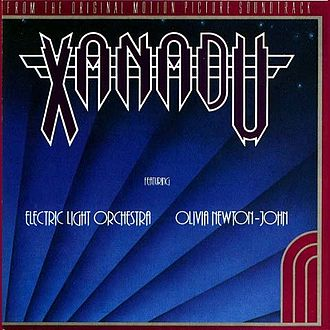
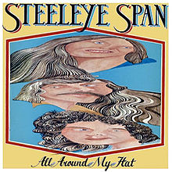
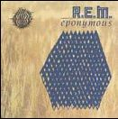

= Радио Аэростат. Глава XXX
:toc: left

++++

++++

> link:aerostat.html[Главная страница]

== 28 апреля 2019 - 20 октября 2019

<http://old.aquarium.ru/misc/aerostat/index30.html>

=== Поле и Обитатель Поля, 20 октября 2019

<https://www.radiorus.ru/brand/57083/episode/2212135>

.Joni Mitchell - Just Like This Train
image:JONI MITCHELL/Court and Spark (remastered)/cover.jpg[Court and Spark (remastered),200,200,role="thumb left"]

.Cat Stevens - Sitting
image:CAT STEVENS/Cat Stevens - The Very Best Of/cover.jpg[The Very Best Of,200,200,role="thumb left"]

.John Lennon - Old Dirt Road
image:THE BEATLES/John Lennon - Walls and Bridges/cover.png[Walls and Bridges,200,200,role="thumb left"]

[%hardbreaks]
Bhagavad Gita - 13
Jagjit & Chitra Singh - Sab Se Umchi
Dittersdorf - Sinfonia In F. Minuetto
George Harrison - Mo's Song
Rustavi - Sulta Tana
Gus Teja - Morning Happiness

++++
 
++++

=== Новые песни октября, 13 октября 2019

<https://www.radiorus.ru/brand/57083/episode/2210068>

.Pixies - Catfish Kate

.Van Morrison - Dark Night Of The Soul

.Jeff Lynne's Elo - From Out Of Nowhere
image:Electric Light Orchestra/2019 - From Out of Nowhere/cover.png[From Out of Nowhere,200,200,role="thumb left"]

[%hardbreaks]
Аквариум - Духовные Люди
Who - All This Music Will Fade
Manu Delago - Circadian
Alasdair Roberts - Dancers
Beatles - Goodbye
Johnny Greenwood - 3 Miniatures. Water#1

++++
 
++++

=== Super Furry Animals, 6 октября 2019

<https://www.radiorus.ru/brand/57083/episode/2208173>

.Super Furry Animals - Helium Hearts
image:Super Furry Animails - Dark Days-Light Years/cover.jpg[Dark Days-Light Years,200,200,role="thumb left"]

[%hardbreaks]
Super Furry Animals - Rings Around The World
Super Furry Animals - Northern Lites
Super Furry Animals - Imaelodi A'r Ymylon
Super Furry Animals - Bing Bong
Super Furry Animals - Run-Away
Super Furry Animals - Sarn Helen
Super Furry Animals - Hello Sunshine
Super Furry Animals - Piccolo Snare
Super Furry Animals - Juxtapozed With U

++++
 
++++

=== Blue Note Records, 29 сентября 2019

<https://www.radiorus.ru/brand/57083/episode/2205467>

.Thelonius Monk - Ruby My Dear

[%hardbreaks]
Chet Baker - Lets Get Lost
Sidney Bechet - Summertime
Albert Ammons - Boogie Woogie Blues
Horace Silver - Que Pasa (Trio Version)
Sonny Rollins - Tune Up
Herbie Hancock - Maiden Voyage
Jimmy Smith - Back At The Chicken Shack

++++
 
++++

=== Еще Новые Новые, 22 сентября 2019

<https://www.radiorus.ru/brand/57083/episode/2204188>

.Steeleye Span - Reclaimed

[%hardbreaks]
Billie Eilish - All The Good Girls Go To Hell
Post Malone - Take What You Want
Martin Simpson - Neo
Rails - Ball And Chain
Stereolab - Freestyle Dumpling
Faith Mussa - Kwanu Mkwanu
Jenny Hval - Ashes To Ashes
Liam Gallagher - Once

++++
 
++++

=== Не Судьба, 15 сентября 2019

<https://www.radiorus.ru/brand/57083/episode/1321661>

.Sufjan Stevens - Concerning The UFO
image:SUFJAN STEVENS/Sufjan Stevens 2005 - Illinoise/Folder.jpg[Illinoise,200,200,role="thumb left"]

.Mamas&Papas - Dancing Bear
image:THE MAMAS AND THE PAPAS/The Mamas & The Papas - Greatest Hits/cover.jpg[Greatest Hits,200,200,role="thumb left"]

.Electric Light Orchestra - Xanadu

.George Harrison - Unknown Delight
image:GEORGE HARRISON/George Harrison - Gone Troppo/cover.jpg[Gone Troppo,200,200,role="thumb left"]

++++
 
++++

.Sinead O'Connor - The Lamb's Book of Life

[%hardbreaks]
Fat White Family - Whitest Boy On The Beach
Love - Message To Pretty
Page&Plant - Wonderful One
Al Bowlly - Easy Come Easy Go

++++
 
++++

=== Новые Песни Сентября, 8 сентября 2019

<https://www.radiorus.ru/brand/57083/episode/2200116>

[%hardbreaks]
Blink-182 - Blame It On My Youth
Wilco - Love Is Everywhere
Bodega - Shiny New Model
Lau - She Put On Her Headphones
Gruff Rhys - Bae Bae Bae (Muzi Remix)
Why? - Stained Glass Slipper
Lana Del Rey - Mariners Apartment Complex
Iggy Pop - James Bond
Big Youth - Gunslinger
Peter Cat Recording Co - Soulless Friends

++++
 
++++

=== "Части Света 2019", 1 сентября 2019

<https://www.radiorus.ru/brand/57083/episode/2198070>

.Steeleye Span - Hard Times

[%hardbreaks]
Fanfares Of Prague - Lande.Fanfare
Soul 47 - Moved Around
Starostin/Volkov
Dechen Shak-Dagsay - Opa Me
Karelia
Varttina - Kelo
Аквариум - Бог Зимогоров

++++
 
++++

=== 7 Поколений, 25 августа 2019

<https://www.radiorus.ru/brand/57083/episode/2195585>

[%hardbreaks]
Dechen
Dechen
King Oliver Cleole Jazz Band - Alligator Hop
Kay Kyser - The Umbrella Man
Frank Sinatra - One For My Baby (And One For The Road)
Beatles - We Can Work It Out
Dechen
Radiohead - Paranoid Android
Skrillex-Marley - Make It Bum Dem
Beatles - Across The Universe

++++
 
++++

=== Новые Имена, 18 августа 2019

<https://www.radiorus.ru/brand/57083/episode/2193606>

[%hardbreaks]
Chordettes - Mr. Sandman
Jane's Addiction - Been Caught Stealing
Townes Van Zandt - Waiting Around To Die
Sunn O))) - Between Sleipnir's Breath
Milton Nascimento - Nuvem Cigana
Magma - Udu Wudu
Norma Tanega - Walkin' My Cat Named Dog
Dylan Leblanc - Part One: The End
Chordettes - Faraway Star

++++
 
++++

=== Гараж, 11 августа 2019

<https://www.radiorus.ru/brand/57083/episode/2189777>

[%hardbreaks]
Sam The Sham - Wooly Bully
Sonics - Have Love Will Travel
Count Five - Psychotic Reaction
Kingsmen - Louie Louie
? & The Mysterians - 96 Tears
Nashville Teens - Tobacco Road
Jimi Hendrix Experience - Wild Thing
Them - Gloria
Electric Prunes - I Had Too Much To Dream
13th Floor Elevators - You're Gonna Miss Me
Iggy/Stooges - Now I Wanna Be Your Dog
Bobby Fuller Four - I Fought The Law 

++++
 
++++

=== Новый Август, 4 августа 2019

<https://www.radiorus.ru/brand/57083/episode/2189790>

[%hardbreaks]
East Pointers - Wintergreen
Jesca Hoop - Red White And Black
Arthur Brown - Places Of Love
Bon Iver - Jelmore
75 Dollar Bill - C. Or T. Verso
Hu - Shoog Shoog
Sturgill Simpson - The Dead Don't Die
Brian Eno - Capsule
Tinariven - Taqkal Tarha
Belle&Sebastian - Sister Buddha

++++
 
++++

=== Lunassad: Поэты и пр., 28 июля 2019

<https://www.radiorus.ru/brand/57083/episode/2188154>

.Kate Rusby - The Farmers Toast

[%hardbreaks]
Kate Rusby - Bogie's Bonnie Bell
Kate Rusby - The Squire And The Parson
Kate Rusby - As The Lights Go Out
Kate Rusby - Jenny (Ordinary Remix)
Kate Rusby - Philosophers Poets And Kings
Kate Rusby - Crazy Man Michael
Kate Rusby - Halt The Wagons

++++
 
++++

=== Ronnie Lane, 21 июля 2019

<https://www.radiorus.ru/brand/57083/episode/2186823>

[%hardbreaks]
Ronnie Lane - Barcelona
Faces - Stone
Ronnie Lane's Slim Chance - Kushty Rye
Small Faces - Show Me The Way
Faces - Richmond
Ronnie Lane's Slim Chance - The Poacher
Ronnie Lane - April Fool
Ronnie Lane's Slim Chance - Chicken Wired
Ronnie Lane's Slim Chance - Don't Try'n'change My Mind
Ronnie Lane's Slim Chance - Don't You Cry For Me

++++
 
++++

=== О том, о сем #3, 14 июля 2019

<https://www.radiorus.ru/brand/57083/episode/2184927>

.Leon Redbone - Nobody's Sweetheart
image:LEON REDBONE/Double Time/cover.jpg[Double Time,200,200,role="thumb left"]

[%hardbreaks]
Black Keys - Walk Across The Water
Bulgarian State Choir - Polegnala E Todora
Tom Jones - Green Green Grass Of Home
Joao Gilberto - Desafinado
Dr. John - Brucho Bemba
David Bowie - Moss Garden
Trashmen - Surfing Bird
Cornelius - Sensuous

++++
 
++++

=== Новые песни в июле, 7 июля 2019

<http://www.radiorus.ru/brand/57083/episode/2183247>

.Bruce Springsteen - The Wayfarer
image:Bruce Springsteen - Western Stars/cover.jpg[Western Stars,200,200,role="thumb left"]

.Kate Rusby - Until Morning

[%hardbreaks]
Sheryl Crow - Prove You Wrong
Thom Yorke - Traffic
Freddie Mercury - Time Waits For Noone
Ludovico Einaudi - Day 4: Full Moon
Plaid - Ops
Bitw/Hitmore - Love Is Happening
High Kings - Red Is The Rose

++++
 
++++

=== John Lee Hooker, 30 июня 2019

<http://www.radiorus.ru/brand/57083/episode/2181170>

.John Lee Hooker - link:JOHN%20LEE%20HOOKER/John%20Lee%20Hooker%20-%20The%20Ultimate%20Collection%20(CD%202)/lyrics/hooker2.html#_boom_boom[Boom Boom]
image:JOHN LEE HOOKER/John Lee Hooker - The Ultimate Collection (CD 2)/cover.jpg[The Ultimate Collection (CD 2),200,200,role="thumb left"]

[%hardbreaks]
John Lee Hooker - link:JOHN%20LEE%20HOOKER/John%20Lee%20Hooker%20-%20The%20Ultimate%20Collection%20(CD%201)/lyrics/hooker1.html#_weeping_willow_boogie[Weeping Willow Boogie]
John Lee Hooker - Doin' The Shout
John Lee Hooker - link:JOHN%20LEE%20HOOKER/John%20Lee%20Hooker%20-%20The%20Ultimate%20Collection%20(CD%201)/lyrics/hooker1.html#_let_your_daddy_ride[Let Your Daddy Ride]
John Lee Hooker - link:JOHN%20LEE%20HOOKER/John%20Lee%20Hooker%20-%20The%20Ultimate%20Collection%20(CD%201)/lyrics/hooker1.html#_crawlin_king_snake[Crawling King Snake]
John Lee Hooker - link:JOHN%20LEE%20HOOKER/John%20Lee%20Hooker%20-%20The%20Ultimate%20Collection%20(CD%201)/lyrics/hooker1.html#_i_m_in_the_mood[I'm In The Mood]
John Lee Hooker - link:JOHN%20LEE%20HOOKER/John%20Lee%20Hooker%20-%20The%20Ultimate%20Collection%20(CD%201)/lyrics/hooker1.html#_boogie_chillen[Boogie Chillen]
John Lee Hooker - link:JOHN%20LEE%20HOOKER/John%20Lee%20Hooker%20-%20The%20Ultimate%20Collection%20(CD%201)/lyrics/hooker1.html#_dimples[Dimples]
John Lee Hooker - link:JOHN%20LEE%20HOOKER/John%20Lee%20Hooker%20-%20The%20Ultimate%20Collection%20(CD%202)/lyrics/hooker2.html#_one_bourbon_one_scotch_one_beer[One Burbon One Scotch One Beer]
John Lee Hooker - Women In My Life
John Lee Hooker - Chill Out

++++
 
++++

=== То да се #3, 23 июня 2019

<http://www.radiorus.ru/brand/57083/episode/2179513>

.REM - link:REM/REM%20-%20Eponymous/lyrics/eponymous.html#_talk_about_the_passion[Talk About The Passion]

.Simon & Garfunkel - Song For The Asking
image:SIMON & GARFUNKEL/Simon & Garfunkel - Bridge Over Troubled Water/cover.jpg[Bridge Over Troubled Water,200,200,role="thumb left"]

[%hardbreaks]
Joao Gilberto - Saudade Fez Um Samba
Kathmandu Music - Prayers For 3 Pioneers Of Kagyu
Liam Gallagher - Shockwave
King Crimson - Epitaph
Happy Traum - Blues Ain't Nothin'
Page & Plant - The Truth Explodes
Handel - Oboe Concerto #2. Andante

++++
 
++++

=== Новые имена # 23, 16 июня 2019

<http://www.radiorus.ru/brand/57083/episode/2177293>

[%hardbreaks]
Humble Pie - Stone Cold Fever
Suicide - Ghost Rider
Dustin O'Halloran - Mother
Endless Boogie - Taking Out The Trash
Ronnie Lane - Roll On Baby
Pete Seeger - If I Had A Hammer
Emitt Rhodes - 'Til The Day After
Screaming Trees - Nearly Lost You
Skip Marley - That's Not True
Free - Travellin In Style

++++
 
++++

=== Thelonius Monk, 9 июня 2019

<http://www.radiorus.ru/brand/57083/episode/2175601>

.Thelonius Monk - Light Blue

.Thelonius Monk - Just A Gigolo

.Thelonius Monk - Bemsha Swing

.Thelonius Monk - Ruby My Dear

++++
 
++++

.Thelonius Monk - Round Midnight

.Thelonius Monk - Crepuscule With Nellie

[%hardbreaks]
Thelonius Monk - Blue Monk
Thelonius Monk - Well, You Needn't

++++
 
++++

=== Новые песни июня, 2 июня 2019

<http://www.radiorus.ru/brand/57083/episode/2173518>

.Divine Comedy - link:DIVINE%20COMEDY/2019%20-%20Office%20Politics%20(Deluxe)/lyrics/office.html#_queuejumper[Queuejumper]
image:DIVINE COMEDY/2019 - Office Politics (Deluxe)/cover.png[Office Politics (Deluxe),200,200,role="thumb left"]

.Dervish & Kate Rusby - Down By The Sally Gardens
image:KATE RUSBY/Dervish 2019 - Great Irish Songbook/cover.jpg[Great Irish Songbook,200,200,role="thumb left"]

.Richard Hawley - Alone

.Morrissey - Wedding Bell Blues

++++
 
++++

[%hardbreaks]
Eliza Carthy - Friendship
Santana - Breaking Down The Door
Calexico/Iron & Wine - Father Mountain
John Zorn - The Hermit
Beck - Saw Lightning
Shannon Lay - Something On Your Mind

++++
 
++++

=== Священность музыки, 26 мая 2019

<http://www.radiorus.ru/brand/57083/episode/2171574>

.Donovan - Colours
image:DONOVAN/Donovan - Fairytale/cover.jpg[Fairytale,200,200,role="thumb left"]

.Beatles - I Feel Fine
image:THE BEATLES/1988 - Past Masters/cover.jpg[Past Masters,200,200,role="thumb left"]

[%hardbreaks]
Cat Stevens - Mona Bone Jacon
Rakesh Chaurasia - Mane Te Manavi Lejo
J S Bach - English Suite #1, X. Gigue
Busnoys - Regina Celi 1
Bhajan Singers - Ranjana Nadi Tire
Buxtehude - Canzona In C Maj
Herbie Mann - If
Mendelsson - Concertante In G Maj For 2 Flutes. 2

++++
 
++++

=== О том, о сем, No 2, 19 мая 2019

<http://www.radiorus.ru/brand/57083/episode/2169618>

.Donovan - The Tinker & The Crab
image:DONOVAN/Donovan - A Gift From a Flower to a Garden/cover.jpg[A Gift From a Flower to a Garden,200,200,role="thumb left"]

[%hardbreaks]
Vampire Weekend - Hold You Now
Family - Hung Up Down
J. S. Bach - Concerto For Oboe d'Amour In A. Allegro
John Fogerty - It Ain't Right
Traffic - Dealer
King Sunny Ade - Ma Jaiye Oni
Beat/Ranking Roger - A Good Day For Sunshine
King Crimson - Starless
Mick Jagger - Evening Gown

++++
 
++++

=== Новая музыка. Май, 12 мая 2019

<http://www.radiorus.ru/brand/57083/episode/2167507>

[%hardbreaks]
Black Keys - Eagle Birds
Steel Pulse - Cry Cry Blood
Morrisey - Morning Starship
Hu - Wolf Totem
King Gizzard & Wizard Lizard - Real's Not Real
Sleaford Mods - When You Come Up To Me
Kel Assuf - Amghar
James Yorkston - The Blue Of The Thistle
Stray Cats - Rock It Off

++++
 
++++

=== Beltain Flook - 2019, 28 апреля 2019

<http://old.aquarium.ru/misc/aerostat/aerostat728.html>

.Flook - Lalabee/Jig For Simon
image:Flook 2019 - Ancora/cover.jpg[Ancora,200,200,role="thumb left"]

[%hardbreaks]
Flook - Omos Sheamuis/The Quickenbeam
Flook - Reel For Rubik/Toward The Sun
Flook - Sharig/The Pipers Of Roguery/The Huntsman
Flook - Ellie Goes West
Flook - The Bunting Fund/Ocean Child
Flook - The Crystal Year/Foxes’ Rock
Flook - Turquoise Girl/The Tree Climber/Twelve Weeks And A Day/Rounding Malin Head
