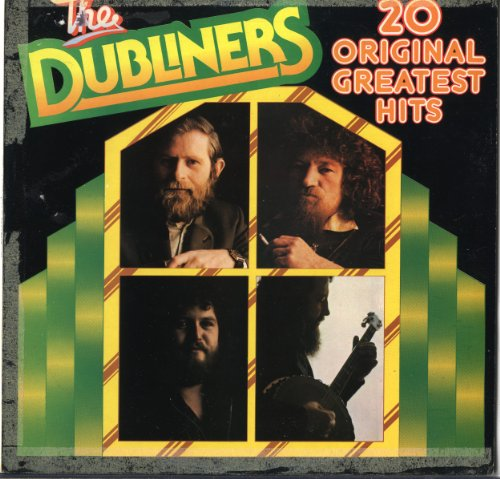
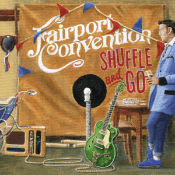
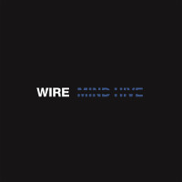

= Радио Аэростат. Глава XXXI
:toc: left

> link:aerostat.html[Главная страница]

== 27 октября 2019 - 26 апреля 2020

++++

++++

=== Beltane 2020 - Dubliners, 26 апреля 2020

<https://www.radiorus.ru/brand/57083/episode/2264822>

.Dubliners – Three Sea Captains

[%hardbreaks]
Dubliners – Preab San Ól
Pogues feat. Dubliners – The Irish Rover
Dubliners – The Wild Rover
Dubliners – Rocky Road To Dublin
Dubliners – The Foggy Dew
Dubliners  –  Seven Drunken Nights
Dubliners – The Black Velvet Band
Dubliners – Whiskey In The Jar
Dubliners – The Rising Of The Moon
Dubliners – I'm A Rover

=== Пасха. Размышление, 19 апреля 2020

<https://www.radiorus.ru/brand/57083/episode/2261307>

.REM – Everybody Hurts
image:REM/REM - Automatic For The People/cover.jpg[Automatic For The People,200,200,role="thumb left"]

[%hardbreaks]
Johann Sebastian Bach  – Suite No. 3 (Air)
Flook – Flatfish
Genesis – Entangled
Franz Shubert – Symphony No. 5: Allegro
Johann Sebastian Bach – Partita No. 1 in B flat major: Praeludium
Gilbert O'Sullivan – Why, Oh Why, Oh Why

++++
 
++++

=== Новости музыки, 12 апреля 2020

<https://www.radiorus.ru/brand/57083/episode/2261320>

.Fairport Convention – Linseed Memories

[%hardbreaks]
Orb – Hawk Kings  (Oseberg Buddhas Buttonhole)
Fountains Of Wayne – Mexican Wine
John Prine – Please Don’t Bury Me
Caribou – Magpie
Magnetic Fields – The Day The Politicians Died
Pigs Pigs Pigs Pigs Pigs Pigs Pigs – Reducer
Gang of Four – Damaged Goods
Jah 9 feat. Pressure Busspipe – You and I
The Used – Paradise Lost, A Poem By John Milton
Dixie Chicks - Gaslighter

=== Новые песни апреля, 5 апреля 2020

<https://www.radiorus.ru/brand/57083/episode/2258315>

.Tamikrest - Awnafin
image:Tamikrest - Tamotaït/cover.jpg[Tamotaït,200,200,role="thumb left"]

.Pretenders - The Buzz

.Nadia Reid - Other Side Of The Wheel

.Califone - Bandicoot

++++
 
++++

[%hardbreaks]
Killers - Caution
Of Montreal - Carmillas Of Love
Four Tet - Teenage Birdsong
Graham Gouldman - Its Not You Its Me
Real Estate - November
Аквариум - Месть Королевы Анны

++++
 
++++

=== Интуиция и сознание, 29 марта 2020

<https://www.radiorus.ru/brand/57083/episode/2257872>

[%hardbreaks]
Chieftains - An Ghaoth Aneas
Jimi Hendrix - My Friend
David Sylvian - Ballad Of A Deadman
Eno - Julie With...
Reicharrdt - Rondo In B-Flat Maj
Eno-Cale - Spinning Away
Shi Zhi-You - Chrysanthemum

=== Новые Имена, 22 марта 2020

<https://www.radiorus.ru/brand/57083/episode/2256007>

[%hardbreaks]
Ricky Nelson - Poor Little Fool
Go Betweens - Bye Bye Pride
John Sebastian - Rainbows All Over Your Blues
Shabaka Hutchins -
Ben Cocks -
George Formby - They Cant Fool Me
Genesis - Time Table
Genesis - I Cant Dance
Ming Flute Ensemble - The Song Of Four Seasons

=== То да се, 15 марта 2020

<https://www.radiorus.ru/brand/57083/episode/2254136>

[%hardbreaks]
Pajaro Sunrise - Ma's The Only Bird That Has No Fe
Clannad - Celtic Dream
McCoy Tyner - Days Of Wine And Roses
Skald - Fluga
Omnia - Fee Ra Huri
Pere Ubu - What I Heard On The Pop Radio
Mose Allison - I Don't Worry About A Thing
Loudon Wainwright - Ever Since The World Ended
Iggy Pop - If You're Going To The City
Joe Brown - There's No Pleasing You

=== Песни для богини, 8 марта 2020

<https://www.radiorus.ru/brand/57083/episode/2252005>

.Red Hot Chili Peppers - Someone
image:RED HOT CHILI PEPPERS/Red Hot Chilli Peppers - Unpublished Songs/cover.jpg[Unpublished Songs,200,200,role="thumb left"]

.Silly Wizard - Wi My Dog And Gun
image:SILLY WIZARD/Silly Wizard - So Many Partings/cover.jpg[So Many Partings,200,200,role="thumb left"]

.Robert Plant - link:ROBERT%20PLANT/Robert%20Plant%20-%20Sixty%20Six%20To%20Timbuktu%20(Disc%201)/lyrics/timbuktu.html#_if_it_s_really_got_to_be_this_way[If It Really Got To Be This Way]
image:ROBERT PLANT/Robert Plant - Sixty Six To Timbuktu (Disc 1)/cover.jpg[Sixty Six To Timbuktu (Disc 1),200,200,role="thumb left"]

.Jethro Tull - link:JETHRO%20TULL/1972%20%20Living%20In%20The%20Past/lyrics/past.html#_life_is_a_long_song[Life's A Long Song]
image:JETHRO TULL/1972  Living In The Past/cover.jpg[1972  Living In The Past,200,200,role="thumb left"]

++++
 
++++

[%hardbreaks]
Jeff Lynne - Blown Away
T.Rex - Diamond Meadows
Bryan Ferry - You Do Something To Me
Beatles - Its Only Love
Roy Orbison - Pretty One
Robert Palmer - You Blow Me Away
Beach Boys - God Only Knows

++++
 
++++

=== Новые песни в марте, 1 марта 2020

<https://www.radiorus.ru/brand/57083/episode/2250202>

.Wire - Cactused

[%hardbreaks]
Roger & Brian Eno - Blonde
Stephen Malkmus - Xian Man
James Taylor - As Easy As Falling Off The Log
Tame Impala - Lost In Yesterday
Marc Almond - Hollywood Forever
Patten - Threnody
Seth Lakeman - Pilgrim Brother
Guided By Voices - Heavy Like The World
Taylor Swift - Only The Young

=== Джордж и его друзья, 23 февраля 2020

<https://www.radiorus.ru/brand/57083/episode/2248524>

[%hardbreaks]
George Harrison - My Sweet Lord
George Harrison - That's What It Takes
Joe Brown - I'll See You In My Dreams
Remo Four - In The First Place
Splinter - China Light
Beatles - Sour Milk Sea
Neil Innes - Fortune Teller
George Harrison - Shanghai Surprise
Ravi Shankar - Vandanaa Trayee
George Harrison - Fish On The Sand

=== Nat King Cole, 16 февраля 2020

<https://www.radiorus.ru/brand/57083/episode/2247027>

[%hardbreaks]
Nat King Cole - Straighten Up And Fly Right
Nat King Cole - Route 66
Nat King Cole - Too Young
Nat King Cole - This Side Up
Nat King Cole - Sweet Lorraine
Nat King Cole - It's Only A Paper Moon
Nat King Cole - The Sand And The Sea
Nat King Cole - Ay Cosita Linda
Nat King Cole - Send For Me
Nat King Cole - Looking Back
Nat King Cole - Unforgettable
Nat King Cole - Night Lights

=== Новые песни февраля, 9 февраля 2020

<https://www.radiorus.ru/brand/57083/episode/2244573>

.Yann Tiersen - Tempelhof
image:YANN TIERSEN/2019 - All/folder.jpg[All,200,200,role="thumb left"]

[%hardbreaks]
1975 - Frail State Of Mind
Morrissey - Bobby Don't You Think They Know
Michael Stipe - Drive To The Ocean
Alogte Oho - Yu Ya Yumma
Jan Akkerman - Beyound The Horizon
Damian Marley - Reach Home Safe
Nada Surf - So Much Love

++++
 
++++

=== Химолк, 2 февраля 2020

<https://www.radiorus.ru/brand/57083/episode/2241484>

[%hardbreaks]
Daimh - 'S Trusaidh Mi Na Coilleagan
Dougie McLean - Caledonia
Hamish Napier - The Speyside Line
Steve Byrne - Leaving Angus In The Morning
Transports - The Black And Bitter Night
Tmsa Young Tour 2018 - Tae The Beggin'
Briege Murphy - The Verdant Braes Of Screen
Kinnaris Quintet - Nonna Pina

=== Новые имена, 26 января 2020

<https://www.radiorus.ru/brand/57083/episode/2237849>

[%hardbreaks]
Pied Pipers - In The Moon Mist
Ozzy Osbourne - Ordinary Man
Singing Nun - Dominique
Blind Willie Johnson - Nobody's Fault But Mine
Jaz Coleman - Aotes
Roy Acuff - Tennessee Waltz
Arp - Nzuku
Pablo Moses - Living In Babylon
Pajaro Sunrise - 086

=== The Cure, 19 января 2020

<https://www.radiorus.ru/brand/57083/episode/2237781>

[%hardbreaks]
The Cure - In Between Days
The Cure - Pictures Of You
The Cure - Boys Don't Cry
The Cure - A Short Term Effect
The Cure - Let's Go To Bed
The Cure - Just Like Heaven
The Cure - Love Song
The Cure - The Lovecats
The Cure - Close To Me
The Cure - The Caterpillar

=== Новые песни января, 12 января 2020

<https://www.radiorus.ru/brand/57083/episode/2236152%22>

[%hardbreaks]
Weezer - The End Of The Game
Bonnie Light Horseman - Jane Jane
Asgeir - Youth
Green Day - Father Of All
Sean O'Hagan - I Am Here
Сплин - Волшебная скрипка
Future Eve & Robert Wyatt - 04.06
Nicolas Godin - The Border
Аквариум - Досуги Буги
Bill Fay - Filled With Wonder Once Again
Divine Comedy - Don't Mention The War

=== Новогодние притчи, 5 января 2020

<https://www.radiorus.ru/brand/57083/episode/2234173>

.Elliot Smith - I Better Be Quiet Now
image:ELLIOTT SMITH/Elliott Smith 2000 - Figure 8/Folder.jpg[Figure 8,200,200,role="thumb left"]

.Bob Dylan - To Ramona

.Fairport Convention - Book Song
image:FAIRPORT CONVENTION/Fairport Convention-What We Did On Our Holidays-1969/cover.jpg[What We Did On Our Holidays-1969,200,200,role="thumb left"]

.Procol Harum - A Rum Tale
image:PROCOL HARUM/Procol Harum - Grand Hotel/images.jpg[Grand Hotel,200,200,role="thumb left"]

++++
 
++++

.Beck - Stratosphere

.Eric Clapton - River Runs Deep
image:Eric Clapton/2010 - Clapton/cover.jpg[Clapton,200,200,role="thumb left"]

[%hardbreaks]
Robin Williamson - The Scotch Cap - Scotland
Scaffold - Potato Clock
Rustavi - Djvarsa Shensa
Robin Laing - Lochanside

++++
 
++++

=== С Наступающим!, 29 декабря 2019

<https://www.radiorus.ru/brand/57083/episode/2233216>

.Jethro Tull - Jack In The Green
image:JETHRO TULL/1977  Songs From The Wood/cover.jpg[1977  Songs From The Wood,200,200,role="thumb left"]

.Tom Petty - For Real

.George Harrison - Flying Hour
image:GEORGE HARRISON/1995 - Pirate Songs/cover.jpg[Pirate Songs,200,200,role="thumb left"]

.Paul McCartney - Mr. Bellamy

++++
 
++++

[%hardbreaks]
Albinoni - Trumpet Concerto D-Min. Adagio
Jeff Lynne's ELO - On My Mind
S.E. Rogie - Clua Koonde
Donovan - Breezes Of Patchouli
Albion Christmas Band - Gloustershire Wassail
Annie Lennox - The First Noel

=== Рождество, 22 декабря 2019

<http://www.radiorus.ru/brand/57083/episode/2231513>

[%hardbreaks]
Nat King Cole - Adeste Fideles
Seamus Kennedy - Shepherds Arise
Charles Trenet - Chanson Pour Noel
Rustavi - Rachuli Alilo
Donavon Steele - Christmas In Jamaica
Arspop & Sergio Palumbo - Noel Malekramba Zogd-Y Noogo
Die Flippers - O Tannenbaum
Karl Lundeberg - Bombay Bells
Edith Piaf - Le Noel De La Rue
Kate Rusby - Hippo For Christmas
Skylark Vocal Ensemble - Jesus Refulsit Omnium
Mary Hopkin - Mary Had A Baby
Bing Crosby - White Christmas

=== Сила музыки, 15 декабря 2019

<http://www.radiorus.ru/brand/57083/episode/2229234>

[%hardbreaks]
Te Vaka - Taka Uo Pele
Nass El Ghiwane - Allah Ya Moulana
Dr. John - Same Old Same Old
Dr. John - Mama Roux
Strokes - You Only Live Once
Bing Crosby - True Love
Gene Austin - Ain't She Sweet
Beatles - Ain't She Sweet
Peter & Gordon - I Don't Want To See You Again
Albinoni - Trumpet Concerto In D-Min. Adagio
Lei Qiang - Liu Yang River
Bitw - Poen Tyfiant

=== Новые песни декабря, 8 декабря 2019

<http://www.radiorus.ru/brand/57083/episode/2226836>

[%hardbreaks]
Pet Shop Boys - Burning The Heather
Ozzy Osbourne - Under The Graveyard
Kate Rusby - Salute The Morn
Beck - Die Waiting
Junius Paul - Baker's Dozen
Omar Souleiman - Shi Tridin
Rod Stewart - I Don't Want To Talk About It
Paul McCartney - Home Tonight

=== То да сё #5, 1 декабря 2019

<http://www.radiorus.ru/brand/57083/episode/2223937>

[%hardbreaks]
High Llamas - Island People
J S Bach - Herz Und Mund
Elvis Costello - Accidents Will Happen
Electric Light Orchestra - Ordinary Dream
Cars - My Best Friend's Girl
Gia Kancheli - Theme From King Lear
Coldcut & On-U Sound - Divide And Rule
King Crimson - Level 5
Sergio Mendes - Night And Day

=== "From Out Of Nowhere", 24 ноября 2019

<http://www.radiorus.ru/brand/57083/episode/2222868>

[%hardbreaks]
Electric Light Orchestra - Help Yourself
Electric Light Orchestra - 10538 Overture (40th Anniversary Edition)
Electric Light Orchestra - Sci Fi Woman
Electric Light Orchestra - One More Time
Electric Light Orchestra - Songbird
Electric Light Orchestra - Time Of Our Life
Electric Light Orchestra - Goin' Out On Me
Electric Light Orchestra - All My Love
Electric Light Orchestra - Down Came The Rain
Electric Light Orchestra - Losing You
Electric Light Orchestra - From Out Of Nowhere

=== Новые песни ноября, 17 ноября 2019

<http://www.radiorus.ru/brand/57083/episode/2220587>

.Leonard Cohen - What Happened To The Heart
image:LEONARD COHEN/2016 Thanks for the Dance/cover.png[2016 Thanks for the Dance,200,200,role="thumb left"]

[%hardbreaks]
The New York Renaissance Band - Le Triory De Bretaigne
Ringo Starr - Grow Old With Me
Winged Victory For The Sullen - The Haunted V Pencil
Elbow - Dexter & Sinister
Battles - Juice B Crypts
Lightning Dust - A Pretty Picture
Richard Taha - Je Suis Africain
Penguin Cafe - Chinstrap
Angel Olson - New Love Cassette

=== Преобразование Тома Уэйтса, 10 ноября 2019

<http://www.radiorus.ru/brand/57083/episode/2217965>

.Tom Waits - The Piano Has Been Drinking
image:TOM WAITS/Tom Waits 1976 - Small Change/cover.jpg[Small Change,200,200,role="thumb left"]

.Tom Waits - Downtown
image:TOM WAITS/Tom Waits 1980 - Heartattack And Vine/cover.jpg[Heartattack And Vine,200,200,role="thumb left"]

.Tom Waits - link:TOM%20WAITS/Tom%20Waits%201987%20-%20Franks%20Wild%20Years/lyrics/franks.html#_more_than_rain[More Than Rain]
image:TOM WAITS/Tom Waits 1987 - Franks Wild Years/cover.jpg[Franks Wild Years,200,200,role="thumb left"]

.Tom Waits - Underground
image:TOM WAITS/Tom Waits 1983 - Swordfishtrombones/cover.jpg[Swordfishtrombones,200,200,role="thumb left"]

++++
 
++++

.Tom Waits - link:TOM%20WAITS/Tom%20Waits%201985%20-%20Rain%20Dogs%20-%20part%201/lyrics/raindogs.html#_anywhere_i_lay_my_head[Anywhere I Lay My Head]
image:TOM WAITS/Tom Waits 1985 - Rain Dogs - part 1/raindogs.png[Rain Dogs - part 1,200,200,role="thumb left"]

.Tom Waits - Downtown Train
image:TOM WAITS/1998 - Beautiful Maladies - part 1/cover.jpg[Beautiful Maladies - part 1,200,200,role="thumb left"]

.Tom Waits - A Good Man Is Hard To Find
image:TOM WAITS/2002 - Blood Money/cover.jpg[Blood Money,200,200,role="thumb left"]

[%hardbreaks]
Tom Waits - Saving All My Love For You
Tom Waits - Blow Wind Blow
Tom Waits - Big Black Maria

++++
 
++++

=== Samhain 2019, 3 ноября 2019

<https://www.radiorus.ru/brand/57083/episode/2216411>

[%hardbreaks]
Trials Of Cato - Tom Paine's Bones
Jim Moray - Bold Lowell
Lost Words - Blessing
Ye Vagabonds - On Yonder Hill
Julie Fowlis - Dh'eirich
Lankum - The Wild Rover
Manran - Thugainn
Rachel Newton - Here's My Heart Come Take It
Talisk - Cabot Trail

=== Новые имена, 27 октября 2019

<https://www.radiorus.ru/brand/57083/episode/2213755>

[%hardbreaks]
Matshikos - New South Africa
Chris Forsyth - Tomorrow Might As Well Be Today
Glen Hansard - Falling Slowly
Chihei Hatakeyama - Treads Echoing Far Away
Jim Croce - Time In A Bottle
Balkan Boom Box - Adir Adirim
Gilbert Becaud - Natalie
Вероника Долина - Любите Меня
Rakesh Chaurasia - Mane To Manavi Lejo
Supergrass - Alright

