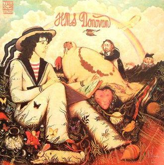
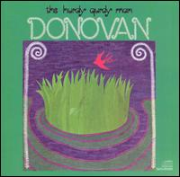
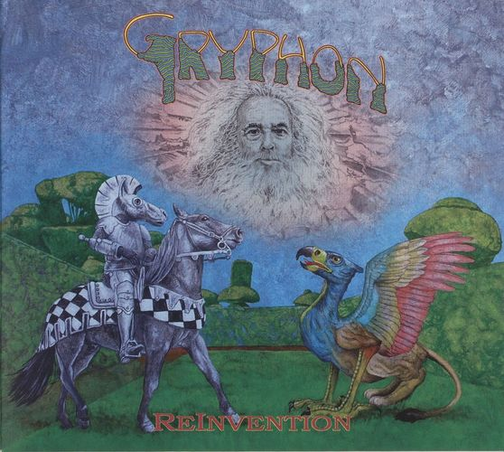
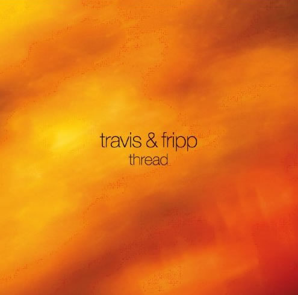
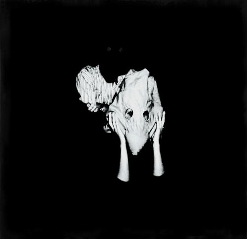
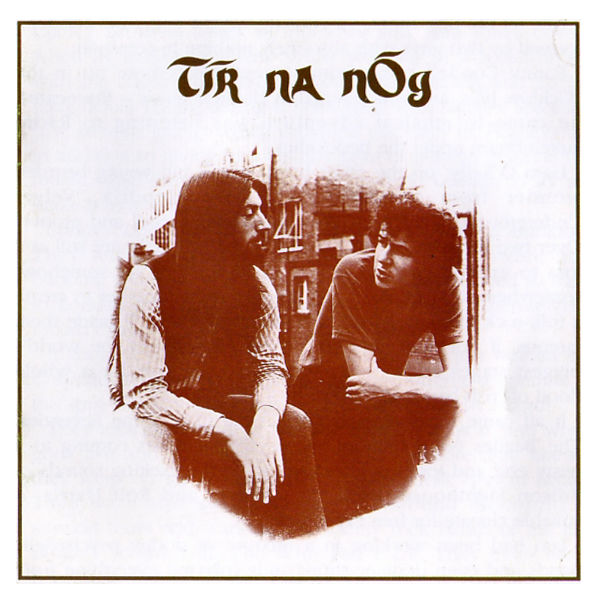
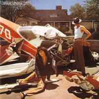
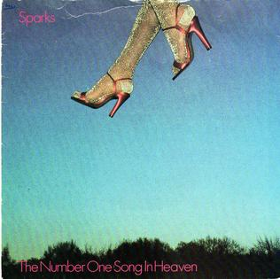
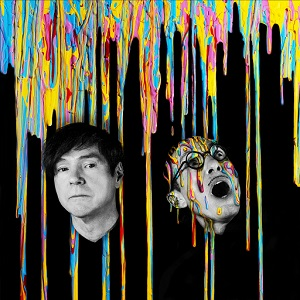

= Радио Аэростат. Глава XXXIII
:toc: left

> link:aerostat.html[<Home>]
> link:toc.html[<Contents>]
> link:lyrics.html[<Lyrics>]

== 8 ноября 2020 - 16 мая 2021

++++

++++

=== То да Сё: медитация, 16 мая 2021

<https://aerostatbg.ru/release/835>

.George Harrison - link:GEORGE%20HARRISON/George%20Harrison%20-%20Brainwashed/lyrics/brainwashed.html#_looking_for_my_life[Looking For My Life]
image:GEORGE HARRISON/George Harrison - Brainwashed/cover.jpg[Brainwashed,200,200,role="thumb left"]

.Beatles - link:THE%20BEATLES/1966%20-%20Revolver/lyrics/revolver.html#_i_want_to_tell_you[I Want To Tell You]
image:THE BEATLES/1966 - Revolver/cover.jpg[Revolver,200,200,role="thumb left"]

.Pugwash – Poles Together

.Planxty – Kellswater

++++
 
++++

.Roger Eno – Silk
image:ROGER ENO/2017 - This Floating World/cover.jpg[This Floating World,200,200,role="thumb left"]

.Loudon Wainwright III – My Blue Heaven

[%hardbreaks]
Stackridge – Percy The Penguin
Marvin Gaye – Mercy, Mercy Me (The Ecology)
Rakesh Chaurasia – Asatyo Mahethi
Pink Floyd – If
    
++++
 
++++

=== Новые Песни Мая, 9 мая 2021

<https://aerostatbg.ru/release/834>

.Fratellis – Lay Your Body Down

.Del Amitri - link:Del%20Amitri/2021%20-%20Fatal%20Mistakes/lyrics/fatal.html#_close_your_eyes_and_think_of_england[Close Your Eyes And Think of England]
image:Del Amitri/2021 - Fatal Mistakes/Front.jpg[Fatal Mistakes,200,200,role="thumb left"]

[%hardbreaks]
Tom Morello Feat. Serj Tankian & Gang of Four – Natural's Not in It
Grasscut – Return Of The Sun
Nils Frahm – Because This Must Be
Chemical Brothers – Darkness That You Fear
Denez Prigent – C’hwervoni
Billie Eilish – Therefore I Am
Pino Palladino & Blake Mills – Notes With Attachments
The Who – Inside Outside
Paul McCartney – When Winter Comes (Anderson .Paak Remix)
    
++++
 
++++

=== Праздник Весны, 2 мая 2021

<https://aerostatbg.ru/release/833>

.Electric Light Orchestra – Big Wheels
image:Electric Light Orchestra/10_Out Of The Blue (1977)/cover.jpg[10_Out Of The Blue (1977),200,200,role="thumb left"]

.Johann Sebastian Bach – Orchestral Suite No.1 in C major: 1.Ouverture
image:BACH/BWV 1066~1069, 1060, 1043 - Orchestral Suites/cover.jpg[Orchestral Suites,200,200,role="thumb left"]

[%hardbreaks]
Claude Debussy – Clair de Lune
Gus Teja – Jepun Putih
Van Morrison – Beautiful Vision
Hamish Napier – The Pioneer
Silly Wizard – Hame, Hame, Hame / Tha Mi Sgìth
Pauline Scanlon – The Old Churchyard

++++
 
++++

=== То Да Сё №14, 25 апреля 2021

<https://aerostatbg.ru/release/832>

.Donovan - link:DONOVAN/Donovan%20-%20HMS%20Donovan/lyrics/hms.html#_wynken_blynken_and_nod[Wynken, Blynken And Nod]

.Paul Simon - link:PAUL%20SIMON/Paul%20Simon%20-%20Songwriter/lyrics/songwriter.html#_american_tune[American Tune]
image:PAUL SIMON/Paul Simon - Songwriter/cover.jpg[Songwriter,200,200,role="thumb left"]

.Robert Fripp – Music For Quiet Moments 47 - Evocation
image:KING CRIMSON/Robert Fripp - Music For Quiet Moments Vol. 1-52/cover.jpg[Music For Quiet Moments Vol. 1-52,200,200,role="thumb left"]

[%hardbreaks]
Franz Schubert – Octet in F major, D. 803: II. Adagio
Mick Jagger feat. Dave Grohl – Easy Sleazy
Robert Harrison – Watching The Kid Come Back
Frank Sinatra & Tommy Dorsey – Trade Winds
Beatles – Not A Second Time
Robert Palmer – Keep In Touch
Sparks – Reinforcements
    
++++
 
++++

=== Новые А2, 18 апреля 2021

<https://aerostatbg.ru/release/831>

.Flyte – I've Got A Girl

[%hardbreaks]
Royal Blood – Trouble's Coming
Rhiannon Giddens – Waterbound
William Loveday Intention – To Sing The Blues You Gotta Be Blue
Clark – Forever Chemicals
Matt Sweeney & Bonnie 'Prince' Billy – My Blue Suit
Psychedelic Porn Crumpets – Mr. Prism
King Gizzard & The Lizard Wizard – O.N.E.
Coral – Faceless Angel
Coral – Memory

++++
 
++++

=== Бинг Кросби, 11 апреля 2021

<https://aerostatbg.ru/release/830>

[%hardbreaks]
Bing Crosby – Embraceable You
Bing Crosby – With Every Breath I Take
Bing Crosby – Swinging On A Star
Bing Crosby – Where The Blue Of The Night (Meets The Gold Of The Day)
Bing Crosby – Be Careful, It's My Heart
Bing Crosby – You Keep Coming Back Like A Song
Bing Crosby – I've Got My Captain Working For Me Now
Bing Crosby & Andrews Sisters – Don't Fence Me In
Bing Crosby & Louis Armstrong And His Band – Rocky Mountain Moon
Bing Crosby – White Christmas
Bing Crosby & Grace Kelly – True Love
Bing Crosby – I Whistle A Happy Tune
    
++++
 
++++

=== Новые Песни Апреля, 4 апреля 2021

<https://aerostatbg.ru/release/829>

.Nick Cave & Warren Ellis – Albuquerque

[%hardbreaks]
St. Vincent – Pay Your Way In Pain
Stevie Wonder feat. Gary Clark Jr. – Where Is Our Love Song
Gary Numan – Intruder
Field Music – Orion From The Street
Greta Van Fleet – Heat Above
Peggy Seeger – The Invisible Woman
Edward II – Cordelia Brown
Van Morrison – Only A Song
    
++++
 
++++

=== То Да Сё №13, 28 марта 2021

<https://aerostatbg.ru/release/828>

.Tom Waits – Back In The Crowd

.David Sylvian – Orpheus
image:David Sylvian/1987 - Secrets Of The Beehive/Folder.jpg[Secrets Of The Beehive,200,200,role="thumb left"]

[%hardbreaks]
Joe Brown – Tickle My Heart
Igorrr – Downgrade Desert
Herman's Hermits – Mrs. Brown, You've Got a Lovely Daughter
Al Bowlly & Roy Fox Band – Lullaby Of The Leaves
Rita Lee – Lucy In The Sky With Diamonds
Rolling Stones – Blinded By Love
Ringo Starr – Waiting For The Tide To Turn
Elvis Presley – Sound Advice

++++
 
++++

=== Чай, 21 марта 2021

<https://aerostatbg.ru/release/827>

.Donovan – Teas

.Gryphon – A Futuristic Auntyquarian

.Billy Connolly & Gerry Rafferty – Rick Rack
image:Billy Connolly & Gerry Rafferty - Best Of The Humblebums/cover.jpg[Best Of The Humblebums,200,200,role="thumb left"]

.Kinks – Afternoon Tea
image:Kinks/1967 - Something Else/Folder.jpg[Something Else,200,200,role="thumb left"]

++++
 
++++

.Ming Flute Ensemble – The Maidens Of The Tea Mountain

.Leon Redbone – If You Knew How I Love You
image:LEON REDBONE/2001 - Any Time/cover.jpg[Any Time,200,200,role="thumb left"]

.Gus Teja – Unify

[%hardbreaks]

Mills Brothers – Chinatown, My Chinatown
Yamato Ensemble – Futatsu no Den-en-shi: No. 1
Giuseppe Cambini – Wind Quintet No. 2 in D minor: II. Larghetto sostenuto ma con moto
Loudon Wainwright III – Where The Blue Of The Night (Meets The Gold Of The Day)

++++
 
++++

=== Новые Имена, 14 марта 2021

<https://aerostatbg.ru/release/826>

[%hardbreaks]
Dietrich Buxtehude – Gelobet seist du, Jesu Christ (BuxWV 189)
The Weather Station – Robber
Bessie Smith – Nobody Knows You When You're Down And Out
Eluveitie – Inis Mona
Cowboy Junkies – 'Cause Cheap Is How I Feel
Moğollar – Keyfim Yerinde
Teleman – Bone China Face
Sturle Dagsland – Dreaming
Little Feat – Spanish Moon
Jack Hylton & His Orchestra – Button Up Your Overcoat
    
++++
 
++++
    
=== Новые песни 7-го марта, 7 марта 2021

<https://aerostatbg.ru/release/825>

.Leonard Cohen – I'm Your Man
image:LEONARD COHEN/08-Im Your Man (1988)/cover.jpg[Im Your Man (1988),200,200,role="thumb left"]

[%hardbreaks]
Serj Tankian – Elasticity
Lana Del Rey – Chemtrails Over The Country Club
Mouse On Mars – Youmachine
Brian Finnegan – Equator Light
Seasick Steve – Dusty Man
Richard Barbieri – Serpentine
Alice Cooper – Detroit City 2020
Foo Fighters – Waiting On A War
Jimmy Messene & Al Bowlly – Make Believe Island / The Woodpecker Song
    
++++
 
++++

=== Эгрегор или Душа Группы, 28 февраля 2021

<https://aerostatbg.ru/release/824>

.Grateful Dead – Candyman
image:GRATEFUL DEAD/1970 - American Beauty/Folder.jpg[American Beauty,200,200,role="thumb left"]

.King Crimson – In The Wake Of Poseidon

.Gryphon – The Unquiet Grave
image:Gryphon/1973/front.jpg[1973,200,200,role="thumb left"]

.Laraaji – Enthusiasm

++++
 
++++

[%hardbreaks]
Franz Joseph Haydn – Symphony No. 14 in A: III. Menuetto & Trio, Allegretto
Beatles – All Together Now
Black Sabbath – Snowblind

++++
 
++++

=== Прогрессивный рок – 2021, 21 февраля 2021

<https://aerostatbg.ru/release/823>

.Gryphon – Rhubarb Crumhorn

[%hardbreaks]
Jethro Tull – Mayhem Maybe
Liquid Tension Experiment – The Passage of Time
Wardruna – Skugge
Teramaze – Lake 401
Sukekiyo – Waizatsu
Esthesis – No Soul To Sell
Foi – Indigo Moon
Big Big Train – Theodora In Green And Gold

++++
 
++++

=== То Да Сё..., 14 февраля 2021

<https://aerostatbg.ru/release/822>

.Pugwash - link:PUGWASH/2011%20-%20The%20Olympus%20Sound/lyrics/olympus.html#_be_my_friend_awhile[Be My Friend Awhile]
image:PUGWASH/2011 - The Olympus Sound/cover.jpg[The Olympus Sound,200,200,role="thumb left"]

.Roger Eno – The Last Day Of May
image:ROGER ENO/2017 - This Floating World/cover.jpg[This Floating World,200,200,role="thumb left"]

.Djivan Gasparyan – Delacroix

[%hardbreaks]
Buffalo Springfield – A Child's Claim To Fame
Langhorne Slim – Mighty Soul
Bryan Ferry – Shakespeare's Sonnet 18
Valravn – Kelling
Monkees – Saturday's Child
Jónsi feat. Elizabeth Fraser – Cannibal
Johann Sebastian Bach – Suite No. 3 in D major: Air
    
++++
 
++++

=== Новая Му февраля..., 7 февраля 2021

<https://aerostatbg.ru/release/821>

[%hardbreaks]
Lael Neale – Every Stars Shivers In The Dark
Viagra Boys – Ain't Nice
Alostmen feat. Villy – Teach Me
Black Country, New Road – Science Fair
John Blek – Right Moves
Notwist – Where You Find Me
Jane Birkin – Les Jeux Interdits
Arab Strap – Compersion Pt. 1
Goat Girl – The Crack

++++
 
++++

=== Imbolc – День Святой Бригитты, 31 января 2021

<https://aerostatbg.ru/release/820>

.Van Morrison – Crazy Love

[%hardbreaks]
Andy M. Stewart & Manus Lunny – Bríd Óg Ní Mháille (Bridgit O'Malley)
Lumiere – Bó Na Leathadhairce
Dick Gaughan – Song For Ireland
Lúnasa – O'Carolan's Welcome / Rolling In The Barrel
Amazing Blondel – Dolor Dulcis (Sweet Sorrow)
Sweeney's Men – Willy O'Winsbury
Trail West – Air An Traigh
Chieftains – Air-You're The One
    
++++
 
++++

=== Новые песни января и... вообще, 24 января 2021

<https://aerostatbg.ru/release/819>

.Ed Sheeran – Afterglow

[%hardbreaks]
Jay Jay Johanson – Why Wait Until Tomorrow
Elvin Bishop & Charlie Musselwhite – If I Should Have Bad Luck
Sleaford Mods – Glimpses
Lo’Jo – Transe de papier
Senyawa – Hakikat Kabut
Taylor Swift – Closure
Django Django – Glowing In The Dark
Pauline Anna Strom – Marking Time
Japan – I Second That Emotion
Calexico – Peace Of Mind

++++
 
++++

=== Лаудон Уэйнрайт 3-й, 17 января 2021

<https://aerostatbg.ru/release/818>

.Loudon Wainwright III – Heart And Soul

.Loudon Wainwright III – Daughter

[%hardbreaks]
Loudon Wainwright III – Depression Blues
Loudon Wainwright III – You Can't Fail Me Now
Loudon Wainwright III – I'll Be Killing You This Christmas
Loudon Wainwright III – Rosin The Bow
Loudon Wainwright III – In A Hurry
Loudon Wainwright III – The Little Things In Life
Loudon Wainwright III – More I Cannot Wish You
Loudon Wainwright III – I Thought About You
Loudon Wainwright III – A Perfect Day

++++
 
++++

=== «ТОР», 1 января 2021

<https://aerostatbg.ru/release/816>

[%hardbreaks]
Аквариум – Палёное виски и толчёный мел
Аквариум – Бой-баба
Аквариум – Для тех, кто влюблён
Аквариум – Bernie And Ciaran
Аквариум – Месть королевы Анны
Аквариум – Весть с Елисейских полей
Аквариум – Фавн
Аквариум – Не трать время

++++
 
++++

=== Cвобода, поэзия..., 27 декабря 2020

<https://aerostatbg.ru/release/815>

.Robert Wyatt – Sight Of The Wind

.Dead Can Dance – The Host Of Seraphim

.Beatles – All You Need Is Love
image:THE BEATLES/1967b - Magical Mystery Tour/cover.jpg[Magical Mystery Tour,200,200,role="thumb left"]

.Leonard Cohen - link:LEONARD%20COHEN/Leonard%20Cohen%20-%20Ten%20New%20Songs/lyrics/ten.html#_boogie_street[Boogie Street]
image:LEONARD COHEN/Leonard Cohen - Ten New Songs/cover.jpg[Ten New Songs,200,200,role="thumb left"]

++++
 
++++

.Robert Fripp – Pastorale

.Doors – Riders On The Storm

.Who – Cousin Kevin
image:The Who/Tommy/cover.jpg[Tommy,200,200,role="thumb left"]

[%hardbreaks]
Charles Aznavour – La bohème

++++
 
++++

=== McCartney III, 20 декабря 2020

<https://aerostatbg.ru/release/814>

.Paul McCartney – Find My Way

[%hardbreaks]
Paul McCartney – The Kiss Of Venus
Paul McCartney – Lavatory Lil
Paul McCartney – Women And Wives
Paul McCartney – Deep Deep Feeling
Paul McCartney – Slidin'
Paul McCartney – Deep Down
Paul McCartney – Winter Bird / When Winter Comes
Paul McCartney – Seize The Day

++++
 
++++
       
=== О духовности, 13 декабря 2020

<https://aerostatbg.ru/release/813>

.REM – Sing For The Submarine

.Simon & Garfunkel – Bridge Over Troubled Water
image:SIMON & GARFUNKEL/Simon & Garfunkel - Bridge Over Troubled Water/cover.jpg[Bridge Over Troubled Water,200,200,role="thumb left"]

.Ravi Shankar & George Harrison – Asato Maa

.Sigur Rós – Bláþráður

++++
 
++++

[%hardbreaks]
Аквариум – Духовные люди
Incredible String Band – Here Till Here Is There
Nick Drake – Voices
Jimi Hendrix – Castles Made Of Sand
Sun Ra – Tiny Pyramids
Ravi Shankar & George Harrison – Prabhujee

++++
 
++++
   
=== Предрождественская, 6 декабря 2020

<https://aerostatbg.ru/release/812>

[%hardbreaks]
DeeWunn & Don Elektron – Bubble And Bunx
Albion Christmas Band – Hark! The Herald Angel Sing
Annie Lennox – Lullay Lullay (The Coventry Carol)
Jane Birkin & Manu Chao – Te souviens-tu ?
Sinéad O'Connor – I Believe In You
Ringo Starr – Dear Santa
Lucksmiths – The Cassingle Revival
Arlo Guthrie – Hobo's Lullaby
Rod Stewart – Auld Lang Syne
Bing Crosby – White Christmas

++++
 
++++
    
=== Новые Песни Декабря, 29 ноября 2020

<https://aerostatbg.ru/release/811>

.Beck & St. Vincent – Uneventful Days (St. Vincent Remix)
image:BECK/2019 - Hyperspace/cover.png[Hyperspace,200,200,role="thumb left"]

[%hardbreaks]
William Elliott Whitmore – Black Iowa Dirt
System Of A Down – Genocidal Humanoidz
Shooglenifty – Caravan Up North
Kelley Stoltz – Some Other Time
Roedelius – Absolut
Jack Name – A Moving-on Blues
AC/DC – Kick You When You're Down
Ustad Saami – Prayer For A Saint
King Gizzard & The Lizard Wizard – Intrasport
Sturgill Simpson – Turtles All The Way Down

++++
 
++++
    
=== То Да Сё №11, 22 ноября 2020

<https://aerostatbg.ru/release/810>

.Tír na nÓg – Dance Of Years

.Grateful Dead – Althea

[%hardbreaks]
System Of A Down – Protect The Land
Joni Mitchell – Born To Take The Highway
Tony Scott – Satori (Enlightenment)
Cocteau Twins – Oil Of Angels
Van Morrison – Snow In San Anselmo
Hollies – Oriental Sadness
    
++++
 
++++

=== The Sparks, 15 ноября 2020

<https://aerostatbg.ru/release/809>

.Sparks – Amateur Hour
image:SPARKS/1974 - Kimono My House/Folder.jpg[Kimono My House,200,200,role="thumb left"]

.Sparks – Under The Table With Her

.Sparks – The Number One Song In Heaven

.Sparks – This Town Ain't Big Enough For The Both Of Us

++++
 
++++

.Sparks - link:SPARKS/2002%20-%20Lil%20Beethoven/lyrics/lil.html#_the_rhythm_thief[The Rhythm Thief]
image:SPARKS/2002 - Lil Beethoven/cover.jpg[Lil Beethoven,200,200,role="thumb left"]

.Sparks - link:SPARKS/Sparks%202017%20-%20Hippopotamus/lyrics/hippo.html#_the_amazing_mr_repeat[The Amazing Mr. Repeat]
image:SPARKS/Sparks 2017 - Hippopotamus/cover.jpg[Hippopotamus,200,200,role="thumb left"]

.Sparks – Onomato Pia

[%hardbreaks]
Sparks – When Do I Get To Sing 'My Way'
Sparks – Angst In My Pants
Sparks – Falling In Love With Myself Again

++++
 
++++

=== Новые Песни Ноября, 8 ноября 2020

<https://aerostatbg.ru/release/808>

.Loudon Wainwright III – How I Love You (I'm Tellin' the Birds, Tellin' the Bees)

[%hardbreaks]
Gorillaz feat. Peter Hook & Georgia – Aries
Working Men’s Club – A.A.A.A.
Autechre – gr4
Garcia Peoples – Gliding Through
AC/DC – Shot In The Dark
Juliette Gréco – Sous le ciel de Paris
Gratien Midonet – Ven en lévé
Ólafur Arnalds feat. Bonobo – Loom
Аквариум – Камчатка
   
---

> link:aerostat.html[<Home>]
> link:toc.html[<Contents>]
> link:lyrics.html[<Lyrics>]
