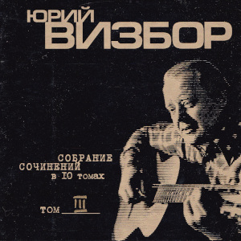

= Собрание сочинений. Том 3. Апрельская прогулка
Юрий Визбор
:toc:

С сайта: http://www.bards.ru/archives/author.php?id=67

== Наполним музыкой сердца

Посвящается А.Межирову

> Какая музыка была, +
> Какая музыка звучала!
-- (А.Межиров "Музыка")
                        
[verse,1975]
____
Наполним музыкой сердца!
Устроим праздники из буден.
Своих мучителей забудем,
Вот сквер - пройдемся ж до конца.
Найдем любимейшую дверь,
За ней - ряд кресел золоченых,
Куда с восторгом увлеченных,
Внесем мы тихий груз своих потерь,
Внесем мы тихий груз своих потерь.

"Какая музыка была,
Какая музыка звучала!"
Она совсем не поучала,
А лишь тихонечно звала.
Звала добро считать добром,
И хлеб считать благодеяньем,
Страданье вылечить страданьем,
А душу греть вином или огнем.

И светел полуночный зал.
Нас гений издали заметил,
И, разглядев, кивком ответил,
И даль иную показал.
Там было очень хорошо
И все вселяло там надежды,
Что сменит жизнь свои одежды,
Ля-ля-ля-ля, ля-ля-ля-ля-ля-ля.

Наполним музыкой сердца...
____

== Три сосны

[verse,1972]
____
Ах, какая пропажа - пропала зима!
Но не гнаться ж за нею на север.
Умирают снега, воды сходят с ума,
И апрель свои песни посеял,
Ну  да что до меня? - это мне не дано.
Не дари мне ни осень, ни лето,
Подари мне февраль - три сосны под окном
И закат, задуваемый ветром.

Полоса по лесам золотая легла,
Ветер в двери скребет, как бродяга,
Я тихонечко сяду у края стола,
Никому ни в надежду, ни в тягость.
Все глядят на тебя - я гляжу на одно,
Как вдали проплывает корветом
Мой веселый февраль - три сосны под окном
И закат, задуваемый ветром.

Ах, как мало я сделал на этой земле!
Не крещен, не учен, не натружен,
Не похож на грозу, не подобен скале,
Только детям  да матери нужен,
Ну  да что же вы все про кино, про кино -
Жизнь не кончена, песня не спета,
Вот вам, братцы, февраль - три сосны под окном
И закат, задуваемый ветром.

Поклянусь  хоть на библии, хоть на кресте,
Что родился не за пустяками:
То ль писать мне Христа на суровом холсте,
То ль волшебный розыскивать камень.
Дорогие мои, не виновно вино,
На огонь не наложено вето,
А виновен февраль - три сосны под окном
И закат, задуваемый ветром.

Ты глядишь на меня, будто ищешь чего,
Ты хватаешь за слово любое,
Словно хочешь найти средь пути моего
То, что ты называешь любовью,
Но в душе это дело заметено,
Словно крик по ночи безответно,
Там бушует февраль - три сосны под окном
И закат, задуваемый ветром.
____

== Деревня Новлянки

[verse,1976]
____
Давайте сюда коня! Бутылки сюда, баранки!
Везите, друзья, меня в деревню мою - Новлянки!
Везите, друзья, меня в деревню мою - Новлянки!

В Новлянках умы крепки. В Новлянках дымы да санки,
Да в валенках старики, да слово само - Новлянки.
Да в валенках старики, да слово само - Новлянки.

Там кот сидит у окна и щурится на проселок.
Там волчья висит луна над шлемами серых елок.
Там волчья висит луна над шлемами серых елок.

Там подлости никакой, там жисть - картофь да поленья,
А если уж бьют - то рукой, а вовсе не заявленьем.
А если уж бьют - то рукой, а вовсе не заявленьем.

Там в рамочке на стене висит капитан запаса.
И "Боинг" шумит в окне компании, брат, "Люфтганза".
И "Боинг" шумит в окне компании, брат, "Люфтганза".

Пока серебры снега под черным лучом лунищи,
Дорога нам дорога в родимые пепелища.
Дорога нам дорога в родимые пепелища.

Везите ж меня туда, где вечный покой обещан -
Подальше от нарсуда, подальше от черных женщин.
Подальше от нарсуда, подальше от черных женщин.

За что же меня в Москву, в ущелье ее, в гулянки?
Мне чудится наяву деревня моя - Новлянки.
Мне чудится наяву деревня моя - Новлянки.
____

== Апрельская прогулка

[verse,1978]
____
Есть тайная печаль
В весне первоначальной,
Когда последний снег -
Нам несказанно жаль,
Когда в пустых лесах    
Негромко и случайно     
Из дальнего окна        
Доносится рояль.        

И ветер там вершит
Круженье занавески,
Там от движенья нот
Чуть звякает хрусталь.
Там девочка моя,        
Еще ничья невеста,      
Играет, чтоб весну      
Сопровождал рояль.      

И будет счастье нам,
Пока легко и смело
Та девочка творит
Над миром пастораль,
Пока по всей земле,     
Во все ее пределы       
Из дальнего окна        
Доносится рояль.        
____

== Синий перекресток

[verse,1963]
____
Ищи меня сегодня среди морских дорог:
За островами, за большой водою,
За синим перекрестком двенадцати ветров,
За самой ненаглядною зарею.
За синим перекрестком двенадцати ветров,
За самой ненаглядною зарею.

Здесь горы не снимают снегов седых одежд,
А ветер лишь неверности порука.
Я здесь построил остров - страну сплошных надежд  
С проливами "Свиданье" и "Разлука".               

Не присылай мне писем - сама себя пришли,
Не слушаяся тонкого совета.
На нежных побережьях кочующей земли               
Который год все ждут тебя рассветы.               

Пока качает полночь усталый материк,
Я солнце собираю на дорогах,
Потом его увозят на флагах корабли,               
Сгрузив туман у моего порога.                     

Туман плывет над морем, в душе моей туман.
Все кажется так просто и непросто.
Держись, моя столица - зеленый океан,             
Двенадцать ветров, синий перекресток.             
____

== Многоголосье

[verse,1978]
____
О, мой пресветлый отчий край!
О, голоса его и звоны!
В какую высь не залетай,
Все над тобой его иконы.

И происходит торжество
В его лесах, в его колосьях.
Мне вечно слышится его
Многоголосье, многоголосье.

Какой покой в его лесах,
Как в них черны и влажны реки!
Какие храмы в небесах
Над ним возведены навеки!

Я - как скрещенье многих дней,
И слышу я в лугах росистых
И голоса моих друзей,
И голоса с небес российских.
____

== Республика Тува

[verse,1969]
____
Вот и все, заправлены моторы,
Внесена пятерка за багаж.
Впереди лежит тот край, который,
Если взял, то больше не отдашь.

А республика Тува живет без публики,
По лесам-то, по лесам-то, тишина,
По полянам ходят мишки - ушки круглые
И летающих тарелок до хрена.

Закури, но погаси окурок,
Тут тебе не площадь Ногина,
Лето сбросило соболью шкуру,
Рыжиной тайга заражена.
____

== Если я заболею

ст. Ярослава Смелякова

[verse,1960]
____
Если я заболею,
К врачам обращаться не стану,
Обращусь я к друзьям –
Не сочтите, что это в бреду:
Постелите мне степь,
Занавесьте мне окна туманом,
В изголовье поставьте
Упавшую с неба звезду!

Я шагал напролом,
Никогда я не слыл недотрогой.
Если ранят меня
В справедливых тяжелых боях,
Забинтуйте мне голову
Русской лесною дорогой
И укройте меня
Одеялом в осенних цветах.

От морей и от гор
Веет свежестью, веет простором.
Раз посмотришь – почувствуешь:
Вечно, ребята, живём!
Не больничным от вас
Ухожу я, друзья, коридором,
Ухожу я, товарищи,
Сказочным Млечным путём.
____

== Спутники

[verse,1981]
____
По прекрасному Чюрленису,
Иногда - по Остроухову,
Мчались мы с одной знакомою
На машине "Жигули".
Заезжали в Левитана мы,
В октябри его пожухлые,
Направлялись мы к Волошину,
Заправлялись как могли.

По республике Цветаевой,
Через область Заболоцкого
С нами шла высоковольтная
Окуджавская струна.
Поднимались даже в горы мы,
Покидая землю плоскую,
Между пиком барда Пушкина
И вершиной Пастернак.

Некто Вольфганг Амадеевич
Слал нам ноты из-за облака,
Друг наш Николай Васильевич
Улыбался сквозь туман.
Слава Богу, мы оставили
Топь софроновскую побоку,
И заезжий двор Ошанина,
И пустыню Налбалдян.

Между Грином и Волошиным
На последнем переходе мы
Возвели шатер брезентовый,
Осветив его костром.
И собрали мы сторонников
Рифмы, кисти и мелодии,
И, представьте, тесно не было
Нам за крошечным столом!

По прекрасному Чюрленису,
Иногда - по Остроухову...
____

== Курильские острова

[verse,1960]
____
Замотало нас невозможно,
Закрутило туда и сюда,
Оттоптали в ночи таежной
Забайкальские поезда.

А вообще-то все трын-трава,
Здесь Курильские острова,
Что являет прекрасный вид
Бессердечности и любви.

Здесь дымит вулкан Тятя-Яма.
Только черти и дураки
Не готовятся постоянно
Каждый день "отбросить коньки".

Над вошедшим в гавань "Японцем",
Пароходный несется крик,
Утро нас награждает солнцем,
Самолетами - материк.

Но сюда неизбежно манит
Это буйствие всех стихий,
И отсюда бредут в тумане
Наши письма и наши стихи.

Здесь не Рио и не Москва,
Здесь Курильские острова,
Что являют прекрасный вид
Бессердечности и любви.
____

== Вересковый куст

[verse,1972]
____
Вот хорошо, и тихо, и просторно,
Ни городов, ни шума, ни звонков.
Ветру открыты все четыре стороны,
Мачта сосны и парус облаков.

Вересковый куст, словно лодка,
И далеко-далеко земля.
Вересковый куст, словно лодка,
А в лодке ни весел, ни руля.

Из под сырой травы желтеет осень,
Вешнее солнце щиплет щеки нам.
Ты говоришь: "Куда это нас сносит?
Я несказанно так удивлена..."

И торопливых слов не понимая,
Руки раскинув в небе пустом,
Вся ты плывешь в синей воде мая
Брошенным в реку белым крестом.

Версты любви, их вдоволь  было, вдоволь,
За горизонт ушли, за облака,
Только вот жалко - вереск тот медовый,
Да и, пожалуй, тех мест не разыскать.
____

== Песня об осени

[verse,1970]
____
Лето село в зарю, за сентябрь, за погоду,
Лето пало на юг, словно кануло в воду,
От него лишь следы для тебя, дорогая,
Фиолетовый дым, в парках листья сжигают.

Вороха те легки золотых эполетов,
И горят, как стихи позабытых поэтов,
Бессердечен и юн, ветер с севера дует,
То ль сгребает июнь, то ли август скирдует.

Словно два журавля по веселому морю,
Словно два косоря по вечернему полю,
Мы по лету прошли, только губы горели,
И под нами неслись, словно звезды, недели.

Солнца желтый моток, лето плыло неярко,
Словно синий платок над зеленой байдаркой.
И леса те пусты, все пусты, дорогая,
И горят не листы - наше лето сжигают.
____

== Какие слова у дождя

[verse,1974]
____
Какие слова у дождя? - Никаких...
Он тихо на старую землю ложится,
И вот на земле уж ничто не пылится,
Ничто не болит и не давят долги.

Какие слова у меня? - Тишина...
Немая луна всю пустыню заполнит,
И так сторожит эту белую полночь,
Что только тобой эта полночь полна.

Какие слова у тебя? - Красота...
Ты белое платье по миру проносишь,
И запахи ливней в ладонях приносишь,
И льет на пустыни мои доброта.

Какие слова у дорог? - Торжество...
Мы мчимся по ливням, любовь постигая,
И редкие звезды сквозь тучи мигают,
И капли дрожат на стекле ветровом.

Какие слова у дождя? - Никаких...
Он тихо на старую землю ложится,
И вот на земле уж ничто не пылится,
Ничто не болит и не давят долги.
____

== А зима будет большая

[verse,1967]
____
А зима будет большая,
Вот, гляди-ка, за рекой
Осень тихо умирает,
Машет желтою рукой.

Плачут мокрые осины,
Плачет дедушка Арбат,
Плачет синяя Россия,
Превратившись в листопад.

И, сугробы сокрушая,
Солнце брызнет по весне,
А зима будет большая -
Только сумерки да снег.
____

== Я гляжу сквозь тебя

[verse,1966]
____
Я гляжу сквозь тебя тебя,
Вижу синие горы,
Сквозь глаза, сквозь глаза -
На пространство земли,
Где летят журавли,
Где лежат командоры,
Где боками стучат
О причал корабли.

Гребни каменных гор
Машут сорванным снегом,
В мачтах молний встает,
Как дредноут, гроза.
И плывут облака
По глазам, как по небу,
И стекает луны золотая слеза.

Я иду сквозь тайгу
По весне белокрылой,
По колено в воде,
По разливам бреду...
Я иду сквозь тебя,
Пока есть мои силы,
Даже если уже никуда не иду.
____

== Зимняя песня

[verse,1961]
____
Ну так что же рассказать о зиме?
То она как серебро, то как медь,
Это холодно, когда без огня,         
А кому-то холода без меня.  

Синий вечер два окна стерегут,
В черной просеке две сказки живут,
И нанизано рожденье луны             
На хрустальное копье тишины.        

Ну так что же рассказать о зиме?
Поднял оттепель февраль на корме,
Выгибает облаков паруса,             
И качаются в ночах полюса.         

И восходит над дорогой звезда,
И уходят из Москвы поезда.
Зря сидишь ты по ночам у огня,       
Не согреет он тебя без меня.        
____

== На востоке

[verse,1963]
____
На Востоке, на Востоке
Сосны низкие растут.
Был там порт  один далекий
И бывало в том порту:

Флагов пестрое ветрило,
Золотое полотно,
Как давно  все это было,
Давным-давно.

И бывало, и бывало
Океанская заря
На рассветах подымала
Золотые якоря.

Капитаны, капитаны,
Приходили в ресторан.
И ругали рестораны,
Проклиная океан.

Промелькнули, промелькнули
Целый век и целый год.
Капитаны утонули,
Только в памяти живет.

Мой дружище, мой дружище,
Мой товарищ дорогой,
Пусть тебя везде разыщет,
Будет пусть всегда с тобой.
____

== Хала-Бала

[verse,1964]
____
Заблестели купола,
Глядь - страна Хала-Бала.
Отворяют ворота,
Выплывают три кита,
А на них Хала-Бала.

У страны Халы-Балы,
Невеселые делы,
Ни прописки, ни угла,
Ни рекламного села,
Лишь одна Хала-Бала.

В той стране Хале-Бале
Сорок восемь королей,
С ними всеми весела
Королева там жила,
Да и та - Хала-Бала.

Зато мужики там молодцы -
Все они хала-бальцы,
Начищают купола
Да звонят в колокола,
Вот и все у них дела.

К ночи стаяла заря,
Я, как "Три богатыря",
Все стою перед скалой,
Перед этою Халой,
Перед этою Балой.
____

== В Ялте ноябрь

[verse,1971]
____
В Ялте ноябрь.
Ветер гонит по набережной
Желтые, жухлые листья платанов,
Волны, ревя, разбиваются о парапет,
Словно хотят добежать до ларька,
Где торгуют горячим бульоном.

В Ялте ноябрь.
В Ялте пусто, как в летнем кино,
Где только что шла французская драма,
Где до сих пор не остыли моторы проекторов,
И лишь экран одиноко глядит,
Освещенный косым фонарем.

В Ялте ноябрь.
Там в далеких норвежских горах
Возле избы, где живут пожилые крестьяне,
Этот циклон родился и, пройдя всю Европу,
Он обессиленный
Все ж холодит ваши щеки.

В Ялте ноябрь.
Разрешите о том пожалеть
И с легким трепетом взять вас под руку,
В нашем кино приключений осталось немного,
Так будем судьбе благодарны,
За этот печальный, оброненный кем-то билет.
____

