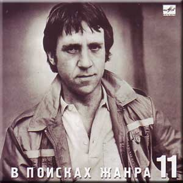

= На концертах Владимира Высоцкого - 11
В поисках жанра
:toc:

С сайта: http://www.kulichki.com/vv/pesni/

== Всю войну под завязку

// https://www.google.com/search?q=Высоцкий+текст+Всю+войну+под+завязку

[verse,1974-1975]
____
Всю войну под завязку я все к дому тянулся,
И хотя горячился, воевал делово.
Ну а он торопился, как-то раз не пригнулся,-
И в войне взад-вперед обернулся, за два года - всего ничего!

Не слыхать его пульса с сорок третьей весны,
Ну а я окунулся в довоенные сны.
И гляжу я, дурея, но дышу тяжело...
Он был лучше, добрее, ну а мне повезло.

Я за пазухой не жил, не пил с господом чая,
Я ни в тыл не стремился, ни судьбе под подол,
Но мне женщины молча намекали, встречая:
Если б ты там навеки остался, может, мой бы обратно пришел.

Для меня не загадка их печальный вопрос -
Мне ведь тоже не сладко, что у них не сбылось.
Мне ответ подвернулся: "Извините, что цел!
Я случайно вернулся, вернулся, ну а ваш не сумел".

Он кричал напоследок, в самолете сгорая:
- Ты живи, ты дотянешь! - доносилось сквозь гул.
Мы летали под богом, возле самого рая -
Он поднялся чуть выше и сел там, ну а я до земли дотянул.

Встретил летчика сухо райский аэродром.
Он садился на брюхо, но не ползал на нем,
Он уснул - не проснулся, он запел - не допел,
Так что я вот вернулся, ну а он не сумел.

Я кругом и навечно виноват перед теми,
С кем сегодня встречаться я почел бы за честь.
И хотя мы живыми до конца долетели,
Жжет нас память и мучает совесть - у кого? У кого она есть.

Кто-то скупо и четко отсчитал нам часы
Нашей жизни короткой, как бетон полосы.
И на ней - кто разбился, кто - взлетел навсегда...
Ну а я приземлился, а я приземлился - вот какая беда.
____

== Песня о Земле

[verse,1969]
____
Кто сказал: "Все сгорело дотла?
Больше в Землю не бросите семя"?
Кто сказал, что Земля умерла?
Нет! Она затаилась на время.

Материнство не взять у Земли,
Не отнять, как не вычерпать моря.
Кто поверил, что Землю сожгли?
Нет! Она почернела от горя.

Как разрезы, траншеи легли,
И воронки, как раны, зияют,
Обнаженные нервы Земли
Неземное страдание знают.

Она вынесет все, переждет.
Не записывай Землю в калеки!
Кто сказал, что Земля не поет,
Что она замолчала навеки?

Нет! Звенит она, стоны глуша,
Изо всех своих ран, из отдушин.
Ведь Земля - это наша душа,
Сапогами не вытоптать душу!

Кто поверил, что Землю сожгли?
Нет, она затаилась на время.
____

== На дистанции четвёрка первачей

[verse,1974]
____
На дистанции - четверка первачей,-
Каждый думает, что он-то побойчей,
Каждый думает, что меньше всех устал,
Каждый хочет на высокий пьедестал.

Кто-то кровью холодней, кто горячей,-
Все наслушались напутственных речей,
Каждый съел примерно поровну харчей,-
И судья не зафиксирует ничьей.

	А борьба на всем пути -
	В общем, равная почти.
	"Расскажите, как идут,
	бога ради, а?"
	"Телевиденье тут
	вместе с радио!
	Нет особых новостей -
	все ровнехонько,
	Но зато накал страстей -
	о-хо-хо какой!"

Номер первый - рвет подметки как герой,
Как под гору катит, хочет под горой.
Он в победном ореоле и в пылу
Твердой поступью приблизится к котлу.

Почему высоких мыслей не имел?-
Потому что в детстве мало каши ел,
Голодал он в этом детстве, не дерзал,-
Успевал переодеться - и в спортзал.

	Что ж, идеи нам близки -
	Первым лучшие куски,
	А вторым - чего уж тут,
	он все выверил -
	В утешение дадут
	кости с ливером.

Номер два - далек от плотских тех утех,-
Он из сытых, он из этих, он из тех,-
Он надеется на славу, на успех -
И уж ноги задирает выше всех.

Ох, наклон на вираже - бетон у щек!
Краше некуда уже, а он - еще!
Он стратег, он даже тактик, словом - спец,-
Сила, воля плюс характер - молодец!

	Четок, собран, напряжен
	И не лезет на рожон,-
	Этот - будет выступать
	на Салониках,
	И детишек поучать
	в кинохрониках,
	И соперничать с Пеле
	в закаленности,
	И являть пример целе-
	устремленности!

Номер третий - убелен и умудрен,-
Он всегда - второй надежный эшелон,-
Вероятно, кто-то в первом заболел,
Но, а может, его тренер пожалел.

И назойливо в ушах звенит струна:
У тебя последний шанс, слышь, старина!
Он в азарте - как мальчишка, как шпана,-
Нужен спурт - иначе крышка и хана!

	Переходит сразу он
	В задний старенький вагон,
	Где былые имена -
	прединфарктные,
	Где местам одна цена -
	все плацкартные.

А четвертый - тот, что крайний, боковой,-
Так бежит - ни для чего, ни для кого:
То приблизится - мол, пятки оттопчу,
То отстанет, постоит - мол, так хочу.
Не проглотит первый лакомый кусок,
Не надеть второму лавровый венок,
Ну а третьему - ползти на запасные пути...

	Сколько все-таки систем
	в беге нынешнем! -
	Он вдруг взял да сбавил темп
	перед финишем,
	Майку сбросил - вот те на!-
	не противно ли?
	Поведенье бегуна -
	неспортивное!

На дистанции - четверка первачей,
Злых и добрых, бескорыстных и рвачей.
Кто из них что исповедует, кто чей?
...Отделяются лопатки от плечей -
И летит уже четверка первачей!
____

== Кто-то высмотрел плод

[verse,1973]
____
Кто-то высмотрел плод, что неспел, неспел,
Потрусили за ствол - он упал, упал...
Вот вам песня о том, кто не спел, не спел,
И что голос имел - не узнал, не узнал.

Может, были с судьбой нелады, нелады,
И со случаем плохи дела, дела,
А тугая струна на лады, на лады
С незаметным изъяном легла.

Он начал робко - с ноты "до",
Но не допел ее не до...
Недозвучал его аккорд, аккорд
И никого не вдохновил...
Собака лаяла, а кот
Мышей ловил...

Смешно! Не правда ли, смешно! Смешно!
А он шутил - недошутил,
Недораспробовал вино
И даже недопригубил.

Он пока лишь затеивал спор, спор
Неуверенно и не спеша,
Словно капельки пота из пор,
Из-под кожи сочилась душа.

Только начал дуэль на ковре,
Еле-еле, едва приступил.
Лишь чуть-чуть осмотрелся в игре,
И судья еще счет не открыл.

Он хотел знать все от и до,
Но не добрался он, не до...
Ни до догадки, ни до дна,
Не докопался до глубин,
И ту, которая одна,
Не долюбил, не долюбил!

Смешно, не правда ли, смешно?
А он спешил - недоспешил.
Осталось недорешено,
Все то, что он недорешил.

Ни единою буквой не лгу -
Он был чистого слога слуга,
И писал ей стихи на снегу,-
К сожалению, тают снега.

Но тогда еще был снегопад
И свобода писать на снегу.
И большие снежинки и град
Он губами хватал на бегу.

Но к ней в серебряном ландо
Он не добрался и не до...
Не добежал, бегун-беглец,
Не долетел, не доскакал,
А звездный знак его - Телец -
Холодный Млечный Путь лакал.

Смешно, не правда ли, смешно,
Когда секунд недостает,-
Недостающее звено -
И недолет, и недолет.

Смешно, не правда ли? Ну, вот,-
И вам смешно, и даже мне.
Конь на скаку и птица влет,-
По чьей вине, по чьей вине?
____

== Вот это да!

[verse,1974]
____
Вот это да, вот это да!
Сквозь мрак и вечность-решето,
Из зала Страшного суда
Явилось то - не знаю что.

	Играйте туш!
	Быть может, он -
	Умерший муж
	Несчастных жен,
	Больных детей
	Больной отец,
	Благих вестей
	Шальной гонец.

Вот это да, вот это да!
Спустился к нам - не знаем кто,-
Как снег на голову суда,
Упал тайком, инкогнито!

	Но кто же он?
	Хитрец и лгун?
	Или - шпион,
	Или колдун?
	Каких дворцов
	Он господин,
	Каких отцов
	Заблудший сын?

Вот это да, вот это да!
И я спросил, как он рискнул,-
Из ниоткуда в никуда
Перешагнул, перешагнул?

	Он мне: "Внемли!"
	И я внимал,
	Что он с Земли
	Вчера сбежал,
	Решил: "Нырну
	Я в гладь и тишь!"
	Но в тишину
	Без денег - шиш!
	Мол, прошмыгну
	Как мышь, как вошь,
	Но в тишину
	Не прошмыгнешь!

Вот это да, вот это да!
Он повидал печальный край,-
В аду - бардак и лабуда,-
И он опять - в наш грешный рай.

	Итак, оттуда
	Он удрал,
	Его Иуда
	Обыграл -
	И в "тридцать три",
	И в "сто одно".
	Смотри, смотри!
	Он видел дно,
	Он видел ад,
	Но сделал он
	Свой шаг назад -
	И воскрешен!

Вот это да, вот это да!
Прошу любить, играйте марш!
Мак-Кинли - маг, суперзвезда,
Мессия наш, мессия наш!

	Владыка тьмы
	Его отверг,
	Но примем мы -
	Он человек!
	Душ не губил
	Сей славный муж,
	Самоубий-
	ство - просто чушь,
	Хоть это де-
	шево и враз -
	Не проведешь
	Его и нас!

Вот это да, вот это да!
Вскричал петух, и пробил час.
Мак-Кинли - бог, суперзвезда,-
Он - среди нас, он - среди нас!

	Он рассудил,
	Что Вечность - хлам,
	И запылил
	На свалку к нам.
	Он даже спьяну
	Не дурил,
	Марихуану
	Не курил,
	И мы хотим
	Отдать концы,
	Мы бегством мстим,
	Мы - беглецы!

Вот это да! Вот это да!
____

== Мы все живём как будто, но...

[verse,1973]
____
Мы все живем как будто, но
Не будоражат нас давно
Ни паровозные свистки,
Ни пароходные гудки.
Иные - те, кому дано,-
Стремятся вглубь - и видят дно,-
Но - как навозные жуки
И мелководные мальки...

	А рядом случаи летают, словно пули,-
	Шальные, запоздалые, слепые, на излете,-
	Одни под них подставиться рискнули -
	И сразу: кто - в могиле, кто - в почете.

		А мы - так не заметили
		И просто увернулись,-
		Нарочно по примете ли -
		На правую споткнулись.

Средь суеты и кутерьмы -
Ах, как давно мы не прямы! -
То гнемся бить поклоны впрок,
А то - завязывать шнурок...
Стремимся вдаль проникнуть мы,-
Но даже светлые умы
Все размещают между строк -
У них расчет на долгий срок...

	А рядом случаи летают, словно пули,-
	Шальные, запоздалые, слепые, на излете,-
	Одни под них подставиться рискнули -
	И сразу: кто - в могиле, кто - в почете.

		А мы - так не заметили
		И просто увернулись,-
		Нарочно по примете ли -
		На правую споткнулись.

Стремимся мы подняться ввысь -
Ведь думы наши поднялись,-
И там царят они, легки,
Свободны, вечны, высоки.
И так нам захотелось ввысь,
Что мы вчера перепились -
И горьким дымам вопреки
Мы ели сладкие куски...

	А рядом случаи летают, словно пули,-
	Шальные, запоздалые, слепые, на излете,-
	Одни под них подставиться рискнули -
	И сразу: кто - в могиле, кто - в почете.

		А мы - так не заметили
		И просто увернулись,-
		Нарочно по примете ли -
		На правую споткнулись.

Открытым взломом, без ключа,
Навзрыд об ужасах крича,
Мы вскрыть хотим подвал чумной -
Рискуя даже головой.
И трезво, а не сгоряча
Мы рубим прошлое с плеча,-
Но бьем расслабленной ругой,
Холодной, дряблой - никакой.

	А рядом случаи летают, словно пули,-
	Шальные, запоздалые, слепые, на излете,-
	Одни под них подставиться рискнули -
	И сразу: кто - в могиле, кто - в почете.

		А мы - так не заметили
		И просто увернулись,-
		Нарочно по примете ли -
		На правую споткнулись.

Приятно сбросить гору с плеч -
И все на божий суд извлечь,
И руку выпростать, дрожа,
И показать - в ней нет ножа,-
Не опасаясь, что картечь
И безоружных будет сечь.
Но нас, железных, точит ржа -
И психология ужа...

	А рядом случаи летают, словно пули,-
	Шальные, запоздалые, слепые, на излете,-
	Одни под них подставиться рискнули -
	И сразу: кто - в могиле, кто - в почете.

		А мы - так не заметили
		И просто увернулись,-
		Нарочно по примете ли -
		На правую споткнулись.
____

== Ой, где был я вчера

[verse,1967]
____
Ой, где был я вчера - не найду, хоть убей,
Только помню, что стены с обоями.
Помню, Клавка была и подруга при ней,
Целовался на кухне с обоими.

	А наутро я встал,
	Мне давай сообщать:
	Что хозяйку ругал,
	Всех хотел застращать,
	Будто голым скакал,
	Будто песни орал,
	А отец, говорил,
	У меня генерал.

А потом рвал рубаху и бил себя в грудь,
Говорил, будто все меня продали,
И гостям, говорят, не давал продохнуть -
Все донимал их блатными аккордами.

	А потом кончил пить,
	Потому что устал,
	Начал об пол крушить
	Благородный хрусталь,
	Лил на стены вино,
	А кофейный сервиз,
	Растворивши окно,
	Взял да выбросил вниз.

И никто мне не мог даже слова сказать,
Но потом потихоньку оправились,
Навалились гурьбой, стали руки вязать,
И в конце уже все позабавились.

	Кто плевал мне в  лицо,
	А кто водку лил в рот,
	А какой-то танцор
	Бил ногами в живот,
	Молодая вдова,
	Верность мужу храня,
	(Ведь живем однова)
	Пожалела меня.

И бледнел я на кухне с разбитым лицом,
Сделал вид, что пошел на попятную -
"Развяжите!"- кричал,- "да и дело с концом!" -
Развязали, но вилки попрятали.

	Тут вообще началось -
	Не опишешь в словах,
	И откуда взялось
	Столько силы в руках?
	Я, как раненный зверь,
	Напоследок чудил,
	Выбил окна и дверь,
	И балкон уронил.

Ой, где был я вчера - не найду днем с огнем,
Только помню, что стены с обоями...
И осталось лицо, и побои на нем.
Ну куда теперь выйти с побоями?

	Если правда оно,
	Ну, хотя бы на треть,
	Остается одно:
	Только лечь, помереть,
	Хорошо, что вдова
	Все смогла пережить,
	Пожалела меня
	И взяла к себе жить.
____

== Горное эхо

[verse,1973]
____
В тиши перевала, где скалы ветрам не помеха,
На кручах таких, на какие никто не проник,
Жило-поживало весёлое горное эхо,
Оно отзывалось на крик - человеческий крик.

Когда одиночество комом подкатит под горло
И сдавленный стон еле слышно в обрыв упадет -
Крик этот о помощи эхо подхватит проворно,
Усилит - и бережно в руки своих донесёт.

Должно быть, не люди, напившись дурмана и зелья,
Чтоб не был услышан никем громкий топот и храп,
Пришли умертвить, обеззвучить живое ущелье -
И эхо связали, и в рот ему всунули кляп.

Всю ночь продолжалась кровавая злая потеха,
И эхо топтали, но звука никто не слыхал.
К утру расстреляли притихшее горное эхо -
И брызнули слезы, как камни, из раненых скал...	
____

== Так случилось, мужчины ушли

[verse,1971]
____
Так случилось - мужчины ушли,
Побросали посевы до срока.
Вот их больше не видно из окон -
Растворились в дорожной пыли.

Вытекают из колоса зерна -
Эти слезы несжатых полей.
И холодные ветры проворно
Потекли из щелей.

	Мы вас ждем - торопите коней!
	В добрый час, в добрый час, в добрый час!
	Пусть попутные ветры не бьют, а ласкают вам спины.
	А потом возвращайтесь скорей!
	Ивы плачут по вас,
	И без ваших улыбок бледнеют и сохнут рябины.

Мы в высоких живем теремах,
Входа нет никому в эти зданья -
Одиночество и ожиданье
Вместо вас поселилось в домах.

Потеряла и свежесть и прелесть
Белизна неодетых рубах,
Даже старые песни приелись
И навязли в зубах.

	Мы вас ждем - торопите коней!
	В добрый час, в добрый час, в добрый час!
	Пусть попутные ветры не бьют, а ласкают вам спины.
	А потом возвращайтесь скорей!
	Ивы плачут по вас,
	И без ваших улыбок бледнеют и сохнут рябины.

Все единою болью болит,
И звучит с каждым днем непрестанней
Вековечный надрыв причитаний
Отголоском старинных молитв.

Мы вас встретим и пеших, и конных,
Утомленных, нецелых, - любых.
Только б не пустота похоронных
И предчувствие их.

	Мы вас ждем - торопите коней!
	В добрый час, в добрый час, в добрый час!
	Пусть попутные ветры не бьют, а ласкают вам спины.
	А потом возвращайтесь скорей!
	Ивы плачут по вас,
	И без ваших улыбок бледнеют и сохнут рябины.
____

== Я не люблю

[verse,1969]
____
Я не люблю фатального исхода,
От жизни никогда не устаю.
Я не люблю любое время года,
Когда веселых песен не пою.

Я не люблю холодного цинизма,
В восторженность не верю, и еще -
Когда чужой мои читает письма,
Заглядывая мне через плечо.

Я не люблю, когда наполовину
Или когда прервали разговор.
Я не люблю, когда стреляют в спину,
Я также против выстрелов в упор.

Я ненавижу сплетни в виде версий,
Червей сомненья, почестей иглу,
Или - когда все время против шерсти,
Или - когда железом по стеклу.

Я не люблю уверенности сытой,
Уж лучше пусть откажут тормоза!
Досадно мне, что слово "честь" забыто,
И что в чести наветы за глаза.

Когда я вижу сломанные крылья -
Нет жалости во мне и неспроста.
Я не люблю насилье и бессилье,
Вот только жаль распятого Христа.

Я не люблю себя, когда я трушу,
Обидно мне, когда невинных бьют,
Я не люблю, когда мне лезут в душу,
Тем более, когда в нее плюют.

Я не люблю манежи и арены,
На них мильон меняют по рублю,
Пусть впереди большие перемены,
Я это никогда не полюблю.
____

== Парус

[verse,1966]
____
А у дельфина взрезано брюхо винтом. 
Выстрела в спину не ожидает никто. 
На батарее нету снарядов уже. 
Надо быстрее на вираже. 

	Парус! Порвали парус! 
	Каюсь, каюсь, каюсь... 

Даже в дозоре можешь не встретить врага. 
Это не горе, если болит нога. 
Петли дверные многим скрипят, многим поют:
- Кто вы такие? Вас здесь не ждут! 

	Но парус! Порвали парус! 
	Каюсь, каюсь, каюсь... 

Многие лета - тем, кто поет во сне. 
Все части света могут лежать на дне, 
Все континенты могут гореть в огне, 
Только все это не по мне. 

	Но парус! Порвали парус! 
	Каюсь, каюсь, каюсь... 
____
