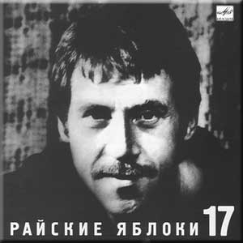

= На концертах Владимира Высоцкого - 17
Райские яблоки
:toc:

С сайта: https://www.culture.ru/persons/2116/vladimir-vysockii

== Лошадей двадцать тысяч

[verse,1971]
____
Лошадей двадцать тысяч в машины зажаты -
И хрипят табуны, стервенея, внизу.
На глазах от натуги худеют канаты,
Из себя на причал выжимая слезу.

И команды короткие, злые
Быстрый ветер уносит во тьму:
"Кранцы за борт!", "Отдать носовые!"
И — "Буксир, подработать корму!"

Капитан, чуть улыбаясь, -
Молвил только "Молодцы", -
Тем, кто с сушей расставаясь,
Не хотел рубить концы.

Переход — двадцать дней, — рассыхаются шлюпки,
Нынче утром последний отстал альбатрос…
Хоть бы — шторм! Или лучше — чтоб в радиорубке
Обалдевший радист принял чей-нибудь SOS.

Так и есть: трое — месяц в корыте,
Яхту вдребезги кит размотал…
Так за что вы нас благодарите -
Вам спасибо за этот аврал!

Только снова назад обращаются взоры -
Цепко держит земля, все и так и не так:
Почему слишком долго не сходятся створы,
Почему слишком часто мигает маяк?!

Капитан, чуть улыбаясь,
Молвил тихо: "Молодцы!"
Тем, кто с жизнью расставаясь,
Не хотел рубить концы.

И опять будут Фиджи, и порт Кюрасао,
И еще черта в ступе и бог знает что,
И красивейший в мире фиорд Мильфорсаун -
Все, куда я ногой не ступал, но зато -

Пришвартуетесь вы на Таити
И прокрутите запись мою, -
Через самый большой усилитель
Я про вас на Таити спою.

Скажет мастер, улыбаясь,
Мне и песне: "Молодцы!"
Так, на суше оставаясь,
Я везде креплю концы.

И опять продвигается, словно на ринге,
По воде осторожная тень корабля.
В напряженье матросы, ослаблены шпринги…
Руль полборта налево — и в прошлом земля!
____

== Тот, который не стрелял

[verse,1973]
____
Я вам мозги не пудрю — уже не тот завод:
В меня стрелял поутру из ружей целый взвод.
За что мне эта злая, нелепая стезя —
Не то чтобы не знаю, — рассказывать нельзя.

Мой командир меня почти что спас,
Но кто-то на расстреле настоял —
И взвод отлично выполнил приказ.
Но был один, который не стрелял.

Судьба моя лихая давно наперекос.
Однажды "языка" я добыл, да не донёс,
И особист Суэтин — неутомимый наш! —
Ещё тогда приметил и взял на карандаш.

Он выволок на свет и приволок
Подколотый, подшитый матерьял —
Никто поделать ничего не смог…
Нет! Смог один, который не стрелял.

Рука упала в пропасть с дурацким звуком: «Пли!» —
И залп мне выдал пропуск в ту сторону земли.
Но… слышу: «Жив, зараза! Тащите в медсанбат —
Расстреливать два раза уставы не велят!»

А врач потом всё цокал языком
И, удивляясь, пули удалял.
А я в бреду беседовал тайком
С тем пареньком, который не стрелял.

Я раны, как собака, лизал, а не лечил.
В госпиталях, однако, в большом почёте был —
Ходил, в меня влюблённый, весь слабый женский пол:
«Эй, ты! Недострелённый! Давай-ка на укол!»

Наш батальон геройствовал в Крыму,
И я туда глюкозу посылал,
Чтоб было слаще воевать ему.
Кому? Тому, который не стрелял.

Я пил чаёк из блюдца, со спиртиком бывал.
Мне не пришлось загнуться, и я довоевал.
В свой полк определили. «Воюй! — сказал комбат. —
А что недострелили — так я не виноват».

Я очень рад был, но, присев у пня,
Я выл белугой и судьбину клял:
Немецкий снайпер дострелил меня,
Убив того, который не стрелял.
____

== Одна научная загадка, или Почему аборигены съели Кука

[verse,1976]
____
Не хватайтесь за чужие талии,
Вырвавшись из рук своих подруг!
Вспомните, как к берегам Австралии
Подплывал покойный ныне Кук,

Как, в кружок усевшись под азалии,
Поедом — с восхода до зари —
Ели в этой солнечной Австралии
Друга дружку злые дикари.

Но почему аборигены съели Кука?
За что — неясно, молчит наука.
Мне представляется совсем простая штука:
Хотели кушать — и съели Кука!

Есть вариант, что ихний вождь — большая бука —
Сказал, что очень вкусный кок на судне Кука…
Ошибка вышла — вот о чём молчит наука:
Хотели — кока, а съели — Кука!

И вовсе не было подвоха или трюка —
Вошли без стука, почти без звука,
Пустили в действие дубинку из бамбука:
Тюк! прямо в темя — и нету Кука!

Но есть, однако же, ещё предположенье,
Что Кука съели из большого уваженья,
Что всех науськивал колдун — хитрец и злюка:
«Ату, ребята, хватайте Кука!

Кто уплетёт его без соли и без лука,
Тот сильным, смелым, добрым будет — вроде Кука!»
Комуй-то под руку попался каменюка,
Метнул, гадюка, — и нету Кука!

А дикари теперь заламывают руки,
Ломают копия, ломают луки,
Сожгли и бросили дубинки из бамбука —
Переживают, что съели Кука!
____

== Зарисовка о Ленинграде

[verse,1967]
____
В Ленинграде-городе у Пяти углов
Получил по морде Саня Соколов.
Пел немузыкально, скандалил —
Ну и, значит, правильно, что дали.В Ленинграде-городе — тишь и благодать!
Где шпана и воры где? Просто не видать!
Не сравнить с Афинами — прохладно.
Правда шведы с финнами… Ну ладно! В Ленинграде-городе — как везде, такси,
Но не остановите — даже не проси!
Если сильно водку пьёшь, по пьянке
Не захочешь — а дойдёшь к стоянке!
____

== Письмо из Парижа

[verse,1975]
____
Ах, милый Ваня! Я гуляю по Парижу —
И то, что слышу, и то, что вижу,
Пишу в блокнотик впечатлениям вдогонку:
Когда состарюсь — издам книжонку

Про то, что, Ваня, Ваня, Ваня, Ваня, мы с тобой в Париже
Нужны — как в бане пассатижи.

Все эмигранты тут второго поколенья —
От них сплошные недоразуменья:
Они всё путают — и имя, и названья, —
И ты бы, Ваня, у них был — «Ванья».

А в общем, Ваня, Ваня, Ваня, Ваня, мы с тобой в Париже
Нужны — как в русской бане лыжи!

Я сам завёл с француженкою шашни,
Мои друзья теперь — и Пьер, и Жан.
И вот плевал я уже, Ваня, с Эйфелевой башни
На головы беспечных парижан!

Проникновенье наше по планете
Особенно заметно вдалеке:
В общественном парижском туалете
Есть надписи на русском языке!
____

== Письмо в редакцию телепередачи «Очевидное-Невероятное» из сумасшедшего дома

[verse,1977]
____
Дорогая передача!
Во субботу, чуть не плача,
Вся Канатчикова дача
К телевизору рвалась.
Вместо чтоб поесть, помыться,
Там это, уколоться и забыться,
Вся безумная больница
У экранов собралась.

Говорил, ломая руки,
Краснобай и баламут
Про бессилие науки
Перед тайною Бермуд.
Все мозги разбил на части,
Все извилины заплёл —
И канатчиковы власти
Колют нам второй укол.

Уважаемый редактор!
Может, лучше — про реактор?
Там, про любимый лунный трактор?
Ведь нельзя же! — год подряд
То тарелками пугают —
Дескать, подлые, летают,
То у вас собаки лают,
То руины говорят!

Мы кое в чём поднаторели:
Мы тарелки бьём весь год —
Мы на них уже собаку съели,
Если повар нам не врёт.
А медикаментов груды
Мы — в унитаз, кто не дурак.
Это жизнь! И вдруг — Бермуды!
Вот те раз! Нельзя же так!

Мы не сделали скандала —
Нам вождя недоставало:
Настоящих буйных мало —
Вот и нету вожаков.
Но на происки и бредни
Сети есть у нас и бредни —
И не испортят нам обедни
Злые происки врагов!

Это их худые черти
Мутят воду во пруду,
Это всё придумал Черчилль
В восемнадцатом году!
Мы про взрывы, про пожары
Сочинили ноту ТАСС…
Но примчались санитары
И зафиксировали нас.

Тех, кто был особо боек,
Прикрутили к спинкам коек —
Бился в пене параноик,
Как ведьмак на шабаше:
«Развяжите полотенцы,
Иноверы, изуверцы, —
Нам бермуторно на сердце
И бермудно на душе!»

Сорок душ посменно воют,
Раскалились добела —
Во как сильно беспокоят
Треугольные дела!
Все почти с ума свихнулись —
Даже кто безумен был,
И тогда главврач Маргулис
Телевизор запретил.

Вон он, змей, в окне маячит —
За спиною штепсель прячет,
Подал знак кому-то — значит
Фельдшер вырвет провода.
И что ж, нам осталось уколоться,
И упасть на дно колодца,
И там пропасть, на дне колодца,
Как в Бермудах, навсегда.

Ну, а завтра спросят дети,
Навещая нас с утра:
«Папы, что сказали эти
Кандидаты в доктора?»
Мы откроем нашим чадам
Правду — им не всё равно,
Мы скажем: «Удивительное рядом,
Но оно запрещено!»

Вон дантист-надомник Рудик —
У его приёмник «грюндиг»,
Он его ночами крутит —
Ловит, контра, ФРГ.
Он там был купцом по шмуткам
И подвинулся рассудком —
И к нам попал в волненье жутком
И с номерочком на ноге.

Он прибежал, взволнован крайне,
И сообщеньем нас потряс,
Будто наш научный лайнер
В треугольнике погряз:
Сгинул, топливо истратив,
Прям распался на куски,
И двух безумных наших братьев
Подобрали рыбаки.

Те, кто выжил в катаклизме,
Пребывают в пессимизме,
Их вчера в стеклянной призме
К нам в больницу привезли,
И один из них, механик,
Рассказал, сбежав от нянек,
Что Бермудский многогранник —
Незакрытый пуп Земли.

«Что там было? Как ты спасся?» —
Каждый лез и приставал,
Но механик только трясся
И чинарики стрелял.
Он то плакал, то смеялся,
То щетинился как ёж —
Он над нами издевался…
Ну сумасшедший — что возьмёшь!

Взвился бывший алкоголик —
Матерщинник и крамольник:
«Надо выпить треугольник!
На троих его! Даёшь!»
Разошёлся — так и сыпет:
«Треугольник будет выпит!
Будь он параллелепипед,
Будь он круг, едрена вошь!»

Больно бьют по нашим душам
«Голоса» за тыщи миль.
Мы зря Америку не глушим,
Ой, зря не давим Израиль:
Всей своей враждебной сутью
Подрывают и вредят —
Кормят, поят нас бермутью
Про таинственный квадрат!

Лектора из передачи
(Те, кто так или иначе
Говорят про неудачи
И нервируют народ),
Нас берите, обречённых, —
Треугольник вас, учёных,
Превратит в умалишённых,
Ну, а нас — наоборот.

Пусть безумная идея —
Вы не рубайте сгоряча.
Вызывайте нас скорее
Через гада главврача!
С уваженьем… Дата. Подпись.
Отвечайте нам, а то,
Если вы не отзовётесь,
Мы напишем… в «Спортлото»!
____

== Баллада о любви

[verse,1975]
____
Когда вода всемирного потопа
Вернулась вновь в границы берегов,
Из пены уходящего потока
На берег тихо выбралась любовь
И растворилась в воздухе до срока,
А срока было сорок сороков.

И чудаки — еще такие есть —
Вдыхают полной грудью эту смесь.
И ни наград не ждут, ни наказанья,
И, думая, что дышат просто так,
Они внезапно попадают в такт
Такого же неровного дыханья…

Только чувству, словно кораблю,
Долго оставаться на плаву,
Прежде чем узнать, что «я люблю», -
То же, что дышу, или живу!

И вдоволь будет странствий и скитаний,
Страна Любви — великая страна!
И с рыцарей своих для испытаний
Все строже станет спрашивать она.
Потребует разлук и расстояний,
Лишит покоя, отдыха и сна…

Но вспять безумцев не поворотить,
Они уже согласны заплатить.
Любой ценой — и жизнью бы рискнули,
Чтобы не дать порвать, чтоб сохранить
Волшебную невидимую нить,
Которую меж ними протянули…

Свежий ветер избранных пьянил,
С ног сбивал, из мертвых воскрешал,
Потому что, если не любил,
Значит, и не жил, и не дышал!

Но многих захлебнувшихся любовью,
Не докричишься, сколько не зови…
Им счет ведут молва и пустословье,
Но этот счет замешан на крови.
А мы поставим свечи в изголовье
Погибшим от невиданной любви…

Их голосам дано сливаться в такт,
И душам их дано бродить в цветах.
И вечностью дышать в одно дыханье,
И встретиться со вздохом на устах
На хрупких переправах и мостах,
На узких перекрестках мирозданья…

Я поля влюбленным постелю,
Пусть поют во сне и наяву!
Я дышу — и значит, я люблю!
Я люблю — и, значит, я живу!
____

== Серенада Соловья-разбойника

[verse,1974]
____
Выходи! Я тебе посвищу серенаду!
Кто тебе серенаду ещё посвистит?
Сутки кряду могу — до упаду, —
Если муза меня посетит.

Я пока ещё только шутю и шалю —
Я пока на себя не похож:
Я обиду терплю, но когда я вспылю —
Я дворец подпилю, подпалю, развалю,
Если ты на балкон не придёшь!

Ты отвечай мне прямо-откровенно —
Разбойничую душу не трави!..
О, выйди, выйди, выйди, выйди, Аграфена,
Послушать серенаду о любви!

Эге-гей, трали-вали!
Кабы красна девица жила бы во подвале —
Я б тогда на корточки
Приседал у форточки,
Мы бы до утра проворковали!

В лесных кладовых моих — уйма товара:
Два уютных дупла, три пенёчка гнилых…
Чем же я тебе, Груня, не пара,
Чем я, Феня, тебе не жених?!

Так тебя я люблю, что ночами не сплю,
Сохну с горя у всех на виду.
Вон и голос сорвал — и хриплю, и сиплю.
Ох, я дров нарублю — я себя погублю, —
Но тебя украду, уведу!

Я женихов твоих — через колено!
Я папе твоему попорчу кровь!
О, выйди, выйди, выйди, выйди, Аграфена,
О, не губи разбойничью любовь!

Эге-гей, трали-вали!
Кабы красна девица жила да во подвале —
Я б тогда на корточки
Приседал у форточки,
Мы бы до утра проворковали!

Так давай, Аграфенушка, свадьбу назначим.
Я нечистая сила, но с чистой душой!
Я к чертям, извините, собачьим
Брошу свой соловьиный разбой!

Я и трелью зальюсь, и подарок куплю,
Всех дружков приведу на поклон,
Я тебя пропою, я тебя прокормлю,
Нам ребята на свадьбу дадут по рублю,
Только — ты выходи на балкон!

Во темечке моём да во височке —
Одна мечта: что выйдет красота,
Привстану я на цыпочки-мысочки
И поцелую в сахарны уста!

Эге-гей, трали-вали!
Кабы красна девица жила да во подвале —
Я б тогда на корточки
Приседал у форточки,
Мы бы до утра проворковали!
____

== Куплеты нечисти

[verse,1974]
____
«Я Баба-Яга —
Вот и вся недолга,
Я езжу в немазаной ступе.
Я к русскому духу не очень строга:
Люблю его… сваренным в супе.Ох, мне надоело по лесу гонять,
Зелье я переварила…
Нет, чтой-то стала совсем изменять
Наша нечистая сила!» —«Добрый день! Добрый тень!
Я, дак, Оборотень!
Неловко вчерась обернулся:
Хотел превратиться в дырявый плетень,
Да вот посерёдке запнулся.И кто я теперь — самому не понять,
Эк меня, братцы, скривило!..
Нет, чтой-то стала совсем изменять
Наша нечистая сила!» —«А я старый больной
Озорной Водяной,
Но мне надоела квартира:
Сижу под корягой, простуженный, злой,
Ведь в омуте — мокро и сыро.Вижу намедни — утопленник. Хвать!
А он меня — пяткой по рылу!..
Нет, перестали совсем уважать
Нашу нечистую силу!» —«Такие дела:
Лешачиха со зла,
Лишив меня лешевелюры,
Вчера из дупла
на мороз прогнала —
У ей с Водяным шуры-муры.Со свету стали
совсем изживать —
Ну прост-таки гонят в могилу…
Нет, перестали
совсем уважать
Нашу нечистую силу!» —«Русалке легко:
Я хвостом-плавником
Коснусь холодком
под сердечко…
Но вот с современным утопленником
Теперь то и дело осечка! Как-то утопленник стал возражать —
Ох, наглоталась я илу!
Ах, перестали совсем уважать
Нашу нечистую силу!» —«А я Домовой,
Я домашний, я свой,
А в дом не могу появиться —
С утра и до ночи стоит дома вой:
Недавно вселилась певица! Я ей — добром, а она — оскорблять:
Мол, Домового — на мыло!
Видно, нам стала всем изменять
Наша нечистая сила!»
____

== Про речку Вачу и попутчицу Валю

[verse,1977]
____
Под собою ног не чую -
И качается земля...
Третий месяц я бичую,
Так как списан подчистую
С китобоя-корабля.

Ну а так как я бичую,
Беспартийный, не еврей,-
Я на лестницах ночую,
Где тепло от батарей.

Это жизнь! Живи и грейся -
Хрен вам, пуля и петля!
Пью, бывает, хоть залейся:
Кореша приходят с рейса -
И гуляют "от рубля"!

Рупь - не деньги, рупь - бумажка,
Экономить - тяжкий грех.
Ах, душа моя тельняшка -
В сорок полос, семь прорех!

Но послал господь удачу -
Заработал свечку он! -
Увидав, как горько плачу,
Он сказал: "Валяй на Вачу!
Торопись, пока сезон!"

Что такое эта Вача -
Разузнал я у бича,-
Он на Вачу ехал плача -
Возвращался хохоча.

Вача - это речка с мелью
Во глубине сибирских руд,
Вача - это дом с постелью,
Там стараются артелью,-
Много золота берут!

Как вербованный ишачу -
Не ханыжу, не "торчу"...
Взял билет,- лечу на Вачу,
Прилечу - похохочу!

Нету золота богаче -
Люди знают, им видней!
В общем, так или иначе,
Заработал я на Ваче
Сто семнадцать трудодней.

Подсчитали, отобрали,-
За еду, туда-сюда,-
Но четыре тыщи дали
Под расчет - вот это да!

Рассовал я их в карманы,
Где и рупь не ночевал,
И уехал в жарки страны,
Где кафе и рестораны -
Позабыть, как бичевал.

Выпью - там такая чача! -
За советчика бича:
Я на Вачу ехал плача -
Возвращаюсь хохоча!

...Проводник в преддверье пьянки
Извертелся на пупе,
То же и официантки,
А на первом полустанке
Села женщина в купе.

Может, вам она - как кляча,
Мне - так просто в самый раз!
Я на Вачу ехал плача -
Возвращаюсь веселясь!

То да се, да трали-вали,-
Как узнала про рубли...
Слово по слову, у Вали
Сотни по столу шныряли -
С Валей вместе и сошли.

С нею вышла незадача,-
Я и это залечу!
Я на Вачу ехал плача,
Возвращаюсь - хохочу!..

Суток шесть - как просквозило,-
Море - вот оно - стоит.
У меня что было - сплыло,-
Проводник воротит рыло
И за водкой не бежит.

Рупь последний в Сочи трачу -
Телеграмму накатал:
Шлите денег - отбатрачу,
Я их все прохохотал.

Где вы, где вы, рассыпные,-
Хоть ругайся, хоть кричи!
Снова ваш я, дорогие,-
Магаданские, родные,
Незабвенные бичи!

Мимо носа носат чачу,
Мимо рота - алычу...
Я на Вачу еду, плачу,
Над собою хохочу!
____

== Райские яблоки

[verse,1977]
____
Я когда-то умру — мы когда-то всегда умираем.
Как бы так угадать, чтоб не сам — чтобы в спину ножом:
Убиенных щадят, отпевают и балуют раем…
Не скажу про живых, а покойников мы бережём.

В грязь ударю лицом, завалюсь покрасивее набок —
И ударит душа на ворованных клячах в галоп!
В дивных райских садах наберу бледно-розовых яблок…
Жаль, сады сторожат и стреляют без промаха в лоб.

Прискакали. Гляжу — пред очами не райское что-то:
Неродящий пустырь и сплошное ничто — беспредел.
И среди ничего возвышались литые ворота,
И огромный этап у ворот на ворота глядел.

Как ржанёт коренной! Я смирил его ласковым словом,
Да репьи из мочал еле выдрал, и гриву заплёл.
Седовласый старик что-то долго возился с засовом —
И кряхтел и ворчал, и не смог отворить — и ушёл.

И огромный этап не издал ни единого стона,
Лишь на корточки вдруг с онемевших колен пересел.
Здесь малина, братва, — оглушило малиновым звоном!
Всё вернулось на круг, и распятый над кругом висел.

И апостол-старик — он над стражей кричал-комиссарил —
Он позвал кой-кого, и затеяли вновь отворять…
Кто-то палкой с винтом, поднатужась, об рельсу ударил —
И как ринулись все в распрекрасную ту благодать!

Я узнал старика по слезам на щеках его дряблых:
Это Пётр-старик — он апостол, а я остолоп.
Вот и кущи-сады, в коих прорва мороженых яблок…
Но сады сторожат и стреляют без промаха в лоб.

Всем нам блага подай, да и много ли требовал я благ?!
Мне — чтоб были друзья, да жена — чтобы пала на гроб,
Ну, а я уж для них наворую бессемечных яблок…
Жаль, сады сторожат и стреляют без промаха в лоб.

В онемевших руках свечи плавились, как в канделябрах,
А тем временем я снова поднял лошадок в галоп.
Я набрал, я натряс этих самых бессемечных яблок —
И за это меня застрелили без промаха в лоб.

И погнал я коней прочь от мест этих гиблых и зяблых,
Кони — головы вверх, но и я закусил удила.
Вдоль обрыва с кнутом по-над пропастью пазуху яблок
Я тебе привезу — ты меня и из рая ждала!
____

== Пожары

[verse,1977]
____
Пожары над страной всё выше, жарче, веселей,
Их отблески плясали в два притопа, три прихлопа,
Но вот Судьба и Время пересели на коней,
А там — в галоп, под пули в лоб, —
И мир ударило в озноб
От этого галопа.Шальные пули злы, слепы и бестолковы,
А мы летели вскачь — они за нами влёт,
Расковывались кони — и горячие подковы
Летели в пыль на счастье тем, кто их потом найдёт.Увёртливы поводья, словно угри,
И спутаны и волосы, и мысли на бегу,
А ветер дул — и расплетал нам кудри,
И распрямлял извилины в мозгу.Ни бегство от огня, ни страх погони — ни при чём,
А — Время подскакало, и Фортуна улыбалась,
И сабли седоков скрестились с солнечным лучом;
Седок — поэт, а конь — Пегас,
Пожар померк, потом погас,
А скачка разгоралась.Ещё не видел свет подобного аллюра —
Копыта били дробь, трезвонила капель.
Помешанная на крови слепая пуля-дура
Прозрела, поумнела вдруг — и чаще била в цель.И кто кого — азартней перепляса,
И кто скорее — в этой скачке опоздавших нет,
А ветер дул, с костей сдувая мясо
И радуя прохладою скелет.Удача впереди и исцеление больным.
Впервые скачет Время напрямую — не по кругу.
Обещанное завтра будет горьким и хмельным…
Легко скакать — врага видать,
И друга тоже… Благодать!
Судьба летит по лугу! Доверчивую Смерть вкруг пальца обернули —
Замешкалась она, забыв махнуть косой, —
Уже не догоняли нас и отставали пули…
Удастся ли умыться нам не кровью, а росой?! Пел ветер всё печальнее и глуше,
Навылет Время ранено, досталось и Судьбе.
Ветра и кони и тела, и души
Убитых выносили на себе.
____

