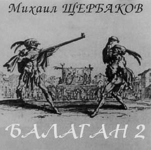

= Балаган 2
Михаил Щербаков
1996
:toc:

   

From::
http://blackalpinist.com/scherbakov/Disks/ +
https://mkshch.com/

== Тема покоя

[verse,1987]
____
Как ни горды мы, как ни ранимы,
неисчислимы жизни дары.
Вот отступает тема равнины,
и возникает тема горы.
И, обнажая швы и пробелы,
как субмарина из глубины,
вдруг выплывает тема победы
и вытесняет тему вины.

Образ пророка, образ героя -
флагами машут издалека.
Но, как и прежде, тема покоя
благословенна и глубока.
И, оказавшись у поворота,
там, над стремниной, стань и замри.
Сколько ни длится тема полёта,
всё возвратится к теме Земли.
____

== Молитва безумца.

[verse,1990]
____
Кто бы и где бы я ни был,
в чьей бы ни тлел оболочке,
всюду - я думаю только
о Тебе.

Ибо - о ком же мне думать,
витая за гранью 
веществ и материй,
исследуя тайны 
прозрачного мира,
где всё бесполезно, 
где всё невесомо,
а Ты - настоящий, 
а Ты - всевозможный, единый?!

Долгий, как тысяча странствий.
Чёрный, как Чёрное море.
Главный, меж тьмою и светом,
Судия.

Это - невнятная просьба,
последняя песня 
беззвучного горла,
молитва безумца, 
лишённая смысла;
безумца, который 
не хочет надежды,
не жаждет покоя, 
но просит о малом, Боже!

Слыша мои заклинанья,
видя воздетые руки,
знай: это всё что угодно.
Но не я.
____

== Калейдоскоп детский.

[verse,1993]
____
Не угодно ль: вот, оптический прибор, нехитрый,
так, система трёх зеркал в цилиндре
плюс цветные пустяки... как видишь,
вещь нарочно для тебя, беглянки
скрытной, склонной к миражам.

На свет её направь. Ну, чем тебе не явь?
Глазей, зевай спросонок, напоминай дитя.
Ещё бы флот тебе к подзорной сей трубе.
Но ты такой ребёнок, с каким нельзя шутя.

Мне-то что, мне легче, я ведь не беглец, я
здесь живу, мне нравятся несчастья,
ergo: мною можешь пренебречь, отныне
только в это зазеркалье глядя,
в дивный этот окуляр.

Что в нём есть... вопрос не в том, спроси
чего в нём нет... любой на выбор 
колорит, хоть флот, хоть гавань,
словом, рафинад, каштаны, детство
в городе приморском, яхты, джонки, мачты, кливера...

Но кто, смотри, вон там? По всем статьям - я сам.
Залез в одну из джонок. Ни дать ни взять матрос.
Хоть впору звать пажей и гнать меня взашей.
Но я такой ребёнок, с каким нельзя всерьёз.
____

== Века плывут...

> Cold turkey has got me on the run.

[verse,1990]
____
Века плывут, подобно китам, в своей среде молчаливой.
Их ровный путь уныл, как и мой. Но мой - имеет предел.
Волна идёт за мной по пятам, дымясь и прядая гривой, -
ей дух недобрый, бес водяной смутить меня повелел.

Мне страх неведом, но такова волны холодная злоба -
томит и давит, мыслью одной чертя узор по челу:
избегнет ли моя голова её огромного зоба?
И если да - какою ценой? А если нет - почему?

Устанет ждать невеста меня, но траура не наденет;
сосед-богач повадится к ней, она не будет горда.
И к марту их помолвит родня, а после Пасхи поженит.
И тем черней над жизнью моей волна сомкнётся тогда...

Недобрый дух! Изыди из мглы! Явись, как есть, предо мною!
Хочу, пока не скрылась луна, узнать, каков ты на вид.
Взгляну ль - и стану горстью золы? Иль вовсе глаз не открою?
Понравлюсь ли тебе, Сатана? Иль Бог меня сохранит?
____

== Мужайся

[verse,1987]
____
Пока не грянул горн и залп не прозвучал,
пока ни лавр, ни тёрн чела не увенчал -
мужайся! Ведь даже кровь твоя на эшафоте
о смерти лишний раз напомнит палачам.

Далёк небесный суд, Господь тебя храни!
Но близок суд земной, видны его огни.
И плохо, коль принесёшь ему одни проклятья,
а он не примет их, зачем ему они!

И значит - вновь во мгле, в ночи, среди могил
кричи навзрыд, до слёз, до хрипа, что есть сил:
спасибо - за самый ясный день и самый чёрный,
за то, что вынес, вышел, выжил и простил.

О гордый внук монархов, сын богатырей!
О вечный раб изгнаний, данник алтарей!
Мужайся! Недалеко уже, на горизонте,
горят огни несчастной родины твоей...
____

== Во славу Греции...

[verse,1989]
____
Во славу Греции твоей и всех морей вокруг -
десятикрылый наш корабль мы назовём «Арго».
Покинем здешние снега и поплывём на юг.
Я буду править кораблём. Ты будешь петь, Марго.

По дивным песенкам твоим, которым сто веков,
по древним картам тех земель, где что ни шаг, то миф,
я наконец-то изучу язык твоих богов,
его хрустальные слова и золотой мотив.

Вода, в которой, как тростник, архипелаг пророс,
блаженством нас не одарит, но не казнит зато.
Она без крови горяча и солона без слёз.
Ей не помеха наша жизнь. Ей наша смерть - ничто.
____

== Это я

[verse,1993]
____
Это я, а не ты, соглядатай, и не прочий какой-либо, вне.
Это я, а не всякий десятый, не оно, не они, не оне.
Это я - извлечённый из колбы на манер неваляшки без рук,
          без ног -
экспонат, означающий сколь бы ни волшебный, а всё же лишь звук.
          Или, максимум, слог.
Это я, кто пяти континентов не видал, ибо жил на шестом.
Это я, кто своих документов не читал ни досель, ни потом.
Это я, кто в шагу от поживы оступался, хотя норовил
          след в след,
почему-то боясь перспективы показаться резвее, чем был.
          Почему бы и нет?
Это я, на размер ли, на вес ли, всё равно, не они, не оно.
Даже если не я, даже если и никто, - всё равно, всё равно.
Это я, из кюветов обычно выбиравшийся жив, а не мертв.
          Но тих.
А потом заявлявший публично, что искусство не требует жертв,
          никогда, никаких.
Это мной бюрократ тупорылый помыкал от звонка до звонка.
Это мне серафим шестикрылый жала не дал, лишив языка.
Это мой разностопник ругая, огорчался ценитель (что юн,
          что сед),
неподъёмным его полагая для семи синтетических струн.
          Почему бы и нет?
Это я, слёзы ливший с не меньшей частотой, чем кричавшие «пли!»
Это я, ста друзей не имевший; уж не знаю, при чём тут рубли.
Это я, избегавший обмана, испытуя презренный металл
          на зуб.
Это я, отрицавший тирана не за то, что он зверь и вандал,
          а за то, что он глуп.
Это звон хрусталя и алтына, это радуга ртути и льда.
Экспонат, эшафот, гильотина, то есть нет, то есть да, то есть да.
Это я, на стене Валтасара нацарапавший только что весь
          сей бред.
А спасётся ль затем от пожара эта рукопись, право, Бог весть.
          Почему бы и нет?
Это я, чьи капризные губы всё никак не закончат куплет.
Почему бы и нет, почему бы, почему, почему бы и нет?
____

== Пошлый романс

[verse,1983]
____
Наклоняясь к изголовью,
обратись ко мне лицом,
обменяемся любовью,
перекинемся словцом.

Счастья маленький обрывок
улетит, как пять минут.
У судьбы на мой загривок
вечно сыщется хомут.

У меня судьба не злая,
только глупая, хоть плачь!
Всё летит куда не зная,
а я вслед за нею вскачь.

Без дороги, как умею,
по болотам хлюпаю.
А роптать никак не смею
на неё, на глупую.

И она, небось, не вправе
обижаться на меня.
Я ж ведь ей служу, шалаве,
лучше доброго коня.

Всю-то жизнь за ней, как мерин,
на веревочке хожу.
И покорен я, и верен,
мне бы плакать, а я ржу.

Не прошу награды лишней,
не страшусь никоих мук.
Мне бы только хвост подлиньше,
отмахаться чтоб от мух.

Да сберечься б в волчьем поле
от клыков и от когтей,
да овса бы чуть поболе,
да поменее плетей.
____

== Сезон дождей

[verse,1987]
____
Юго-Восток - ненастная страна.
Сезон дождей здесь тянется полгода,
и день за днём, с восхода до восхода,
лишь непогода царствует одна.
Вот и теперь - медлительный поток
сошёл с небес, томительно нахлынул,
всё изменил, всё сдвинул, опрокинул
и поглотил страну Юго-Восток.
Теченье вод, бескрайний караван,
не разобрать, где дно, а где поверхность...
Сезон дождей в смятение поверг нас,
затеяв свой унылый балаган.
Далёкий город облик корабля
приобретает в этой непогоде.
Но там никто по палубам не ходит
и не стоит на вахте у руля.

Матросы спят, им горе не беда.
В сезон дождей предписано уставом
всё время спать, прикинувшись усталым...
Корабль дымит, но с места - никуда.
Так, вероятно, греческий чудак -
силач-атлант, прикинувшись бессонным,
стоит и спит под небом невесомым,
но напрягает мышцы - просто так.
И лишь мой дом - в пустыне, как монах,
на полпути меж Югом и Востоком -
плывёт один, открытый всем потокам,
челном бесхозным путаясь в волнах.
Плыви, мой чёлн! Привыкни ко всему,
держись легко, скользи неторопливо.
Но встречным всем рассказывай правдиво,
как одиноко в море одному...
____

== Возвращение

[verse,1985]
____
Эй-эй-эй, южные страны! Дали морей... 
Горные цепи, пустынь пески, озёр и рек прохлада, -
все красоты земные, все радости и беды 
путешествий многолетних
мы познали, испытали на себе. 
Теперь всё это позади.
Теперь - домой на крыльях ветра - тра-та-та-та!

К родимым берегам летим мы,
и эти берега уже близки, уже видны.

Эй-эй-эй, полные трюмы! Кучи богатств... 
Полные бочки заморских вин, парча, хрусталь, алмазы...
Ждёт богатых подарков отчизна дорогая; 
августейшие особы
заготовили награды, и войска 
на берегу встречают нас.
Трубач трубит начало смотра - тра-та-та-та!

Построились полки в шеренги
и, трижды салютуя в нашу честь, кричат «виват».

Эй-эй... Но что же мы видим! Где же триумф? 
Где же цветы, где почёт и слава, где объятья?
Всё не так! Нас не желают! Нас видеть не хотят,
и принимают за врагов, 
и, обратив стволы орудий в нашу сторону, 
приказывают нам
лечь в дрейф не ближе километра - тра-та-та-та!

Ай, где-то мы опять ошиблись
и снова что-то сделали не так. А это жаль...
____

== Вьюга замолчит

[verse,1992]
____
Вьюга замолчит. Заря окрасит 
шпилей сталь и камень стен дворца.
Дама во дворце свечу погасит,
возблагодарив за всё Творца.

Тяжек переплёт ея псалтыри,
в золото оправлены края.
Тихо во дворце, покойно в мире
от смиренномудрия ея.

Двину дилижанс по той дороге,
что, хотя и будучи длинна,
к оному дворцу меня в итоге 
вывести, я думаю, должна.

Но не напоят сады округи 
сладостным дыханьем сумрак мой,
ибо, по замолкшей судя вьюге, 
дело будет, видимо, зимой.

Впрочем, нужды нет, зимой ли, летом,
снегом или мхом фронтон порос...
Двери на замках, замки - с секретом...
Бдительна ли стража, вот вопрос.

Ну да ничего, вовнутрь проникну,
может, караул не так глазаст.
Если же и нет, то хоть окликну,
что-нибудь да выкрикну, Бог даст.

Выглянет она. Авось, понравлюсь.
И уже ей, видимо, не спать.
Даже если тотчас я отправлюсь
этой же дорогою, но вспять.

О, как заблестит тогда прекрасный
взгляд её прощальный мне вослед!
Впрочем, это тоже - факт неясный.
Может, заблестит, а может, нет.

Вон уже ограда, вон часовня,
камень стен внушителен и нем.
Только как же так? Я ей не ровня,
что такое делаю? Зачем?

Скачет по пятам луна-ищейка,
эхом отдаётся мрак тугой.
Мой ли это голос? Нет, он чей-то.
Я ли это еду? Нет, другой.
____

== Прощание славянки

[verse,1987]
____
Когда надежды поют, как трубы,
их зов дурманит, как сладкий дым.
Они предельны, они сугубы,
и так несложно поверить им.
И вот - дорога, и вот - стоянка,
вокзал и площадь - в цветах, в цветах.
Восток дымится. Прощай, славянка!
Трубач смеётся, шинель в крестах.

Воспитан славой, к смертям причастен,
попробуй вспомни, ловя цветы,
какому зову ты был подвластен,
какому слову поверил ты...
Броня надёжна, тверда осанка,
припев беспечен: всё «ай» да «эй»...
А трубы просят: не плачь, славянка!
Но как, скажите, не плакать ей?

Пройдёт полвека. Другие губы
обнимут страстно мундштук другой.
И вновь надежды поют, как трубы.
Поди попробуй, поспорь с трубой.
А век не кончен, поход не начат.
Вокзал и площадь - в цветах, в цветах.
Трубач смеётся, славянка плачет.
Восток дымится. Земля в крестах.
____

== На всей Земле

[verse,1986]
____
Без цели, без дорог, сквозь сумерки Земли
ведёт нас скорбный Бог, весь бледный от любви.
Наш путь лежит во мгле и тянется в туман.
Он вьётся по холмам, петляет тут и там...

А между тем - на всей Земле, на всей Земле
не хватит места нам.

Но где-то за холмом - разгадка тайн Земли,
как птица, бьёт крылом в сиянье и в пыли.
И блещет на крыле то слава, то смола,
то пламя, то зола ссыпается с крыла...

А между тем - на всей Земле, на всей Земле
не будет нам тепла.

И каждый поворот мы помним до седин.
И тяжкий мрак болот, и гордый блеск вершин,
и спящий на заре в долине тёмный храм,
и нечто, в глубине таящееся там...

А между тем - на всей Земле, на всей Земле
не выйдет счастья нам.
____

== Океан

[verse,1992]
____
Ну здравствуй, бог зыби.
Что нынче мне скажешь?
Чем я обязан столь странной встрече?

Ты, взявший у неба
всю зелень, все блёстки,
часть их неужто дашь мне, слепому?

Как в детстве не знал я,
что значит «бом-брамсель»,
так век и кончу - всё знать не буду.

Зыбь зыбью. Смерть смертью.
Я был здесь. Я видел.
Но - там, в пустыне - кто мне поверит?

Мне лишь бы не плакать,
прощаясь с тобою.
Вот ведь характер, чуть что - и в слёзы.

Ты ж, звонкий, бей в бубны.
Но вторы не требуй.
Для этой песни мне слов не хватит.
____

== Аллегория для голоса с хором

[verse,1989]
____
На приволье - в здоровом теле
крепкий дух и порядок древний,
но нельзя же, на самом деле,
целый век просидеть в деревне!
Заливая стакан за ворот,
говорю тебе как инструктор:
отправляйся, малютка, в город -
станешь доктор или кондуктор.

У кондукторов нет никакого стыда,
не работа у них, а забава:
разъезжай на трамвае налево-направо,
и горе тебе не беда!
И слава Богу! К тому же - платят.
Пускай не много - на пиво хватит.
Зато не в поле, не среди леса,
а при моторе, как царь прогресса!

Правда, в городе тоже лужи
и нетрезвые рожи даже,
Только всё же там вряд ли хуже,
ибо хуже уже куда же?
Не избавит от чёрствых корок
здесь ни царь, ни герой, ни трактор!
Так что ты отправляйся в город -
станешь доктор или редактор.

У редакторов нет никакого стыда,
никакой Страшный суд им не страшен,
и не знают они ни конюшен, ни пашен,
и знать не хотят никогда.
И на здоровье! На нет суда нет.
Житьё коровье небось не тянет!
Когда свобода - губа не дура.
У нас природа. У них - культура.

Ничего, что дороги плохи,
ничего, что карман пропорот.
Накопи, собери по крохе,
сколько сможешь, и топай в город.
И в глаза презирай того, кто
обзовёт тебя сельским фруктом!
Из тебя выйдет славный доктор,
или редактор, или редуктор...

У редукторов нет никакого стыда,
их и вовсе ничто не волнует:
им и в бок не стреляет, и в спину не дует,
не служба у них, а мечта!
Стриги купоны. Крути педали.
А мы - вороны, мы проморгали...
А мы не боги: чего посеем -
того в итоге и поимеем!..
(Если сумеем. Если успеем.)
____

== Свидание с полковником

[verse,1990]
____
Здравствуйте, полковник. Вы точны, как бес.
Вижу, мало спали и черны, как лес.
Что ж, располагайтесь без чинов, прошу вас.
Запросто отстёгивайте свой протез.

Трубка вас согреет и вино взбодрит.
Полон ваш бокал и золотист на вид.
Пробуйте - напиток благородный, древний.
Это только кажется, что он горчит.

Выпейте до дна и перейдём к делам.
Завтра наступление по всем фронтам.
Жуткая, бесцельная резня и бойня
завтра суждена в числе других и вам.

Был вчера на штабе утверждён приказ,
нынче он в деталях доведён до вас,
завтра вы прикажете - и цепь замкнётся:
полк пойдёт в атаку и падёт за час.

Тысяча смертей за шестьдесят минут
ради стратегических штабных причуд -
это, согласитесь, не смешно, полковник,
или - по-английски говоря - not good.

Следует из сказанного мной одно:
нужно из цепочки исключить звено.
Именно затем я и позвал вас, сударь,
именно за этим отравил вино.

Что предотвратил я и чего не смог,
чей расчёт простителен и чей жесток -
мы обсудим после и не здесь. Прощайте,
яд уже подействовал: зрачок широк.

В путь, мой дорогой, не поминайте злом.
Следующий гость уже стучится в дом:
встречу на сегодня я назначил многим
и не собираюсь прекращать приём.
____

== Романс-марш

[verse,1990]
____
Порою давней, хмельной да резвой,
твои считал я имена, но бросил счёт.
Звалась ты Мартой, звалась Терезой...
Не знаю, кто и как теперь тебя зовёт.

Всегда внезапно, всегда поспешно
встречались мы, где только случай выпадал.
От Люксембурга до Будапешта
следил я странствия твои, потом устал.

Деля разлуку на сто и двести,
я понимал, не услыхав ни «нет», ни «да»,
что никогда мы не будем вместе,
но и навеки не простимся никогда.

Шутя исчезнешь, легко возникнешь,
изменишь подданство, марьяж осуществишь, -
но от меня ты едва ль отвыкнешь
и мне отвыкнуть от себя не разрешишь.

Письмо примчится - с невнятной маркой,
на невозможном языке, Бог весть о чём.
Была ты немкой, была мадьяркой...
Кто ты теперь, не разберу и с толмачом.

Да много ль ты мне напишешь, кроме
расхожей истины: что всюду - как везде?
О новом муже, о новом доме,
о местной моде, о погоде, о дожде...

О том, какая в гостиной ваза,
какой фонтан в твоём саду, какой бассейн...
А по-немецки - в конце три раза:
Auf Wiedersehen! Auf Wiedersehen! Auf Wiedersehen!
____

== Любовь, как истина...

"Любить... не стоит труда."
-- Лермонтов

[verse,1990]
____
Любовь, как истина, темна и, как полынь,
горька. И соль всё солонее с каждым пудом.
Пора менять пейзаж. Нельзя же быть верблюдом
весь век, ad finem, до последнего «аминь».

Конца не будет череде учёных книг.
Словарь в пустыне - невеликая подмога.
Блажен, кто духом твёрд и в истину проник.
Но истин много, много...

Порой Фортуна предо мною, как во сне, 
встаёт - и вижу, что глаза её незрячи.
Дразня обилием, из года в год богаче,
её сокровища подмигивают мне.

Краду!.. В наш век один ленивый не крадёт.
Беру запретный плод и звонкую монету.
Слепа судьба и даже ухом не ведёт.
Но счастья нету, нету...

«Воспрянь, - внушает мне мой ангел-проводник, -
Терпи, полынь пройдёт, начнутся цикламены.
Равно полезен мёд любви и яд измены
тому, кто духом твёрд и в истину проник».

«Ты прав, - киваю я, - измена пустяки.
Любовь важней, но и она трудов не стоит...»
И взор мой весел, и стопы мои легки.
Но сердце ноет, ноет...
____

== Шарманщик

[verse,1991]
____
Мало ли чем представлялся и что означал
твой золотой с бубенцами костюм маскарадный -
в годы, когда италийский простор виноградный
звонкие дали тебе, чужаку, обещал...

Ведь не вышло, и музыка не помогла.
Небо поникло, померкло. Дорога размокла.
Даль отзвенела и, сделавшись близкою, смолкла -
и оказалась не сказкой, а тем, чем была.

Мало ли что под руками твоими поёт -
скрипка, гитара, волынка, шарманка, челеста...
Время глядит на тебя, как на ровное место,
будто бы вовсе не видит. Но в срок призовёт.

Ворожишь ли, в алмаз претворяя графит,
или чудишь, бубенцы пришивая к одежде, -
в срок призовёт тебя время; вот разве что прежде
даст оправдаться - и только потом умертвит.

Мало ли кто, повторяя канцону твою,
скажет, вздохнув, что «в Италии этаких нету»...
Самый крылатый напев, нагулявшись по свету,
так же стремится к забвенью, как ты к забытью.

Не вздохнуть невозможно, но верен ли вздох?
Право, шарманщиком меньше, шарманщиком больше...
Всё, кроме боли, умолкнет и скроется, боль же -
вечно была и останется вечно. Как Бог.
____

== Балаган 2 

[verse,1989]
____
За тот же самый горизонт,
в те дальние края,
на тот неведомый пунктир,
куда, забыв резон,
из века в век стремится мир, -
туда стремлюсь и я.

Судьба всё машет мне флажком,
препятствий не чиня;
однако тот простой секрет,
что в странствии моём
большого смысла нет, -
уже не новость для меня.

Ведь что стихи! Бряцанье шпор.
Меж прочих величин
их номер - даже не второй.
Стихи, положим, вздор -
как говорил один герой.
И даже не один.

Слова не труд, слова не в счёт,
поэт на деле - враль
и плут, и дом его - корчма,
и календарь не врёт:
и впрямь повсюду тьма,
и смысла нет стремиться вдаль.

А я стремлюсь, и это жаль...

Но где-то льстивая поёт
труба... красивая труба.
И снова в путь меня влечёт
судьба... счастливая судьба!

И снова - пляска городов,
мельканье фонарей,
в глазах - дорожные столбы,
тошнит от поездов,
и гул бессмысленной толпы
страшит, как рёв зверей.

О, кочевая жизнь шута!
И всё-то лишь затем,
что иногда внезапный блик,
случайная черта,
слезою сквозь вуаль
блеснёт, как адамант
с небес, - и чувствуешь на миг,
что ты не так уж нем,
что есть в тебе талант
и голос звонкий, как хрусталь.

А после - смерть, и это жаль...

Но где-то дальняя поёт
труба... прощальная труба.
И снова в путь меня влечёт
судьба... печальная судьба...
____
